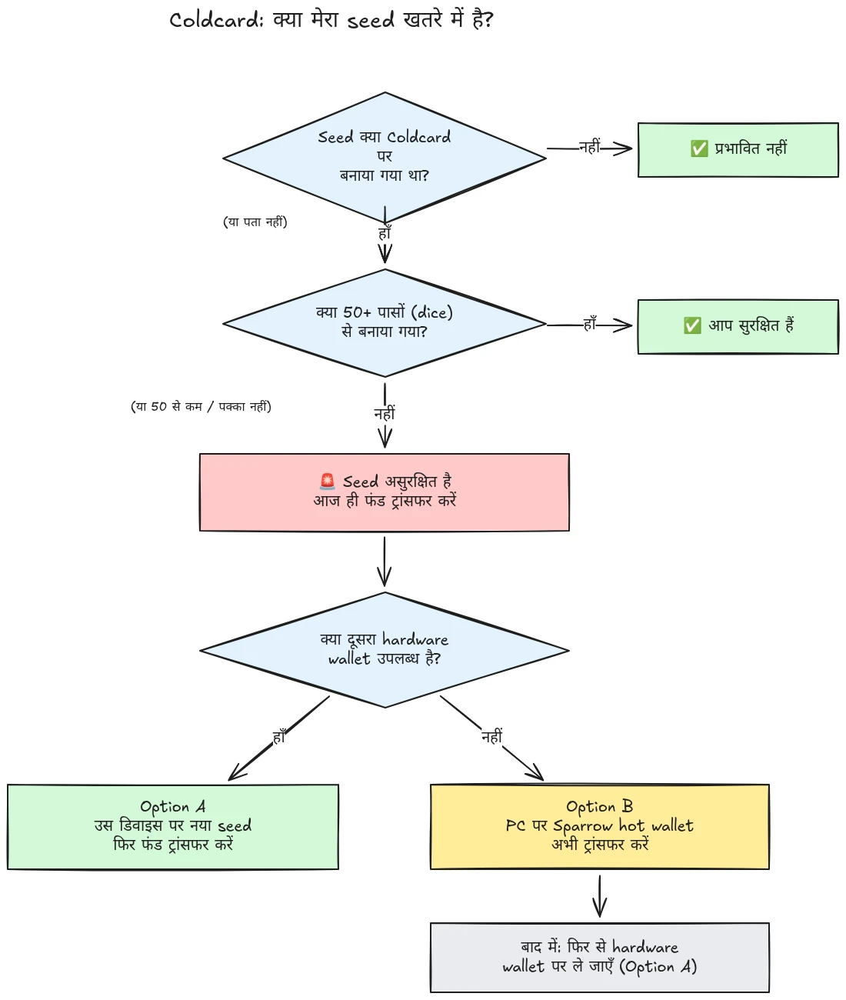

30 जुलाई 2026 को, लगभग 500 wallets से, जिनके seeds Coldcard hardware wallets पर generate किए गए थे, आधे घंटे से भी कम समय में लगभग 594 BTC (लगभग $38 million) चोरी हो गए, और हमला अभी भी जारी है। मूल कारण Coldcard devices के seed generation में firmware की एक खामी है: पर्याप्त hardware-generated randomness पर निर्भर रहने के बजाय, प्रभावित devices ने internal down-counter, device के serial number और internal clock जैसे predictable values मिला दिए। परिणामस्वरूप, इन devices पर generate हुए seed phrases में अपेक्षित से बहुत कम entropy होती है और attacker उन्हें **आपकी तरफ़ से किसी भी कार्रवाई के बिना** ढूँढ सकता है, न malware चाहिए, न phishing, न physical access। Attacker बस reduced key space में खोज करता है और जो भी wallet मिलता है उसे sweep कर देता है।

**सभी Coldcard models प्रभावित हैं: Mk3, Mk4, Mk5, और Q।** केवल वे seeds सुरक्षित माने जा रहे हैं जो dice roll method से generate किए गए हों, और वह भी तभी जब कम से कम 50 dice rolls इस्तेमाल किए गए हों। अगर आपको नहीं पता, याद नहीं है, या आप निश्चित नहीं हैं कि आपका seed कैसे generate हुआ था: उसे compromised मानें और अपने funds तुरंत move करें।

यह tutorial बताता है कि अपना exposure कैसे assess करें और अपने funds को सुरक्षित wallet में कैसे migrate करें, तेज़ी से, लेकिन प्रक्रिया में स्थिति को और खराब किए बिना।

## एक नज़र में: सरल निर्देश

Bitcoin security community सरल निर्देशों के एक fixed set पर coordinate कर रही है। वह यह है:

1. **क्या आपने अपना seed Coldcard पर 50+ physical dice rolls से generate किया था?** अगर हाँ, तो आप सुरक्षित हैं। अगर नहीं, या अगर आप निश्चित नहीं हैं, तो मानें कि seed compromised है।
2. **एक सुरक्षित destination तैयार करें**: अगर आपके पास तुरंत उपलब्ध हो तो किसी दूसरे vendor का hardware wallet, नहीं तो आपके computer पर generate किया गया Sparrow hot wallet (विवरण चरण 2 में)।
3. **आज ही अपने सारे funds वहाँ भेजें**, next block को target करने वाली fee के साथ, और confirmation का इंतज़ार करें (विवरण चरण 3 में)।
4. **Passphrase आपको समय देती है, सुरक्षा नहीं।** Attackers अभी passphrases grind करते हुए नहीं दिख रहे हैं; उनके शुरू करने से पहले migrate करें।
5. **अपना seed phrase कहीं भी type न करें** उसे "check" करने के लिए। जो भी आपके words माँग रहा है, वह scammer है।
6. **Firmware update करने से मौजूदा seed ठीक नहीं होता।** Vulnerable firmware द्वारा generate हुआ seed हमेशा weak रहता है; केवल नया seed और on-chain move ही आपके funds को सुरक्षित करते हैं।

इस tutorial का बाकी हिस्सा हर चरण को detail में समझाता है।

## क्या मैं प्रभावित हूँ?

खुद से एक सवाल पूछें: **seed कैसे generate हुआ था?**

- Seed **Coldcard ने खुद generate किया** (किसी भी model, Mk3, Mk4, Mk5, या Q, पर normal "new wallet" flow): **इसे compromised मानें**। अभी migrate करें।
- Seed Coldcard के **dice roll** feature से generate हुआ, और **कम से कम 50 physical dice rolls** आपने खुद किए: entropy आपके dice से आई, flawed generator से नहीं। अभी यही एकमात्र configuration है जिसे सुरक्षित माना जा रहा है।
- Dice roll में **50 से कम rolls** थे, या आपने device को entropy "complete" करने दिया: यह पर्याप्त नहीं है; इसे compromised मानें।
- Seed **किसी दूसरे (non-Coldcard) device से imported** था: Coldcard flaw उस seed पर लागू नहीं होती, लेकिन audit करें कि वह originally कहाँ से आया था।
- **आपको नहीं पता या याद नहीं है**: इसे compromised मानें। अनावश्यक migration की लागत transaction fee है; गलत अनुमान की लागत सब कुछ है।

तीन आम झूठे आश्वासन, जिनका स्पष्ट जवाब:

- प्रभावित seed के ऊपर लगी **BIP39 passphrase** wallet को सुरक्षित नहीं बनाती; वह केवल समय देती है। Seed खुद discoverable है, इसलिए आपकी passphrase ही एकमात्र barrier बन जाती है, और लोग आम तौर पर passphrase entropy का अनुमान लगाने में खराब होते हैं। Attackers अभी passphrases brute-force करते हुए नहीं दिख रहे हैं; उनके शुरू करने से पहले नए seed पर migrate करें।
- ऐसा **multisig** wallet जिसमें प्रभावित Coldcard key शामिल है, सिर्फ़ उस key से drain नहीं किया जा सकता, लेकिन प्रभावित key अब कोई वास्तविक security नहीं देती। उसे quorum से बिना देरी rotate out करें।
- **उसी seed वाला नया hardware wallet**: कई लोगों ने नया Coldcard (या कोई दूसरा device) खरीदा और अपना existing seed उस पर restore कर लिया। इससे कुछ नहीं बदलता: compromised device नहीं, seed है। अगर आपका seed किसी प्रभावित Coldcard पर generate हुआ था, तो वह जहाँ भी restore करें, weak ही रहता है। एक बिल्कुल नया seed generate करें और migrate करें।

## चरण 1: अभी कार्रवाई करें, लेकिन मनमानी न करें

जब आप यह पढ़ रहे हैं, wallets drain किए जा रहे हैं। सही रुख है **आज ही** migrate करना, ऐसे tools इस्तेमाल करते हुए जिन्हें आप समझते हैं; न कि किसी अपरिचित setup के साथ पाँच मिनट में transaction rush करके अपने coins शून्य में भेज देना।

सबसे पहले:

1. अपना Coldcard और अपना seed backup जहाँ हैं वहीं रखें। Migration transaction sign करने के लिए आपको अभी भी उनकी ज़रूरत है।
2. **अपना seed phrase किसी computer, phone, या website में "यह check करने के लिए कि यह प्रभावित है या नहीं" कभी type न करें।** कोई legitimate checker आपका seed नहीं माँगता। जो भी आपके 12 या 24 words माँग रहा है, वह इस incident का फायदा उठाने वाला scammer है, और ऐसे events के बाद phishing campaigns लगातार बढ़ती हैं।
3. सावधान रहें कि आप information कहाँ से ले रहे हैं। Coinkite की शुरुआती communications पहले कुछ दिनों में ही कई बार contradict हो चुकी हैं, इसलिए vendor को अपना एकमात्र source न मानें: independent security researchers और established Bitcoin news outlets से cross-check करें।

## चरण 2: सुरक्षित destination wallet तैयार करें

आपको ऐसा wallet चाहिए जिसका seed **Coldcard पर generate न किया गया हो**। आपके पास क्या उपलब्ध है, इसके आधार पर दो रास्ते हैं:

### विकल्प A: आपके पास कोई दूसरा hardware wallet उपलब्ध है

यह सबसे अच्छा रास्ता है। किसी दूसरे vendor के hardware wallet पर **नया seed** generate करें और अपने funds वहाँ migrate करें। मुख्य devices के लिए हमारे पास step-by-step tutorials हैं:

https://planb.academy/tutorials/wallet/hardware/jade-7d62bf0c-f460-4e68-9635-af9b731dabc3

https://planb.academy/tutorials/wallet/hardware/bitbox02-6af8940f-e19b-4008-8c83-81017032608c

https://planb.academy/tutorials/wallet/hardware/trezor-safe-3-51d0d669-5d23-47c2-beb6-cc6fa0fb0ea0

https://planb.academy/tutorials/wallet/hardware/ledger-flex-3728773e-74d4-4177-b39f-bd923700c76a

https://planb.academy/tutorials/wallet/hardware/passport-74e53858-3fa2-43f9-b866-573297546236

अधिकतम भरोसे के लिए, seed को **physical dice rolls (कम से कम 50 rolls)** से ऐसे device पर generate करें जो इसे support करता हो, ताकि entropy verifiably आपकी हो। और significant amounts के लिए, इस अवसर पर **अलग-अलग vendors के बीच multisig** पर move करें, ताकि किसी एक device की flaw फिर कभी अपने दम पर आपके funds को risk में न डाल सके।

### विकल्प B: कोई दूसरा hardware wallet उपलब्ध नहीं: funds को अभी secure करें

जब आपका seed searchable key space में पड़ा है, तब device deliver होने के लिए दिनों तक इंतज़ार न करें। एक **अस्थायी सुरक्षित ठिकाने** के रूप में, **अपने computer पर Sparrow Wallet के साथ सीधे generate किए गए** seed वाला hot wallet बनाएँ:

https://planb.academy/tutorials/wallet/desktop/sparrow-c674e2ac-d46f-4c82-92a7-7d1b0e262f5d

या, अपने phone पर, Blockstream App के साथ:

https://planb.academy/tutorials/wallet/mobile/blockstream-app-onchain-e84edaa9-fb65-48c1-a357-8a5f27996143

हाँ, hot wallet सामान्यतः hardware wallet से एक स्तर नीचे होता है, लेकिन जिस online computer को आप control करते हैं उस पर रखा seed अभी **attacker द्वारा compute किए जा सकने वाले Coldcard seed से ज़्यादा सुरक्षित है**। जब आपका नया hardware wallet आ जाए, तो विकल्प A follow करते हुए hot wallet से उस पर दूसरी migration करें।

पुराने funds को touch करने से पहले destination wallet पूरी तरह set up करें: seed generate करें, backup लिखें, और **recovery test perform करें**, अपने लिखे हुए backup से restore करके साबित करें कि वह काम करता है। फिर पहला receiving address generate करें और device screen पर verify करें।

https://planb.academy/tutorials/wallet/backup/recovery-test-5a75db51-a6a1-4338-a02a-164a8d91b895

अगर time pressure आपको recovery test skip करने पर मजबूर करे, तो migration amount को अपनी *निगरानी सूची* में रखें और कुछ दिनों के भीतर पूरा, tested setup फिर से करें।

## चरण 3: Funds स्थानांतरित करें

Desktop पर Sparrow Wallet जैसे wallet coordinator का उपयोग करें, जो Coldcard के साथ microSD के ज़रिए air-gapped या USB के ज़रिए काम करता है।

https://planb.academy/tutorials/wallet/desktop/sparrow-c674e2ac-d46f-4c82-92a7-7d1b0e262f5d

Migration की प्रक्रिया:

1. Sparrow में अपना **existing (affected) wallet load करें** watch-only wallet के रूप में, ठीक वैसे ही जैसे आपने पहली बार अपना Coldcard set up करते समय किया था।
2. अपने new wallet के receiving address पर funds भेजने वाला **transaction build करें**। New signing device की screen पर destination address को character by character verify करें।
3. **पर्याप्त fee दें।** यह कुछ sats बचाने का समय नहीं है: mempool में अटका transaction आपका exposure बढ़ाता है, क्योंकि attacker के पास भी आपकी private key है और वह आपकी migration के unconfirmed रहते हुए replace-by-fee double spend attempt कर सकता है। Next block या दो को target करने वाला fee rate इस्तेमाल करें।
4. हमेशा की तरह **अपने Coldcard से sign करें**, broadcast करें, और migration को complete मानने से पहले कम से कम एक confirmation का इंतज़ार करें। Transaction को confirm होने तक watch करें।
5. अगर आपके पास कई UTXOs हैं, तो सब कुछ single output में sweep करना उन सभी को on-chain link कर देता है। अगर आपका privacy model मायने रखता है, तो migration को कई transactions में split करें, लेकिन इस specific situation में, **security first, privacy second**। Privacy optimization को migration delay न करने दें।

https://planb.academy/tutorials/privacy/on-chain/utxo-labelling-d997f80f-8a96-45b5-8a4e-a3e1b7788c52

6. जब funds new wallet में confirm हो जाएँ, तो **old seed को हमेशा के लिए retire करें**। इसे reuse न करें, "small amounts के लिए रखने" की कोशिश न करें, और physical backups destroy करें ताकि वे बाद में आपको या आपके वारिसों को mislead न कर सकें।

## चरण 4: इसके बाद

- **कई sources से investigation follow करते रहें।** Affected configurations की understanding पहले ही एक से अधिक बार widen हो चुकी है, और vendor statements रास्ते में correct किए गए हैं। Coinkite की अपनी disclosures के साथ independent researchers और established Bitcoin media को track करें, और मानें कि picture अभी भी बदल सकती है।
- **Fixed firmware आ गया है, लेकिन वह existing seeds को rescue नहीं करता।** Coinkite ने patched firmware (Mk3 के लिए 4.2.0 या बाद का) release किया है। जिस भी Coldcard को आप use करते रहना चाहते हैं उसे update करें, लेकिन समझें कि update क्या करता है और क्या नहीं करता: यह आगे के लिए seed *generation* ठीक करता है; vulnerable firmware द्वारा generate किया गया seed हमेशा weak रहता है। अगर आप Coldcard use करते रहना चाहते हैं, तो पहले update करें, फिर बिल्कुल नया seed generate करें (ideally 50+ dice rolls के साथ) और अपने funds on-chain उस पर move करें।
- **संरचनात्मक सीख लें।** इस incident का मतलब यह नहीं है कि self-custody broken है; verifiable dice-roll entropy या multi-vendor multisig के पीछे रखे funds कभी risk में थे ही नहीं। इसका मतलब है कि किसी single device के random number generator पर भरोसा करना किसी भी अन्य चीज़ की तरह single point of failure है। Verifiable entropy (dice rolls), vendors के बीच multisig, और tested backups ही किसी setup को अगले vendor bug के प्रति robust बनाते हैं, vendor चाहे जो भी हो।
