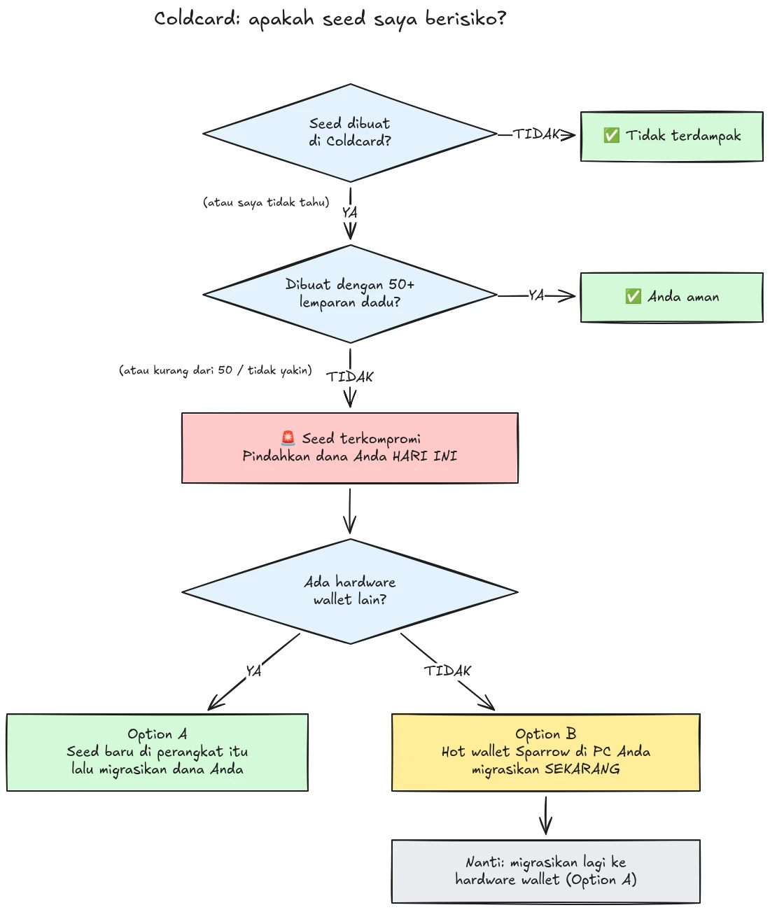

Pada 30 Juli 2026, sekitar 594 BTC (sekitar $38 juta) dicuri dalam waktu kurang dari setengah jam dari sekitar 500 dompet yang seed-nya dibuat pada dompet perangkat keras Coldcard, dan serangan ini masih berlangsung. Akar masalahnya adalah cacat firmware pada pembuatan seed perangkat Coldcard: alih-alih mengandalkan keacakan yang cukup dari perangkat keras, perangkat yang terdampak mencampurkan nilai-nilai yang dapat diprediksi seperti down-counter internal, nomor seri perangkat, dan clock internal. Akibatnya, frasa seed yang dibuat pada perangkat ini memiliki entropi jauh lebih rendah dari yang diharapkan dan dapat ditemukan oleh penyerang **tanpa perlu tindakan apa pun dari pihak Anda**, tanpa malware, tanpa phishing, tanpa akses fisik. Penyerang cukup mencari dalam ruang kunci yang telah menyempit dan menyapu (sweep) dompet mana pun yang mereka temukan.

**Semua model Coldcard terdampak: Mk3, Mk4, Mk5, dan Q.** Satu-satunya seed yang dianggap aman adalah yang dibuat dengan metode kocok dadu (dice roll), dan hanya jika digunakan minimal 50 kali kocokan dadu. Jika Anda tidak tahu, tidak ingat, atau tidak yakin bagaimana seed Anda dibuat: anggap seed itu telah terkompromi dan pindahkan dana Anda segera.

Tutorial ini menjelaskan cara menilai tingkat keterpaparan Anda dan cara memigrasikan dana Anda ke dompet yang aman, dengan cepat, tetapi tanpa memperburuk keadaan dalam prosesnya.

## Dalam satu kotak: instruksi sederhana

Komunitas keamanan Bitcoin sedang berkoordinasi seputar satu rangkaian instruksi sederhana yang tetap. Berikut isinya:

1. **Apakah Anda membuat seed dengan 50+ kocokan dadu fisik di Coldcard?** Jika ya, Anda aman. Jika tidak, atau jika Anda tidak yakin, anggap seed tersebut telah terkompromi.
2. **Siapkan tujuan yang aman**: dompet perangkat keras dari vendor lain jika Anda memilikinya, atau jika tidak, dompet panas Sparrow yang dibuat di komputer Anda (rincian di Langkah 2).
3. **Kirim semua dana Anda ke sana hari ini**, dengan biaya yang menargetkan blok berikutnya, dan tunggu hingga terkonfirmasi (rincian di Langkah 3).
4. **Passphrase membeli Anda waktu, bukan keamanan.** Penyerang tampaknya belum melakukan grinding passphrase, migrasikan sebelum mereka mulai.
5. **Jangan pernah mengetikkan frasa seed Anda di mana pun** untuk "memeriksanya". Siapa pun yang meminta kata-kata Anda adalah penipu.
6. **Memperbarui firmware tidak memperbaiki seed yang sudah ada.** Seed yang dibuat oleh firmware yang rentan akan tetap lemah selamanya; hanya seed baru dan perpindahan on-chain yang dapat mengamankan dana Anda.

Sisa tutorial ini akan membahas setiap langkah secara rinci.

## Apakah saya terdampak?

Tanyakan pada diri Anda satu pertanyaan: **bagaimana seed itu dibuat?**

- Seed dibuat **oleh Coldcard itu sendiri** (alur "dompet baru" normal, pada model apa pun, Mk3, Mk4, Mk5, atau Q): **anggap telah terkompromi**. Migrasikan sekarang.
- Seed dibuat dengan fitur **kocok dadu** Coldcard, dengan **minimal 50 kocokan dadu fisik** yang Anda lakukan sendiri: entropinya berasal dari dadu Anda, bukan dari generator yang cacat. Ini adalah satu-satunya konfigurasi yang saat ini dianggap aman.
- Kocok dadu dengan **kurang dari 50 kocokan**, atau Anda membiarkan perangkat "melengkapi" entropinya: tidak cukup, anggap telah terkompromi.
- Seed **diimpor dari perangkat lain (bukan Coldcard)**: cacat Coldcard tidak berlaku pada seed tersebut, tetapi periksa dari mana seed itu awalnya berasal.
- **Anda tidak tahu atau tidak ingat**: anggap telah terkompromi. Biaya migrasi yang sebenarnya tidak perlu hanyalah biaya transaksi; biaya dari dugaan yang salah adalah segalanya.

Tiga jaminan palsu yang umum, dibahas secara eksplisit:

- **Passphrase BIP39** di atas seed yang terdampak tidak membuat dompet menjadi aman, itu hanya membeli waktu. Seed itu sendiri dapat ditemukan, sehingga passphrase Anda menjadi satu-satunya penghalang, dan orang biasanya buruk dalam memperkirakan entropi passphrase. Penyerang tampaknya belum melakukan brute-force pada passphrase; migrasikan ke seed baru sebelum mereka mulai.
- Dompet **multisig** yang menyertakan kunci Coldcard yang terdampak tidak dapat dikuras hanya melalui kunci tersebut, tetapi kunci yang terdampak itu sudah tidak lagi memberikan keamanan nyata. Segera rotasi kunci itu keluar dari kuorum.
- **Dompet perangkat keras yang lebih baru dengan seed yang sama**: banyak orang membeli Coldcard yang lebih baru (atau perangkat lain) dan memulihkan seed lama mereka ke dalamnya. Itu tidak mengubah apa pun: yang terkompromi adalah seed-nya, bukan perangkatnya. Jika seed Anda dibuat pada Coldcard yang terdampak, seed itu akan tetap lemah di mana pun Anda memulihkannya. Buat seed baru dan migrasikan.

## Langkah 1: Bertindak sekarang, tetapi jangan berimprovisasi

Dompet-dompet sedang dikuras saat Anda membaca ini. Sikap yang benar adalah bermigrasi **hari ini juga**, menggunakan alat yang Anda pahami, bukan tergesa-gesa melakukan transaksi dalam lima menit dengan pengaturan yang tidak familiar dan mengirim koin Anda ke jurang.

Sebelum melakukan apa pun:

1. Simpan Coldcard dan cadangan seed Anda di tempatnya. Anda masih membutuhkannya untuk menandatangani transaksi migrasi.
2. **Jangan pernah mengetikkan frasa seed Anda ke komputer, ponsel, atau situs web mana pun "untuk memeriksa apakah itu terdampak".** Tidak ada pemeriksa yang sah yang membutuhkan seed Anda. Siapa pun yang meminta 12 atau 24 kata Anda adalah penipu yang mengeksploitasi insiden ini, dan kampanye phishing secara konsisten meningkat setelah kejadian seperti ini.
3. Berhati-hatilah dari mana Anda mendapatkan informasi. Komunikasi awal Coinkite sudah beberapa kali bertentangan satu sama lain dalam beberapa hari pertama, jadi jangan menjadikan vendor sebagai satu-satunya sumber Anda: silangkan informasi dengan peneliti keamanan independen dan media Bitcoin yang mapan.

## Langkah 2: Siapkan dompet tujuan yang aman

Anda memerlukan dompet yang seed-nya **tidak dibuat pada Coldcard**. Ada dua jalur, tergantung pada apa yang Anda miliki saat ini:

### Opsi A: Anda memiliki dompet perangkat keras lain

Ini adalah jalur terbaik. Buat **seed baru** pada dompet perangkat keras dari vendor lain dan migrasikan dana Anda ke sana. Kami memiliki tutorial langkah demi langkah untuk perangkat-perangkat utama:

https://planb.academy/tutorials/wallet/hardware/jade-7d62bf0c-f460-4e68-9635-af9b731dabc3

https://planb.academy/tutorials/wallet/hardware/bitbox02-6af8940f-e19b-4008-8c83-81017032608c

https://planb.academy/tutorials/wallet/hardware/trezor-safe-3-51d0d669-5d23-47c2-beb6-cc6fa0fb0ea0

https://planb.academy/tutorials/wallet/hardware/ledger-flex-3728773e-74d4-4177-b39f-bd923700c76a

https://planb.academy/tutorials/wallet/hardware/passport-74e53858-3fa2-43f9-b866-573297546236

Untuk jaminan maksimal, buat seed dari **kocokan dadu fisik (minimal 50 kocokan)** pada perangkat yang mendukungnya, sehingga entropinya dapat diverifikasi sebagai milik Anda sendiri. Dan untuk jumlah yang signifikan, manfaatkan kesempatan ini untuk beralih ke **multisig lintas vendor berbeda**, sehingga tidak ada satu pun cacat perangkat yang dapat lagi membahayakan dana Anda sendirian.

### Opsi B: Tidak ada dompet perangkat keras lain yang tersedia: amankan dana SEKARANG

Jangan menunggu berhari-hari sampai perangkat dikirim sementara seed Anda berada dalam ruang kunci yang dapat dicari. Sebagai **perlindungan sementara**, buat dompet panas dengan seed yang **dibuat langsung di komputer Anda dengan Sparrow Wallet**:

https://planb.academy/tutorials/wallet/desktop/sparrow-c674e2ac-d46f-4c82-92a7-7d1b0e262f5d

Atau, di ponsel Anda, dengan Blockstream App:

https://planb.academy/tutorials/wallet/mobile/blockstream-app-onchain-e84edaa9-fb65-48c1-a357-8a5f27996143

Ya, dompet panas biasanya merupakan langkah mundur dibandingkan dompet perangkat keras, tetapi seed pada komputer online yang Anda kendalikan saat ini **lebih aman daripada seed Coldcard yang dapat dihitung oleh penyerang**. Setelah dompet perangkat keras baru Anda tiba, lakukan migrasi kedua dari dompet panas ke dompet tersebut, mengikuti Opsi A.

Siapkan dompet tujuan sepenuhnya sebelum menyentuh dana lama Anda: buat seed, catat cadangannya, dan **lakukan uji pemulihan (recovery test)**, pulihkan dari cadangan tertulis Anda untuk membuktikan bahwa itu berfungsi. Kemudian buat alamat penerima pertama dan verifikasi pada layar perangkat.

https://planb.academy/tutorials/wallet/backup/recovery-test-5a75db51-a6a1-4338-a02a-164a8d91b895

Jika tekanan waktu memaksa Anda melewatkan uji pemulihan, simpan jumlah migrasi tersebut dalam *watch list* Anda dan ulangi pengaturan yang lengkap dan teruji dalam beberapa hari.

## Langkah 3: Pindahkan dana

Gunakan koordinator dompet seperti Sparrow Wallet di desktop, yang bekerja dengan Coldcard secara air-gapped melalui microSD atau melalui USB.

https://planb.academy/tutorials/wallet/desktop/sparrow-c674e2ac-d46f-4c82-92a7-7d1b0e262f5d

Migrasinya sendiri:

1. **Muat dompet Anda yang sudah ada (terdampak)** di Sparrow sebagai dompet watch-only, persis seperti saat Anda pertama kali menyiapkan Coldcard.
2. **Bangun sebuah transaksi** yang mengirimkan dana Anda ke alamat penerima dari dompet baru Anda. Verifikasi alamat tujuan pada layar perangkat penandatanganan yang baru, karakter demi karakter.
3. **Bayar biaya yang serius.** Ini bukan saat untuk menghemat beberapa sat: transaksi yang tersangkut di mempool memperpanjang keterpaparan Anda, karena penyerang juga memegang kunci privat Anda dan dapat mencoba melakukan replace-by-fee double spend terhadap migrasi Anda selama belum terkonfirmasi. Gunakan tarif biaya yang menargetkan satu atau dua blok berikutnya.
4. **Tanda tangani dengan Coldcard Anda** seperti biasa, siarkan (broadcast), dan tunggu setidaknya satu konfirmasi sebelum menganggap migrasi selesai. Awasi transaksi tersebut sampai terkonfirmasi.
5. Jika Anda memiliki banyak UTXO, menyapu semuanya ke dalam satu output akan menautkan semuanya secara on-chain. Jika model privasi Anda penting, pecah migrasi menjadi beberapa transaksi, tetapi dalam situasi khusus ini, **keamanan lebih dulu, privasi kemudian**. Jangan biarkan optimasi privasi menunda migrasi.

https://planb.academy/tutorials/privacy/on-chain/utxo-labelling-d997f80f-8a96-45b5-8a4e-a3e1b7788c52

6. Setelah dana terkonfirmasi di dompet baru, **pensiunkan seed lama secara permanen**. Jangan menggunakannya kembali, jangan "menyimpannya untuk jumlah kecil", dan hancurkan cadangan fisiknya agar tidak menyesatkan Anda atau ahli waris Anda di kemudian hari.

## Langkah 4: Setelahnya

- **Terus ikuti perkembangan investigasi, dari berbagai sumber.** Pemahaman tentang konfigurasi yang terdampak sudah melebar lebih dari sekali, dan pernyataan vendor telah dikoreksi sepanjang jalan. Ikuti peneliti independen dan media Bitcoin yang mapan bersamaan dengan pengungkapan resmi dari Coinkite, dan asumsikan gambaran ini masih dapat berubah.
- **Firmware yang diperbaiki sudah tersedia, tetapi tidak menyelamatkan seed yang sudah ada.** Coinkite telah merilis firmware yang telah ditambal (4.2.0 atau lebih baru untuk Mk3). Perbarui setiap Coldcard yang ingin Anda terus gunakan, tetapi pahami apa yang dilakukan dan tidak dilakukan oleh pembaruan tersebut: pembaruan ini memperbaiki *pembuatan* seed ke depannya; seed yang dibuat oleh firmware yang rentan akan tetap lemah selamanya. Jika Anda ingin terus menggunakan Coldcard, perbarui dulu, lalu buat seed yang benar-benar baru (idealnya dengan 50+ kocokan dadu) dan pindahkan dana Anda ke sana secara on-chain.
- **Ambil pelajaran struktural dari kejadian ini.** Insiden ini tidak berarti bahwa self-custody itu rusak, dana di balik entropi kocokan dadu yang dapat diverifikasi atau multisig lintas vendor tidak pernah berisiko. Ini berarti bahwa mempercayai generator angka acak dari satu perangkat saja adalah satu titik kegagalan (single point of failure) seperti yang lainnya. Entropi yang dapat diverifikasi (kocokan dadu), multisig lintas vendor, dan cadangan yang teruji adalah hal-hal yang membuat sebuah pengaturan tahan terhadap bug vendor berikutnya, siapa pun vendornya.
