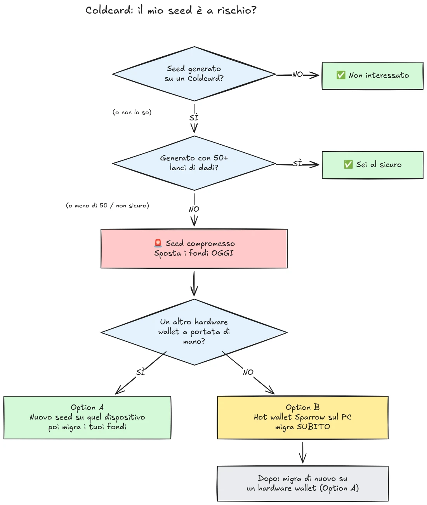

Il 30 luglio 2026, circa 594 BTC (circa 38 milioni di dollari) sono stati rubati in meno di mezz'ora da circa 500 wallet i cui seed erano stati generati su hardware wallet Coldcard, e l'attacco è ancora in corso. La causa principale è un difetto del firmware nella generazione del seed dei dispositivi Coldcard: invece di affidarsi a una casualità generata dall'hardware sufficiente, i dispositivi affetti mescolavano valori prevedibili come un contatore interno decrescente, il numero di serie del dispositivo e l'orologio interno. Di conseguenza, le seed phrase generate su questi dispositivi contengono molta meno entropia del previsto e possono essere trovate da un attaccante **senza alcuna azione da parte tua**, senza malware, senza phishing, senza accesso fisico richiesto. L'attaccante si limita a cercare nello spazio delle chiavi ridotto e a svuotare qualsiasi wallet trovi.

**Tutti i modelli Coldcard sono affetti: Mk3, Mk4, Mk5 e Q.** Gli unici seed considerati sicuri sono quelli generati con il metodo del lancio dei dadi, e solo se sono stati usati almeno 50 lanci di dadi. Se non sai, non ricordi, o non sei sicuro di come è stato generato il tuo seed: trattalo come compromesso e sposta i tuoi fondi immediatamente.

Questo tutorial spiega come valutare la tua esposizione e come migrare i tuoi fondi verso un wallet sicuro, rapidamente, ma senza peggiorare la situazione nel processo.

## In breve: le istruzioni semplici

La comunità della sicurezza Bitcoin si sta coordinando attorno a un unico insieme fisso di istruzioni semplici. Eccole:

1. **Hai generato il tuo seed con 50+ lanci fisici di dadi sul Coldcard?** Se sì, sei al sicuro. Se no, o se non sei sicuro, assumi che il seed sia compromesso.
2. **Prepara una destinazione sicura**: un hardware wallet di un altro produttore se ne hai uno a disposizione, altrimenti un hot wallet Sparrow generato sul tuo computer (dettagli nello Step 2).
3. **Invia tutti i tuoi fondi lì oggi stesso**, con una fee che punti al blocco successivo, e attendi una conferma (dettagli nello Step 3).
4. **Una passphrase ti compra tempo, non sicurezza.** Gli attaccanti non sembrano ancora forzare le passphrase, migra prima che inizino.
5. **Non digitare mai la tua seed phrase da nessuna parte** per "verificarla". Chiunque chieda le tue parole è un truffatore.
6. **Aggiornare il firmware non risolve un seed esistente.** Un seed generato da firmware vulnerabile resta debole per sempre; solo un nuovo seed e uno spostamento on-chain mettono al sicuro i tuoi fondi.

Il resto di questo tutorial ripercorre ogni step nel dettaglio.

## Sono affetto?

Fatti una sola domanda: **come è stato generato il seed?**

- Seed generato **dal Coldcard stesso** (il normale flusso "new wallet", su qualsiasi modello, Mk3, Mk4, Mk5 o Q): **trattalo come compromesso**. Migra subito.
- Seed generato con la funzione **lancio dei dadi** del Coldcard, con **almeno 50 lanci fisici di dadi** eseguiti personalmente da te: l'entropia proveniva dai tuoi dadi, non dal generatore difettoso. Questa è l'unica configurazione attualmente considerata sicura.
- Lancio dei dadi con **meno di 50 lanci**, oppure hai lasciato che il dispositivo "completasse" l'entropia: non sufficiente, trattalo come compromesso.
- Seed **importato da un altro dispositivo (non Coldcard)**: il difetto del Coldcard non si applica a quel seed, ma verifica da dove proveniva originariamente.
- **Non sai o non ricordi**: trattalo come compromesso. Il costo di una migrazione non necessaria è una fee di transazione; il costo di una supposizione sbagliata è tutto.

Tre rassicurazioni comuni ma false, affrontate esplicitamente:

- Una **passphrase BIP39** sopra un seed affetto non rende il wallet sicuro, compra solo tempo. Il seed stesso è scopribile, quindi la tua passphrase diventa l'unica barriera, e le persone sono generalmente scarse nello stimare l'entropia di una passphrase. Gli attaccanti non sembrano ancora forzare le passphrase con brute-force; migra verso un nuovo seed prima che inizino.
- Un wallet **multisig** che include una chiave Coldcard affetta non può essere svuotato tramite quella sola chiave, ma la chiave affetta non contribuisce più a una vera sicurezza. Ruotala fuori dal quorum senza ritardi.
- **Un hardware wallet più recente con lo stesso seed**: molte persone hanno acquistato un Coldcard più recente (o un altro dispositivo) e hanno ripristinato il loro seed esistente su di esso. Questo non cambia nulla: è il seed a essere compromesso, non il dispositivo. Se il tuo seed è stato generato su un Coldcard affetto, resta debole ovunque tu lo ripristini. Genera un seed completamente nuovo e migra.

## Step 1: Agisci subito, ma senza improvvisare

I wallet vengono svuotati mentre stai leggendo. La postura corretta è migrare **oggi**, usando strumenti che comprendi, non affrettare una transazione in cinque minuti con una configurazione non familiare e mandare le tue coin nel vuoto.

Prima di tutto:

1. Tieni il tuo Coldcard e il backup del tuo seed dove sono. Ti servono ancora per firmare la transazione di migrazione.
2. **Non digitare mai la tua seed phrase in nessun computer, telefono o sito web "per verificare se è affetta".** Nessun verificatore legittimo richiede il tuo seed. Chiunque chieda le tue 12 o 24 parole è un truffatore che sfrutta questo incidente, e le campagne di phishing tendono ad aumentare in modo affidabile dopo eventi come questo.
3. Fai attenzione a dove reperisci le tue informazioni. Le prime comunicazioni di Coinkite sono già state contraddette più volte nei primi giorni, quindi non trattare il produttore come la tua unica fonte: verifica incrociando ricercatori di sicurezza indipendenti e testate Bitcoin affermate.

## Step 2: Prepara un wallet di destinazione sicuro

Ti serve un wallet il cui seed **non sia stato generato su un Coldcard**. Due percorsi, a seconda di cosa hai a disposizione:

### Opzione A: Hai un altro hardware wallet a disposizione

Questo è il percorso migliore. Genera un **nuovo seed** su un hardware wallet di un altro produttore e migra lì i tuoi fondi. Abbiamo tutorial passo-passo per i dispositivi principali:

https://planb.academy/tutorials/wallet/hardware/jade-7d62bf0c-f460-4e68-9635-af9b731dabc3

https://planb.academy/tutorials/wallet/hardware/bitbox02-6af8940f-e19b-4008-8c83-81017032608c

https://planb.academy/tutorials/wallet/hardware/trezor-safe-3-51d0d669-5d23-47c2-beb6-cc6fa0fb0ea0

https://planb.academy/tutorials/wallet/hardware/ledger-flex-3728773e-74d4-4177-b39f-bd923700c76a

https://planb.academy/tutorials/wallet/hardware/passport-74e53858-3fa2-43f9-b866-573297546236

Per la massima sicurezza, genera il seed da **lanci fisici di dadi (almeno 50 lanci)** su un dispositivo che lo supporta, così l'entropia è verificabilmente tua. E per importi significativi, cogli l'occasione per passare a un **multisig tra produttori diversi**, in modo che nessun singolo difetto di dispositivo possa mai più mettere a rischio i tuoi fondi da solo.

### Opzione B: Nessun altro hardware wallet disponibile: metti al sicuro i fondi ORA

Non aspettare giorni per la consegna di un dispositivo mentre il tuo seed rimane in uno spazio delle chiavi ricercabile. Come **rifugio temporaneo**, crea un hot wallet con un seed **generato direttamente sul tuo computer con Sparrow Wallet**:

https://planb.academy/tutorials/wallet/desktop/sparrow-c674e2ac-d46f-4c82-92a7-7d1b0e262f5d

Oppure, sul tuo telefono, con la Blockstream App:

https://planb.academy/tutorials/wallet/mobile/blockstream-app-onchain-e84edaa9-fb65-48c1-a357-8a5f27996143

Sì, un hot wallet è normalmente un passo indietro rispetto a un hardware wallet, ma un seed su un computer online sotto il tuo controllo è attualmente **più sicuro di un seed Coldcard che un attaccante può calcolare**. Una volta arrivato il tuo nuovo hardware wallet, esegui una seconda migrazione dall'hot wallet verso di esso, seguendo l'Opzione A.

Configura completamente il wallet di destinazione prima di toccare i tuoi vecchi fondi: genera il seed, annota il backup, ed esegui un **test di recupero**, ripristina dal backup scritto per dimostrare che funziona. Poi genera un primo indirizzo di ricezione e verificalo sullo schermo del dispositivo.

https://planb.academy/tutorials/wallet/backup/recovery-test-5a75db51-a6a1-4338-a02a-164a8d91b895

Se la pressione del tempo ti costringe a saltare il test di recupero, tieni l'importo migrato nella tua *watch list* e rifai una configurazione completa e testata entro pochi giorni.

## Step 3: Sposta i fondi

Usa un coordinator come Sparrow Wallet su desktop, che funziona con il Coldcard air-gapped via microSD o via USB.

https://planb.academy/tutorials/wallet/desktop/sparrow-c674e2ac-d46f-4c82-92a7-7d1b0e262f5d

La migrazione vera e propria:

1. **Carica il tuo wallet esistente (affetto)** in Sparrow come wallet watch-only, esattamente come hai fatto quando hai configurato per la prima volta il tuo Coldcard.
2. **Costruisci una transazione** che invii i tuoi fondi a un indirizzo di ricezione del tuo nuovo wallet. Verifica l'indirizzo di destinazione sullo schermo del nuovo dispositivo di firma, carattere per carattere.
3. **Paga una fee seria.** Non è il momento di risparmiare qualche sat: una transazione bloccata nella mempool prolunga la tua esposizione, perché l'attaccante possiede anche la tua chiave privata e può tentare un double spend tramite replace-by-fee della tua migrazione mentre non è confermata. Usa una fee rate che punti al blocco successivo o al secondo.
4. **Firma con il tuo Coldcard** come al solito, trasmetti, e attendi almeno una conferma prima di considerare completata la migrazione. Osserva la transazione fino alla conferma.
5. Se possiedi molti UTXO, svuotarli tutti in un singolo output li collega tutti on-chain. Se il tuo modello di privacy conta, dividi la migrazione in più transazioni, ma in questa situazione specifica, **prima la sicurezza, poi la privacy**. Non lasciare che l'ottimizzazione della privacy ritardi la migrazione.

https://planb.academy/tutorials/privacy/on-chain/utxo-labelling-d997f80f-8a96-45b5-8a4e-a3e1b7788c52

6. Una volta che i fondi sono confermati sul nuovo wallet, **ritira il vecchio seed in modo permanente**. Non riutilizzarlo, non "tenerlo per piccoli importi", e distruggi i backup fisici affinché non possano trarre in inganno te o i tuoi eredi in futuro.

## Step 4: Conseguenze

- **Continua a seguire le indagini, da più fonti.** La comprensione delle configurazioni affette si è già ampliata più di una volta, e le dichiarazioni del produttore sono state corrette lungo il percorso. Tieni traccia di ricercatori indipendenti e media Bitcoin affermati insieme alle comunicazioni ufficiali di Coinkite, e assumi che il quadro possa ancora cambiare.
- **Il firmware corretto è disponibile, ma non salva i seed esistenti.** Coinkite ha rilasciato un firmware corretto (4.2.0 o successivo per il Mk3). Aggiorna qualsiasi Coldcard che intendi continuare a usare, ma comprendi cosa fa e cosa non fa l'aggiornamento: corregge la *generazione* del seed d'ora in avanti; un seed generato da firmware vulnerabile resta debole per sempre. Se vuoi continuare a usare un Coldcard, aggiorna prima, poi genera un seed completamente nuovo (idealmente con 50+ lanci di dadi) e sposta i tuoi fondi su di esso on-chain.
- **Trai la lezione strutturale.** Questo incidente non significa che il self-custody sia rotto, i fondi protetti da entropia verificabile con lancio di dadi o da multisig multi-produttore non sono mai stati a rischio. Significa che fidarsi del generatore di numeri casuali di un singolo dispositivo è un punto singolo di fallimento come qualsiasi altro. Entropia verificabile (lanci di dadi), multisig tra produttori, e backup testati sono ciò che rende una configurazione robusta rispetto al prossimo bug del produttore, chiunque esso sia.
