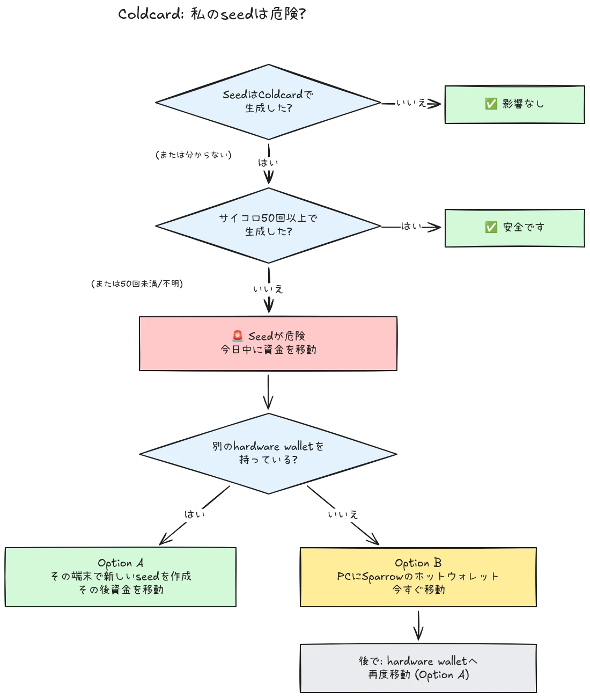

2026年7月30日、Coldcardハードウェアウォレットでシードを生成した約500のウォレットから、およそ594 BTC（約3,800万ドル）が30分足らずで盗まれました。そして攻撃は今も続いています。根本原因は、Coldcardデバイスのシード生成におけるファームウェアの欠陥です。影響を受けるデバイスは、十分なハードウェア生成のランダム性に頼る代わりに、内部ダウンカウンター、デバイスのシリアル番号、内部時計といった予測可能な値を混ぜていました。その結果、これらのデバイスで生成されたシードフレーズは期待されるよりはるかに少ないエントロピーしか含まず、攻撃者は**あなた側の行動なしに**それを見つけられます。マルウェアも、フィッシングも、物理アクセスも不要です。攻撃者は縮小された鍵空間を探索し、見つけたウォレットから資金を掃き出すだけです。

**すべてのColdcardモデルが影響を受けます：Mk3、Mk4、Mk5、Q。** 安全と見なされる唯一のシードは、ダイスロール方式で生成され、かつ少なくとも50回のサイコロ振りが使われたものだけです。シードがどのように生成されたか分からない、覚えていない、または確信が持てない場合は、侵害されたものとして扱い、直ちに資金を移動してください。

このチュートリアルでは、自分が影響を受けているかを評価する方法と、安全なウォレットへ資金を移行する方法を説明します。素早く、しかしその過程で状況を悪化させないように進めます。

## ひとつの枠で分かる: シンプルな指示

Bitcoinのセキュリティコミュニティは、固定された一組のシンプルな指示を中心に協調しています。以下がそれです：

1. **Coldcard上で50回以上、物理的にサイコロを振ってシードを生成しましたか？** はいなら安全です。いいえ、または確信が持てないなら、シードは侵害されたものと想定してください。
2. **安全な送金先を準備する**：手元に別ベンダーのハードウェアウォレットがあるならそれを使い、なければ自分のコンピューター上で生成したSparrowのホットウォレットを使います（詳細はStep 2）。
3. **今日中にすべての資金をそこへ送る**。次のブロックを狙う手数料を設定し、1承認を待ちます（詳細はStep 3）。
4. **パスフレーズが買ってくれるのは時間であり、安全性ではありません。** 攻撃者はまだパスフレーズの総当たりをしていないようです。始まる前に移行してください。
5. **「確認」のためにシードフレーズをどこにも入力しないでください。** あなたの単語を求める相手は全員詐欺師です。
6. **ファームウェアを更新しても既存のシードは直りません。** 脆弱なファームウェアで生成されたシードは永遠に弱いままです。資金を安全にするのは、新しいシードとオンチェーン移動だけです。

このチュートリアルの残りでは、各ステップを詳しく見ていきます。

## 私は影響を受けていますか？

自分にひとつだけ問いかけてください：**シードはどのように生成されましたか？**

- **Coldcard自体で**生成されたシード（通常の「new wallet」フロー、どのモデルでも, Mk3、Mk4、Mk5、Q）：**侵害されたものとして扱ってください**。今すぐ移行してください。
- Coldcardの**ダイスロール**機能で生成され、あなた自身が**少なくとも50回、物理的にサイコロを振った**シード：エントロピーは欠陥のある生成器ではなく、あなたのサイコロから来ています。現在安全と見なされている唯一の構成です。
- **50回未満のサイコロ振り**、またはデバイスにエントロピーを「補完」させた場合：不十分です。侵害されたものとして扱ってください。
- **別の（Coldcardではない）デバイスからインポートした**シード：Coldcardの欠陥はそのシードには適用されませんが、そのシードが元々どこから来たのかを監査してください。
- **分からない、または覚えていない**：侵害されたものとして扱ってください。不要な移行のコストはトランザクション手数料です。誤った推測のコストはすべてです。

よくある2つの誤った安心材料について、明確に説明します：

- 影響を受けるシードの上に**BIP39パスフレーズ**を追加しても、ウォレットは安全になりません。時間を買うだけです。シード自体は発見可能なので、パスフレーズだけが唯一の障壁になります。そして人は通常、パスフレーズのエントロピーを見積もるのが苦手です。攻撃者はまだパスフレーズの総当たりをしていないようです。始まる前に新しいシードへ移行してください。
- 影響を受けるColdcard鍵を含む**マルチシグ**ウォレットは、その鍵だけで資金を抜かれることはありません。しかし、影響を受ける鍵はもはや実質的なセキュリティに貢献しません。遅れずにクォーラムから外してください。

## Step 1: 今すぐ行動する。ただし即興で動かない

あなたがこれを読んでいる間にも、ウォレットから資金が抜かれています。正しい姿勢は、理解しているツールを使って**今日**移行することです。慣れない構成で5分以内に急いでトランザクションを作り、自分のビットコインを虚空へ送ってしまうことではありません。

何より先に：

1. Coldcardとシードのバックアップは今ある場所に置いたままにしてください。移行トランザクションに署名するために、まだ必要です。
2. **「影響を受けているか確認するため」に、コンピューター、スマートフォン、ウェブサイトへシードフレーズを入力しないでください。** 正当なチェッカーがシードを要求することはありません。あなたの12語または24語を求める相手は、この事件に便乗する詐欺師です。そして、このような出来事の後にはフィッシングキャンペーンが確実に急増します。
3. 情報はCoinkiteの公式ブログとサポートチャンネル、および定評あるBitcoinニュースソースからのみ入手してください。

## Step 2: 安全な送金先ウォレットを準備する

必要なのは、シードが**Coldcard上で生成されていない**ウォレットです。手元に何があるかによって、2つの道があります：

### Option A: 手元に別のハードウェアウォレットがある

これが最善の道です。別ベンダーのハードウェアウォレット上で**新しいシード**を生成し、そこへ資金を移行してください。主要デバイスについては、ステップごとのチュートリアルがあります：

https://planb.academy/tutorials/wallet/hardware/jade-7d62bf0c-f460-4e68-9635-af9b731dabc3

https://planb.academy/tutorials/wallet/hardware/bitbox02-6af8940f-e19b-4008-8c83-81017032608c

https://planb.academy/tutorials/wallet/hardware/trezor-safe-3-51d0d669-5d23-47c2-beb6-cc6fa0fb0ea0

https://planb.academy/tutorials/wallet/hardware/ledger-flex-3728773e-74d4-4177-b39f-bd923700c76a

https://planb.academy/tutorials/wallet/hardware/passport-74e53858-3fa2-43f9-b866-573297546236

最大限の確実性を求めるなら、対応しているデバイス上で**物理的なサイコロ振り（少なくとも50回）**からシードを生成してください。そうすれば、エントロピーが検証可能な形であなた自身のものになります。そして金額が大きい場合は、この機会に**異なるベンダーをまたぐマルチシグ**へ移行してください。そうすれば、単一デバイスの欠陥だけで再び資金が危険にさらされることはありません。

### Option B: 別のハードウェアウォレットがない：今すぐ資金を守る

あなたのシードが探索可能な鍵空間にある状態で、デバイスの配送を何日も待たないでください。**一時的な避難先**として、**自分のコンピューター上でSparrow Walletによって直接生成した**シードを持つホットウォレットを作成します：

https://planb.academy/tutorials/wallet/desktop/sparrow-c674e2ac-d46f-4c82-92a7-7d1b0e262f5d

または、スマートフォン上でBlockstream Appを使います：

https://planb.academy/tutorials/wallet/mobile/blockstream-app-onchain-e84edaa9-fb65-48c1-a357-8a5f27996143

はい、ホットウォレットは通常、ハードウェアウォレットより一段劣ります。しかし、あなたが管理するオンラインのコンピューター上のシードは、現時点では**攻撃者が計算できるColdcardシードより安全**です。新しいハードウェアウォレットが届いたら、Option Aに従って、ホットウォレットからそこへ2回目の移行を行ってください。

古い資金に触れる前に、送金先ウォレットを完全にセットアップしてください。シードを生成し、バックアップを書き留め、**リカバリーテストを実行します**。書き留めたバックアップから復元し、それが機能することを証明してください。その後、最初の受取アドレスを生成し、デバイス画面で確認します。

https://planb.academy/tutorials/wallet/backup/recovery-test-5a75db51-a6a1-4338-a02a-164a8d91b895

時間的な圧力でリカバリーテストを省かざるを得ない場合は、移行した金額を自分の*監視リスト*に入れておき、数日以内に完全にテスト済みのセットアップをやり直してください。

## Step 3: 資金を移動する

デスクトップのSparrow Walletのようなウォレットコーディネータを使います。Sparrow Walletは、microSD経由またはUSB経由で、エアギャップされたColdcardと連携できます。

https://planb.academy/tutorials/wallet/desktop/sparrow-c674e2ac-d46f-4c82-92a7-7d1b0e262f5d

移行そのものは次のとおりです：

1. **既存の（影響を受けている）ウォレットを読み込み**、Coldcardを最初にセットアップしたときとまったく同じように、Sparrowでウォッチオンリーウォレットとして扱います。
2. 新しいウォレットの受取アドレスへ資金を送る**トランザクションを作成します**。送金先アドレスを、新しい署名デバイスの画面上で1文字ずつ確認してください。
3. **十分な手数料を払ってください。** 今は数satsを節約する場面ではありません。メンプールに詰まったトランザクションは、あなたの露出時間を延ばします。攻撃者もあなたの秘密鍵を持っており、未承認の間にRBF（Replace-by-Fee）の二重支出であなたの移行を試みることができるからです。次の1〜2ブロックを狙う手数料率を使ってください。
4. 通常どおり**Coldcardで署名**し、ブロードキャストして、移行完了と見なす前に少なくとも1承認を待ちます。承認されるまでトランザクションを監視してください。
5. 多数のUTXOを保有している場合、すべてを単一のアウトプットへスイープすると、それらすべてがオンチェーンで結び付けられます。プライバシーモデルが重要なら、移行を複数のトランザクションに分けてください。ただし、この特定の状況では、**セキュリティが第一、プライバシーは第二**です。プライバシー最適化のために移行を遅らせてはいけません。

https://planb.academy/tutorials/privacy/on-chain/utxo-labelling-d997f80f-8a96-45b5-8a4e-a3e1b7788c52

6. 新しいウォレットで資金が承認されたら、**古いシードを永久に引退させてください**。再利用してはいけません。「少額用に残す」こともせず、物理バックアップを破棄して、後であなたや相続人を誤解させないようにしてください。

## Step 4: その後

- **Coinkiteの開示を追い続けてください。** 調査は進行中であり、影響を受ける構成についての理解はすでに一度広がっています。再び広がる可能性があると想定してください。
- **修正済みファームウェアは公開されています。ただし既存のシードは救えません。** Coinkiteはパッチ済みファームウェア（Mk3では4.2.0以降）をリリースしました。使い続けるつもりのColdcardは更新してください。ただし、その更新が何をするのか、何をしないのかを理解してください。更新は今後のシード*生成*を修正します。脆弱なファームウェアで生成されたシードは永遠に弱いままです。Coldcardを使い続けたい場合は、まず更新し、その後まったく新しいシード（理想的には50回以上のサイコロ振り）を生成し、オンチェーンでそこへ資金を移動してください。
- **構造的な教訓を引き出してください。** この事件は、セルフカストディが壊れていることを意味しません。検証可能なダイスロールエントロピーや複数ベンダーのマルチシグで守られていた資金は、一度も危険にさらされていません。これは、単一デバイスの乱数生成器を信頼することが、他のあらゆるものと同じ単一障害点であることを意味します。検証可能なエントロピー（サイコロ振り）、ベンダーをまたぐマルチシグ、テスト済みのバックアップこそが、ベンダーが誰であれ、次のベンダーバグに対してセットアップを堅牢にするものです。

https://planb.academy/tutorials/wallet/hardware/coldcard-co-sign-4ed0c269-29f9-4215-957d-e0deba3dcc8f
