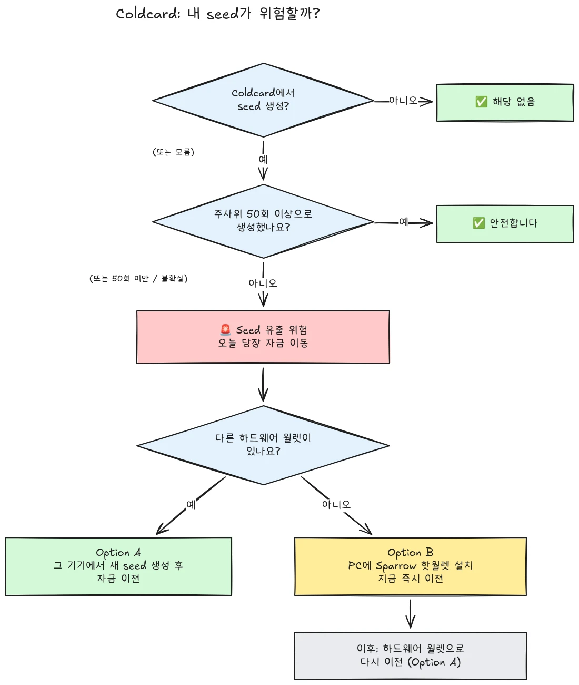

2026년 7월 30일, Coldcard 하드웨어 지갑에서 생성된 시드를 사용하던 약 500개의 지갑에서 대략 594 BTC(약 3,800만 달러)가 30분도 안 되어 도난당했으며, 공격은 아직도 진행 중입니다. 근본 원인은 Coldcard 기기의 시드 생성에 있는 펌웨어 결함입니다. 영향을 받는 기기는 충분한 하드웨어 생성 무작위성에 의존하는 대신, 내부 다운카운터, 기기의 일련번호, 내부 시계와 같은 예측 가능한 값을 섞었습니다. 그 결과, 이러한 기기에서 생성된 시드 문구는 기대보다 훨씬 낮은 엔트로피를 가지며, 공격자는 **사용자가 아무 조치도 하지 않아도** 이를 찾아낼 수 있습니다. 멀웨어도, 피싱도, 물리적 접근도 필요 없습니다. 공격자는 축소된 키 공간을 검색하고 발견한 지갑을 쓸어가기만 하면 됩니다.

**모든 Coldcard 모델이 영향을 받습니다: Mk3, Mk4, Mk5, Q.** 안전하다고 간주되는 유일한 시드는 주사위 굴림 방식으로 생성된 시드이며, 이 경우에도 최소 50번 이상의 주사위 굴림이 사용된 경우에만 해당합니다. 시드가 어떻게 생성되었는지 모르거나, 기억나지 않거나, 확신이 없다면 손상된 것으로 간주하고 즉시 자금을 옮기세요.

이 튜토리얼은 노출 여부를 평가하고 자금을 안전한 지갑으로 이전하는 방법을 설명합니다. 빠르게 진행하되, 그 과정에서 상황을 더 악화시키지 않는 것이 중요합니다.

## 한 상자 안의 간단한 지침

Bitcoin 보안 커뮤니티는 하나의 고정된 간단한 지침 세트를 중심으로 협력하고 있습니다. 다음과 같습니다:

1. **Coldcard에서 물리적 주사위를 50번 이상 굴려 시드를 생성했나요?** 그렇다면 안전합니다. 아니라면, 또는 확실하지 않다면, 시드가 손상되었다고 가정하세요.
2. **안전한 목적지를 준비하세요**: 손에 다른 제조사의 하드웨어 지갑이 있다면 그것을 사용하고, 없다면 컴퓨터에서 생성한 Sparrow 핫 지갑을 사용하세요(자세한 내용은 Step 2).
3. **오늘 모든 자금을 그곳으로 보내세요**. 다음 블록을 목표로 하는 수수료를 지불하고, 한 번의 확인을 기다리세요(자세한 내용은 Step 3).
4. **passphrase는 시간을 벌어줄 뿐, 안전을 보장하지 않습니다.** 공격자들이 아직 passphrase를 대입 공격하는 것으로 보이지는 않습니다. 그들이 시작하기 전에 이전하세요.
5. **“확인”을 위해서라도 시드 문구를 어디에도 입력하지 마세요.** 단어를 요구하는 사람은 누구든 사기꾼입니다.
6. **펌웨어 업데이트는 기존 시드를 고치지 않습니다.** 취약한 펌웨어로 생성된 시드는 영원히 약한 상태로 남습니다. 오직 새 시드와 온체인 이동만이 자금을 안전하게 합니다.

이 튜토리얼의 나머지 부분에서는 각 단계를 자세히 안내합니다.

## 내가 영향을 받았나요?

스스로에게 한 가지 질문을 하세요: **시드는 어떻게 생성되었나요?**

- **Coldcard 자체에서** 생성된 시드(어떤 모델이든, Mk3, Mk4, Mk5, Q에서 일반적인 “새 지갑” 흐름으로 생성): **손상된 것으로 간주하세요**. 지금 이전하세요.
- Coldcard의 **주사위 굴림** 기능으로 생성된 시드이며, 사용자가 직접 수행한 **최소 50번의 물리적 주사위 굴림**이 포함된 경우: 엔트로피는 결함 있는 생성기가 아니라 사용자의 주사위에서 나온 것입니다. 이것이 현재 안전하다고 간주되는 유일한 구성입니다.
- **50번 미만의 굴림**으로 주사위를 굴렸거나, 기기가 엔트로피를 “완성”하도록 두었다면: 충분하지 않습니다. 손상된 것으로 간주하세요.
- **다른(Coldcard가 아닌) 기기에서 가져온** 시드: Coldcard 결함은 해당 시드에 적용되지 않지만, 그 시드가 원래 어디에서 왔는지는 점검하세요.
- **모르거나 기억나지 않는 경우**: 손상된 것으로 간주하세요. 불필요한 이전의 비용은 트랜잭션 수수료지만, 잘못된 추측의 비용은 전부입니다.

자주 나오는 두 가지 잘못된 안심을 명확히 짚고 넘어가겠습니다:

- 영향을 받은 시드 위에 **BIP39 passphrase**를 사용해도 지갑이 안전해지지는 않습니다. 시간을 벌어줄 뿐입니다. 시드 자체는 발견될 수 있으므로 passphrase가 유일한 장벽이 되며, 사람들은 보통 passphrase 엔트로피를 잘못 추정합니다. 공격자들이 아직 passphrase를 무차별 대입하는 것으로 보이지는 않습니다. 그들이 시작하기 전에 새 시드로 이전하세요.
- 영향을 받은 Coldcard 키가 포함된 **멀티시그** 지갑은 그 키 하나만으로 털릴 수는 없지만, 영향을 받은 키는 더 이상 실질적인 보안에 기여하지 않습니다. 지체 없이 그 키를 정족수에서 제거하고 교체하세요.

## Step 1: 지금 행동하되, 즉흥적으로 하지 마세요

이 글을 읽는 지금도 지갑들이 털리고 있습니다. 올바른 자세는 **오늘** 이전하는 것입니다. 다만 이해하지 못하는 설정으로 5분 만에 급하게 트랜잭션을 만들어 코인을 허공으로 보내는 것이 아니라, 자신이 이해하는 도구를 사용해야 합니다.

무엇보다 먼저:

1. Coldcard와 시드 백업은 그대로 두세요. 이전 트랜잭션에 서명하려면 여전히 필요합니다.
2. **“영향을 받았는지 확인”하기 위해 시드 문구를 컴퓨터, 휴대폰, 웹사이트 어디에도 입력하지 마세요.** 합법적인 확인 도구는 시드를 요구하지 않습니다. 12개 또는 24개의 단어를 요구하는 사람은 누구든 이 사건을 악용하는 사기꾼입니다. 이런 사건 이후에는 피싱 캠페인이 항상 급증합니다.
3. 정보는 Coinkite의 공식 블로그와 지원 채널, 그리고 신뢰받는 Bitcoin 뉴스 출처에서만 얻으세요.

## Step 2: 안전한 목적지 지갑을 준비하세요

**Coldcard에서 생성되지 않은** 시드를 가진 지갑이 필요합니다. 지금 가지고 있는 것에 따라 두 가지 경로가 있습니다:

### Option A: 손에 다른 하드웨어 지갑이 있는 경우

이것이 가장 좋은 경로입니다. 다른 제조사의 하드웨어 지갑에서 **새 시드**를 생성하고 자금을 그곳으로 이전하세요. 주요 기기에 대한 단계별 튜토리얼이 있습니다:

https://planb.academy/tutorials/wallet/hardware/jade-7d62bf0c-f460-4e68-9635-af9b731dabc3

https://planb.academy/tutorials/wallet/hardware/bitbox02-6af8940f-e19b-4008-8c83-81017032608c

https://planb.academy/tutorials/wallet/hardware/trezor-safe-3-51d0d669-5d23-47c2-beb6-cc6fa0fb0ea0

https://planb.academy/tutorials/wallet/hardware/ledger-flex-3728773e-74d4-4177-b39f-bd923700c76a

https://planb.academy/tutorials/wallet/hardware/passport-74e53858-3fa2-43f9-b866-573297546236

최대한 확실하게 하려면 이를 지원하는 기기에서 **물리적 주사위 굴림(최소 50번)**으로 시드를 생성하세요. 그러면 엔트로피가 검증 가능하게 사용자의 것이 됩니다. 또한 큰 금액이라면 이 기회에 **서로 다른 제조사에 걸친 멀티시그**로 옮기세요. 그러면 단일 기기 결함 하나만으로 다시는 자금이 위험해지지 않습니다.

### Option B: 사용할 수 있는 다른 하드웨어 지갑이 없는 경우: 지금 자금을 보호하세요

시드가 검색 가능한 키 공간에 놓여 있는 동안 기기가 배송되기까지 며칠을 기다리지 마세요. **임시 피난처**로, **컴퓨터에서 Sparrow Wallet로 직접 생성한** 시드를 사용하는 핫 지갑을 만드세요:

https://planb.academy/tutorials/wallet/desktop/sparrow-c674e2ac-d46f-4c82-92a7-7d1b0e262f5d

또는 휴대폰에서는 Blockstream App을 사용할 수 있습니다:

https://planb.academy/tutorials/wallet/mobile/blockstream-app-onchain-e84edaa9-fb65-48c1-a357-8a5f27996143

맞습니다. 핫 지갑은 보통 하드웨어 지갑보다 보안 수준이 낮습니다. 하지만 사용자가 제어하는 온라인 컴퓨터의 시드는 현재 **공격자가 계산할 수 있는 Coldcard 시드보다 안전합니다**. 새 하드웨어 지갑이 도착하면 Option A에 따라 핫 지갑에서 그 지갑으로 두 번째 이전을 하세요.

기존 자금을 건드리기 전에 목적지 지갑을 완전히 설정하세요. 시드를 생성하고, 백업을 적어 두고, **복구 테스트를 수행하세요**. 적어 둔 백업으로 복원하여 제대로 작동하는지 증명하는 것입니다. 그런 다음 첫 번째 수신 주소를 생성하고 기기 화면에서 확인하세요.

https://planb.academy/tutorials/wallet/backup/recovery-test-5a75db51-a6a1-4338-a02a-164a8d91b895

시간 압박 때문에 복구 테스트를 건너뛰어야 한다면, 이전한 금액을 *관찰 목록*에 유지하고 며칠 안에 전체 설정을 다시 만들고 테스트까지 완료하세요.

## Step 3: 자금을 옮기세요

데스크톱의 Sparrow Wallet 같은 지갑 코디네이터를 사용하세요. Sparrow Wallet은 microSD 또는 USB를 통해 Coldcard와 에어갭 방식으로 작동합니다.

https://planb.academy/tutorials/wallet/desktop/sparrow-c674e2ac-d46f-4c82-92a7-7d1b0e262f5d

이전 자체는 다음과 같습니다:

1. 처음 Coldcard를 설정했을 때와 똑같이, Sparrow에서 **기존(영향을 받은) 지갑을** 조회 전용 지갑으로 불러오세요.
2. 새 지갑의 수신 주소로 자금을 보내는 **트랜잭션을 구성하세요**. 새 서명 기기의 화면에서 목적지 주소를 한 글자씩 확인하세요.
3. **충분히 높은 수수료를 지불하세요.** 지금은 몇 sats를 아낄 때가 아닙니다. 멤풀에 걸린 트랜잭션은 노출 시간을 늘립니다. 공격자도 사용자의 개인 키를 가지고 있으므로, 이전 트랜잭션이 확인되지 않은 동안 replace-by-fee 이중 지불을 시도할 수 있습니다. 다음 한두 블록을 목표로 하는 수수료율을 사용하세요.
4. 평소처럼 **Coldcard로 서명하고**, 브로드캐스트한 뒤, 이전이 완료되었다고 보기 전에 최소 한 번의 확인을 기다리세요. 트랜잭션이 확인될 때까지 지켜보세요.
5. 많은 UTXO를 보유하고 있다면 모든 것을 단일 출력으로 쓸어 담는 것은 온체인에서 그 모두를 연결합니다. 프라이버시 모델이 중요하다면 이전을 여러 트랜잭션으로 나누세요. 하지만 이 특정 상황에서는 **보안이 먼저, 프라이버시는 그다음**입니다. 프라이버시 최적화가 이전을 지연시키게 두지 마세요.

https://planb.academy/tutorials/privacy/on-chain/utxo-labelling-d997f80f-8a96-45b5-8a4e-a3e1b7788c52

6. 자금이 새 지갑에서 확인되면 **기존 시드를 영구적으로 폐기하세요**. 재사용하지 말고, “소액용으로 보관”하지도 말고, 나중에 사용자나 상속인을 오도하지 않도록 물리적 백업을 파기하세요.

## Step 4: 사후 조치

- **Coinkite의 공개 내용을 계속 확인하세요.** 조사는 진행 중이며, 영향을 받는 구성에 대한 이해는 이미 한 차례 넓어졌습니다. 다시 넓어질 수 있다고 가정하세요.
- **수정된 펌웨어가 나왔지만, 기존 시드를 구해주지는 않습니다.** Coinkite는 패치된 펌웨어(Mk3의 경우 4.2.0 이상)를 공개했습니다. 계속 사용할 Coldcard가 있다면 업데이트하세요. 다만 업데이트가 하는 것과 하지 않는 것을 이해해야 합니다. 업데이트는 앞으로의 시드 *생성*을 고칩니다. 취약한 펌웨어로 생성된 시드는 영원히 약한 상태로 남습니다. Coldcard를 계속 사용하고 싶다면 먼저 업데이트한 뒤, 완전히 새로운 시드(이상적으로는 주사위 굴림 50회 이상으로)를 생성하고 자금을 온체인으로 그곳에 옮기세요.
- **구조적 교훈을 얻으세요.** 이 사건은 자기 수탁이 망가졌다는 뜻이 아닙니다. 검증 가능한 주사위 굴림 엔트로피나 여러 제조사에 걸친 멀티시그 뒤에 있던 자금은 애초에 위험하지 않았습니다. 이것은 단일 기기의 난수 생성기를 신뢰하는 일이 다른 것과 마찬가지로 단일 장애 지점이라는 뜻입니다. 검증 가능한 엔트로피(주사위 굴림), 여러 제조사에 걸친 멀티시그, 테스트된 백업이야말로 제조사가 누구든 다음 제조사 버그에도 견딜 수 있는 견고한 설정을 만듭니다.

https://planb.academy/tutorials/wallet/hardware/coldcard-co-sign-4ed0c269-29f9-4215-957d-e0deba3dcc8f
