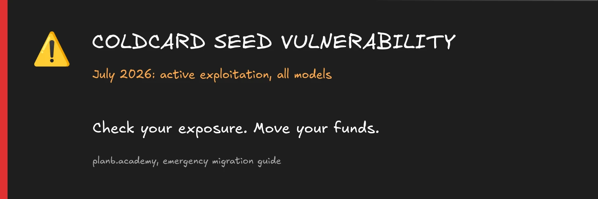
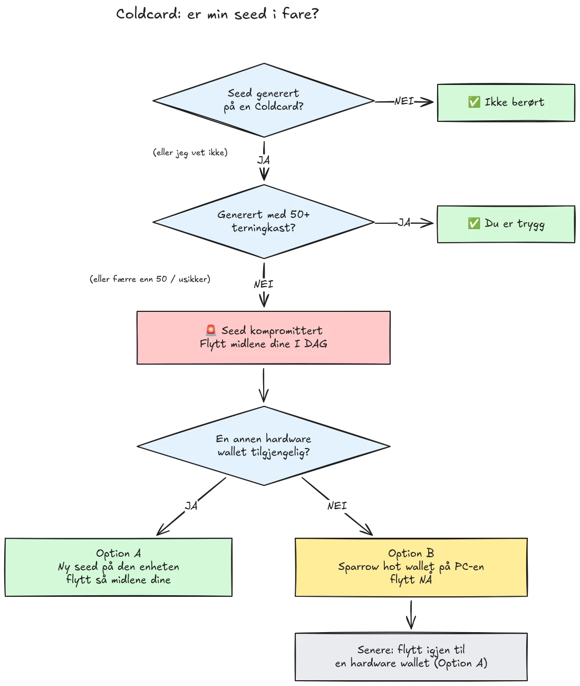

Den 30. juli 2026 ble omtrent 594 BTC (rundt 38 millioner dollar) stjålet på under en halvtime fra rundt 500 lommebøker hvis seeder var generert på Coldcard maskinvarelommebøker, og angrepet pågår fortsatt. Rotårsaken er en feil i fastvaren for seed-generering på Coldcard-enheter: i stedet for å basere seg på tilstrekkelig maskinvaregenerert tilfeldighet, blandet de berørte enhetene inn forutsigbare verdier som en intern nedtellingsteller, enhetens serienummer og den interne klokken. Som følge av dette inneholder seed-fraser generert på disse enhetene langt mindre entropi enn forventet, og kan finnes av en angriper **uten noen handling fra din side**, ingen skadevare, ingen phishing, ingen fysisk tilgang kreves. Angriperen søker ganske enkelt gjennom det reduserte nøkkelrommet og tømmer enhver lommebok de finner.

**Alle Coldcard-modeller er berørt: Mk3, Mk4, Mk5 og Q.** De eneste seedene som anses som trygge, er de som er generert med terningkast-metoden, og bare hvis minst 50 terningkast ble brukt. Hvis du ikke vet, ikke husker, eller ikke er sikker på hvordan seeden din ble generert: behandle den som kompromittert og flytt midlene dine umiddelbart.

Denne opplæringen forklarer hvordan du vurderer din eksponering og hvordan du migrerer midlene dine til en sikker lommebok, raskt, men uten å gjøre ting verre underveis.

## I én boks: de enkle instruksjonene

Bitcoin-sikkerhetsmiljøet koordinerer seg rundt ett fast sett med enkle instruksjoner. Her er det:

1. **Genererte du seeden din med 50+ fysiske terningkast på Coldcarden?** Hvis ja, er du trygg. Hvis nei, eller hvis du ikke er sikker, anta at seeden er kompromittert.
2. **Forbered en trygg destinasjon**: en maskinvarelommebok fra en annen leverandør hvis du har en for hånden, ellers en Sparrow hot wallet generert på datamaskinen din (detaljer i steg 2).
3. **Send alle midlene dine dit i dag**, med en gebyrsats som sikter mot neste blokk, og vent på en bekreftelse (detaljer i steg 3).
4. **En passfrase kjøper deg tid, ikke sikkerhet.** Angripere ser foreløpig ikke ut til å brute-force-e passfraser, migrer før de begynner.
5. **Skriv aldri inn seed-frasen din noe sted** for å "sjekke" den. Alle som ber om ordene dine er en svindler.
6. **Å oppdatere fastvaren fikser ikke en eksisterende seed.** En seed generert av sårbar fastvare forblir svak for alltid; bare en ny seed og en on-chain-flytting sikrer midlene dine.

Resten av denne opplæringen går gjennom hvert steg i detalj.

## Er jeg berørt?

Still deg selv ett spørsmål: **hvordan ble seeden generert?**

- Seed generert **av Coldcarden selv** (den vanlige "ny lommebok"-flyten, på alle modeller, Mk3, Mk4, Mk5 eller Q): **behandle den som kompromittert**. Migrer nå.
- Seed generert med Coldcardens **terningkast**-funksjon, med **minst 50 fysiske terningkast** som du selv utførte: entropien kom fra terningene dine, ikke fra den mangelfulle generatoren. Dette er den eneste konfigurasjonen som for øyeblikket anses som trygg.
- Terningkast med **færre enn 50 kast**, eller du lot enheten "fullføre" entropien: ikke nok, behandle den som kompromittert.
- Seed **importert fra en annen (ikke-Coldcard) enhet**: Coldcard-feilen gjelder ikke for den seeden, men undersøk hvor den opprinnelig kom fra.
- **Du vet ikke eller husker ikke**: behandle den som kompromittert. Kostnaden ved en unødvendig migrering er en transaksjonsavgift; kostnaden ved en feil gjetning er alt.

Tre vanlige falske betryggelser, adressert direkte:

- En **BIP39-passfrase** på toppen av en berørt seed gjør ikke lommeboken trygg, den kjøper bare tid. Selve seeden er oppdagbar, så passfrasen din blir den eneste barrieren, og folk er vanligvis dårlige til å anslå passfrase-entropi. Angripere ser foreløpig ikke ut til å brute-force-e passfraser; migrer til en ny seed før de begynner.
- En **multisig**-lommebok som inkluderer en berørt Coldcard-nøkkel kan ikke tømmes gjennom den nøkkelen alene, men den berørte nøkkelen bidrar ikke lenger med reell sikkerhet. Roter den ut av kvorumet uten forsinkelse.
- **En nyere maskinvarelommebok med samme seed**: mange kjøpte en nyere Coldcard (eller en annen enhet) og gjenopprettet sin eksisterende seed på den. Det endrer ingenting: det er seeden som er kompromittert, ikke enheten. Hvis seeden din ble generert på en berørt Coldcard, forblir den svak uansett hvor du gjenoppretter den. Generer en helt ny seed og migrer.

## Steg 1: Handle nå, men ikke improviser

Lommebøker blir tømt mens du leser dette. Den riktige holdningen er å migrere **i dag**, med verktøy du forstår, ikke å haste gjennom en transaksjon på fem minutter med et ukjent oppsett og sende myntene dine ut i intet.

Før noe annet:

1. Behold Coldcarden og seed-backupen din der de er. Du trenger dem fortsatt for å signere migreringstransaksjonen.
2. **Skriv aldri seed-frasen din inn i noen datamaskin, telefon eller nettside "for å sjekke om den er berørt".** Ingen legitim sjekker krever seeden din. Alle som ber om dine 12 eller 24 ord er en svindler som utnytter denne hendelsen, og phishing-kampanjer øker pålitelig etter hendelser som denne.
3. Vær forsiktig med hvor du henter informasjonen din fra. Coinkites tidlige kommunikasjon har allerede blitt motsagt flere ganger i løpet av de første dagene, så ikke behandle leverandøren som din eneste kilde: kryssjekk med uavhengige sikkerhetsforskere og etablerte Bitcoin-nyhetskilder.

## Steg 2: Forbered en trygg destinasjonslommebok

Du trenger en lommebok hvis seed **ikke ble generert på en Coldcard**. To veier, avhengig av hva du har for hånden:

### Alternativ A: Du har en annen maskinvarelommebok for hånden

Dette er den beste veien. Generer en **ny seed** på en maskinvarelommebok fra en annen leverandør og migrer midlene dine dit. Vi har steg-for-steg-opplæringer for de viktigste enhetene:

https://planb.academy/tutorials/wallet/hardware/jade-7d62bf0c-f460-4e68-9635-af9b731dabc3

https://planb.academy/tutorials/wallet/hardware/bitbox02-6af8940f-e19b-4008-8c83-81017032608c

https://planb.academy/tutorials/wallet/hardware/trezor-safe-3-51d0d669-5d23-47c2-beb6-cc6fa0fb0ea0

https://planb.academy/tutorials/wallet/hardware/ledger-flex-3728773e-74d4-4177-b39f-bd923700c76a

https://planb.academy/tutorials/wallet/hardware/passport-74e53858-3fa2-43f9-b866-573297546236

For maksimal sikkerhet, generer seeden fra **fysiske terningkast (minst 50 kast)** på en enhet som støtter det, slik at entropien er verifiserbart din. Og for betydelige beløp, bruk denne anledningen til å flytte til **multisig på tvers av ulike leverandører**, slik at ingen enkelt enhetsfeil noensinne igjen kan sette midlene dine i fare på egen hånd.

### Alternativ B: Ingen annen maskinvarelommebok tilgjengelig: sikre midlene NÅ

Ikke vent i dagevis på at en enhet skal leveres mens seeden din ligger i et søkbart nøkkelrom. Som et **midlertidig tilfluktssted**, opprett en hot wallet med en seed **generert direkte på datamaskinen din med Sparrow Wallet**:

https://planb.academy/tutorials/wallet/desktop/sparrow-c674e2ac-d46f-4c82-92a7-7d1b0e262f5d

Eller, på telefonen din, med Blockstream App:

https://planb.academy/tutorials/wallet/mobile/blockstream-app-onchain-e84edaa9-fb65-48c1-a357-8a5f27996143

Ja, en hot wallet er normalt et steg ned fra en maskinvarelommebok, men en seed på en datamaskin tilkoblet internett som du kontrollerer, er for øyeblikket **tryggere enn en Coldcard-seed en angriper kan beregne**. Når den nye maskinvarelommeboken din ankommer, gjør du en ny migrering fra hot walleten til den, i tråd med alternativ A.

Sett opp destinasjonslommeboken fullstendig før du rører de gamle midlene dine: generer seeden, skriv ned backupen, og **utfør en gjenopprettingstest**, gjenopprett fra den skriftlige backupen din for å bevise at den fungerer. Generer deretter en første mottaksadresse og verifiser den på enhetens skjerm.

https://planb.academy/tutorials/wallet/backup/recovery-test-5a75db51-a6a1-4338-a02a-164a8d91b895

Hvis tidspresset tvinger deg til å hoppe over gjenopprettingstesten, hold migreringsbeløpet på din *watch list* og gjør et fullt, testet oppsett på nytt i løpet av noen dager.

## Steg 3: Flytt midlene

Bruk en lommebok-koordinator som Sparrow Wallet på skrivebordet, som fungerer med Coldcarden air-gapped via microSD eller via USB.

https://planb.academy/tutorials/wallet/desktop/sparrow-c674e2ac-d46f-4c82-92a7-7d1b0e262f5d

Selve migreringen:

1. **Last inn din eksisterende (berørte) lommebok** i Sparrow som en watch-only lommebok, akkurat slik du gjorde da du først satte opp Coldcarden din.
2. **Bygg en transaksjon** som sender midlene dine til en mottaksadresse i din nye lommebok. Verifiser destinasjonsadressen på skjermen til den nye signeringsenheten, tegn for tegn.
3. **Betal et seriøst gebyr.** Dette er ikke tidspunktet for å spare noen få sats: en transaksjon som sitter fast i mempoolen forlenger eksponeringen din, fordi angriperen også har din private nøkkel og kan forsøke et replace-by-fee-dobbeltforbruk av migreringen din mens den er ubekreftet. Bruk en gebyrsats som sikter mot neste blokk eller to.
4. **Signer med Coldcarden din** som vanlig, kringkast, og vent på minst én bekreftelse før du anser migreringen som ferdig. Følg med på transaksjonen til den bekreftes.
5. Hvis du har mange UTXO-er, vil det å tømme alt inn i én enkelt output koble dem alle sammen on-chain. Hvis personvernmodellen din betyr noe, del migreringen opp i flere transaksjoner, men i denne spesifikke situasjonen, **sikkerhet først, personvern nummer to**. Ikke la personvernoptimalisering forsinke migreringen.

https://planb.academy/tutorials/privacy/on-chain/utxo-labelling-d997f80f-8a96-45b5-8a4e-a3e1b7788c52

6. Når midlene er bekreftet i den nye lommeboken, **pensjoner du den gamle seeden permanent**. Ikke gjenbruk den, ikke "behold den for småbeløp", og ødelegg de fysiske backupene slik at de ikke kan villede deg eller dine arvinger senere.

## Steg 4: Etterspill

- **Fortsett å følge etterforskningen, fra flere kilder.** Forståelsen av berørte konfigurasjoner har allerede blitt utvidet mer enn én gang, og leverandørens uttalelser har blitt korrigert underveis. Følg med på uavhengige forskere og etablerte Bitcoin-medier ved siden av Coinkites egne kunngjøringer, og anta at bildet fortsatt kan endre seg.
- **Fikset fastvare er ute, men den redder ikke eksisterende seeder.** Coinkite har gitt ut oppdatert fastvare (4.2.0 eller nyere for Mk3). Oppdater enhver Coldcard du har tenkt å fortsette å bruke, men forstå hva oppdateringen gjør og ikke gjør: den fikser seed*-generering* fremover; en seed generert av sårbar fastvare forblir svak for alltid. Hvis du vil fortsette å bruke en Coldcard, oppdater først, generer deretter en helt ny seed (helst med 50+ terningkast) og flytt midlene dine til den on-chain.
- **Trekk den strukturelle lærdommen.** Denne hendelsen betyr ikke at selvforvaring er ødelagt, midler bak verifiserbar terningkast-entropi eller multisig på tvers av leverandører var aldri i fare. Det betyr at det å stole på én enkelt enhets tilfeldighetsgenerator er et enkelt feilpunkt som ethvert annet. Verifiserbar entropi (terningkast), multisig på tvers av leverandører, og testede backuper er det som gjør et oppsett robust mot neste leverandørfeil, uansett hvem leverandøren er.
