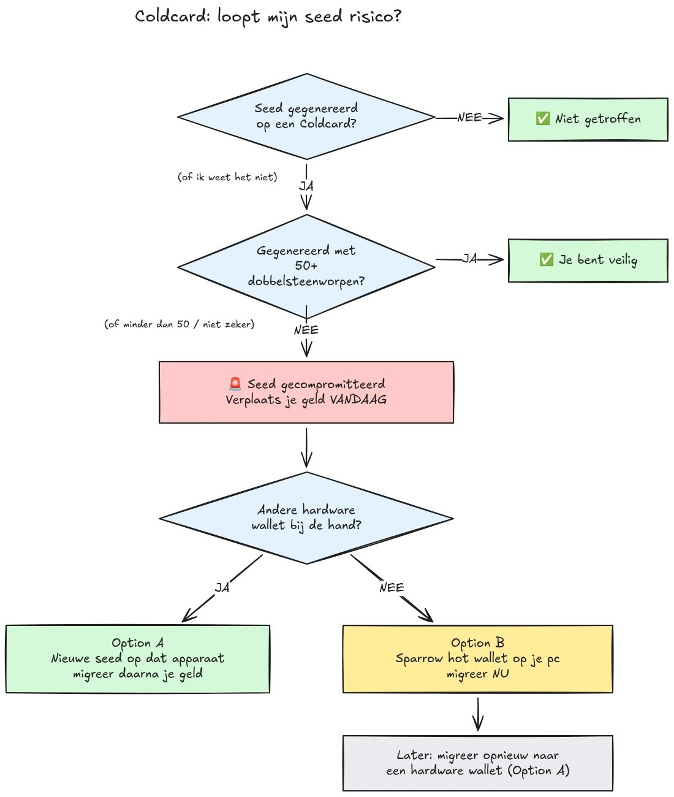

Op 30 juli 2026 werd ongeveer 594 BTC (zo'n $38 miljoen) in minder dan een half uur gestolen van ongeveer 500 wallets waarvan de seeds waren gegenereerd op Coldcard hardware wallets, en de aanval is nog steeds bezig. De hoofdoorzaak is een firmwarefout in de seedgeneratie van Coldcard-apparaten: in plaats van te vertrouwen op voldoende hardware-gegenereerde willekeur, mengden de getroffen apparaten voorspelbare waarden erin, zoals een interne afteller, het serienummer van het apparaat en de interne klok. Hierdoor bevatten seed phrases die op deze apparaten zijn gegenereerd veel minder entropie dan verwacht en kunnen ze door een aanvaller worden gevonden **zonder enige actie van jouw kant**, geen malware, geen phishing, geen fysieke toegang vereist. De aanvaller doorzoekt eenvoudigweg de verkleinde keyspace en veegt elke wallet leeg die hij vindt.

**Alle Coldcard-modellen zijn getroffen: Mk3, Mk4, Mk5 en Q.** De enige seeds die als veilig worden beschouwd, zijn die welke zijn gegenereerd met de dobbelsteenmethode, en alleen als er minstens 50 worpen zijn gebruikt. Als je niet weet, je niet herinnert of niet zeker weet hoe jouw seed is gegenereerd: behandel hem als gecompromitteerd en verplaats je geld onmiddellijk.

Deze tutorial legt uit hoe je jouw blootstelling inschat en hoe je jouw geld snel migreert naar een veilige wallet, zonder de zaak in het proces erger te maken.

## In één kader: de simpele instructies

De Bitcoin-beveiligingsgemeenschap coördineert rond één vaste set eenvoudige instructies. Hier is die:

1. **Heb je jouw seed gegenereerd met 50+ fysieke dobbelsteenworpen op de Coldcard?** Zo ja, dan ben je veilig. Zo niet, of als je het niet zeker weet, ga er dan van uit dat de seed gecompromitteerd is.
2. **Bereid een veilige bestemming voor**: een hardware wallet van een andere fabrikant als je die bij de hand hebt, anders een Sparrow hot wallet gegenereerd op je computer (details in Stap 2).
3. **Stuur al je geld daar vandaag naartoe**, met een fee gericht op het volgende blok, en wacht op een bevestiging (details in Stap 3).
4. **Een passphrase koopt je tijd, geen veiligheid.** Aanvallers lijken passphrases nog niet te kraken, migreer voordat ze daarmee beginnen.
5. **Typ je seed phrase nooit ergens in** om hem te "controleren". Iedereen die om jouw woorden vraagt, is een oplichter.
6. **Firmware updaten repareert een bestaande seed niet.** Een seed die door kwetsbare firmware is gegenereerd, blijft voor altijd zwak; alleen een nieuwe seed en een on-chain verplaatsing beveiligen jouw geld.

De rest van deze tutorial loopt elke stap in detail door.

## Ben ik getroffen?

Stel jezelf één vraag: **hoe is de seed gegenereerd?**

- Seed gegenereerd **door de Coldcard zelf** (de normale "nieuwe wallet"-flow, op elk model, Mk3, Mk4, Mk5 of Q): **behandel als gecompromitteerd**. Migreer nu.
- Seed gegenereerd met de **dobbelsteen**-functie van Coldcard, met **minstens 50 fysieke dobbelsteenworpen** die je zelf hebt uitgevoerd: de entropie kwam van je dobbelstenen, niet van de gebrekkige generator. Dit is de enige configuratie die momenteel als veilig wordt beschouwd.
- Dobbelsteenworp met **minder dan 50 worpen**, of je liet het apparaat de entropie "aanvullen": niet genoeg, behandel als gecompromitteerd.
- Seed **geïmporteerd van een ander (niet-Coldcard) apparaat**: de Coldcard-fout geldt niet voor die seed, maar controleer waar hij oorspronkelijk vandaan kwam.
- **Je weet het niet of herinnert het je niet**: behandel als gecompromitteerd. De kosten van een onnodige migratie zijn een transactiefee; de kosten van een verkeerde gok zijn alles.

Drie veelvoorkomende valse geruststellingen, expliciet behandeld:

- Een **BIP39-passphrase** bovenop een getroffen seed maakt de wallet niet veilig, het koopt alleen tijd. De seed zelf is achterhaalbaar, dus jouw passphrase wordt de enige barrière, en mensen schatten passphrase-entropie meestal slecht in. Aanvallers lijken passphrases nog niet te brute-forcen; migreer naar een nieuwe seed voordat ze daarmee beginnen.
- Een **multisig**-wallet die een getroffen Coldcard-key bevat, kan niet via die key alleen worden leeggehaald, maar de getroffen key draagt geen echte beveiliging meer bij. Roteer hem zonder uitstel uit het quorum.
- **Een nieuwer hardware wallet met dezelfde seed**: veel mensen kochten een nieuwere Coldcard (of een ander apparaat) en herstelden hun bestaande seed erop. Dat verandert niets: de seed is wat gecompromitteerd is, niet het apparaat. Als jouw seed op een getroffen Coldcard is gegenereerd, blijft hij zwak waar je hem ook herstelt. Genereer een gloednieuwe seed en migreer.

## Stap 1: Handel nu, maar improviseer niet

Wallets worden leeggehaald terwijl je dit leest. De juiste houding is om **vandaag** te migreren, met tools die je begrijpt, niet om binnen vijf minuten een transactie door te jagen met een onbekende setup en je coins de leegte in te sturen.

Voordat je iets anders doet:

1. Bewaar je Coldcard en je seed-backup waar ze zijn. Je hebt ze nog nodig om de migratietransactie te ondertekenen.
2. **Typ je seed phrase nooit in op een computer, telefoon of website "om te controleren of hij getroffen is".** Geen enkele legitieme checker heeft jouw seed nodig. Iedereen die om jouw 12 of 24 woorden vraagt, is een oplichter die dit incident uitbuit, en phishingcampagnes nemen na dit soort gebeurtenissen betrouwbaar toe.
3. Wees voorzichtig waar je jouw informatie vandaan haalt. Coinkite's eerste communicatie is de afgelopen dagen al meerdere keren tegengesproken, dus behandel de fabrikant niet als jouw enige bron: controleer kruislings bij onafhankelijke beveiligingsonderzoekers en gevestigde Bitcoin-nieuwskanalen.

## Stap 2: Bereid een veilige bestemmingswallet voor

Je hebt een wallet nodig waarvan de seed **niet op een Coldcard is gegenereerd**. Twee paden, afhankelijk van wat je bij de hand hebt:

### Optie A: Je hebt een andere hardware wallet bij de hand

Dit is het beste pad. Genereer een **nieuwe seed** op een hardware wallet van een andere fabrikant en migreer je geld daarnaartoe. We hebben stapsgewijze tutorials voor de belangrijkste apparaten:

https://planb.academy/tutorials/wallet/hardware/jade-7d62bf0c-f460-4e68-9635-af9b731dabc3

https://planb.academy/tutorials/wallet/hardware/bitbox02-6af8940f-e19b-4008-8c83-81017032608c

https://planb.academy/tutorials/wallet/hardware/trezor-safe-3-51d0d669-5d23-47c2-beb6-cc6fa0fb0ea0

https://planb.academy/tutorials/wallet/hardware/ledger-flex-3728773e-74d4-4177-b39f-bd923700c76a

https://planb.academy/tutorials/wallet/hardware/passport-74e53858-3fa2-43f9-b866-573297546236

Genereer voor maximale zekerheid de seed met **fysieke dobbelsteenworpen (minstens 50 worpen)** op een apparaat dat dit ondersteunt, zodat de entropie aantoonbaar van jou is. En grijp voor significante bedragen deze gelegenheid aan om over te stappen op **multisig verspreid over verschillende fabrikanten**, zodat nooit meer één enkele apparaatfout jouw geld op zichzelf in gevaar kan brengen.

### Optie B: Geen andere hardware wallet beschikbaar: beveilig het geld NU

Wacht niet dagenlang op de levering van een apparaat terwijl jouw seed in een doorzoekbare keyspace ligt. Creëer als **tijdelijke toevlucht** een hot wallet met een seed die **rechtstreeks op je computer met Sparrow Wallet is gegenereerd**:

https://planb.academy/tutorials/wallet/desktop/sparrow-c674e2ac-d46f-4c82-92a7-7d1b0e262f5d

Of, op je telefoon, met de Blockstream App:

https://planb.academy/tutorials/wallet/mobile/blockstream-app-onchain-e84edaa9-fb65-48c1-a357-8a5f27996143

Ja, een hot wallet is normaal gesproken een stap terug ten opzichte van een hardware wallet, maar een seed op een online computer die jij beheert is momenteel **veiliger dan een Coldcard-seed die een aanvaller kan berekenen**. Zodra jouw nieuwe hardware wallet arriveert, doe je een tweede migratie van de hot wallet ernaartoe, volgens Optie A.

Zet de bestemmingswallet volledig op voordat je jouw oude geld aanraakt: genereer de seed, schrijf de backup op, en **voer een hersteltest uit**, herstel vanaf jouw geschreven backup om te bewijzen dat het werkt. Genereer vervolgens een eerste ontvangstadres en verifieer het op het scherm van het apparaat.

https://planb.academy/tutorials/wallet/backup/recovery-test-5a75db51-a6a1-4338-a02a-164a8d91b895

Als tijdsdruk je dwingt de hersteltest over te slaan, houd het migratiebedrag dan op jouw *watch list* en herdoe binnen enkele dagen een volledige, geteste opzet.

## Stap 3: Verplaats het geld

Gebruik een wallet-coördinator zoals Sparrow Wallet op desktop, die werkt met de Coldcard air-gapped via microSD of via USB.

https://planb.academy/tutorials/wallet/desktop/sparrow-c674e2ac-d46f-4c82-92a7-7d1b0e262f5d

De migratie zelf:

1. **Laad jouw bestaande (getroffen) wallet** in Sparrow als een watch-only wallet, precies zoals je deed toen je jouw Coldcard voor het eerst instelde.
2. **Bouw een transactie** die jouw geld naar een ontvangstadres van jouw nieuwe wallet stuurt. Verifieer het bestemmingsadres op het scherm van het nieuwe ondertekeningsapparaat, karakter voor karakter.
3. **Betaal een serieuze fee.** Dit is niet het moment om een paar sats te besparen: een transactie die in de mempool vastzit, verlengt jouw blootstelling, omdat de aanvaller ook jouw private key bezit en een replace-by-fee dubbele uitgave van jouw migratie kan proberen zolang die onbevestigd is. Gebruik een fee rate gericht op het volgende blok of twee.
4. **Onderteken met jouw Coldcard** zoals gebruikelijk, broadcast, en wacht op minstens één bevestiging voordat je de migratie als voltooid beschouwt. Houd de transactie in de gaten totdat ze bevestigd is.
5. Als je veel UTXO's bezit, koppelt het samenvegen van alles in één output al die UTXO's on-chain aan elkaar. Als jouw privacymodel belangrijk is, splits de migratie dan in meerdere transacties, maar in deze specifieke situatie geldt: **veiligheid eerst, privacy tweede**. Laat privacyoptimalisatie de migratie niet vertragen.

https://planb.academy/tutorials/privacy/on-chain/utxo-labelling-d997f80f-8a96-45b5-8a4e-a3e1b7788c52

6. Zodra het geld bevestigd is bij de nieuwe wallet, **trek de oude seed permanent in**. Gebruik hem niet opnieuw, houd hem niet "aan voor kleine bedragen", en vernietig de fysieke backups zodat ze jou of jouw erfgenamen later niet kunnen misleiden.

## Stap 4: Nasleep

- **Blijf het onderzoek volgen, vanuit meerdere bronnen.** Het beeld van welke configuraties getroffen zijn, is al meer dan eens verbreed, en fabrikantverklaringen zijn onderweg gecorrigeerd. Volg onafhankelijke onderzoekers en gevestigde Bitcoin-media naast Coinkite's eigen bekendmakingen, en ga ervan uit dat het beeld nog kan veranderen.
- **Gerepareerde firmware is beschikbaar, maar redt bestaande seeds niet.** Coinkite heeft gepatchte firmware uitgebracht (4.2.0 of later voor de Mk3). Update elke Coldcard die je wilt blijven gebruiken, maar begrijp wat de update wel en niet doet: hij repareert seed *generatie* voortaan; een seed die door kwetsbare firmware is gegenereerd, blijft voor altijd zwak. Als je een Coldcard wilt blijven gebruiken, update dan eerst, genereer vervolgens een gloednieuwe seed (idealiter met 50+ dobbelsteenworpen) en verplaats jouw geld er on-chain naartoe.
- **Trek de structurele les.** Dit incident betekent niet dat self-custody kapot is, geld achter verifieerbare dobbelsteenentropie of multisig over meerdere fabrikanten liep nooit gevaar. Het betekent dat vertrouwen op de randomnummergenerator van één enkel apparaat een single point of failure is zoals elk ander. Verifieerbare entropie (dobbelsteenworpen), multisig over fabrikanten heen, en geteste backups zijn wat een opzet robuust maakt tegen de volgende fabrikantbug, wie de fabrikant ook is.
