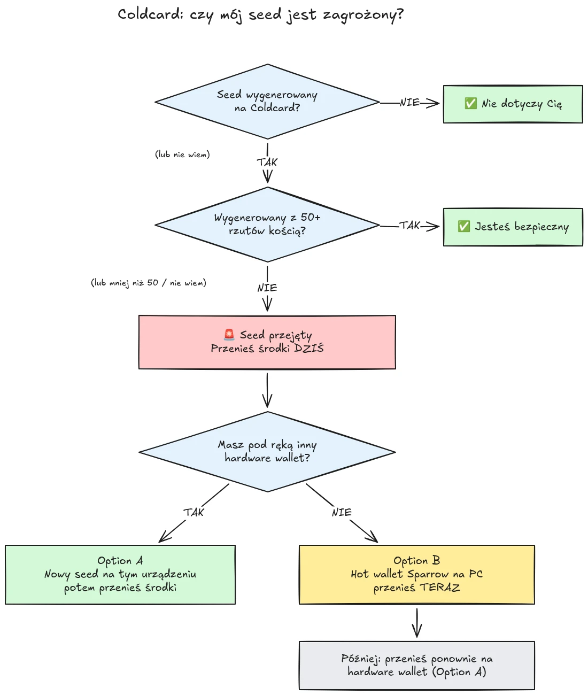

30 lipca 2026 roku w niecałe pół godziny skradziono około 594 BTC (mniej więcej 38 milionów dolarów) z blisko 500 portfeli, których seedy zostały wygenerowane na hardware walletach Coldcard, a atak wciąż trwa. Źródłem problemu jest błąd firmware'u w generowaniu seeda w urządzeniach Coldcard: zamiast oprzeć się na wystarczającej losowości generowanej sprzętowo, dotknięte urządzenia domieszywały przewidywalne wartości, takie jak wewnętrzny licznik odliczający w dół, numer seryjny urządzenia i zegar wewnętrzny. W efekcie frazy seed wygenerowane na tych urządzeniach zawierają znacznie mniej entropii, niż powinny, i mogą zostać odnalezione przez atakującego **bez żadnego działania z twojej strony**, bez złośliwego oprogramowania, bez phishingu, bez dostępu fizycznego. Atakujący po prostu przeszukuje zredukowaną przestrzeń kluczy i opróżnia każdy znaleziony portfel.

**Problem dotyczy wszystkich modeli Coldcard: Mk3, Mk4, Mk5 i Q.** Za bezpieczne uznaje się wyłącznie seedy wygenerowane metodą rzutów kością, i to tylko wtedy, gdy wykonano co najmniej 50 rzutów. Jeśli nie wiesz, nie pamiętasz albo nie masz pewności, jak został wygenerowany twój seed: potraktuj go jako przejęty i natychmiast przenieś swoje środki.

Ten samouczek wyjaśnia, jak ocenić swoje narażenie i jak przenieść środki do bezpiecznego portfela, szybko, ale bez pogarszania sytuacji po drodze.

## W pigułce: proste instrukcje

Społeczność zajmująca się bezpieczeństwem Bitcoina koordynuje działania wokół jednego ustalonego zestawu prostych instrukcji. Oto on:

1. **Czy wygenerowałeś swój seed za pomocą 50+ fizycznych rzutów kością na Coldcardzie?** Jeśli tak, jesteś bezpieczny. Jeśli nie, albo jeśli nie masz pewności, załóż, że seed jest przejęty.
2. **Przygotuj bezpieczne miejsce docelowe**: hardware wallet innego producenta, jeśli masz taki pod ręką, w przeciwnym razie hot wallet Sparrow wygenerowany na twoim komputerze (szczegóły w Kroku 2).
3. **Wyślij tam dziś wszystkie swoje środki**, z opłatą nastawioną na następny blok, i poczekaj na potwierdzenie (szczegóły w Kroku 3).
4. **Passphrase kupuje ci czas, a nie bezpieczeństwo.** Wygląda na to, że atakujący nie łamią jeszcze passphrase'ów metodą siłową, przenieś środki, zanim zaczną.
5. **Nigdy nigdzie nie wpisuj swojej frazy seed**, żeby ją "sprawdzić". Każdy, kto prosi cię o twoje słowa, jest oszustem.
6. **Aktualizacja firmware'u nie naprawia istniejącego seeda.** Seed wygenerowany przez podatny firmware pozostanie słaby na zawsze; tylko nowy seed i przeniesienie środków on-chain je zabezpieczą.

Dalsza część tego samouczka omawia każdy krok szczegółowo.

## Czy mnie to dotyczy?

Zadaj sobie jedno pytanie: **jak został wygenerowany seed?**

- Seed wygenerowany **przez sam Coldcard** (zwykła ścieżka "nowego portfela", na dowolnym modelu, Mk3, Mk4, Mk5 lub Q): **potraktuj go jako przejęty**. Przenieś środki teraz.
- Seed wygenerowany funkcją **rzutów kością** Coldcarda, z **co najmniej 50 fizycznymi rzutami**, które wykonałeś samodzielnie: entropia pochodziła z twojej kości, a nie z wadliwego generatora. To jedyna konfiguracja obecnie uznawana za bezpieczną.
- Rzuty kością przy **mniej niż 50 rzutach** albo sytuacja, w której pozwoliłeś urządzeniu "uzupełnić" entropię: to za mało, potraktuj seed jako przejęty.
- Seed **zaimportowany z innego urządzenia (nie Coldcard)**: błąd Coldcarda nie dotyczy tego seeda, ale sprawdź, skąd pierwotnie pochodził.
- **Nie wiesz albo nie pamiętasz**: potraktuj seed jako przejęty. Kosztem niepotrzebnego przeniesienia jest opłata transakcyjna; kosztem błędnego założenia jest wszystko.

Dwa częste fałszywe pocieszenia, wprost wyjaśnione:

- **Passphrase BIP39** nałożony na dotknięty problemem seed nie czyni portfela bezpiecznym, jedynie kupuje czas. Sam seed da się odnaleźć, więc twój passphrase staje się jedyną barierą, a ludzie zwykle źle szacują entropię passphrase'a. Wygląda na to, że atakujący nie łamią jeszcze passphrase'ów metodą siłową; przenieś środki na nowy seed, zanim zaczną.
- Portfela **multisig**, który zawiera dotknięty problemem klucz Coldcarda, nie da się opróżnić przez ten jeden klucz, ale ten klucz nie wnosi już żadnego realnego bezpieczeństwa. Bezzwłocznie wymień go w kworum.

## Krok 1: Działaj teraz, ale nie improwizuj

W chwili, gdy to czytasz, portfele są opróżniane. Właściwa postawa to przeniesienie środków **dzisiaj**, przy użyciu narzędzi, które rozumiesz, a nie sklecenie transakcji w pięć minut w nieznanej konfiguracji i wysłanie monet w próżnię.

Zanim zrobisz cokolwiek innego:

1. Zostaw swój Coldcard i kopię zapasową seeda tam, gdzie są. Wciąż będą ci potrzebne do podpisania transakcji przenoszącej środki.
2. **Nigdy nie wpisuj swojej frazy seed do żadnego komputera, telefonu ani strony internetowej, "żeby sprawdzić, czy jest dotknięta problemem".** Żadne wiarygodne narzędzie sprawdzające nie wymaga twojego seeda. Każdy, kto prosi cię o twoje 12 lub 24 słowa, jest oszustem żerującym na tym incydencie, a po takich wydarzeniach kampanie phishingowe niezmiennie przybierają na sile.
3. Czerp informacje wyłącznie z oficjalnego bloga i kanałów wsparcia Coinkite oraz z uznanych źródeł informacji o Bitcoinie.

## Krok 2: Przygotuj bezpieczny portfel docelowy

Potrzebujesz portfela, którego seed **nie został wygenerowany na Coldcardzie**. Dwie ścieżki, zależnie od tego, co masz pod ręką:

### Opcja A: Masz pod ręką inny hardware wallet

To najlepsza ścieżka. Wygeneruj **nowy seed** na hardware wallecie innego producenta i przenieś tam swoje środki. Mamy samouczki krok po kroku dla najważniejszych urządzeń:

https://planb.academy/tutorials/wallet/hardware/jade-7d62bf0c-f460-4e68-9635-af9b731dabc3

https://planb.academy/tutorials/wallet/hardware/bitbox02-6af8940f-e19b-4008-8c83-81017032608c

https://planb.academy/tutorials/wallet/hardware/trezor-safe-3-51d0d669-5d23-47c2-beb6-cc6fa0fb0ea0

https://planb.academy/tutorials/wallet/hardware/ledger-flex-3728773e-74d4-4177-b39f-bd923700c76a

https://planb.academy/tutorials/wallet/hardware/passport-74e53858-3fa2-43f9-b866-573297546236

Dla maksymalnej pewności wygeneruj seed z **fizycznych rzutów kością (co najmniej 50 rzutów)** na urządzeniu, które to obsługuje, tak aby entropia była w sprawdzalny sposób twoja. A przy znaczących kwotach wykorzystaj tę okazję, by przejść na **multisig obejmujący różnych producentów**, tak aby błąd pojedynczego urządzenia nigdy więcej nie mógł sam z siebie narazić twoich środków.

### Opcja B: Brak innego hardware walleta: zabezpiecz środki TERAZ

Nie czekaj kilku dni na dostawę urządzenia, podczas gdy twój seed tkwi w przeszukiwalnej przestrzeni kluczy. Jako **tymczasowe schronienie** utwórz hot wallet z seedem **wygenerowanym bezpośrednio na twoim komputerze w Sparrow Wallet**:

https://planb.academy/tutorials/wallet/desktop/sparrow-c674e2ac-d46f-4c82-92a7-7d1b0e262f5d

Albo, na telefonie, w aplikacji Blockstream App:

https://planb.academy/tutorials/wallet/mobile/blockstream-app-onchain-e84edaa9-fb65-48c1-a357-8a5f27996143

Tak, hot wallet to normalnie krok wstecz względem hardware walleta, ale seed na kontrolowanym przez ciebie komputerze podłączonym do sieci jest obecnie **bezpieczniejszy niż seed Coldcarda, który atakujący potrafi obliczyć**. Gdy dotrze twój nowy hardware wallet, wykonaj drugie przeniesienie, z hot walleta na to urządzenie, zgodnie z Opcją A.

Skonfiguruj portfel docelowy do końca, zanim dotkniesz starych środków: wygeneruj seed, zapisz kopię zapasową i **przeprowadź test odzyskiwania**, odtwórz portfel z zapisanej kopii, żeby udowodnić, że działa. Następnie wygeneruj pierwszy adres odbiorczy i zweryfikuj go na ekranie urządzenia.

https://planb.academy/tutorials/wallet/backup/recovery-test-5a75db51-a6a1-4338-a02a-164a8d91b895

Jeśli presja czasu zmusza cię do pominięcia testu odzyskiwania, trzymaj przeniesioną kwotę na swojej *liście obserwowanych* i w ciągu kilku dni powtórz pełną, przetestowaną konfigurację.

## Krok 3: Przenieś środki

Użyj koordynatora portfela, takiego jak Sparrow Wallet na komputerze, który współpracuje z Coldcardem w trybie air-gapped przez kartę microSD albo przez USB.

https://planb.academy/tutorials/wallet/desktop/sparrow-c674e2ac-d46f-4c82-92a7-7d1b0e262f5d

Samo przeniesienie:

1. **Wczytaj swój istniejący (dotknięty problemem) portfel** w Sparrow jako portfel watch-only, dokładnie tak, jak przy pierwszej konfiguracji Coldcarda.
2. **Zbuduj transakcję** wysyłającą twoje środki na adres odbiorczy nowego portfela. Zweryfikuj adres docelowy na ekranie nowego urządzenia podpisującego, znak po znaku.
3. **Zapłać porządną opłatę.** To nie moment na oszczędzanie kilku satoshi: transakcja utknięta w mempoolu wydłuża twoje narażenie, bo atakujący posiada również twój klucz prywatny i może spróbować podwójnego wydatku twojego przeniesienia przez replace-by-fee, dopóki jest ono niepotwierdzone. Ustaw stawkę opłaty celującą w następny blok lub dwa.
4. **Podpisz swoim Coldcardem** jak zwykle, rozgłoś transakcję i poczekaj na co najmniej jedno potwierdzenie, zanim uznasz przeniesienie za zakończone. Obserwuj transakcję aż do potwierdzenia.
5. Jeśli masz wiele UTXO, zgarnięcie wszystkiego do jednego wyjścia powiąże je ze sobą on-chain. Jeśli twój model prywatności ma znaczenie, podziel przeniesienie na kilka transakcji, ale w tej konkretnej sytuacji **najpierw bezpieczeństwo, prywatność w drugiej kolejności**. Nie pozwól, by optymalizacja prywatności opóźniła przeniesienie.

https://planb.academy/tutorials/privacy/on-chain/utxo-labelling-d997f80f-8a96-45b5-8a4e-a3e1b7788c52

6. Gdy środki zostaną potwierdzone w nowym portfelu, **trwale wycofaj stary seed z użycia**. Nie używaj go ponownie, nie "zostawiaj go na małe kwoty" i zniszcz fizyczne kopie zapasowe, żeby później nie wprowadziły w błąd ciebie ani twoich spadkobierców.

## Krok 4: Po wszystkim

- **Śledź dalej komunikaty Coinkite.** Śledztwo trwa, a zakres konfiguracji uznanych za dotknięte problemem już raz się poszerzył; załóż, że może poszerzyć się ponownie.
- **Poprawiony firmware jest już dostępny, ale nie ratuje istniejących seedów.** Coinkite wydało załatany firmware (4.2.0 lub nowszy dla Mk3). Zaktualizuj każdy Coldcard, którego zamierzasz nadal używać, ale zrozum, co ta aktualizacja robi, a czego nie: naprawia *generowanie* seeda na przyszłość; seed wygenerowany przez podatny firmware pozostaje słaby na zawsze. Jeśli chcesz nadal używać Coldcarda, najpierw zaktualizuj, potem wygeneruj zupełnie nowy seed (najlepiej z 50+ rzutami kością) i przenieś na niego swoje środki on-chain.
- **Wyciągnij systemowy wniosek.** Ten incydent nie oznacza, że self-custody jest zepsute, środki chronione sprawdzalną entropią z rzutów kością albo multisigiem obejmującym wielu producentów nigdy nie były zagrożone. Oznacza, że zaufanie generatorowi liczb losowych pojedynczego urządzenia jest pojedynczym punktem awarii jak każdy inny. To sprawdzalna entropia (rzuty kością), multisig u różnych producentów i przetestowane kopie zapasowe czynią konfigurację odporną na kolejny błąd producenta, kimkolwiek ten producent będzie.

https://planb.academy/tutorials/wallet/hardware/coldcard-co-sign-4ed0c269-29f9-4215-957d-e0deba3dcc8f
