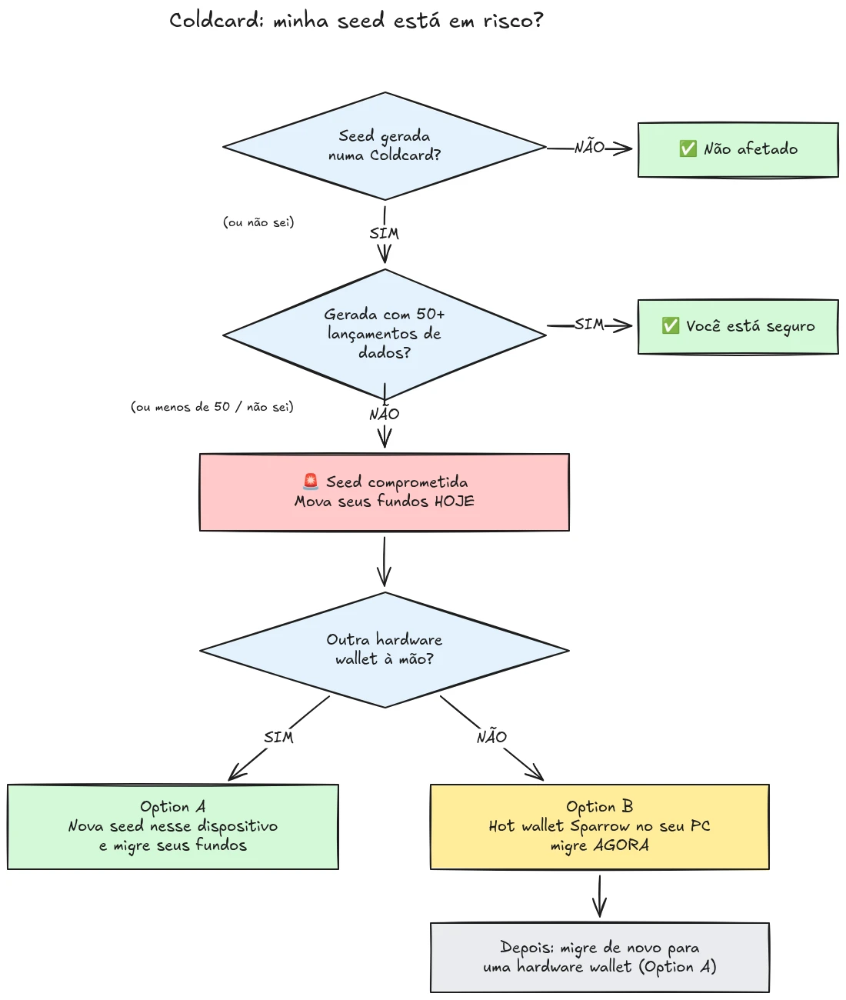

Em 30 de julho de 2026, aproximadamente 594 BTC (cerca de US$ 38 milhões) foram roubados em menos de meia hora de aproximadamente 500 carteiras cujas seeds haviam sido geradas em hardware wallets Coldcard, e o ataque ainda está em andamento. A causa raiz é uma falha de firmware na geração de seed dos dispositivos Coldcard: em vez de depender de aleatoriedade suficiente gerada por hardware, os dispositivos afetados misturavam valores previsíveis, como um contador regressivo interno, o número de série do dispositivo e o relógio interno. Como resultado, as frases-seed geradas nesses dispositivos contêm muito menos entropia do que o esperado e podem ser encontradas por um atacante **sem nenhuma ação da sua parte**, sem malware, sem phishing, sem necessidade de acesso físico. O atacante simplesmente busca no espaço de chaves reduzido e varre qualquer carteira que encontrar.

**Todos os modelos Coldcard são afetados: Mk3, Mk4, Mk5 e Q.** As únicas seeds consideradas seguras são aquelas geradas com o método de rolagem de dados, e apenas se pelo menos 50 rolagens de dados tiverem sido usadas. Se você não sabe, não se lembra ou não tem certeza de como sua seed foi gerada: trate-a como comprometida e mova seus fundos imediatamente.

Este tutorial explica como avaliar sua exposição e como migrar seus fundos para uma carteira segura, rapidamente, mas sem piorar as coisas no processo.

## Em uma caixa: as instruções simples

A comunidade de segurança do Bitcoin está se coordenando em torno de um conjunto fixo de instruções simples. Aqui está:

1. **Você gerou sua seed com 50+ rolagens de dados físicas no Coldcard?** Se sim, você está seguro. Se não, ou se não tiver certeza, assuma que a seed está comprometida.
2. **Prepare um destino seguro**: uma hardware wallet de outro fabricante, se você tiver uma à mão, caso contrário, uma carteira hot Sparrow gerada no seu computador (detalhes na Etapa 2).
3. **Envie todos os seus fundos para lá hoje**, com uma taxa direcionada ao próximo bloco, e aguarde uma confirmação (detalhes na Etapa 3).
4. **Uma passphrase compra tempo, não segurança.** Os atacantes ainda não parecem estar forçando passphrases por força bruta, migre antes que comecem.
5. **Nunca digite sua frase-seed em nenhum lugar** para "verificá-la". Qualquer pessoa pedindo suas palavras é um golpista.
6. **Atualizar o firmware não corrige uma seed já existente.** Uma seed gerada por firmware vulnerável permanece fraca para sempre; apenas uma nova seed e uma movimentação on-chain protegem seus fundos.

O restante deste tutorial percorre cada etapa em detalhes.

## Estou afetado?

Faça a si mesmo uma pergunta: **como a seed foi gerada?**

- Seed gerada **pelo próprio Coldcard** (o fluxo normal de "nova carteira", em qualquer modelo, Mk3, Mk4, Mk5 ou Q): **trate-a como comprometida**. Migre agora.
- Seed gerada com o recurso de **rolagem de dados** do Coldcard, com **pelo menos 50 rolagens de dados físicas** que você mesmo realizou: a entropia veio dos seus dados, não do gerador falho. Esta é a única configuração atualmente considerada segura.
- Rolagem de dados com **menos de 50 rolagens**, ou você deixou o dispositivo "completar" a entropia: não é suficiente, trate-a como comprometida.
- Seed **importada de outro dispositivo (não Coldcard)**: a falha do Coldcard não se aplica a essa seed, mas audite de onde ela originalmente veio.
- **Você não sabe ou não se lembra**: trate-a como comprometida. O custo de uma migração desnecessária é uma taxa de transação; o custo de um palpite errado é tudo.

Três falsas garantias comuns, abordadas explicitamente:

- Uma **passphrase BIP39** sobre uma seed afetada não torna a carteira segura, ela apenas compra tempo. A própria seed é descobrível, então sua passphrase se torna a única barreira, e as pessoas geralmente são ruins em estimar a entropia de uma passphrase. Os atacantes ainda não parecem estar forçando passphrases por força bruta; migre para uma nova seed antes que comecem.
- Uma carteira **multisig** que inclui uma chave Coldcard afetada não pode ser esvaziada apenas por meio dessa chave, mas a chave afetada não contribui mais com segurança real. Retire-a do quórum sem demora.
- **Uma hardware wallet mais nova com a mesma seed**: muitas pessoas compraram um Coldcard mais novo (ou outro dispositivo) e restauraram sua seed existente nele. Isso não muda nada: o que está comprometido é a seed, não o dispositivo. Se sua seed foi gerada em um Coldcard afetado, ela permanece fraca onde quer que você a restaure. Gere uma seed totalmente nova e migre.

## Etapa 1: Aja agora, mas não improvise

Carteiras estão sendo esvaziadas enquanto você lê isto. A postura correta é migrar **hoje**, usando ferramentas que você entende, e não apressar uma transação em cinco minutos com uma configuração desconhecida e enviar suas moedas para o vazio.

Antes de mais nada:

1. Mantenha seu Coldcard e o backup da sua seed onde estão. Você ainda precisa deles para assinar a transação de migração.
2. **Nunca digite sua frase-seed em nenhum computador, telefone ou site "para verificar se está afetada".** Nenhum verificador legítimo exige sua seed. Qualquer pessoa pedindo suas 12 ou 24 palavras é um golpista explorando este incidente, e campanhas de phishing costumam aumentar de forma confiável após eventos como este.
3. Tenha cuidado com onde você obtém suas informações. As primeiras comunicações da Coinkite já foram contraditadas várias vezes nos primeiros dias, então não trate o fabricante como sua única fonte: verifique de forma cruzada com pesquisadores de segurança independentes e veículos de notícias de Bitcoin estabelecidos.

## Etapa 2: Prepare uma carteira de destino segura

Você precisa de uma carteira cuja seed **não tenha sido gerada em um Coldcard**. Dois caminhos, dependendo do que você tem à mão:

### Opção A: Você tem outra hardware wallet à mão

Este é o melhor caminho. Gere uma **nova seed** em uma hardware wallet de outro fabricante e migre seus fundos para lá. Temos tutoriais passo a passo para os principais dispositivos:

https://planb.academy/tutorials/wallet/hardware/jade-7d62bf0c-f460-4e68-9635-af9b731dabc3

https://planb.academy/tutorials/wallet/hardware/bitbox02-6af8940f-e19b-4008-8c83-81017032608c

https://planb.academy/tutorials/wallet/hardware/trezor-safe-3-51d0d669-5d23-47c2-beb6-cc6fa0fb0ea0

https://planb.academy/tutorials/wallet/hardware/ledger-flex-3728773e-74d4-4177-b39f-bd923700c76a

https://planb.academy/tutorials/wallet/hardware/passport-74e53858-3fa2-43f9-b866-573297546236

Para máxima garantia, gere a seed a partir de **rolagens de dados físicas (pelo menos 50 rolagens)** em um dispositivo que suporte esse recurso, para que a entropia seja verificavelmente sua. E, para valores significativos, aproveite a oportunidade para migrar para **multisig entre diferentes fabricantes**, de forma que nenhuma falha de dispositivo isolada possa nunca mais colocar seus fundos em risco por conta própria.

### Opção B: Nenhuma outra hardware wallet disponível: proteja os fundos AGORA

Não espere dias pela entrega de um dispositivo enquanto sua seed permanece em um espaço de chaves pesquisável. Como um **refúgio temporário**, crie uma carteira hot com uma seed **gerada diretamente no seu computador com a Sparrow Wallet**:

https://planb.academy/tutorials/wallet/desktop/sparrow-c674e2ac-d46f-4c82-92a7-7d1b0e262f5d

Ou, no seu telefone, com o Blockstream App:

https://planb.academy/tutorials/wallet/mobile/blockstream-app-onchain-e84edaa9-fb65-48c1-a357-8a5f27996143

Sim, uma carteira hot normalmente é um passo abaixo de uma hardware wallet, mas uma seed em um computador on-line que você controla é atualmente **mais segura do que uma seed Coldcard que um atacante consegue calcular**. Assim que sua nova hardware wallet chegar, faça uma segunda migração da carteira hot para ela, seguindo a Opção A.

Configure a carteira de destino completamente antes de tocar em seus fundos antigos: gere a seed, anote o backup e **realize um teste de recuperação**, restaure a partir do seu backup escrito para comprovar que funciona. Em seguida, gere um primeiro endereço de recebimento e verifique-o na tela do dispositivo.

https://planb.academy/tutorials/wallet/backup/recovery-test-5a75db51-a6a1-4338-a02a-164a8d91b895

Se a pressão do tempo forçar você a pular o teste de recuperação, mantenha o valor migrado em sua *lista de observação* e refaça uma configuração completa e testada dentro de alguns dias.

## Etapa 3: Mova os fundos

Use um coordenador de carteira como a Sparrow Wallet no desktop, que funciona com o Coldcard de forma air-gapped via microSD ou via USB.

https://planb.academy/tutorials/wallet/desktop/sparrow-c674e2ac-d46f-4c82-92a7-7d1b0e262f5d

A migração em si:

1. **Carregue sua carteira existente (afetada)** na Sparrow como uma carteira watch-only, exatamente como você fez quando configurou seu Coldcard pela primeira vez.
2. **Construa uma transação** enviando seus fundos para um endereço de recebimento de sua nova carteira. Verifique o endereço de destino na tela do novo dispositivo de assinatura, caractere por caractere.
3. **Pague uma taxa considerável.** Este não é o momento de economizar alguns sats: uma transação presa na mempool prolonga sua exposição, porque o atacante também possui sua chave privada e pode tentar um duplo gasto por replace-by-fee da sua migração enquanto ela estiver não confirmada. Use uma taxa direcionada ao próximo bloco ou dois.
4. **Assine com seu Coldcard** como de costume, transmita e aguarde pelo menos uma confirmação antes de considerar a migração concluída. Acompanhe a transação até que ela confirme.
5. Se você possui muitos UTXOs, varrer tudo em uma única saída vincula todos eles on-chain. Se seu modelo de privacidade importa, divida a migração em várias transações, mas nesta situação específica, **segurança primeiro, privacidade depois**. Não deixe que a otimização de privacidade atrase a migração.

https://planb.academy/tutorials/privacy/on-chain/utxo-labelling-d997f80f-8a96-45b5-8a4e-a3e1b7788c52

6. Assim que os fundos forem confirmados na nova carteira, **aposente a seed antiga permanentemente**. Não a reutilize, não a "guarde para pequenos valores", e destrua os backups físicos para que não possam confundir você ou seus herdeiros mais tarde.

## Etapa 4: Consequências

- **Continue acompanhando a investigação, a partir de várias fontes.** O entendimento sobre as configurações afetadas já se ampliou mais de uma vez, e as declarações do fabricante foram corrigidas ao longo do caminho. Acompanhe pesquisadores independentes e a mídia de Bitcoin estabelecida, junto com as próprias divulgações da Coinkite, e assuma que o quadro ainda pode mudar.
- **O firmware corrigido já está disponível, mas não resgata seeds existentes.** A Coinkite lançou um firmware corrigido (4.2.0 ou posterior para o Mk3). Atualize qualquer Coldcard que você pretenda continuar usando, mas entenda o que a atualização faz e o que não faz: ela corrige a *geração* de seed daqui para frente; uma seed gerada por firmware vulnerável permanece fraca para sempre. Se você quiser continuar usando um Coldcard, atualize primeiro, depois gere uma seed totalmente nova (idealmente com 50+ rolagens de dados) e mova seus fundos para ela on-chain.
- **Tire a lição estrutural.** Este incidente não significa que a autocustódia esteja quebrada, fundos protegidos por entropia verificável de rolagens de dados ou multisig entre múltiplos fabricantes nunca estiveram em risco. Significa que confiar no gerador de números aleatórios de um único dispositivo é um ponto único de falha como qualquer outro. Entropia verificável (rolagens de dados), multisig entre fabricantes e backups testados são o que torna uma configuração robusta contra o próximo bug de um fabricante, seja ele qual for.
