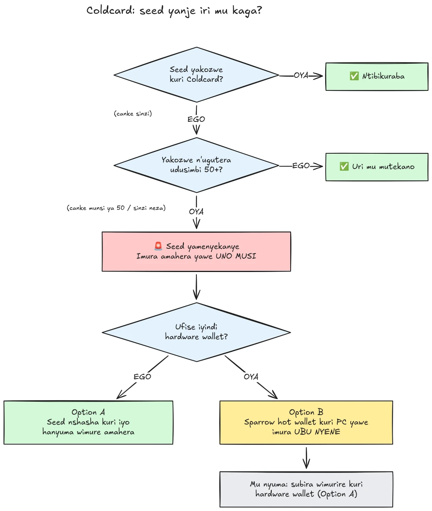

Ku wa 30 Mukakaro 2026, hafi 594 BTC (nk'amadolari miliyoni 38) zaribwe mu gihe kitageze isaha n'igice, zivanywe mu makofero nka 500 yagize seed zakorewe ku bikoresho vya Coldcard (hardware wallets), kandi igitero kiracabandanya. Imvo nyamukuru ni ikosa rya firmware mu gukora seed ku bikoresho vya Coldcard: aho gushingira kuri entropy ihagije yakozwe n'igikoresho ubwaco, ibikoresho vyakozweko vyavangamwo ibiharuro bishobora kwitezwa nk'urubaruro rwo mu gikoresho rumanuka (down-counter), inomero y'igikoresho (serial number), be n'isaha yo mu gikoresho. Ivyo bituma seed phrase zakozwe kuri ivyo bikoresho zirimwo entropy nkeya cane ugereranije n'iyari yitezwe, kandi umugizi wa nabi ashobora kuzitora **ata co na kimwe wewe ukoze**, nta malware, nta phishing, nta n'ukugera ku gikoresho ku mubiri bikenewe. Umugizi wa nabi arondera gusa mu kibanza c'imfunguruzo cagabanutse maze agasahura akofero kose asanze.

**Ubwoko bwose bwa Coldcard bwarakozweko: Mk3, Mk4, Mk5 na Q.** Seed zonyene zifatwa nk'izitekanye ni izakozwe hakoreshejwe uburyo bwo guterera udupfundo (dice roll), kandi gusa iyo hakoreshejwe udupfundo n'imiburiburi incuro 50. Nimba utazi, utibuka, canke udafise ukuri ku kuntu seed yawe yakozwe: yifate nk'iyamaze guhungabanywa maze wimure amahera yawe ubu nyene.

Iyi nyigisho isigura ingene wosuzuma ingorane ushobora kuba urimwo be n'ingene wokwimurira amahera yawe mu gakofero gatekanye, ningoga, ariko utongereje ingorane mu nzira.

## Mu gasanduku kamwe: amabwirizwa yoroshe

Umuryango w'umutekano wa Bitcoin uriko urahurikira ku rutonde rumwe rutahinduka rw'amabwirizwa yoroshe. Ng'aya:

1. **Woba warakoze seed yawe uterera udupfundo tw'umubiri incuro 50 canke zirenga kuri Coldcard?** Nimba ari yego, uri mu mutekano. Nimba ari oya, canke nimba utazi neza, fata ko seed yahungabanijwe.
2. **Tegura aho amahera azoja hatekanye**: hardware wallet y'uwundi mucuruzi nimba ufise iyo hafi yawe, canke hot wallet ya Sparrow yakorewe kuri mudasobwa yawe (ibisigura biri mu Ntambwe ya 2).
3. **Rungika amahera yawe yose ng'aho uyu musi**, ukoresheje ikiguzi kigamije icitunza gikurikira, hanyuma urindire kuremeshwa (ibisigura biri mu Ntambwe ya 3).
4. **Passphrase iguha umwanya, ntiguha umutekano.** Bisa n'uko abagizi ba nabi batararondera passphrase ku nguvu, imuka imbere y'uko batangura.
5. **Ntiwigere wandika seed phrase yawe ahantu na hamwe** kugira ngo "uyisuzume". Uwariwe wese agusaba amajambo yawe ni umuhemu.
6. **Kuvugurura firmware ntibikosora seed isanzweho.** Seed yakozwe na firmware ifise intege nke iguma ari mbi ibihe vyose; ni seed nshasha gusa be n'ukwimura amahera kuri blockchain bikingira amahera yawe.

Ibisigaye vy'iyi nyigisho birasigura buri ntambwe mu buryo burambuye.

## Noba narakozweko?

Ibaze ikibazo kimwe: **seed yakozwe gute?**

- Seed yakozwe **na Coldcard ubwayo** (inzira isanzwe ya "wallet nshasha", ku bwoko ubwo ari bwo bwose, Mk3, Mk4, Mk5, canke Q): **yifate nk'iyahungabanijwe**. Imuka ubu nyene.
- Seed yakozwe ukoresheje uburyo bwa **dice roll** bwa Coldcard, uterera udupfundo tw'umubiri **incuro nibura 50** wewe nyene: entropy yavuye mu dupfundo twawe, ntiyavuye ku gikoresho gifise ikosa. Ubu ni bwo buryo bwonyene bufatwa nk'ubutekanye muri kino gihe.
- Dice roll ifise **incuro zitageze 50**, canke waretse igikoresho ngo "cuzuze" entropy: ntibihagije, yifate nk'iyahungabanijwe.
- Seed **yinjijwe ivuye ku kindi gikoresho (kitari Coldcard)**: ikosa rya Coldcard ntiryerekeye iyo seed, ariko usuzume aho yavuye mu ntango.
- **Ntuzi canke ntiwibuka**: yifate nk'iyahungabanijwe. Igiciro co kwimuka bidakenewe ni ikiguzi c'itunshwa rimwe; igiciro co kwibeshya ni ivyawe vyose.

Hariho ibintu bibiri bisanzwe bihumuriza ku buhemu, dukwiye gusigura ku mugaragaro:

- **Passphrase ya BIP39** wongereye kuri seed yakozweko ntigira agakofero gatekanye, iguha gusa umwanya. Seed ubwayo irashobora gutorwa, ni co gituma passphrase yawe iba yo nkomanzi yonyene, kandi abantu akenshi ntibashobora kugereranya neza entropy ya passphrase. Bisa n'uko abagizi ba nabi batararondera passphrase ku nguvu; imukira kuri seed nshasha imbere y'uko batangura.
- Agakofero ka **multisig** karimwo urufunguzo rwa Coldcard rwakozweko ntigashobora gusahurwa biciye kuri urwo rufunguzo rwonyene, ariko urwo rufunguzo rwakozweko ntirukigira umutekano nyawo rutanga. Rukure muri quorum utaciye umwanya.

## Intambwe ya 1: Kora ubu nyene, ariko ntugakore ivyo utabanje gutegura

Amakofero ariko arasahurwa mu gihe uriko urasoma ibi. Inyifato ibereye ni ukwimuka **uyu musi**, ukoresheje ibikoresho utahura, atari ugusuka itunshwa mu minuta itanu ukoresheje uburyo utamenyereye maze ugatakariza ibiceri vyawe mu busa.

Imbere ya vyose:

1. Gumana Coldcard yawe na backup ya seed yawe aho biri. Uracabikeneye kugira ushireko umukono itunshwa ryo kwimuka.
2. **Ntiwigere wandika seed phrase yawe muri mudasobwa, muri terefone canke ku rubuga "kugira urabe ko yakozweko".** Nta gikoresho co gusuzuma cemewe gisaba seed yawe. Uwariwe wese agusaba amajambo yawe 12 canke 24 ni umuhemu ariko arakoresha ico kibazo, kandi ibitero vya phishing bikunda kwiyongera cane inyuma y'ibintu nk'ibi.
3. Ronka amakuru yawe gusa ku rubuga rwemewe rwa Coinkite (blog) no ku mabaraza yayo y'ubufasha, be n'aho amakuru ya Bitcoin yizewe ava.

## Intambwe ya 2: Tegura agakofero gatekanye amahera azojamwo

Ukeneye agakofero seed yako **itakozwe kuri Coldcard**. Hariho inzira zibiri, bivanye n'ivyo ufise hafi yawe:

### Ihitamwo A: Ufise iyindi hardware wallet hafi yawe

Iyi ni yo nzira nziza kuruta izindi. Kora **seed nshasha** kuri hardware wallet y'uwundi mucuruzi maze wimurire amahera yawe ng'aho. Dufise inyigisho zisigura intambwe ku yindi ku bikoresho nyamukuru:

https://planb.academy/tutorials/wallet/hardware/jade-7d62bf0c-f460-4e68-9635-af9b731dabc3

https://planb.academy/tutorials/wallet/hardware/bitbox02-6af8940f-e19b-4008-8c83-81017032608c

https://planb.academy/tutorials/wallet/hardware/trezor-safe-3-51d0d669-5d23-47c2-beb6-cc6fa0fb0ea0

https://planb.academy/tutorials/wallet/hardware/ledger-flex-3728773e-74d4-4177-b39f-bd923700c76a

https://planb.academy/tutorials/wallet/hardware/passport-74e53858-3fa2-43f9-b866-573297546236

Kugira ushimikire umutekano ntangere, kora seed uhereye ku **guterera udupfundo tw'umubiri (nibura incuro 50)** ku gikoresho kibishoboza, kugira entropy ibe iyawe kandi bishobore kugenzurwa. Kandi ku mahera menshi, fata aka karyo kugira uje kuri **multisig ihuza abacuruzi batandukanye**, kugira ntihagire ikosa ry'igikoresho kimwe risubira gushira amahera yawe mu kaga ryonyene.

### Ihitamwo B: Nta yindi hardware wallet uronse: kingira amahera UBU NYENE

Ntiwitegereze imisi myinshi ngo igikoresho gishike mu gihe seed yawe iri mu kibanza c'imfunguruzo gishobora kurondererwamwo. Nk'**ubuhungiro bw'akanya gato**, rema hot wallet ifise seed **yakorewe ubwayo kuri mudasobwa yawe ukoresheje Sparrow Wallet**:

https://planb.academy/tutorials/wallet/desktop/sparrow-c674e2ac-d46f-4c82-92a7-7d1b0e262f5d

Canke, kuri terefone yawe, ukoresheje Blockstream App:

https://planb.academy/tutorials/wallet/mobile/blockstream-app-onchain-e84edaa9-fb65-48c1-a357-8a5f27996143

Ego, hot wallet mu buryo busanzwe iri hasi ugereranije na hardware wallet, ariko seed iri kuri mudasobwa ihuye na internet wewe ugenzura ubu **iratekanye kuruta seed ya Coldcard umugizi wa nabi ashobora kwiharurira**. Hardware wallet yawe nshasha ninashika, ukore ukwimuka kwa kabiri uvana amahera kuri hot wallet uyaja kuri yo, ukurikije Ihitamwo A.

Shiraho neza agakofero amahera azojamwo imbere yo gukora ku mahera yawe ya kera: kora seed, wandike backup, hanyuma **ukore ikigeragezo co gukira**, subiza agakofero uhereye kuri backup wanditse kugira werekane ko igenda neza. Hanyuma ukore aderesi ya mbere yo kwakiriramwo maze uyigenzure ku gicapo c'igikoresho.

https://planb.academy/tutorials/wallet/backup/recovery-test-5a75db51-a6a1-4338-a02a-164a8d91b895

Nimba ubukebe bw'umwanya bugutumye usiba ikigeragezo co gukira, gumiza urugero rw'amahera wimuye mu *watch list* yawe maze usubire gushiraho uburyo bwuzuye kandi bwageragezwe mu misi mikeyi.

## Intambwe ya 3: Imura amahera

Koresha umuhuza w'amakofero nka Sparrow Wallet kuri mudasobwa, ikorana na Coldcard mu buryo bwa air-gap biciye kuri microSD canke biciye kuri USB.

https://planb.academy/tutorials/wallet/desktop/sparrow-c674e2ac-d46f-4c82-92a7-7d1b0e262f5d

Ukwimuka nyakwo:

1. **Injiza agakofero kawe kariho (kakozweko)** muri Sparrow nka watch-only wallet, nk'uko nyene wabigize igihe washinga Coldcard yawe bwa mbere.
2. **Ubaka itunshwa** rirungika amahera yawe kuri aderesi yo kwakiriramwo y'agakofero kawe gashasha. Genzura iyo aderesi ijaniweko ku gicapo c'igikoresho gishasha gishira umukono, inyuguti ku yindi.
3. **Riha ikiguzi gikwiye.** Uyu si wo mwanya wo kuzigama sats nkeya: itunshwa rifatiriwe muri mempool rirongereza igihe uri mu kaga, kuko umugizi wa nabi na we afise urufunguzo rwawe rw'ibanga kandi ashobora kugerageza replace-by-fee yo gukoresha kabiri ayo mahera mu gihe ukwimuka kwawe kutaremeshwa. Koresha igipimo c'ikiguzi kigamije icitunza gikurikira canke ibibiri bikurikira.
4. **Shiraho umukono ukoresheje Coldcard yawe** nk'ubusanzwe, ritangaze, hanyuma urindire nibura kuremeshwa kumwe imbere y'uko ufata ko ukwimuka kurangiye. Kurikirana iryo tunshwa gushika riremeshwe.
5. Nimba ufise UTXO nyinshi, gukwegera vyose mu gisohoka kimwe bizihuza vyose kuri blockchain. Nimba ubuzima bwawe bwite ari ngirakamaro, gabanya ukwimuka mu matunshwa atari rimwe, ariko muri ico kibazo kihariye, **umutekano imbere, ubuzima bwite inyuma**. Ntureke ngo ukuronderera ubuzima bwite gutebishe ukwimuka.

https://planb.academy/tutorials/privacy/on-chain/utxo-labelling-d997f80f-8a96-45b5-8a4e-a3e1b7788c52

6. Amahera nayamara kuremeshwa mu gakofero gashasha, **kura seed ya kera mu kazi burundu**. Ntuyisubire gukoresha, ntugire ngo "uyigumize ku mahera makeyi", kandi wonone ama backup y'umubiri kugira ntibizogire ico bikuzimiza canke bizimize abaragwa bawe mu nyuma.

## Intambwe ya 4: Inyuma y'ivyo

- **Bandanya ukurikirana amatangazo ya Coinkite.** Iperereza riracabandanya kandi ukumenya uburyo bwakozweko bwaramaze kwaguka rimwe; fata ko bushobora kwongera kwaguka.
- **Firmware ikosowe yarasohotse, ariko ntikiza seed zisanzweho.** Coinkite yasohoye firmware ikosowe (4.2.0 canke iyayikurikiye kuri Mk3). Vugurura Coldcard yose ugomba kubandanya ukoresha, ariko utahure ico ukuvugurura gukora n'ico kudakora: kurakosora *ugukorwa* kwa seed kuva ubu; seed yakozwe na firmware yari ifise intege nke iguma ari mbi ibihe vyose. Nimba ushaka kubandanya ukoresha Coldcard, banza uvugurure, hanyuma ukore seed nshasha rwose (vyoba vyiza uterera udupfundo incuro 50 canke zirenga) maze wimurire amahera yawe kuri yo kuri blockchain.
- **Kura icigwa nyamukuru muri ivyo.** Ico kibazo ntigisigura ko kwibikira amahera yawe ubwawe vyononekaye, amahera yakingiwe n'entropy ivuye ku dupfundo ishobora kugenzurwa canke n'agakofero ka multisig gahuza abacuruzi batandukanye ntiyigeze aba mu kaga. Bisigura ko kwizigira random number generator y'igikoresho kimwe conyene ari SPOF (Single Point Of Failure) nk'iyindi yose. Entropy ishobora kugenzurwa (guterera udupfundo), multisig ihuza abacuruzi, be n'ama backup yageragezwe ni vyo bituma uburyo bwawe bushobora kwihanganira ikosa rikurikira ry'umucuruzi, uwo mucuruzi yoba ari uwuhe wese.

https://planb.academy/tutorials/wallet/hardware/coldcard-co-sign-4ed0c269-29f9-4215-957d-e0deba3dcc8f
