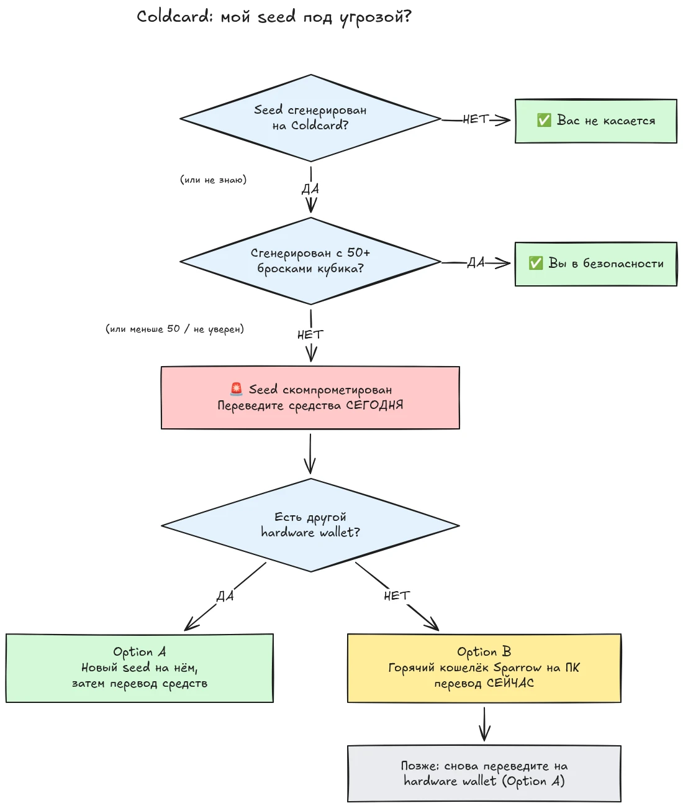

30 июля 2026 года менее чем за полчаса было украдено около 594 BTC (примерно 38 миллионов долларов) из примерно 500 кошельков, сиды которых были сгенерированы на аппаратных кошельках Coldcard,, и атака всё ещё продолжается. Первопричина, уязвимость прошивки в генерации сида на устройствах Coldcard: вместо того чтобы полагаться на достаточную аппаратно-генерируемую случайность, затронутые устройства подмешивали предсказуемые значения, такие как внутренний счётчик обратного отсчёта, серийный номер устройства и внутренние часы. В результате сид-фразы, сгенерированные на этих устройствах, содержат намного меньше энтропии, чем ожидалось, и могут быть найдены злоумышленником **без каких-либо действий с вашей стороны**, не требуется ни вредоносное ПО, ни фишинг, ни физический доступ. Злоумышленник просто перебирает уменьшенное пространство ключей и выводит средства из любого найденного кошелька.

**Затронуты все модели Coldcard: Mk3, Mk4, Mk5 и Q.** Безопасными считаются только сиды, сгенерированные методом бросков игральных костей, и только если было сделано не менее 50 бросков. Если вы не знаете, не помните или не уверены, как был сгенерирован ваш сид: считайте его скомпрометированным и немедленно переведите свои средства.

В этом туториале объясняется, как оценить риск и как перевести свои средства в надёжный кошелёк, быстро, но не усугубляя ситуацию в процессе.

## Коротко: простая инструкция

Сообщество, занимающееся безопасностью Bitcoin, координирует действия вокруг одного фиксированного набора простых инструкций. Вот она:

1. **Вы сгенерировали свой сид с помощью 50+ физических бросков игральных костей на Coldcard?** Если да, вы в безопасности. Если нет, или если вы не уверены, считайте, что сид скомпрометирован.
2. **Подготовьте безопасное место назначения**: аппаратный кошелек другого производителя, если он у вас есть под рукой, либо горячий кошелек Sparrow, сгенерированный на вашем компьютере (подробности в шаге 2).
3. **Сегодня же отправьте туда все свои средства**, с комиссией, рассчитанной на включение в следующий блок, и дождитесь подтверждения (подробности в шаге 3).
4. **Парольная фраза даёт вам время, а не безопасность.** Судя по всему, злоумышленники пока не подбирают парольные фразы перебором, переведите средства, пока они не начали.
5. **Никогда не вводите свою сид-фразу нигде**, чтобы её «проверить». Любой, кто просит ваши слова,, мошенник.
6. **Обновление прошивки не исправляет существующий сид.** Сид, сгенерированный уязвимой прошивкой, навсегда остаётся слабым; обезопасить ваши средства может только новый сид и перевод в блокчейне.

Далее в этом туториале каждый шаг разбирается подробно.

## Затронут ли я?

Задайте себе один вопрос: **как был сгенерирован сид?**

- Сид сгенерирован **самим устройством Coldcard** (обычный сценарий «новый кошелек», на любой модели, Mk3, Mk4, Mk5 или Q): **считайте его скомпрометированным**. Переведите средства сейчас же.
- Сид сгенерирован с помощью функции Coldcard **броски игральных костей**, при этом вы сами сделали **не менее 50 физических бросков костей**: энтропия получена от ваших костей, а не от неисправного генератора. На данный момент это единственная конфигурация, которая считается безопасной.
- Броски костей, но **менее 50 бросков**, или вы позволили устройству «дополнить» энтропию: этого недостаточно, считайте сид скомпрометированным.
- Сид **импортирован с другого устройства (не Coldcard)**: уязвимость Coldcard не касается этого сида, но проверьте, откуда он изначально появился.
- **Вы не знаете или не помните**: считайте сид скомпрометированным. Цена ненужной миграции, это комиссия за транзакцию; цена ошибочного предположения, это всё.

Два распространённых ложных чувства безопасности, разобранных явно:

- **Парольная фраза BIP39** поверх затронутого сида не делает кошелек безопасным, она лишь даёт время. Сам сид можно вычислить, поэтому единственным барьером становится ваша парольная фраза, а люди, как правило, плохо оценивают её энтропию. Похоже, злоумышленники пока не подбирают парольные фразы перебором; переведите средства на новый сид, пока они не начали.
- **Мультисиг**-кошелек, включающий затронутый ключ Coldcard, нельзя опустошить только через этот ключ, но затронутый ключ больше не даёт реальной безопасности. Без промедления выведите его из кворума.

## Шаг 1: Действуйте сейчас, но не импровизируйте

Пока вы это читаете, кошельки опустошаются. Правильная стратегия, перевести средства **сегодня**, используя инструменты, которые вы понимаете,, а не спешно проводить транзакцию за пять минут через незнакомую настройку и отправлять свои монеты в никуда.

Прежде всего:

1. Оставьте свой Coldcard и резервную копию сида там, где они есть. Они всё ещё нужны вам для подписания транзакции миграции.
2. **Никогда не вводите свою сид-фразу ни на каком компьютере, телефоне или сайте, «чтобы проверить, затронуты ли вы».** Ни один легитимный проверочный сервис не требует ваш сид. Любой, кто просит ваши 12 или 24 слова,, мошенник, наживающийся на этом инциденте,, а после подобных событий фишинговые кампании неизменно активизируются.
3. Получайте информацию только из официального блога и каналов поддержки Coinkite, а также из проверенных источников новостей о Bitcoin.

## Шаг 2: Подготовьте безопасный кошелёк назначения

Вам нужен кошелек, сид которого **не был сгенерирован на Coldcard**. Есть два пути, в зависимости от того, что у вас под рукой:

### Вариант A: У вас под рукой есть другой аппаратный кошелек

Это лучший путь. Сгенерируйте **новый сид** на аппаратном кошельке другого производителя и переведите туда свои средства. У нас есть пошаговые туториалы для основных устройств:

https://planb.academy/tutorials/wallet/hardware/jade-7d62bf0c-f460-4e68-9635-af9b731dabc3

https://planb.academy/tutorials/wallet/hardware/bitbox02-6af8940f-e19b-4008-8c83-81017032608c

https://planb.academy/tutorials/wallet/hardware/trezor-safe-3-51d0d669-5d23-47c2-beb6-cc6fa0fb0ea0

https://planb.academy/tutorials/wallet/hardware/ledger-flex-3728773e-74d4-4177-b39f-bd923700c76a

https://planb.academy/tutorials/wallet/hardware/passport-74e53858-3fa2-43f9-b866-573297546236

Для максимальной уверенности сгенерируйте сид с помощью **физических бросков игральных костей (не менее 50 бросков)** на устройстве, которое это поддерживает, чтобы энтропия была доказуемо вашей. А для значительных сумм воспользуйтесь этой возможностью, чтобы перейти на **мультисиг с использованием устройств разных производителей**, чтобы уязвимость одного-единственного устройства больше никогда не могла в одиночку поставить под угрозу ваши средства.

### Вариант B: Другого аппаратного кошелька нет: обезопасьте средства СЕЙЧАС ЖЕ

Не ждите несколько дней доставки устройства, пока ваш сид находится в переборном пространстве ключей. В качестве **временного убежища** создайте горячий кошелек с сидом, **сгенерированным прямо на вашем компьютере с помощью Sparrow Wallet**:

https://planb.academy/tutorials/wallet/desktop/sparrow-c674e2ac-d46f-4c82-92a7-7d1b0e262f5d

Или на вашем телефоне, с помощью Blockstream App:

https://planb.academy/tutorials/wallet/mobile/blockstream-app-onchain-e84edaa9-fb65-48c1-a357-8a5f27996143

Да, горячий кошелек обычно является шагом назад по сравнению с аппаратным кошельком, но сид на подключённом к интернету компьютере, который вы контролируете, сейчас **безопаснее, чем сид Coldcard, который может вычислить злоумышленник**. Как только придёт ваш новый аппаратный кошелек, выполните вторую миграцию, с горячего кошелька на него, следуя варианту A.

Полностью настройте кошелек назначения, прежде чем трогать свои старые средства: сгенерируйте сид, запишите резервную копию и **выполните тест восстановления**, восстановите кошелек по вашей письменной резервной копии, чтобы убедиться, что она работает. Затем сгенерируйте первый адрес для получения средств и проверьте его на экране устройства.

https://planb.academy/tutorials/wallet/backup/recovery-test-5a75db51-a6a1-4338-a02a-164a8d91b895

Если нехватка времени вынуждает вас пропустить тест восстановления, держите переведённую сумму в вашем *списке наблюдения* и в течение нескольких дней повторите полную, протестированную настройку.

## Шаг 3: Переведите средства

Используйте координатор кошелька, например Sparrow Wallet на компьютере, который работает с Coldcard, изолированным по воздушному зазору, через microSD или через USB.

https://planb.academy/tutorials/wallet/desktop/sparrow-c674e2ac-d46f-4c82-92a7-7d1b0e262f5d

Сама миграция:

1. **Загрузите свой существующий (затронутый) кошелек** в Sparrow как Watch-only кошелек, точно так же, как вы делали это при первой настройке своего Coldcard.
2. **Создайте транзакцию**, отправляющую ваши средства на адрес получения вашего нового кошелька. Сверьте адрес назначения на экране нового подписывающего устройства, символ за символом.
3. **Заплатите серьёзную комиссию.** Сейчас не время экономить несколько сатоши: транзакция, застрявшая в мемпуле, продлевает ваш риск, поскольку злоумышленник тоже владеет вашим закрытым ключом и может попытаться совершить двойную трату методом replace-by-fee (RBF) вашей неподтверждённой транзакции миграции. Используйте комиссию, рассчитанную на включение в следующий блок или два.
4. **Подпишите транзакцию своим Coldcard** как обычно, транслируйте её в сеть и дождитесь хотя бы одного подтверждения, прежде чем считать миграцию завершённой. Следите за транзакцией, пока она не подтвердится.
5. Если у вас много UTXO, объединение всего в один выход свяжет их все между собой в блокчейне. Если для вас важна модель приватности, разбейте миграцию на несколько транзакций, но в данной конкретной ситуации **сначала безопасность, потом приватность**. Не позволяйте оптимизации приватности задерживать миграцию.

https://planb.academy/tutorials/privacy/on-chain/utxo-labelling-d997f80f-8a96-45b5-8a4e-a3e1b7788c52

6. Как только средства подтвердятся в новом кошельке, **навсегда выведите старый сид из использования**. Не используйте его повторно, не «оставляйте для небольших сумм» и уничтожьте физические резервные копии, чтобы они не ввели в заблуждение вас или ваших наследников в будущем.

## Шаг 4: После миграции

- **Продолжайте следить за раскрытиями информации от Coinkite.** Расследование продолжается, и понимание того, какие конфигурации затронуты, уже расширялось один раз; исходите из того, что оно может расшириться снова.
- **Исправленная прошивка уже вышла, но она не спасает существующие сиды.** Coinkite выпустила исправленную прошивку (4.2.0 или новее для Mk3). Обновите любой Coldcard, которым вы планируете продолжать пользоваться, но поймите, что делает обновление, а что нет: оно исправляет *генерацию* сида на будущее; сид, сгенерированный уязвимой прошивкой, навсегда остаётся слабым. Если вы хотите продолжать пользоваться Coldcard, сначала обновите прошивку, затем сгенерируйте совершенно новый сид (в идеале, с 50+ бросками костей) и переведите на него свои средства в блокчейне.
- **Извлеките структурный урок.** Этот инцидент не означает, что самостоятельное хранение сломано, средства за доказуемой энтропией из бросков костей или за мультисигом с разными производителями никогда не подвергались риску. Это означает, что доверие генератору случайных чисел одного-единственного устройства, такая же единая точка отказа, как и любая другая. Доказуемая энтропия (броски костей), мультисиг между разными производителями и протестированные резервные копии, вот что делает настройку устойчивой к следующей ошибке любого производителя, каким бы он ни был.

https://planb.academy/tutorials/wallet/hardware/coldcard-co-sign-4ed0c269-29f9-4215-957d-e0deba3dcc8f
