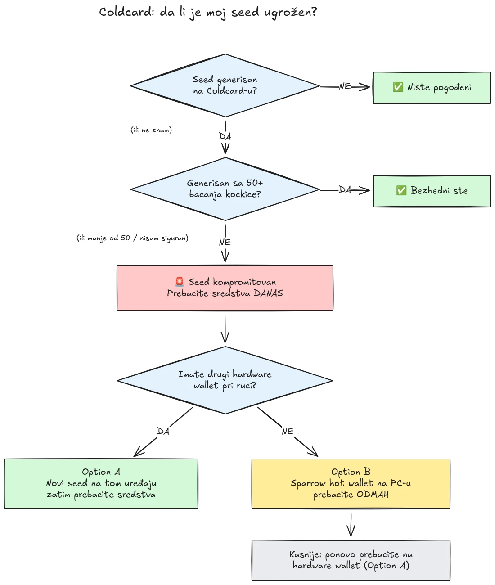

Dana 30. jula 2026. godine, oko 594 BTC (približno 38 miliona dolara) ukradeno je za manje od pola sata sa otprilike 500 novčanika čiji su seed-ovi generisani na Coldcard hardware wallet-ima, a napad još uvek traje. Osnovni uzrok je greška u firmveru pri generisanju seed-a na Coldcard uređajima: umesto da se oslone na dovoljnu količinu slučajnosti generisane hardverski, pogođeni uređaji su umešali predvidljive vrednosti kao što su interni odbrojavač, serijski broj uređaja i interni sat. Kao posledica toga, seed fraze generisane na tim uređajima sadrže daleko manje entropije nego što se očekuje i napadač može da ih pronađe **bez ikakve vaše radnje**, bez malvera, bez phishing-a, bez potrebe za fizičkim pristupom. Napadač jednostavno pretražuje smanjeni prostor ključeva i prazni svaki novčanik koji pronađe.

**Pogođeni su svi Coldcard modeli: Mk3, Mk4, Mk5 i Q.** Jedini seed-ovi koji se smatraju bezbednim jesu oni generisani metodom bacanja kockice, i to samo ako je korišćeno najmanje 50 bacanja kockice. Ako ne znate, ne sećate se ili niste sigurni kako je vaš seed generisan: tretirajte ga kao kompromitovan i odmah prebacite svoja sredstva.

Ovaj vodič objašnjava kako da procenite svoju izloženost i kako da prebacite svoja sredstva u bezbedan novčanik, brzo, ali bez pogoršavanja situacije u tom procesu.

## U jednom okviru: jednostavna uputstva

Bitcoin bezbednosna zajednica se koordinira oko jednog utvrđenog skupa jednostavnih uputstava. Evo ga:

1. **Da li ste svoj seed generisali sa 50+ fizičkih bacanja kockice na Coldcard-u?** Ako jeste, bezbedni ste. Ako niste, ili ako niste sigurni, pretpostavite da je seed kompromitovan.
2. **Pripremite bezbedno odredište**: hardware wallet drugog proizvođača ako vam je pri ruci, u suprotnom Sparrow hot wallet generisan na vašem računaru (detalji u Koraku 2).
3. **Pošaljite tamo sva svoja sredstva još danas**, sa naknadom koja cilja sledeći blok, i sačekajte potvrdu (detalji u Koraku 3).
4. **Passphrase vam kupuje vreme, ne bezbednost.** Izgleda da napadači još uvek ne razbijaju passphrase-ove, prebacite sredstva pre nego što počnu.
5. **Nikada nigde ne ukucavajte svoju seed frazu** da biste je „proverili”. Svako ko traži vaše reči je prevarant.
6. **Ažuriranje firmvera ne popravlja postojeći seed.** Seed generisan ranjivim firmverom zauvek ostaje slab; samo novi seed i on-chain prebacivanje obezbeđuju vaša sredstva.

Ostatak ovog vodiča detaljno obrađuje svaki korak.

## Da li sam pogođen?

Postavite sebi jedno pitanje: **kako je seed generisan?**

- Seed generisan **od strane samog Coldcard-a** (uobičajeni tok „novi novčanik”, na bilo kom modelu, Mk3, Mk4, Mk5 ili Q): **tretirajte ga kao kompromitovan**. Prebacite sredstva odmah.
- Seed generisan pomoću Coldcard funkcije **bacanja kockice**, sa **najmanje 50 fizičkih bacanja kockice** koja ste sami izveli: entropija je došla iz vaše kockice, a ne iz neispravnog generatora. Ovo je jedina konfiguracija koja se trenutno smatra bezbednom.
- Bacanje kockice sa **manje od 50 bacanja**, ili ste pustili uređaj da „dopuni” entropiju: nije dovoljno, tretirajte ga kao kompromitovan.
- Seed **uvezen sa drugog uređaja (koji nije Coldcard)**: Coldcard greška se ne odnosi na taj seed, ali proverite odakle je prvobitno došao.
- **Ne znate ili se ne sećate**: tretirajte ga kao kompromitovan. Cena nepotrebnog prebacivanja je naknada za transakciju; cena pogrešne pretpostavke je sve što imate.

Tri česta lažna umirenja, izričito razjašnjena:

- **BIP39 passphrase** povrh pogođenog seed-a ne čini novčanik bezbednim, već samo kupuje vreme. Sam seed je moguće otkriti, pa vaš passphrase postaje jedina prepreka, a ljudi obično loše procenjuju entropiju passphrase-a. Izgleda da napadači još uvek ne napadaju passphrase-ove grubom silom; pređite na novi seed pre nego što počnu.
- **Multisig** novčanik koji uključuje pogođeni Coldcard ključ ne može biti ispražnjen samo preko tog ključa, ali pogođeni ključ više ne doprinosi stvarnoj bezbednosti. Bez odlaganja ga zamenite u okviru kvoruma.
- **Noviji hardware wallet sa istim seed-om**: mnogi su kupili noviji Coldcard (ili drugi uređaj) i na njega vratili svoj postojeći seed. To ništa ne menja: kompromitovan je seed, a ne uređaj. Ako je vaš seed generisan na pogođenom Coldcard-u, ostaje slab gde god da ga vratite. Generišite potpuno nov seed i prebacite sredstva.

## Korak 1: Delujte odmah, ali nemojte improvizovati

Novčanici se prazne dok ovo čitate. Ispravan pristup je da prebacite sredstva **danas**, koristeći alate koje razumete, a ne da na brzinu za pet minuta napravite transakciju sa nepoznatom postavkom i pošaljete svoje koine u prazno.

Pre svega ostalog:

1. Ostavite svoj Coldcard i rezervnu kopiju seed-a tamo gde jesu. Još uvek su vam potrebni da potpišete transakciju prebacivanja.
2. **Nikada ne ukucavajte svoju seed frazu ni u jedan računar, telefon ili sajt „da biste proverili da li je pogođena”.** Nijedan legitiman alat za proveru ne zahteva vaš seed. Svako ko traži vaših 12 ili 24 reči je prevarant koji iskorišćava ovaj incident, a phishing kampanje pouzdano bujaju posle ovakvih događaja.
3. Budite oprezni odakle dobijate informacije. Rana saopštenja kompanije Coinkite već su nekoliko puta demantovana u prvim danima, pa nemojte proizvođača tretirati kao svoj jedini izvor: proverite unakrsno kod nezavisnih istraživača bezbednosti i etabliranih Bitcoin medija.

## Korak 2: Pripremite bezbedan odredišni novčanik

Potreban vam je novčanik čiji seed **nije generisan na Coldcard-u**. Dva puta, u zavisnosti od toga šta vam je pri ruci:

### Opcija A: Imate pri ruci drugi hardware wallet

Ovo je najbolji put. Generišite **novi seed** na hardware wallet-u drugog proizvođača i tamo prebacite svoja sredstva. Imamo vodiče korak po korak za glavne uređaje:

https://planb.academy/tutorials/wallet/hardware/jade-7d62bf0c-f460-4e68-9635-af9b731dabc3

https://planb.academy/tutorials/wallet/hardware/bitbox02-6af8940f-e19b-4008-8c83-81017032608c

https://planb.academy/tutorials/wallet/hardware/trezor-safe-3-51d0d669-5d23-47c2-beb6-cc6fa0fb0ea0

https://planb.academy/tutorials/wallet/hardware/ledger-flex-3728773e-74d4-4177-b39f-bd923700c76a

https://planb.academy/tutorials/wallet/hardware/passport-74e53858-3fa2-43f9-b866-573297546236

Za maksimalnu sigurnost, generišite seed iz **fizičkih bacanja kockice (najmanje 50 bacanja)** na uređaju koji to podržava, tako da entropija dokazivo bude vaša. A za značajne iznose, iskoristite ovu priliku da pređete na **multisig sa uređajima različitih proizvođača**, kako greška u jednom jedinom uređaju nikada više ne bi mogla sama da ugrozi vaša sredstva.

### Opcija B: Nemate na raspolaganju drugi hardware wallet: obezbedite sredstva ODMAH

Nemojte danima čekati isporuku uređaja dok vaš seed stoji u prostoru ključeva koji se može pretražiti. Kao **privremeno utočište**, napravite hot wallet sa seed-om **generisanim direktno na vašem računaru pomoću Sparrow Wallet-a**:

https://planb.academy/tutorials/wallet/desktop/sparrow-c674e2ac-d46f-4c82-92a7-7d1b0e262f5d

Ili, na telefonu, pomoću Blockstream App-a:

https://planb.academy/tutorials/wallet/mobile/blockstream-app-onchain-e84edaa9-fb65-48c1-a357-8a5f27996143

Da, hot wallet je inače korak unazad u odnosu na hardware wallet, ali seed na računaru povezanom na internet koji vi kontrolišete trenutno je **bezbedniji od Coldcard seed-a koji napadač može da izračuna**. Kada stigne vaš novi hardware wallet, uradite drugo prebacivanje sa hot wallet-a na njega, prateći Opciju A.

Podesite odredišni novčanik u potpunosti pre nego što dirnete svoja stara sredstva: generišite seed, zapišite rezervnu kopiju i **izvedite test oporavka**, vratite novčanik iz zapisane rezervne kopije da biste dokazali da radi. Zatim generišite prvu adresu za primanje i proverite je na ekranu uređaja.

https://planb.academy/tutorials/wallet/backup/recovery-test-5a75db51-a6a1-4338-a02a-164a8d91b895

Ako vas vremenski pritisak natera da preskočite test oporavka, držite prebačeni iznos na svojoj *listi za praćenje* i u roku od nekoliko dana ponovite kompletno, testirano podešavanje.

## Korak 3: Prebacite sredstva

Koristite koordinator novčanika kao što je Sparrow Wallet na računaru, koji radi sa Coldcard-om air-gapped preko microSD kartice ili preko USB-a.

https://planb.academy/tutorials/wallet/desktop/sparrow-c674e2ac-d46f-4c82-92a7-7d1b0e262f5d

Samo prebacivanje:

1. **Učitajte svoj postojeći (pogođeni) novčanik** u Sparrow kao watch-only novčanik, tačno onako kako ste uradili kada ste prvi put podesili svoj Coldcard.
2. **Napravite transakciju** kojom šaljete svoja sredstva na adresu za primanje vašeg novog novčanika. Proverite odredišnu adresu na ekranu novog uređaja za potpisivanje, znak po znak.
3. **Platite ozbiljnu naknadu.** Ovo nije trenutak da uštedite nekoliko satošija: transakcija zaglavljena u mempool-u produžava vašu izloženost, jer napadač takođe poseduje vaš privatni ključ i može da pokuša replace-by-fee dvostruku potrošnju vašeg prebacivanja dok je nepotvrđeno. Koristite stopu naknade koja cilja sledeći blok ili dva.
4. **Potpišite svojim Coldcard-om** kao i obično, emitujte transakciju i sačekajte bar jednu potvrdu pre nego što prebacivanje smatrate završenim. Pratite transakciju dok se ne potvrdi.
5. Ako držite mnogo UTXO-a, slivanje svega u jedan izlaz povezuje ih sve on-chain. Ako vam je model privatnosti važan, podelite prebacivanje na nekoliko transakcija, ali u ovoj konkretnoj situaciji, **prvo bezbednost, pa privatnost**. Nemojte dozvoliti da optimizacija privatnosti odloži prebacivanje.

https://planb.academy/tutorials/privacy/on-chain/utxo-labelling-d997f80f-8a96-45b5-8a4e-a3e1b7788c52

6. Kada su sredstva potvrđena u novom novčaniku, **trajno povucite stari seed iz upotrebe**. Nemojte ga ponovo koristiti, nemojte ga „zadržati za male iznose” i uništite fizičke rezervne kopije kako kasnije ne bi mogle da zavaraju vas ili vaše naslednike.

## Korak 4: Nakon svega

- **Nastavite da pratite istragu, iz više izvora.** Razumevanje pogođenih konfiguracija se već više puta proširilo, a izjave proizvođača su usput ispravljane. Pratite nezavisne istraživače i etablirane Bitcoin medije uporedo sa saopštenjima same kompanije Coinkite i pretpostavite da se slika još može promeniti.
- **Ispravljeni firmver je objavljen, ali ne spasava postojeće seed-ove.** Coinkite je objavio zakrpljeni firmver (4.2.0 ili noviji za Mk3). Ažurirajte svaki Coldcard koji nameravate i dalje da koristite, ali shvatite šta ažuriranje radi, a šta ne radi: ono ispravlja *generisanje* seed-a ubuduće; seed generisan ranjivim firmverom zauvek ostaje slab. Ako želite da nastavite da koristite Coldcard, prvo ažurirajte, zatim generišite potpuno nov seed (idealno sa 50+ bacanja kockice) i on-chain prebacite svoja sredstva na njega.
- **Izvucite strukturnu pouku.** Ovaj incident ne znači da je samostalno čuvanje neispravno, sredstva zaštićena proverljivom entropijom iz bacanja kockice ili multisig-om sa više proizvođača nikada nisu bila ugrožena. On znači da je poverenje u generator slučajnih brojeva jednog jedinog uređaja jedinstvena tačka otkaza kao i svaka druga. Proverljiva entropija (bacanja kockice), multisig sa uređajima različitih proizvođača i testirane rezervne kopije jesu ono što postavku čini otpornom na sledeći bag proizvođača, ko god taj proizvođač bio.
