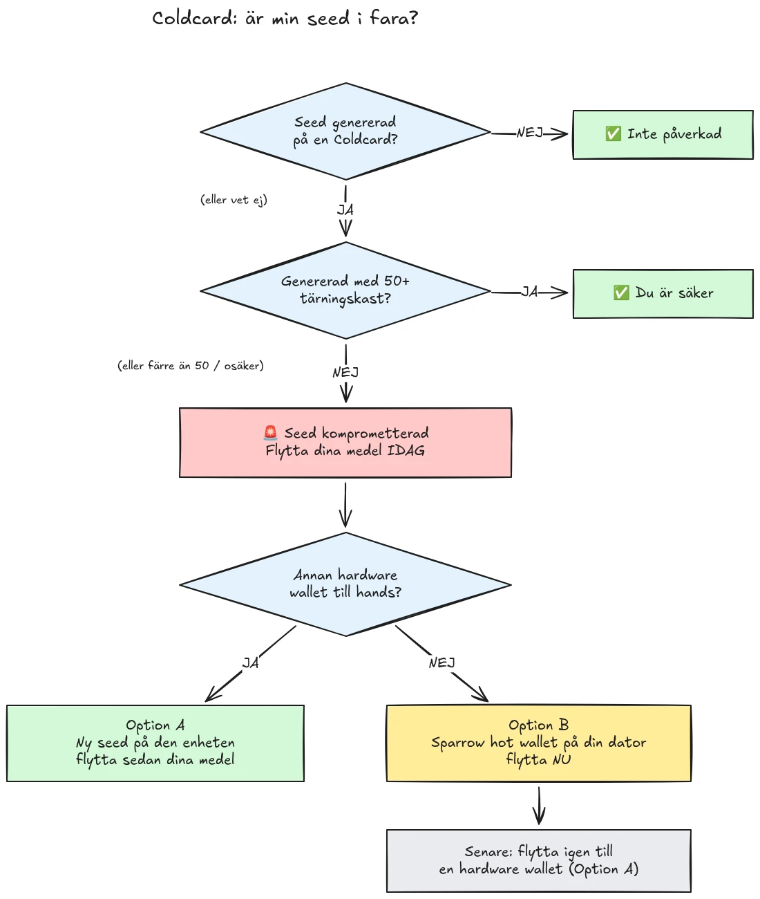

Den 30 juli 2026 stals cirka 594 BTC (ungefär 38 miljoner dollar) på under en halvtimme från cirka 500 plånböcker vars seed hade genererats på Coldcard-hårdvaruplånböcker, och attacken pågår fortfarande. Grundorsaken är en firmware-brist i Coldcard-enheternas seed-generering: istället för att förlita sig på tillräcklig hårdvarugenererad slumpmässighet blandade de drabbade enheterna in förutsägbara värden såsom en intern nedräknare, enhetens serienummer och den interna klockan. Resultatet är att seed-fraser som genererats på dessa enheter innehåller betydligt mindre entropi än förväntat och kan hittas av en angripare **utan någon åtgärd från din sida**, ingen skadlig kod, inget nätfiske, ingen fysisk åtkomst krävs. Angriparen söker helt enkelt igenom det reducerade nyckelrummet och tömmer varje…

**Alla Coldcard-modeller är drabbade: Mk3, Mk4, Mk5 och Q.** De enda seed som anses säkra är de som genererats med tärningsmetoden, och endast om minst 50 tärningskast användes. Om du inte vet, inte minns, eller inte är säker på hur din seed genererades: behandla den som komprometterad och flytta dina medel omedelbart.

Denna handledning förklarar hur du bedömer din exponering och hur du flyttar dina medel till en säker plånbok, snabbt, men utan att förvärra saken i processen.

## I korthet: de enkla instruktionerna

Bitcoin-säkerhetsgemenskapen koordinerar sig kring en fast uppsättning enkla instruktioner. Här är den:

1. **Genererade du din seed med 50+ fysiska tärningskast på Coldcarden?** Om ja är du säker. Om nej, eller om du inte är säker, anta att seed är komprometterad.
2. **Förbered en säker destination**: en annan tillverkares hårdvaruplånbok om du har en till hands, annars en Sparrow hot wallet genererad på din dator (detaljer i Steg 2).
3. **Skicka alla dina medel dit idag**, med en avgift som siktar på nästa block, och vänta på en bekräftelse (detaljer i Steg 3).
4. **En lösenfras köper dig tid, inte säkerhet.** Angripare verkar ännu inte pröva sig fram genom lösenfraser, migrera innan de börjar.
5. **Skriv aldrig in din seed-fras någonstans** för att "kontrollera" den. Vem som helst som ber om dina ord är en bedragare.
6. **Uppdatering av firmwaren fixar inte en befintlig seed.** En seed som genererats av sårbar firmware förblir svag för alltid; endast en ny seed och en flytt on-chain säkrar dina medel.

Resten av denna handledning går igenom varje steg i detalj.

## Är jag drabbad?

Ställ dig själv en fråga: **hur genererades seed?**

- Seed genererad **av Coldcarden själv** (det normala "ny plånbok"-flödet, på vilken modell som helst, Mk3, Mk4, Mk5 eller Q): **behandla den som komprometterad**. Migrera nu.
- Seed genererad med Coldcardens **tärningskast**-funktion, med **minst 50 fysiska tärningskast** som du själv utförde: entropin kom från dina tärningar, inte från den bristfälliga generatorn. Detta är den enda konfiguration som för närvarande anses säker.
- Tärningskast med **färre än 50 kast**, eller om du lät enheten "komplettera" entropin: inte tillräckligt, behandla den som komprometterad.
- Seed **importerad från en annan (icke-Coldcard) enhet**: Coldcard-bristen gäller inte den seed, men granska varifrån den ursprungligen kom.
- **Du vet inte eller minns inte**: behandla den som komprometterad. Kostnaden för en onödig migrering är en transaktionsavgift; kostnaden för en felaktig gissning är allt.

Två vanliga falska lugnande tankar, adresserade explicit:

- En **BIP39-lösenfras** ovanpå en drabbad seed gör inte plånboken säker, den köper bara tid. Själva seed går att räkna ut, så din lösenfras blir den enda barriären, och människor är i allmänhet dåliga på att uppskatta lösenfrasers entropi. Angripare verkar ännu inte pröva lösenfraser genom brute-force; migrera till en ny seed innan de börjar.
- En **multisig**-plånbok som inkluderar en drabbad Coldcard-nyckel kan inte tömmas via den nyckeln ensam, men den drabbade nyckeln bidrar inte längre med någon verklig säkerhet. Rotera ut den ur kvorumet utan dröjsmål.

## Steg 1: Agera nu, men improvisera inte

Plånböcker töms medan du läser detta. Rätt förhållningssätt är att migrera **idag**, med verktyg du förstår, inte att rusa igenom en transaktion på fem minuter med en obekant uppsättning och skicka dina mynt ut i tomma intet.

Innan något annat:

1. Behåll din Coldcard och din seed-säkerhetskopia där de är. Du behöver dem fortfarande för att signera migreringstransaktionen.
2. **Skriv aldrig in din seed-fras i någon dator, telefon eller webbplats "för att kontrollera om den är drabbad".** Ingen legitim kontroll kräver din seed. Vem som helst som ber om dina 12 eller 24 ord är en bedragare som utnyttjar denna incident, och nätfiskekampanjer ökar pålitligt efter händelser som denna.
3. Skaffa din information endast från Coinkites officiella blogg och supportkanaler samt från etablerade Bitcoin-nyhetskällor.

## Steg 2: Förbered en säker destinationsplånbok

Du behöver en plånbok vars seed **inte genererades på en Coldcard**. Två vägar, beroende på vad du har till hands:

### Alternativ A: Du har en annan hårdvaruplånbok till hands

Detta är den bästa vägen. Generera en **ny seed** på en hårdvaruplånbok från en annan tillverkare och migrera dina medel dit. Vi har steg-för-steg-handledningar för de vanligaste enheterna:

https://planb.academy/tutorials/wallet/hardware/jade-7d62bf0c-f460-4e68-9635-af9b731dabc3

https://planb.academy/tutorials/wallet/hardware/bitbox02-6af8940f-e19b-4008-8c83-81017032608c

https://planb.academy/tutorials/wallet/hardware/trezor-safe-3-51d0d669-5d23-47c2-beb6-cc6fa0fb0ea0

https://planb.academy/tutorials/wallet/hardware/ledger-flex-3728773e-74d4-4177-b39f-bd923700c76a

https://planb.academy/tutorials/wallet/hardware/passport-74e53858-3fa2-43f9-b866-573297546236

För maximal säkerhet, generera seed från **fysiska tärningskast (minst 50 kast)** på en enhet som stöder det, så att entropin verifierbart är din. Och för betydande belopp, ta tillfället i akt att flytta till **multisig över olika tillverkare**, så att ingen enskild enhetsbrist någonsin igen ensam kan äventyra dina medel.

### Alternativ B: Ingen annan hårdvaruplånbok tillgänglig: säkra medlen NU

Vänta inte flera dagar på att en enhet ska levereras medan din seed ligger i ett genomsökningsbart nyckelrum. Som en **tillfällig tillflykt**, skapa en hot wallet med en seed **genererad direkt på din dator med Sparrow Wallet**:

https://planb.academy/tutorials/wallet/desktop/sparrow-c674e2ac-d46f-4c82-92a7-7d1b0e262f5d

Eller, på din telefon, med Blockstream-appen:

https://planb.academy/tutorials/wallet/mobile/blockstream-app-onchain-e84edaa9-fb65-48c1-a357-8a5f27996143

Ja, en hot wallet är normalt ett steg ner från en hårdvaruplånbok, men en seed på en ansluten dator som du kontrollerar är för närvarande **säkrare än en Coldcard-seed som en angripare kan räkna ut**. När din nya hårdvaruplånbok anländer, gör en andra migrering från hot wallet till den, enligt Alternativ A.

Ställ in destinationsplånboken helt innan du rör dina gamla medel: generera seed, skriv ner säkerhetskopian, och **utför ett återställningstest**, återställ från din nedskrivna säkerhetskopia för att bevisa att den fungerar. Generera sedan en första mottagningsadress och verifiera den på enhetens skärm.

https://planb.academy/tutorials/wallet/backup/recovery-test-5a75db51-a6a1-4338-a02a-164a8d91b895

Om tidspressen tvingar dig att hoppa över återställningstestet, håll migreringsbeloppet på din *bevakningslista* och gör om en fullständig, testad uppsättning inom några dagar.

## Steg 3: Flytta medlen

Använd en plånbokskoordinator som Sparrow Wallet på skrivbordet, som fungerar med Coldcarden air-gapped via microSD eller via USB.

https://planb.academy/tutorials/wallet/desktop/sparrow-c674e2ac-d46f-4c82-92a7-7d1b0e262f5d

Själva migreringen:

1. **Ladda din befintliga (drabbade) plånbok** i Sparrow som en watch-only-plånbok, precis som när du först satte upp din Coldcard.
2. **Bygg en transaktion** som skickar dina medel till en mottagningsadress i din nya plånbok. Verifiera destinationsadressen på skärmen på den nya signeringsenheten, tecken för tecken.
3. **Betala en rejäl avgift.** Detta är inte tillfället att spara några sats: en transaktion som fastnar i mempoolen förlänger din exponering, eftersom angriparen också innehar din privata nyckel och kan försöka en replace-by-fee-dubbelspendering av din migrering medan den är obekräftad. Använd en avgiftsnivå som siktar på nästa block eller två.
4. **Signera med din Coldcard** som vanligt, sänd ut transaktionen och vänta på minst en bekräftelse innan du betraktar migreringen som klar. Bevaka transaktionen tills den bekräftas.
5. Om du har många UTXO:er länkar en sammanslagning av allt till en enda output samman dem alla on-chain. Om din integritetsmodell spelar roll, dela upp migreringen i flera transaktioner, men i just denna situation gäller **säkerhet först, integritet i andra hand**. Låt inte integritetsoptimering försena migreringen.

https://planb.academy/tutorials/privacy/on-chain/utxo-labelling-d997f80f-8a96-45b5-8a4e-a3e1b7788c52

6. När medlen är bekräftade i den nya plånboken, **avveckla den gamla seed permanent**. Återanvänd den inte, "spara den inte för mindre belopp", och förstör de fysiska säkerhetskopiorna så att de inte kan vilseleda dig eller dina arvingar senare.

## Steg 4: Efterspel

- **Fortsätt följa Coinkites offentliggöranden.** Utredningen pågår och förståelsen av drabbade konfigurationer har redan breddats en gång; anta att den kan breddas igen.
- **Fixad firmware finns, men den räddar inte befintliga seed.** Coinkite har släppt patchad firmware (4.2.0 eller senare för Mk3). Uppdatera varje Coldcard du tänker fortsätta använda, men förstå vad uppdateringen gör och inte gör: den fixar seed-*generering* framöver; en seed som genererats av sårbar firmware förblir svag för alltid. Om du vill fortsätta använda en Coldcard: uppdatera först, generera sedan en helt ny seed (helst med 50+ tärningskast) och flytta dina medel till den on-chain.
- **Dra den strukturella lärdomen.** Denna incident betyder inte att self-custody är trasig, medel skyddade av verifierbar tärningsentropi eller multisig över flera tillverkare var aldrig i riskzonen. Den betyder att det är en enskild svag punkt, precis som vilken annan som helst, att lita på en enda enhets slumptalsgenerator. Verifierbar entropi (tärningskast), multisig över tillverkare och testade säkerhetskopior är det som gör en uppsättning robust mot nästa tillverkares bugg, oavsett vem tillverkaren är.

https://planb.academy/tutorials/wallet/hardware/coldcard-co-sign-4ed0c269-29f9-4215-957d-e0deba3dcc8f
