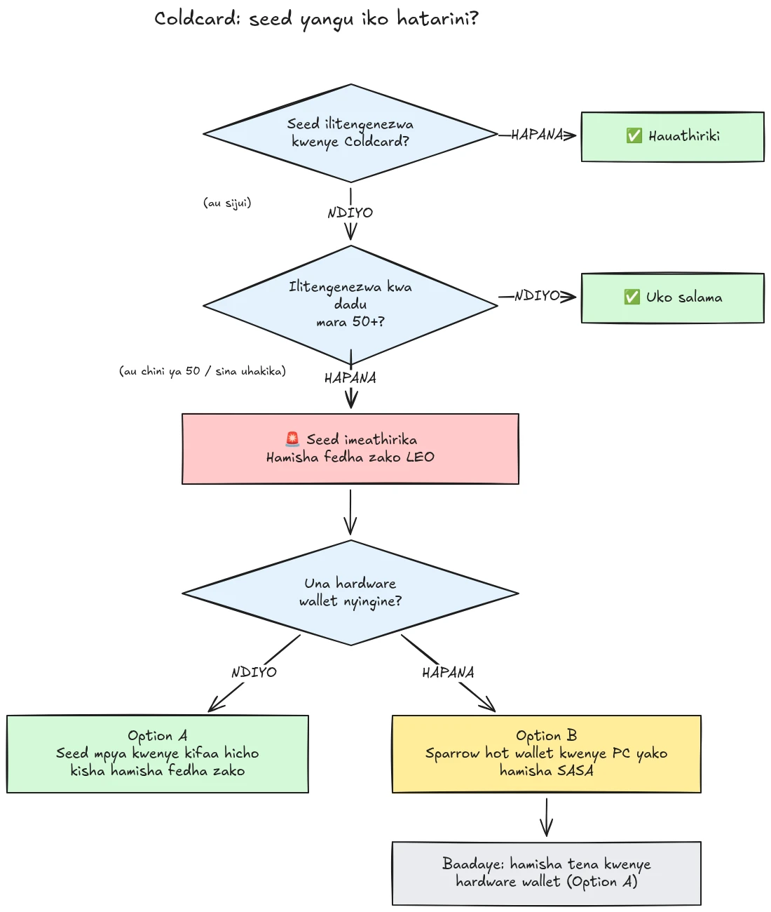

Mnamo Julai 30, 2026, takriban BTC 594 (karibu dola milioni 38) ziliibwa ndani ya chini ya nusu saa kutoka takriban pochi 500 ambazo seed zake zilikuwa zimezalishwa kwenye mkoba wa maunzi wa Coldcard, na shambulio bado linaendelea. Chanzo kikuu ni dosari ya firmware katika uzalishaji wa seed kwenye vifaa vya Coldcard: badala ya kutegemea unasibu wa kutosha unaozalishwa na maunzi, vifaa vilivyoathiriwa vilichanganya thamani zinazoweza kutabirika kama kaunta ya ndani inayoshuka, nambari ya mfululizo ya kifaa, na saa ya ndani. Matokeo yake, misemo ya seed iliyozalishwa kwenye vifaa hivi ina entropy ndogo sana kuliko ilivyotarajiwa na inaweza kupatikana na mshambuliaji **bila hatua yoyote upande wako**, hakuna programu hasidi, hakuna phishing, hakuna ufikiaji wa kimwili unaohitajika. Mshambuliaji hutafuta tu nafasi ya funguo iliyopunguzwa na kufagia pochi yoyote anayopata.

**Miundo yote ya Coldcard imeathiriwa: Mk3, Mk4, Mk5, na Q.** Seed pekee zinazochukuliwa kuwa salama ni zile zilizozalishwa kwa mbinu ya kurusha kete, na tu ikiwa angalau mirusho 50 ya kete ilitumika. Ikiwa hujui, hukumbuki, au huna uhakika seed yako ilizalishwaje: ichukulie kuwa imeathiriwa na hamisha fedha zako mara moja.

Mafunzo haya yanaeleza jinsi ya kutathmini kiwango chako cha kuathiriwa na jinsi ya kuhamisha fedha zako kwenda kwenye pochi salama, kwa haraka, lakini bila kufanya mambo kuwa mabaya zaidi katika mchakato huo.

## Katika kisanduku kimoja: maagizo rahisi

Jumuiya ya usalama wa Bitcoin inaratibu kuzunguka seti moja thabiti ya maagizo rahisi. Hii hapa:

1. **Je, ulizalisha seed yako kwa mirusho 50+ ya kete halisi kwenye Coldcard?** Ikiwa ndiyo, uko salama. Ikiwa hapana, au ikiwa huna uhakika, dhania seed imeathiriwa.
2. **Andaa mahali salama pa kupeleka fedha**: mkoba wa maunzi wa mtengenezaji mwingine ikiwa unao karibu, la sivyo mkoba wa moto wa Sparrow uliotengenezwa kwenye kompyuta yako (maelezo katika Hatua ya 2).
3. **Tuma fedha zako zote huko leo**, kwa ada inayolenga kizuizi kinachofuata, na usubiri uthibitisho (maelezo katika Hatua ya 3).
4. **Passphrase hununua muda, si usalama.** Washambuliaji hawaonekani kuwa wanajaribu passphrase kwa nguvu bado, hamisha kabla hawajaanza.
5. **Usiwahi kuandika maneno yako ya seed mahali popote** ili "kuiangalia". Yeyote anayeomba maneno yako ni tapeli.
6. **Kusasisha firmware hakurekebishi seed iliyopo.** Seed iliyozalishwa na firmware yenye udhaifu hubaki dhaifu milele; seed mpya pekee na uhamisho wa on-chain ndivyo hulinda fedha zako.

Sehemu iliyobaki ya mafunzo haya inapitia kila hatua kwa kina.

## Je, nimeathiriwa?

Jiulize swali moja: **seed ilizalishwaje?**

- Seed iliyozalishwa **na Coldcard yenyewe** (mtiririko wa kawaida wa "pochi mpya", kwenye muundo wowote, Mk3, Mk4, Mk5, au Q): **ichukulie kuwa imeathiriwa**. Hamisha sasa.
- Seed iliyozalishwa kwa kipengele cha **kurusha kete** cha Coldcard, kwa **angalau mirusho 50 ya kete halisi** uliyofanya mwenyewe: entropy ilitoka kwenye kete zako, si kutoka kwa jenereta yenye dosari. Huu ndio usanidi pekee unaochukuliwa kuwa salama kwa sasa.
- Kurusha kete kwa **mirusho chini ya 50**, au uliruhusu kifaa "kikamilishe" entropy: haitoshi, ichukulie kuwa imeathiriwa.
- Seed **iliyoingizwa kutoka kifaa kingine (kisicho Coldcard)**: dosari ya Coldcard haihusu seed hiyo, lakini kagua ilikotoka awali.
- **Hujui au hukumbuki**: ichukulie kuwa imeathiriwa. Gharama ya uhamisho usio wa lazima ni ada ya muamala; gharama ya kukisia vibaya ni kila kitu.

Faraja mbili potofu za kawaida, zikishughulikiwa waziwazi:

- **PASSPHRASE (BIP39)** juu ya seed iliyoathiriwa haifanyi pochi kuwa salama, inanunua muda tu. Seed yenyewe inaweza kugunduliwa, hivyo passphrase yako inakuwa kizuizi pekee, na watu kwa kawaida hukosea kukadiria entropy ya passphrase. Washambuliaji hawaonekani kuwa wanajaribu passphrase kwa brute force bado; hamia kwenye seed mpya kabla hawajaanza.
- Pochi ya **multisig** inayojumuisha ufunguo wa Coldcard ulioathiriwa haiwezi kufagiliwa kupitia ufunguo huo pekee, lakini ufunguo ulioathiriwa hauchangii usalama halisi tena. Uondoe kutoka kwenye quorum bila kuchelewa.

## Hatua ya 1: Chukua hatua sasa, lakini usibuni papo hapo

Pochi zinaendelea kufagiliwa unaposoma haya. Msimamo sahihi ni kuhamisha **leo**, ukitumia zana unazoelewa, si kukimbilia muamala ndani ya dakika tano kwa usanidi usiouzoea na kutuma sarafu zako kwenye ombwe.

Kabla ya kitu kingine chochote:

1. Acha Coldcard yako na chelezo ya seed yako zilipo. Bado unazihitaji kusaini muamala wa uhamisho.
2. **Usiwahi kuandika maneno yako ya seed kwenye kompyuta, simu, au tovuti yoyote "ili kuangalia kama yameathiriwa".** Hakuna kikagua halali kinachohitaji seed yako. Yeyote anayeomba maneno yako 12 au 24 ni tapeli anayenufaika na tukio hili, na kampeni za phishing huongezeka kwa uhakika baada ya matukio kama hili.
3. Pata taarifa zako kutoka tu kwenye blogu rasmi na njia za msaada za Coinkite na kutoka vyanzo vilivyojengeka vya habari za Bitcoin.

## Hatua ya 2: Andaa pochi salama ya marudio

Unahitaji pochi ambayo seed yake **haikuzalishwa kwenye Coldcard**. Kuna njia mbili, kulingana na ulichonacho karibu:

### Chaguo A: Una mkoba mwingine wa maunzi karibu

Hii ndiyo njia bora. Zalisha **seed mpya** kwenye mkoba wa maunzi kutoka mtengenezaji mwingine na hamishia fedha zako huko. Tuna mafunzo ya hatua kwa hatua kwa vifaa vikuu:

https://planb.academy/tutorials/wallet/hardware/jade-7d62bf0c-f460-4e68-9635-af9b731dabc3

https://planb.academy/tutorials/wallet/hardware/bitbox02-6af8940f-e19b-4008-8c83-81017032608c

https://planb.academy/tutorials/wallet/hardware/trezor-safe-3-51d0d669-5d23-47c2-beb6-cc6fa0fb0ea0

https://planb.academy/tutorials/wallet/hardware/ledger-flex-3728773e-74d4-4177-b39f-bd923700c76a

https://planb.academy/tutorials/wallet/hardware/passport-74e53858-3fa2-43f9-b866-573297546236

Kwa uhakika wa juu zaidi, zalisha seed kutokana na **mirusho ya kete halisi (angalau mirusho 50)** kwenye kifaa kinachounga mkono hilo, ili entropy iweze kuthibitishwa kuwa ni yako. Na kwa kiasi kikubwa cha fedha, tumia fursa hii kuhamia **multisig kupitia watengenezaji tofauti**, ili dosari ya kifaa kimoja isiweze tena kuweka fedha zako hatarini peke yake.

### Chaguo B: Hakuna mkoba mwingine wa maunzi unaopatikana: linda fedha SASA

Usisubiri siku kadhaa kifaa kiletwe wakati seed yako iko kwenye nafasi ya funguo inayoweza kutafutwa. Kama **hifadhi ya muda**, tengeneza mkoba wa moto wenye seed **inayozalishwa moja kwa moja kwenye kompyuta yako kwa Sparrow Wallet**:

https://planb.academy/tutorials/wallet/desktop/sparrow-c674e2ac-d46f-4c82-92a7-7d1b0e262f5d

Au, kwenye simu yako, kwa Blockstream App:

https://planb.academy/tutorials/wallet/mobile/blockstream-app-onchain-e84edaa9-fb65-48c1-a357-8a5f27996143

Ndiyo, mkoba wa moto kwa kawaida ni hatua ya chini kutoka mkoba wa maunzi, lakini seed kwenye kompyuta ya mtandaoni unayodhibiti kwa sasa ni **salama zaidi kuliko seed ya Coldcard ambayo mshambuliaji anaweza kuikokotoa**. Mara mkoba wako mpya wa maunzi utakapowasili, fanya uhamisho wa pili kutoka mkoba wa moto kwenda humo, ukifuata Chaguo A.

Sanidi pochi ya marudio kikamilifu kabla ya kugusa fedha zako za zamani: zalisha seed, andika chelezo, na **fanya jaribio la urejeshi**, rejesha kutoka kwenye chelezo uliyoandika ili kuthibitisha kuwa inafanya kazi. Kisha zalisha anwani ya kwanza ya kupokea na ithibitishe kwenye skrini ya kifaa.

https://planb.academy/tutorials/wallet/backup/recovery-test-5a75db51-a6a1-4338-a02a-164a8d91b895

Ikiwa shinikizo la muda linakulazimisha kuruka jaribio la urejeshi, weka kiasi cha uhamisho katika *orodha yako ya kufuatilia* na urudie usanidi kamili uliopimwa ndani ya siku chache.

## Hatua ya 3: Hamisha fedha

Tumia mratibu wa pochi kama Sparrow Wallet kwenye desktop, ambao hufanya kazi na Coldcard iliyotengwa na mtandao kupitia microSD au kupitia USB.

https://planb.academy/tutorials/wallet/desktop/sparrow-c674e2ac-d46f-4c82-92a7-7d1b0e262f5d

Uhamisho wenyewe:

1. **Pakia pochi yako iliyopo (iliyoathiriwa)** katika Sparrow kama pochi ya watch-only, sawasawa na ulivyofanya uliposanidi Coldcard yako kwa mara ya kwanza.
2. **Jenga muamala** unaotuma fedha zako kwenda kwenye anwani ya kupokea ya pochi yako mpya. Thibitisha anwani ya marudio kwenye skrini ya kifaa kipya cha kusaini, herufi kwa herufi.
3. **Lipa ada ya maana.** Huu si wakati wa kuokoa sats chache: muamala uliokwama kwenye mempool huongeza muda wako wa kuathiriwa, kwa sababu mshambuliaji pia ana ufunguo wako wa faragha na anaweza kujaribu double spend ya replace-by-fee ya uhamisho wako ukiwa bado haujathibitishwa. Tumia kiwango cha ada kinacholenga kizuizi kinachofuata au viwili.
4. **Saini kwa Coldcard yako** kama kawaida, tangaza, na subiri angalau uthibitisho mmoja kabla ya kuchukulia uhamisho kuwa umekamilika. Fuata muamala hadi uthibitishwe.
5. Ikiwa unamiliki UTXO nyingi, kufagia kila kitu kwenda kwenye pato moja huziunganisha zote on-chain. Ikiwa modeli yako ya faragha ni muhimu, gawanya uhamisho katika miamala kadhaa, lakini katika hali hii mahususi, **usalama kwanza, faragha pili**. Usiruhusu uboreshaji wa faragha ucheleweshe uhamisho.

https://planb.academy/tutorials/privacy/on-chain/utxo-labelling-d997f80f-8a96-45b5-8a4e-a3e1b7788c52

6. Mara fedha zinapothibitishwa kwenye pochi mpya, **staafisha seed ya zamani kabisa**. Usiitumie tena, usiihifadhi "kwa kiasi kidogo", na haribu chelezo za kimwili ili zisiweze kukupotosha wewe au warithi wako baadaye.

## Hatua ya 4: Baada ya tukio

- **Endelea kufuatilia ufichuzi wa Coinkite.** Uchunguzi unaendelea na uelewa wa usanidi ulioathiriwa tayari umepanuka mara moja; dhania uelewa huo unaweza kupanuka tena.
- **Firmware iliyorekebishwa imetolewa, lakini haiokoi seed zilizopo.** Coinkite imetoa firmware iliyotiwa viraka (4.2.0 au baadaye kwa Mk3). Sasisha Coldcard yoyote unayokusudia kuendelea kutumia, lakini elewa sasisho linafanya nini na halifanyi nini: linarekebisha *uzalishaji* wa seed kuanzia sasa; seed iliyozalishwa na firmware yenye udhaifu hubaki dhaifu milele. Ikiwa unataka kuendelea kutumia Coldcard, sasisha kwanza, kisha zalisha seed mpya kabisa (bora zaidi kwa mirusho 50+ ya kete) na hamishia fedha zako humo on-chain.
- **Toa somo la kimuundo.** Tukio hili halimaanishi self-custody imevunjika, fedha zilizolindwa na entropy inayoweza kuthibitishwa ya mirusho ya kete au multisig ya watengenezaji wengi hazikuwahi kuwa hatarini. Linamaanisha kuwa kuamini jenereta ya nambari nasibu ya kifaa kimoja ni sehemu moja ya kushindwa kama nyingine yoyote. Entropy inayoweza kuthibitishwa (mirusho ya kete), multisig kupitia watengenezaji tofauti, na chelezo zilizopimwa ndivyo hufanya usanidi uwe imara dhidi ya dosari inayofuata ya mtengenezaji, awe mtengenezaji yeyote.

https://planb.academy/tutorials/wallet/hardware/coldcard-co-sign-4ed0c269-29f9-4215-957d-e0deba3dcc8f
