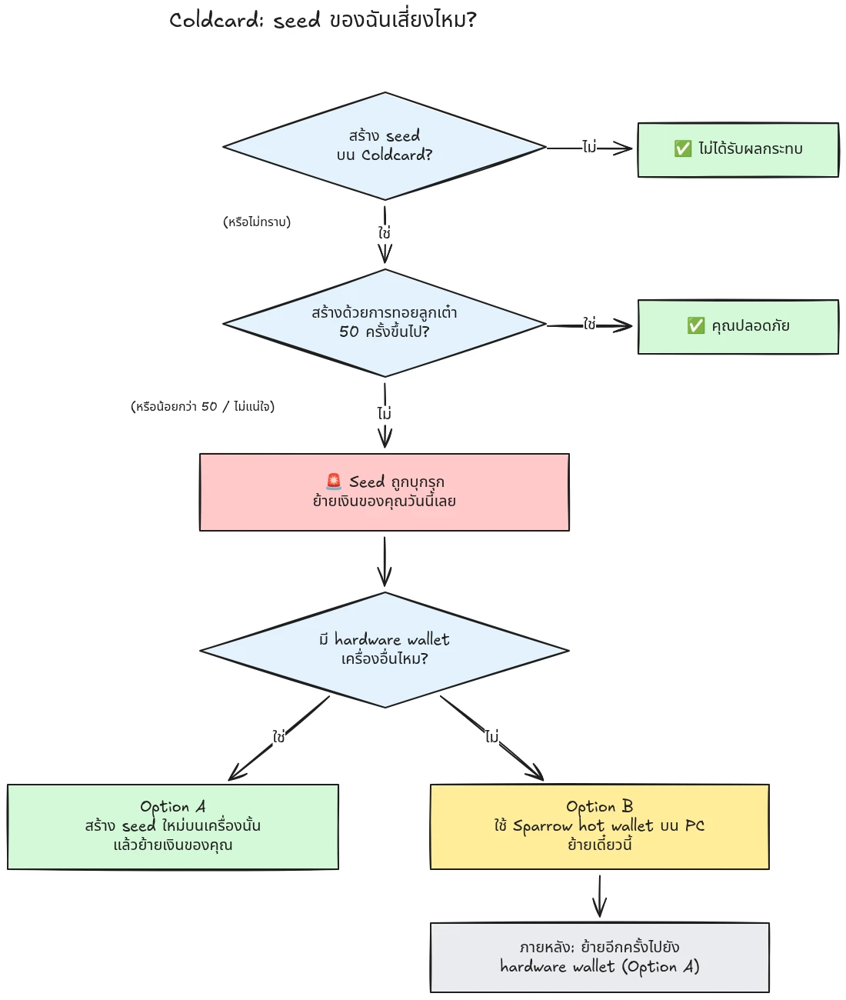

เมื่อวันที่ 30 กรกฎาคม 2026 มี BTC ราว 594 BTC (ประมาณ 38 ล้านดอลลาร์) ถูกขโมยไปภายในเวลาไม่ถึงครึ่งชั่วโมงจาก wallet ประมาณ 500 ใบที่ seed ถูกสร้างบน Coldcard hardware wallet และการโจมตียังคงดำเนินอยู่ สาเหตุหลักคือข้อบกพร่องของ firmware ในการสร้าง seed ของอุปกรณ์ Coldcard: แทนที่จะพึ่งพาความสุ่มจาก hardware ที่เพียงพอ อุปกรณ์ที่ได้รับผลกระทบกลับผสมค่าที่คาดเดาได้ เช่น internal down-counter, serial number ของอุปกรณ์ และนาฬิกาภายใน ผลคือ seed phrase ที่สร้างบนอุปกรณ์เหล่านี้มีเอนโทรปีต่ำกว่าที่ควรอย่างมาก และผู้โจมตีสามารถค้นพบได้ **โดยที่คุณไม่ต้องทำอะไรเลย** ไม่ต้องมี malware ไม่ต้อง phishing และไม่ต้องเข้าถึงตัวเครื่อง ผู้โจมตีเพียงค้นหาใน key space ที่ถูกลดขนาดลง แล้วกวาดเงินจาก wallet ใดก็ตามที่พบ

**Coldcard ทุกรุ่นได้รับผลกระทบ: Mk3, Mk4, Mk5 และ Q.** seed เดียวที่ถือว่าปลอดภัยคือ seed ที่สร้างด้วยวิธีการทอยลูกเต๋า และต้องใช้การทอยลูกเต๋าอย่างน้อย 50 ครั้งเท่านั้น หากคุณไม่รู้ จำไม่ได้ หรือไม่แน่ใจว่า seed ของคุณถูกสร้างขึ้นอย่างไร: ให้ถือว่ามันถูก compromise แล้ว และย้ายเงินของคุณทันที

บทแนะนำนี้อธิบายวิธีประเมินความเสี่ยงของคุณ และวิธีย้ายเงินไปยัง wallet ที่ปลอดภัยอย่างรวดเร็ว แต่ไม่ทำให้สถานการณ์แย่ลงระหว่างทาง

## ในกล่องเดียว: คำแนะนำแบบง่าย

ชุมชนความปลอดภัย Bitcoin กำลังประสานงานกันรอบชุดคำแนะนำแบบง่ายชุดเดียวที่ตายตัว นี่คือคำแนะนำ:

1. **คุณสร้าง seed ด้วยการทอยลูกเต๋าจริง 50+ ครั้งบน Coldcard หรือไม่?** ถ้าใช่ คุณปลอดภัย ถ้าไม่ หรือถ้าคุณไม่แน่ใจ ให้ถือว่า seed ถูก compromise แล้ว
2. **เตรียมปลายทางที่ปลอดภัย**: hardware wallet จากผู้ผลิตรายอื่นหากคุณมีอยู่ใกล้มือ มิฉะนั้นให้ใช้ Sparrow hot wallet ที่สร้างบนคอมพิวเตอร์ของคุณ (รายละเอียดในขั้นตอนที่ 2)
3. **ส่งเงินทั้งหมดของคุณไปที่นั่นวันนี้** โดยใช้ค่าธรรมเนียมที่ตั้งเป้าให้เข้า block ถัดไป และรอ confirmation (รายละเอียดในขั้นตอนที่ 3)
4. **passphrase ซื้อเวลาให้คุณได้ ไม่ใช่ความปลอดภัย** ดูเหมือนว่าผู้โจมตียังไม่ได้ไล่ค้น passphrase ในตอนนี้ ให้ย้ายก่อนที่พวกเขาจะเริ่ม
5. **อย่าพิมพ์ seed phrase ของคุณที่ไหนก็ตาม** เพื่อ "ตรวจสอบ" มัน ใครก็ตามที่ขอคำของคุณคือ scammer
6. **การอัปเดต firmware ไม่ได้แก้ seed ที่มีอยู่แล้ว** seed ที่สร้างโดย firmware ที่มีช่องโหว่จะอ่อนแอถาวร มีเพียง seed ใหม่และการย้ายเงินแบบ on-chain เท่านั้นที่จะทำให้เงินของคุณปลอดภัย

ส่วนที่เหลือของบทแนะนำนี้จะพาคุณผ่านแต่ละขั้นตอนอย่างละเอียด

## ฉันได้รับผลกระทบหรือไม่?

ถามตัวเองหนึ่งคำถาม: **seed ถูกสร้างขึ้นอย่างไร?**

- seed ที่สร้าง **โดย Coldcard เอง** (flow "new wallet" ปกติ บนรุ่นใดก็ตาม Mk3, Mk4, Mk5 หรือ Q): **ให้ถือว่าถูก compromise แล้ว** ย้ายเดี๋ยวนี้
- seed ที่สร้างด้วยฟีเจอร์ **dice roll** ของ Coldcard โดยใช้ **การทอยลูกเต๋าจริงอย่างน้อย 50 ครั้ง** ที่คุณทำเอง: เอนโทรปีมาจากลูกเต๋าของคุณ ไม่ใช่จากตัวสร้างที่มีข้อบกพร่อง นี่คือ configuration เดียวที่ปัจจุบันถือว่าปลอดภัย
- dice roll ด้วย **น้อยกว่า 50 ครั้ง** หรือคุณปล่อยให้อุปกรณ์ "เติมเต็ม" เอนโทรปี: ไม่เพียงพอ ให้ถือว่าถูก compromise แล้ว
- seed ที่ **import จากอุปกรณ์อื่น (ที่ไม่ใช่ Coldcard)**: ข้อบกพร่องของ Coldcard ไม่มีผลกับ seed นั้น แต่ให้ตรวจสอบว่าเดิมทีมันมาจากไหน
- **คุณไม่รู้หรือจำไม่ได้**: ให้ถือว่าถูก compromise แล้ว ต้นทุนของการย้ายที่ไม่จำเป็นคือค่าธรรมเนียมธุรกรรม แต่ต้นทุนของการเดาผิดคือทุกอย่าง

ความมั่นใจผิด ๆ ที่พบบ่อยสามข้อ ซึ่งขอตอบอย่างชัดเจน:

- **BIP39 passphrase** ที่วางทับ seed ที่ได้รับผลกระทบไม่ได้ทำให้ wallet ปลอดภัย มันแค่ซื้อเวลาเท่านั้น ตัว seed เองถูกค้นพบได้ ดังนั้น passphrase ของคุณจึงกลายเป็นด่านกั้นเพียงอย่างเดียว และผู้คนมักประเมินเอนโทรปีของ passphrase ได้ไม่ดีนัก ดูเหมือนว่าผู้โจมตียังไม่ได้ brute-force passphrase ในตอนนี้ ให้ย้ายไปยัง seed ใหม่ก่อนที่พวกเขาจะเริ่ม
- wallet แบบ **multisig** ที่มีคีย์ Coldcard ที่ได้รับผลกระทบอยู่ด้วย ไม่สามารถถูกดูดเงินผ่านคีย์นั้นเพียงคีย์เดียวได้ แต่คีย์ที่ได้รับผลกระทบไม่ช่วยเพิ่มความปลอดภัยจริงอีกต่อไป ให้หมุนคีย์นั้นออกจาก quorum โดยไม่ชักช้า
- **hardware wallet รุ่นใหม่กว่าที่ใช้ seed เดิม**: หลายคนซื้อ Coldcard รุ่นใหม่กว่า (หรืออุปกรณ์อื่น) แล้ว restore seed เดิมลงไป การทำเช่นนั้นไม่เปลี่ยนอะไรเลย: สิ่งที่ถูก compromise คือ seed ไม่ใช่อุปกรณ์ หาก seed ของคุณถูกสร้างบน Coldcard ที่ได้รับผลกระทบ มันยังคงอ่อนแอไม่ว่าคุณจะ restore ที่ไหนก็ตาม ให้สร้าง seed ใหม่เอี่ยมแล้ว migrate

## ขั้นตอนที่ 1: ลงมือทันที แต่อย่าด้นสด

wallet กำลังถูกดูดเงินขณะที่คุณอ่านข้อความนี้ ท่าทีที่ถูกต้องคือ migrate **วันนี้** โดยใช้เครื่องมือที่คุณเข้าใจ ไม่ใช่รีบทำธุรกรรมภายในห้านาทีด้วย setup ที่ไม่คุ้นเคยแล้วส่งเหรียญของคุณลงหลุมว่างเปล่า

ก่อนอื่น:

1. เก็บ Coldcard และข้อมูลสำรอง seed ของคุณไว้ที่เดิม คุณยังต้องใช้มันเพื่อ sign ธุรกรรม migration
2. **อย่าพิมพ์ seed phrase ของคุณลงในคอมพิวเตอร์ โทรศัพท์ หรือเว็บไซต์ใด ๆ "เพื่อตรวจสอบว่ามันได้รับผลกระทบหรือไม่"** ไม่มี checker ที่ถูกต้องตามกฎหมายใดต้องใช้ seed ของคุณ ใครก็ตามที่ขอคำ 12 หรือ 24 คำของคุณคือ scammer ที่กำลังใช้เหตุการณ์นี้หาผลประโยชน์ และ phishing campaign มักพุ่งสูงขึ้นหลังเหตุการณ์แบบนี้อย่างสม่ำเสมอ
3. ระวังว่าคุณรับข้อมูลจากที่ไหน การสื่อสารช่วงแรกของ Coinkite ถูกโต้แย้งไปแล้วหลายครั้งในช่วงวันแรก ๆ ดังนั้นอย่าถือว่า vendor เป็นแหล่งข้อมูลเดียวของคุณ: ตรวจสอบเทียบกับนักวิจัยความปลอดภัยอิสระและสำนักข่าว Bitcoin ที่เป็นที่ยอมรับ

## ขั้นตอนที่ 2: เตรียม wallet ปลายทางที่ปลอดภัย

คุณต้องใช้ wallet ที่ seed **ไม่ได้สร้างบน Coldcard** มีสองทางเลือก ขึ้นอยู่กับสิ่งที่คุณมีอยู่ใกล้มือ:

### ตัวเลือก A: คุณมี hardware wallet อื่นอยู่ใกล้มือ

นี่คือทางเลือกที่ดีที่สุด สร้าง **seed ใหม่** บน hardware wallet จากผู้ผลิตรายอื่น แล้ว migrate เงินของคุณไปที่นั่น เรามีบทแนะนำทีละขั้นตอนสำหรับอุปกรณ์หลัก ๆ:

https://planb.academy/tutorials/wallet/hardware/jade-7d62bf0c-f460-4e68-9635-af9b731dabc3

https://planb.academy/tutorials/wallet/hardware/bitbox02-6af8940f-e19b-4008-8c83-81017032608c

https://planb.academy/tutorials/wallet/hardware/trezor-safe-3-51d0d669-5d23-47c2-beb6-cc6fa0fb0ea0

https://planb.academy/tutorials/wallet/hardware/ledger-flex-3728773e-74d4-4177-b39f-bd923700c76a

https://planb.academy/tutorials/wallet/hardware/passport-74e53858-3fa2-43f9-b866-573297546236

เพื่อความมั่นใจสูงสุด ให้สร้าง seed จาก **การทอยลูกเต๋าจริง (อย่างน้อย 50 ครั้ง)** บนอุปกรณ์ที่รองรับ เพื่อให้เอนโทรปีพิสูจน์ได้ว่าเป็นของคุณ และสำหรับจำนวนเงินที่มีนัยสำคัญ ให้ใช้โอกาสนี้ย้ายไปใช้ **multisig ข้ามผู้ผลิตหลายราย** เพื่อไม่ให้ข้อบกพร่องของอุปกรณ์เพียงเครื่องเดียวสามารถทำให้เงินของคุณตกอยู่ในความเสี่ยงได้อีกด้วยตัวมันเอง

### ตัวเลือก B: ไม่มี hardware wallet อื่นพร้อมใช้: รักษาเงินให้ปลอดภัยเดี๋ยวนี้

อย่ารอหลายวันให้อุปกรณ์ถูกส่งมาถึง ในขณะที่ seed ของคุณนอนอยู่ใน key space ที่ค้นหาได้ ในฐานะ **ที่พักพิงชั่วคราว** ให้สร้าง hot wallet ด้วย seed ที่ **สร้างโดยตรงบนคอมพิวเตอร์ของคุณด้วย Sparrow Wallet**:

https://planb.academy/tutorials/wallet/desktop/sparrow-c674e2ac-d46f-4c82-92a7-7d1b0e262f5d

หรือบนโทรศัพท์ของคุณด้วย Blockstream App:

https://planb.academy/tutorials/wallet/mobile/blockstream-app-onchain-e84edaa9-fb65-48c1-a357-8a5f27996143

ใช่ โดยปกติ hot wallet ถือว่าเป็นการลดระดับจาก hardware wallet แต่ seed บนคอมพิวเตอร์ออนไลน์ที่คุณควบคุมได้ ตอนนี้ **ปลอดภัยกว่า seed Coldcard ที่ผู้โจมตีสามารถคำนวณได้** เมื่อ hardware wallet ใหม่ของคุณมาถึง ให้ทำ migration ครั้งที่สองจาก hot wallet ไปยังอุปกรณ์นั้นตามตัวเลือก A

ตั้งค่า wallet ปลายทางให้ครบถ้วนก่อนแตะต้องเงินเก่าของคุณ: สร้าง seed, จดข้อมูลสำรอง และ **ทำ recovery test** โดย restore จากข้อมูลสำรองที่คุณจดไว้เพื่อพิสูจน์ว่ามันใช้ได้ จากนั้นสร้าง address รับแรกและตรวจสอบบนหน้าจออุปกรณ์

https://planb.academy/tutorials/wallet/backup/recovery-test-5a75db51-a6a1-4338-a02a-164a8d91b895

หากแรงกดดันด้านเวลาบังคับให้คุณข้าม recovery test ให้เก็บจำนวนเงิน migration ไว้ใน *watch list* ของคุณ และทำ setup แบบเต็มที่ผ่านการทดสอบใหม่ภายในไม่กี่วัน

## ขั้นตอนที่ 3: ย้ายเงิน

ใช้ wallet coordinator เช่น Sparrow Wallet บน desktop ซึ่งทำงานกับ Coldcard แบบ air-gapped ผ่าน microSD หรือผ่าน USB ได้

https://planb.academy/tutorials/wallet/desktop/sparrow-c674e2ac-d46f-4c82-92a7-7d1b0e262f5d

ตัว migration เอง:

1. **โหลด wallet เดิมของคุณ (ที่ได้รับผลกระทบ)** ใน Sparrow เป็น watch-only wallet เหมือนที่คุณทำเมื่อตั้งค่า Coldcard ครั้งแรก
2. **สร้างธุรกรรม** ที่ส่งเงินของคุณไปยัง address รับของ wallet ใหม่ ตรวจสอบ address ปลายทางบนหน้าจอของอุปกรณ์เซ็นเครื่องใหม่ ทีละตัวอักษร
3. **จ่ายค่าธรรมเนียมจริงจัง** นี่ไม่ใช่เวลาประหยัด sats ไม่กี่ตัว: ธุรกรรมที่ค้างอยู่ใน mempool ทำให้ช่วงเวลาที่คุณเปิดรับความเสี่ยงยาวขึ้น เพราะผู้โจมตีก็ถือ private key ของคุณเช่นกัน และสามารถพยายามทำ replace-by-fee double spend กับ migration ของคุณขณะที่ยังไม่ได้รับการ confirm ได้ ใช้ fee rate ที่ตั้งเป้าเข้า block ถัดไปหรือสอง block ถัดไป
4. **sign ด้วย Coldcard ของคุณ** ตามปกติ broadcast แล้วรอ confirmation อย่างน้อยหนึ่งครั้งก่อนถือว่า migration เสร็จ ดูธุรกรรมจนกว่าจะ confirm
5. หากคุณถือ UTXO หลายรายการ การ sweep ทุกอย่างเข้า output เดียวจะเชื่อมโยงทั้งหมดบน on-chain หาก privacy model ของคุณสำคัญ ให้แบ่ง migration ออกเป็นหลายธุรกรรม แต่ในสถานการณ์เฉพาะนี้ **ความปลอดภัยมาก่อน ความเป็นส่วนตัวมาทีหลัง** อย่าปล่อยให้การปรับ privacy ให้เหมาะสมทำให้ migration ล่าช้า

https://planb.academy/tutorials/privacy/on-chain/utxo-labelling-d997f80f-8a96-45b5-8a4e-a3e1b7788c52

6. เมื่อเงินได้รับ confirmation ที่ wallet ใหม่แล้ว ให้ **ปลดระวาง seed เก่าอย่างถาวร** อย่านำกลับมาใช้ซ้ำ อย่า "เก็บไว้สำหรับจำนวนเงินเล็ก ๆ" และทำลาย backup ทางกายภาพเพื่อไม่ให้มันทำให้คุณหรือทายาทของคุณเข้าใจผิดในภายหลัง

## ขั้นตอนที่ 4: ผลที่ตามมา

- **ติดตามการสืบสวนต่อจากหลายแหล่ง** ความเข้าใจเกี่ยวกับ configuration ที่ได้รับผลกระทบขยายกว้างขึ้นมากกว่าหนึ่งครั้งแล้ว และคำแถลงของ vendor ก็ถูกแก้ไขระหว่างทาง ติดตามนักวิจัยอิสระและสื่อ Bitcoin ที่เป็นที่ยอมรับควบคู่ไปกับการเปิดเผยของ Coinkite เอง และสมมติว่าภาพรวมยังอาจเปลี่ยนได้
- **firmware ที่แก้ไขแล้วออกมาแล้ว แต่มันไม่ได้ช่วย seed ที่มีอยู่** Coinkite ได้ปล่อย firmware ที่ patch แล้ว (4.2.0 หรือใหม่กว่าสำหรับ Mk3) อัปเดต Coldcard ใดก็ตามที่คุณตั้งใจจะใช้ต่อ แต่ต้องเข้าใจว่า update ทำอะไรและไม่ทำอะไร: มันแก้การ *สร้าง* seed ต่อจากนี้; seed ที่สร้างโดย firmware ที่มีช่องโหว่ยังคงอ่อนแอถาวร หากคุณต้องการใช้ Coldcard ต่อ ให้อัปเดตก่อน จากนั้นสร้าง seed ใหม่เอี่ยม (ควรใช้การทอยลูกเต๋า 50+ ครั้ง) และย้ายเงินของคุณไปยัง seed นั้นแบบ on-chain
- **ถอดบทเรียนเชิงโครงสร้าง** เหตุการณ์นี้ไม่ได้หมายความว่า self-custody พัง เงินที่อยู่หลังเอนโทรปีจากการทอยลูกเต๋าที่ตรวจสอบได้ หรือ multi-vendor multisig ไม่เคยอยู่ในความเสี่ยง มันหมายความว่าการไว้วางใจตัวสร้างเลขสุ่มของอุปกรณ์เพียงเครื่องเดียวคือ single point of failure เหมือนอย่างอื่น เอนโทรปีที่ตรวจสอบได้ (การทอยลูกเต๋า), multisig ข้าม vendor และ backup ที่ทดสอบแล้ว คือสิ่งที่ทำให้ setup แข็งแรงพอต่อ bug ของ vendor ครั้งถัดไป ไม่ว่า vendor นั้นจะเป็นใคร
