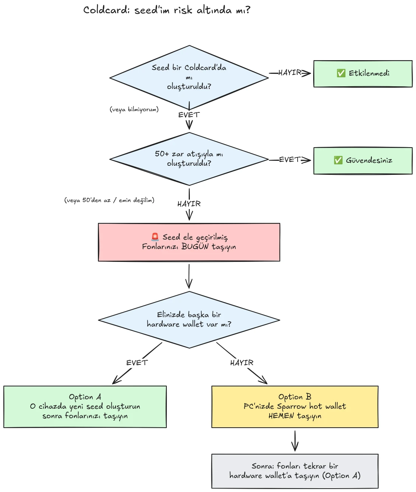

30 Temmuz 2026'da, seed'leri Coldcard donanım cüzdanlarında oluşturulmuş yaklaşık 500 cüzdandan yarım saatten kısa sürede kabaca 594 BTC (yaklaşık 38 milyon dolar) çalındı, ve saldırı hâlâ devam ediyor. Temel neden, Coldcard cihazlarının seed üretimindeki bir firmware kusuru: Etkilenen cihazlar yeterli donanım kaynaklı rastgeleliğe dayanmak yerine dahili geri sayaç, cihazın seri numarası ve dahili saat gibi öngörülebilir değerleri karıştırdı. Bunun sonucunda, bu cihazlarda oluşturulan seed ifadeleri beklenenden çok daha az entropi içerir ve bir saldırgan tarafından **sizin tarafınızdan hiçbir işlem yapılmadan** bulunabilir, zararlı yazılım, phishing veya fiziksel erişim gerekmez. Saldırgan yalnızca daralmış anahtar uzayını arar ve bulduğu herhangi bir cüzdanı boşaltır.

**Tüm Coldcard modelleri etkilenmiştir: Mk3, Mk4, Mk5 ve Q.** Güvenli kabul edilen tek seed'ler zar atma yöntemiyle oluşturulanlardır ve bu da yalnızca en az 50 zar atışı kullanıldıysa geçerlidir. Seed'inizin nasıl oluşturulduğunu bilmiyorsanız, hatırlamıyorsanız veya emin değilseniz: onu ele geçirilmiş kabul edin ve fonlarınızı derhal taşıyın.

Bu eğitim, maruziyetinizi nasıl değerlendireceğinizi ve fonlarınızı güvenli bir cüzdana nasıl taşıyacağınızı açıklar, hızlıca, fakat süreç içinde durumu daha da kötüleştirmeden.

## Tek kutuda: basit talimatlar

Bitcoin güvenlik topluluğu, tek ve sabit bir basit talimatlar kümesi etrafında koordinasyon sağlıyor. İşte bu talimatlar:

1. **Seed'inizi Coldcard üzerinde 50+ fiziksel zar atışıyla mı oluşturdunuz?** Evetse güvendesiniz. Hayırsa, veya emin değilseniz, seed'in ele geçirilmiş olduğunu varsayın.
2. **Güvenli bir hedef hazırlayın**: Elinizde varsa başka bir üreticinin donanım cüzdanı, yoksa bilgisayarınızda oluşturulmuş bir Sparrow sıcak cüzdanı (ayrıntılar Adım 2'de).
3. **Tüm fonlarınızı bugün oraya gönderin**, sonraki bloğu hedefleyen bir ücretle ve bir onay bekleyin (ayrıntılar Adım 3'te).
4. **Bir parola size zaman kazandırır, güvenlik değil.** Saldırganlar henüz parolaları deniyor gibi görünmüyor, başlamadan önce taşıma yapın.
5. **Seed ifadenizi asla hiçbir yere yazmayın** onu "kontrol etmek" için. Kelimelerinizi isteyen herkes dolandırıcıdır.
6. **Firmware'i güncellemek mevcut bir seed'i düzeltmez.** Savunmasız firmware tarafından oluşturulan bir seed sonsuza kadar zayıf kalır; fonlarınızı yalnızca yeni bir seed ve on-chain taşıma güvenceye alabilir.

Bu eğitimin geri kalanı her adımı ayrıntılı olarak ele alır.

## Etkilendim mi?

Kendinize tek bir soru sorun: **seed nasıl oluşturuldu?**

- Seed **Coldcard'ın kendisi tarafından** oluşturulduysa (herhangi bir modelde normal "new wallet" akışı, Mk3, Mk4, Mk5 veya Q): **ele geçirilmiş kabul edin**. Şimdi taşıyın.
- Seed, Coldcard'ın **zar atma** özelliğiyle, sizin bizzat yaptığınız **en az 50 fiziksel zar atışıyla** oluşturulduysa: entropi kusurlu üreteçten değil, zarlarınızdan geldi. Şu anda güvenli kabul edilen tek yapılandırma budur.
- **50'den az atışla** zar atma veya cihazın entropiyi "tamamlamasına" izin verdiyseniz: yeterli değil, ele geçirilmiş kabul edin.
- Seed **başka bir (Coldcard olmayan) cihazdan içe aktarıldıysa**: Coldcard kusuru bu seed için geçerli değildir, ancak seed'in başlangıçta nereden geldiğini denetleyin.
- **Bilmiyor veya hatırlamıyorsanız**: ele geçirilmiş kabul edin. Gereksiz bir taşımanın maliyeti bir işlem ücretidir; yanlış tahminin maliyeti her şeydir.

Açıkça ele alınması gereken iki yaygın yanlış güvence:

- Etkilenen bir seed'in üzerine eklenen **BIP39 parolası** cüzdanı güvenli hale getirmez, yalnızca zaman kazandırır. Seed'in kendisi keşfedilebilir olduğundan, parolanız tek engel haline gelir ve insanlar genellikle parola entropisini tahmin etmekte kötüdür. Saldırganlar henüz parolaları brute-force ediyor gibi görünmüyor; başlamadan önce yeni bir seed'e taşıyın.
- Etkilenen bir Coldcard anahtarı içeren bir **multisig** cüzdan, yalnızca o anahtar üzerinden boşaltılamaz; ancak etkilenen anahtar artık gerçek bir güvenlik katkısı sağlamaz. Onu gecikmeden quorum'dan çıkarıp değiştirin.

## Adım 1: Hemen harekete geçin, ama doğaçlama yapmayın

Siz bunu okurken cüzdanlar boşaltılıyor. Doğru duruş, anladığınız araçları kullanarak **bugün** taşıma yapmaktır, bilmediğiniz bir kurulumla beş dakika içinde işlem aceleye getirip coinlerinizi boşluğa göndermek değil.

Her şeyden önce:

1. Coldcard'ınızı ve seed yedeğinizi oldukları yerde tutun. Taşıma işlemini imzalamak için hâlâ onlara ihtiyacınız var.
2. **Seed ifadenizi "etkilenip etkilenmediğini kontrol etmek" için asla hiçbir bilgisayara, telefona veya web sitesine yazmayın.** Hiçbir meşru kontrol aracı seed'inizi gerektirmez. 12 veya 24 kelimenizi isteyen herkes bu olayı sömüren bir dolandırıcıdır, ve phishing kampanyaları bu tür olaylardan sonra güvenilir biçimde artar.
3. Bilgilerinizi yalnızca Coinkite'ın resmî blog ve destek kanallarından ve yerleşik Bitcoin haber kaynaklarından alın.

## Adım 2: Güvenli bir hedef cüzdan hazırlayın

Seed'i **Coldcard üzerinde oluşturulmamış** bir cüzdana ihtiyacınız var. Elinizdekilere bağlı olarak iki yol var:

### Seçenek A: Elinizde başka bir donanım cüzdanı var

Bu en iyi yoldur. Başka bir üreticinin donanım cüzdanında **yeni bir seed** oluşturun ve fonlarınızı oraya taşıyın. Başlıca cihazlar için adım adım eğitimlerimiz var:

https://planb.academy/tutorials/wallet/hardware/jade-7d62bf0c-f460-4e68-9635-af9b731dabc3

https://planb.academy/tutorials/wallet/hardware/bitbox02-6af8940f-e19b-4008-8c83-81017032608c

https://planb.academy/tutorials/wallet/hardware/trezor-safe-3-51d0d669-5d23-47c2-beb6-cc6fa0fb0ea0

https://planb.academy/tutorials/wallet/hardware/ledger-flex-3728773e-74d4-4177-b39f-bd923700c76a

https://planb.academy/tutorials/wallet/hardware/passport-74e53858-3fa2-43f9-b866-573297546236

Azami güvence için, destekleyen bir cihazda seed'i **fiziksel zar atışlarından (en az 50 atış)** oluşturun; böylece entropinin doğrulanabilir biçimde size ait olduğunu bilirsiniz. Önemli tutarlar için de bu fırsatı **farklı üreticiler arasında multisig** yapısına geçmek için kullanın; böylece tek bir cihaz kusuru bir daha kendi başına fonlarınızı riske atamaz.

### Seçenek B: Başka donanım cüzdanı yok: fonları ŞİMDİ güvenceye alın

Seed'iniz aranabilir bir anahtar uzayında dururken bir cihazın teslim edilmesini günlerce beklemeyin. **Geçici sığınak** olarak, **bilgisayarınızda doğrudan Sparrow Wallet ile oluşturulmuş** bir seed'e sahip sıcak cüzdan oluşturun:

https://planb.academy/tutorials/wallet/desktop/sparrow-c674e2ac-d46f-4c82-92a7-7d1b0e262f5d

Veya telefonunuzda Blockstream App ile:

https://planb.academy/tutorials/wallet/mobile/blockstream-app-onchain-e84edaa9-fb65-48c1-a357-8a5f27996143

Evet, sıcak cüzdan normalde donanım cüzdanına göre bir seviye aşağıdadır, fakat kontrolünüzdeki çevrim içi bir bilgisayardaki seed şu anda **saldırganın hesaplayabildiği bir Coldcard seed'inden daha güvenlidir**. Yeni donanım cüzdanınız geldiğinde, Seçenek A'yı izleyerek sıcak cüzdandan ona ikinci bir taşıma yapın.

Eski fonlarınıza dokunmadan önce hedef cüzdanı tamamen kurun: seed'i oluşturun, yedeği yazın ve **bir kurtarma testi yapın**, çalıştığını kanıtlamak için yazılı yedeğinizden geri yükleyin. Ardından ilk alıcı adresi oluşturun ve bunu cihaz ekranında doğrulayın.

https://planb.academy/tutorials/wallet/backup/recovery-test-5a75db51-a6a1-4338-a02a-164a8d91b895

Zaman baskısı kurtarma testini atlamaya zorluyorsa, taşıma tutarını *takip listenizde* tutun ve birkaç gün içinde tam, test edilmiş bir kurulumu yeniden yapın.

## Adım 3: Fonları taşıyın

Masaüstünde Sparrow Wallet gibi bir cüzdan koordinatörü kullanın; bu, Coldcard ile microSD üzerinden air-gapped biçimde veya USB üzerinden çalışır.

https://planb.academy/tutorials/wallet/desktop/sparrow-c674e2ac-d46f-4c82-92a7-7d1b0e262f5d

Taşımanın kendisi:

1. **Mevcut (etkilenen) cüzdanınızı** Sparrow'da, Coldcard'ınızı ilk kurduğunuzda yaptığınız gibi, watch-only cüzdan olarak **yükleyin**.
2. Fonlarınızı yeni cüzdanınızın bir alıcı adresine gönderen **bir işlem oluşturun**. Hedef adresi yeni imzalama cihazının ekranında karakter karakter doğrulayın.
3. **Ciddi bir ücret ödeyin.** Bu birkaç satoshi tasarruf etme anı değil: mempool'da takılı kalan bir işlem maruziyetinizi uzatır, çünkü saldırgan da özel anahtarınızı tutar ve taşımanız henüz onaylanmamışken replace-by-fee ile çifte harcama denemesi yapabilir. Sonraki bir veya iki bloğu hedefleyen bir ücret oranı kullanın.
4. Her zamanki gibi **Coldcard'ınızla imzalayın**, yayınlayın ve taşımayı tamamlanmış saymadan önce en az bir onay bekleyin. İşlem onaylanana kadar onu izleyin.
5. Çok sayıda UTXO tutuyorsanız, her şeyi tek bir çıktıya süpürmek bunların tamamını on-chain olarak birbirine bağlar. Gizlilik modeliniz önemliyse, taşımayı birkaç işleme bölün, fakat bu özel durumda **önce güvenlik, sonra gizlilik**. Gizlilik optimizasyonunun taşımayı geciktirmesine izin vermeyin.

https://planb.academy/tutorials/privacy/on-chain/utxo-labelling-d997f80f-8a96-45b5-8a4e-a3e1b7788c52

6. Fonlar yeni cüzdanda onaylandıktan sonra, **eski seed'i kalıcı olarak emekliye ayırın**. Onu yeniden kullanmayın, "küçük tutarlar için saklamayın" ve daha sonra sizi veya mirasçılarınızı yanıltmamaları için fiziksel yedekleri yok edin.

## Adım 4: Sonrası

- **Coinkite'ın açıklamalarını takip etmeyi sürdürün.** Soruşturma devam ediyor ve etkilenen yapılandırmalara dair anlayış şimdiden bir kez genişledi; yeniden genişleyebileceğini varsayın.
- **Düzeltilmiş firmware çıktı, fakat mevcut seed'leri kurtarmaz.** Coinkite yamalı firmware'i yayımladı (Mk3 için 4.2.0 veya sonrası). Kullanmaya devam etmeyi düşündüğünüz her Coldcard'ı güncelleyin, ancak güncellemenin ne yaptığını ve ne yapmadığını anlayın: ileriye dönük seed *üretimini* düzeltir; savunmasız firmware tarafından oluşturulmuş bir seed sonsuza kadar zayıf kalır. Bir Coldcard kullanmaya devam etmek istiyorsanız, önce güncelleyin, sonra yepyeni bir seed oluşturun (ideal olarak 50+ zar atışıyla) ve fonlarınızı on-chain olarak ona taşıyın.
- **Yapısal dersi çıkarın.** Bu olay self-custody'nin bozuk olduğu anlamına gelmez, doğrulanabilir zar atışı entropisinin veya çok üreticili multisig'in arkasındaki fonlar hiçbir zaman risk altında değildi. Bu, tek bir cihazın rastgele sayı üretecine güvenmenin diğerleri gibi tek bir hata noktası olduğu anlamına gelir. Doğrulanabilir entropi (zar atışları), üreticiler arası multisig ve test edilmiş yedekler, üretici kim olursa olsun bir kurulumu bir sonraki üretici hatasına karşı sağlam kılan şeylerdir.

https://planb.academy/tutorials/wallet/hardware/coldcard-co-sign-4ed0c269-29f9-4215-957d-e0deba3dcc8f
