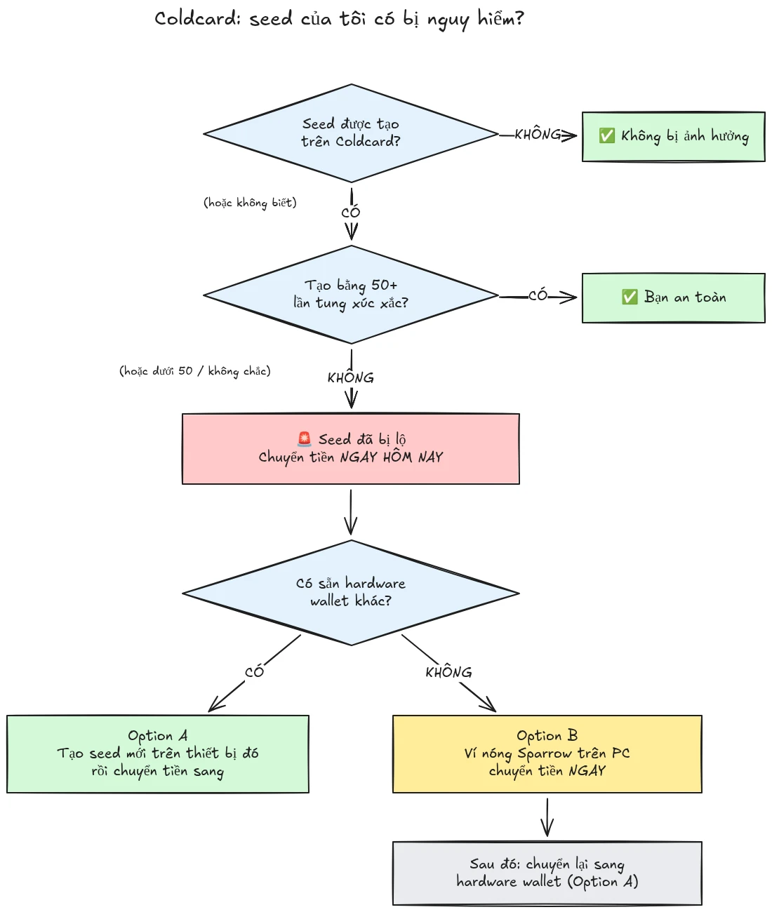

Vào July 30, 2026, khoảng 594 BTC (khoảng $38 million) đã bị đánh cắp trong chưa đầy nửa giờ từ khoảng 500 ví có seed được tạo trên ví phần cứng Coldcard, và cuộc tấn công vẫn đang tiếp diễn. Nguyên nhân gốc rễ là một lỗi firmware trong quá trình tạo seed của các thiết bị Coldcard: thay vì dựa vào đủ độ ngẫu nhiên do phần cứng tạo ra, các thiết bị bị ảnh hưởng đã trộn vào các giá trị có thể dự đoán như một bộ đếm ngược nội bộ, số sê-ri của thiết bị, và đồng hồ nội bộ. Kết quả là các cụm từ seed được tạo trên các thiết bị này chứa ít entropy hơn nhiều so với kỳ vọng và có thể bị kẻ tấn công tìm ra **mà không cần bất kỳ hành động nào từ phía bạn**, không cần malware, không phishing, không cần truy cập vật lý. Kẻ tấn công chỉ cần tìm kiếm trong không gian khóa đã bị thu hẹp và quét sạch bất kỳ ví nào chúng tìm thấy.

**Tất cả các mẫu Coldcard đều bị ảnh hưởng: Mk3, Mk4, Mk5, và Q.** Những seed duy nhất được coi là an toàn là các seed được tạo bằng phương pháp gieo xúc xắc, và chỉ khi đã dùng ít nhất 50 lần gieo xúc xắc. Nếu bạn không biết, không nhớ, hoặc không chắc seed của mình đã được tạo như thế nào: hãy xem nó là đã bị xâm phạm và chuyển tiền của bạn ngay lập tức.

Hướng dẫn này giải thích cách đánh giá mức độ phơi nhiễm của bạn và cách di chuyển tiền của bạn sang một ví bảo mật, nhanh chóng, nhưng không làm tình hình tệ hơn trong quá trình đó.

## Trong một khung: các chỉ dẫn đơn giản

Cộng đồng bảo mật Bitcoin đang phối hợp quanh một bộ chỉ dẫn đơn giản, cố định. Đây là bộ chỉ dẫn đó:

1. **Bạn có tạo seed của mình bằng 50+ lần gieo xúc xắc vật lý trên Coldcard không?** Nếu có, bạn an toàn. Nếu không, hoặc nếu bạn không chắc, hãy giả định seed đã bị xâm phạm.
2. **Chuẩn bị một đích đến an toàn**: ví phần cứng của nhà cung cấp khác nếu bạn có sẵn, nếu không thì một ví nóng Sparrow được tạo trên máy tính của bạn (chi tiết ở Bước 2).
3. **Gửi toàn bộ tiền của bạn đến đó hôm nay**, với mức phí nhắm tới khối tiếp theo, và chờ một xác nhận (chi tiết ở Bước 3).
4. **Passphrase cho bạn thêm thời gian, không phải sự an toàn.** Có vẻ kẻ tấn công chưa thử vét cạn passphrase, hãy di chuyển trước khi chúng bắt đầu.
5. **Không bao giờ nhập cụm từ seed của bạn vào bất cứ đâu** để "kiểm tra" nó. Bất kỳ ai yêu cầu các từ của bạn đều là kẻ lừa đảo.
6. **Cập nhật firmware không sửa được seed hiện có.** Một seed được tạo bởi firmware có lỗ hổng sẽ yếu mãi mãi; chỉ một seed mới và một lần chuyển on-chain mới bảo vệ được tiền của bạn.

Phần còn lại của hướng dẫn này sẽ đi qua từng bước một cách chi tiết.

## Tôi có bị ảnh hưởng không?

Hãy tự hỏi một câu: **seed đã được tạo như thế nào?**

- Seed được tạo **bởi chính Coldcard** (luồng "ví mới" thông thường, trên bất kỳ mẫu nào, Mk3, Mk4, Mk5, hoặc Q): **hãy xem nó là đã bị xâm phạm**. Di chuyển ngay.
- Seed được tạo bằng tính năng **gieo xúc xắc** của Coldcard, với **ít nhất 50 lần gieo xúc xắc vật lý** do chính bạn thực hiện: entropy đến từ xúc xắc của bạn, không phải từ bộ tạo bị lỗi. Đây là cấu hình duy nhất hiện được coi là an toàn.
- Gieo xúc xắc với **ít hơn 50 lần gieo**, hoặc bạn để thiết bị "hoàn tất" entropy: không đủ, hãy xem nó là đã bị xâm phạm.
- Seed **được nhập từ một thiết bị khác (không phải Coldcard)**: lỗi Coldcard không áp dụng cho seed đó, nhưng hãy kiểm tra lại nguồn gốc ban đầu của nó.
- **Bạn không biết hoặc không nhớ**: hãy xem nó là đã bị xâm phạm. Chi phí của một lần di chuyển không cần thiết là phí giao dịch; chi phí của một phỏng đoán sai là tất cả mọi thứ.

Hai kiểu trấn an sai phổ biến, được xử lý rõ ràng:

- Một **BIP39 passphrase** đặt trên một seed bị ảnh hưởng không làm cho ví an toàn, nó chỉ giúp bạn có thêm thời gian. Bản thân seed có thể bị phát hiện, vì vậy passphrase của bạn trở thành rào cản duy nhất, và mọi người thường rất kém trong việc ước lượng entropy của passphrase. Có vẻ kẻ tấn công chưa vét cạn passphrase; hãy di chuyển sang một seed mới trước khi chúng bắt đầu.
- Một ví **multisig** có chứa một khóa Coldcard bị ảnh hưởng không thể bị rút sạch chỉ qua khóa đó, nhưng khóa bị ảnh hưởng không còn đóng góp bảo mật thực sự nữa. Hãy loại nó khỏi nhóm ký không chậm trễ.

## Bước 1: Hành động ngay, nhưng đừng ứng biến

Ví đang bị rút sạch trong lúc bạn đọc những dòng này. Cách xử lý đúng là di chuyển **hôm nay**, bằng các công cụ bạn hiểu, không phải vội vàng tạo một giao dịch trong năm phút với một thiết lập xa lạ rồi gửi coin của bạn vào hư vô.

Trước mọi thứ khác:

1. Giữ Coldcard và bản sao lưu seed của bạn nguyên tại chỗ. Bạn vẫn cần chúng để ký giao dịch di chuyển.
2. **Không bao giờ nhập cụm từ seed của bạn vào bất kỳ máy tính, điện thoại, hoặc website nào "để kiểm tra xem nó có bị ảnh hưởng không".** Không có công cụ kiểm tra hợp pháp nào cần seed của bạn. Bất kỳ ai yêu cầu 12 hoặc 24 từ của bạn đều là kẻ lừa đảo đang khai thác sự cố này, và các chiến dịch phishing thường tăng vọt sau những sự kiện như thế này.
3. Chỉ lấy thông tin từ blog và kênh hỗ trợ chính thức của Coinkite và từ các nguồn tin tức Bitcoin đã được xác lập.

## Bước 2: Chuẩn bị ví đích an toàn

Bạn cần một ví có seed **không được tạo trên Coldcard**. Có hai hướng, tùy vào thứ bạn có sẵn:

### Tùy chọn A: Bạn có sẵn một ví phần cứng khác

Đây là hướng tốt nhất. Tạo một **seed mới** trên ví phần cứng từ một nhà cung cấp khác và di chuyển tiền của bạn đến đó. Chúng tôi có các hướng dẫn từng bước cho những thiết bị chính:

https://planb.academy/tutorials/wallet/hardware/jade-7d62bf0c-f460-4e68-9635-af9b731dabc3

https://planb.academy/tutorials/wallet/hardware/bitbox02-6af8940f-e19b-4008-8c83-81017032608c

https://planb.academy/tutorials/wallet/hardware/trezor-safe-3-51d0d669-5d23-47c2-beb6-cc6fa0fb0ea0

https://planb.academy/tutorials/wallet/hardware/ledger-flex-3728773e-74d4-4177-b39f-bd923700c76a

https://planb.academy/tutorials/wallet/hardware/passport-74e53858-3fa2-43f9-b866-573297546236

Để có mức đảm bảo tối đa, hãy tạo seed từ **các lần gieo xúc xắc vật lý (ít nhất 50 lần gieo)** trên một thiết bị hỗ trợ tính năng đó, để entropy có thể được xác minh là của chính bạn. Và với các khoản đáng kể, hãy nhân cơ hội này chuyển sang **multisig giữa các nhà cung cấp khác nhau**, để không một lỗi thiết bị đơn lẻ nào có thể tự nó khiến tiền của bạn gặp rủi ro lần nữa.

### Tùy chọn B: Không có ví phần cứng khác: bảo vệ tiền NGAY

Đừng chờ nhiều ngày để thiết bị được giao trong khi seed của bạn nằm trong một không gian khóa có thể tìm kiếm. Như một **nơi trú ẩn tạm thời**, hãy tạo một ví nóng với seed **được tạo trực tiếp trên máy tính của bạn bằng Sparrow Wallet**:

https://planb.academy/tutorials/wallet/desktop/sparrow-c674e2ac-d46f-4c82-92a7-7d1b0e262f5d

Hoặc, trên điện thoại của bạn, bằng Blockstream App:

https://planb.academy/tutorials/wallet/mobile/blockstream-app-onchain-e84edaa9-fb65-48c1-a357-8a5f27996143

Đúng, ví nóng thường là một bước lùi so với ví phần cứng, nhưng một seed trên máy tính trực tuyến do bạn kiểm soát hiện đang **an toàn hơn một seed Coldcard mà kẻ tấn công có thể tính ra**. Khi ví phần cứng mới của bạn đến, hãy thực hiện lần di chuyển thứ hai từ ví nóng sang ví đó, theo Tùy chọn A.

Thiết lập hoàn chỉnh ví đích trước khi chạm vào tiền cũ của bạn: tạo seed, ghi lại bản sao lưu, và **thực hiện kiểm tra khôi phục**, khôi phục từ bản sao lưu đã viết của bạn để chứng minh nó hoạt động. Sau đó tạo địa chỉ nhận đầu tiên và xác minh nó trên màn hình thiết bị.

https://planb.academy/tutorials/wallet/backup/recovery-test-5a75db51-a6a1-4338-a02a-164a8d91b895

Nếu áp lực thời gian buộc bạn bỏ qua kiểm tra khôi phục, hãy giữ số tiền di chuyển trong *danh sách theo dõi* của bạn và làm lại một thiết lập đầy đủ, đã được kiểm thử trong vòng vài ngày.

## Bước 3: Chuyển tiền

Sử dụng một phần mềm điều phối ví như Sparrow Wallet trên máy tính để bàn, hoạt động với Coldcard air-gapped qua microSD hoặc qua USB.

https://planb.academy/tutorials/wallet/desktop/sparrow-c674e2ac-d46f-4c82-92a7-7d1b0e262f5d

Bản thân việc di chuyển:

1. **Tải ví hiện có (bị ảnh hưởng) của bạn** trong Sparrow dưới dạng ví watch-only, đúng như bạn đã làm khi thiết lập Coldcard lần đầu.
2. **Tạo một giao dịch** gửi tiền của bạn đến một địa chỉ nhận của ví mới. Xác minh địa chỉ đích trên màn hình của thiết bị ký mới, từng ký tự một.
3. **Trả một mức phí nghiêm túc.** Đây không phải lúc tiết kiệm vài sats: một giao dịch bị kẹt trong mempool kéo dài thời gian phơi nhiễm của bạn, vì kẻ tấn công cũng nắm khóa bí mật của bạn và có thể thử chi tiêu hai lần bằng replace-by-fee đối với giao dịch di chuyển của bạn khi nó chưa được xác nhận. Dùng mức phí nhắm tới một hoặc hai khối tiếp theo.
4. **Ký bằng Coldcard của bạn** như thường lệ, phát tán, và chờ ít nhất một xác nhận trước khi xem việc di chuyển là hoàn tất. Theo dõi giao dịch cho đến khi nó được xác nhận.
5. Nếu bạn nắm giữ nhiều UTXO, việc quét tất cả vào một đầu ra duy nhất sẽ liên kết tất cả chúng on-chain. Nếu mô hình quyền riêng tư của bạn quan trọng, hãy chia việc di chuyển thành nhiều giao dịch, nhưng trong tình huống cụ thể này, **bảo mật trước, quyền riêng tư sau**. Đừng để tối ưu hóa quyền riêng tư làm chậm việc di chuyển.

https://planb.academy/tutorials/privacy/on-chain/utxo-labelling-d997f80f-8a96-45b5-8a4e-a3e1b7788c52

6. Khi tiền đã được xác nhận tại ví mới, **cho seed cũ nghỉ hưu vĩnh viễn**. Đừng dùng lại nó, đừng "giữ nó cho các khoản nhỏ", và phá hủy các bản sao lưu vật lý để chúng không thể gây hiểu lầm cho bạn hoặc người thừa kế của bạn sau này.

## Bước 4: Hậu sự cố

- **Tiếp tục theo dõi các công bố của Coinkite.** Cuộc điều tra đang tiếp diễn và hiểu biết về các cấu hình bị ảnh hưởng đã từng mở rộng thêm một lần; hãy giả định nó có thể mở rộng nữa.
- **Firmware đã sửa lỗi đã có, nhưng nó không cứu được các seed hiện có.** Coinkite đã phát hành firmware đã vá (4.2.0 hoặc mới hơn cho Mk3). Cập nhật bất kỳ Coldcard nào bạn định tiếp tục sử dụng, nhưng hãy hiểu bản cập nhật làm gì và không làm gì: nó sửa việc *tạo* seed trong tương lai; một seed được tạo bởi firmware có lỗ hổng vẫn yếu mãi mãi. Nếu bạn muốn tiếp tục dùng Coldcard, hãy cập nhật trước, rồi tạo một seed hoàn toàn mới (lý tưởng là với 50+ lần gieo xúc xắc) và chuyển tiền của bạn sang đó on-chain.
- **Rút ra bài học cấu trúc.** Sự cố này không có nghĩa là tự quản lý đã hỏng, tiền nằm sau entropy gieo xúc xắc có thể xác minh hoặc multisig đa nhà cung cấp chưa từng gặp rủi ro. Nó có nghĩa là tin tưởng trình tạo số ngẫu nhiên của một thiết bị duy nhất là một điểm lỗi đơn lẻ như bất kỳ điểm lỗi nào khác. Entropy có thể xác minh (gieo xúc xắc), multisig giữa các nhà cung cấp, và các bản sao lưu đã được kiểm thử là những gì làm cho một thiết lập đủ vững chắc trước lỗi nhà cung cấp tiếp theo, bất kể nhà cung cấp đó là ai.

https://planb.academy/tutorials/wallet/hardware/coldcard-co-sign-4ed0c269-29f9-4215-957d-e0deba3dcc8f
