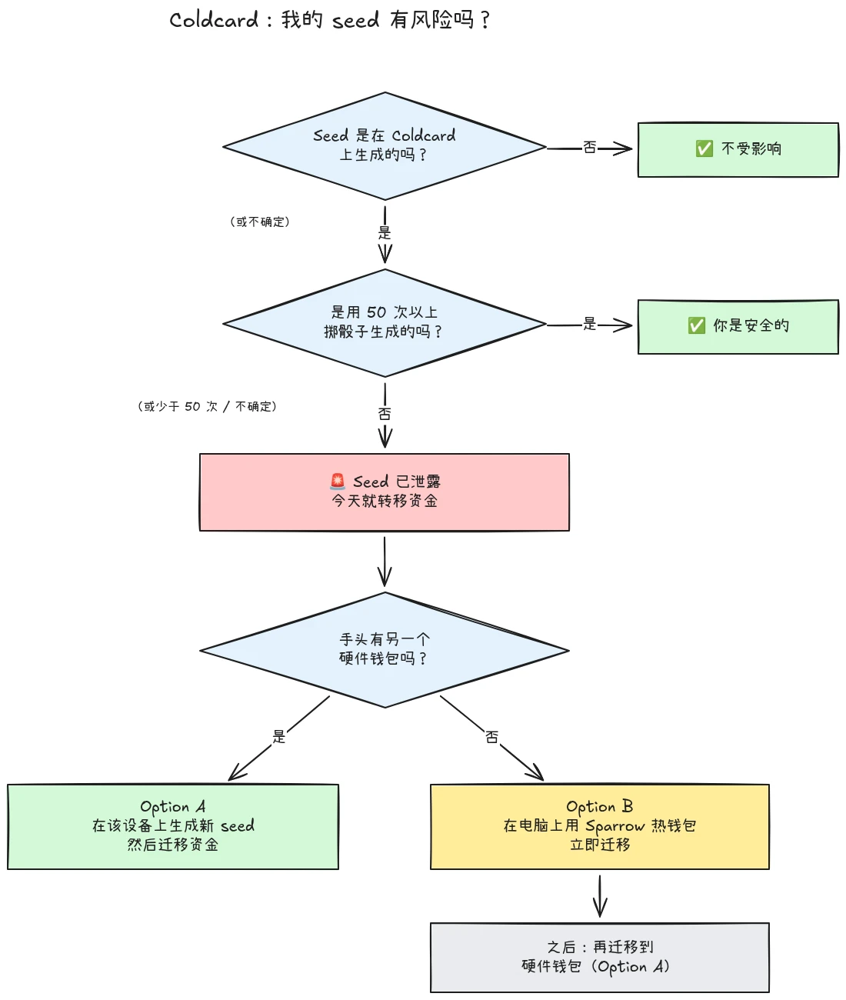

2026 年 7 月 30 日，大约 594 BTC（约 3800 万美元）在不到半小时内从约 500 个钱包中被盗，这些钱包的种子都是在 Coldcard 硬件钱包上生成的，而且攻击仍在持续。根本原因是 Coldcard 设备的种子生成存在固件缺陷：受影响的设备没有依赖足够的硬件生成随机性，而是混入了可预测的值，例如内部递减计数器、设备序列号和内部时钟。因此，在这些设备上生成的种子短语所含熵远低于预期，攻击者可以**在你无需采取任何操作的情况下**找到它们，不需要恶意软件、不需要钓鱼，也不需要物理接触。攻击者只需搜索缩小后的密钥空间，并扫走他们找到的任何钱包。

**所有 Coldcard 型号均受影响：Mk3、Mk4、Mk5 和 Q。** 目前唯一被认为安全的种子，是用掷骰子方法生成的种子，并且只有在至少使用了 50 次掷骰子的情况下才安全。如果你不知道、不记得，或不确定你的种子是如何生成的：请将其视为已泄露，并立即转移你的资金。

本教程说明如何评估你的风险暴露，以及如何快速将资金迁移到安全钱包，同时避免在过程中把情况弄得更糟。

## 一个框里的简单指令

Bitcoin 安全社区正在围绕一套固定的简单指令进行协调。如下：

1. **你是否在 Coldcard 上用 50 次以上实体掷骰生成了种子？** 如果是，你是安全的。如果不是，或你不确定，请假定该种子已泄露。
2. **准备一个安全目的地**：如果手边有另一家厂商的硬件钱包，就使用它；否则使用在你电脑上生成的 Sparrow 热钱包（详见步骤 2）。
3. **今天就把所有资金发送到那里**，使用以进入下一个区块为目标的手续费，并等待一次确认（详见步骤 3）。
4. **passphrase 只能为你争取时间，不能带来安全。** 攻击者目前似乎还没有开始穷举 passphrase；在他们开始之前完成迁移。
5. **绝不要在任何地方输入你的种子短语** 来“检查”它。任何索要你单词的人都是骗子。
6. **更新固件无法修复现有种子。** 由有漏洞固件生成的种子会永远保持脆弱；只有新种子和一次链上转移才能保护你的资金。

本教程剩余部分会逐步详细讲解每一步。

## 我受影响了吗？

问自己一个问题：**种子是如何生成的？**

- 种子是**由 Coldcard 本身生成的**（任何型号 Mk3、Mk4、Mk5 或 Q 上的正常“new wallet”流程）：**将其视为已泄露**。现在就迁移。
- 种子是用 Coldcard 的**掷骰子**功能生成的，并且你亲自完成了**至少 50 次实体掷骰**：熵来自你的骰子，而不是有缺陷的生成器。这是目前唯一被认为安全的配置。
- 掷骰子**少于 50 次**，或你让设备“补完”熵：不够，请将其视为已泄露。
- 种子是**从另一台（非 Coldcard）设备导入的**：Coldcard 缺陷不适用于该种子，但要审查它最初来自哪里。
- **你不知道或不记得**：请将其视为已泄露。不必要迁移的成本是一笔交易手续费；猜错的成本是全部资金。

三个常见的错误安慰，需要明确说明：

- 在受影响种子之上使用 **BIP39 passphrase** 并不会让钱包变安全，它只会争取时间。种子本身可以被发现，因此你的 passphrase 会成为唯一屏障，而人们通常很难准确估计 passphrase 熵。攻击者目前似乎还没有开始暴力破解 passphrase；请在他们开始之前迁移到新种子。
- 包含受影响 Coldcard 密钥的**多签**钱包，不能仅通过该密钥被盗空，但受影响的密钥已经不再贡献真正的安全性。请立即将它从 quorum 中轮换出去。
- **使用同一种子的更新硬件钱包**：很多人购买了更新的 Coldcard（或另一台设备），并把现有种子恢复到上面。这不会改变任何事：被泄露的是种子，而不是设备。如果你的种子是在受影响的 Coldcard 上生成的，无论你把它恢复到哪里，它都仍然脆弱。请生成一个全新种子并迁移。

## 步骤 1：立即行动，但不要临场发挥

你阅读这段文字时，钱包正在被盗空。正确姿态是使用你理解的工具在**今天**完成迁移，而不是用陌生设置在五分钟内匆忙发起一笔交易，把你的币发送到虚空中。

在做任何事情之前：

1. 把你的 Coldcard 和种子备份留在原处。你仍然需要它们来签署迁移交易。
2. **绝不要把你的种子短语输入任何电脑、手机或网站来“检查它是否受影响”。** 合法的检查工具不需要你的种子。任何索要你 12 个或 24 个单词的人，都是在利用这次事件的骗子，而在这类事件之后，钓鱼活动总会可靠地激增。
3. 注意你从哪里获取信息。Coinkite 的早期沟通在最初几天已经被多次推翻，因此不要把厂商当作你的唯一信息来源：请与独立安全研究人员和成熟的 Bitcoin 新闻媒体交叉核对。

## 步骤 2：准备安全的目的地钱包

你需要一个种子**不是在 Coldcard 上生成的**钱包。根据你手边有什么，有两条路径：

### 选项 A：你手边有另一台硬件钱包

这是最佳路径。在另一家厂商的硬件钱包上生成一个**新种子**，并将你的资金迁移到那里。我们为主要设备提供了逐步教程：

https://planb.academy/tutorials/wallet/hardware/jade-7d62bf0c-f460-4e68-9635-af9b731dabc3

https://planb.academy/tutorials/wallet/hardware/bitbox02-6af8940f-e19b-4008-8c83-81017032608c

https://planb.academy/tutorials/wallet/hardware/trezor-safe-3-51d0d669-5d23-47c2-beb6-cc6fa0fb0ea0

https://planb.academy/tutorials/wallet/hardware/ledger-flex-3728773e-74d4-4177-b39f-bd923700c76a

https://planb.academy/tutorials/wallet/hardware/passport-74e53858-3fa2-43f9-b866-573297546236

为了获得最大保证，请在支持该功能的设备上用**实体掷骰（至少 50 次）**生成种子，这样熵就可验证地来自你自己。对于较大金额，请借此机会转向**跨不同厂商的多签**，这样任何单一设备缺陷以后都无法再独自让你的资金面临风险。

### 选项 B：没有其他硬件钱包可用：立刻保护资金

不要在你的种子位于可搜索密钥空间中时，等待数天让设备送达。作为**临时避难所**，创建一个热钱包，其种子**直接在你的电脑上用 Sparrow Wallet 生成**：

https://planb.academy/tutorials/wallet/desktop/sparrow-c674e2ac-d46f-4c82-92a7-7d1b0e262f5d

或者，在你的手机上使用 Blockstream App：

https://planb.academy/tutorials/wallet/mobile/blockstream-app-onchain-e84edaa9-fb65-48c1-a357-8a5f27996143

是的，热钱包通常比硬件钱包低一个安全级别，但你控制的一台联网电脑上的种子，目前**比攻击者可以计算出的 Coldcard 种子更安全**。等你的新硬件钱包送达后，按照选项 A，从热钱包再做第二次迁移到硬件钱包。

在触碰旧资金之前，完整设置好目的地钱包：生成种子，写下备份，并**执行一次恢复测试**，从你写下的备份中恢复，以证明它可用。然后生成第一个接收地址，并在设备屏幕上验证它。

https://planb.academy/tutorials/wallet/backup/recovery-test-5a75db51-a6a1-4338-a02a-164a8d91b895

如果时间压力迫使你跳过恢复测试，请把迁移金额放在你的*观察列表*中，并在数天内重新完成一套完整且经过测试的设置。

## 步骤 3：转移资金

使用桌面端 Sparrow Wallet 这样的钱包协调器；它可以通过 microSD 或 USB 与离线隔离的 Coldcard 配合工作。

https://planb.academy/tutorials/wallet/desktop/sparrow-c674e2ac-d46f-4c82-92a7-7d1b0e262f5d

迁移本身：

1. 在 Sparrow 中**加载你的现有（受影响）钱包**作为只读钱包，就像你第一次设置 Coldcard 时所做的那样。
2. **构建一笔交易**，将你的资金发送到新钱包的接收地址。请在新的签名设备屏幕上逐字逐符核对目的地地址。
3. **支付足够高的手续费。** 现在不是省几个 sats 的时候：卡在 mempool 中的交易会延长你的风险暴露，因为攻击者同样持有你的私钥，并且可以在你的迁移交易未确认时尝试通过 replace-by-fee 双花替换它。使用以进入接下来一两个区块为目标的费率。
4. 像往常一样**用你的 Coldcard 签名**，广播交易，并等待至少一次确认后，才认为迁移完成。持续观察交易，直到它确认。
5. 如果你持有许多 UTXO，把所有资金扫到单一输出会在链上把它们全部关联起来。如果你的隐私模型很重要，可以把迁移拆成多笔交易，但在这种具体情况下，**安全第一，隐私第二**。不要让隐私优化延误迁移。

https://planb.academy/tutorials/privacy/on-chain/utxo-labelling-d997f80f-8a96-45b5-8a4e-a3e1b7788c52

6. 一旦资金在新钱包中得到确认，**永久弃用旧种子**。不要重复使用它，不要“留着小额资金用”，并销毁实体备份，避免它们日后误导你或你的继承人。

## 步骤 4：后续处理

- **继续从多个来源跟进调查。** 对受影响配置的理解已经不止一次扩大，厂商声明也在过程中被修正。除 Coinkite 自身披露外，也要跟踪独立研究人员和成熟 Bitcoin 媒体，并假定情况仍可能变化。
- **修复后的固件已经发布，但它无法挽救现有种子。** Coinkite 已发布修补固件（Mk3 为 4.2.0 或更高版本）。请更新任何你打算继续使用的 Coldcard，但要理解更新能做什么、不能做什么：它修复的是今后的种子*生成*；由有漏洞固件生成的种子会永远保持脆弱。如果你想继续使用 Coldcard，请先更新，然后生成一个全新种子（最好用 50 次以上掷骰），并通过链上交易把资金转移到它。
- **吸取结构性教训。** 这次事件并不意味着自托管已经失效，位于可验证掷骰熵或多厂商多签背后的资金从未处于风险之中。它意味着，信任单一设备的随机数生成器，就像其他任何单点故障一样。可验证熵（掷骰）、跨厂商多签和经过测试的备份，才是让一套设置能抵御下一次厂商 bug 的东西，无论厂商是谁。
