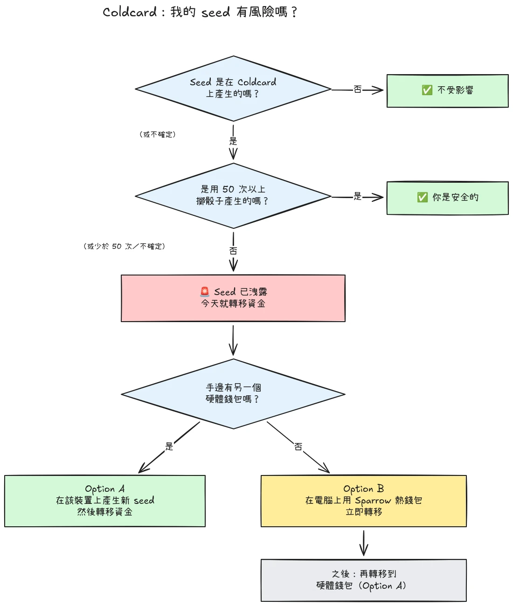

2026 年 7 月 30 日，約 594 BTC（約 3,800 萬美元）在不到半小時內，從約 500 個錢包中被竊走，這些錢包的 seed 都是在 Coldcard 硬體錢包上產生的，，而且攻擊仍在持續中。根本原因是 Coldcard 裝置在 seed 產生上的韌體缺陷：受影響的裝置沒有依靠足夠的硬體隨機性，而是混入了可預測的數值，例如內部倒數計數器、裝置序號和內部時鐘。結果，在這些裝置上產生的 seed 詞組所包含的熵遠低於預期，而且攻擊者**不需要您做任何事**就能找出它們，，不需要惡意軟體、不需要網路釣魚、也不需要實體接觸。攻擊者只要搜尋這個被縮小的金鑰空間，就能把找到的任何錢包一掃而空。

**所有 Coldcard 型號都受影響：Mk3、Mk4、Mk5 和 Q。**唯一被視為安全的 seed，是使用擲骰子方法產生的 seed，而且必須至少擲了 50 次骰子。如果您不知道、不記得，或不確定您的 seed 是怎麼產生的：就把它當成已經洩露，並立刻轉移您的資金。

本教學說明如何評估您的曝險，以及如何把您的資金遷移到安全的錢包，，要快，但過程中不要把事情弄得更糟。

## 一個框裡看完: : 簡單指示

比特幣安全社群正圍繞一套固定的簡單指示進行協調。內容如下：

1. **您是在 Coldcard 上以 50 次以上的實體擲骰產生 seed 的嗎？**如果是，您是安全的。如果不是，，或者您不確定，，就假設 seed 已經洩露。
2. **準備一個安全的目的地**：如果手邊有另一家廠商的硬體錢包就用它，否則就用在您電腦上產生的 Sparrow 熱錢包（細節見步驟 2）。
3. **今天就把您所有的資金送過去**，手續費設定為爭取進入下一個區塊，並等待確認（細節見步驟 3）。
4. **passphrase 為您爭取的是時間，不是安全。**攻擊者目前似乎還沒有在暴力破解 passphrase，，趁他們還沒開始之前先遷移。
5. **絕對不要把您的 seed 詞組輸入到任何地方**去「檢查」它。任何跟您要這些單字的人都是騙子。
6. **更新韌體並不能修復既有的 seed。**由有漏洞的韌體所產生的 seed 會永遠是脆弱的；只有新的 seed 加上一次鏈上轉移，才能保護您的資金。

本教學接下來會逐步詳細說明每一個步驟。

## 我受影響嗎？

問自己一個問題：**seed 是怎麼產生的？**

- seed 是**由 Coldcard 本身**產生的（任何型號上正常的「新錢包」流程，，Mk3、Mk4、Mk5 或 Q）：**把它當成已經洩露**。立刻遷移。
- seed 是用 Coldcard 的**擲骰**功能產生的，而且是您自己親手擲了**至少 50 次實體骰子**：熵來自您的骰子，而不是那個有缺陷的產生器。這是目前唯一被視為安全的設定。
- 擲骰但**少於 50 次**，或者您讓裝置去「補完」熵：不夠，，把它當成已經洩露。
- seed 是**從另一台（非 Coldcard）裝置匯入的**：Coldcard 的缺陷不適用於該 seed，但請查核它最初是從哪裡來的。
- **您不知道或不記得了**：把它當成已經洩露。多做一次不必要的遷移，代價只是一筆交易手續費；猜錯的代價則是一切。

兩個常見的錯誤安心感，在此明確說明：

- 在受影響的 seed 之上加一個 **BIP39 passphrase** 並不會讓錢包變安全，，它只是爭取時間。seed 本身是可以被找出來的，所以您的 passphrase 就成了唯一的屏障，而人們通常很不擅長估計 passphrase 的熵。攻擊者目前似乎還沒有在暴力破解 passphrase；趁他們還沒開始之前，先遷移到新的 seed。
- 一個包含受影響 Coldcard 金鑰的**多重簽名**錢包，無法單靠那把金鑰就被掏空，但那把受影響的金鑰已經不再提供任何實質的安全性。請毫不拖延地把它輪換出簽名門檻之外。

## 步驟 1: : 立刻行動，但不要即興發揮

就在您閱讀這段文字的當下，錢包正在被掏空。正確的姿態是**今天**就遷移，使用您理解的工具，，而不是在五分鐘內用一套陌生的設定倉促做出一筆交易，把您的幣送進虛空。

在做任何事之前：

1. 把您的 Coldcard 和 seed 備份保留在原處。您還需要它們來簽署遷移交易。
2. **絕對不要把您的 seed 詞組輸入任何電腦、手機或網站「來檢查它是否受影響」。**沒有任何正當的檢查工具需要您的 seed。任何跟您要 12 或 24 個單字的人，都是在利用這次事件行騙，，而且在這類事件之後，網路釣魚活動一定會激增。
3. 只從 Coinkite 的官方部落格與支援管道，以及信譽良好的比特幣新聞來源取得資訊。

## 步驟 2: : 準備一個安全的目的地錢包

您需要一個 seed **不是在 Coldcard 上產生**的錢包。依您手邊有什麼，有兩條路：

### 選項 A: : 您手邊有另一個硬體錢包

這是最好的一條路。在另一家廠商的硬體錢包上產生一個**新的 seed**，並把您的資金遷移過去。我們有主要裝置的逐步教學：

https://planb.academy/tutorials/wallet/hardware/jade-7d62bf0c-f460-4e68-9635-af9b731dabc3

https://planb.academy/tutorials/wallet/hardware/bitbox02-6af8940f-e19b-4008-8c83-81017032608c

https://planb.academy/tutorials/wallet/hardware/trezor-safe-3-51d0d669-5d23-47c2-beb6-cc6fa0fb0ea0

https://planb.academy/tutorials/wallet/hardware/ledger-flex-3728773e-74d4-4177-b39f-bd923700c76a

https://planb.academy/tutorials/wallet/hardware/passport-74e53858-3fa2-43f9-b866-573297546236

為了取得最高的保證，請在支援此功能的裝置上，用**實體擲骰（至少 50 次）**產生 seed，這樣熵就可驗證地屬於您自己。而若金額可觀，不妨趁這個機會改用**跨不同廠商的多重簽名**，如此一來，再也不會有任何單一裝置的缺陷能夠獨自讓您的資金陷入風險。

### 選項 B: : 沒有其他硬體錢包可用：現在就保護資金

不要在您的 seed 還躺在一個可被搜尋的金鑰空間裡時，花好幾天等一台裝置寄到。作為**臨時避難所**，請建立一個熱錢包，其 seed **直接在您的電腦上用 Sparrow Wallet 產生**：

https://planb.academy/tutorials/wallet/desktop/sparrow-c674e2ac-d46f-4c82-92a7-7d1b0e262f5d

或者，在您的手機上，使用 Blockstream App：

https://planb.academy/tutorials/wallet/mobile/blockstream-app-onchain-e84edaa9-fb65-48c1-a357-8a5f27996143

沒錯，熱錢包通常比硬體錢包低一階，，但一個放在您自己掌控的連網電腦上的 seed，目前**比一個攻擊者能算出來的 Coldcard seed 更安全**。等您的新硬體錢包到貨後，再依照選項 A，從熱錢包做第二次遷移。

在動您的舊資金之前，先把目的地錢包完全設定好：產生 seed、寫下備份，並**執行一次復原測試**，，用您手寫的備份還原，以證明它可行。然後產生第一個接收位址，並在裝置螢幕上驗證它。

https://planb.academy/tutorials/wallet/backup/recovery-test-5a75db51-a6a1-4338-a02a-164a8d91b895

如果時間壓力迫使您跳過復原測試，請把遷移的金額放進您的*觀察清單*，並在數日內重做一次完整且經過測試的設定。

## 步驟 3: : 轉移資金

使用錢包協調工具，例如桌面版的 Sparrow Wallet，它可以透過 microSD 或 USB 與離線隔離（air-gapped）的 Coldcard 搭配運作。

https://planb.academy/tutorials/wallet/desktop/sparrow-c674e2ac-d46f-4c82-92a7-7d1b0e262f5d

遷移本身：

1. **在 Sparrow 中載入您現有的（受影響的）錢包**，作為唯讀錢包，就像您當初第一次設定 Coldcard 時那樣。
2. **建立一筆交易**，把您的資金送到新錢包的一個接收位址。請在新簽名裝置的螢幕上，逐字元驗證目的地位址。
3. **付一筆夠高的手續費。**現在不是省幾聰的時候：一筆卡在 mempool 的交易會延長您的曝險時間，因為攻擊者也握有您的私鑰，可以在您的遷移交易還未確認時，嘗試用 replace-by-fee 做雙重支付。請使用能爭取進入接下來一到兩個區塊的費率。
4. 照常**用您的 Coldcard 簽署**、廣播，並在認定遷移完成之前，至少等待一次確認。持續盯著這筆交易直到它被確認。
5. 如果您持有很多 UTXO，把所有東西一次掃進單一輸出，會在鏈上把它們全部關聯起來。如果隱私模型對您很重要，就把遷移拆成好幾筆交易，，但在這個特定情況下，**安全優先，隱私其次**。不要讓隱私最佳化拖延了遷移。

https://planb.academy/tutorials/privacy/on-chain/utxo-labelling-d997f80f-8a96-45b5-8a4e-a3e1b7788c52

6. 一旦資金在新錢包中被確認，就**永久淘汰舊的 seed**。不要重複使用它，不要「留著放小額」，並銷毀實體備份，以免日後誤導您自己或您的繼承人。

## 步驟 4: : 後續

- **持續關注 Coinkite 的揭露。**調查仍在進行中，而對受影響設定的認知已經擴大過一次；請假設它還可能再擴大。
- **修正版韌體已經發布，，但它救不回既有的 seed。**Coinkite 已釋出修補後的韌體（Mk3 為 4.2.0 或更新版本）。請更新任何您打算繼續使用的 Coldcard，但要理解這個更新做了什麼、又沒有做什麼：它修正的是往後的 seed *產生*；由有漏洞的韌體所產生的 seed 會永遠是脆弱的。如果您想繼續使用 Coldcard，請先更新，然後產生一個全新的 seed（最好用 50 次以上的擲骰），並在鏈上把您的資金轉移到它上面。
- **記取結構性的教訓。**這次事件並不表示自我保管失敗了，，那些背後有可驗證擲骰熵、或跨廠商多重簽名保護的資金，從頭到尾都沒有風險。它表示的是：信任單一裝置的亂數產生器，就跟任何其他單點故障一樣。可驗證的熵（擲骰）、跨廠商的多重簽名，以及經過測試的備份，才是讓一套設定能夠承受下一個廠商臭蟲的關鍵，不管那家廠商是誰。

https://planb.academy/tutorials/wallet/hardware/coldcard-co-sign-4ed0c269-29f9-4215-957d-e0deba3dcc8f