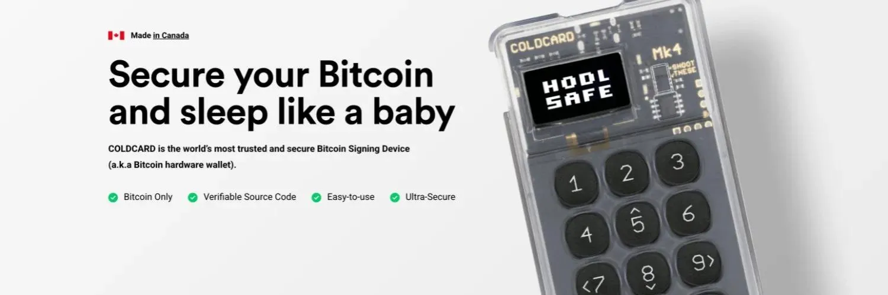

Bitcoini privaatvõtme loomine, varundamine ja kasutamine Coldcard seadmega ja Bitcoin Core'iga

## Täielik juhend privaatvõtme genereerimiseks Coldcardi abil ja selle kasutamiseks läbi oma Bitcoin Core sõlme liidese!

Bitcoini võrgu kasutamise tuumaks on asümmeetrilise krüptograafia kontseptsioon: võtmepaar - üks privaatne ja teine avalik - mis krüpteerivad ja dekrüpteerivad andmeid, kontseptsioon, mis tagab suhtluse konfidentsiaalsuse.

Bitcoini puhul võimaldab sellise privaatse ja avaliku võtmepaari genereerimine meil bitcoine hoida (UTXO ehk Kulutamata Tehingu Väljund) ja allkirjastada tehinguid nende kulutamiseks.

Tänapäeval on saadaval mitmeid tööriistu, mis hõlbustavad privaatvõtme juhuslikku genereerimist ja selle varundamist tekstikujul, kasutades BIP 39 standardit - standardit, mis määrab, kuidas rahakotid seostavad mnemoonilist fraasi (seemnefraasi) krüpteerimisvõtmetega. Enamasti koosneb mnemooniline fraas 12 või 24 sõnast, mis tuleb turvaliselt varundada, et oleks võimalik hiljem rahakotti ja selle bitcoine taastada.

Sel artiklis õpime, kuidas genereerida privaatvõtit kasutades Coldcard Mk4, üht maailma enimkasutatud ja turvalisemat seadet Bitcoini maailmas, kasutades täringuveeretamise meetodit maksimaalse entroopia tagamiseks, ja kuidas seda kasutada Bitcoin Core'iga õhulõhega eraldatud viisil!

> 🧰| Hangi järgmised tööriistad juhendi järgimiseks:
>
> - Coldcard seade (Mk3 või Mk4)
> - MicroSD kaart (4GB piisab)
> - Ainult toitega magnetiline USB kaabel (mini-usb Mk3 jaoks, usb-c Mk4 jaoks)
> - Üks või mitu kvaliteetset täringut

## Uue mnemoonilise fraasi genereerimine Coldcardiga

Alustame privaatvõtme loomise protsessi nullist, eeldades värskelt pakendist võetud Coldcardi, millele on juba seadistatud PIN-kood (järgige seadme algseadistamisel Coldcardi juhiseid).

> 🚨 | Juba seadistatud Coldcardi privaatvõtme lähtestamiseks järgige neid samme:
> Advanced/Tools > Danger Zone > Seed Functions > Destroy Seed> ✓
> _Tähelepanu_: need sammud järgides unustab teie Coldcard privaatvõtme. Veenduge, et olete oma mnemoonilise fraasi korralikult varundanud, kui soovite seda hiljem taastada.

## Järgitavad sammud:

Ühendage Coldcard PIN-koodiga > Uued Seemnesõnad > 24 Sõna Täringuveeretus

Tehke 100 täringuveeretust, kirjutades iga veeretuse tulemuse 1-st 6-ni Coldcardile pärast iga veeretust. Selle meetodi praktiseerimisega loote 256 baiti entroopiat, soodustades seeläbi täiesti juhusliku privaatvõtme loomist. Coinkite pakub ka vajalikku dokumentatsiooni nende entroopia genereerimise süsteemi iseseisvaks kontrollimiseks.

Kui 100 täringuveeretust on lõpetatud, vajutage ✓ ja seejärel kirjutage saadud 24 sõna järjekorras üles. Kontrollige kaks korda ja vajutage ✓. Lõpuks jääb üle ainult läbi viia Coldcardil 24 sõna kontrolltest, ja voilà, teie uus privaatvõti on loodud!

Järgmiseks valige, kas aktiveerida NFC (Mk4) ja USB funktsioonid, järgides kuvatavaid samme. Peamenüüs olles on nüüd aeg seadme tarkvara uuendada. Minge Advanced/Tools > Upgrade Firmware > Show Version, ja kontrollige ametlikul veebilehel, et valideerida ja laadida alla viimane saadaolev versioon. On soovitatav Coldcard uuendada, et saada maksimaalset turvalisust.
Enne jätkamist on soovitatav üles märkida privaatvõtmega seotud peamise võtme sõrmejälg (XFP). See andmed võimaldavad kiiret valideerimist, kui olete taastamise korral õiges rahakotis. Minge Advanced/Tools > View Identity > Master Key Fingerprint (XFP) ja kirjutage üles saadud kaheksakohaline tähtnumbriline jada. XFP võib märkida samasse kohta kui mnemooniline fraas, see ei ole tundlik andmed.
> 💡 On soovitatav testida oma mnemoonilise fraasi varukoopiat erinevas tarkvaras. Selle turvaliseks tegemiseks konsulteerige meie artikliga Verify the backup of a Bitcoin wallet with Tails in less than 5 minutes.

## Turvaboonus: "Salafraas" (valikuline)

'Salafraas (secret phrase) on suurepärane element, mida lisada rahakoti konfiguratsiooni, et lisada turvakiht oma bitcoinide kaitsmiseks. Salafraas toimib omamoodi 25. sõnana mnemoonilises fraasis. Lisamisel luuakse täiesti uus rahakott koos privaatvõtmega ja sellele vastava mnemoonilise fraasiga. Uut mnemoonilist fraasi ei ole vaja üles kirjutada, kuna sellele rahakotile pääseb ligi algse mnemoonilise fraasi ja valitud salafraasi ühendamisel.

Eesmärk on märkida salafraas eraldi mnemoonilisest fraasist, sest ründajal, kellel on juurdepääs mõlemale esemele, on juurdepääs vahenditele. Teisest küljest, ründajal, kellel on juurdepääs ainult ühele neist esemetest, ei ole vahenditele juurdepääsu ja just see konkreetne eelis optimeerib rahakoti konfiguratsiooni turvataset.

## Sammud salafraasi lisamiseks Coldcardiga:

Passphrase > Add Words (soovitatav) > Apply. Seade kuvab salafraasiga genereeritud uue rahakoti XFP, mis tuleks samadel põhjustel üles märkida koos salafraasiga.

> 💡 Lisaresursid seoses salafraasiga:

    https://blog.trezor.io/is-your-passphrase-strong-enough-d687f44c63af
    https://blog.coinkite.com/everything-you-need-to-know-about-passphrases/
    https://armantheparman.com/passphrase/

## Rahakoti eksportimine Bitcoin Core'i

Rahakott on nüüd valmis eksportimiseks tarkvarasse, et suhelda Bitcoin võrguga. Selles juhendis kasutame Bitcoin Core'i (v24.1).

Vaadake meie paigaldus- ja konfiguratsioonijuhendeid Bitcoin Core'i jaoks:

> Running your own node with Bitcoin Core - https://agora256.com/faire-tourner-son-propre-noeud-avec-bitcoin-core/
>
> Configuring Tor for a Bitcoin Core node - https://agora256.com/configuration-tor-bitcoin-core/

Esmalt sisestage micro SD kaart Coldcardi, seejärel eksportige rahakott Bitcoin Core'i järgides neid samme: Advanced/Tools > Export Wallet > Bitcoin Core. Micro SD kaardile kirjutatakse kaks faili: bitcoin-core.sig & bitcoin-core.txt. Sisestage micro SD kaart arvutisse, kuhu on paigaldatud Bitcoin Core, ja avage .txt fail. Näete rida "For wallet with master key fingerprint." Kontrollige, kas kaheksakohaline XFP ühtib sellega, mille märkisite privaatvõtme loomisel.
Enne failis olevate juhiste järgimist alustagem Bitcoin Core liideses rahakoti ettevalmistamisega, järgides neid samme: minge vahekaardile Fail > Loo rahakott. Valige oma rahakotile nimi (vahetatav termin "porte-monnaie"ga Core'is) ja märkige valikud Keela privaatvõtmed, Loo tühi rahakott ja Rahakoti kirjeldajad, nagu allpool olevas pildis näidatud. Seejärel vajutage nuppu Loo.

Kui rahakott on Bitcoin Core'is loodud, minge vahekaardile Aken > Konsool ja veenduge, et lehe ülaosas valitud rahakoti nimi kuvab loodud rahakoti nime.

Nüüd kopeerige Coldcardi poolt varem genereeritud .txt failist rida, mis algab importdescriptors'iga, seejärel kleepige see Bitcoin Core konsooli. Vastuseks peaks tulema rida, mis sisaldab "success": true.

Kui vastus sisaldab "message": "Ranged descriptors should not have a label", kustutage kopeeritud reast .txt failist sissekanne "label": "Coldcard xxxx0000", seejärel kleepige täielik rida tagasi Bitcoin Core konsooli.

Abi: [https://github.com/Coldcard/firmware/blob/master/docs/bitcoin-core-usage.md](https://github.com/Coldcard/firmware/blob/master/docs/bitcoin-core-usage.md)

## Rahakoti importimise valideerimine Bitcoin Core'is

Et veenduda operatsiooni õnnestumises, on vajalik kinnitada, et soovitud rahakott on imporditud Bitcoin Core'i. Lihtne meetod selle kinnitamiseks on kontrollida, kas Coldcardis genereeritud aadressid vastavad Bitcoin Core'is genereeritud aadressidele.

Bitcoin Core: Vasta > Loo uus vastuvõtu aadress
Coldcard: Aadressi uurija > Valige aadress, mis algab bc1q-ga. Coldcardi aadress 'bc1q' peaks ühtima Bitcoin Core'is kuvatava aadressiga.
Tehingute vastuvõtmine ja saatmine 'õhulõhega' režiimis

Tehingu vastuvõtmine on äärmiselt lihtne; vajutage lihtsalt Vasta, märgistage tehing (valikuline, kuid soovitatav) ja Looge uus vastuvõtu aadress. Seejärel jääb üle ainult aadress saatjaga jagada.

Nüüd on selle Coldcard + Bitcoin Core seadistuse võtmeelement tehingute saatmine ilma, et Coldcard ja selle privaatvõti oleksid ühendatud internetiga, meetodit nimetatakse õhulõhega, mis kasutab TBSP (PSBT - osaliselt allkirjastatud Bitcoin tehingud) funktsiooni Bitcoinis.
Põhimõtteliselt kasutame Bitcoin Core liidest tehingu koostamiseks, mille seejärel ekspordime mikro SD kaardi kaudu Coldcardile allkirjastamiseks ja seejärel tagastame allkirjastatud tehingufaili Bitcoin Core'i ning edastame tehingu võrku. Peame seda tegema nii, kuna Bitcoin Core'i imporditud rahakotil pole privaatvõtit, ainult avalik võti (mis võimaldab meil genereerida meie vastuvõtu aadresse), seega on meil võimatu tehingut otse tarkvaras allkirjastada, et kulutada meie bitcoine.

Enne jätkamist veenduge, et järgmised valikud oleksid Seaded > Rahakott lubatud:

> - Luba mündikontrolli funktsioonid
> - Kuluta kinnitamata mündid (Valikuline)
> - Luba TBPS kontrollid

### Sammud saatmiseks õhulõhega režiimis:
Saada > Sisendid > valige soovitud utxo, seejärel sisestage saaja aadress väljale Maksa. Tehingutasu: Vali... > Kohandatud > Sisesta tehingutasu (Bitcoin Core arvutab satsi/kilobaidi kohta, erinevalt enamikust alternatiivsetest rahakottide lahendustest, mis arvutavad satsi/baidi kohta. Seega 4000 satsi/kilobaidi = 4 satsi/baidi). Loo allkirjastamata tehing > salvesta fail oma mikro SD kaardile ja sisesta see Coldcardi.
Coldcardis vajuta Valmis allkirjastamiseks, kontrolli tehingu üksikasju, seejärel vajuta ✓ ja sisesta mikro SD kaart tagasi arvutisse, kui allkirjastatud failid on loodud.

Tagasi Bitcoin Core'is, mine faili vahekaardile > Laadi TBSP failist, ja sisesta allkirjastatud tehingu fail .psbt. Ekraanile ilmub PSBT toimingute kast, kinnitades, et tehing on täielikult allkirjastatud ja valmis edastamiseks. Kõik, mis jääb, on vajutada Tehingu edastamine.

### Järeldus

Coldcardi seadme ja Bitcoin Core'i kombinatsioon, millel jooksutate oma sõlme, on võimas. Lisage sellele privaatvõti, mis on genereeritud 100 täringuveeretusega ja salajane fraas, ning teie rahakoti konfiguratsioon muutub keerukaks ja tugevaks kindluseks.

Võtke meiega julgelt ühendust, et jagada oma kommentaare ja küsimusi! Meie eesmärk on jagada teadmisi ja suurendada meie mõistmist päev-päevalt.