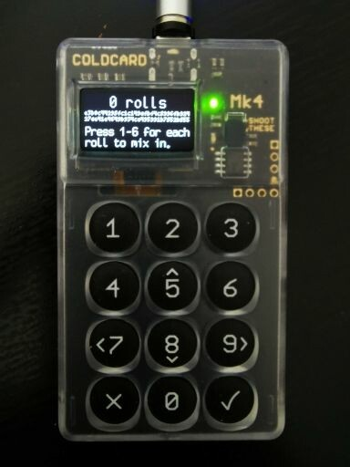
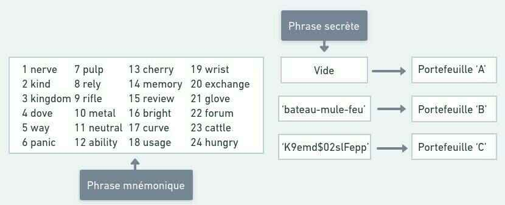
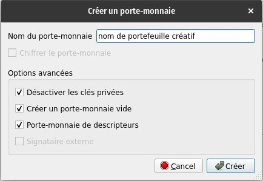
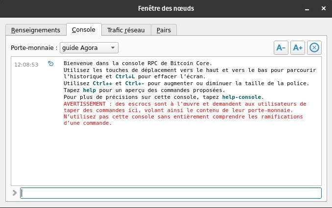
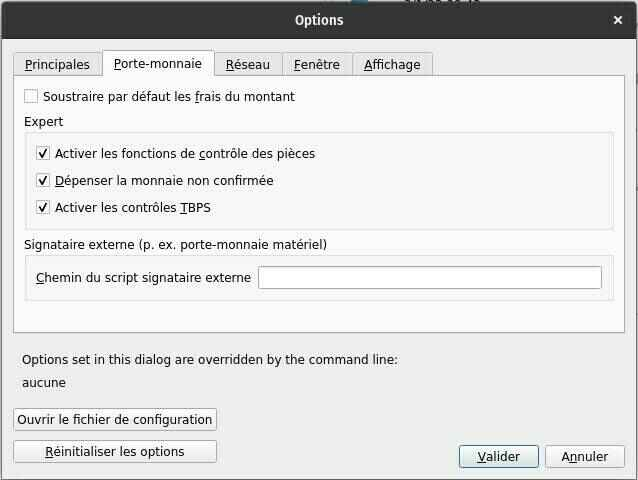
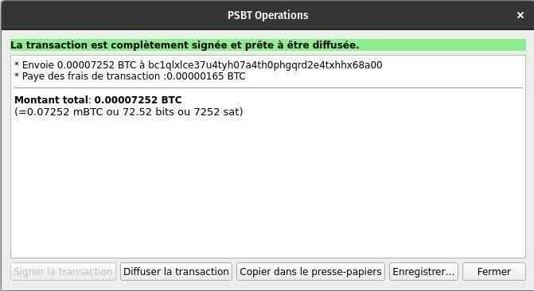

Création, sauvegarde et utilisation d'une clé privée Bitcoin avec un appareil Coldcard et Bitcoin Core

## Guide complet pour générer une clé privée à l'aide d'une Coldcard et son utilisation via l'interface de votre noeud Bitcoin Core !

À la base de l'utilisation du réseau Bitcoin se trouve le concept de cryptographie asymétrique : un couple de clés – l'une privée et l'autre publique – ayant comme fonction de chiffrer et déchiffrer des données, un concept permettant d'assurer la confidentialité d'une communication.

Dans le cas de Bitcoin, c'est en générant un tel couple de clé privée & publique que nous sommes en mesure de stocker des bitcoins (UTXO ou Unspent Transaction Output) et de signer des transactions afin de dépenser ces derniers.

Aujourd'hui, de multiples outils existent pour faciliter la génération aléatoire d'une clé privée et de sa sauvegarde sous forme textuelle à l'aide du BIP 39 – un standard déterminant comment les portefeuilles associent une phrase mnémonique (seed phrase) aux clés de chiffrement. Plus souvent qu'autrement, la phrase mnémonique se trouve sous forme de 12 ou 24 mots, lesquels il faut absolument sauvegarder de façon sécuritaire afin de se permettre de récupérer un portefeuille et ses bitcoins.

Dans cet article, nous allons apprendre à générer une clé privée à l'aide d'une Coldcard Mk4, l'un des appareils les plus répandus et sécuritaires dans le monde du Bitcoin, en se servant de la méthode du lancement de dés (Dice roll) pour garantir un maximum d'entropie, et à l'utiliser avec Bitcoin Core de façon étanche (air-gapped) !

> 🧰| Munissez-vous des outils suivant pour suivre le guide :
>
> - Appareil Coldcard (Mk3 ou Mk4)
> - Carte microSD (4GB sont suffisants)
> - Un câble USB magnétique power-only (mini-usb pour Mk3, usb-c pour Mk4)
> - Un ou plusieurs dés de qualité

## Génération d'une nouvelle phrase mnémonique avec une Coldcard

Nous allons entamer le processus de création de clé privée depuis le début en assumant une Coldcard fraîchement déballée sur laquelle un NIP a déjà été configuré (suivre les étapes sur la Coldcard lors de l'initiation de l'appareil).

> 🚨 | Pour réinitiliaser la clé privée d'une Coldcard déjà configurée, suivez ces étapes :
> Advanced/Tools > Danger Zone > Seed Functions > Destroy Seed> ✓
>
> _Attention_ : votre Coldcard oubliera la clé privée à la suite de ces étapes. Assurez-vous d'avoir bien sauvegardé votre phrase mnémonique si vous voulez pouvoir la récupérer ultérieurement.

## Étapes à suivre :

Connexion à la Coldcard avec NIP > New Seed Words > 24 Word Dice Roll

Effectuer 100 lancés de dé en inscrivant le résultat obtenu de 1 à 6 sur la Coldcard après chaque tir. En pratiquant cette méthode, vous créez 256 octets d'entropie favorisant ainsi la création d'une clé privée complètement aléatoire. Coinkite fourni également la documentation nécessaire à la vérification indépendante de leur système de génération d'entropie.

Une fois les 100 lancés de dé terminés, appuyez sur ✓ puis notez les 24 mots obtenus dans l'ordre. Vérifiez à deux reprises et appuyez sur ✓. Enfin, ne reste plus qu'à compléter le test de vérification des 24 mots sur la Coldcard, et voilà votre nouvelle clé privée créée !

Choisissez ensuite si vous souhaitez activer ou non les fonctions NFC (Mk4) et USB en suivant les étapes affichées. Une fois dans le menu principal, il est maintenant temps de mettre à jour le micro-logiciel (firmware) de l'appareil. Rendez vous dans Advanced/Tools > Upgrade Firmware > Show Version, et consultez le site web officiel pour valider et télécharger la dernière version disponible. Il est souhaitable de mettre à jour la Coldcard afin de bénéficier d'un maximum de sécurité.

Avant de poursuivre, il est recommandé de noter le Master Key Fingerprint (XFP) associé à la clé privée. Cette donnée permet de rapidement valider si l'on se trouve bien dans le bon portefeuille dans le cas d'une récupération, par exemple. Allez dans Advanced/Tools > View Identity > Master Key Fingerprint (XFP) et notez la série de huit caractères alphanumériques obtenue. Le XFP peut-être noté au même endroit que la phrase mnémonique, ce n'est pas une donnée sensible.

> 💡 Il est recommandé de tester votre sauvegarde de phrase mnémonique dans un logiciel différent. Pour le faire de façon sécuritaire, consultez notre article Vérifier la sauvegarde d'un portefeuille Bitcoin avec Tails en moins de 5 minutes.

## Bonus de sécurité : la "Phrase Secrète" (optionnel)

Une phrase secrète (passphrase) est un formidable élément à ajouter à une configuration de portefeuille afin d'ajouter une couche de sécurité pour protéger ses bitcoins. La phrase secrète agit en quelque sorte comme un 25e mot à la phrase mnémonique. Une fois que l'on en ajoute une, un portefeuille entièrement nouveau est créé ainsi qu'une clé privée et sa phrase mnémonique y étant associé. Il n'est pas nécessaire de prendre en note la nouvelle phrase mnémonique, car ce portefeuille est atteignable en combinant la phrase mnémonique initiale avec la phrase secrète choisie.

L'objectif est de noter la phrase secrète séparément de la phrase mnémonique car un attaquant ayant accès à ces deux items aura accès aux fonds s'y trouvant. À l'opposé, un attaquant n'ayant accès qu'à l'un de ces deux items n'aura aucun accès aux fonds, et c'est cet atout précis qui vient optimiser le niveau de sécurité de la configuration du portefeuille.

## Étapes à suivre pour ajouter une phrase secrète avec la Coldcard :

Passphrase > Add Words (recommandé) > Apply. L'appareil affichera le XFP du portefeuille nouvellement généré grâce à la phrase secrète, lequel il est souhaitable de noter avec la phrase secrète pour les mêmes raisons que mentionné précédemment.

> 💡 Ressources additionnelles en lien à la phrase secrète :

    https://blog.trezor.io/is-your-passphrase-strong-enough-d687f44c63af
    https://blog.coinkite.com/everything-you-need-to-know-about-passphrases/
    https://armantheparman.com/passphrase/

## Exportation du portefeuille vers Bitcoin Core

Le portefeuille est maintenant prêt à être exporté sur un logiciel afin de pouvoir interagir avec le réseau Bitcoin. Dans ce guide, nous allons utiliser Bitcoin Core (v24.1).

Référez-vous à nos guides d'installation et configuration de Bitcoin Core :

> Faire tourner son propre noeud avec Bitcoin Core - https://agora256.com/faire-tourner-son-propre-noeud-avec-bitcoin-core/
>
> Configuration de Tor pour un nœud Bitcoin Core - https://agora256.com/configuration-tor-bitcoin-core/

D'abord, insérez une carte micro SD dans la Coldcard, puis exportez le portefeuille pour Bitcoin Core en suivant ces étapes : Advanced/Tools > Export Wallet > Bitcoin Core. Deux fichiers seront inscrit sur la carte micro SD : bitcoin-core.sig & bitcoin-core.txt. Insérez la carte micro SD dans l'ordinateur sur lequel est installé Bitcoin Core, et ouvrez le fichier .txt. Vous verrez la ligne For wallet with master key fingerprint. Vérifiez que le XFP de huit caractères correspond bien à celui que vous avez noté lors de la création de votre clé privée.

Avant de suivre les instructions du fichier, commençons par préparer le portefeuille dans l'interface Bitcoin Core en suivant ces étapes : allez dans l'onglet Fichier > Créer un porte-monnaie. Choisissez un nom pour votre portefeuille (terme interchangeable avec porte-monnaie dans Core) et cochez les options Désactiver les clés privées, Créer un porte-monnaie vide, et Porte-monnaie de descripteurs tel qu'illustré dans l'image ci-dessous. Puis, appuyez sur le bouton Créer.

Une fois le portefeuille créé dans Bitcoin Core, allez dans l'onglet Fenêtre > Console et assurez-vous que le portefeuille sélectionné au haut de la page affiche bien le nom de celui que vous avez créé.

Maintenant, dans le fichier .txt généré par la Coldcard précédemment, copiez la ligne débutant par importdescriptors, puis collez-la dans la console de Bitcoin Core. Une réponse incluant la ligne "success": true devrait être retournée.

Si la réponse contient "message": "Ranged descriptors should not have a label", effacez l'entrée "label": "Coldcard xxxx0000" dans la ligne copiée du fichier .txt, puis recollez la ligne complète dans la console de Bitcoin Core.

Aide: https://github.com/Coldcard/firmware/blob/master/docs/bitcoin-core-usage.md

## Validation de l'importation du portefeuille dans Bitcoin Core

Pour s'assurer que l'opération a bien réussie, il faut valider que c'est bien le portefeuille souhaité qui a été importé dans Bitcoin Core. Une méthode simple de le confirmer est de vérifier que les adresses générées dans la Coldcard correspondent bien aux adresses générées sur Bitcoin Core.

Bitcoin Core : Recevoir > Créer une nouvelle adresse de réception
Coldcard : Address Explorer > Choisir l'adresse débutant parbc1q. L'adresse Coldcard 'bc1q' doit concorder avec l'adresse affichée dans Bitcoin Core.
Recevoir et envoyer des transactions en mode 'air-gapped'

Recevoir une transaction est excessivement simple ; il suffit d'appuyer sur Recevoir, étiquetter la transaction (optionnel mais recommandé), et Créer une nouvelle adresse de réception. Puis il ne reste plus qu'à partager l'adresse à l'émetteur.

Maintenant, l'élément clé de cette configuration Coldcard + Bitcoin Core est l'envoi de transactions sans que la Coldcard et sa clé privée ne soit connectée à l'Internet, une méthode appelée air-gapped faisant appel à la fonction TBSP (PSBT - Partially Signed Bitcoin Transactions) de Bitcoin.

Essentiellement, nous utilisons l'interface Bitcoin Core pour construire une transaction, que nous allons par la suite exporter via la carte micro SD sur la Coldcard pour la signer, pour ensuite retourner le fichier de transaction signé sur Bitcoin Core et diffuser la transaction au réseau. Nous devons procéder ainsi puisque de toute façon, le portefeuille importé sur Bitcoin Core ne comporte pas de clé privée, seulement la clé publique (laquelle nous permet de générer nos adresses de réception), et il nous est donc impossible de signer une transaction à même le logiciel pour dépenser nos bitcoins.

Avant de procéder, assurez-vous que les options suivantes sont activées dans Paramètres > Porte-monnaie :

> - Activer les fonctions de contrôle des pièces
> - Dépenser la monnaie non confirmée (Optionnel)
> - Activer les contrôles TBPS

### Étapes pour envoyer en mode air-gapped :

Envoyer > Inputs > choisir le utxo désiré, puis saisir l'adresse du destinataire dans Payer à. Frais de transaction : Choisir... > Personnalisés > Saisir les frais de transaction (Bitcoin Core calcul en sats/kilo-octet plutôt que sat/octet comme la plupart des solutions de portefeuille alternatives. Ainsi 4000 sats/kilo-octet = 4 sats/octet). Créer une transaction non-signée > sauvegarder le fichier dans votre carte microSD et insérez cette dernière dans la Coldcard.

Dans la Coldcard, appuyez sur Ready to sign, vérifiez les détails de la transaction puis appuyez sur ✓et remettez la carte microSD dans l'ordinateur une fois les fichiers signés générés.

De retour sur Bitcoin Core, allez dans l'onglet Fichier > Charger la TBSP d'un fichier, et saisissez le fichier de transaction signé .psbt. L'encadré PSBT Operations s'affichera à l'écran, confirmant que la transaction est complètement signée et prête à être diffusée. Ne reste plus qu'à appuyer sur Diffuser la transaction.

### Conclusion

La combinaison de l'appareil Coldcard avec Bitcoin Core, sur lequel vous roulez votre propre noeud, est puissante. Ajoutez à cela une clé privée générée avec 100 lancés de dé ainsi qu'une une phrase secrète, et votre configuration de portefeuille devient une forteresse sophistiquée et robuste.

N'hésitez pas à nous contacter pour nous partager tous vos commentaires et questions ! Notre objectif est de partager nos connaissances et d'accroître notre savoir jour après jour.
