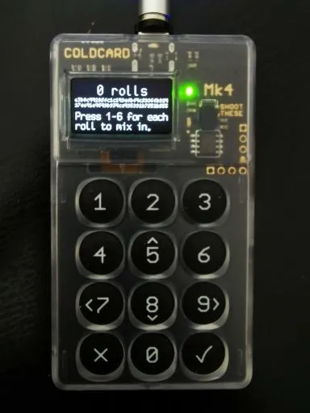
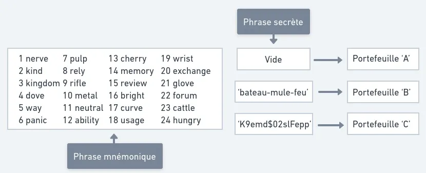
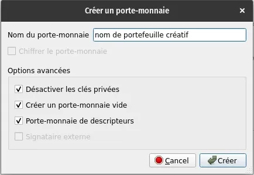
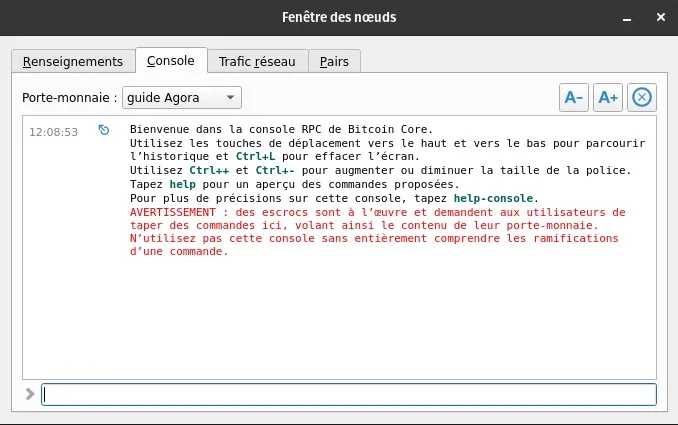
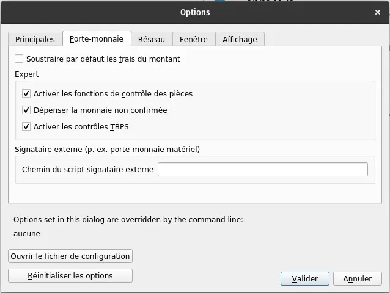
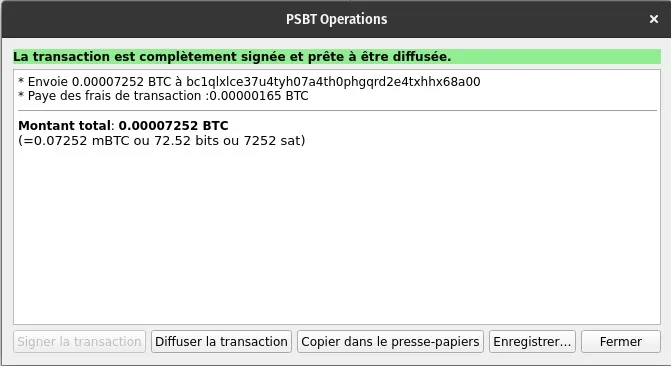

Membuat, membackup, dan menggunakan kunci privat Bitcoin dengan perangkat Coldcard dan Bitcoin Core

## Panduan lengkap untuk menghasilkan kunci privat menggunakan Coldcard, lalu memakainya melalui antarmuka Bitcoin Core di node kamu!

Di inti penggunaan jaringan Bitcoin ada konsep kriptografi asimetris: sepasang kunci — satu privat dan satu publik. Keduanya dipakai untuk menandatangani dan memverifikasi data, sebuah konsep yang menjamin keaslian dan keamanan transaksi.

Dalam konteks Bitcoin, dengan menghasilkan sepasang kunci privat dan publik, kamu bisa menyimpan bitcoin dalam bentuk UTXO (Unspent Transaction Output) dan menandatangani transaksi untuk membelanjakannya.

Sekarang sudah banyak alat yang bisa dipakai untuk menghasilkan kunci privat secara acak, lengkap dengan backup dalam bentuk frasa mnemonik sesuai standar BIP39. Standar ini menjelaskan bagaimana dompet menghubungkan frasa benih dengan kunci enkripsi. Biasanya frasa ini terdiri dari 12 atau 24 kata. Kata-kata tersebut harus di-backup dengan aman supaya dompet dan bitcoin bisa dipulihkan kapan saja.

Di artikel ini, kita akan bahas cara menghasilkan kunci privat menggunakan Coldcard Mk4, salah satu perangkat Bitcoin paling aman dan banyak dipakai. Metode yang akan dipakai adalah lemparan dadu untuk memastikan entropi maksimum. Setelah itu, kita juga akan lihat bagaimana menggunakannya bersama Bitcoin Core secara terisolasi.

> 🧰| Dapatkan alat berikut untuk mengikuti panduan:
>
> - Perangkat Coldcard (Mk3 atau Mk4)
> - Kartu MicroSD (4GB sudah cukup)
> - Kabel USB magnetik hanya untuk daya (mini-usb untuk Mk3, usb-c untuk Mk4)
> - Satu atau lebih dadu berkualitas

## Menghasilkan frasa mnemonik baru dengan Coldcard

Kita akan memulai proses membuat kunci privat dari awal, dengan asumsi Coldcard yang baru dibuka dari kemasannya dan PIN sudah diatur (ikuti langkah-langkah pada Coldcard selama inisialisasi perangkat).

> 🚨 | Untuk mereset kunci privat Coldcard yang sudah dikonfigurasi, ikuti langkah-langkah ini:
> Advanced/Tools > Danger Zone > Seed Functions > Destroy Seed> ✓
> _Perhatian_: Coldcard-mu akan melupakan kunci privat setelah langkah-langkah ini. Pastikan kamu sudah membackup frasa mnemonik dengan benar jika kamu ingin dapat memulihkannya nanti.

## Langkah-langkah yang harus diikuti:

Hubungkan ke Coldcard dengan PIN > New Seed Words > 24 Word Dice Roll

Lakukan 100 kali dice roll, lalu catat hasilnya (angka 1 sampai 6) ke dalam Coldcard setelah setiap lemparan. Dengan cara ini, kamu menciptakan 256 bit entropi yang akan mendukung terciptanya kunci privat yang benar-benar acak. Coinkite juga menyediakan dokumentasi resmi yang bisa dipakai untuk melakukan verifikasi independen atas sistem generasi entropi mereka.

Setelah 100 dice roll selesai, tekan ✓ lalu tulis 24 kata yang ditampilkan secara berurutan. Lakukan verifikasi dua kali dan tekan ✓. Setelah itu, selesaikan tes verifikasi 24 kata pada Coldcard, dan voila, kunci privat barumu berhasil dibuat!
Selanjutnya, pilih apakah kamu ingin mengaktifkan fungsi NFC (Mk4) dan USB dengan mengikuti instruksi di layar. Begitu masuk ke menu utama, waktunya memperbarui firmware perangkat. Pergi ke **Advanced/Tools > Upgrade Firmware > Show Version,** lalu cek situs resmi untuk memvalidasi dan mengunduh versi terbaru. Sangat disarankan memperbarui Coldcard agar selalu mendapatkan keamanan maksimal.
Sebelum melanjutkan, catat juga Sidik Jari Kunci Utama (XFP) yang terhubung dengan kunci privat. Data ini berguna untuk validasi cepat kalau kamu perlu memastikan sedang berada di dompet yang benar saat melakukan pemulihan. Pergi ke **Advanced/Tools > View Identity > Master Key Fingerprint (XFP)** dan tuliskan seri delapan karakter alfanumerik yang muncul. XFP bisa dicatat di tempat yang sama dengan frasa mnemonik, karena data ini bukan informasi sensitif.
> 💡 Disarankan untuk menguji cadangan frasa mnemonik kamu di perangkat lunak lain. Untuk melakukannya dengan aman, kamu bisa ikuti panduan kami: Verifikasi cadangan dompet Bitcoin dengan Tails dalam waktu kurang dari 5 menit.

## Bonus Keamanan: "Passphrase" (opsional)

'Passphrase (frasa rahasia) adalah elemen hebat yang bisa ditambahkan ke konfigurasi dompet untuk menambah lapisan keamanan dalam melindungi bitcoin kamu. Passphrase berfungsi sebagai semacam kata ke-25 untuk frasa mnemonik. Setelah ditambahkan, dompet baru sepenuhnya akan dibuat bersama dengan kunci privat dan frasa mnemonik yang terkait. Tidak perlu menuliskan frasa mnemonik baru, karena dompet ini bisa diakses dengan menggabungkan frasa mnemonik awal dengan passphrase yang dipilih.

Tujuannya adalah untuk mencatat passphrase secara terpisah dari frasa mnemonik, karena penyerang yang punya akses ke kedua item tersebut akan bisa mengakses dana. Di sisi lain, penyerang yang hanya memiliki akses ke salah satu item itu tidak akan bisa mengakses dana, dan inilah keuntungan spesifik yang mengoptimalkan tingkat keamanan konfigurasi dompet.

## Langkah-langkah menambahkan passphrase dengan Coldcard:

Passphrase > Add Words (disarankan) > Apply. Perangkat akan menampilkan XFP dari dompet yang baru dibuat dengan passphrase, yang harus dicatat bersama passphrase untuk alasan yang sama seperti disebutkan sebelumnya.

> 💡 Sumber daya tambahan terkait dengan passphrase:

    https://blog.trezor.io/is-your-passphrase-strong-enough-d687f44c63af
    https://blog.coinkite.com/everything-you-need-to-know-about-passphrases/
    https://armantheparman.com/passphrase/

## Mengekspor dompet ke Bitcoin Core

Dompet sekarang siap untuk diekspor ke perangkat lunak untuk berinteraksi dengan jaringan Bitcoin. Dalam panduan ini, kita akan menggunakan Bitcoin Core (v24.1).

Lihat panduan instalasi dan konfigurasi kami untuk Bitcoin Core:

> Menjalankan node Anda sendiri dengan Bitcoin Core - https://agora256.com/faire-tourner-son-propre-noeud-avec-bitcoin-core/
>
> Mengonfigurasi Tor untuk node Bitcoin Core - https://agora256.com/configuration-tor-bitcoin-core/

Pertama, masukkan kartu microSD ke dalam Coldcard, lalu ekspor dompet untuk Bitcoin Core dengan mengikuti langkah berikut: Advanced/Tools > Export Wallet > Bitcoin Core. Dua file akan ditulis ke kartu microSD: bitcoin-core.sig dan bitcoin-core.txt. Setelah itu, masukkan kartu microSD ke komputer tempat Bitcoin Core terpasang, lalu buka file .txt. Kamu akan melihat baris “For wallet with master key fingerprint.” Pastikan sidik jari XFP delapan karakter cocok dengan yang sudah kamu catat saat membuat kunci privat.

Sebelum mengikuti instruksi yang ada di file, siapkan dompet terlebih dahulu di antarmuka Bitcoin Core dengan langkah berikut: buka tab File > Buat Dompet. Pilih nama untuk dompet kamu (istilah yang setara dengan “wallet” di Core), lalu centang opsi Nonaktifkan kunci pribadi, Buat dompet kosong, dan Deskriptor dompet seperti yang terlihat pada gambar di bawah. Setelah itu, tekan tombol Buat.

Setelah dompet dibuat di Bitcoin Core, pergi ke tab Window > Konsol dan pastikan dompet yang dipilih di bagian atas halaman sesuai dengan nama yang baru kamu buat.

Sekarang, buka file .txt yang dihasilkan Coldcard sebelumnya, lalu salin baris yang dimulai dengan importdescriptors dan tempelkan ke konsol Bitcoin Core. Jika berhasil, akan muncul respons dengan baris "success": true.

Jika respons berisi "message": "Ranged descriptors should not have a label", hapus entri "label": "Coldcard xxxx0000" dalam baris yang disalin dari file .txt, lalu tempelkan kembali baris lengkapnya ke konsol Bitcoin Core.

Bantuan: [https://github.com/Coldcard/firmware/blob/master/docs/bitcoin-core-usage.md](https://github.com/Coldcard/firmware/blob/master/docs/bitcoin-core-usage.md)

## Validasi impor dompet di Bitcoin Core

Untuk memastikan bahwa operasi berhasil, perlu memvalidasi bahwa dompet yang diinginkan telah diimpor ke Bitcoin Core. Cara sederhana untuk mengonfirmasi ini adalah dengan memverifikasi bahwa alamat yang dihasilkan di Coldcard sesuai dengan alamat yang dihasilkan di Bitcoin Core.

Bitcoin Core: Terima > Buat alamat penerimaan baru
Coldcard: Penjelajah Alamat > Pilih alamat yang dimulai dengan bc1q. Alamat Coldcard bc1q harus cocok dengan alamat yang ditampilkan di Bitcoin Core.

Menerima dan mengirim transaksi dalam mode air-gapped

Menerima transaksi sangat sederhana; cukup tekan Terima, beri label transaksi (opsional tapi disarankan), dan Buat alamat penerimaan baru. Kemudian, yang tersisa hanyalah membagikan alamat dengan pengirim.

Sekarang, elemen kunci dari pengaturan Coldcard + Bitcoin Core ini adalah mengirim transaksi tanpa Coldcard dan kunci privatnya terhubung ke internet, sebuah metode yang disebut air-gapped yang menggunakan fungsi PSBT (Partially Signed Bitcoin Transactions) dari Bitcoin.
Pada dasarnya, kita menggunakan antarmuka Bitcoin Core untuk membangun transaksi, kemudian mengekspornya melalui kartu microSD ke Coldcard untuk ditandatangani, lalu mengembalikan file transaksi yang sudah ditandatangani ke Bitcoin Core dan menyiarkan transaksi ke jaringan. Kita harus melakukannya dengan cara ini karena dompet yang diimpor ke Bitcoin Core tidak memiliki kunci privat, hanya kunci publik (yang memungkinkan kita menghasilkan alamat penerimaan), sehingga tidak mungkin bagi kita menandatangani transaksi langsung di perangkat lunak untuk membelanjakan bitcoin kita.

Sebelum melanjutkan, pastikan opsi berikut diaktifkan di Pengaturan > Dompet:

> - Aktifkan fitur kontrol koin
> - Habiskan koin yang belum dikonfirmasi (Opsional)
> - Aktifkan pemeriksaan TBPS

### Langkah-langkah untuk mengirim dalam mode air-gapped:
Kirim > Input > pilih utxo yang diinginkan, kemudian masukkan alamat penerima di Bagian Bayar ke. Biaya transaksi: Pilih... > Kustom > Masukkan biaya transaksi (Bitcoin Core menghitung dalam sats/kilobyte bukan sat/byte seperti kebanyakan solusi dompet alternatif. Jadi, 4000 sats/kilobyte = 4 sats/byte). Buat transaksi yang belum ditandatangani > simpan file ke kartu micro SD dan masukkan ke dalam Coldcard.
Di Coldcard, tekan Siap untuk menandatangani, verifikasi detail transaksi, kemudian tekan ✓ dan masukkan kembali kartu micro SD ke dalam komputer setelah file yang ditandatangani tercipta.

Kembali di Bitcoin Core, pergi ke tab File > Muat TBSP dari file, dan masukkan file transaksi yang telah ditandatangani .psbt. Kotak Operasi PSBT akan muncul di layar, mengonfirmasi bahwa transaksi telah sepenuhnya ditandatangani dan siap untuk disiarkan. Yang tersisa hanyalah menekan Siarkan transaksi.

### Kesimpulan

Kombinasi perangkat Coldcard dengan Bitcoin Core, di mana kamu menjalankan node sendiri, sangatlah kuat. Tambahkan kunci privat yang dihasilkan dari 100 lemparan dadu dan frasa rahasia, maka konfigurasi dompetmu akan menjadi benteng yang canggih dan tangguh.

Jangan ragu untuk menghubungi kami untuk berbagi komentar dan pertanyaan kamu! Tujuan kami adalah berbagi pengetahuan dan meningkatkan pemahaman kita setiap hari.
