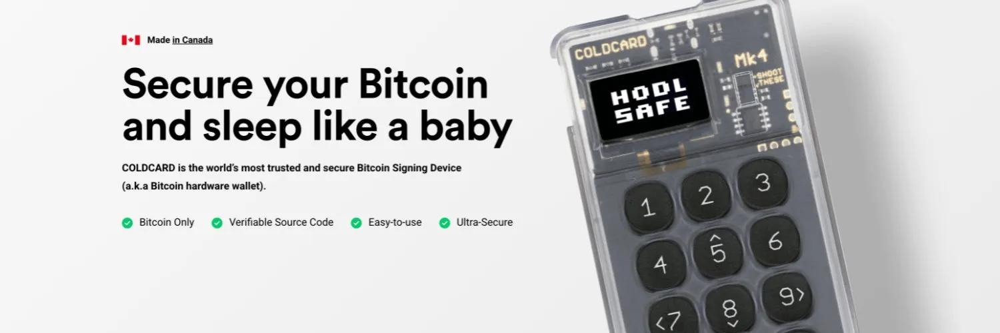
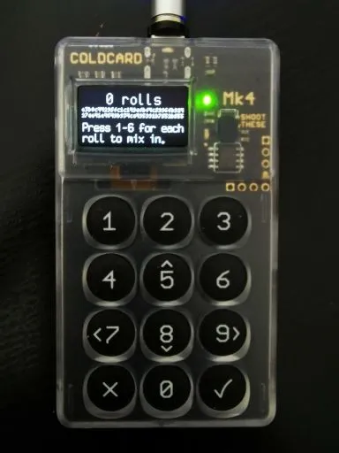
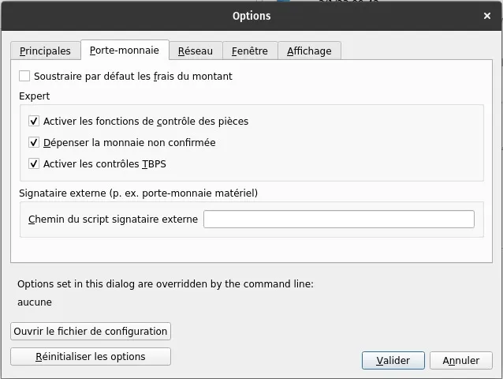

コールドカードデバイスとBitcoin Coreを使用して、ビットコインの秘密鍵を作成、バックアップ、使用する方法

## コールドカードを使用して秘密鍵を生成し、Bitcoin Coreノードのインターフェースを通じて使用するための完全ガイド！

ビットコインのネットワーク利用の核心には、非対称暗号化の概念があります。これは、データを暗号化および復号化する一対の鍵（一つは秘密鍵、もう一つは公開鍵）を用いる概念であり、通信の機密性を保証します。

ビットコインの場合、このような秘密鍵と公開鍵のペアを生成することで、ビットコイン（UTXOまたは未使用トランザクション出力）を保存し、それらを使用するためのトランザクションに署名することができます。

今日では、BIP 39（ウォレットが暗号化キーとニーモニックフレーズ（シードフレーズ）を関連付ける方法を決定する標準）を使用して、秘密鍵をランダムに生成し、テキスト形式でバックアップするための複数のツールが利用可能です。通常、ニーモニックフレーズは12または24の単語で構成され、ウォレットとそのビットコインを回復するためには、これらを安全にバックアップする必要があります。

この記事では、最も広く使用されているかつ安全なデバイスの一つであるコールドカードMk4を使用して秘密鍵を生成する方法、最大のエントロピーを確保するためのダイスロール方法、およびそれをBitcoin Coreでエアギャップ方式で使用する方法を学びます！

> 🧰| ガイドに従うために次のツールを用意してください：
>
> - コールドカードデバイス（Mk3またはMk4）
> - MicroSDカード（4GBで十分）
> - 電源専用の磁気USBケーブル（Mk3用はミニUSB、Mk4用はUSB-C）
> - 一つまたは複数の高品質なダイス

## コールドカードで新しいニーモニックフレーズを生成する

まず、PINが既に設定されている（デバイスの初期化中にコールドカードの手順に従ってください）新品のコールドカードから、ゼロから秘密鍵を作成するプロセスを開始します。

> 🚨 | 既に設定されているコールドカードの秘密鍵をリセットするには、次の手順に従ってください：
> Advanced/Tools > Danger Zone > Seed Functions > Destroy Seed > ✓
> _注意_：これらの手順に従うと、コールドカードは秘密鍵を忘れます。後で回復できるように、ニーモニックフレーズを適切にバックアップしていることを確認してください。

## 以下の手順に従ってください：

PINでコールドカードに接続 > New Seed Words > 24 Word Dice Roll

100回のダイスロールを実行し、各ロールの後にコールドカードに1から6までの結果を記録します。この方法を実践することで、256バイトのエントロピーを作成し、完全にランダムな秘密鍵の生成を促進します。Coinkiteは、彼らのエントロピー生成システムの独立した検証のために必要なドキュメントも提供しています。

100回のダイスロールを完了したら、✓を押し、次に得られた24の単語を順番に書き留めます。2回確認して✓を押します。最後に、コールドカードで24の単語の検証テストを完了するだけで、新しい秘密鍵が作成されます！

次に、表示された手順に従ってNFC（Mk4）およびUSB機能を有効にするかどうかを選択します。メインメニューに入ったら、デバイスのファームウェアを更新する時が来ました。Advanced/Tools > Upgrade Firmware > Show Versionに進み、公式ウェブサイトをチェックして最新のバージョンを検証し、ダウンロードしてください。最大限のセキュリティを得るために、コールドカードを更新することをお勧めします。
進む前に、プライベートキーに関連付けられたマスターキーフィンガープリント（XFP）をメモしておくことをお勧めします。このデータにより、例えば復旧の場合に正しいウォレットにいるかどうかを迅速に検証できます。Advanced/Tools > View Identity > Master Key Fingerprint (XFP) に進み、取得した8文字の英数字のシリーズを書き留めてください。XFPはニーモニックフレーズと同じ場所に記載できます。これは機密データではありません。

> 💡 異なるソフトウェアでニーモニックフレーズのバックアップをテストすることをお勧めします。これを安全に行うには、私たちの記事「Tailsを使用して5分未満でBitcoinウォレットのバックアップを検証する」を参照してください。

## セキュリティボーナス：「シークレットフレーズ」（オプション）

パスフレーズ（シークレットフレーズ）は、ビットコインを保護するためのセキュリティレイヤーを追加するためにウォレット設定に追加する素晴らしい要素です。パスフレーズは、ニーモニックフレーズの25番目の言葉のようなものとして機能します。追加されると、完全に新しいウォレットがプライベートキーおよびそれに関連するニーモニックフレーズと共に作成されます。新しいニーモニックフレーズを書き留める必要はありません。このウォレットは、初期のニーモニックフレーズと選択したパスフレーズを組み合わせることでアクセスできます。

目標は、攻撃者が両方のアイテムにアクセスできる場合、資金にアクセスできるため、ニーモニックフレーズからパスフレーズを別々にメモすることです。一方、攻撃者がこれらのアイテムの1つにのみアクセスできる場合、資金にアクセスできず、この特定の利点がウォレット設定のセキュリティレベルを最適化します。

## Coldcardでパスフレーズを追加する手順：

Passphrase > Add Words (推奨) > Apply。デバイスはパスフレーズで生成された新しいウォレットのXFPを表示します。これは、前述の理由と同じく、パスフレーズと共にメモする必要があります。

> 💡 パスフレーズに関連する追加リソース：

    https://blog.trezor.io/is-your-passphrase-strong-enough-d687f44c63af
    https://blog.coinkite.com/everything-you-need-to-know-about-passphrases/
    https://armantheparman.com/passphrase/

## Bitcoin Coreへのウォレットのエクスポート

ウォレットは、Bitcoinネットワークとやり取りするためにソフトウェアにエクスポートする準備ができました。このガイドでは、Bitcoin Core（v24.1）を使用します。

Bitcoin Coreのインストールと設定ガイドについては、以下を参照してください：

> Bitcoin Coreで自分のノードを運用する - https://agora256.com/faire-tourner-son-propre-noeud-avec-bitcoin-core/
>
> Bitcoin CoreノードのTor設定 - https://agora256.com/configuration-tor-bitcoin-core/

まず、ColdcardにマイクロSDカードを挿入し、次の手順に従ってBitcoin Core用にウォレットをエクスポートします：Advanced/Tools > Export Wallet > Bitcoin Core。二つのファイルがマイクロSDカードに書き込まれます：bitcoin-core.sig & bitcoin-core.txt。マイクロSDカードをBitcoin Coreがインストールされているコンピュータに挿入し、.txtファイルを開きます。「マスターキーフィンガープリントを持つウォレット用」という行が表示されます。プライベートキーを作成したときにメモした8文字のXFPが一致するか確認してください。
ファイルの指示に従う前に、以下の手順に従ってBitcoin Coreインターフェースでウォレットの準備を始めましょう：Fileタブに移動 > ウォレットを作成します。ウォレットに名前を付けてください（Coreでは「porte-monnaie」と交換可能な用語）し、Disable private keys、Create an empty wallet、そしてWallet descriptorsのオプションをチェックして、下の画像に示されているようにします。その後、Createボタンを押してください。

Bitcoin Coreでウォレットが作成されたら、Windowタブ > Consoleに移動し、ページの上部に表示されている選択されたウォレットが作成したものの名前を表示していることを確認してください。

今度は、以前にColdcardで生成された.txtファイル内でimportdescriptorsで始まる行をコピーし、それをBitcoin Coreのコンソールに貼り付けます。"success": trueを含む応答が返されるべきです。

応答に"message": "Ranged descriptors should not have a label"が含まれている場合は、.txtファイルからコピーした行の中の"label": "Coldcard xxxx0000"のエントリを消去し、完全な行を再度Bitcoin Coreのコンソールに貼り付けてください。

ヘルプ: [https://github.com/Coldcard/firmware/blob/master/docs/bitcoin-core-usage.md](https://github.com/Coldcard/firmware/blob/master/docs/bitcoin-core-usage.md)

## Bitcoin Coreでのウォレットインポートの検証

操作が成功したことを確認するためには、望ましいウォレットがBitcoin Coreにインポートされたことを検証する必要があります。これを確認する簡単な方法は、Coldcardで生成されたアドレスがBitcoin Coreで生成されたアドレスと一致するかを確認することです。

Bitcoin Core: Receive > 新しい受信アドレスを作成
Coldcard: Address Explorer > bc1qで始まるアドレスを選択します。Coldcardのアドレス 'bc1q'はBitcoin Coreに表示されるアドレスと一致するべきです。
'エアギャップ'モードでの受信と送信トランザクション

トランザクションを受信することは非常に簡単です。Receiveを押し、トランザクションにラベルを付け（オプションですが推奨されます）、新しい受信アドレスを作成します。その後、送信者とアドレスを共有するだけです。

今、このColdcard + Bitcoin Coreセットアップの鍵となる要素は、Coldcardとそのプライベートキーがインターネットに接続されていない状態でトランザクションを送信することです。これはエアギャップと呼ばれる方法で、BitcoinのTBSP（PSBT - Partially Signed Bitcoin Transactions）機能を使用します。
基本的に、Bitcoin Coreインターフェースを使用してトランザクションを構築し、それをマイクロSDカード経由でColdcardにエクスポートして署名させ、署名されたトランザクションファイルをBitcoin Coreに戻してネットワークにトランザクションをブロードキャストします。Bitcoin Coreにインポートされたウォレットにはプライベートキーがなく、公開キーのみ（これにより受信アドレスを生成できます）があるため、ソフトウェア内で直接トランザクションに署名してビットコインを使うことは不可能です。

進む前に、Settings > Walletで以下のオプションが有効になっていることを確認してください：

> - Enable coin control features
> - Spend unconfirmed coins (Optional)
> - Enable TBPS checks

### エアギャップモードで送信する手順：
送信 > 入力 > 希望のutxoを選択し、Pay toに受取人のアドレスを入力します。トランザクション手数料: 選択... > カスタム > トランザクション手数料を入力します（Bitcoin Coreは、ほとんどの代替ウォレットソリューションがsat/byteで計算するのに対し、sats/kilobyteで計算します。したがって、4000 sats/kilobyte = 4 sats/byteです）。署名されていないトランザクションを作成 > ファイルをマイクロSDカードに保存し、Coldcardに挿入します。
Coldcardでは、Ready to signを押し、トランザクションの詳細を確認した後、✓を押して署名されたファイルが生成されたら、マイクロSDカードを再びコンピュータに挿入します。

Bitcoin Coreに戻り、Fileタブ > Load TBSP from fileを選択し、署名されたトランザクションファイル .psbtを入力します。PSBT Operationsボックスが画面に表示され、トランザクションが完全に署名され、ブロードキャストの準備ができていることを確認します。あとは、Broadcast transactionを押すだけです。

### 結論

ColdcardデバイスとBitcoin Coreの組み合わせは、自分自身のノードを実行することで強力です。それに、100回のサイコロロールで生成された秘密鍵と秘密のフレーズを加えると、あなたのウォレット設定は洗練された堅牢な要塞になります。

コメントや質問を共有したい場合は、お気軽にお問い合わせください！私たちの目標は、知識を共有し、日々理解を深めることです。