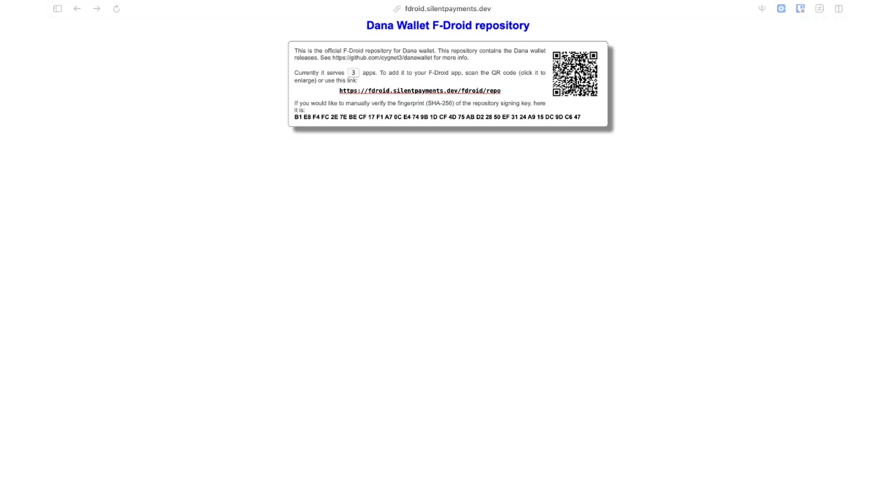
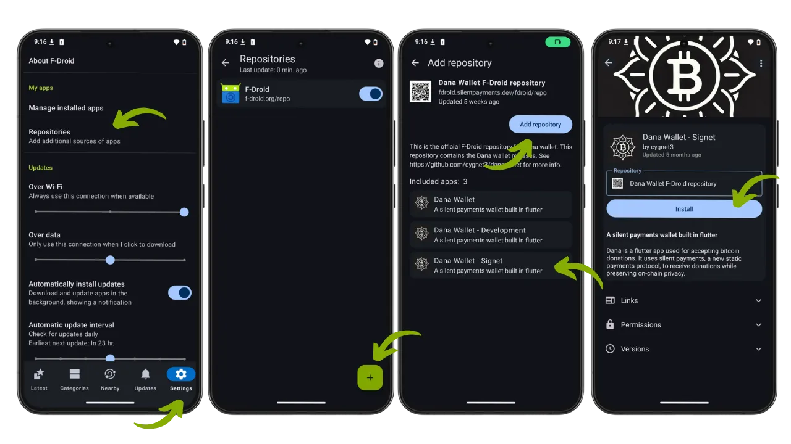
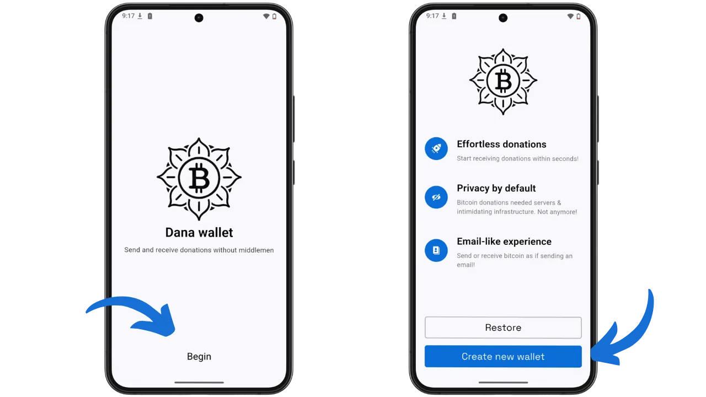
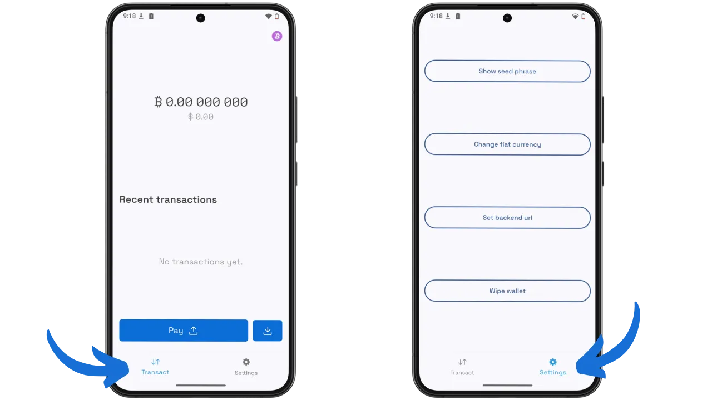
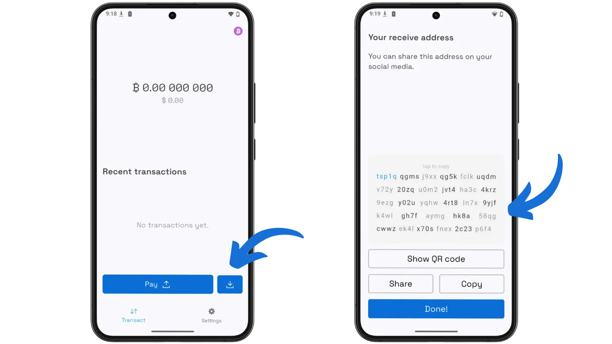
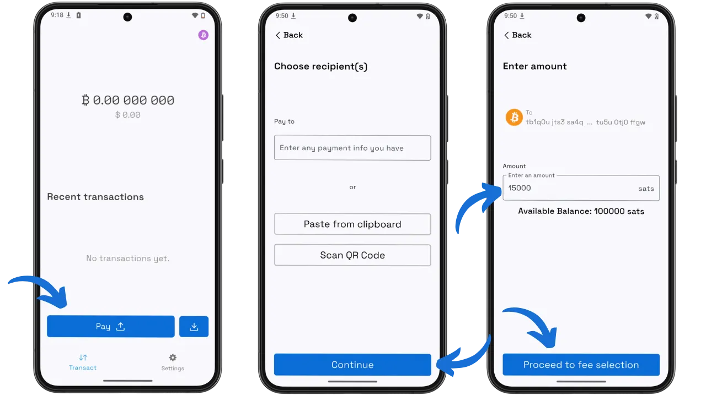
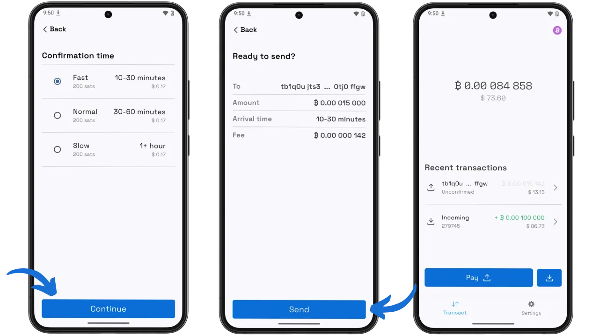

比特币地址重用是对用户机密性最直接的威胁之一。当接收者共享一个地址来接收多笔付款时，任何观察者都可以追踪所有相关交易并重建他们的财务历史。这个问题尤其影响内容创作者、慈善机构或活动人士，他们希望公开展示捐赠地址而不损害他们或其捐赠者的隐私。

Dana Wallet 通过一个优雅的解决方案来应对这个问题：静默付款。这款简约的开源钱包于 2024 年推出，可生成可重复使用的静态地址，同时保证收到的每笔付款最终都位于区块链上的单独地址上。发送者无需事先与接收者进行交互，也没有外部观察者可以将各个交易链接在一起。在区块链上，这些支付看起来就像完全普通的 Taproot 交易。

Dana Wallet 可在主网和 Signet 上使用，但开发者仍然认为它是实验性的，建议不要存入您不愿意损失的资金。在本教程中，我们将使用 Signet 版本来发现静默付款，而无需冒任何真实资金的风险。

## 何为 Dana Wallet？

### 理念和目标

Dana Wallet 采用 "优先静默支付" 方法：钱包只生成静默支付地址，并只接受这种类型的支付。您无法使用此应用程序创建传统的比特币地址（传统、SegWit 或 Taproot 标准）。这种刻意的限制可以让您集中精力学习 BIP-352 协议，而不受其他功能的干扰。简洁的界面特意强调易用性，而不是繁多的选项，即使对链上保密概念一无所知的用户也能轻松使用该工具。

该项目完全开源，使用 Flutter 开发移动界面，使用 Rust 开发内部加密逻辑。这种架构将流畅的用户体验与密集扫描操作的最佳性能相结合。

### 静默支付如何运作？

静默支付（BIP-352）基于使用椭圆曲线 Diffie-Hellman Key Exchange (ECDH) 的复杂加密机制。接收者生成一个静态地址（在 mainnet 上以 `sp1...` 为开头，在 Signet 上以 `tsp1...` 为开头），该地址由两个不同的公开密钥组成：一个扫描密钥 ($B_{scan}$) 用于检测收到的付款，另一个支出密钥($B_{spend}$) 用于支出收到的资金。通过这种分离，可以在硬件钱包上保留支出密钥，而在连接的设备上使用扫描密钥。

当发送者希望付款时，他的钱包将其输入的私钥与接收者的公共扫描密钥相结合，计算出一个共享的 ECDH 密钥。这个秘密会产生一个加密 "调整"，与接收者的消费密钥相加，就能为该交易创建一个唯一的 Taproot 地址。

接收者以使用他的私人扫描密钥和交易中可见的公钥（Diffie-Hellman 数学特性）复制这一计算。这样，他就能在不与发件人进行任何事先交互的情况下检测并花费这笔资金。

这种方法有几个优点：

- **接收者保密**：每笔付款最终到达不同的地址
- **发送者保密**：没有链接付款的持久标识符
- **无第三方服务器**：协议自主运行
- **无法区分的交易**：静默付款看起来就像普通的 Taproot 交易

主要缺点是扫描成本：接收者必须分析每笔新的 Taproot 交易，以检测那些针对他的交易。

如果您想了解更多关于静默支付的技术操作，我们推荐 BTC204 比特币保密性课程，其中有一章专门介绍静默支付：

https://planb.academy/courses/65c138b0-4161-4958-bbe3-c12916bc959c

## 支持的平台

Dana Wallet 是一款安卓应用程序。APK 可通过开发者提供的 F-Droid 专用仓库、Obtainium 或直接从 GitHub 下载。对于 Linux 用户，在技术上可以编译 Flutter 应用程序到桌面。

该应用程序未在 iOS 或官方商店（Google Play、App Store）上提供，这反映了它的试验性地位和对技术受众的关注。

## 安装

### 必要的先决条件

为了在 Android 上安装 Dana Wallet，您需要在安全设置中启用 "Unknown" 选项的安卓设备。无需账户或注册。

### 增加 F-Cold 押金

推荐的方法是添加 Dana Wallet 的专用 F-Droid 资源库。请访问 `fdroid.silentpayments.dev`，在那里您可以找到软件源链接和二维码扫描。该资源库目前提供 3 个应用程序：Mainnet 版本、Development 和 Signet。

### 通过 F-Droid 安装

打开安卓设备上的 F-Droid 应用程序，然后通过右下角的图标进入 "Settings"。选择 "Repositories"管理应用程序源。按 "+" 按钮添加新资源库，然后扫描二维码或粘贴 `https://fdroid.silentpayments.dev/fdroid/repo` 链接。添加版本库后，您将看到 Dana Wallet 的三个可用版本。选择 "Dana Wallet - Bookmark"，然后按 "Install"。

## 初始配置

### 创建钱包

首次启动时，Dana Wallet 会显示一个欢迎页面，介绍其使命："Send and receive donations without middlemen"（无中间商收发捐赠）。按 "Begin" 以继续。下一个屏幕将介绍该应用程序的三大优势：

- **轻松捐款**：几秒钟内即可开始接收捐款
- **默认隐私**：无需服务器或复杂的基础设施
- **类似电子邮件的体验**：像电子邮件一样简单地发送和接收比特币

您可以选择 "Restore" 来恢复现有的钱包，或选择 "Create new wallet" 来创建新的钱包。按下 "Create new wallet"。

然后，应用程序会生成一个恢复助记词，您应将其仔细记在物理介质上。即使是没有实际价值的测试资金，也要采用良好的备份方法。

### 界面和参数

创建钱包后，您将进入主界面，分为两个选项卡："Transact" 和 "Settings"。

**Transact** 选项卡显示您的比特币余额（及其兑换成美元的情况）、最近交易列表和两个操作按钮："Pay" 按钮用于发送资金，还有一个接收按钮（下载图标）。

**Settings** 选项卡提供四个选项：

- **Show seed phrase**：显示您的恢复助记词，以便妥善保存
- **Change fiat currency**：更改显示货币（默认为美元）
- **Set backend url**:：配置 Blindbit 服务器 URL（见下一节）
- **Wipe wallet**：从设备上完全删除钱包

### Blindbit 服务器

Dana Wallet 使用名为 **Blindbit** 的索引服务器来检测您的静默支付。了解其工作原理对于评估应用程序的信任模式非常重要。

**我们为什么需要服务器？**

为了检测静默支付，理论上钱包必须扫描每个区块中的所有 Taproot 交易，并对每个交易进行加密计算（ECDH）。在手机上，这种操作的计算量和带宽消耗太大。

Blindbit 服务器通过预先计算所有 Taproot 交易的中间数据（称为 "tweaks"，即调整项）来解决这一问题。然后，您的钱包将下载这些调整数据（每笔交易 33 字节），并在本地执行最终计算，以检查付款是否属于您。

**保密**

在传统的 Electrum 服务器上，您会透露自己的地址，而 Blindbit 服务器则不同，它不知道哪些付款属于您。它向所有用户提供相同的数据，由您的手机进行最终验证。因此，相对于服务器而言，您的信息是保密的。

**默认服务器**

Dana Wallet 使用公共服务器 `silentpayments.dev/blindbit/signet`（Signet）或 `silentpayments.dev/blindbit/mainnet`（Mainnet）。如果您托管自己的服务器，可以在设置中更改该 URL。

**托管您自己的 Blindbit 服务器**

对于希望拥有完全主权的用户，可以托管自己的 Blindbit Oracle 服务器。这需要：

- 一个 Bitcoin Core 全节点 **非插箭**（非被修剪）
- 安装 Blindbit Oracle（可在 GitHub 上获取：`setavenger/blindbit-oracle`）。
- 约 10 GB 的额外磁盘空间
- 技术技能（Go 语言编译、服务器配置）

目前还没有适用于 Umbrel 或 Start9 的打包应用程序。安装暂时仍然是手动的。这是一个正在积极发展的领域，未来可能会出现更多可用的解决方案。

## 日常使用

### 接收资金

为了接收比特币，请在主屏幕上按接收按钮（下载图标）。Dana Wallet 会在书签上以 `tsp1q...` 格式显示您完整的静默支付地址。界面提供多个选项：

- **Show QR code**：显示地址的二维码，方便扫描
- **Share**：通过手机应用程序共享地址
- **Copy**：将地址复制到剪贴板上

如屏幕所示，您可以在社交网络上公开分享该地址，而不会泄露您的隐私。

为了在 Signet 上获得第一笔测试资金，请使用专用的静默支付龙头，网址为 `silentpayments.de/faucet/signet`。复制您的地址 `tsp1...`，粘贴到龙头提供的字段中，然后验证请求。等待区块被挖出（在 Signet 上大约需要 10 分钟）。

### 发送付款

为了发送资金，请按主屏幕上的 "Pay" 按钮。此时会出现 "选择接收者" 屏幕，有三个指定接收者的选项：

- 手动输入付款信息
- **Paste from clipboard**：从剪贴板粘贴地址
- **Scan QR Code**：扫描包含地址的二维码

接收者地址确认后，您可以在 "Enter amount" 页面上输入要发送的金额（以聪为单位）。您的可用余额会显示出来以供参考。按 "Proceed to fee selection" 以继续。

下一个屏幕显示三个手续费等级，具体取决于所需的紧急程度：

- **Fast**（10-30 分钟）：快速确认，费用较高
- **Normal**（30-60 分钟）：中等费用
- **Slow**（1 小时以上）：非紧急交易最低收费

选择费用等级后，"Ready to send？"确认屏幕会汇总所有详细信息：目的地地址、金额、预计时间和交易费用。请仔细核对这些信息，然后按 "Send" 键以发送交易。

交易发送后，会以 "Unconfirmed" 的状态出现在您的历史记录中，直到被纳入区块中。您的余额也会相应更新。

## 优势和限制

### 优点

- **教学友好**：界面设计简洁，专注于静默支付的学习体验。
- **双向功能**：同时支持发送与接收支付，这在多数钱包中并不常见。
- **开源项目**：完整代码已在 GitHub 上公开，可自由核查与验证。
- **专用水龙头**：内置测试资金获取功能，方便用户在测试网体验。
- **无需账户**：无需注册或提供任何个人信息即可使用。

### 需要考虑的制约因素

- **实验性质**：尚未经过安全审计，建议在主网使用时保持谨慎。
- **平台限制**：目前仅支持安卓设备，暂不提供 iOS 版本。
- **功能精简**：暂不支持币控制、子账户或闪电网络功能。
- **高资源占用**：支付检测过程需大量扫描，可能影响设备性能。

## 最佳做法

### 种子的安全

即使对于背景毫无价值的 Signet 测试，也要认真保护您的助局词。使用设置中的 “Show seed phrase” 选项仔细记下它。作为一个良好的做法，请为 Signet 和主网维护完全独立的钱包：切勿使用为测试而创建的种子来接收真实资金的钱包。

### 关于试验状态的警告

Dana Wallet 的开发者认为它仍处于试验阶段。他们明确表示 "Don't use funds you aren't willing to lose"（不要使用您不愿意损失的资金）。出于学习目的，请选择 Signet 版本。如果您使用 Mainnet 版本，请限制自己的代币金额。

### 备份和恢复

静默支付资金回收需要与 BIP-352 协议兼容的钱包。标准钱包无法扫描区块链来检索您的 UTXO 静默支付。保持安装 Dana Wallet 或在首次启动时使用“恢复”选项来恢复现有钱包。

## 与 BIP-47 和 PayJoin 的比较

| 对比项 | 静默支付 (BIP-352) | BIP-47 PayNyms | PayJoin (BIP-78) |
|---------|---------------------------|----------------|------------------|
| 静态地址 | 是（`sp1...`） | 是（支付代码） | 否 |
| 是否需交互 | 无需 | 需要一次初始通知交易 | 每次支付都需要 |
| 链上痕迹 | 无（表现为普通交易） | 可见的 OP_RETURN | 修改后的交易 |
| 接收端扫描负载 | 高（需扫描每个区块） | 低（仅在通知后） | 无 |
| 发送者隐私 | 极佳 | 有限（通知后可能被关联） | 良好（通过混合实现） |

静默支付消除了 BIP-47 通知交易，但扫描费用更高。PayJoin 解决的是另一个问题（输入相关性），可与静默支付结合使用。

## 结论

Dana Wallet 是一款宝贵的教育工具，可让您在无风险的环境中了解无声支付。其极简方法使您能够了解 BIP-352 协议的基本机制，而不会被次要功能分散注意力。通过尝试 Signet，您将对这项有前途的比特币交易保密技术有一个实际的了解。

无声支付代表着在协调易用性和尊重隐私方面向前迈出的重要一步。社区的热情和首次集成到各种钱包（Cake Wallet、BitBox02、用于发送的 BlueWallet）都预示着未来，发布捐赠地址将不再损害其所有者的财务隐私。

## 资源

### 正式文件

- Dana Wallet GitHub 代码库：https://github.com/cygnet3/danawallet
- F-Cold 押金： https://fdroid.silentpayments.dev
- 静默支付社区网站：https://silentpayments.xyz
- BIP-352 的详情: https://bips.dev/352

### Signet 测试工具

- 静默支付水龙头： https://silentpayments.dev/faucet/signet
- Signet Mempool Explorer: https://mempool.space/signet

### Blindbit 服务器（自行托管）

- Blindbit Oracle (GitHub): https://github.com/setavenger/blindbit-oracle
