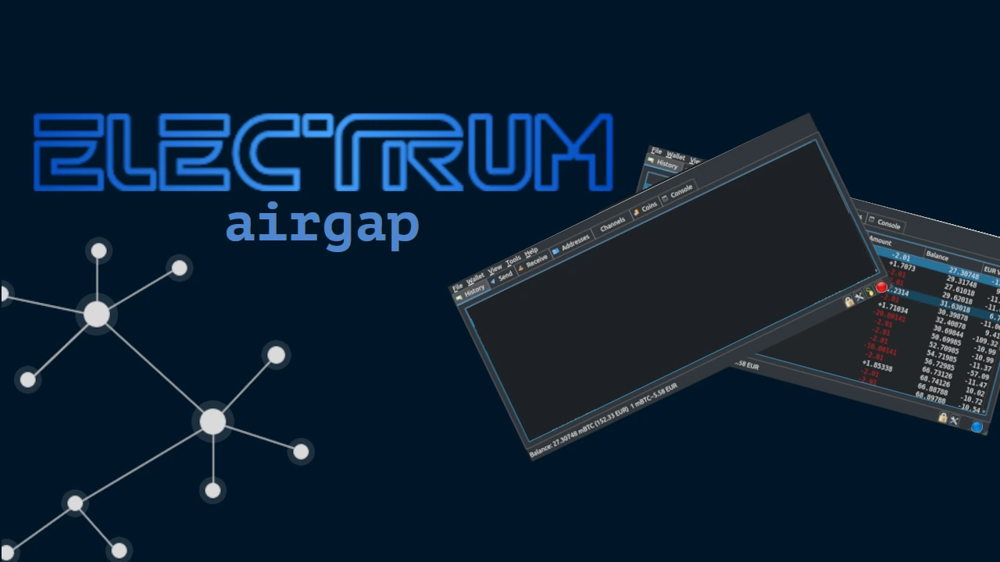

## Cold Wallet

Dalam tutorial ini aku akan menjelaskan cara membuat perangkat penandatanganan air-gapped pertama kamu, yang terputus dari Internet, bahkan tanpa memiliki Hardware Wallet khusus. Yang kamu perlukan hanyalah dua komputer:

- perangkat lama yang selamanya dicegah untuk tersambung ke Internet  
- komputer yang kamu gunakan sehari-hari

Konfigurasi ini memberikan tingkat keamanan lebih tinggi dibanding `Hot Wallet` klasik: komputer lama tanpa koneksi jaringan menjadi penjaga kunci pribadi kamu, yang tidak pernah terekspos ke Internet, tetapi disimpan secara offline ("air-gapped" atau "Cold").

Sebagai gantinya, kamu akan memasang layar Wallet ("watch-only") di komputer harian kamu, yang tersambung ke jaringan dan bisa digunakan untuk, misalnya, memeriksa saldo dan menyiapkan transaksi penerimaan.

## Celah Udara Wallet: Apa dan Bagaimana

Dengan mengikuti langkah-langkah di panduan ini, kita akan menginstal dua Software Wallet Electrum pada dua komputer berbeda dan akhirnya membuat dua Dompet dengan kunci yang berbeda: air-gapped Wallet akan menggunakan seluruh hirarki Wallet HD, sedangkan tampilan Wallet dibuat dengan kunci publik utama.

Kedua Dompet ini, dalam segala hal, akan sangat berbeda satu sama lain. Satu-satunya kesamaan keduanya, seperti yang akan kita lihat, adalah alamatnya:

- gW-13 di komputer air-gapped hanya bisa menandatangani transaksi, tetapi karena terputus dari jaringan, tidak mengetahui saldo atau alamat yang digunakan  
- gW-12 di komputer harian hanya bisa mempersiapkan dan menyebarkan transaksi, tanpa bisa membuang pengeluaran, karena tidak memiliki kunci pribadi

## Persiapan Awal

Untuk mengunduh Electrum, kku menyarankanmu mengikuti langkah pertama dalam tutorial ini:

https://planb.academy/tutorials/wallet/desktop/electrum-efec9166-46b5-4937-8cee-6bc310975177

Setelah mengunduh, selalu verifikasi rilis sebelum menginstalnya, kemudian lanjutkan ke konfigurasi "One Server", seperti yang akan kamu temukan di bagian bantuan, di bawah `Mulai dengan Dummy Wallet`.

Operasi konfigurasi "Satu Server" hanya diperlukan untuk Wallet yang dipasang di komputer harian, karena komputer lainnya akan selalu offline.

Pengoperasian berikut ini melibatkan latihan pada dua komputer (dan Dompet) yang berbeda, jadi, demi kenyamanan dan fokus, saya memilih untuk menetapkan airgap Wallet dengan tema terang, sedangkan layar Wallet memiliki tema gelap.

## Penciptaan Celah Udara Wallet

Setelah mengunduh dan memverifikasi unduhan Electrum, ambil salinan file yang dapat dieksekusi dan bawa ke komputer kamu secara offline. Kemudian jalankan dan instal Electrum.

Klik dua kali untuk memulai Electrum: komputer tempat kamu akan menggunakan Wallet ini dalam keadaan offline, abaikan pengaturan jaringan dan lanjutkan ke pembuatan Wallet yang, dalam panduan ini, akan kita sebut sebagai `airgap`.

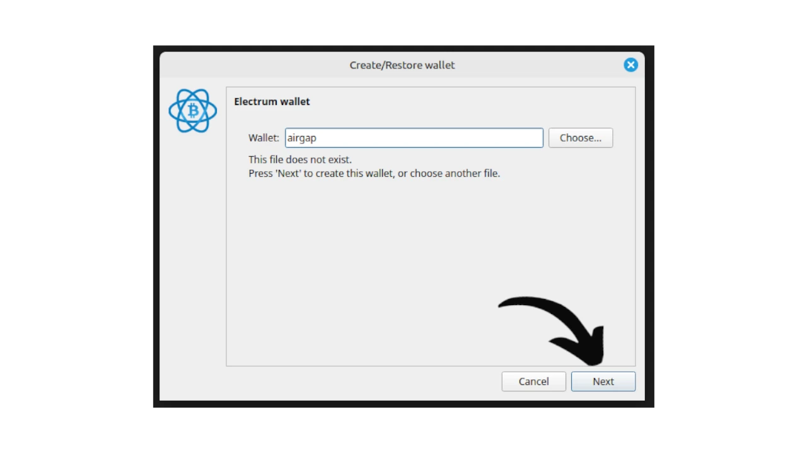

Pilih _Dompet standar_.

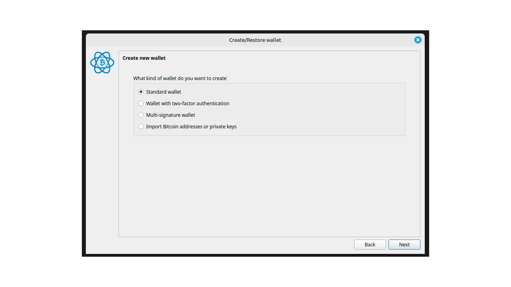

Lalu pilih _Buat seed baru_ untuk membuat perangkat lunak generate menjadi Mnemonic.

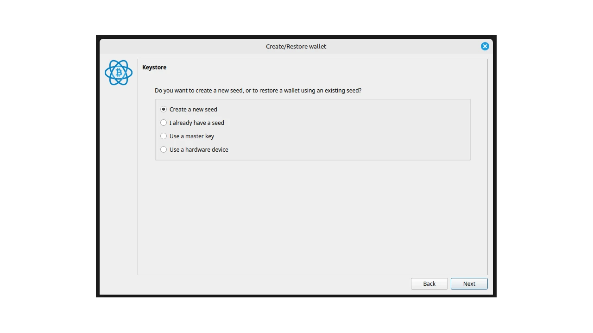

Transkripsikan 12 kata generate dari Electrum secara akurat ke dalam kertas dan lanjutkan dengan langkah verifikasi, masukkan kembali kata-kata tersebut secara berurutan ketika Electrum memintanya.

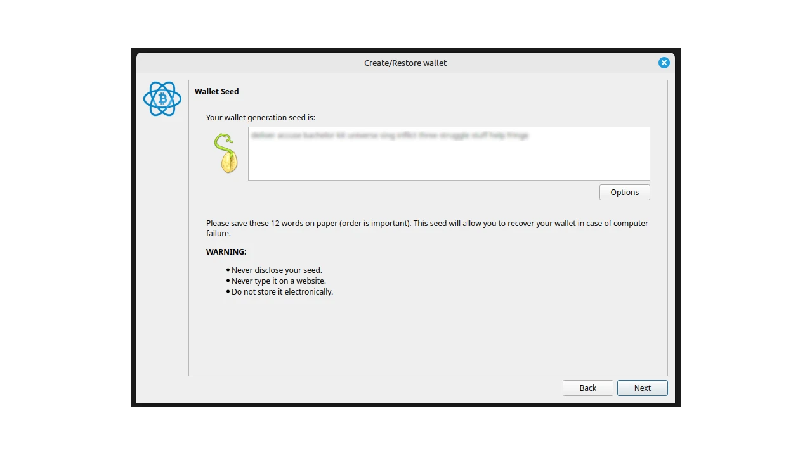

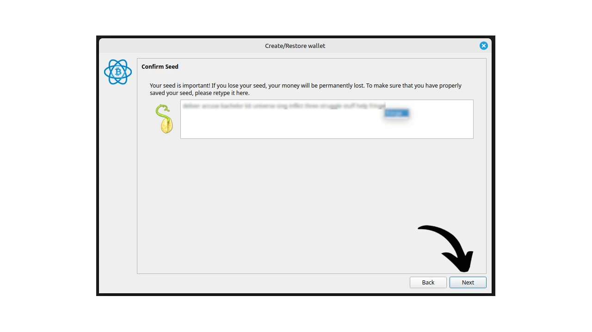

Setelah pembuatan Wallet selesai, tetapkan kata sandi yang rumit (`Strong`) untuk mengenkripsi file Wallet di perangkat air-gapped. Langkah ini sangat penting, karena kata sandi yang kamu pilih sekarang akan mencegah akses ke Wallet. Wallet yang terlindungi kata sandi inilah yang nantinya akan digunakan untuk menandatangani transaksi.

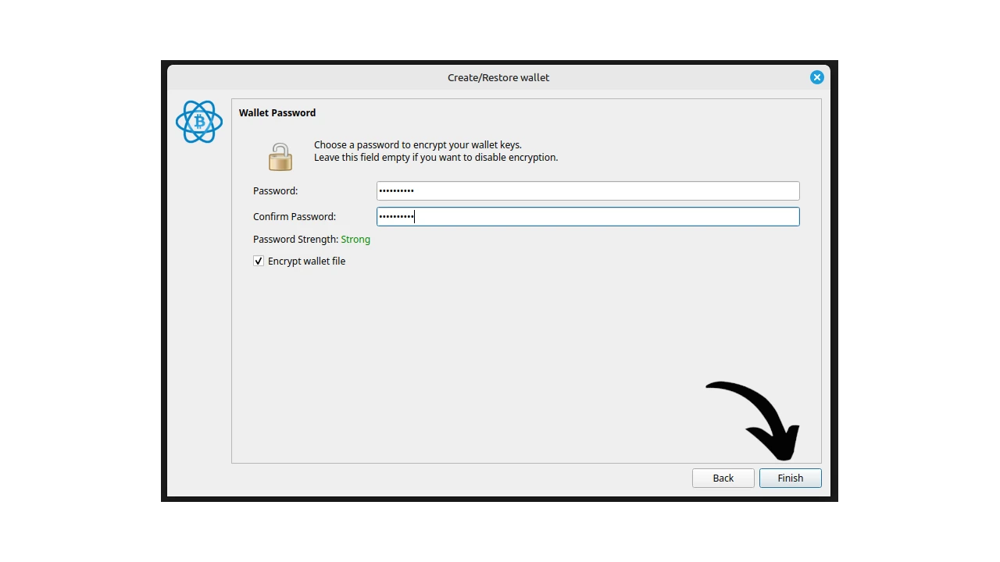

Dengan mengklik _Finish_, Wallet akan ditetapkan dan muncul di layar. Tentu saja, indikator koneksi jaringan, yaitu titik berwarna di sudut kanan bawah, berwarna merah, karena komputer terputus dan tidak memungkinkan Wallet untuk mengekspos kunci online.

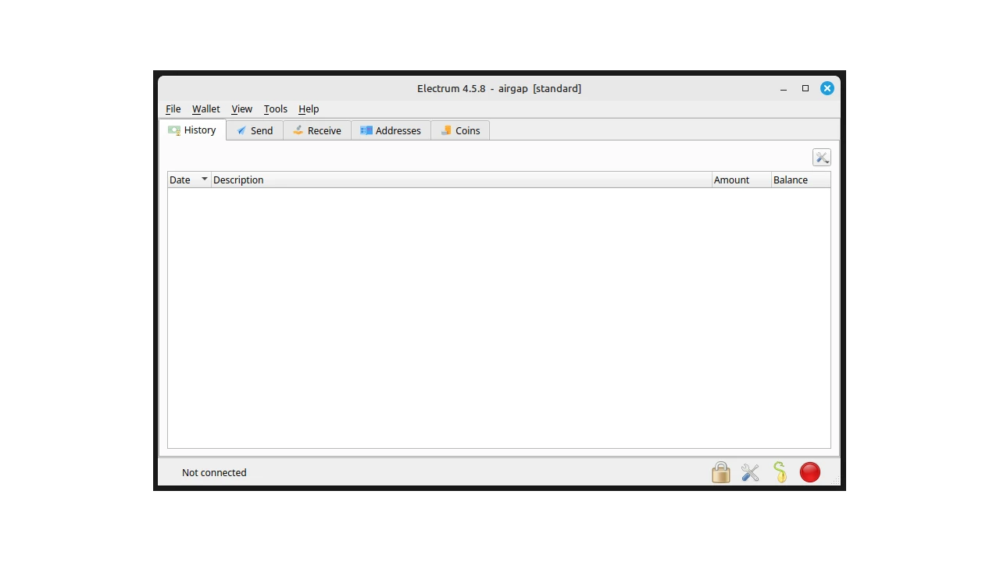

## Penciptaan Wallet dari Visualisasi

Sekarang setelah Wallet kamu memiliki private key offline, kamu perlu mengatur tampilan Wallet, atau `watch-only`, yang akan memungkinkan kamu untuk melihat saldo, serta menyiapkan transaksi penerimaan untuk terus mengakumulasi Sats dengan aman.

Dari Wallet yang terletak di perangkat offline, pilih menu _Wallet_ -> _Information_

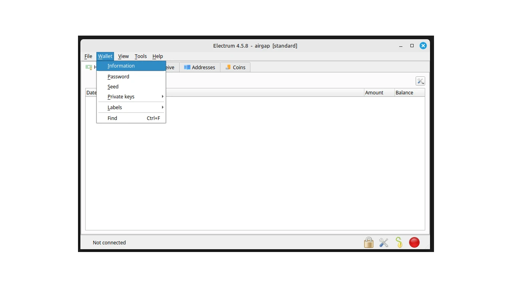

Jendela yang berisi semua informasi Wallet kamu akan muncul, di mana Anda dapat memeriksa `derivation path` dan `master fingerprint`, misalnya untuk menandainya di samping kata-kata dalam kalimat Mnemonic (sangat disarankan).

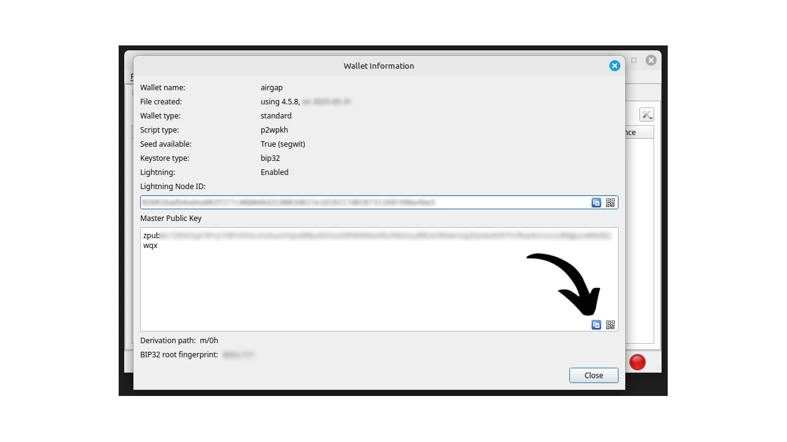

Ingatlah bahwa kamu mengambil data ini dari komputer yang tidak terhubung, jadi kamu harus menyalin/menempelkan `zpub` ke sebuah file teks dan menyimpannya ke sebuah stik USB.

Sekarang kamu dapat berpindah ke komputer yang terhubung ke Internet, untuk meluncurkan Electrum dan membuat Wallet baru.

Dari menu _File_, pilih _New/Restore_.

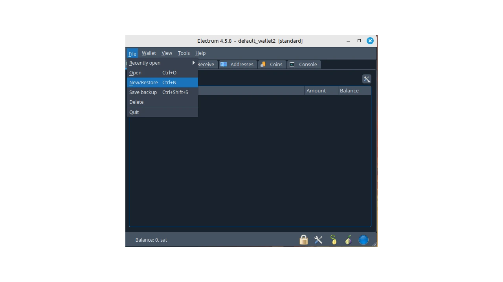

Wallet baru adalah view-only, jadi untuk panduan ini, kami akan menyebutnya `watch-only`.

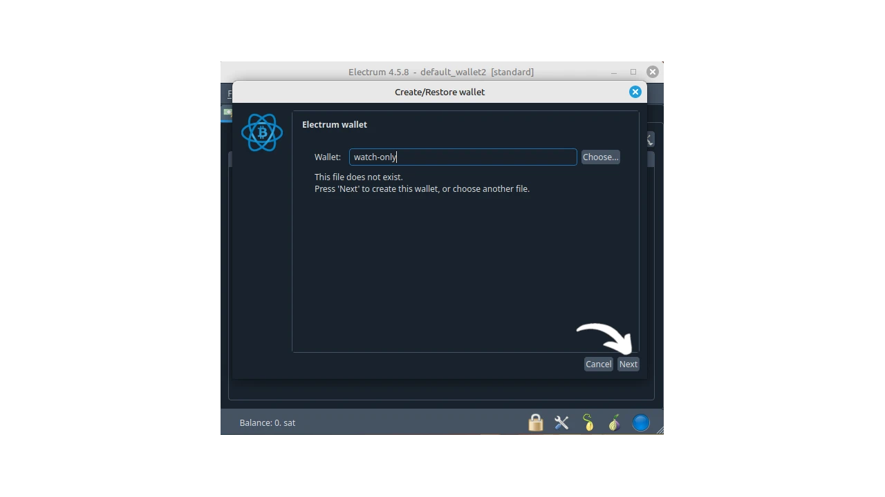

Pada layar berikutnya, pilihlah _Dompet standar_ dan lanjutkan dengan mengklik _Next_.

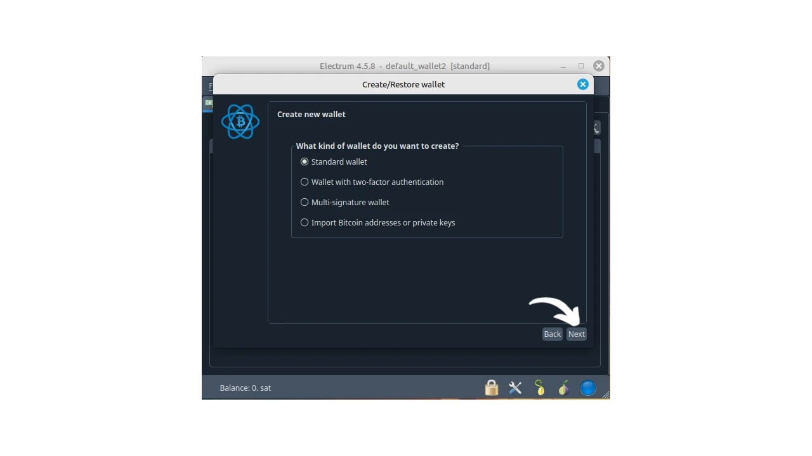

Dalam memilih `Keystore`, berhati-hatilah: untuk membuat tampilan Wallet pilih _Use a master key_. Kemudian lanjutkan dengan _Next_.

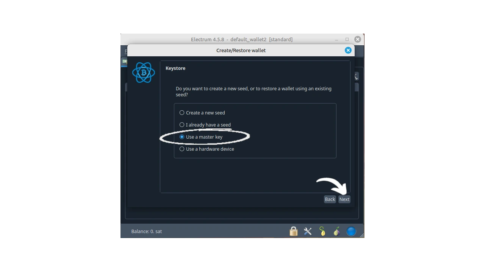

Rekatkan di sini `zpub` yang disalin dari Wallet secara offline dan yang kamu bawa ke komputer ini melalui media USB.

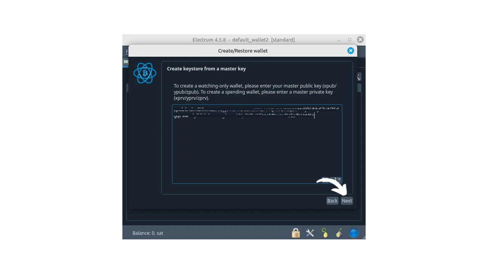

Akhiri dengan menetapkan kata sandi yang kuat untuk Wallet ini juga, mungkin berbeda dari yang kamu pilih untuk Cold Wallet.

Kamu akan melihat tampilan Wallet muncul, dengan sebuah peringatan. Pesan ini mengingatkan kamu bahwa ini adalah Wallet hanya untuk tampilan dan kamu tidak bisa menggunakan dana yang terkait.

**Catat dengan baik**: **kamu harus selalu memiliki private key untuk membuang UTXO dari Wallet ini**. Dengan sistem pencadangan yang baik, tidak akan sulit untuk tetap memiliki Bitcoin kamu sepenuhnya.

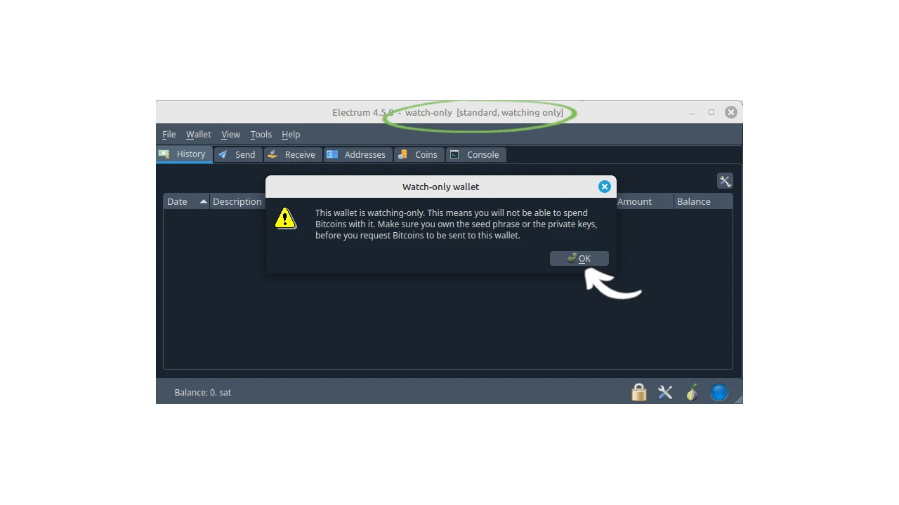

Peringatan ini akan muncul setiap kali kamu membuka Wallet ini. Klik _Ok_ dan mari kita lanjutkan ke langkah verifikasi.

## Verifikasi Dua Wallet

Seperti yang kita pelajari di awal panduan ini, air-gapped Wallet dan display Wallet adalah dua portofolio dengan fungsi yang berbeda, tetapi **memiliki alamat yang sama**.

Jika kita melihat kedua Dompet berdampingan, secara visual terlihat bahwa di air-gapped Wallet ada simbol "seed", sedangkan di display Wallet tidak ada. Detail ini akan membantu kamu mengingat bahwa display Wallet tidak memiliki kunci pribadi.

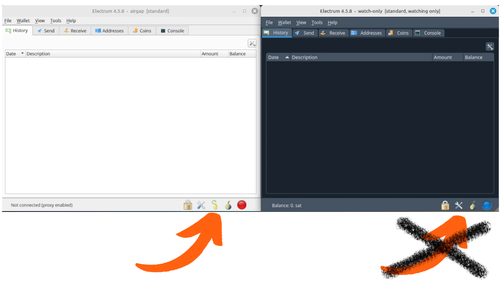

Namun, untuk melakukan pemeriksaan pertama yang akurat, pilihlah menu `Alamat` di kedua Dompet: karena keduanya memiliki alamat yang sama, daftar alamat harus sama untuk keduanya.

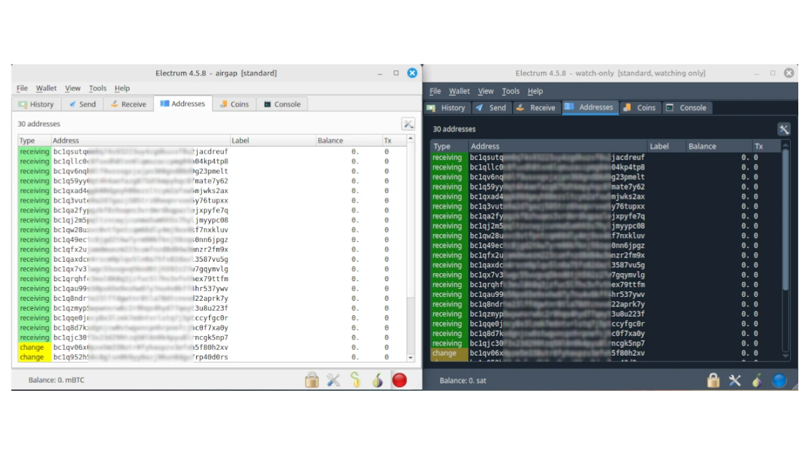

⚠️ **PERHATIAN**: **tidak boleh ada jalan tengah; alamatnya harus sama. Jika berbeda, kamu harus menghapus semua pekerjaan yang telah dilakukan sejauh ini dan memulai dari awal**.

Sekarang kamu dapat melanjutkan untuk melakukan dua pemeriksaan berbeda. Pertama, coba hapus kedua Dompet dan pulihkan dari awal, masing-masing di komputer yang sesuai. Jika kamu melanjutkan verifikasi ini, prosedur untuk display Wallet identik dengan yang dijelaskan di atas.

Namun, untuk air-gapped Wallet, pada layar `keystore` kamu harus memilih _Saya sudah memiliki seed_ dan memasukkan kata-kata dengan menyalinnya dari cadangan kertas kamu.

Setelah uji coba "tanpa beban" selesai, kamu bisa mencoba melakukan transaksi dalam jumlah kecil dan langsung membelanjakannya.

## Transaksi Penerimaan dan Pengeluaran

Untuk mulai menggunakan air-gapped Electrum kamu, kamu bisa melakukan transaksi penerimaan dengan jumlah kecil, kemudian membelanjakannya untuk membeli Address milik kamu sendiri. Kamu kemudian bisa membiasakan diri dengan prosedurnya dan memverifikasi bahwa kamu memiliki kendali penuh atas dana tersebut.

**Catatan**: Aku tidak menyarankan kamu menyetor dana dalam jumlah besar ke Wallet sebelum yakin bahwa kamu bisa melakukan semua operasi dengan lancar.

Langkah-langkah yang dijelaskan di bawah ini mungkin sekilas tampak rumit. Jangan biarkan hal ini membuat kamu kecewa: setelah mencobanya untuk pertama kali, kamu akan melihat bahwa langkah-langkah ini hanya membutuhkan waktu beberapa menit saja.

Untuk menerima dana, kamu harus menggunakan display Wallet yang ada di komputer yang tersambung ke Internet. Dari menu `Terima`, klik `Buat permintaan` untuk meminta Electrum menghasilkan Address pertama yang tersedia dan menggunakannya untuk mengirimkan beberapa Sats.

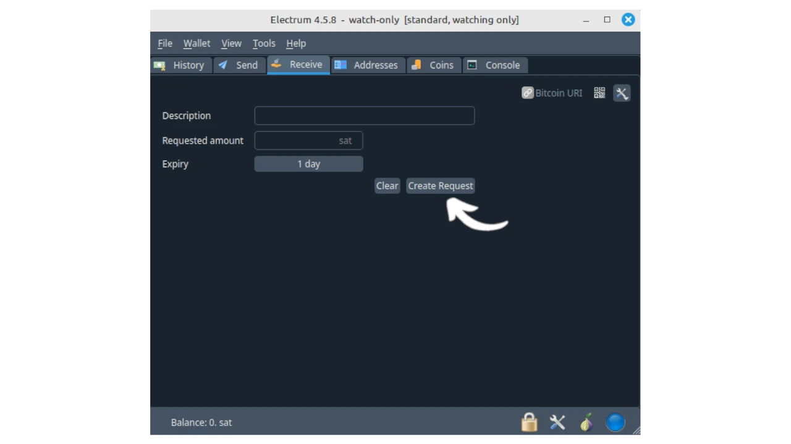

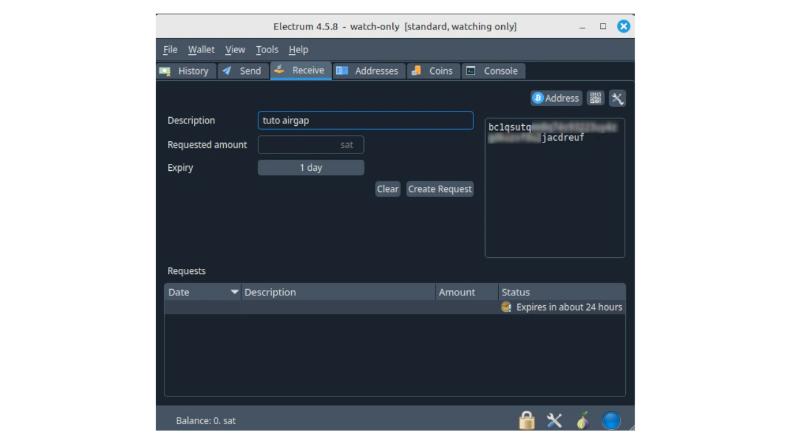

Setelah transaksi disebarkan, kamu sudah dapat melihat bahwa-seperti yang sudah sewajarnya- transaksi tersebut hanya terlihat di layar Wallet dan bukan di airgap Wallet.

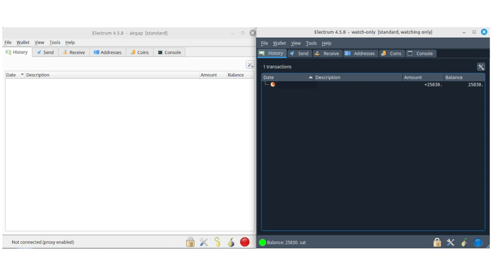

Setelah transaksi kamu menerima konfirmasi, kamu bisa menyiapkan biaya dan kemudian mencoba prosedur penandatanganan dari Wallet di luar jaringan. Selanjutnya, siapkan transaksi di watch-only dan tekan _Preview_ untuk memeriksanya.

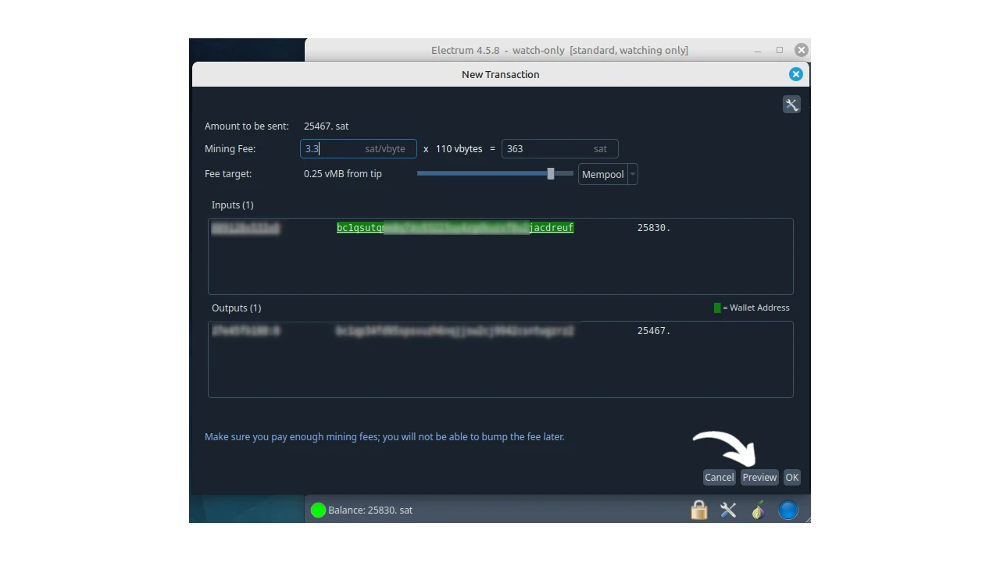

Kamu akan mendapatkan jendela transaksi lanjutan di mana Anda bisa melihatnya:

- transaksi tidak ditandatangani (`Status: Unsigned);
- perintah `Tanda` dan `Siaran` terhambat.

Satu-satunya hal yang dapat kamu lakukan adalah mengekspor transaksi apa adanya, membawanya ke celah udara Wallet dan menandatanganinya.

Masukkan USB flash drive ke komputer kamu dan, dari menu di bagian kiri bawah, pilih _Share_.

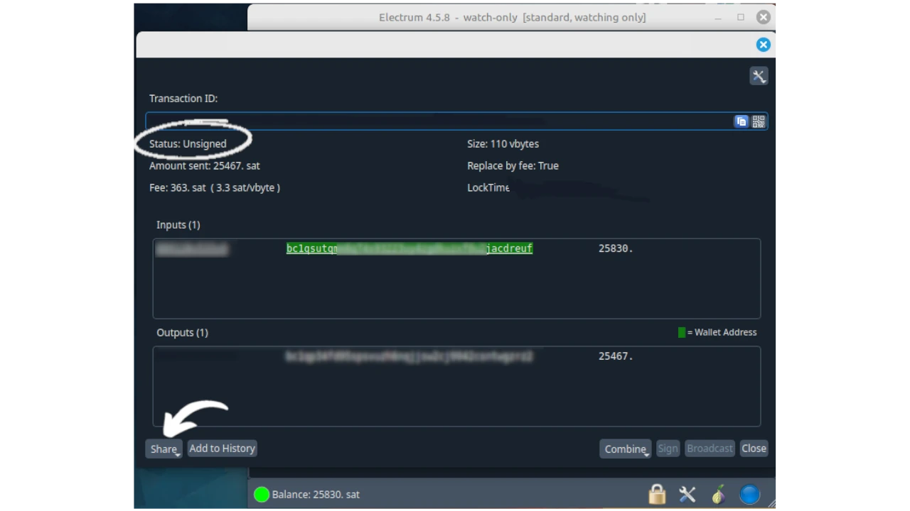

Setelah itu pilih _Save to file_.

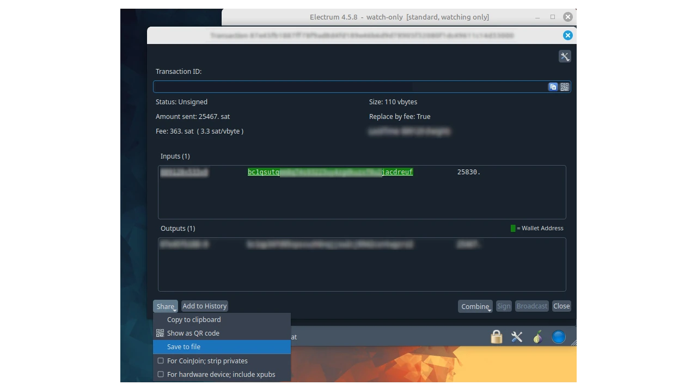

Simpan transaksi ke stik USB.

Anda akan melihat bahwa Electrum memberi nama file dengan angka pertama transaction ID, dan ekstensi file adalah `.PSBT`, yang berarti `Partially Signed Bitcoin Transaction`.

Ekstrak media dengan file `.PSBT` dan hubungkan ke komputer secara offline.

Dari airgap Wallet, sekarang pilih menu _Tools_, lalu _Load transaction_ dan ikuti From file_.

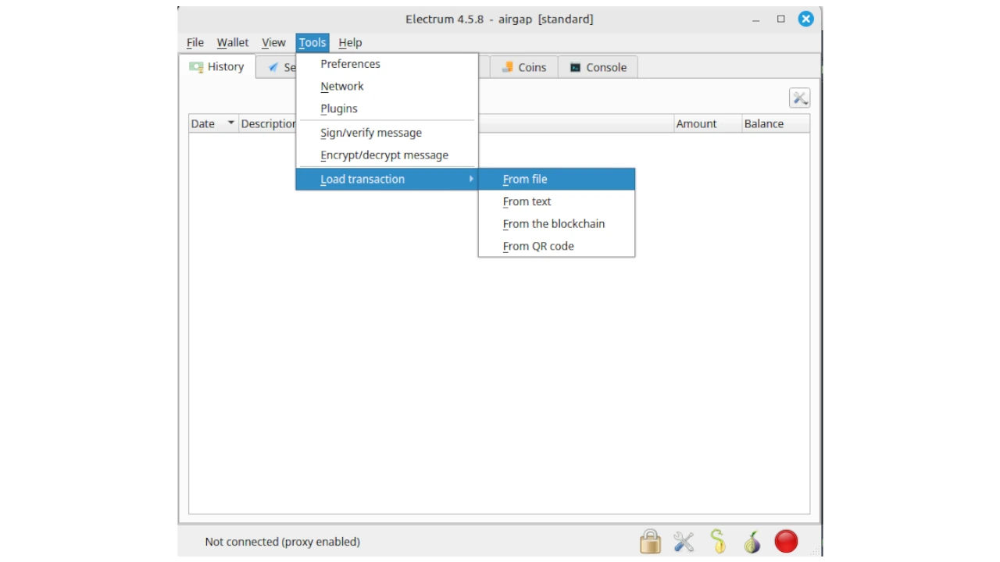

Dengan pengelola file, pilih `.PSBT` dari lokasinya.

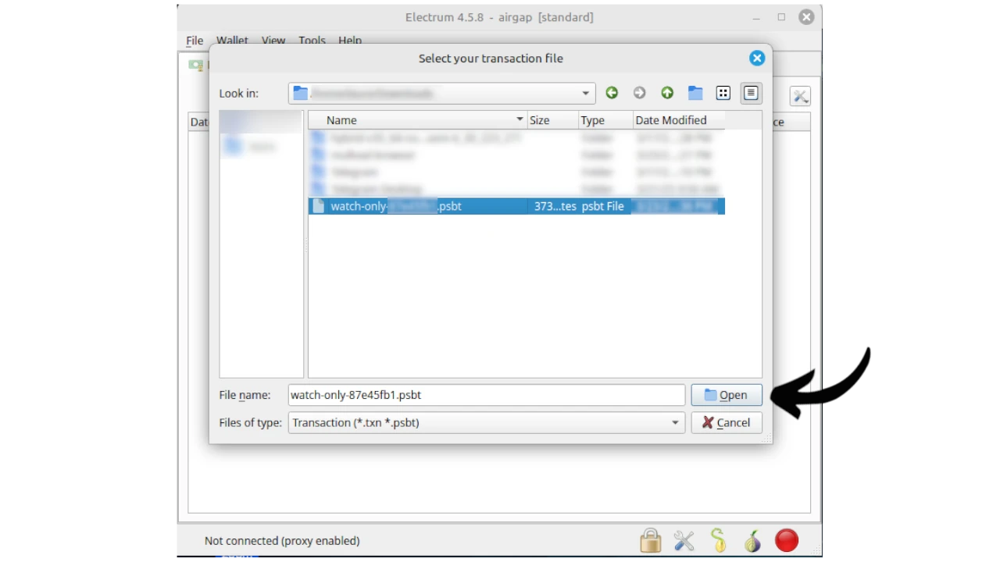

Perangkat lunak komputer di luar jaringan akan secara otomatis membuka jendela transaksi lanjutan, sepenuhnya identik dengan yang kamu lihat di layar Wallet. Statusnya adalah `Tidak Ditandatangani`, tetapi perbedaannya adalah perintah `Tanda tangani` di sini aktif. Inilah yang harus kamu jalankan.

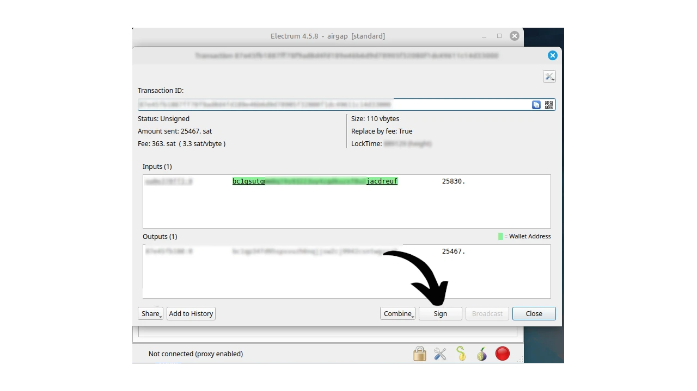

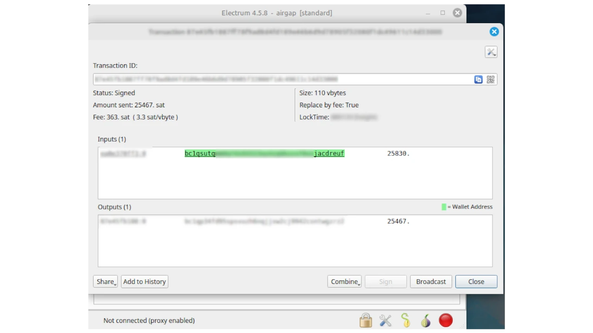

Setelah transaksi ditandatangani, ingat bahwa Wallet kamu berada di mesin offline. Jadi, meskipun kamu melihat perintah `Broadcast` aktif, Wallet tidak akan bisa menyebarkan transaksi ke jaringan Bitcoin.

Yang perlu kamu lakukan sekarang adalah mengekspor transaksi yang sudah ditandatangani ke stik USB, sehingga kamu bisa mengimpornya ke komputer yang tersambung ke Internet dan menyebarkannya.

Dari menu kiri bawah, pilih _Berbagi_ lagi lalu _Simpan ke file_.

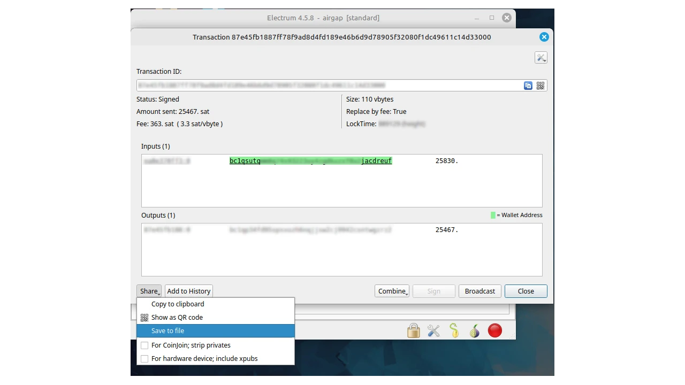

Sekarang file tersebut memiliki ekstensi yang berbeda: **alih-alih `.PSBT`, sekarang transaksi memiliki ekstensi `.txn`. Mulai sekarang, inilah cara Electrum untuk mengenali transaksi yang ditandatangani dan yang tidak ditandatangani**.

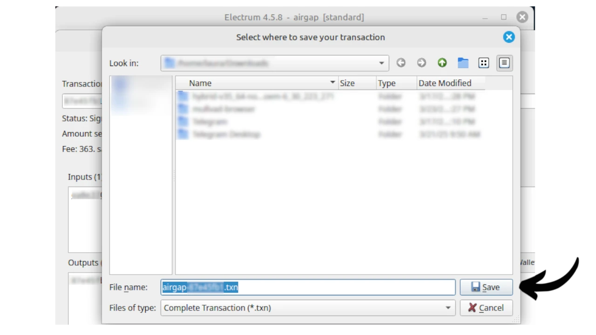

Untuk penyebaran akhir transaksi, keluarkan stik usb dari komputer off-line dan masukkan ke dalam komputer yang terhubung ke Internet.

Dari watch-only, ulangi prosedur impor, yaitu dari menu _Tools_ pilih _Load transaction_ dan terakhir _From file_.

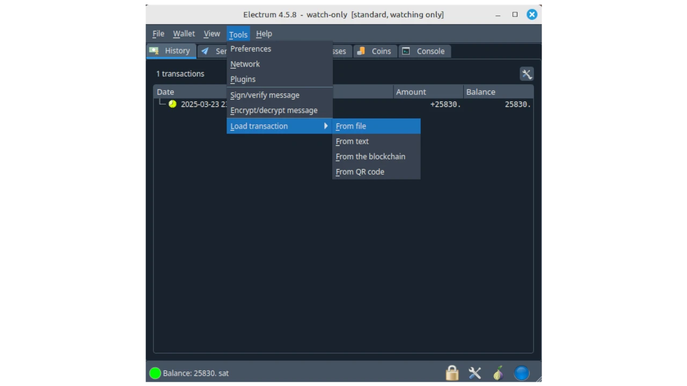

Electrum akan membuka jendela transaksi untuk kamu, yang sangat berbeda dari yang ditunjukkan sebelumnya pada Wallet ini, karena sekarang sudah ditandatangani (`Status: Signed`) dan perintah `Broadcast` dapat diakses.

Operasi terakhir yang perlu kamu lakukan hanyalah itu:

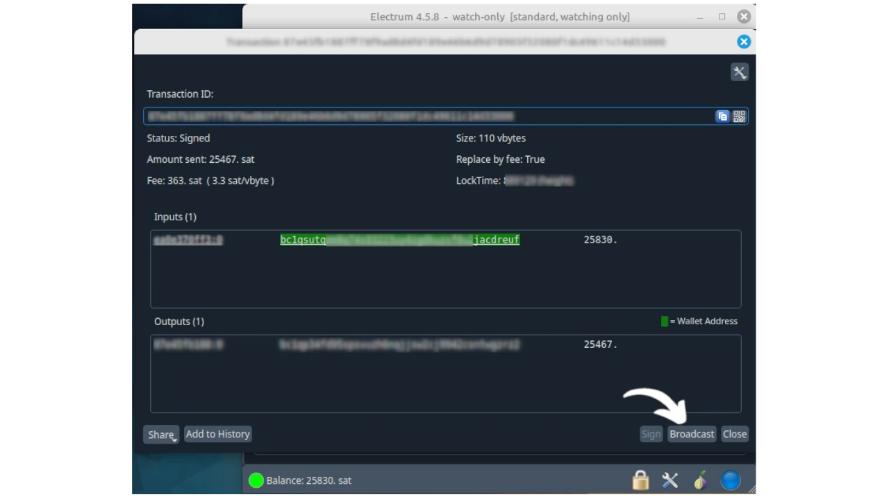

## Kesimpulan

Pengujian sekarang sudah selesai. Jika kamu mengikuti panduan ini dan mendapatkan hasil yang sama, kamu telah membuat Wallet Cold dengan Electrum, di dua komputer yang berbeda, yang dapat kamu gunakan untuk menyimpan Bitcoin milikmu.

Satu-satunya hal yang harus Anda perhatikan adalah dua hal:

1) **Jangan pernah menggunakan airgap Wallet ke alamat penerima generate**. Karena ini offline, maka akan selalu menawarkan Address pertama, yang sama dengan Address yang baru saja kamu gunakan untuk melakukan transaksi uji coba;

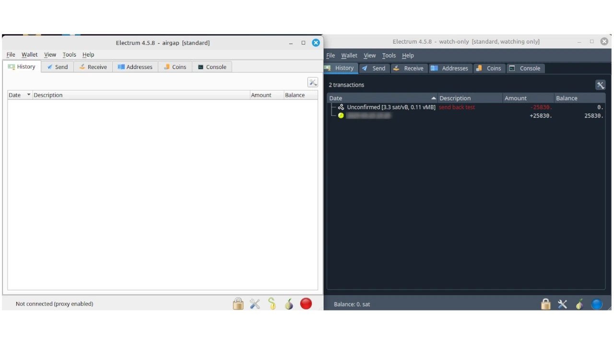

Seperti yang bisa kamu lihat dari gambar di atas, Wallet offline tidak mengetahui riwayat Address-nya sendiri. Ia benar-benar buta dalam hal ini. **Satu-satunya tugas yang bisa dilakukannya untuk kamu adalah menyimpan kunci offline dan menandatangani transaksi kamu**.

2) Gunakan USB flash drive yang didedikasikan hanya untuk tujuan ini, **jangan gunakan media yang sering kamu pakai**. Alat sehari-hari lebih mungkin terinfeksi cyber, dan secara tidak sengaja, kamu bisa menyerang komputer yang kamu jaga tetap terputus dari jaringan. Stik USB yang kamu gunakan hanya untuk tujuan ini memiliki peluang sangat kecil untuk bersentuhan dengan PC online kamu, sehingga mengurangi kemungkinan terkena virus, malware, dan sejenisnya.
