本教程将一步步指导您如何使用 Electrum 钱包在比特币区块链上写入消息。此操作使用 OP_RETURN 指令将文本插入到交易中，该交易在区块链上公开可见。请按照以下简单步骤操作，即可成功注册。

---
## 前提条件

- 一台电脑（Windows、macOS 或 Linux）。
- 互联网连接。
- 钱包中需有少量聪（Sats）或比特币（BTC），用于支付交易金额和手续费。
- 文本到十六进制转换器（如在线网站）或专用工具，如[本 OP_RETURN 脚本生成器](https://resources.davidcoen.it/opreturnelectrum/)。


---

## 步骤 1：下载并安装 Electrum


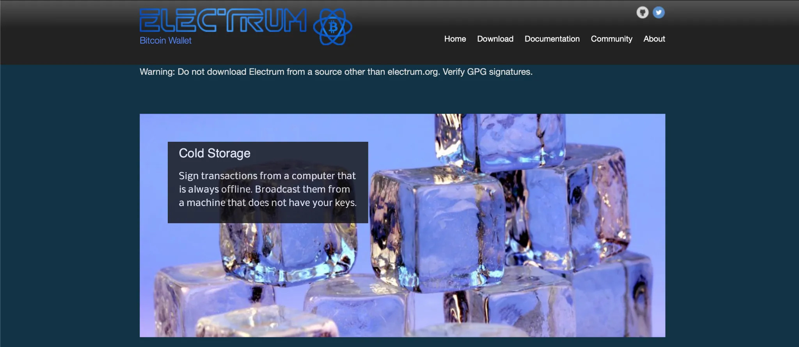


1.访问 Electrum 官方网站：[electrum.org](https://electrum.org/).


2.下载与您的操作系统（Windows、macOS、Linux）相对应的版本。


3.按照安装说明安装 Electrum。


4.通过比较文件的签名或哈希值来检查下载文件的完整性（可选，但出于安全考虑建议这样做）。


→ 更多详情，请参阅 "Electrum 教程"：


https://planb.academy/tutorials/wallet/desktop/electrum-efec9166-46b5-4937-8cee-6bc310975177


---

## 步骤 2：创建或导入钱包

1. 启动 Electrum。

2. 选择 “Create a new Wallet”，或者如果您已有助记词，请选择 “Restore an existing Wallet”。

3. 按照说明配置您的钱包：

- 对于新钱包，请记下您的助记词并妥善保管（例如纸质或保险箱）。
- 对于现有钱包，请输入您的助记词进行恢复。

4. 设置密码以保护您的钱包。

→ 更多 Electrum 教程详情：

https://planb.academy/tutorials/wallet/desktop/electrum-efec9166-46b5-4937-8cee-6bc310975177

---

## 步骤 3：检查可用资金

请确保您的钱包中有足够的比特币 (BTC) 或聪 (Sats)，以支付：

- 交易金额（例如，0.00001 比特币或 1000 聪）。
- 交易手续费，手续费根据网络规模而有所不同（通常为几千 Sats）。


请在 Electrum 中查看余额以确认您的资金。


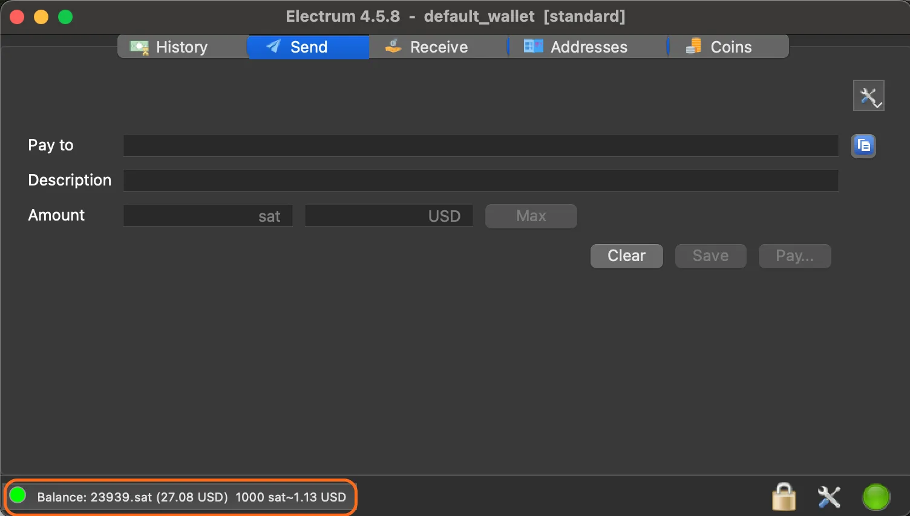

如有必要，请转账比特币以充值您的钱包。为了执行此操作，请转到 “Receive” 选项卡并单击 “Create Request”：

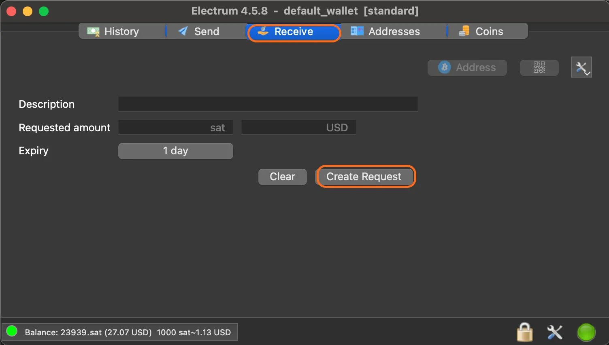


这将显示接收 Address：


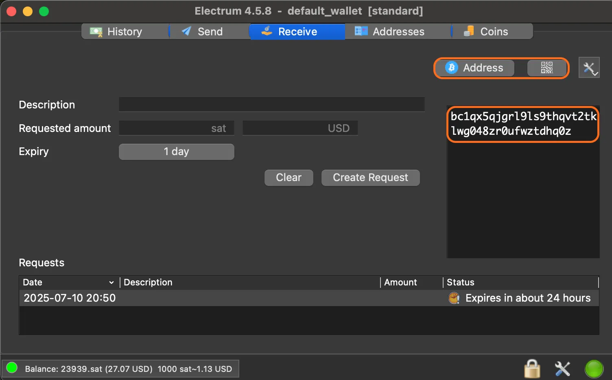


→ 更多详情，请参阅 "Electrum 教程"：


https://planb.academy/tutorials/wallet/desktop/electrum-efec9166-46b5-4937-8cee-6bc310975177


---

## 步骤 4：准备要刻写的信息

选择您要输入的信息（例如：`Thanks Satoshi`）。注意：OP_RETURN 消息的长度限制为 80 字节，即大约 80 个 ASCII 字符。

*请花点时间思考：您在比特币区块链上写入的内容将永久存在，并且所有人都可以访问，因此：*

- 留下美好的人性表达，
- 避免输入您可能后悔的内容
*区块链空间和您的比特币都很宝贵，请明智且有目的地使用它们*
将您的信息转换为十六进制：

- 您可以使用[在线工具](https://www.rapidtables.com/convert/number/ascii-to-hex.html)，但请注意不要在其中处理敏感数据（尽管原则上，通过 OP_RETURN 发布到比特币区块链上的信息不存在任何保密问题）；

为了提高保密性，请使用以下小型 Python 脚本在本地执行转换：

```py
#!/usr/bin/env python3

def main():
ascii_text = input("Enter ASCII text: ")
try:
hex_output = ascii_text.encode('ascii').hex()
print(hex_output)
except UnicodeEncodeError:
print("Error: Input contains non-ASCII characters.", file=sys.stderr)

if __name__ == "__main__":
import sys
main()
```


例如：`Thanks Satoshi` 的 ASCII 十六进制编码为 `5468616e6b73205361746f736869`。


准备交易脚本。以下是格式示例：


```script
bc1q879cv4p5q6s9537orange3zss33d3turzad8, 0.00001
script(OP_RETURN 5468616e6b73205361746f736869), 0
```

它由以下部分组成：

- 目标地址：有效的比特币地址。例如, `bc1q879cv4p5q6s9537orange3zss33d3turzad8`。如果您希望将转入的资金返还给自己，则该地址可能是您自己的地址；
- 转账金额：交易金额，这里为 `0.00001` BTC。**请注意**：由于 Electrum 使用的单位是 BTC，交易脚本中显示的金额也必须用 BTC 表示，而不是聪；
- **OP_RETURN** 脚本：转换为十六进制的信息，前面加上 script(`OP_RETURN <messsage>), 0`。在此，`5468616e6b73205361746f736869` 表示十六进制信息。

⚠️ **注意**：在 OP_RETURN 后输入 `0` 非常重要，因为此操作码会将脚本标记为无效，导致输出永久无法花费。网络节点会将此输出从其 UTXO 集中删除。如果您输入除 `0` 以外的值，则数据将永久丢失：您的比特币将被视为已销毁。因此，您应该始终在 OP_RETURN 后输入 `0`，以便记录所需数据，但不会关联任何资金，否则这些资金将会丢失。


提示：使用 [OP_RETURN 生成器] 工具 (https://resources.davidcoen.it/opreturnelectrum/) 自动生成脚本。即使此工具建议以 BTC 输入金额，也请保留 Electrum 中配置的单位。


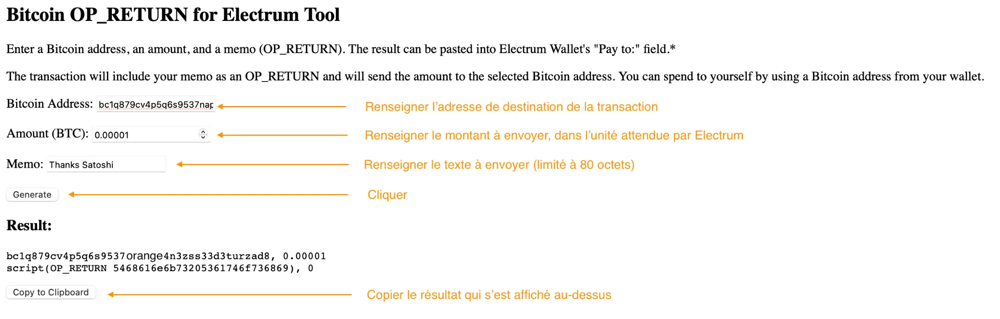

要更改 Electrum 使用的单位，请在选单栏中找到 "Preferences"，然后在 “Units” 选项卡中选择 BTC / mBTC / bits 或 Sats：


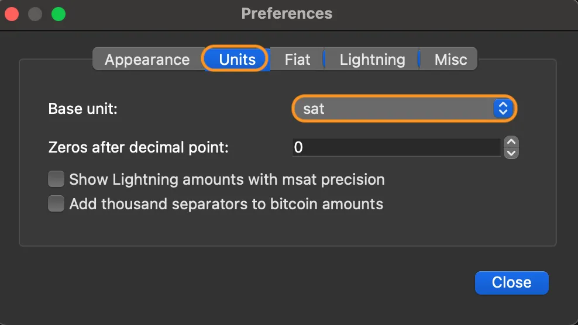


---

## 步骤 5：发送交易

在 Electrum 中，前往 “Send” 选项卡。

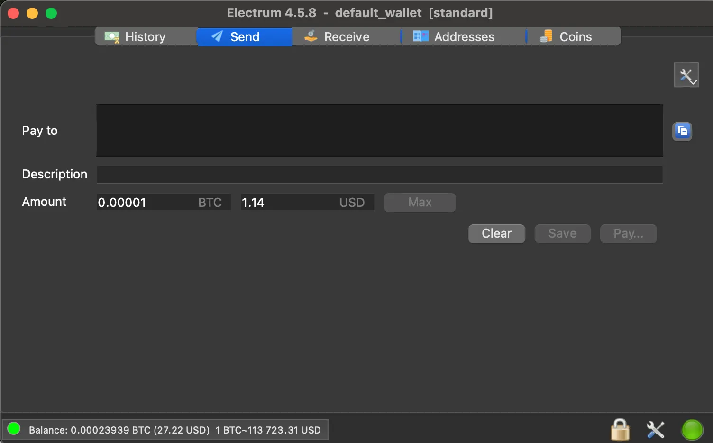


在 "Pay to" 字段中，粘贴准备好的脚本（例如，上面的脚本）。


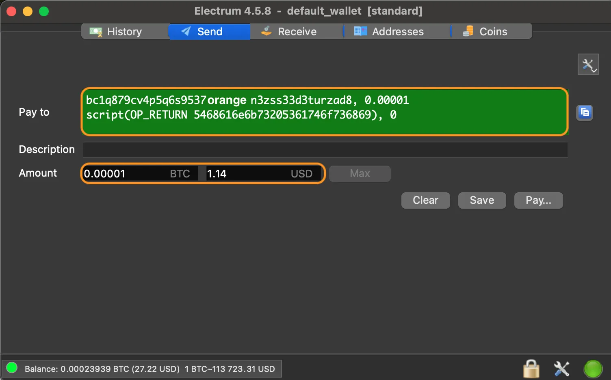

“Pay to” 字段应显示为绿色，交易金额应显示在下方一行。

检查 “Pay to” 字段中的金额及其单位。

点击 “Pay...” 按钮，并根据您愿意支付的金额以及您希望矿工处理交易并将其集成到区块的速度来调整交易费用。


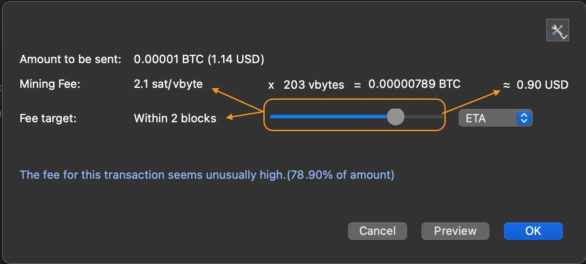

点击 “OK” 并使用您的密码确认交易。此时将出现一个确认窗口。

---

## 步骤 6：验证注册

交易确认后（可能需要几分钟），请前往 “History” 选项卡。

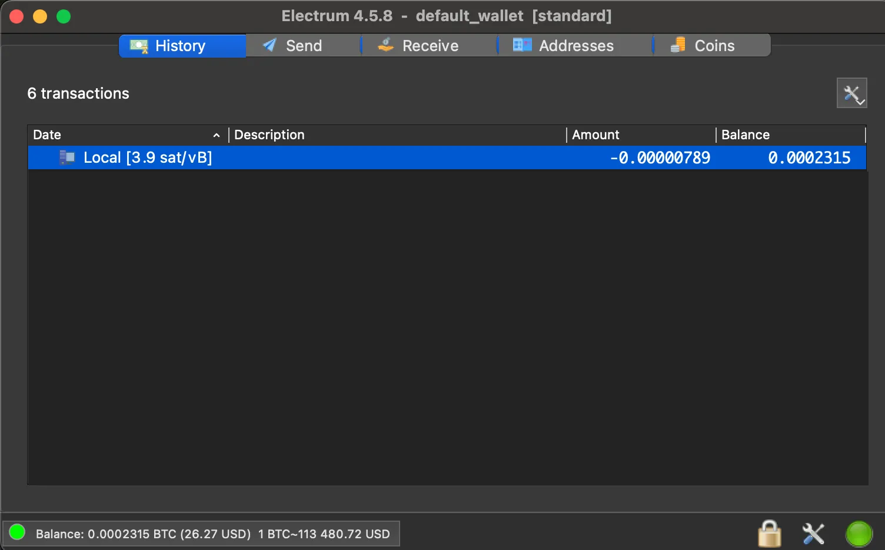


右键单击交易，选择 "View on Explorer"，查看详细信息。


或者，复制目标地址（例如，`bc1q879cv4p5q6s9537orange3zss33d3turzad8`）并在区块链浏览器上查看，如 [Mempool.space](https://Mempool.space/) 或 [blockstream.info](https://blockstream.info/) 。


在交易详细信息中查找 OP_RETURN 字段以查看您的消息。


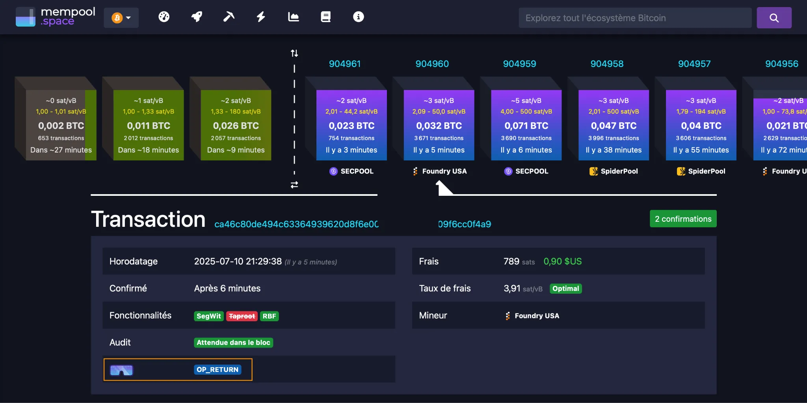


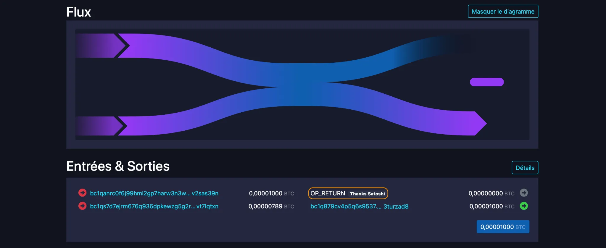


---

## 技巧和最佳实践


- 先用小额交易测试：从小额交易（例如 1000 聪）开始，避免代价高昂的错误。
- 确保 OP_RETURN 的输出结果为零，否则您的比特币将永久丢失。
- 检查单位：确保输入的金额与 Electrum 中显示的单位（BTC、mBTC 或 Sats）一致。
- 交易手续费：如果网络拥堵，请提高手续费以加快确认速度。
- 简短消息：OP_RETURN 条目长度限制为 80 字节。请据此规划您的消息。

---

## 有用资源


- 下载 Electrum：[electrum.org](https://electrum.org/)
- OP_RETURN 脚本生成器：[resources.davidcoen.it/opreturnelectrum/](https://resources.davidcoen.it/opreturnelectrum/)
- Blockchain 探索者：[Mempool.space](https://Mempool.space/), [blockstream.info](https://blockstream.info/)
