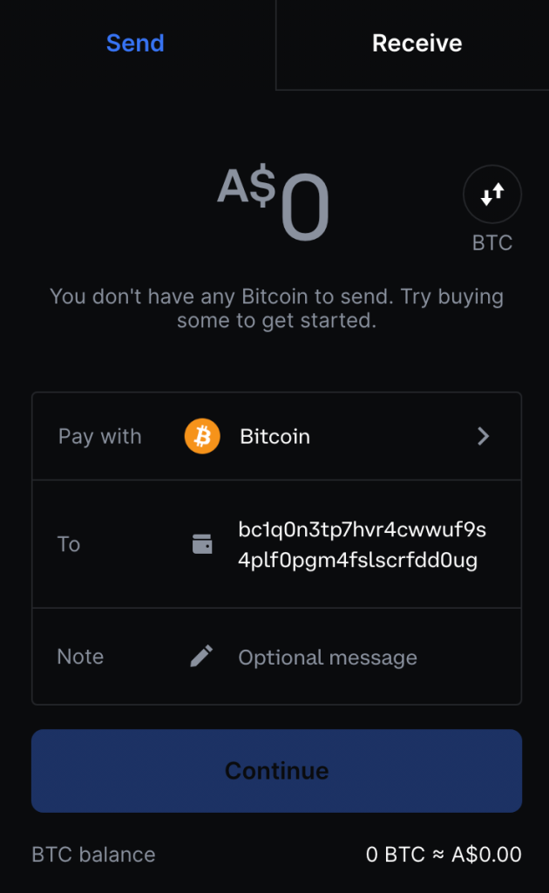

Descrição do Electrum

https://twitter.com/ElectrumWallet
https://electrum.org/
https://electrum.readthedocs.io/

# Carteira de Bitcoin Electrum

> "Tenho que dizer que, quando encontrei este guia, fiquei chocado. Parabéns ao Arman the Parman por isso. Seria uma pena não hospedá-lo aqui e traduzi-lo para o maior número possível de idiomas. Sinceramente, dicas desse cara." Rogzy


## Por que usar o Electrum?

Este é um guia detalhado sobre como usar a Carteira de Bitcoin Electrum, com soluções para todas as suas armadilhas e peculiaridades - algo que desenvolvi após vários anos de uso e ensino de estudantes sobre segurança/privacidade do Bitcoin. O Electrum não é a melhor carteira de Bitcoin para quem deseja manter tudo o mais simples possível e prefere permanecer no nível iniciante. Em vez disso, é para a pessoa que é, ou aspira ser, um usuário "avançado".

Para o novo usuário de Bitcoin, ele é excelente apenas se estiver sob a supervisão de um usuário experiente para mostrar o caminho. Se estiver aprendendo a usá-lo sozinho, será seguro desde que leve seu tempo e o use em um ambiente de teste com apenas uma pequena quantidade de sats no início. Este guia apoia essa empreitada, mas também é uma boa referência para qualquer outra pessoa.

> Aviso: Este guia é extenso. Não tente fazer tudo isso em um dia. É melhor salvar o guia e ir fazendo aos poucos.

## Baixando o Electrum

Idealmente, use um computador dedicado ao Bitcoin para suas transações de Bitcoin (Meu guia para isso https://armantheparman.com/mint/) _(TAMBÉM disponível na seção de privacidade)_. É bom praticar com pequenas quantidades em um computador "sujo" quando você está aprendendo pela primeira vez (quem sabe quanto malware oculto seu computador regular acumulou ao longo dos anos - você não quer expor suas carteiras de Bitcoin a eles).

Obtenha o Electrum em https://electrum.org/.

Clique na guia Download no topo.

Clique no link de download que corresponde ao seu computador. Qualquer computador Linux ou Mac pode usar o link Python (círculo vermelho). Um computador Linux com um chip Intel ou AMD pode usar o Appimage (círculo verde; isso é como um arquivo executável do Windows). Um dispositivo Raspberry Pi tem um microprocessador ARM e só pode usar a versão Python (círculo vermelho), não o Appimage, mesmo que os Pi's executem o Linux. O círculo azul é para Windows e o círculo preto é para Mac.


## Verificando o Electrum

O objetivo de "verificar" o download é garantir que nenhum bit de dados tenha sido adulterado. Isso impede que você use uma versão maliciosa "hackeada" do software. É bom pular esta etapa desde que você use a cópia baixada apenas para praticar, ou seja, não use carteiras que contenham dinheiro sério. Em seguida, quando estiver pronto para usar o Electrum para seus fundos reais, você deve excluir sua cópia e começar de novo, desta vez verificando seu download.

Para fazer isso, usamos ferramentas de criptografia de chave pública/privada - gpg, sobre as quais escrevemos um guia aqui (https://armantheparman.com/gpg/). A ferramenta gpg vem com todos os sistemas operacionais Linux. Para Mac e Windows, consulte o link gpg para obter instruções de download.

Além de baixar o software Electrum, para segurança, você também precisa da ASSINATURA digital do software. Isso é uma sequência de texto (na verdade, é um número codificado usando texto) que o desenvolvedor produziu com sua chave gpg PRIVADA. Usando o programa gpg, podemos então "testar" a ASSINATURA em relação à sua chave PÚBLICA (criada a partir da chave privada do desenvolvedor) à qual todos têm acesso, em comparação com o ARQUIVO de download.

Em outras palavras, com as três entradas (assinatura, chave pública e arquivo de dados), obtemos uma saída verdadeira ou falsa para confirmar que o arquivo não foi adulterado.

Para obter a assinatura, clique no link correspondente ao arquivo que você baixou (veja as setas coloridas):


Clicar no link pode baixar automaticamente o arquivo para a pasta de downloads ou pode abrir no navegador. Se abrir no navegador, você precisa salvar o arquivo. Você pode clicar com o botão direito e selecionar "salvar como". Dependendo do sistema operacional ou navegador, talvez seja necessário clicar com o botão direito na área de espaço em branco, não no texto.

Abaixo está como o texto baixado se parece. Você pode ver que existem várias assinaturas - essas são assinaturas de pessoas diferentes. Você pode verificar cada uma ou qualquer uma delas. Vou mostrar como verificar apenas a do desenvolvedor.


Em seguida, você precisa obter a chave pública de ThomasV - ele é o principal desenvolvedor. Você pode obtê-la diretamente dele, de sua conta Keybase, Github ou de outra pessoa, de um servidor de chaves ou do site do Electrum.

Obtê-la do site do Electrum é na verdade a maneira menos segura, porque se este site for malicioso (a própria coisa que estamos verificando), por que estamos obtendo uma chave pública dele (a chave pública pode ser falsa)?

Para simplificar por enquanto, vou mostrar como obtê-la do site de qualquer maneira, mas tenha isso em mente. Aqui está a cópia (https://github.com/spesmilo/electrum/blob/master/pubkeys/ThomasV.asc) no GitHub, com a qual você pode compará-la.

Role um pouco a página para encontrar o link para a chave pública de ThomasV (círculo vermelho abaixo). Clique nele e faça o download ou, se abrir algum texto no navegador, clique com o botão direito para salvar.


Agora você tem 3 novos arquivos, provavelmente todos na pasta de downloads. Não importa onde eles estejam, mas torna o processo mais fácil se você colocá-los todos na mesma pasta.

Os três arquivos:

1. O download do Electrum
2. O arquivo de assinatura (geralmente tem o mesmo nome de arquivo do download do Electrum com um acréscimo ".asc")
3. A chave pública de ThomasV.

Abra um terminal no Mac ou Linux, ou prompt de comando (CMD) no Windows.

Navegue até o diretório de Downloads (ou onde você colocou os três arquivos). Se você não tem ideia do que isso significa, aprenda com este vídeo curto para Linux/Mac (https://www.youtube.com/watch?v=AO0jzD1hpXc) e este para Windows (https://www.youtube.com/watch?v=9zMWXD-xoxc). Lembre-se de que em computadores Linux, os nomes de diretório diferenciam maiúsculas de minúsculas.
No terminal, digite o seguinte para importar a chave pública de ThomasV para o "keyring" do seu computador (o "keyring" é um conceito abstrato - na verdade, é apenas um arquivo no seu computador):

```
gpg --import ThomasV.asc
```

Certifique-se de que o nome do arquivo corresponda ao que você baixou. Além disso, observe que é um traço duplo, não um traço simples. Também observe que há um espaço antes e depois de "--import". Em seguida, pressione <enter>.

O arquivo deve ser importado. Se você receber um erro, verifique se está no diretório onde o arquivo realmente existe. Para verificar em qual diretório você está (no Mac ou Linux), digite pwd. Para ver quais arquivos estão no diretório em que você está (no Mac ou Linux), digite ls. Você deve ver o arquivo de texto "ThomasV.asc" listado, possivelmente entre outros arquivos.

Em seguida, executamos o comando para verificar a assinatura.

```
gpg --verify Electrum-4.1.5.tar.gz.asc Electrum-4.1.5.tar.gz
```

Observe que existem 4 "elementos" aqui, cada um separado por um espaço. Eu destaquei em negrito o texto alternadamente para ajudá-lo a ver. Os quatro elementos são:

1. o programa gpg
2. a opção --verify
3. o nome do arquivo da assinatura
4. o nome do arquivo do programa

Curiosamente, às vezes você pode deixar de fora o quarto elemento e o computador adivinha o que você quer dizer. Não tenho certeza, mas acredito que isso só funciona se os nomes dos arquivos diferirem apenas pelo "asc" no final.

Não copie apenas os nomes de arquivos que mostrei aqui - verifique se eles correspondem ao nome do arquivo que você tem em seu sistema.

Pressione <enter> para executar o comando. Você deve ver uma "assinatura válida de ThomasV" para indicar sucesso. Haverá alguns erros porque não temos as chaves públicas das assinaturas de outras pessoas que estão contidas no arquivo de assinatura (esse sistema de combinar assinaturas em um arquivo pode mudar em versões posteriores). Além disso, há um aviso na parte inferior que podemos ignorar (isso nos alerta que não dissemos explicitamente ao computador que confiamos na chave pública de ThomasV).

Agora temos uma cópia verificada do Electrum que é seguro de usar.

## Executando o Electrum

### Executando o Electrum se estiver usando Python

Se você baixou a versão Python, é assim que você pode fazê-la funcionar. Você verá na página de download isso:


Para Linux, é uma boa ideia primeiro atualizar seu sistema:

```
sudo apt-get update
sudo apt-get upgrade
```

Copie o texto amarelo destacado, cole-o no terminal e pressione <enter>. Será solicitada sua senha, possivelmente uma confirmação para continuar e, em seguida, ele instalará esses arquivos ("dependências").

Você também precisará extrair o arquivo compactado para um diretório de sua escolha. Você pode fazer isso com a interface gráfica do usuário ou pela linha de comando (comando destacado em rosa) - lembre-se de que os nomes dos seus arquivos podem ser diferentes. (Observe que, quando verificamos o download na seção anterior, foi o arquivo compactado que verificamos, não o diretório extraído.)

Existe uma opção de "instalação" usando o programa PIP, mas isso é desnecessário e adiciona etapas extras e instalação de arquivos. Apenas execute o programa usando o terminal para pular tudo isso.

Os passos (Linux) são:

1. navegue até o diretório onde os arquivos estão extraídos
2. digite: ./run_electrum

Em um Mac, os passos são os mesmos, mas você pode precisar primeiro instalar o Python3 e usar este comando para executar:

````
python3 ./run_electrum```
````

Uma vez que o Electrum está em execução, a janela do terminal permanecerá aberta. Se você fechá-la, o programa Electrum será encerrado. Apenas minimize-o enquanto estiver usando o Electrum.

### Executando o Electrum com o Appimage

Isso é um pouco mais fácil, mas não tão fácil quanto um arquivo executável do Windows. Dependendo da versão do Linux que você está usando, por padrão, os arquivos Appimage podem ter atributos definidos para que a execução seja proibida pelo sistema. Precisamos alterar isso. Se o seu Appimage estiver funcionando, você pode pular esta etapa. Navegue até onde o arquivo está, usando o terminal, e execute o seguinte comando:

```
sudo chmod ug+x Electrum-4.1.5-x86_64.AppImage
```

"sudo" concede privilégios de superusuário; "chmod" é um comando para alterar o modo, alterando quem pode ler, escrever ou executar; "ug+x" significa que estamos modificando o usuário e o grupo para permitir a execução.

Ajuste o nome do arquivo para corresponder à sua versão.

Em seguida, o Electrum será executado clicando duas vezes no ícone do Appimage.

### Executando o Electrum com o Mac

Basta clicar duas vezes no arquivo baixado (é um "drive"). Uma janela será aberta. Arraste o ícone do Electrum na janela para a sua área de trabalho ou onde você quiser manter o programa. Em seguida, você pode "ejetar" o drive e excluir o arquivo baixado.

Para executar o programa, basta clicar duas vezes nele. Você pode encontrar alguns erros específicos do Mac que precisam ser ignorados.

### Executando o Electrum com o Windows

Apesar de eu odiar o Windows acima de tudo, este é o método mais simples. Basta clicar duas vezes no arquivo executável para executá-lo.

## Comece com uma carteira falsa

Quando você carrega o Electrum pela primeira vez, uma janela será aberta como esta:


Mais tarde, selecionaremos manualmente o servidor, mas por enquanto, deixe o padrão e a conexão automática.

Em seguida, crie uma carteira falsa - nunca coloque fundos nesta carteira. O objetivo desta carteira falsa é progredir no software e garantir que tudo esteja funcionando corretamente antes de carregar sua carteira real. Estamos tentando evitar dar acidentalmente privacidade com uma carteira real. Se você está apenas praticando, a carteira que você cria pode ser considerada uma carteira falsa de qualquer maneira.

Você pode deixar o nome como "default_wallet" ou alterá-lo para o que quiser e clicar em próximo. Mais tarde, se você tiver várias carteiras, poderá encontrá-las e abri-las nesta etapa clicando primeiro em "Escolher..."


Escolha "Carteira padrão" e <Próximo>:


Em seguida, selecione "Eu já tenho uma semente". Não quero que você crie uma semente do Electrum, pois ele usa seu próprio protocolo que não é compatível com outras carteiras - é por isso que não clicamos em "nova semente".


Vá para https://iancoleman.io/bip39/ e crie uma semente falsa. Primeiro, altere o número de palavras para 12 (que é uma prática comum), em seguida, clique em "gerar" e copie as palavras na caixa para a área de transferência.


Em seguida, cole as palavras no Electrum. Aqui está um exemplo:


O Electrum estará procurando por palavras que correspondam ao seu próprio protocolo. Temos que contornar isso. Clique em opções e selecione "Semente BIP39":


A semente então se torna válida. (Antes de fazer isso, o Electrum estava esperando uma semente do Electrum, então essa semente era considerada inválida). Antes de clicar em próximo, observe o texto que diz "Checksum OK". É importante (para a carteira real que você pode usar posteriormente) que você veja isso antes de prosseguir, pois confirma a validade da semente que você inseriu. O aviso próximo ao final pode ser ignorado, é a reclamação do desenvolvedor do Electrum sobre o BIP39 e suas alegações "FUD" de que sua versão (que não é compatível com outras carteiras) é superior.

> Um pequeno desvio para um aviso importante. O objetivo do checksum é garantir que você tenha inserido sua semente sem erros de digitação. O checksum é a parte final da semente (a 12ª palavra acaba sendo a palavra de checksum) que matematicamente é determinada pela primeira parte da semente (11 palavras). Se você digitasse algo errado no início, a palavra de checksum não corresponderá matematicamente, e o software da carteira o alertará com um aviso. Isso não significa que a semente não possa ser usada para criar uma carteira de Bitcoin funcional. Imagine criar uma carteira com um erro de digitação, carregar a carteira com bitcoin e, um dia, você pode precisar restaurar a carteira, mas quando o fizer, você não recriará o erro de digitação - você restaurará a carteira errada! É bastante perigoso que o Electrum permita que você prossiga para criar uma carteira se o seu checksum for inválido, então esteja avisado, é sua responsabilidade garantir. Outras carteiras não permitirão que você prossiga, o que é muito mais seguro. Isso é uma das coisas que quero dizer quando digo que o Electrum é bom de usar, uma vez que você aprende a usá-lo corretamente (os desenvolvedores do Electrum devem corrigir isso).

Observe que se você quiser adicionar uma frase secreta, a chance de selecionar isso está nesta janela de opções, bem no topo.

Depois de clicar em OK, você será levado de volta ao local onde digitou a frase da semente. Se você selecionou uma opção de frase secreta, NÃO a insira com as palavras da semente (a solicitação para isso vem em seguida).

Se você não solicitou uma frase secreta, verá esta tela a seguir - mais opções para o tipo de script da sua carteira e caminho de derivação, sobre os quais você pode aprender aqui (https://armantheparman.com/public-and-private-keys/), mas apenas deixe as configurações padrão e prossiga.


> Para informações extras: A primeira opção permite que você escolha entre legado (endereços começando com "1"), pay-to-script-hash (endereços começando com "3") ou bech32/native segwit (endereços começando com "bc1q"). No momento da escrita, o Electrum ainda não suporta taproot (endereços começando com "bc1p"). A segunda opção nesta janela permite que você modifique o caminho de derivação. Sugiro que você nunca modifique isso, especialmente antes de entender o que significa. As pessoas enfatizarão a importância de escrever o caminho de derivação para que você possa recuperar sua carteira, se necessário, mas se você deixá-lo como padrão, provavelmente ficará bem, então não entre em pânico - mas ainda é uma boa prática escrever o caminho de derivação.

Em seguida, você terá a opção de adicionar uma SENHA. Isso não deve ser confundido com "FRASE SECRETA". Uma senha bloqueia o arquivo em seu computador. Uma frase secreta faz parte da composição da chave privada. Como esta é uma carteira fictícia, você pode deixar a senha em branco e prosseguir.


Você receberá um pop-up sobre notificações de nova versão (sugiro que você selecione não). A carteira então se gerará e estará pronta para uso (mas lembre-se, esta carteira está destinada a ser excluída, é apenas uma carteira falsa).


Há algumas coisas que sugiro que você faça para configurar o ambiente de software (necessário apenas uma vez):

### Alterar as unidades para BTC

Vá para o menu superior, ferramentas -> preferências do electrum, e lá, na guia geral, você encontrará a opção de alterar a "unidade base" para BTC.
Ativar a guia Endereços e Moedas

Vá para o menu superior, exibir, e selecione "mostrar endereços". Em seguida, volte para exibir e selecione "mostrar moedas".

### Ativar Oneserver

Por padrão, o Electrum se conecta a um nó aleatório. Ele também se conecta a muitos outros nós secundários. Não tenho certeza de quais dados são trocados com esses nós secundários, mas não queremos que isso aconteça por motivos de privacidade. Mesmo que você especifique um nó, por exemplo, seu próprio nó, esses vários outros nós também serão conectados, e não tenho certeza de quais informações estão sendo compartilhadas. No entanto, é fácil evitar isso. Antes de mostrar como especificar seu próprio nó, vamos fazer com que o Electrum se conecte apenas a um servidor por vez.

> Existe uma maneira de fazer isso especificando "oneserver" pela linha de comando, mas não recomendo dessa forma. Vou mostrar uma alternativa que acredito ser mais fácil a longo prazo e menos propensa a permitir que você se conecte acidentalmente a outros nós.

A razão pela qual estamos usando uma carteira falsa é que se tivéssemos carregado nossa carteira real, com nossos bitcoins reais, teríamos inadvertidamente nos conectado a um nó aleatório até agora (mesmo que tivéssemos selecionado "definir servidor manualmente" no início, ele ainda se conecta a esses outros nós secundários por algum motivo (ei, desenvolvedores do Electrum, vocês deveriam corrigir isso). Se nossa carteira fosse privada, isso seria um desastre.

Também não podemos fazer as etapas que mostrarei abaixo sem primeiro carregar algum tipo de carteira. (Vamos editar um arquivo de configuração que só é preenchido e pronto para edição quando uma carteira é carregada).

**Desligue o Electrum (IMPORTANTE, se você não fizer isso, as alterações que você fizer serão apagadas).**

### Arquivo de Configuração LINUX/MAC

Abra o terminal no Linux ou Mac (instruções para Windows depois):

Você deve estar automaticamente na pasta home. A partir daí, navegue até a pasta oculta de configurações do electrum (isso é diferente de onde o aplicativo está).

```
cd .electrum
```

Observe o ponto antes de "electrum", que indica que é uma pasta oculta.

Outra maneira de chegar lá é digitar:

```
cd ~/.electrum
```

onde "~" representa o caminho do seu diretório home. Você pode ver o caminho completo do seu diretório atual com o comando "pwd".

Uma vez no diretório ".electrum", digite "nano config" e pressione <enter>.

Um editor de texto será aberto (chamado nano) com o arquivo de configuração aberto. O mouse não funciona muito aqui. Use as teclas de seta para chegar à linha que diz:

```
"oneserver": false,
```

Mude "false" para "true"; e não altere a sintaxe (não exclua a vírgula ou ponto e vírgula).

Pressione <ctrl> x para sair, depois "y" para salvar e depois <enter> para confirmar a alteração sem editar o nome do arquivo.
Agora execute o Electrum novamente. Em seguida, clique no círculo no canto inferior direito, que abre as configurações de rede. Em seguida, perto do topo na guia de visão geral, você verá "conectado a 1 nó" - isso indica sucesso.
Logo abaixo disso, você verá um campo de texto e o endereço do servidor está lá. Você está atualmente conectado a esse nó aleatório. Mais informações sobre a conexão com um nó na próxima seção.

### Arquivo de Configuração do Windows

O arquivo de configuração do Windows é um pouco mais difícil de encontrar. O diretório é:

```
C:/Users/Parman/AppData/Roaming/Electrum
```

Obviamente, você precisa alterar "Parman" para o seu próprio nome de usuário do computador.

Nessa pasta, você encontrará o arquivo de configuração. Abra-o com um editor de texto e edite a linha:

```
"oneserver": false,
```

Mude "false" para "true"; não altere a sintaxe (não exclua a vírgula ou ponto e vírgula).

Em seguida, salve o arquivo e saia.

## Conectar o Electrum a um nó

Em seguida, queremos conectar nossa carteira fictícia a um nó de nossa escolha. Se você não estiver pronto para executar um nó, você pode fazer uma das seguintes opções:

1. Conectar-se ao nó pessoal de um amigo (requer Tor)
2. Conectar-se ao nó de uma empresa confiável
3. Conectar-se a um nó aleatório (não recomendado).

A propósito, aqui estão as instruções para executar seu próprio nó, e estas são as razões pelas quais você deveria (todos os tutoriais na seção de Nós ou em nossos cursos gratuitos).

### Conectar-se ao nó de um amigo via Tor (Guia em breve.)

### Conectar-se ao nó de uma empresa confiável

A única razão para fazer isso seria se você precisasse acessar o blockchain e não tivesse seu próprio nó disponível (ou o de um amigo).

Vamos nos conectar ao nó da Bitaroo - Nos disseram que eles não estão coletando dados. Eles são uma exchange apenas de Bitcoin, administrada por um entusiasta do Bitcoin. Conectar-se a eles envolve um pouco de confiança, mas é melhor do que se conectar a um nó aleatório, que poderia ser uma empresa de vigilância.

Acesse as Configurações de Rede clicando no círculo na parte inferior direita da janela da Carteira (vermelho indica não conectado, verde indica conectado e azul indica conectado via Tor).


Depois de clicar no ícone do círculo, uma janela pop-up aparecerá: Sua carteira mostrará "conectado a 1 nó" desde que forçamos isso anteriormente.

Desmarque a caixa "selecionar servidor automaticamente" e, em seguida, no campo Servidor, digite os detalhes da Bitaroo conforme mostrado:


Feche a janela e agora devemos estar conectados ao nó da Bitaroo. Para confirmar, o círculo deve estar verde. Clique nele novamente e verifique se os detalhes do servidor não voltaram para um nó aleatório.

### Conectar-se ao seu próprio nó

Se você tiver seu próprio nó, ótimo. Se você tiver apenas o Bitcoin Core e não um SERVIDOR Electrum também, você ainda não poderá conectar uma CARTEIRA Electrum ao seu nó.

> Observação: Servidor Electrum e Carteira Electrum são coisas diferentes. O servidor é um software necessário para que a Carteira Electrum possa se comunicar com o blockchain do Bitcoin - não sei por que foi projetado dessa maneira - possivelmente para velocidade, mas posso estar errado.
> Se você executar um pacote de software de nó como o MyNode (o que eu recomendo para as pessoas começarem), Raspiblitz (recomendado à medida que você se torna mais avançado) ou Umbrel (pessoalmente, ainda não recomendo, pois tive muitos problemas), então você poderá conectar sua carteira simplesmente inserindo o endereço IP do computador (Raspberry Pi) que está executando o nó, além de dois pontos e 50002, como mostrado na imagem na seção anterior. (Mais adiante, mostrarei como encontrar o endereço IP do seu nó).
> Abra as configurações de rede (clique no círculo verde ou vermelho no canto inferior direito). Desmarque a caixa "selecionar servidor automaticamente" e insira seu endereço IP, como eu fiz, o seu será diferente, mas os dois pontos e "50002" devem ser os mesmos.


Feche a janela e agora deveríamos estar conectados ao seu nó. Para confirmar, clique novamente no círculo e verifique se os detalhes do servidor não voltaram para um nó aleatório.

Às vezes, mesmo fazendo tudo certo, aparentemente, ele se recusa a se conectar. Aqui estão algumas coisas para tentar...

- Atualize para uma versão mais recente do Electrum e do seu software de nó.
- Tente excluir a pasta de cache no diretório ".electrum".
- Tente alterar a porta de 50002 para 50001 nas configurações de rede.
- Use este guia para se conectar usando o Tor como alternativa (https://armantheparman.com/tor/).
- Reinstale o Servidor Electrum no nó.

## ENCONTRANDO O ENDEREÇO IP DO SEU NÓ

Um endereço IP não é algo que um usuário comum normalmente sabe como procurar e usar. Eu ajudei muitas pessoas a executar um nó e, em seguida, conectar suas carteiras ao nó - um obstáculo comum parece ser encontrar seu endereço IP.

Para o MyNode, você pode digitar em uma janela do navegador:

```
mynode.local
```

Às vezes, "mynode.local" não funciona (certifique-se de não digitá-lo em uma barra de pesquisa do Google). Para forçar a barra de navegação a reconhecer seu texto como um endereço e não uma pesquisa, preceda o texto com http://

assim:

```
http://mynode.local
```

se isso não funcionar, tente com um "s", assim:

```
https://mynode.local
```

Isso acessará o dispositivo e você pode clicar no link de configurações (veja meu "círculo" azul abaixo) para mostrar esta tela onde o endereço IP está localizado:


Esta página será carregada e você verá o IP do nó (círculo azul).


Em seguida, no futuro, você pode digitar 192.168.0.150 ou http://192.168.0.150 em seu navegador.

Para o Raspiblitz (quando não estiver conectando uma tela), você precisa de um método diferente (que também funciona para o MyNode):

Faça login na página da web do seu roteador - aqui encontraremos o endereço IP de todos os dispositivos conectados. A página da web do roteador será um endereço IP que você insere em um navegador da web. O meu é:

> http://192.168.0.1

Para obter as credenciais de login do roteador, você pode procurá-las no manual do usuário ou às vezes até em um adesivo no próprio roteador. Procure pelo nome de usuário e senha. Se você não conseguir encontrar, tente Usuário: "admin" Senha: "password".
Se você conseguir fazer login, verá seus dispositivos conectados e, a partir de seus nomes, poderá ficar claro qual é o seu nó. O endereço IP estará lá.

### Se os dois primeiros métodos falharem, o último funcionará, mas é tedioso:

Primeiro, encontre o endereço IP de qualquer dispositivo em sua rede (o computador atual servirá).

Em um Mac, você encontrará nas preferências de rede:


Estamos interessados nos primeiros 4 elementos (192.168.0), não no 4º elemento, o "166" que você vê na imagem (o seu será diferente).

Para Linux, use a linha de comando:

```
ifconfig | grep inet
```

A linha vertical é o símbolo "pipe" e você o encontrará abaixo da tecla <delete>. Você verá alguma saída e um endereço IP. (Ignore 127.0.0.1, não é isso, e ignore a máscara de rede)

Para o Windows, abra o prompt de comando (cmd) e digite:

```
ipconfig/all
```

e pressione Enter. O endereço IP pode ser encontrado na saída.

Isso foi a parte fácil. A parte difícil agora é encontrar o endereço IP do seu nó - precisamos adivinhar por força bruta. Digamos, por exemplo, que o endereço IP do seu computador comece com 192.168.0.xxx, então, para o seu nó, em um navegador, tente:

```
https://192.168.0.2
```

O número mais baixo possível é 2 (0 significa qualquer dispositivo, e 1 pertence ao roteador) e o mais alto, acredito que seja 255 (isso acontece de ser 11111111 em binário, o maior número representado por 1 byte).

Um por um, avance em direção ao 255. Eventualmente, você parará no número correto que carrega sua página MyNode (ou página RaspiBlitz). Então você saberá qual número inserir nas configurações de rede do Electrum para se conectar ao seu nó.

Vai parecer algo assim (certifique-se de incluir os dois pontos e o número depois):


> É útil saber que esses endereços IP são INTERNOS à sua rede doméstica. Ninguém de fora pode vê-los e eles não são sensíveis. Eles são como ramais telefônicos em uma grande organização que o direcionam para diferentes telefones.

## Excluir carteira falsa

Agora conectamos com sucesso a um e apenas um nó. É assim que o Electrum será carregado por padrão a partir de agora. Agora você deve excluir a carteira falsa (Menu: arquivo -> excluir), caso envie acidentalmente fundos para esta carteira insegura (ela é insegura porque não a criamos de maneira segura).

## Criar uma carteira de prática

Após excluir a carteira falsa, comece novamente e crie uma nova, da mesma maneira, apenas desta vez, anote as palavras da semente e mantenha-as em um local seguro.

É uma boa ideia aprender como o Electrum funciona com esta carteira de prática, sem a complicada carteira de hardware (necessária para alta segurança). Coloque apenas uma pequena quantidade de bitcoin nesta carteira - Assuma que você perderá esse dinheiro. Uma vez proficiente, aprenda a usar o Electrum com uma carteira de hardware.

Na nova carteira que você criou, você verá uma lista de endereços. Os verdes são chamados de "endereços de recebimento". Eles são um produto de 3 coisas:

- A frase de semente
- A senha
- O caminho de derivação
  A sua nova carteira possui um conjunto de endereços de recebimento que podem ser criados matematicamente e de forma reproduzível por qualquer carteira de software que possua a semente, frase de acesso e caminho de derivação. Existem 4,3 bilhões deles! Mais do que você precisará. O Electrum mostra apenas os primeiros 20 e, em seguida, mais à medida que você usa os primeiros.

Mais informações sobre chaves privadas do bitcoin podem ser encontradas neste guia.


Isso é muito diferente de algumas outras carteiras que apresentam apenas 1 endereço de cada vez.

Porque você inseriu a frase de acesso ao criar esta carteira, o Electrum possui a chave privada para cada um dos endereços, e é possível gastar a partir desses endereços.

Também observe que existem endereços amarelos, chamados "endereços de troco" - Estes são apenas outro conjunto de endereços de um ramo matemático diferente (outros 4,3 bilhões existem). Eles são usados pela carteira para enviar automaticamente os fundos excedentes de volta para a carteira como troco. Por exemplo, se você pegar 1,5 bitcoin e gastar 0,5 com um comerciante, o restante de 1,0 precisa ir para algum lugar. Sua carteira o enviará para o próximo endereço de troco amarelo vazio - caso contrário, ele vai para o minerador! Para obter mais informações sobre isso (UTXOs), consulte este guia. (https://armantheparman.com/utxo/)

Em seguida, volte para o site da chave privada de Ian Colman e insira a semente (em vez de gerar uma). Você verá abaixo as informações da chave privada e pública mudarem; tudo abaixo depende das coisas acima na página.

> Lembre-se, você nunca deve inserir a semente em um computador para a sua carteira de Bitcoin real - malware pode roubá-la. Estamos apenas usando uma carteira de prática, para fins de aprendizado, então está tudo bem por enquanto.

Role para baixo e altere o caminho de derivação para BIP84 (segwit) para corresponder à sua carteira Electrum clicando na guia BIP84.


Abaixo disso, você verá a chave privada estendida da conta e a chave pública estendida da conta:


Vá para o Electrum e compare se eles correspondem. Há um menu no topo, carteira -> informações:


Isso aparece:


Observe que as duas chaves públicas correspondem.

Em seguida, compare os endereços. Volte para o site de Ian Coleman e role até o final:


Observe que eles correspondem aos endereços no Electrum.

Agora vamos verificar os endereços de troco. Role um pouco para cima até o caminho de derivação e altere o último 0 para um 1:


Agora role para baixo e compare se os endereços correspondem aos endereços amarelos no Electrum.

Por que fizemos tudo isso?

Pegamos as palavras da semente e as colocamos em dois programas de software independentes diferentes para garantir que eles estivessem nos fornecendo as mesmas informações. Isso reduz significativamente o risco de código malicioso estar escondido e nos fornecer chaves privadas ou públicas falsas, ou endereços falsos.

A próxima coisa a fazer é receber um pequeno teste e gastá-lo dentro da carteira de um endereço para outro.

## Testando a Carteira (Aprenda a usá-la)

Aqui vou mostrar como receber um UTXO na sua carteira e depois movê-lo (gastá-lo) para outro endereço dentro da carteira. Esta é uma quantia muito pequena que não nos importaremos em arriscar perder.

Isso tem vários propósitos.

- Isso provará que você tem o poder de gastar moedas na nova carteira.
- Vai demonstrar como usar o software Electrum para fazer um gasto (e algumas funcionalidades), antes de adicionarmos complexidade extra para segurança (usando uma carteira de hardware ou computador sem conexão com a internet).
- Vai reforçar a ideia de que você tem muitos endereços para escolher para receber e gastar, dentro da mesma carteira.

Abra sua carteira de teste do Electrum e clique na aba "Endereços", em seguida, clique com o botão direito do mouse no primeiro endereço e selecione Copiar -> Endereço:


O endereço agora está na memória do seu computador.

Agora vá para uma exchange onde você tem alguns bitcoins e vamos retirar uma pequena quantia para este endereço, digamos 50.000 sats. Vou usar a Coinbase como exemplo porque é a exchange mais comumente usada, mesmo que eles sejam inimigos do Bitcoin, e estou enojado de fazer login em uma conta antiga abandonada para este propósito.

Faça login e clique no botão Enviar/Receber, que atualmente está no canto superior direito da página.


Obviamente, não tenho fundos na Coinbase, mas imagine que há fundos aqui e siga em frente: Cole o endereço do Electrum no campo "Para", como eu fiz. Você também precisará selecionar uma quantia (sugiro cerca de 50.000 sats). Não coloque uma "mensagem opcional" - a Coinbase está coletando dados suficientes seus (e vendendo-os), não há necessidade de ajudá-los. Por fim, clique em "Continuar". Depois disso, não sei quais outras janelas pop-up você verá, você está por conta própria, mas o método é semelhante para todas as exchanges.



Dependendo da exchange, você pode ver os sats em sua carteira imediatamente ou pode haver um atraso de horas/dias.

Observe que o Electrum mostrará as moedas recebidas mesmo que elas não tenham sido confirmadas na blockchain. As moedas que você possui estão sendo lidas a partir da lista de espera de um nó Bitcoin, ou "mempool". Quando elas são incluídas em um bloco, você verá os fundos como confirmados.

Agora que temos uma UTXO em nossa carteira, devemos rotulá-la. Apenas nós podemos ver esse rótulo, não tem nada a ver com o livro-razão público. Todos os nossos rótulos do Electrum são visíveis apenas no computador que estamos usando. Na verdade, podemos salvar um arquivo e usá-lo para restaurar todos os nossos rótulos em um computador diferente executando a mesma carteira.

### Faça um rótulo para uma UTXO

Eu precisava de uma doação para esta carteira de teste, obrigado a @Sathoarder por me fornecer uma UTXO ativa (10.000 sats), e outra pessoa (anon) doou para o mesmo endereço (5.000 sats). Observe que há 15.000 sats no saldo do primeiro endereço e um total de 2 transações (coluna da extrema direita). Na parte inferior, o saldo é de 10.000 sats confirmados e mais 5.000 sats estão não confirmados (ainda na mempool).


Agora, se formos para a aba "Moedas", podemos ver duas "moedas recebidas" ou UTXOs. Ambas estão no mesmo endereço.


Voltando para a aba de endereços, se você clicar duas vezes na área de "rótulos" ao lado do endereço, poderá inserir algum texto e depois pressionar <enter> para salvar:


Esta é uma boa prática para que você possa acompanhar de onde suas moedas vieram, se elas são KYC-free ou não, e quanto cada UTXO custou para você (caso precise vender e calcular o imposto a ser roubado por seu governo).

Idealmente, você deve evitar acumular várias moedas no mesmo endereço. Se você decidir fazer isso (não faça), você pode rotular cada moeda em vez de todas elas com o mesmo rótulo usando o método de endereço. Você não pode realmente ir para a guia "moedas" e editar os rótulos lá (não, isso seria muito intuitivo!). Você precisa ir para a guia Histórico, encontrar a transação, rotulá-la e então verá os rótulos na seção de moedas. Quaisquer rótulos que você veja na seção de moedas são provenientes dos rótulos de endereço OU dos rótulos de histórico, mas qualquer rótulo de histórico substitui qualquer rótulo de endereço. Para fazer backup de seus rótulos em um arquivo, você pode exportá-los no menu superior, carteira -> rótulos -> exportar.

Em seguida, vamos gastar as moedas do primeiro endereço para o segundo endereço. Clique com o botão direito no primeiro endereço e selecione "gastar de" (isso na verdade não é necessário neste cenário, mas imagine que temos muitas moedas em muitos endereços; usando esse recurso, podemos forçar a carteira a gastar apenas as moedas que queremos. Se quisermos selecionar várias moedas em vários endereços, podemos selecionar os endereços com um clique do mouse enquanto seguramos a tecla de comando, em seguida, clique com o botão direito e selecione "gastar de":


Depois de fazer isso, haverá uma barra verde na parte inferior da janela da carteira indicando o número de moedas que você selecionou e o total disponível para gastar.

Você também pode gastar moedas individuais dentro de um endereço e excluir outras no mesmo endereço, mas isso é desencorajado porque você está deixando moedas em um endereço que foi enfraquecido criptograficamente devido ao gasto de uma das moedas (outra razão para não colocar várias moedas em um endereço, além de razões de privacidade, é que, dado que você deve gastá-las todas se gastar uma, isso se torna desnecessariamente caro). Veja como selecionar uma única moeda de um endereço compartilhado, mas não faça isso:


Agora, temos as duas moedas selecionadas para gastar. Em seguida, decidimos para onde enviá-las. Vamos enviá-las para o segundo endereço. Precisaremos copiar o endereço assim:


Em seguida, vá para a guia "Enviar" e cole o segundo endereço no campo "pagar para". Não é necessário adicionar uma descrição; você poderia, mas pode fazer isso depois editando os rótulos. Para o valor, selecione "Máximo" para gastar todas as moedas que selecionamos. Em seguida, clique em "Pagar" e depois clique no botão "avançado" na janela pop-up que aparece.


Sempre clique em "avançado" nesta etapa para que possamos ter um controle preciso e verificar exatamente o que está na transação. Aqui está a transação:


Vemos duas caixas/janelas internas brancas. A de cima é a janela de entradas (quais moedas estão sendo gastas) e a de baixo é a de saídas (para onde as moedas estão indo).
Observe que o status (canto superior esquerdo) é "não assinado" por enquanto. O "Valor enviado" é 0 porque as moedas estão sendo transferidas dentro da carteira. A taxa é de 481 sats. Observe que se fossem 480 sats, o zero final seria removido, assim: 0.0000048 e, para o olho cansado, isso pode parecer 48 sats - tenha cuidado (algo que os desenvolvedores do Electrum devem corrigir).
O tamanho da transação refere-se ao tamanho dos dados em bytes, não à quantidade de bitcoin. A opção "substituir por taxa" está ativada por padrão e permite que você reenvie a transação com uma taxa mais alta, se necessário. O LockTime permite ajustar quando a transação é válida - ainda não mexi com isso, mas aconselho a não usá-lo a menos que você entenda completamente o que está fazendo e tenha praticado com pequenas quantias.

Na parte inferior, temos algumas ferramentas sofisticadas de ajuste de taxa de mineração. Tudo o que você precisa fazer para transferências internas é definir a taxa mínima de 1 sat/byte. Basta digitar manualmente o número no campo Taxa alvo. Para verificar uma taxa apropriada para um pagamento externo, você pode consultar https://mempool.space para ver o quão ocupado está o mempool e algumas taxas sugeridas são exibidas.


Eu selecionei 1 sat/byte.

Na janela de entrada, vemos duas entradas. A primeira é a doação de 5000 sats. Vemos à esquerda o hash da transação (que podemos pesquisar no blockchain). Ao lado, há um "21" - isso indica que é a saída rotulada como 21 nessa transação (na verdade, é a 22ª saída porque a primeira é rotulada como zero).

Algo a ser observado aqui: UTXOs existem apenas dentro de uma transação. Para gastar um UTXO, precisamos referenciá-lo e colocar essa referência na entrada de uma nova transação. As saídas então se tornam novos UTXOs e o antigo UTXO se torna um STXO (gasto de saída de transação).

A segunda linha é a doação de 10.000 sats. Ela tem um "0" ao lado do hash da transação de onde veio porque é a primeira (e possivelmente única) saída dessa transação.

Na janela inferior, vemos nosso endereço. Observe que o total de bitcoin das entradas não corresponde exatamente ao total das saídas. A diferença vai para o minerador. O minerador analisa a discrepância em todas as transações no bloco que está tentando minerar e adiciona esse número à sua recompensa. (As taxas de mineração dessa forma estão totalmente desconectadas da cadeia de transações e iniciam uma nova vida).

Se ajustarmos a taxa de mineração, o valor da saída mudará automaticamente.

> Vale a pena destacar aqui: observe a cor dos endereços na janela de transação. Lembre-se de que os endereços verdes estão listados na sua guia de endereços. Se um endereço estiver destacado em verde (ou amarelo) em uma janela de transação, o Electrum reconheceu o endereço como um dos seus próprios. Se o endereço não tiver destaque, ele é um endereço externo (externo à carteira atualmente aberta) e você deve verificá-lo com cuidado extra.

Depois de verificar tudo na transação e ter certeza de que está satisfeito com quais moedas está gastando e para onde as moedas estão indo, você pode clicar em "finalizar".


Depois de clicar em "finalizar", você não poderá mais fazer edições - Se precisar, terá que fechar isso e começar novamente. Observe que o botão "finalizar" mudou para "exportar" e novos botões apareceram: "salvar", "combinar", "assinar" e "transmitir". O botão "transmitir" está desativado porque a transação não está assinada e, portanto, inválida nessa etapa.
Ao clicar em assinar, se você tiver uma senha para a carteira, será solicitado que insira a senha e, em seguida, o status (canto superior direito) mudará de "Não assinada" para "Assinada". Em seguida, o botão "Transmitir" estará disponível.

Depois de transmitir, você pode fechar a janela de transação. Se você for para a guia de endereços, verá que o primeiro endereço está vazio e o segundo endereço possui 1 UTXO.

Observação: você verá todas essas alterações mesmo antes da transação ser minerada em um bloco ou "confirmada". Isso ocorre porque o Electrum atualiza saldos/transações com base não apenas nos dados do blockchain, mas também nos dados da mempool. Nem todas as carteiras fazem isso.

Algo a ser observado é que, em vez de transmitir, podemos salvar a transação para mais tarde. Ela pode ser salva nos estados não assinado ou assinado.

Clique no botão "exportar" (paradoxalmente, NÃO clique no botão "salvar") e você verá várias opções. A transação é codificada com texto e, portanto, pode ser salva de várias maneiras.


Salvar em um código QR é muito interessante. Se você escolher isso, um QR code aparecerá:


Você pode então tirar uma foto do código QR. Existem várias coisas que você pode fazer com isso, mas por enquanto, vamos apenas dizer que você está carregando-o de volta para a carteira posteriormente. Você pode fechar o Electrum, carregar a carteira novamente e ir para o menu Ferramentas:


Isso abrirá a câmera do seu computador. Em seguida, mostre à câmera a foto do código QR no seu telefone e isso carregará a transação de volta, exatamente como você a deixou.

Não é intuitivo como carregar transações salvas, então preste atenção especial. Carregar uma transação não é uma "ferramenta", mas a opção está oculta no menu Ferramentas (outra coisa que os desenvolvedores do Electrum deveriam corrigir).

Um processo semelhante é possível com uma transação salva como arquivo. Experimente praticar com um dos métodos, dentro da mesma carteira. Não vou explicar aqui, mas você pode usar esse recurso para passar uma transação entre a mesma carteira em diferentes computadores, entre carteiras multiassinatura e de e para carteiras de hardware. Aqui estão algumas instruções.

Agora, voltando ao botão "salvar" - isso não é como salvar o texto da transação. O que isso realmente faz é informar à carteira Electrum que reconheça essa transação no computador local como sendo enviada como pagamento. Se você fizer isso por acidente, verá a transação com um pequeno ícone de computador. Você pode clicar com o botão direito e excluir a transação - não se preocupe, você não pode excluir bitcoin dessa maneira. O Electrum então esquecerá que essa transação aconteceu e "reembolsará" os sats e exibirá os sats no local correto onde eles realmente existem.

### Endereços de troco

Os endereços de troco são interessantes. Você precisa entender UTXOs para entender essa explicação. Se você estiver gastando para um endereço um valor menor que o UTXO, então o bitcoin restante irá para o minerador, a menos que uma saída de troco seja especificada.
Você pode ter uma UTXO de 6,15 bitcoins e desejar gastar 0,15 bitcoin para doar a alguns manifestantes oprimidos pelo governo "democrático" tirânico em algum lugar do mundo. Em seguida, você pegaria os 6,15 bitcoins (usando a função "gastar de" no Electrum) e os colocaria em uma transação.
Você colaria o endereço dos manifestantes no campo "pagar para", talvez colocasse "EndTheFed & WEF" no campo "descrição" e, para o valor, colocaria 0,15 bitcoin e clicaria em "pagar" e depois em "avançado".

Na tela de transação, na janela de entrada, você verá a UTXO de 6,15 bitcoins. Na janela de saída, você verá um endereço que não está destacado (este é o endereço dos manifestantes) com 0,15 bitcoin ao lado dele. Você também verá um endereço amarelo com um pouco menos de 6,0 bitcoins. Este é o endereço de troco selecionado automaticamente pela carteira a partir de um de seus próprios endereços de troco amarelos. O objetivo do endereço de troco é permitir que a carteira coloque moedas de troco nele sem bagunçar a disponibilidade dos endereços de recebimento que você pode ter planos ou faturas enviadas. Se eles forem usados posteriormente pelos clientes, por exemplo, você não quer que sua carteira os use automaticamente e os preencha. É confuso e ruim para a privacidade.

Observe que, ao ajustar a taxa de mineração, o valor de saída de troco será ajustado automaticamente, não o valor do pagamento.

### Troco manual ou pagamento para vários

Este é um recurso muito interessante do Electrum. Você acessa assim.


Você pode então inserir vários destinos para o saldo da UTXO que você está gastando, assim:


Cole o endereço, digite uma vírgula, depois um espaço, depois o valor, depois <enter>, depois faça novamente. NÃO INSIRA VALORES NAS JANELAS "VALOR" - O Electrum preencherá o total aqui conforme você digita os valores individuais na janela "Pagar para".

Isso permite que você determine manualmente para onde vai o troco (por exemplo, um endereço específico em sua carteira ou outra carteira) ou que você pague várias pessoas de uma vez. Se o total não for suficiente para corresponder ao tamanho da UTXO, o Electrum ainda criará uma saída de troco adicional para você.

O recurso de Pagamento para Vários também permite a possibilidade de criar seus próprios "PayJoins" ou "CoinJoins" - fora do escopo deste artigo, mas tenho um guia aqui. (https://armantheparman.com/cj/)

## Carteiras

Quero demonstrar uma Carteira Apenas para Observação usando o Electrum. Para fazer isso, primeiro preciso definir "carteira". Existem duas maneiras de usar a palavra "carteira" no Bitcoin:

- Tipo A, "carteira" - refere-se ao software que mostra seus endereços e saldos, como Electrum, Blue Wallet, Sparrow Wallet, etc.

- Tipo B, "carteira" - refere-se à coleção única de endereços associados à combinação de nossa frase-semente/frase-secreta/caminho-de-derivação. Existem 8,6 bilhões de endereços em qualquer carteira (4,3 bilhões de endereços de recebimento e 4,3 bilhões de endereços de troco). Se você alterar algo na frase-semente, frase-secreta ou caminho de derivação, você obtém uma nova carteira não utilizada com 8,6 bilhões de endereços vazios, todos exclusivos.

Qual tipo alguém está se referindo ao usar a palavra "carteira" é óbvio no contexto.

## Carteira Apenas para Observação - um exercício

Não é completamente óbvio para que serve uma carteira de observação, mas vou começar explicando o que é, como fazer uma prática e depois voltaremos ao seu propósito quando eu explicar mais sobre carteiras de hardware. (Para uma análise detalhada de como usar uma carteira de hardware e várias marcas específicas, veja aqui.)

Vamos fazer uma carteira regular fictícia (desta vez adicionando um pouco mais de complexidade com uma frase secreta) e, em seguida, sua correspondente carteira de observação. Se quiser, você pode copiar exatamente a que eu fiz ou criar a sua própria - esta carteira deve ser descartada; não a utilize de fato. Comece gerando uma semente de 12 palavras usando o site Ian Coleman.

Observe as 12 palavras aleatórias na captura de tela abaixo e que eu inseri uma frase secreta no campo de frase secreta:

FRASE SECRETA: "Craig Wright é um mentiroso e um fraudador e deveria estar na prisão. Além disso, Ross Ulbricht deveria ser libertado da prisão imediatamente."

A frase secreta pode ter até 100 caracteres e idealmente deve ser inequívoca e não muito curta - a que usei é apenas para diversão - geralmente sugiro evitar letras maiúsculas e símbolos apenas para reduzir o estresse ao tentar combinações caso você tenha algum problema para lembrar sua frase secreta.


Em seguida, no Electrum, vá para o menu arquivo->novo/restaurar. Digite um nome único para criar uma nova carteira e clique em "próximo".


As próximas etapas você já deve estar familiarizado, então vou listá-las sem imagens:

- Carteira padrão
- Já tenho uma semente
- Copie e cole as 12 palavras na caixa ou digite-as manualmente.
- Clique em opções e selecione BIP39 e também marque a opção de frase secreta ("estender esta semente com palavras personalizadas")
- Insira sua frase secreta exatamente como fez na página do Ian Coleman
- Deixe as configurações de script e caminho de derivação padrão
- Não é necessário adicionar uma senha (trava a carteira)

Agora volte ao site do Ian Coleman, vá para a seção "caminho de derivação" e clique na guia "BIP 84" para selecionar as mesmas configurações de script que as padrões no Electrum (Native Segwit).


As chaves privadas e públicas estendidas estão logo abaixo e mudam quando você faz alterações no caminho de derivação (ou qualquer outra coisa na página).


Você também verá as chaves privadas/públicas estendidas "BIP32" - ignore-as por enquanto.

A chave privada estendida da conta pode ser usada para regenerar completamente sua carteira. No entanto, a chave pública estendida da conta só pode produzir uma versão limitada da mesma carteira (carteira de observação) - se você colocar essa chave no Electrum, ela ainda produzirá os 8,6 bilhões de endereços que a semente ou a chave privada estendida teriam, mas não haverá chaves privadas disponíveis para o Electrum, portanto, não será possível gastar. Vamos fazer isso agora para demonstrar o ponto:

Copie a "chave pública estendida da conta" para a área de transferência.

Em seguida, vá para o Electrum, deixe a carteira que fizemos aberta e vá para arquivo->novo/restaurar. O processo para criar a carteira é um pouco diferente do anterior:

- Carteira padrão
- Usar uma chave mestra
- Cole a chave pública estendida na caixa e prossiga
- Não é necessário inserir uma frase secreta; ela já faz parte da chave pública estendida
- Não é necessário inserir as configurações de script e caminho de derivação
- Não é necessário adicionar uma senha (trava a carteira)
  Quando a carteira é carregada, você deve perceber que os mesmos endereços são carregados exatamente como antes, quando a semente foi inserida. Você também deve notar no topo da barra de título que diz "observando carteira". Esta carteira pode mostrar seus endereços e saldos (verificando os saldos através de um nó), mas você não pode ASSINAR transações (porque a carteira observadora não possui chaves privadas).
  Então, qual é o objetivo disso?

Uma razão, e não a principal, é que você pode potencialmente observar sua carteira e seu saldo em um computador sem expor suas chaves privadas a qualquer malware no computador.

Outra razão é que é NECESSÁRIO para fazer pagamentos se você optar por manter suas chaves privadas fora do computador; vou explicar:

> As carteiras de hardware (HWW) foram criadas para que um dispositivo possa armazenar suas chaves privadas com segurança (bloqueadas com um PIN), nunca exponha as chaves a um computador (mesmo quando conectado a um computador via cabo) e não consigam se conectar à internet. Um dispositivo assim não pode fazer transações por si só porque todas as transações de bitcoin começam referenciando uma UTXO(s) no blockchain (que está em um nó). Uma carteira deve especificar qual ID de transação a UTXO está e qual saída da transação é a que será gasta. Somente após especificar a entrada é que uma nova transação pode ser criada em primeiro lugar, sem mencionar assinada. As carteiras de hardware não podem criar transações porque não têm acesso a nenhuma UTXO - elas não estão conectadas a nada! Uma chave pública estendida geralmente é extraída do HWW e os endereços são exibidos em um computador - muitas pessoas estão familiarizadas com o software Ledger ou Trezor Suite mostrando endereços e saldos em seu computador - esta é uma carteira observadora. Esses programas podem criar transações, mas não podem assinar. Eles só podem ter transações assinadas por HWWs que estão conectados a eles. O HWW pega a transação recém-gerada da carteira observadora, a assina e depois a envia de volta para o computador para ser transmitida a um nó. O HWW não pode transmitir por si só, sua carteira observadora associada faz isso. Dessa forma, as duas carteiras (carteira de chave pública no computador e carteira de chave privada no HWW) cooperam para gerar, assinar e transmitir, garantindo que as chaves privadas permaneçam isoladas e longe de um dispositivo conectado à internet.

## Transações Parcialmente Assinadas de Bitcoin (PSBTs)

É possível criar uma transação e salvá-la em um arquivo, posteriormente recarregá-la, assiná-la, salvá-la, recarregá-la e, finalmente, transmiti-la - não estou dizendo que alguém precisaria fazer isso; é apenas algo que é possível.

Agora, considere uma carteira multisig 3 de 5 - 5 chaves privadas criam uma carteira e 3 são necessárias para assinar completamente uma transação (veja aqui para saber mais sobre chaves de carteira multisig). É possível ter 5 computadores diferentes, cada um com uma das cinco chaves privadas.

O computador um poderia gerar uma transação e assiná-la. Em seguida, poderia salvá-la em um arquivo e enviá-la por e-mail para o computador dois. O computador dois pode então assinar e potencialmente salvar o arquivo em um código QR e transmitir o QR via chamada Zoom para o computador três do outro lado do mundo. O computador três pode capturar o QR, carregar a transação no Electrum e assinar a transação. Após as duas primeiras assinaturas, a transação era uma PSBT (transação parcialmente assinada de bitcoin). Após a terceira assinatura, a transação se tornou completamente assinada e válida, pronta para ser transmitida.
Para saber mais sobre PSBTS, consulte este guia. (https://armantheparman.com/psbt/)

## Usando carteiras de hardware com o Electrum

Eu tenho um guia sobre o uso de carteiras de hardware em geral, que eu acho que seria importante para pessoas que são novas em HWWs, lerem. (https://armantheparman.com/using-hwws/)

Também existem guias sobre várias marcas de HWWs conectando-se à Sparrow Bitcoin Wallet encontrados aqui. (https://armantheparman.com/hwws/)

Este será o meu primeiro guia mostrando como usar uma carteira de hardware com o Electrum - vou usar a carteira de hardware ColdCard como exemplo. Isso não pretende ser um guia detalhado sobre o ColdCard especificamente, esse guia está aqui. Estou apenas mostrando pontos específicos do Electrum. (https://armantheparman.com/cc/)

### Conectando via cartão micro SD (isolado)

Antes de conectar sua carteira real via ColdCard, espero que você tenha passado pelas etapas anteriores de carregar uma carteira simulada do Electrum e configurar os parâmetros de rede.

Em seguida, no ColdCard, insira o cartão SD. Estou assumindo que você já criou sua semente. Se você estiver acessando a carteira com uma frase de acesso, aplique-a agora. Role para baixo e selecione o menu Avançado/Ferramentas -> Exportar Carteira -> Carteira Electrum.

Você pode rolar para baixo e ler a mensagem. Ele sempre oferece a opção de selecionar "1" para inserir um número de conta diferente de zero (parte do caminho de derivação), mas se você seguiu meu conselho, não mexeu nos caminhos de derivação padrão, então não desejará um número de conta diferente de zero; apenas pressione o sinal de verificação para continuar.

Em seguida, selecione a semântica do script. A maioria das pessoas selecionará "Native Segwit".

Ele dirá "Arquivo de carteira do Electrum gravado" e exibirá o nome do arquivo. Faça uma nota mental disso.

Em seguida, remova o cartão micro SD e coloque-o no computador com o Electrum.

Alguns sistemas operacionais abrirão automaticamente o explorador de arquivos quando você inserir o microSD. Muitas pessoas verão o novo arquivo de carteira e clicarão duas vezes nele, perguntando por que não funciona. Não é um ótimo design. Na verdade, você deve ignorar o explorador de arquivos (feche-o) e abrir o arquivo da carteira usando o Electrum:

Abra o Electrum. Se já estiver aberto com outra carteira, selecione arquivo -> novo. Estamos procurando por esta janela:


Aqui está o truque, não é intuitivo. Clique em "escolher". Em seguida, navegue pelo sistema de arquivos no cartão microSD e encontre o arquivo da carteira e abra-o.

Agora você abriu a carteira de observação correspondente à sua carteira de hardware. Legal.

### Conectando via cabo USB.

Este método deve ser mais fácil, mas para computadores Linux, é muito mais difícil. Algo chamado "regras Udev" precisa ser atualizado. Veja como (guia detalhado https://armantheparman.com/gpg-articles/ ), e resumidamente:

É uma boa ideia garantir que o sistema esteja atualizado. Em seguida:

```
sudo apt-get install libusb-1.0-0-dev libudev-dev
```

em seguida...

```
python3 -m pip install ckcc-protocol
```

Se você receber um erro, verifique se o pip está instalado. Você pode verificar com (pip --version) e pode instalá-lo com (sudo apt install pythron3-pip)

Crie ou modifique o arquivo existente, /etc/udev/rules.d/

Assim:

```
sudo nano /etc/udev/rules.d
```

Um editor de texto será aberto. Copie o texto daqui e cole no arquivo rules.d, salve e saia.


Em seguida, execute esses comandos um após o outro:

```
sudo groupadd plugdev

sudo usermod -aG plugdev $(whoami)

sudo udevadm control –reload-rules && sudo udevadm trigger
```

Se você receber uma mensagem "group plugdev" já existe, tudo bem, prossiga. Após o segundo comando, você não receberá nenhum feedback/resposta, apenas prossiga para o terceiro comando.

Você pode precisar desconectar e reconectar o ColdCard ao computador.

Se, mesmo depois de tudo isso, você ainda não conseguir conectar o ColdCard, tente atualizar o firmware (guia em breve, mas por enquanto, você pode encontrar instruções no site do fabricante).

Em seguida, crie uma nova carteira:

- Carteira padrão
- Use um dispositivo de hardware
- Ele irá escanear e detectar seu ColdCard. Prossiga.
- Selecione a semântica do script e o caminho de derivação
- Decida se o arquivo da carteira deve ser criptografado (recomendado)

### Transações usando o ColdCard

Com o cabo conectado, as transações são fáceis. Assinar transações será simples.

Se estiver usando o dispositivo de forma isolada, você precisará passar manualmente a transação salva entre os dispositivos usando o cartão microSD. Existem alguns truques.

Após criar uma transação e finalizá-la, você precisa clicar no botão de exportação no canto inferior esquerdo. Você verá "salvar em arquivo", que, contra-intuitivamente, não é o que queremos. Na verdade, você precisa primeiro ir para a última opção de menu que diz "para carteiras de hardware" e, em seguida, dentro dessa seleção, encontrar o outro "salvar em arquivo" e selecioná-lo. Em seguida, salve o arquivo no microSD, retire o cartão e coloque-o no ColdCard. Lembre-se de que você pode precisar aplicar uma senha para selecionar a carteira correta. A tela mostrará "pronto para assinar". Clique na marca de seleção, verifique a transação e prossiga confirmando com a marca de seleção. Uma vez concluído, retire o cartão e coloque-o de volta no computador.

Em seguida, precisamos abrir a transação usando o Electrum. A função está oculta no menu Ferramentas -> Carregar transação. Navegue pelo sistema de arquivos e encontre o arquivo. Haverá três arquivos toda vez que você assinar. O arquivo original salvo que a Carteira de Observação fez e dois feitos pelo ColdCard (não sei por que ele faz isso). Um dirá "assinado" e outro dirá "final". Não é intuitivo, mas o "assinado" não é útil, precisamos abrir a transação "final".

Depois de carregar isso, você pode clicar em "transmitir" e o pagamento será feito.

## Atualizando o Electrum e o diretório oculto ".electrum"

O Electrum está presente em seu computador em dois lugares. Há o próprio aplicativo e há uma pasta de configuração oculta. Essa pasta está localizada em lugares diferentes, dependendo do seu sistema operacional:

Windows:

> C:/Users/seu_nome_de_usuário_aqui/AppData/Roaming/Electrum

Mac:

> /Users/seu_nome_de_usuário_aqui/.electrum

Linux:

> /home/seu_nome_de_usuário_aqui/.electrum

Observe o "." antes de "electrum" no Linux e no Mac - isso indica que o diretório está oculto. Além disso, observe que este diretório só é criado (automaticamente) quando você executa o Electrum pela primeira vez. O diretório contém o arquivo de configuração do Electrum e também o diretório que contém quaisquer carteiras que você tenha salvo.
Se você excluir o programa Electrum do seu computador, o diretório oculto permanecerá, a menos que você o exclua ativamente também.
Para atualizar o Electrum, você passa pelo mesmo procedimento que descrevi no início para baixar e verificar. Você terá então duas cópias do programa no seu computador, e você pode executar qualquer uma delas - cada programa acessará a mesma pasta oculta do Electrum para sua configuração e acesso à carteira. Todas as coisas que salvamos, como a unidade base, o nó padrão para se conectar, outras preferências e acesso às carteiras, permanecerão porque tudo isso é salvo nessa pasta.

### Movendo seu Electrum e Carteiras para outro computador

Para fazer isso, você pode copiar os arquivos do programa para um pen drive e também copiar o diretório .electrum. Em seguida, copie ou mova-os para o novo computador. Você não precisa verificar o programa novamente. Certifique-se de copiar o diretório .electrum para o local padrão (lembre-se de copiá-lo ANTES de executar o Electrum pela primeira vez nesse computador, caso contrário, uma pasta .electrum padrão vazia será populada e você pode ficar confuso).

## Etiquetas

Como expliquei anteriormente, na guia de endereços, há uma coluna de etiquetas. Você pode clicar duas vezes lá e inserir notas para si mesmo (isso é apenas no seu computador, não é público e não está na blockchain).


Ao mover sua carteira Electrum para outro computador, você pode querer não perder todas essas notas. Você pode fazer backup delas em um arquivo usando o menu, carteira -> etiquetas -> exportar e, em seguida, no novo computador, usar carteira -> etiquetas -> importar.

## Dicas:

Se você achar este recurso útil e gostaria de apoiar o que faço pelo Bitcoin, você pode doar alguns sats aqui:

Endereço Estático Lightning: dandysack84@walletofsatoshi.com
https://armantheparman.com/electrum/
