Mô tả về Electrum

https://twitter.com/ElectrumWallet
https://electrum.org/
https://electrum.readthedocs.io/

> "Phải nói là, khi tìm thấy hướng dẫn này tôi đã rất ngạc nhiên. Xin chúc mừng Arman the Parman về điều này. Thật đáng tiếc nếu không đăng tải nó ở đây và dịch ra càng nhiều ngôn ngữ càng tốt. Thực vậy, hãy tip cho anh chàng đó." Rogzy

Bài viết gốc:


## Tại sao chọn Electrum?

Đây là hướng dẫn chi tiết về cách sử dụng ví Bitcoin Electrum, với giải pháp cho tất cả các bẫy và điểm lưu ý - điều mà tôi đã có được sau nhiều năm sử dụng và giảng dạy sinh viên về bảo mật / quyền riêng tư với Bitcoin. Electrum không phải là ví Bitcoin tốt nhất cho người muốn giữ mọi thứ càng đơn giản càng tốt và muốn dừng lại ở cấp độ người mới bắt đầu. Thay vào đó, nó dành cho người hoặc muốn trở thành, hoặc đã là một người dùng "nâng cao".

Đối với người mới sử dụng Bitcoin, nó chỉ tốt nếu có sự giám sát, hỗ trợ của một người dùng có kinh nghiệm. Nếu tự học sử dụng nó, nó sẽ an toàn miễn là họ dành thời gian và sử dụng nó trong môi trường thử nghiệm với chỉ một số lượng nhỏ satoshi ban đầu. Hướng dẫn này hỗ trợ nỗ lực đó, nhưng nó cũng là một tài liệu tham khảo tốt cho bất kỳ ai khác.

> Cảnh báo: Hướng dẫn này rất dài và bao trùm nhiều chủ đề rộng lớn. Đừng cố gắng làm tất cả trong một ngày. Tốt nhất là lưu hướng dẫn này lại và thực hành từ từ theo thời gian.

## Tải Electrum về máy của bạn

Lý tưởng nhất, sử dụng một máy tính chuyên dùng dành riêng cho các giao dịch Bitcoin của bạn (Hướng dẫn của tôi về điều này https://armantheparman.com/mint/) _(CŨNG CÓ SẴN trong phần riêng tư)_. Bạn vẫn ổn khi thực hành với số lượng nhỏ bitcoin trên một máy tính "bẩn" lúc mới bắt đầu (ai mà biết được liệu máy tính thường xuyên của bạn đã tích lũy bao nhiêu mã độc ẩn kín qua bao nhiêu năm - bạn không muốn phơi nhiễm ví Bitcoin của mình cho chúng).

Tải Electrum từ https://electrum.org/.

Nhấp vào tab Download ở phía trên.

Nhấp vào liên kết tải xuống tương ứng với máy tính của bạn. Bất kỳ máy tính Linux hoặc Mac nào cũng có thể sử dụng liên kết Python (vòng tròn đỏ). Một máy tính Linux với chip Intel hoặc AMD có thể sử dụng Appimage (vòng tròn xanh lá; giống như một bản dùng được cho Windows). Một thiết bị Raspberry Pi có bộ vi xử lý ARM chỉ có thể sử dụng phiên bản Python (vòng tròn đỏ), không phải Appimage, mặc dù Pi chạy Linux. Vòng tròn xanh là cho Windows và vòng tròn đen là cho Mac.


## Xác minh tính xác thực của Electrum

Mục đích của việc "xác minh" khi tải xuống là để đảm bảo không một bit dữ liệu nào bị thay đổi. Nó ngăn ngừa việc bạn sử dụng một phiên bản phần mềm "bị hack" có hại. Bạn có thể bỏ qua bước này nếu bạn chỉ sử dụng bản sao đã tải xuống để thực hành, tức là không sử dụng ví chứa số tiền lớn. Sau đó, khi đã sẵn sàng để sử dụng Electrum cho số tiền thực sự của mình, bạn nên xóa bản sao hiện dùng và bắt đầu lại, lần này, bạn cần phải xác minh phần mềm được tải xuống của mình.
Để thực hiện điều này, chúng tôi sử dụng công cụ mã hóa khóa công khai/khóa riêng tư - GPG, mà chúng tôi đã viết một hướng dẫn về nó tại đây (https://armantheparman.com/gpg/). Công cụ GPG có sẵn trên tất cả các hệ điều hành Linux. Đối với Mac và Windows, xem liên kết GPG để biết hướng dẫn tải xuống.

Ngoài việc tải xuống phần mềm Electrum, vì lý do bảo mật, bạn cũng cần có CHỮ KÝ số của phần mềm. Đây là một chuỗi ký tự (thực ra là một số được mã hóa dưới dạng văn bản) mà nhà phát triển tạo ra bằng khóa GPG của riêng họ. Sử dụng chương trình GPG, chúng ta có thể "kiểm tra" CHỮ KÝ đối với khóa CÔNG KHAI của anh ấy (được tạo từ khóa riêng tư của nhà phát triển) mà mọi người đều có thể truy cập, so với tệp TẢI XUỐNG.

Nói cách khác, với ba đầu vào (chữ ký, khóa công khai và tệp dữ liệu), chúng ta nhận được một kết quả đúng hoặc sai để xác nhận rằng tệp tin tải xuống (phần mềm) không bị can thiệp.

Để lấy chữ ký, nhấp vào liên kết tương ứng với tệp bạn đã tải xuống (xem hướng các mũi tên chỉ vào):

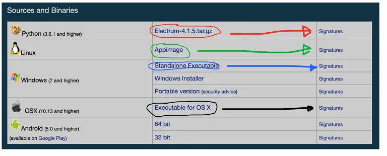

Nhấp vào liên kết để tự động tải tệp xuống máy tính của bạn, hoặc nó có thể mở ra trong trình duyệt. Nếu nó mở ra trong trình duyệt, bạn cần thực hiện thao tác lưu tệp. Bạn có thể nhấp chuột phải và chọn “Lưu thành - Save as”. Tùy thuộc vào hệ điều hành hoặc trình duyệt, bạn có thể cần nhấp chuột phải vào khu vực không gian trắng, không phải văn bản.

Dưới đây là hình thức nội dung của văn bản đã tải xuống. Bạn có thể thấy có nhiều chữ ký - đây là chữ ký của nhiều người khác nhau. Bạn có thể xác minh từng cái hoặc bất kỳ cái nào. Tôi sẽ chỉ cho bạn cách xác minh chữ ký của nhà phát triển.

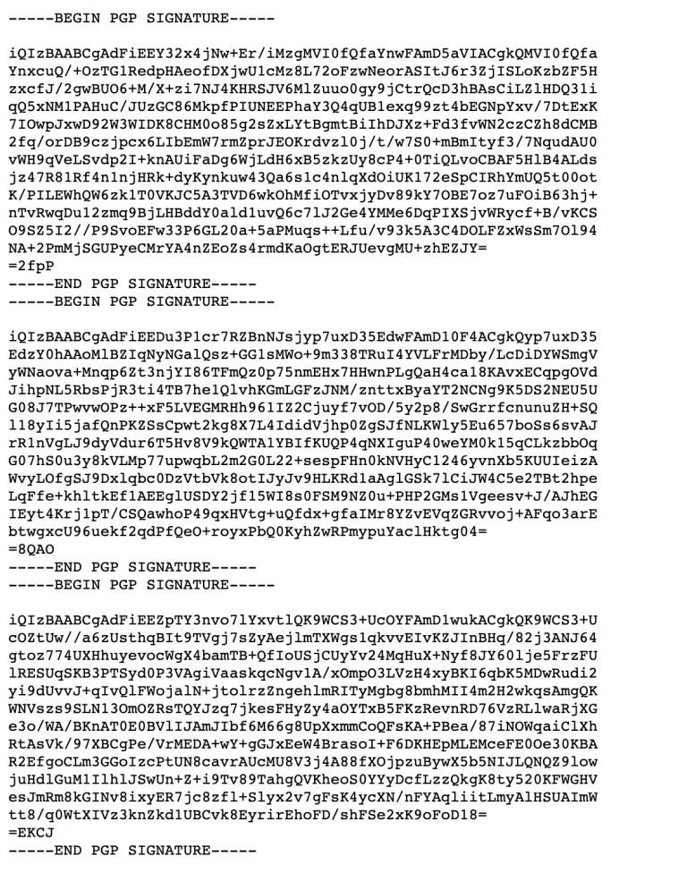

Tiếp theo, bạn cần lấy khóa công khai của ThomasV - anh ấy là nhà phát triển chính. Bạn có thể lấy trực tiếp từ anh ấy, tài khoản Keybase của anh ấy, Github, hoặc từ người khác, từ một keyserver, hoặc từ trang web Electrum.

Thực ra, lấy nó từ trang web Electrum là cách ít an toàn nhất, bởi vì nếu trang web này có ý đồ xấu (chính xác là điều chúng ta đang kiểm tra) tại sao chúng ta lại lấy một khóa công khai từ nó (khóa công khai có thể là giả)?

Dù vậy, để giữ cho mọi thứ đơn giản lúc này, tôi sẽ chỉ cho bạn cách lấy nó từ trang web, nhưng hãy nhớ điều này. Đây là bản sao (https://github.com/spesmilo/electrum/blob/master/pubkeys/ThomasV.asc) trên GitHub mà bạn có thể so sánh.

Cuộn xuống một chút để tìm liên kết đến khóa công khai của ThomasV (vòng tròn màu đỏ bên dưới). Nhấp vào nó và tải xuống, hoặc nếu nó mở một số văn bản trong một cửa sổ trình duyệt, nhấp chuột phải để lưu.

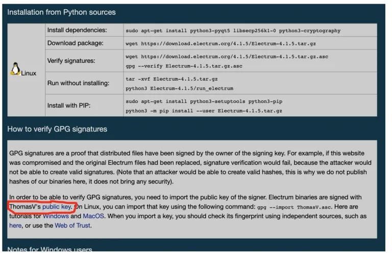

Bây giờ bạn có 3 tệp mới, có lẽ tất cả đều ở trong thư mục tải xuống trên máy tính của bạn. Không quan trọng chúng ở đâu, nhưng quá trình sẽ dễ dàng hơn nếu bạn đặt tất cả chúng vào cùng một thư mục.

Ba tệp bao gồm:

1. Tệp tải xuống Electrum
2. Tệp chữ ký (thường là cùng tên tệp với tệp tải xuống Electrum với đuôi “.asc”
3. Khóa công khai của ThomasV.

Mở một cửa sổ Terminal trên Mac hoặc Linux, hoặc dấu nhắc lệnh (CMD) trên Windows.

Di chuyển đến thư mục Downloads (hoặc bất cứ nơi nào bạn lưu ba tệp). Nếu bạn không biết điều này có nghĩa là gì, học từ video ngắn này cho Linux/Mac (https://www.youtube.com/watch?v=AO0jzD1hpXc) và cái này cho Windows (https://www.youtube.com/watch?v=9zMWXD-xoxc). Nhớ rằng trên máy tính Linux, tên thư mục phân biệt giữa chữ hoa với chữ thường.
Trong Terminal, gõ lệnh này để nhập khóa công khai của ThomasV vào "chùm chìa khóa - keyring" trên máy tính của bạn (chùm chìa khóa là một khái niệm trừu tượng - thực chất nó chỉ là một tệp trên máy tính của bạn):
```bash
gpg --import ThomasV.asc
```

Hãy chắc chắn rằng tên tệp trùng khớp với tệp bạn đã tải xuống. Lưu ý rằng đây là dấu gạch nối kép chứ không phải gạch nối đơn. Ngoài ra, chú ý có một khoảng trắng trước và sau “--import”. Sau đó nhấn <enter>.

Tệp sẽ được nhập. Nếu bạn nhận được một lỗi, kiểm tra xem bạn có đang ở trong thư mục nơi tệp thực sự tồn tại hay không. Để kiểm tra thư mục bạn đang làm việc (trên Mac hoặc Linux), gõ pwd. Để xem những tệp nào đang trong ở thư mục bạn đang làm việc (trên Mac hoặc Linux), gõ ls. Bạn nên thấy tệp văn bản “ThomasV.asc” được liệt kê, có thể cùng với các tệp khác.

Sau đó, chúng ta chạy lệnh để xác minh chữ ký.

```bash
gpg --verify Electrum-4.1.5.tar.gz.asc Electrum-4.1.5.tar.gz
```

Lưu ý có 4 “phần tử” ở đây, mỗi phần được tách bởi một khoảng trắng. Tôi đã in đậm văn bản xen kẽ để giúp bạn nhìn thấy. Bốn phần tử là:

1. Chương trình gpg
2. Lựa chọn --verify
3. Tên tệp chữ ký
4. Tên tệp của chương trình phần mềm

Điều đáng chú ý, đôi khi bạn có thể bỏ qua phần tử thứ 4 và máy tính sẽ đoán ý bạn. Tôi không chắc, nhưng tôi tin rằng nó chỉ hoạt động nếu tên tệp chỉ khác nhau bởi đuôi “asc” ở cuối.

Đừng chỉ sao chép tên tệp mà tôi đã đưa ra ở đây - hãy chắc chắn chúng trùng khớp với tên tệp của những gì bạn có trên hệ thống của mình.

Nhấn <enter> để chạy lệnh. Bạn nên thấy một dòng hiển thị “chữ ký tốt từ ThomasV - good signature freom ThomasV” để thông báo thành công. Sẽ có một số lỗi vì chúng ta không có khóa công khai cho chữ ký của những người khác được chứa trong tệp chữ ký (hệ thống kết hợp chữ ký trong một tệp có thể thay đổi trong các phiên bản sau). Ngoài ra, có một cảnh báo ở phía dưới mà chúng ta có thể bỏ qua (điều này cảnh báo rằng chúng ta chưa thông báo rõ ràng cho máy tính rằng chúng ta tin tưởng khóa công khai của ThomasV).

Bây giờ chúng ta có một bản sao của Electrum đã được xác minh là an toàn để sử dụng.

## Chạy Electrum

### Chạy Electrum nếu sử dụng Python

Nếu bạn đã tải xuống phiên bản Python, đây là cách để làm cho nó hoạt động. Bạn sẽ thấy trên trang tải xuống điều này:


Đối với Linux, Đầu tiên nên cập nhật hệ thống của bạn:

```bash
sudo apt-get update
sudo apt-get upgrade
```

Sao chép đoạn text được làm nổi bật màu vàng, dán vào terminal, và nhấn <enter>. Bạn sẽ được yêu cầu mật khẩu, có thể là xác nhận để tiếp tục, và sau đó nó sẽ cài đặt những tệp đó (“dependencies”).

Bạn cũng cần giải nén tệp zip vào một thư mục theo lựa chọn của bạn. Bạn có thể làm điều này với GUI - giao diện người dụng dạng đồ hoạ, hoặc từ dòng lệnh (lệnh được làm nổi bật bằng màu hồng) - nhớ rằng tên tệp của bạn có thể khác. (Lưu ý rằng khi chúng ta đã xác minh tải xuống trong phần trước, đó là tệp zip chúng ta đã xác minh, không phải thư mục đã giải nén.)

Có một tùy chọn để “cài đặt” sử dụng chương trình PIP, nhưng điều này không cần thiết, và nó cũng tăng thêm các bước cũng như cài đặt thêm tệp. Chỉ cần chạy chương trình sử dụng terminal để bỏ qua tất cả những điều đó.

Các bước (với Linux) là:

1. Đi đến đến thư mục nơi các tệp được giải nén
2. gõ: ./run_electrum

Trên Mac, các bước là tương tự nhưng có thể là bạn cần phải cài đặt Python3 trước, và sử dụng lệnh này để chạy:
```bash
python3 ./run_electrum
```

Một khi Electrum đã được chạy, cửa sổ terminal sẽ vẫn mở. Nếu bạn đóng nó lại, chương trình Electrum sẽ bị dừng. Chỉ cần thu nhỏ nó khi bạn đang sử dụng Electrum.

### Chạy Electrum với Appimage

Cách này dễ dàng hơn một chút, nhưng không dễ như tệp chạy trên Windows. Tùy thuộc vào phiên bản Linux bạn đang sử dụng, mặc định, các tệp Appimage có thể được thiết lập các thuộc tính sao cho hệ thống không cho phép thực thi. Chúng ta cần phải thay đổi điều này. Nếu Appimages của bạn hoạt động, bạn có thể bỏ qua bước này. Di chuyển đến nơi chứa tệp sử dụng terminal, sau đó chạy lệnh này:

```bash
sudo chmod ug+x Electrum-4.1.5-x86_64.AppImage
```

“sudo” cấp quyền siêu người dùng (superuser); “chmod” là lệnh để thay đổi chế độ, thay đổi người có thể đọc, viết, hoặc thực thi; “ug+x” có nghĩa là chúng ta đang chỉnh sửa quyền của người dùng và nhóm để cho phép thực thi.

Điều chỉnh tên tệp cho phù hợp với phiên bản của bạn.

Sau đó, Electrum sẽ chạy bằng cách nhấp đúp vào biểu tượng Appimage.

### Chạy Electrum trên Mac

Chỉ cần nhấp đúp vào file đã tải (nó là một “ổ đĩa”). Một cửa sổ sẽ mở ra. Kéo biểu tượng Electrum trong cửa sổ vào desktop của bạn, hoặc bất cứ nơi nào bạn muốn giữ chương trình. Sau đó, bạn có thể “eject” ổ đĩa, và xóa ổ đĩa (tệp đã tải).

Để chạy chương trình, chỉ cần nhấp đúp vào nó. Bạn có thể gặp một số lỗi cụ thể của Mac và cần phải khắc phục

### Chạy Electrum trên Windows

Mặc dù tôi ghét Windows nhất, những đây là phương pháp đơn giản nhất. Chỉ cần nhấp đúp vào tệp thực thi để chạy.

## Bắt đầu với một ví "bù nhìn"

Khi bạn lần đầu tiên chạy Electrum, một cửa sổ sẽ mở ra như thế này:


Sau này, chúng ta sẽ sẽ chọn máy chủ của bạn một cách thủ công, nhưng bây giờ, hãy để mặc định và tự động kết nối.

Tiếp theo, tạo một ví "bù nhìn" - đừng bao giờ đặt tiền vào ví này. Mục đích của ví "bù nhìn" này là để xem qua một lượt phần mềm và đảm bảo mọi thứ hoạt động tốt trước khi bạn tạo ví thực của mình. Chúng ta đang cố gắng tránh việc vô tình đánh mất quyền riêng tư với một ví thực. Nếu bạn chỉ đang thực hành, ví bạn tạo ra có thể được xem là một ví bù nhìn.

Bạn có thể để tên là “default_wallet” hoặc thay đổi nó thành bất cứ cái gì bạn thích, và nhấp vào tiếp theo. Sau này, nếu bạn có nhiều ví, bạn có thể tìm và mở chúng ở giai đoạn này bằng cách đầu tiên nhấp vào “Choose…”

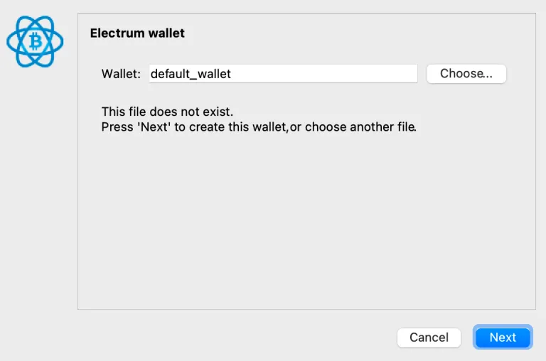

Chọn “Standard wallet” và <Next>:

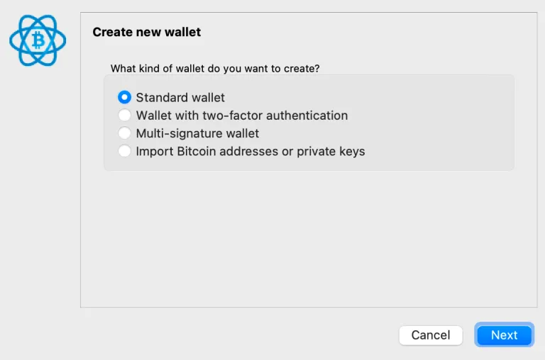

Sau đó, chọn “Tôi đã có hạt giống - I already have a seed”. Tôi không muốn có thói quen tạo một hạt giống Electrum, vì nó sử dụng giao thức riêng của mình và không tương thích với các ví khác - đó là lý do tại sao chúng ta không nhấp vào “hạt giống mới - new seed”.


Truy cập https://iancoleman.io/bip39/ và tạo một seed bù nhìn. Đầu tiên, thay đổi số từ thành 12 (đây là lựa chọn phổ biến), sau đó nhấp vào “Generate” và sao chép các từ trong hộp vào clipboard của bạn.

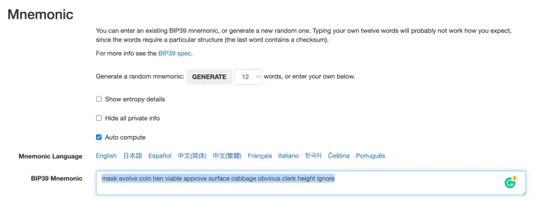

Sau đó dán các từ vào Electrum. Dưới đây là một ví dụ:

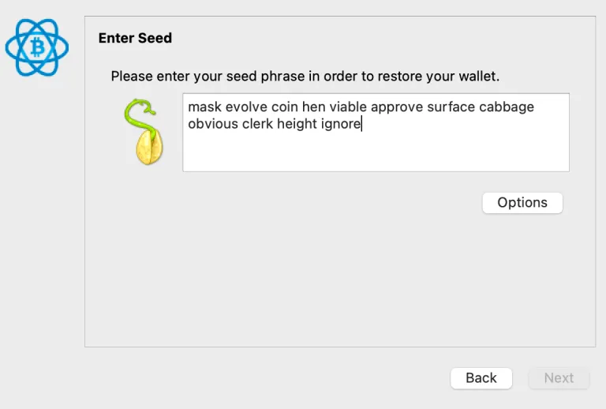

Electrum sẽ tìm kiếm các từ phù hợp với giao thức của mình. Chúng ta phải vượt qua điều đó. Nhấp vào tùy chọn, và chọn BIP39 Seed:


Sau đó, hạt giống sẽ trở thành hợp lệ. (Trước khi thực hiện điều này, Electrum đang chờ đợi một hạt giống Electrum nên hạt giống này được coi là không hợp lệ). Trước khi bạn nhấn tiếp theo, hãy chú ý đến dòng chữ nói rằng “Checksum OK”. Điều này rất quan trọng (đối với ví thực bạn có thể sử dụng sau này), và bạn cần thấy điều này trước khi tiếp tục, vì nó xác nhận tính hợp lệ của hạt giống mà bạn đã nhập vào. Cảnh báo gần cuối có thể bỏ qua, đó là lời than phiền của nhà phát triển Electrum về BIP39 và những tuyên bố “FUD’ey” của họ rằng phiên bản của họ (không tương thích với các ví khác) là tốt hơn.

> Một lời cảnh báo ngắn quan trọng. Mục đích của checksum là để đảm bảo bạn đã nhập hạt giống của mình mà không có lỗi đánh máy. Checksum là phần cuối cùng của hạt giống (từ cuối cùng, thứ tự số 12 là từ để checksum) mà về mặt toán học được xác định bởi phần đầu tiên của hạt giống (11 từ). Nếu bạn nhập sai một cái gì đó ở phần đầu, từ checksum sẽ không khớp về mặt toán học, và phần mềm ví sẽ cảnh báo bạn bằng một thông báo. Điều này không có nghĩa là hạt giống không thể được sử dụng để tạo một Ví Bitcoin hoạt động. Hãy tưởng tượng tạo một ví với lỗi đánh máy, nạp bitcoin vào đó, rồi một ngày nào đó bạn cần phục hồi ví, nhưng khi bạn làm vậy, bạn không tái tạo lại lỗi đánh máy - bạn sẽ phục hồi nhầm ví! Thật nguy hiểm khi Electrum cho phép bạn tiếp tục tạo ví nếu checksum của bạn không hợp lệ, vì vậy hãy chú ý, đó là trách nhiệm của bạn để đảm bảo an toàn cho minh. Các ví khác sẽ không cho phép bạn tiếp tục, điều này an toàn hơn nhiều. Đây là một trong những điều tôi muốn nói khi tôi nói Electrum là tốt để sử dụng, một khi bạn đã học được cách sử dụng nó chuẩn xác (các nhà phát triển Electrum nên sửa lỗi này).

Lưu ý rằng nếu bạn muốn thêm một cụm từ mật khẩu (passphrase), cơ hội để chọn điều đó nằm ở cửa sổ tùy chọn này, ngay ở phía trên cùng (Extend this seed with custom words).

Sau khi nhấn OK, bạn sẽ được đưa trở lại nơi bạn đã nhập cụm từ hạt giống. Nếu bạn đã chọn sử dụng cụm từ mật khẩu (passphrase), bạn KHÔNG nhập nó với các từ hạt giống (lời nhắc cho điều đó xuất hiện tiếp theo sau).

Nếu bạn không yêu cầu một cụm từ mật khẩu, bạn sẽ thấy màn hình tiếp theo này - nhiều tùy chọn hơn cho loại kịch bản ví và đường dẫn phái sinh mà bạn có thể tìm hiểu tại đây (https://armantheparman.com/public-and-private-keys/), nhưng chỉ cần để mặc định và tiếp tục.

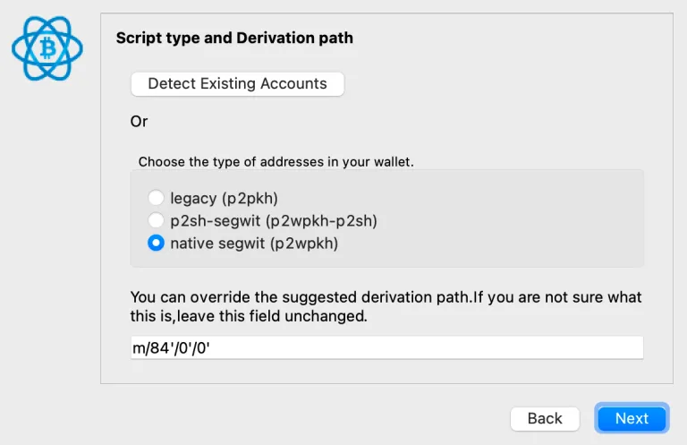

> Thông tin thêm: Tùy chọn đầu tiên cho phép bạn chọn giữa legacy (địa chỉ bắt đầu bằng “1”), pay-to-script-hash (địa chỉ bắt đầu bằng “3”), hoặc bech32/native segwit (địa chỉ bắt đầu bằng “bc1q”). Tại thời điểm viết bài, Electrum chưa hỗ trợ taproot (địa chỉ bắt đầu bằng “bc1p”). Tùy chọn thứ hai trong cửa sổ này cho phép bạn chỉnh sửa đường dẫn phái sinh. Tôi đề xuất bạn không bao giờ chỉnh sửa điều này, đặc biệt là trước khi hiểu nó có nghĩa là gì. Mọi người sẽ nhấn mạnh tầm quan trọng của việc ghi lại đường dẫn phái sinh để bạn có thể khôi phục ví của mình nếu cần, nhưng nếu bạn để nó như mặc định, bạn có lẽ vẫn sẽ ổn, vì vậy đừng hoảng sợ - nhưng ghi lại đường dẫn phái sinh vẫn là một thực hành tốt.

Tiếp theo, bạn sẽ có lựa chọn để thêm một "MẬT KHẨU - PASSWORD". Điều này không được nhầm lẫn với “CỤM TỪ MẬT KHẨU - PASSPHRASE”. Mật khẩu dùng để khóa tệp trên máy tính của bạn. Còn cụm từ mật khẩu là một phần của cấu trúc khóa riêng tư. Vì đây là một ví bù nhìn, bạn có thể để trống mật khẩu và tiếp tục.


Bạn sẽ nhận được một cửa sổ hiện lên thông báo về phiên bản mới (Tôi gợi ý bạn chọn Không - No). Ví sẽ tự động được tạo và sẵn sàng để bạn sử dụng (nhưng nhớ rằng, ví này được dùng để xóa, chỉ là một ví bù nhìn).
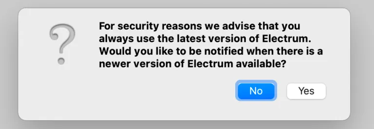

Có một số việc tôi gợi ý bạn nên làm để thiết lập môi trường phần mềm (chỉ cần thực hiện một lần):

### Đổi đơn vị sang BTC

Vào menu trên cùng, "công cụ (tools) –> tùy chọn electrum (electrum preferences), và tại đây dưới tab chung, bạn sẽ tìm thấy tùy chọn để đổi “đơn vị cơ bản - base unit” sang BTC.
Kích hoạt tab Địa chỉ và Coin

Vào menu trên cùng, xem, và chọn “Hiển thị địa chỉ - Show addresses”. Sau đó quay lại xem và chọn “Hiển thị coin - Show coins”.

### Kích hoạt Oneserver

Mặc định, Electrum kết nối với một node ngẫu nhiên. Nó cũng kết nối với nhiều node phụ khác. Tôi không chắc dữ liệu nào được trao đổi với những node phụ này, nhưng chúng ta không muốn điều này xảy ra, vì lý do riêng tư. Ngay cả khi bạn chỉ định một node, ví dụ node của riêng bạn, những node khác cũng sẽ được kết nối, và tôi không chắc thông tin nào được chia sẻ. Dù sao, ngăn chặn điều này cũng khá dễ dàng. Trước khi tôi hướng dẫn cách chỉ định node của riêng bạn, chúng ta sẽ buộc Electrum chỉ kết nối với một máy chủ tại một thời điểm.

> Có một cách để làm điều này là chỉ định “oneserver” từ dòng lệnh, nhưng tôi không khuyến khích cách này. Tôi sẽ hướng dẫn một phương án thay thế mà tôi nghĩ là dễ dàng hơn về lâu dài, và cách này sẽ không để bạn vô tình kết nối với các node khác.

Lý do chúng ta sử dụng một ví bù nhìn là nếu chúng ta đã tạo một ví thực, với bitcoin thực của mình, chúng ta sẽ đã vô tình kết nối với một node ngẫu nhiên ở thời điểm hiện tại (ngay cả khi chúng ta đã chọn “Thiết lập máy chủ theo cách thủ công - Set server manually” ngay từ đầu, nó vẫn kết nối với các node phụ khác vì một số lý do (này các nhà phát triển Electrum, bạn nên sửa điều này). Nếu ví của chúng ta là riêng tư, điều này sẽ là một thảm họa.

Chúng ta cũng không thể thực hiện các bước tôi sẽ chỉ dưới đây mà không trước tiên tải lên một chiếc ví nào đó. (Chúng ta sẽ chỉnh sửa một tệp cấu hình chỉ được điền và sẵn sàng để chỉnh sửa sau khi đã có một ví được tải).

**Tắt Electrum (QUAN TRỌNG, nếu bạn không làm điều này, những thay đổi sau đây bạn thực hiện sẽ bị xóa).**

### Tệp cấu hình trên LINUX/MAC

Mở terminal trong Linux hoặc Mac (hướng dẫn cho Windows sau):

Bạn sẽ tự động ở trong thư mục home. Từ đó, chuyển đến thư mục cài đặt ẩn của electrum (khác với nơi ứng dụng được cài đặt).

```bash
cd .electrum
```

Chú ý dấu chấm trước “electrum” chỉ ra rằng đây là một thư mục ẩn.

Một cách khác để đến đó là gõ:

```bash
cd ~/.electrum
```

nơi “~” đại diện cho đường dẫn của thư mục home của bạn. Bạn có thể xem đường dẫn đầy đủ của thư mục hiện tại với lệnh “pwd“.

Một khi đã ở trong thư mục “.electrum”, gõ “nano config” và nhấn <enter>.

Một trình soạn thảo văn bản sẽ mở (gọi là nano) với tệp cấu hình mở. Con trỏ chuột không hoạt động nhiều ở đây. Sử dụng các phím mũi tên để di chuyển đến dòng:

```json
"oneserver": false,
```

Thay đổi “false” thành “true”; và không làm xáo trộn cú pháp (không xóa dấu phẩy hoặc dấu chấm phẩy).

Nhấn <ctrl> x, để thoát, sau đó “y” để lưu, rồi <enter> để xác nhận thay đổi mà không chỉnh sửa tên tệp.
Bây giờ, hãy chạy lại Electrum. Sau đó, nhấp vào biểu tượng hình tròn ở góc dưới bên phải, điều này sẽ mở cài đặt mạng lưới. Tiếp theo, gần đầu trong tab tổng quan, bạn sẽ thấy "đã kết nối với 1 node - connected to 1 node" - điều này báo hiệu thành công.
Ngay bên dưới đó, bạn sẽ thấy một trường văn bản và địa chỉ của máy chủ được hiển thị ở đó. Bạn hiện đang kết nối với node ngẫu nhiên đó. Nội dung kết nối với một node sẽ được giới thiệu trong phần tiếp theo.

### Tệp cấu hình trên Windows

Tệp cấu hình Windows hơi khó tìm hơn. Đường dẫn là: `C:/Users/Parman/AppData/Roaming/Electrum`

Rõ ràng, bạn phải thay đổi "Parman" thành tên người dùng của bạn trên máy tính.

Trong thư mục đó bạn sẽ tìm thấy tệp cấu hình. Mở nó với trình soạn thảo văn bản và chỉnh sửa dòng:

```json
"oneserver": false,
```

Thay đổi "false" thành "true"; không làm xáo trộn cú pháp (không xóa dấu phẩy hoặc dấu chấm phẩy).

Sau đó lưu tệp và thoát.

## Kết nối Electrum với một node

Tiếp theo, chúng ta muốn kết nối ví bù nhìn của mình với một node theo lựa chọn của chúng ta. Nếu bạn chưa sẵn sàng để chạy một node, bạn có thể thực hiện một trong những cách sau:

1. Kết nối với node cá nhân của một người bạn (yêu cầu Tor)
2. Kết nối với node của một công ty đáng tin cậy
3. Kết nối với một node ngẫu nhiên (không được khuyến nghị).

Nhân tiện, đây là hướng dẫn để chạy node của riêng bạn, và đây là những lý do tại sao bạn nên làm điều đó. (tất cả hướng dẫn trong phần Node hoặc trong các khóa học miễn phí của chúng tôi tại đây: https://planb.network/en/tutorials/node)

### Kết nối với node của bạn bè qua Tor (Hướng dẫn sẽ sớm có.)

### Kết nối với node của một công ty đáng tin cậy

Lý do duy nhất để làm điều này là nếu bạn cần truy cập blockchain và bạn không có node của riêng mình (hoặc của một người bạn).

Hãy kết nối với node của Bitaroo - Chúng tôi được biết rằng họ không thu thập dữ liệu. Họ là một sàn giao dịch chỉ dành cho Bitcoin, được điều hành bởi một người đam mê Bitcoin. Kết nối với họ đòi hỏi một chút tin tưởng, nhưng nó tốt hơn là kết nối với một node ngẫu nhiên, có thể là một công ty giám sát.

Truy cập cài đặt mạng lưới - Network Settings bằng cách nhấp vào biểu tượng hình tròn ở góc dưới bên phải của cửa sổ Ví (màu đỏ chỉ ra chưa kết nối, màu xanh lá cây chỉ ra đã kết nối, và màu xanh dương chỉ ra đã kết nối qua Tor).


Khi bạn nhấp vào biểu tượng hình tròn, một cửa sổ sẽ xuất hiện: Ví của bạn sẽ hiển thị "đã kết nối với 1 node" vì chúng ta đã bắt buộc phải làm trước đó.

Bỏ chọn hộp "Chọn máy chủ tự động - Select server automatically", và sau đó trong trường "Máy chủ - Server", nhập chi tiết của Bitaroo như được hiển thị:


Đóng cửa sổ, và bây giờ chúng ta đã kết nối với node của Bitaroo. Để xác nhận, biểu tượng hình tròn nên là màu xanh lá. Nhấp vào nó một lần nữa và kiểm tra xem chi tiết máy chủ có thay đổi trở lại thành một node ngẫu nhiên không.

### Kết nối với node của riêng bạn

Nếu bạn có node của riêng mình thì tuyệt vời. Nếu bạn chỉ có Bitcoin Core, và không phải là một Electrum SERVER, bạn chưa thể kết nối một Electrum WALLET với node của mình.

> Lưu ý: Electrum Server và Electrum Wallet là hai thứ khác nhau. Server là phần mềm cần thiết để Electrum Wallet có thể giao tiếp với blockchain Bitcoin - Tôi không biết tại sao nó được thiết kế như vậy - có thể vì tốc độ nhưng tôi có thể nhầm.
Nếu bạn chạy một gói phần mềm node như MyNode (cái mà tôi khuyên mọi người nên bắt đầu với), Raspiblitz (được khuyến nghị khi bạn trở nên nâng cao hơn), hoặc Umbrel (cá nhân tôi chưa khuyến nghị vì tôi đã gặp quá nhiều vấn đề với nó), sau đó bạn sẽ có thể kết nối ví của mình chỉ bằng cách nhập địa chỉ IP của máy tính (Raspberry Pi) đang chạy node, cộng với dấu hai chấm, và 50002, như được hiển thị trong hình ảnh ở phần trước. (Phía dưới tôi sẽ chỉ bạn cách tìm địa chỉ IP node của bạn).

Mở "Cài đặt mạng lưới - Network Settings" (nhấp vào vòng tròn màu xanh lá cây hoặc đỏ ở góc dưới bên phải). Bỏ chọn hộp "Chọn máy chủ tự động - Select server automatically", sau đó nhập địa chỉ IP của bạn như tôi đã làm, địa chỉ của bạn sẽ khác, nhưng dấu hai chấm và "50002" nên giống nhau.

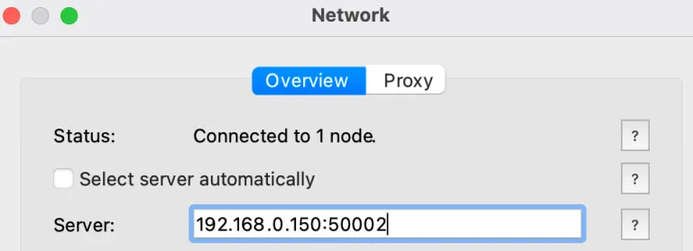

Đóng cửa sổ, và bây giờ chúng ta đã kết nối với node của bạn. Để xác nhận, nhấp vào vòng tròn một lần nữa và kiểm tra xem chi tiết máy chủ có thay đổi trở lại thành một node ngẫu nhiên không.

Đôi khi, mặc dù đã làm mọi thứ đúng, dường như nó từ chối kết nối. Dưới đây là một số cách để khắc phục...

- Nâng cấp lên phiên bản mới hơn của Electrum, và phần mềm node của bạn
- Thử xóa thư mục cache trong thư mục ".electrum"
- Thử thay đổi cổng từ 50002 sang 50001 trong cài đặt mạng lưới
- Sử dụng hướng dẫn này để kết nối sử dụng Tor như một phương án thay thế (https://armantheparman.com/tor/)
- Cài đặt lại Electrum Server trên node

## Tìm địa chỉ IP node của bạn

Địa chỉ IP không phải là thứ mà người dùng thông thường thường biết cách tra cứu và sử dụng. Tôi đã giúp nhiều người chạy một node, sau đó kết nối ví của họ với node - một trở ngại thường gặp dường như là tìm địa chỉ IP của nó.

Đối với MyNode, bạn có thể gõ trong cửa sổ trình duyệt: `mynode.local`

Đôi khi, "mynode.local" không hoạt động (hãy chắc chắn là bạn không gõ nó trong thanh tìm kiếm Google). Để buộc thanh điều hướng nhận ra văn bản của bạn là một địa chỉ chứ không phải là một tìm kiếm, hãy thêm `http://` như thế này: `http://mynode.local`. Nếu điều đó không hoạt động, thử nó với một "s", như thế này: `https://mynode.local`.

Cách này sẽ truy cập vào thiết bị, và bạn có thể nhấp vào liên kết cài đặt (xem "vòng tròn" màu xanh của tôi dưới đây) để hiển thị màn hình này nơi địa chỉ IP được đặt:

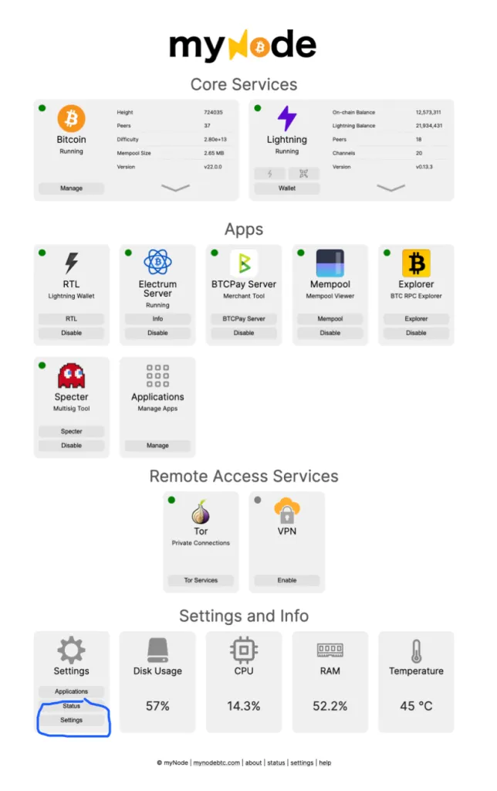

Trang này sẽ tải và bạn sẽ thấy địa chỉ IP của node (vòng tròn màu xanh)

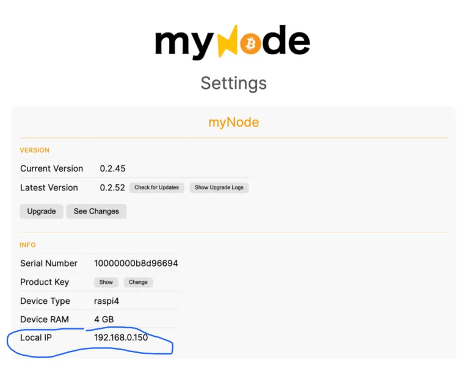

Sau đó, trong tương lai, bạn có thể gõ 192.168.0.150, hoặc http://192.168.0.150 vào trình duyệt của mình.

Đối với Raspiblitz (khi không kết nối với một màn hình), bạn cần một phương pháp khác (cũng hoạt động cho MyNode):

Đăng nhập vào trang web của router - tại đây chúng ta sẽ tìm thấy địa chỉ IP của tất cả các thiết bị đã kết nối của bạn. Trang web của router sẽ là một địa chỉ IP mà bạn nhập vào trình duyệt web. Địa chỉ của tôi là:

    http://192.168.0.1

Để lấy thông tin đăng nhập vào router, bạn có thể tìm nó trong sách hướng dẫn sử dụng hoặc đôi khi ngay trên một nhãn dán trên chính router đó. Tìm kiếm tên người dùng và mật khẩu. Nếu bạn không tìm thấy, thử Tên người dùng: "admin" và Mật khẩu: "password"

Nếu bạn có thể đăng nhập, bạn sẽ thấy các thiết bị đã kết nối của mình và từ tên của chúng, có thể biết rõ ràng cái nào là node của bạn. Địa chỉ IP sẽ ở đó.
### Nếu hai phương pháp đầu tiên không thành công, phương pháp cuối cùng sẽ hoạt động nhưng nó khá mất thời gian:
Đầu tiên, tìm địa chỉ IP của bất kỳ thiết bị nào trên mạng internet của bạn (máy tính hiện tại sẽ làm được).

Trên Mac, bạn sẽ tìm thấy nó trong Network Preferences:

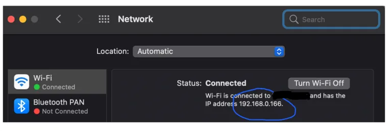

Chúng ta quan tâm đến 4 phần tử đầu tiên (192.168.0), không phải phần tử thứ 4, “166” mà bạn thấy trong hình (tất nhiên của bạn sẽ khác).

Đối với Linux, sử dụng dòng lệnh:

```bash
ifconfig | grep inet
```

Dấu gạch dọc là biểu tượng “pipe” và bạn sẽ tìm thấy nó dưới phím <delete>. Bạn sẽ thấy một số kết quả và một địa chỉ IP. (Bỏ qua 127.0.0.1 vì nó không phải, và bỏ qua netmask)

Đối với Windows, mở cửa sổ lệnh (cmd) và gõ:

```bash
ipconfig/all
```

và nhấn Enter. Địa chỉ IP có thể được tìm thấy trong kết quả.

Đó là phần dễ. Phần khó giờ là tìm địa chỉ IP của của bạn – chúng ta cần phải đoán mò. Giả sử ví dụ địa chỉ IP máy tính của bạn bắt đầu với 192.168.0.xxx, sau đó cho node của bạn, trong trình duyệt, thử: `https://192.168.0.2`

Số nhỏ nhất có thể là 2 (0 có nghĩa là bất kỳ thiết bị nào, và 1 thuộc về router) và cao nhất, tôi tin là 255 (điều này tương đương với 11111111 trong hệ nhị phân, số lớn nhất được thể hiện bởi 1 byte).

Lần lượt thử cho lên đến 255. Cuối cùng, bạn sẽ dừng lại ở số chính xác mà tải được trang MyNode của bạn (hoặc trang RaspiBlitz). Sau đó bạn sẽ biết số nào để nhập vào cài đặt mạng Electrum để kết nối với node của bạn.

Nó sẽ trông giống như thế này (đảm bảo bạn bao gồm dấu hai chấm và số sau đó - ở đây là `:50002`):


> Điều hữu ích cần biết là những địa chỉ IP này là NỘI BỘ trong mạng nhà bạn. Không ai bên ngoài có thể thấy chúng và chúng không nhạy cảm. Chúng giống như các đầu số điện thoại trong một tổ chức lớn dẫn bạn đến các điện thoại nội bộ khác nhau.

## Xóa ví bù nhìn

Bây giờ chúng ta đã thành công kết nối với một và chỉ một node. Đây là cách mặc định mà Electrum sẽ tải thông tin về, kể từ bây giờ. Bạn nên xóa ví bù nhìn (Menu: file –> delete), để tránh trường hợp bạn vô tình gửi tiền vào ví không an toàn này (Nó không an toàn vì chúng ta không tạo nó theo cách an toàn).

## Tạo một ví để thực hành

Sau khi xóa ví bù nhìn , bắt đầu lại và tạo một cái mới, theo cùng một cách, chỉ là lần này, ghi lại các từ hạt giống và giữ chúng ở nơi tương đối an toàn.

Đây là một ý tưởng tốt để học cách Electrum hoạt động với ví thực hành này, mà không cần ví cứng phức tạp (cần cho nhu cầu an ninh cao). Chỉ đặt một lượng nhỏ bitcoin vào ví này – với giả định là bạn sẽ mất số tiền này. Một khi thành thạo đã thành thạo thì học cách sử dụng Electrum với ví cứng.

Trong ví mới bạn đã tạo, bạn sẽ thấy một danh sách các địa chỉ. Những cái màu xanh được gọi là “Địa chỉ nhận - Receiving Addresses”. Chúng là sản phẩm của 3 thứ:

- Cụm từ hạt giống - seed
- Cụm từ mật khẩu - passphrase
- Đường dẫn phái sinh

Ví mới của bạn có một tập hợp các địa chỉ nhận có thể được tạo một cách toán học và có thể tái tạo bởi bất kỳ phần mềm ví nào có hạt giống, cụm từ mật khẩu và đường dẫn phái sinh. Có khoảng 4,3 tỷ cái địa chỉ có thể được tạo ra! Nhiều hơn con số bạn cần. Electrum chỉ hiển thị 20 cái đầu tiên, và sau đó thêm nữa khi bạn sử dụng hết những cái đầu tiên.
Dưới đây là thông tin chi tiết hơn về khóa riêng tư của ví bitcoin mà có thể được tìm thấy trong hướng dẫn này.
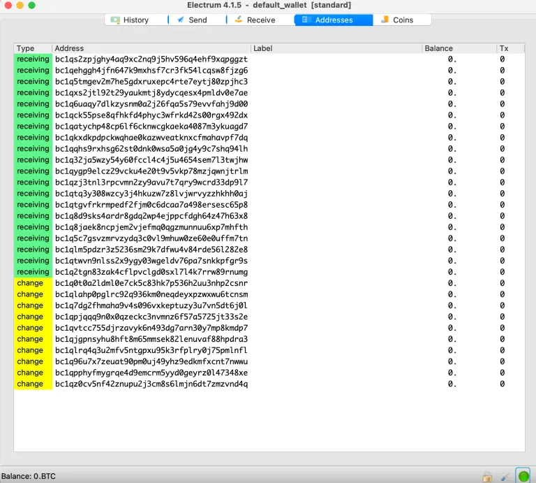

Điều này rất khác biệt so với một số ví khác chỉ hiển thị 1 địa chỉ mỗi lần.

Vì bạn đã nhập cụm từ hạt giống khi tạo ví này, Electrum có khóa riêng tư cho từng địa chỉ, và việc chi tiêu từ những địa chỉ này là khả thi.

Cũng lưu ý rằng có những địa chỉ màu vàng, được gọi là “địa chỉ tiền thối” – Đây chỉ là một tập hợp khác của các địa chỉ từ một nhánh toán học khác (còn tồn tại thêm 4,3 tỷ địa chỉ như vậy). Chúng được ví sử dụng để tự động gửi số tiền thừa trở lại vào ví như tiền thối. Ví dụ, nếu bạn lấy 1,5 bitcoin và chi tiêu 0,5 cho một người bán hàng, số dư 1,0 bitcoin cần phải đi đâu đó. Ví của bạn sẽ chi tiêu nó vào địa chỉ tiền thối màu vàng tiếp theo trống không – nếu không, số tiền đó sẽ đi vào tay thợ đào! Để biết thêm thông tin về điều này (UTXO), xem hướng dẫn này. (https://armantheparman.com/utxo/)

Tiếp theo, quay lại trang web khóa riêng tư của Ian Colman và nhập cụm từ hạt giống (thay vì tạo một cái mới). Bạn sẽ thấy thông tin khóa riêng tư và khóa công khai thay đổi phía dưới; mọi thứ phía dưới phụ thuộc vào những gì ở trên trang.

> Nhớ rằng, bạn không nên nhập cụm từ hạt giống vào một máy tính cho ví Bitcoin thực của bạn – mã độc có thể ăn cắp nó. Đừng bao giờ làm như vậy. Chúng ta chỉ sử dụng một ví thực hành, cho mục đích học hỏi, nên bây giờ nó vẫn ổn.

Cuộn xuống và thay đổi đường dẫn phái sinh thành BIP84 (segwit) để phù hợp với ví Electrum của bạn bằng cách nhấp vào tab BIP84.


Phía dưới, bạn sẽ thấy khóa riêng tư mở rộng và khóa công khai mở rộng của ví:

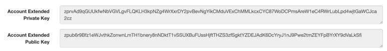

Đi đến Electrum, và so sánh chúng có khớp không. Có một menu ở phía trên, "Wallet –> Information":


Cửa sổ này hiện ra:


Lưu ý rằng hai khóa công khai khớp nhau.

Tiếp theo, so sánh các địa chỉ. Quay lại trang của Ian Coleman và cuộn xuống phía dưới:

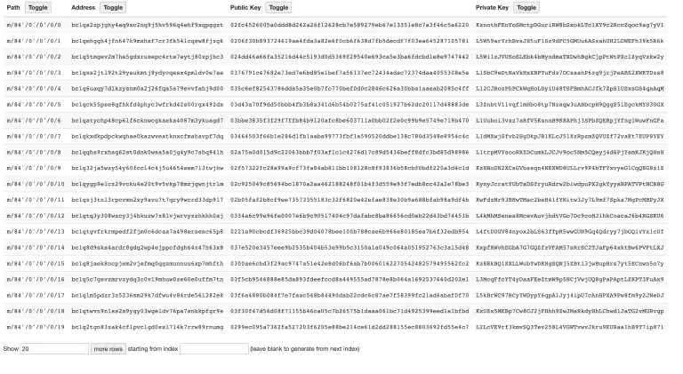

Lưu ý rằng chúng khớp với các địa chỉ trong Electrum.

Bây giờ chúng ta sẽ kiểm tra các địa chỉ tiền thối. Cuộn lên một chút đến đường dẫn phái sinh và thay đổi số 0 cuối cùng thành 1:

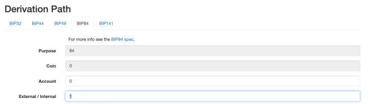

Bây giờ cuộn xuống và so sánh các địa chỉ khớp với các địa chỉ màu vàng trong Electrum.

Tại sao chúng ta làm tất cả những điều này?

Chúng ta đã lấy cụm từ hạt giống và đưa chúng qua hai chương trình phần mềm độc lập khác nhau để đảm bảo rằng chúng đang cung cấp cho chúng ta cùng một thông tin. Điều này giảm đáng kể rủi ro rằng mã độc đang ẩn nấp bên trong và cung cấp cho chúng ta các khóa riêng tư, công khai hoặc địa chỉ giả mạo.

Bước tiếp theo là nhận một lượng nhỏ bitcoin để thử nghiệm và chi tiêu nó trong ví từ một địa chỉ này sang địa chỉ khác.

## Thử ví (Học cách sử dụng nó)

Ở đây tôi sẽ chỉ bạn cách nhận một UTXO vào ví của bạn và sau đó di chuyển nó (chi tiêu nó) sang một địa chỉ khác trong ví. Đây là một lượng rất nhỏ bitcoin mà chúng ta không ngại mất nó.

Điều này có một số mục đích.

- Nó sẽ chứng minh rằng bạn có quyền để chi tiêu tiền trong ví mới.
- Nó hướng dẫn cách sử dụng phần mềm Electrum để thực hiện một giao dịch (và một số tính năng), trước khi chúng ta tăng thêm độ phức tạp bổ sung để bảo mật (sử dụng ví cứng hoặc máy tính không kết nối mạng)
- Nó sẽ củng cố thông tin bạn có nhiều địa chỉ để chọn lựa nhận và chi tiêu, trong cùng một ví.
Mở ví Electrum thử nghiệm của bạn và nhấp vào tab "Địa chỉ - Addresses", sau đó nhấp chuột phải vào địa chỉ đầu tiên và chọn "Copy –> Address":
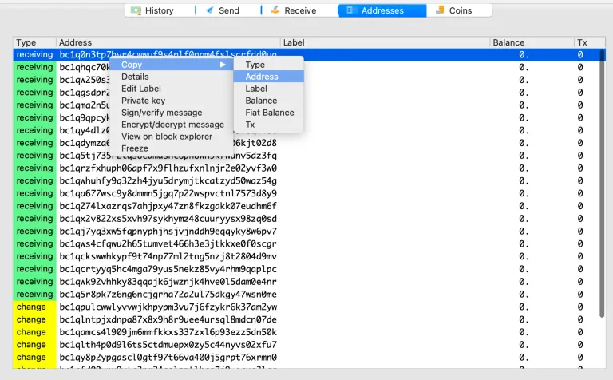

Địa chỉ bây giờ đã được lưu trong bộ nhớ máy tính của bạn.

Bây giờ hãy đến một sàn giao dịch nơi bạn có một số bitcoin, và hãy rút một lượng nhỏ vào địa chỉ này, ví dụ 50.000 satoshi. Tôi sẽ sử dụng Coinbase làm ví dụ vì đây là sàn giao dịch được sử dụng phổ biến nhất, mặc dù họ là kẻ thù của Bitcoin, và tôi cảm thấy ghê tởm khi phải đăng nhập vào một tài khoản bỏ hoang vì mục đích này.

Đăng nhập, và nhấp vào nút "Gửi/Nhận - Send/Receive", nằm ở góc trên bên phải của trang web, tính cho tới ngày hôm nay.


Rõ ràng tôi không có tiền ở Coinbase, nhưng hãy tưởng tượng rằng bạn có bitcoin ở đây và làm theo: Dán địa chỉ từ Electrum vào trường “Đến - To” như tôi đã làm. Bạn cũng cần chọn một số lượng (tôi đề xuất khoảng 50.000 sat hoặc tương tự). Đừng đặt “Tin nhắn tự chọn - Optional message” – Coinbase đang thu thập đủ dữ liệu của bạn (và bán chúng), không cần phải giúp họ. Cuối cùng, nhấp “Tiếp tục - Continue”. Sau đó tôi không biết bạn sẽ gặp cửa sổ nào nữa, bạn tự xử lý, nhưng phương pháp tương tự áp dụng cho tất cả các sàn giao dịch.


Tùy thuộc vào sàn giao dịch, bạn có thể thấy satoshi trong ví của mình ngay lập tức, hoặc có thể có sự chậm trễ vài giờ/ngày.

Lưu ý rằng Electrum sẽ cho bạn biết bạn đã nhận được tiền ngay cả khi chúng chưa được xác nhận trên blockchain. Số tiền bạn có được đọc từ danh sách chờ của một Node Bitcoin, hay còn gọi là “mempool”. Khi nó được đưa vào một khối, bạn sẽ thấy số tiền đó đã được xác nhận.

Bây giờ chúng ta có một UTXO trong ví, chúng ta nên gán nhãn cho nó. Chỉ chúng ta mới thấy nhãn này, nó không liên quan gì đến blockchain công khai cả. Tất cả nhãn Electrum của chúng ta chỉ hiển thị trên máy tính mà chúng ta đang sử dụng. Chúng ta thực sự có thể lưu một tệp và sử dụng nó để khôi phục tất cả nhãn của mình vào một máy tính khác chạy ví tương tự.

### Tạo nhãn cho một UTXO

Tôi cần một khoản quyên góp cho ví thử nghiệm này, cảm ơn @Sathoarder đã cung cấp cho tôi một UTXO trực tiếp (10.000 sat), và một người khác (ẩn danh) đã quyên góp cho cùng một địa chỉ (5.000 sat). Lưu ý rằng có 15.000 sat trong số dư địa chỉ đầu tiên, và tổng cộng 2 giao dịch (cột ngoài cùng bên phải). Phía dưới, số dư là 10.000 sat đã được xác nhận, và 5.000 sat khác chưa được xác nhận (vẫn trong mempool).

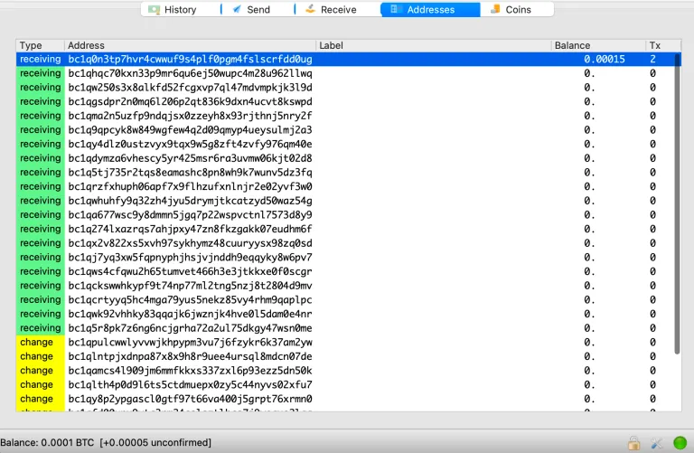

Bây giờ, nếu chúng ta chuyển qua tab Coins, chúng ta có thể thấy hai “mẩu coin vừa nhận được” hoặc hai UTXO. Cả hai đều ở cùng một địa chỉ.


Quay lại tab địa chỉ, nếu bạn nhấp đúp vào khu vực “Nhãn - Label” bên cạnh địa chỉ, bạn sẽ có thể nhập một đoạn text, sau đó nhấn <enter> để lưu:

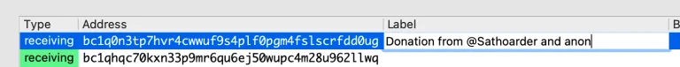

Đây là một thực hành tốt để bạn có thể theo dõi nguồn gốc các mẩu coin của mình, xem chúng không phải là KYC hay không, và mỗi UTXO tốn chi phí vốn là bao nhiêu (trong trường hợp bạn cần bán và tính toán thuế phải nộp cho chính phủ của mình).
Lý tưởng nhất, bạn nên tránh tích lũy nhiều mẩu coin trong cùng một địa chỉ. Nếu bạn quyết định làm điều đó (không nên), bạn có thể gán nhãn cho từng mẩu coin thay vì gán cùng một nhãn cho tất cả bằng cách gán nhãn địa chỉ. Bạn không thể trực tiếp vào tab “coins” và chỉnh sửa nhãn ở đó (không, điều đó quá trực quan rồi!). Bạn phải vào tab "Lịch sử - History", tìm giao dịch, gán nhãn cho nó, và sau đó bạn sẽ thấy nhãn trong phần coin. Bất kỳ nhãn nào bạn thấy trong phần coin đều từ nhãn Địa chỉ HOẶC nhãn Lịch sử, nhưng bất kỳ nhãn Lịch sử nào cũng sẽ ghi đè lên nhãn Địa chỉ. Để sao lưu nhãn của bạn vào một tệp, bạn có thể xuất chúng từ menu ở trên cùng, ví–>nhãn–>xuất (wallet->label->export).

Tiếp theo, hãy chi tiêu các đồng (mẩu) coin từ địa chỉ đầu tiên sang địa chỉ thứ hai. Nhấp chuột phải vào địa chỉ đầu tiên và chọn “Chi tiêu từ - Spend from)” (Thực ra điều này không cần thiết trong tình huống này, nhưng hãy tưởng tượng chúng ta có nhiều đồng (mẩu) coin trong nhiều địa chỉ; sử dụng tính năng này, chúng ta có thể buộc ví chỉ tiêu những đồng coin mà chúng ta muốn. Nếu chúng ta muốn chọn nhiều đồng coin trong nhiều địa chỉ, chúng ta có thể chọn các địa chỉ bằng cách nhấp chuột trái trong khi giữ phím Command, sau đó nhấp chuột phải và chọn “Chi tiêu từ - Spend from”:


Một khi bạn làm điều đó, sẽ có một thanh màu xanh ở phía dưới cửa sổ ví chỉ ra số lượng đồng coin bạn đã chọn và tổng số có thể chi tiêu.

Bạn cũng có thể chi tiêu từng đồng coin riêng lẻ trong một địa chỉ và loại trừ những đồng khác trong cùng một địa chỉ, nhưng điều này không được khuyến khích vì bạn đang làm cho đồng coin còn lại trong một địa chỉ bị yếu đi về mặt mật mã do việc chi tiêu một trong những đồng coin khác của địa chỉ này (một lý do khác không nên để nhiều đồng (mẩu) coin trong một địa chỉ, ngoài lý do về quyền riêng tư, là vì nếu bạn chi tiêu một đồng, bạn nên chi tiêu tất cả, điều này trở nên tốn kém không cần thiết). Đây là cách chọn một đồng coin duy nhất từ một địa chỉ chung, nhưng đừng làm vậy:


Bây giờ, chúng ta đã chọn hai đồng coin để chi tiêu. Tiếp theo, chúng ta quyết định nơi để chi tiêu chúng. Hãy gửi chúng đến địa chỉ thứ hai. Chúng ta cần sao chép địa chỉ như sau:

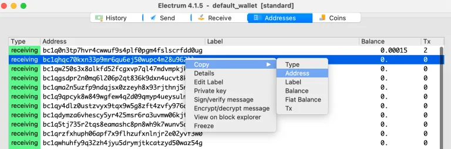

Sau đó vào tab “Gửi - Send”, và dán địa chỉ thứ hai vào trường “Thanh toán cho - Pay to”. Không cần thêm mô tả; bạn có thể làm, nhưng bạn có thể làm điều đó sau bằng cách chỉnh sửa nhãn. Đối với số lượng, chọn “Tối đa - Max” để chi tiêu tất cả các đồng tiền đã chọn. Sau đó nhấp vào “Thanh toán - Pay”, và sau đó nhấp vào nút “Nâng cao - Advanced” trên cửa sổ pop-up vừa xuất hiện.


Luôn nhấp vào “Nâng cao - Advanced” ở giai đoạn này để chúng ta có thể kiểm soát kỹ lưỡng và kiểm tra chính xác những gì có trong giao dịch. Đây là giao dịch:


Chúng ta thấy hai hộp cửa sổ màu trắng bên trong. Cửa sổ trên cùng là cửa sổ đầu vào (những đồng (mẩu) coin đang được chi tiêu), và cửa sổ dưới cùng là cửa sổ đầu ra (nơi đồng coin đi đến).

Lưu ý, trạng thái (góc trên bên trái) hiện tại là “Chưa ký - Unsigned”. “Số tiền gửi - Amount sent” là 0 vì đồng tiền đang được chuyển trong nội bộ ví. Phí là 481 sat. Lưu ý rằng nếu nó là 480 sat, số không cuối cùng sẽ bị bỏ đi, như thế này, 0,0000048 và đối với đôi mắt mệt mỏi, điều này có thể trông giống như 48 sat – hãy cẩn thận (điều mà các nhà phát triển Electrum nên sửa).
Kích thước của giao dịch ám chỉ đến kích thước dữ liệu tính bằng byte, không phải là số lượng bitcoin. Tính năng "Replace by fee - RBF - Thay thế bằng phí" được bật mặc định, cho phép bạn gửi lại giao dịch với mức phí cao hơn nếu cần. LockTime cho phép bạn điều chỉnh thời gian giao dịch có hiệu lực - Tôi chưa thử nghiệm với tính năng này, nhưng khuyên bạn không sử dụng nó trừ khi bạn hoàn toàn hiểu bạn đang làm gì và đã có kinh nghiệm thực hành với số lượng nhỏ.

Ở phía dưới, chúng ta có một số công cụ điều chỉnh phí đào (phí mạng lưới) phức tạp. Tất cả những gì bạn cần làm cho các giao dịch nội bộ là thiết lập mức phí tối thiểu là 1 sat/byte. Chỉ cần nhập số vào trường "Phí mục tiêu - Target fee". Để kiểm tra mức phí phù hợp cho một khoản thanh toán ra bên ngoài, bạn có thể tham khảo https://mempool.space để xem mempool đang bận rộn như thế nào, và một số mức phí đề xuất được hiển thị.

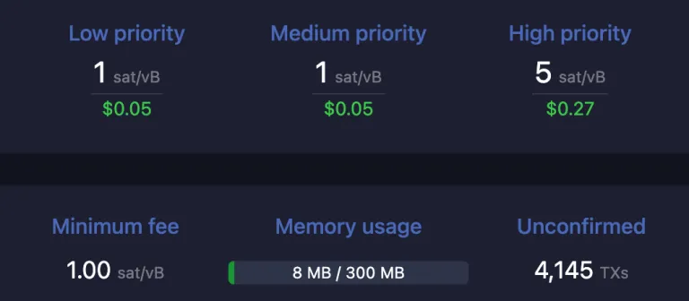

Tôi đã chọn 1 sat/byte.

Trong cửa sổ nhập, chúng ta thấy hai mục nhập. Mục đầu tiên là khoản quyên góp 5.000 sat. Chúng ta thấy ở bên trái là mã băm giao dịch của nó (mà chúng ta có thể tra cứu trên blockchain). Kế bên nó, có một "21" - điều này chỉ ra rằng đó là đầu ra được gắn nhãn 21 trong giao dịch đó (thực tế là đầu ra thứ 22 vì đầu ra đầu tiên được gắn nhãn là 0).

Điều cần lưu ý ở đây: các UTXO chỉ tồn tại bên trong một giao dịch. Để chi tiêu một UTXO, chúng ta phải tham chiếu tới nó, và đặt tham chiếu đó vào đầu vào của một giao dịch mới. Các đầu ra sau đó trở thành các UTXO mới và UTXO cũ trở thành STXO (Spent transaction output).

Dòng thứ hai là khoản quyên góp 10.000 sat. Nó có một "0" kế bên mã băm giao dịch mà nó đến từ đó vì đó là đầu ra đầu tiên (và có thể là duy nhất) cho giao dịch đó.

Ở cửa sổ dưới cùng, chúng ta thấy địa chỉ của mình. Lưu ý tổng số bitcoin của các đầu vào không hoàn toàn khớp với tổng số của các đầu ra. Sự chênh lệch được chuyển cho thợ đào, đó là phí thợ đào, hay phí mạng lưới. Thợ đào xem xét sự chênh lệch trong tất cả các giao dịch trong khối mà nó đang cố gắng đào, và thêm số đó vào phần thưởng của mình. (Phí thợ đào theo cách này hoàn toàn tách biệt khỏi chuỗi giao dịch và bắt đầu một cuộc sống mới).

Nếu chúng ta điều chỉnh phí thợ đào, giá trị đầu ra sẽ tự động thay đổi.

> Điều đáng chú ý ở đây: Chú ý đến màu sắc của các địa chỉ trong cửa sổ giao dịch. Nhớ rằng các địa chỉ màu xanh lá cây được liệt kê trong tab địa chỉ của bạn. Nếu một địa chỉ được làm nổi bật bằng màu xanh lá cây (hoặc vàng) trong cửa sổ giao dịch, thì Electrum đã nhận ra địa chỉ đó là một trong những địa chỉ của mình. Nếu địa chỉ không được làm nổi bật, thì đó là một địa chỉ bên ngoài (ngoài ví đang mở), và bạn nên kiểm tra cẩn thận.

Một khi bạn kiểm tra mọi thứ trong giao dịch và chắc chắn bạn hài lòng với việc bạn đang chi tiêu những đồng coin nào, và những đồng coin đó đang đi đâu, bạn có thể nhấp vào “Hoàn thành - Finalise.”

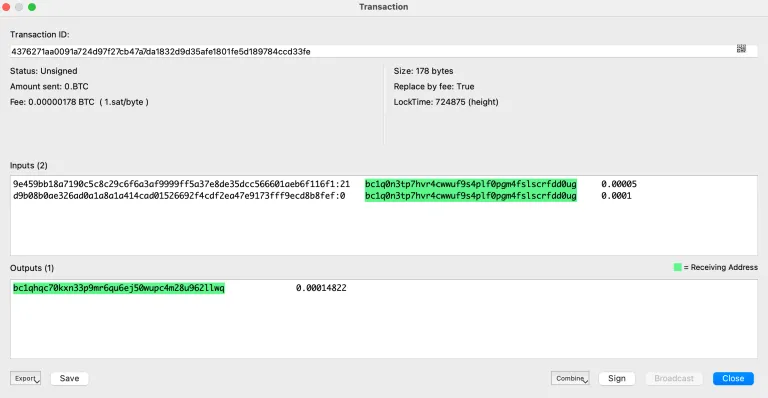

Sau khi bạn nhấp vào “Finalise”, bạn không thể chỉnh sửa nữa – Nếu bạn cần, bạn phải đóng cửa sổ này và bắt đầu lại. Lưu ý rằng nút “Finalise” đã thay đổi thành “Export”, và các nút mới xuất hiện: “Save”, “Combine”, “Sign” và “Broadcast”. Nút “Broadcast” bị mờ vì giao dịch chưa được ký và do đó không hợp lệ ở giai đoạn này.

Một khi bạn nhấp vào "Ký - Sign", nếu bạn có mật khẩu cho ví, bạn sẽ được nhắc nhập mật khẩu đó, và sau đó trạng thái (phía trên bên phải) sẽ thay đổi từ “Chưa ký - Unsigned” thành “Đã ký - Signed”. Sau đó nút “Phát sóng - Broadcast” sẽ có thể sử dụng được để phát sóng giao dịch.
Sau khi bạn phát sóng, bạn có thể đóng cửa sổ giao dịch. Nếu bạn chuyển đến tab địa chỉ, bạn sẽ thấy địa chỉ đầu tiên trống, và địa chỉ thứ hai có 1 UTXO.
Lưu ý: Bạn sẽ thấy tất cả những thay đổi này ngay cả trước khi giao dịch được đào vào một khối, hay "Xác nhận - Confirmed". Điều này là bởi vì Electrum cập nhật số dư/giao dịch dựa trên không chỉ dữ liệu blockchain, mà còn dựa trên dữ liệu mempool nữa. Không phải tất cả các ứng dụng ví đều làm điều này.

Một điều cần chỉ ra là thay vì phát sóng, chúng ta có thể lưu giao dịch để sử dụng sau. Nó có thể được lưu ở trạng thái chưa ký hoặc đã ký.

Nhấn nút "Export" (một cách nghịch lý, KHÔNG nhấn vào nút "Save"), và bạn sẽ thấy một số lựa chọn. Giao dịch được mã hóa bằng một đoạn text, và do đó có thể được lưu theo một số cách.


Lưu thành mã QR rất thú vị. Nếu bạn chọn điều này, một mã QR sẽ xuất hiện:


Bạn có thể chụp ảnh mã QR đó. Có một số việc bạn có thể làm với nó, nhưng bây giờ, hãy ví dụ rằng bạn đang tải nó trở lại vào ví sau đó. Bạn có thể đóng Electrum, mở lại ví, và đi đến menu Công cụ, vào Load transaction -> From QR code:

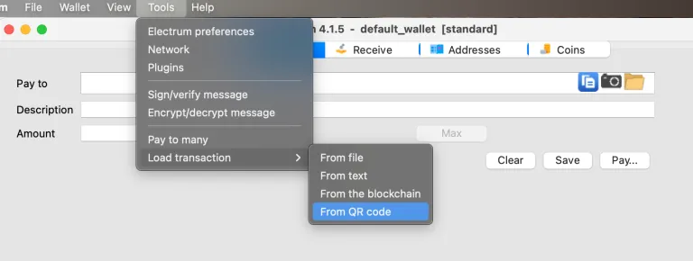

Điều này sẽ kích hoạt camera của máy tính bạn. Sau đó bạn chỉ camera vào ảnh mã QR trong điện thoại của bạn, và điều này sẽ tải lại giao dịch, y hệt như bạn lúc bạn xuất ra (export).

Việc tải một giao dịch đã lưu không phải là điều trực quan, vì vậy hãy chú ý đặc biệt. Tải một giao dịch không phải là một "công cụ" nhưng lựa chọn này được ẩn trong menu công cụ (một điều mà các nhà phát triển Electrum nên sửa).

Một quy trình tương tự có thể thực hiện với một giao dịch được lưu dưới dạng một tệp. Hãy thử thực hành với bất kỳ phương pháp nào, trong cùng một ví. Tôi sẽ không đi qua nó ở đây nhưng bạn có thể sử dụng tính năng này để chuyển một giao dịch qua lại giữa cùng một ví trên các máy tính khác nhau, giữa các ví đa chữ ký, và từ và đến các ví phần cứng. Dưới đây là một số hướng dẫn.

Bây giờ, quay lại với nút "Lưu - Save" – đây không phải là cách để lưu đoạn text của giao dịch. Điều xảy ra thực sự là báo cho ví Electrum biết rằng giao dịch này trên máy tính cục bộ được gửi như một khoản thanh toán. Nếu bạn làm điều đó một cách vô tình, bạn sẽ thấy giao dịch với một biểu tượng máy tính nhỏ. Bạn có thể nhấp chuột phải và xóa giao dịch – đừng lo, bạn không thể xóa bitcoin theo cách này. Sau đó, Electrum sẽ quên rằng giao dịch này từng xảy ra, và sẽ "hoàn lại" các đồng coin và hiển thị các satoshi ở vị trí chính xác nơi chúng thực sự tồn tại.

### Địa chỉ nhận tiền thối

Địa chỉ nhận tiền thối rất thú vị. Bạn cần hiểu về UTXO để hiểu giải thích này. Nếu bạn chi tiêu cho một địa chỉ một số tiền nhỏ hơn một UTXO đầu vào, thì số bitcoin còn lại sẽ đi vào tay thợ đào trừ khi một đầu ra tiền thối được chỉ định.

Bạn có thể có một UTXO 6,15 bitcoin và muốn dùng 0,15 bitcoin để quyên góp cho một số người biểu tình đang bị áp bức bởi chính phủ “dân chủ” độc tài nào đó trên thế giới. Bạn sẽ lấy 6,15 bitcoin (sử dụng chức năng "Chi tiêu từ - Spend from" trong Electrum), và đặt nó vào một giao dịch.

Bạn sẽ dán địa chỉ của người biểu tình vào trường "Pay to - Thanh toán cho", có thể bạn sẽ đặt "EndTheFed & WEF" vào trường "Mô tả - description", và cho số lượng, bạn sẽ đặt 0,15 bitcoin và nhấn "Thanh toán - Pay", sau đó "Nâng cao - Advanced".
Trong màn hình giao dịch, tại cửa sổ nhập, bạn sẽ thấy UTXO 6,15 bitcoin. Đối với cửa sổ xuất, bạn sẽ thấy một địa chỉ không được làm nổi bật (đây là địa chỉ của người biểu tình) với 0,15 bitcoin bên cạnh. Bạn cũng sẽ thấy một địa chỉ màu vàng với số lượng bitcoin nhỏ hơn một chút so với 6,0 bitcoin. Đây là địa chỉ nhận tiền thối được ví tự động chọn từ một trong số các địa chỉ nhận tiền thối màu vàng của chính nó. Mục đích của địa chỉ nhận tiền thối là để ví có thể đặt tiền thối vào đó mà không làm ảnh hưởng đến khả năng sử dụng của các địa chỉ nhận tiền mà bạn có thể có kế hoạch sử dụng, hoặc đã gửi hóa đơn cho. Nếu chúng được sử dụng sau này bởi khách hàng, ví dụ, bạn không muốn ví của mình tự động sử dụng chúng và làm đầy chúng. Điều này lộn xộn và không tốt cho quyền riêng tư.
Lưu ý rằng khi bạn điều chỉnh phí thợ đào, số lượng tiền thối xuất sẽ tự động điều chỉnh, không phải số lượng thanh toán.

### Tiền thối thủ công hoặc thanh toán cho nhiều người

Đây là một tính năng thực sự thú vị của Electrum. Bạn truy cập nó như thế này.


Sau đó, bạn có thể nhập nhiều điểm đến cho số dư UTXO mà bạn đang chi tiêu, như thế này:

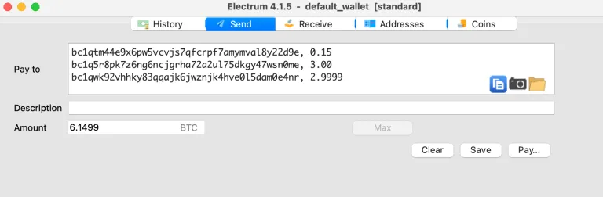

Dán địa chỉ, gõ vào một dấu phẩy, sau đó là một khoảng trắng, sau đó là số lượng, sau đó <enter>, sau đó làm lại. KHÔNG NHẬP SỐ LƯỢNG TRONG CỬA SỔ “Số lượng - Amount” – Electrum sẽ điền tổng số ở đây khi bạn gõ các số lượng lẻ vào cửa sổ “Thanh toán cho - Pay to”.

Điều này cho phép bạn tự xác định nơi tiền thối sẽ đi (ví dụ một địa chỉ cụ thể trong ví của bạn, hoặc một ví khác), hoặc bạn có thể thanh toán cho nhiều người cùng một lúc. Nếu tổng số của bạn không đủ cao để tương ứng với kích thước của UTXO, Electrum vẫn sẽ tạo một đầu ra tiền thối bổ sung cho bạn.

Tính năng "Thanh toán cho nhiều người - Pay to many" cũng cho phép bạn tạo ra giao dịch “Trộn thanh toán - PayJoins” hoặc “Trộn coin - CoinJoins” của riêng mình – nằm ngoài phạm vi của bài viết này, nhưng tôi đã có hướng dẫn ở đây. (https://armantheparman.com/cj/)

## Ví

Tôi muốn giới thiệu một Ví chỉ xem (watch-only wallet) sử dụng Electrum. Để làm điều đó, tôi cần định nghĩa trước “Ví - Wallet”. Có hai cách “ví” được sử dụng trong Bitcoin:

- Loại A, “ví” – chỉ phần mềm hiển thị địa chỉ và số dư của bạn, ví dụ Electrum, Blue Wallet, Sparrow Wallet, v.v.

- Loại B, “ví” – chỉ bộ sưu tập địa chỉ độc nhất được liên kết với sự kết hợp của seed_phrase/passphrase/derivation_path (cụm từ hạt giống / cụm từ mật khẩu / đường dẫn phái sinh) của chúng ta. Có 8.6 tỷ địa chỉ trong bất kỳ ví nào (4,3 tỷ địa chỉ nhận và 4,3 tỷ địa chỉ nhận tiền thối). Nếu bạn thay đổi bất cứ thứ gì trong cụm từ hạt giống, cụm từ mật khẩu hoặc đường dẫn phái sinh bạn sẽ nhận được một ví chưa sử dụng với 8,6 tỷ địa chỉ trống mới, và tất cả đều độc nhất.

Loại ví nào được người ta đề cập khi sử dụng từ “ví” là tuỳ thuộc vào trong từng ngữ cảnh.

## Ví chỉ xem – một bài tập

Không hoàn toàn rõ ràng ví chỉ xem dùng để làm gì, nhưng tôi sẽ bắt đầu bằng cách giải thích nó là gì, cách tạo một ví thực hành, và sau đó chúng ta sẽ quay lại mục đích của nó sau khi tôi giải thích thêm về ví cứng. (Đối với một bài đánh giá chi tiết về cách sử dụng ví cứng, và các thương hiệu cụ thể, xem ở đây.)
Chúng ta sẽ tạo một ví bù nhìn thông thường (lần này thêm một chút phức tạp với cụm từ mật khẩu), và sau đó là ví theo dõi tương ứng. Nếu muốn, bạn có thể sao chép chính xác ví mà tôi đã tạo, hoặc tạo ví của riêng bạn - ví này sẽ được loại bỏ; đừng thực sự sử dụng nó. Bắt đầu bằng cách tạo một chuỗi 12 từ khóa sử dụng trang web của Ian Coleman.
Chú ý đến 12 từ ngẫu nhiên trong ảnh chụp màn hình dưới đây, và tôi đã nhập một cụm từ mật khẩu vào trường passphrase:

CỤM TỪ MẬT KHẨU - PSSSPHRASE: “Craig Wright is a liar and a fraud and belongs in jail. Also, Ross Ulbricht should be released from prison immediately.”

Mật khẩu cụ thể có thể dài tới 100 ký tự, và lý tưởng nên rõ ràng và không quá ngắn - Cụm từ mật khẩu cụ thể tôi đã sử dụng chỉ là cho vui - Tôi thường khuyên tránh sử dụng chữ cái in hoa và ký hiệu chỉ để giảm bớt căng thẳng khi thử các kết hợp nếu bạn từng gặp vấn đề với việc nhớ passphrase của mình.


Tiếp theo, trong Electrum, đi tới menu file–>new/restore. Đặt một tên duy nhất để tạo ví mới và nhấn “next”.


Bây giờ, các bước tiếp theo bạn đã quen thuộc, vì vậy tôi sẽ liệt kê chúng mà không cần hình ảnh:

- Ví tiêu chuẩn
- Tôi đã có cụm từ hạt giống
- Sao chép và dán 12 từ vào ô, hoặc nhập chúng thủ công.
- Nhấn vào các tùy chọn và chọn BIP39, và cũng nhấn vào chọn mục cụm từ mật khẩu (“mở rộng hạt giống này với cụm từ tùy chỉnh”)
- Nhập cụm từ mật khẩu của bạn chính xác như bạn đã làm trên trang của Ian Coleman
- Để nguyên script mặt định và đường dẫn xuất phát mặc định
- Không cần thêm mật khẩu (khóa ví)

Bây giờ quay lại trang của Ian Coleman, xuống phần “đường dẫn phái sinh - derivation path”, và nhấn vào tab “BIP 84” để chọn script giống như mặc định trong Electrum (Native Segwit).


Khóa riêng tư và khóa công khai mở rộng ngay bên dưới, và chúng thay đổi khi bạn thực hiện thay đổi đến đường dẫn phái sinh (hoặc bất cứ thứ gì khác ở phần trên của trang).

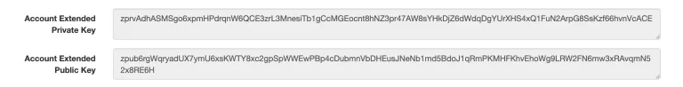

Bạn cũng sẽ thấy “khóa riêngtư / khóa công khai mở rộng BIP32” - những khóa này sẽ được bỏ qua lúc này.

Khóa riêng tử mở rộng của tài khoản có thể được sử dụng để tái tạo hoàn toàn ví của bạn. Tuy nhiên, khóa công khai mở rộng của tài khoản chỉ có thể tạo ra một phiên bản giới hạn của cùng một ví (ví chỉ xem) - Nếu bạn đặt khóa này vào Electrum, nó vẫn sẽ tạo ra tất cả 8,6 tỷ địa chỉ mà hạt giống hoặc khóa riêng tư mở rộng có thể có, nhưng sẽ không có khóa riêng tư nào có sẵn cho Electrum, vì vậy không thể thực hiện giao dịch tiêu tiền. Hãy làm điều này ngay bây giờ để minh họa điểm này:

Sao chép “Khóa công khai mở rộng của tài khoản - Account extended public key” vào bộ nhớ tạm.

Sau đó đi tới Electrum, để ví hiện tại chúng ta đã tạo ở trạng thái mở, và đi tới file–>new/restore. Quy trình tạo ví hơi khác so với trước:

- Ví tiêu chuẩn
- Sử dụng một khóa chính
- Dán khóa công khai mở rộng vào ô và tiếp tục
- Không cần nhập cụm từ mật khẩu - passphrase; nó đã là một phần của khóa công khai mở rộng
- Không cần nhập script và đường dẫn phái sinh
- Không cần thêm mật khẩu (khóa ví)

Khi ví được tải, bạn sẽ nhận thấy rằng chính xác cùng một địa chỉ được tải như trước khi hạt giống được nhập. Bạn cũng sẽ chú ý ở phía trên cùng trong thanh tiêu đề, nó nói “ví theo dõi - watching wallet”. Ví này có thể cho bạn xem địa chỉ và số dư của bạn (bằng cách kiểm tra số dư qua một node), nhưng bạn không thể KÝ giao dịch (vì ví theo dõi không có khóa riêng tư).
Vậy thì mục đích của nó là gì?
Một lý do, không phải là lý do chính, là bạn có thể quan sát ví và số dư của mình mà không cần phơi nhiễm khóa riêng tư của mình cho bất kỳ phần mềm độc hại nào trên máy tính.

Một lý do khác là nó là ĐIỀU KIỆN BẮT BUỘC để thực hiện thanh toán nếu bạn chọn giữ khóa riêng tư của mình ngoài máy tính. Tôi sẽ giải thích:

> Ví cứng (Hardware Wallet - HWW) được tạo ra để một thiết bị có thể giữ khóa riêng tư của bạn một cách an toàn (được khóa bằng mã PIN), không bao giờ tiết lộ khóa cho máy tính (ngay cả khi được kết nối với máy tính qua dây cáp), và chính nó không thể kết nối với internet. Một thiết bị như vậy không thể thực hiện giao dịch một mình vì tất cả giao dịch bitcoin bắt đầu bằng cách tham chiếu đến một hoặc nhiều UTXO trên blockchain (nằm trên một node). Ví phải chỉ định ID của giao dịch nào chứa UTXO, và đầu ra nào của giao dịch là cái sẽ được chi tiêu. Chỉ sau khi chỉ định đầu vào, một giao dịch mới có thể được tạo ra trước tiên, chứ đừng nói đến việc được ký. Ví cứng không thể tạo giao dịch vì chúng không có quyền truy cập vào bất kỳ UTXO nào - chúng không được kết nối với bất cứ thứ gì! Một khóa công khai mở rộng thường được trích xuất từ HWW, và địa chỉ sau đó được hiển thị trên máy tính - nhiều người sẽ quen thuộc với phần mềm Ledger hoặc Trezor Suite hiển thị địa chỉ và số dư trên máy tính của họ - đây là một ví quan sát (watching wallet). Những chương trình này có thể tạo giao dịch, nhưng không thể ký. Chúng chỉ có thể có giao dịch được ký bởi HWW được kết nối với chúng. HWW nhận giao dịch mới được tạo từ ví quan sát, ký nó, và sau đó gửi lại cho máy tính để phát sóng đến một node. HWW không thể phát sóng giao dịch một mình, ví quan sát liên kết của nó sẽ làm điều đó. Theo cách này, hai ví (ví khóa công khai trên máy tính, và ví khóa riêng tư trong HWW) hợp tác để tạo ra, ký và phát sóng giao dịch, trong khi đảm bảo khóa riêng tư được cô lập và tránh xa thiết bị có kết nối internet.

## Các giao dịch Bitcoin được ký một phần (Partially Signed Bitcoin Transactions - PSBT)

Có thể tạo một giao dịch và lưu vào tệp, sau đó tải lại, ký, lưu, tải lại và cuối cùng phát sóng - Tôi không nói rằng ai cũng cần làm điều này; đó chỉ là một điều khả thi để làm.

Bây giờ xem xét một ví đa chữ ký 3 trên 5 - 5 khóa riêng tư tạo ra một ví, và cần có 3 khóa để ký đầy đủ cho một giao dịch từ ví này (Xem tại đây để tìm hiểu thêm về khóa ví đa chữ ký). Có thể có 5 máy tính khác nhau mỗi máy với một trong năm khóa riêng tư.

Máy tính thứ nhất có thể tạo một giao dịch và ký nó. Sau đó, nó có thể lưu vào tệp và gửi qua email cho Máy tính 2. Máy tính 2 sau đó có thể ký, và có thể lưu tệp vào một mã QR, và truyền mã QR qua cuộc gọi Zoom cho Máy tính 3 ở phía bên kia của thế giới. Máy tính 3 có thể chụp mã QR, tải giao dịch vào electrum, và ký giao dịch. Sau 2 chữ ký đầu tiên, giao dịch là một PSBT (giao dịch Bitcoin được ký một phần). Sau chữ ký thứ 3, giao dịch trở nên được ký đầy đủ và hợp lệ, sẵn sàng để phát sóng.

Để tìm hiểu thêm về PSBTS, xem hướng dẫn này. (https://armantheparman.com/psbt/)

## Sử dụng ví cứng với Electrum

Tôi có một hướng dẫn về việc sử dụng ví cứng nói chung, mà tôi nghĩ sẽ quan trọng cho những người mới làm quen với HWW. (https://armantheparman.com/using-hwws/)
Cũng có các hướng dẫn về việc kết nối các loại ví cứng HWW với Sparrow Bitcoin Wallet tại đây. (https://armantheparman.com/hwws/)
Đây sẽ là hướng dẫn đầu tiên của tôi về cách sử dụng ví cứng với Electrum - Tôi sẽ sử dụng ví cứng ColdCard để minh họa. Điều này không nhằm mục đích tạo ra một hướng dẫn chi tiết về ColdCard, hướng dẫn đó ở đây. Tôi chỉ trình bày các điểm cụ thể liên quan tới Electrum. (https://armantheparman.com/cc/)

### Kết nối qua thẻ micro SD (không kết nối mạng)

Trước khi kết nối ví thực của bạn qua ColdCard, tôi hy vọng bạn đã thực hiện các bước trước đó như tải ví Electrum bù nhìn và thiết lập các tham số mạng.

Sau đó, trên ColdCard, hãy chèn thẻ SD. Tôi giả định bạn đã tạo cụm từ hạt giống của mình. Nếu bạn truy cập ví bằng mật khẩu, hãy áp dụng nó ngay bây giờ. Cuộn xuống và chọn menu Advanced/Tools –>Export Wallet –> Electrum Wallet.

Bạn có thể cuộn xuống và đọc thông điệp. Nó luôn đề nghị bạn chọn “1” để nhập một số tài khoản khác không (một phần của đường dẫn phái sinh), nhưng nếu bạn theo lời khuyên của tôi, bạn không đã thay đổi các đường dẫn phái sinh mặc định nên bạn sẽ không muốn một số tài khoản khác không; chỉ cần nhấn dấu kiểm để tiếp tục.

Sau đó chọn script. Hầu hết mọi người sẽ chọn “Native Segwit”.

Nó sẽ thông báo “Electrum wallet file written”, và sẽ hiển thị tên file. Hãy ghi nhớ nó.

Sau đó lấy thẻ micro SD ra và đặt nó vào máy tính có Electrum.

Một số hệ điều hành sẽ tự động mở trình duyệt file khi bạn chèn thẻ microSD. Nhiều người sẽ thấy file ví mới và nhấp đúp vào nó, và tự hỏi tại sao nó không hoạt động. Đó không phải là thiết kế tốt. Bạn thực sự phải bỏ qua trình duyệt file (đóng nó), và mở file ví bằng Electrum:

Mở Electrum. Nếu nó đã mở với ví khác, chọn File –> New. Chúng ta đang tìm cửa sổ này:

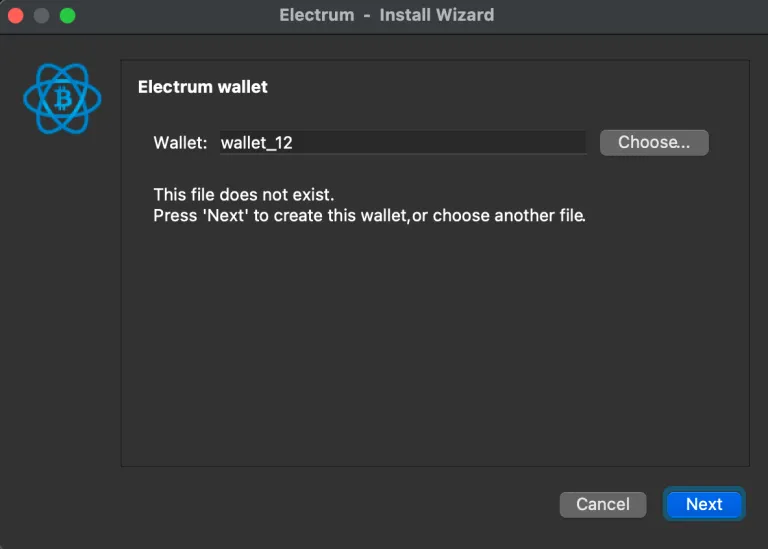

Đây là mẹo, nó không trực quan. Nhấp “Choose”. Sau đó vào hệ thống file trên thẻ microSD và tìm file ví và mở nó.

Bây giờ bạn đã mở ví theo dõi tương ứng của ví cứng. Tốt.

### Kết nối qua cáp USB.

Cách này dễ dàng hơn, nhưng đối với máy tính Linux, nó khó khăn hơn nhiều. Một cái gọi là “Udev rules” cần được cập nhật. Dưới đây là cách thực hiện (hướng dẫn chi tiết https://armantheparman.com/gpg-articles/ ), và một cách ngắn gọn:

Nên đảm bảo hệ thống được cập nhật. Sau đó dùng dòng lệnh:

```bash
sudo apt-get install libusb-1.0-0-dev libudev-dev
```

sau đó...

```bash
python3 -m pip install ckcc-protocol
```

Nếu bạn gặp lỗi hãy đảm bảo pip đã được cài đặt. Bạn có thể kiểm tra với (pip –version), và bạn có thể cài đặt nó với (sudo apt install python3-pip)

Tạo hoặc chỉnh sửa, file, /etc/udev/rules.d/

Như thế này:

```bash
sudo nano /etc/udev/rules.d
```

Một trình soạn thảo văn bản sẽ mở ra. Sao chép văn bản từ đây và dán nó vào file rules.d, lưu và thoát.

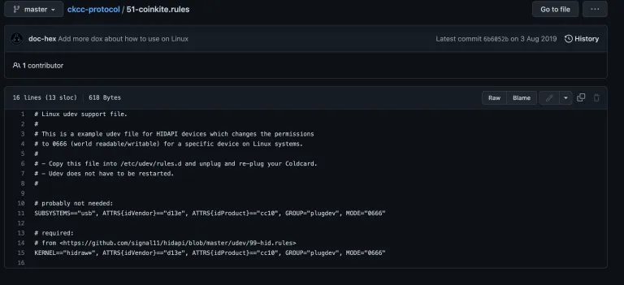

Sau đó chạy các lệnh này lần lượt:

```bash
sudo groupadd plugdev
sudo usermod -aG plugdev $(whoami)
sudo udevadm control –reload-rules && sudo udevadm trigger
```
Nếu bạn nhận được thông báo “nhóm plugdev” đã tồn tại, không sao cả, tiếp tục thực hiện. Sau lệnh thứ hai, bạn sẽ không nhận được phản hồi/trả lời, chỉ cần tiếp tục sang lệnh thứ ba.
Bạn có thể cần phải ngắt kết nối và sau đó kết nối lại ColdCard với máy tính.

Nếu sau tất cả những điều này bạn vẫn không thể kết nối ColdCard, tôi sẽ thử cập nhật firmware (hướng dẫn sẽ sớm có, nhưng hiện tại, bạn có thể tìm hướng dẫn trên trang web của nhà sản xuất ColdCard).

Tiếp theo, tạo một ví mới:

- Ví tiêu chuẩn
- Sử dụng một thiết bị phần cứng
- Nó sẽ quét và phát hiện ColdCard của bạn. Tiếp tục.
- Chọn ngữ script và đường dẫn phái sinh
- Quyết định xem tệp ví có nên được mã hóa hay không (khuyến nghị nên)

### Giao dịch sử dụng ColdCard

Với cáp kết nối, việc giao dịch rất dễ dàng. Việc ký giao dịch sẽ diễn ra mượt mà.

Nếu sử dụng thiết bị theo cách không kết nối mạng, bạn phải chuyển thủ công giao dịch đã lưu giữa các thiết bị sử dụng thẻ microSD. Có một số mẹo.

Sau khi tạo một giao dịch và hoàn tất nó, bạn cần nhấp vào nút xuất (export) ở góc dưới bên trái. Bạn sẽ thấy “Lưu vào tệp - Save to file” mà trái với bản năng, không phải là điều chúng ta muốn. Thực sự bạn phải trước tiên đi đến tùy chọn menu cuối cùng nói “Cho ví cứng - For hardware wallets”, và sau đó, từ trong lựa chọn đó, tìm “Lưu vào tệp - Save to file” khác và chọn nó. Sau đó lưu tệp này vào thẻ microSD, lấy thẻ ra và gắn vào ColdCard. Nhớ rằng bạn có thể cần áp dụng một cụm mật khẩu (passphrase) để chọn đúng ví. Màn hình sẽ hiển thị sẵn sàng để ký. Nhấp vào dấu kiểm, kiểm tra giao dịch, và tiếp tục xác nhận bằng dấu kiểm. Khi xong, lấy thẻ ra và đặt lại vào máy tính.

Sau đó chúng ta cần mở giao dịch sử dụng Electrum. Chức năng này được ẩn trong menu "Công cụ - Tools –> Tải giao dịch - Load transaction. Xem hệ thống tệp và tìm tệp. Sẽ có ba tệp mỗi lần bạn ký. Tệp đã lưu gốc mà Ví chỉ xem tạo ra, và hai tệp do ColdCard tạo ra (tôi không biết tại sao nó làm như vậy). Một sẽ nói “Đã ký - Signed” và một sẽ nói “Hoàn thành - Final”. Điều này không trực quan nhưng tệp “Đã ký” không hữu ích, chúng ta cần mở giao dịch “Hoàn thành”.

Khi bạn tải nó lên xong, bạn có thể nhấp vào “Phát sóng - Broadcast” và thanh toán sẽ được thực hiện.

## Cập nhật Electrum và thư mục ẩn “.electrum”

Electrum tồn tại trên máy tính của bạn ở hai nơi. Có ứng dụng thực sự, và có một thư mục được cấu hình ẩn. Thư mục này nằm ở những nơi khác nhau tùy thuộc vào hệ điều hành của bạn:

Windows:

> C:/Users/ten_nguoi_dung_cua_ban/AppData/Roaming/Electrum

Mac:

> /Users/ten_nguoi_dung_cua_ban/.electrum

Linux:

> /home/ten_nguoi_dung_cua_ban/.electrum

Lưu ý rằng “.” trước “electrum” trong Linux và Mac – điều này chỉ ra rằng thư mục được ẩn. Cũng lưu ý rằng thư mục này chỉ được tạo (tự động) một khi bạn chạy Electrum lần đầu tiên. Thư mục này chứa tệp cấu hình Electrum và cũng chứa thư mục chứa bất kỳ ví nào bạn đã lưu.

Nếu bạn xóa chương trình Electrum khỏi máy tính của mình, thư mục ẩn sẽ vẫn còn lại, trừ khi bạn chủ động xóa nó lần nữa.
Để nâng cấp Electrum, bạn thực hiện cùng một quy trình như tôi đã mô tả ở đầu để tải xuống và xác minh tính xác thực. Sau đó, bạn sẽ có hai bản của chương trình trên máy tính của mình, và bạn có thể chạy bất kỳ bản nào – mỗi chương trình sẽ truy cập vào cùng một thư mục Electrum ẩn cho cấu hình và truy cập ví của mình. Tất cả những gì chúng ta đã lưu, như đơn vị cơ bản, node mặc định để kết nối, các tùy chọn khác, và truy cập vào ví, sẽ được giữ nguyên vì tất cả những điều đó được lưu trong thư mục đó.

### Chuyển Electrum và các ví của bạn sang máy tính khác

Để làm điều này, bạn có thể sao chép các tệp chương trình vào ổ USB, và cũng sao chép thư mục .electrum. Sau đó sao chép hoặc di chuyển chúng sang máy tính mới. Bạn không cần phải xác minh lại chương trình. Hãy chắc chắn sao chép thư mục .electrum vào vị trí mặc định (nhớ sao chép nó TRƯỚC khi chạy Electrum lần đầu tiên trên máy tính đó, vì nếu không, một thư mục .electrum trống, mặc định sẽ được tạo ra, và bạn có thể sẽ bị nhầm lẫn).

## Nhãn

Như tôi đã giải thích trước đó, trên tab địa chỉ, có một cột nhãn. Bạn có thể nhấp đúp vào đó và nhập ghi chú cho bản thân (chỉ có trên máy tính của bạn, không công khai, và không có trên blockchain).


Khi chuyển ví Electrum của bạn sang máy tính khác, bạn có thể không muốn mất tất cả những ghi chú này. Bạn có thể sao lưu chúng vào một tệp sử dụng menu, Wallet–> Labels –>Export, và sau đó trên máy tính mới, sử dụng Wallet–> Labels–> Import.

## Mẹo:

Nếu bạn thấy nguồn thông tin này hữu ích, và muốn hỗ trợ những gì tôi làm cho Bitcoin, bạn có thể quyên góp một số sat tại đây:

Địa chỉ Lightning tĩnh: dandysack84@walletofsatoshi.com
https://armantheparman.com/electrum/
