以下是 Electrum 的一些描述来源：

- [X ](https://twitter.com/ElectrumWallet)
- [Electrum 网站](https://electrum.org/)
- [Electrum 文档](https://electrum.readthedocs.io/)

以下是 Rogzy 对这篇教程的评价:

> "我不得不说，当我看到这本指南时，我感到震惊。祝贺 Arman the Parman 取得这一成就。如果不在这里主办并翻译成尽可能多的语言，那就太遗憾了。老实说，请给这位老兄打赏一下。" Rogzy

原始帖子：


## 为什么选择 Electrum？

这是一份关于如何使用 Electrum 比特币钱包的详细指南，其中包含了所有陷阱和缺陷的解决方案——这是我在多年使用以及教授学生比特币安全/隐私知识后总结出来的。Electrum 并非那些希望一切尽可能简单、只想停留在入门阶段的用户的最佳选择。相反，它更适合那些已经是或渴望成为“高级”用户的人。

对于比特币新手来说，只有在经验丰富的用户指导下使用 Electrum 钱包才是最佳选择。如果独自学习，只要他们循序渐进，并在测试环境中先使用少量聪（sats）进行练习，使用起来也是安全的。本指南旨在支持这种学习方式，同时也是其他用户的良好参考资料。

> 警告：本指南篇幅较长，因此请勿尝试在一天内完成所有步骤。建议您将本指南放在手边，并随着时间的推移稳步学习。

## 下载 Electrum

在理想情况下，使用专用的比特币电脑进行比特币交易（我的指南可通过这个网址访问 [https://armantheparman.com/mint/](https://armantheparman.com/mint/) _(也可在隐私部分找到)_。初学者可以在一台 “脏” 电脑上用少量资金练习（谁知道您的普通电脑这些年积累了多少隐藏的恶意软件——您肯定不想让您的比特币钱包暴露在它们面前）。

从 https://electrum.org/ 获取 Electrum。

点击顶部的 Download 标签。

点击与您的电脑相对应的下载链接。任何 Linux 或 Mac 电脑都可以使用 Python 链接（红圈）。带有 Intel 或 AMD 芯片的 Linux 电脑可以使用 Appimage（绿圈；这就像一个 Windows 可执行文件）。Raspberry Pi 设备有一个 ARM 微处理器，只能使用 Python 版本（红圈），不能使用 Appimage，即使Pi 运行 Linux。蓝圈为 Windows，黑圈为 Mac。

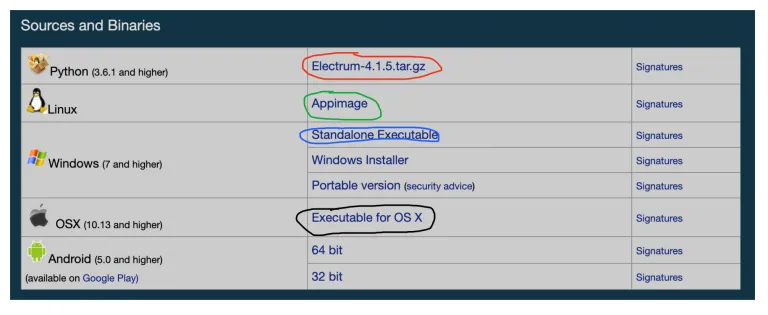

## 验证 Electrum 真实性

“验证”下载的目的是确保没有一个数据位被篡改。它防止您使用 “黑客攻击” 的恶意软件版本。只要您仅用下载的副本进行练习，即不使用持有重要金额的钱包，就可以跳过这一步。然后，一旦您准备好使用 Electrum 来管理您的真实资金，您应该删除您的副本并重新开始，这次验证您的下载。
为此，我们使用公钥/私钥加密工具 - gpg，我们在这里（https://armantheparman.com/gpg/）编写了一个关于它的指南。gpg 工具随所有 Linux 操作系统提供。对于 Mac 和 Windows，请查看 gpg 链接以获取下载说明。
除了下载 Electrum 软件外，出于安全考虑，您还需要该软件的数字签名。这是一串文本（实际上是使用文本编码的数字），由开发者用他的私人 gpg 密钥生成。使用 gpg 程序，我们可以 “测试” 签名与他的公钥（由开发者的私钥创建）相对应，每个人都可以访问公钥，与下载文件相比较。

换句话说，通过三个输入（签名、公钥和数据文件），我们可以得到一个真或假的输出，以确认文件未被篡改。

为了计算这个签名，请点击与您下载的文件对应的链接（见图中的箭头）：

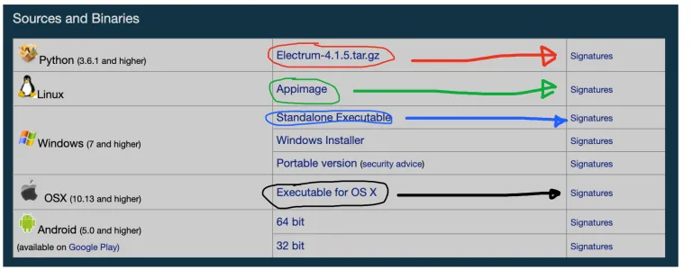

点击链接可能会自动将文件下载到您的下载文件夹，或者可能在浏览器中打开。如果它在浏览器中打开，您需要保存文件。您可以右键点击并选择 “save as”。根据操作系统或浏览器的不同，您可能需要在空白区域右键点击，而不是文本。

以下是下载的文本样子。您可以看到有多个签名 - 这些是不同人的签名。您可以验证每一个或任何一个。我将向您展示如何仅验证开发者的签名。

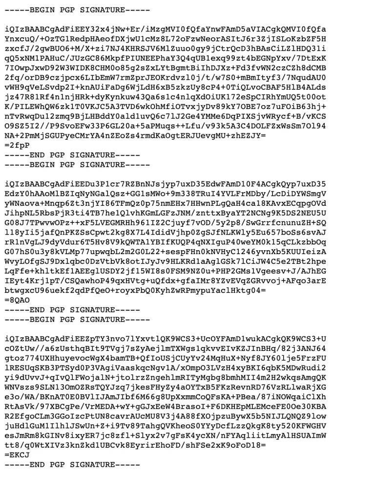

接下来，您需要获取 ThomasV 的公钥 - 他是主要开发者。您可以直接从他那里、他的 Keybase 账户、Github 或其他人那里、从密钥服务器或从 Electrum 网站获取。

从 Electrum 网站获取实际上是最不安全的方式，因为如果这个网站是恶意的（我们正在检查的正是这个问题），为什么我们要从它那里获取公钥（公钥可能是假的）？

为了现在保持简单，我还是会向您展示如何从网站获取，但请记住这一点。这是 GitHub 上的副本（https://github.com/spesmilo/electrum/blob/master/pubkeys/ThomasV.asc），您可以将其进行比较。

向下滚动页面一点以找到 ThomasV 的公钥链接（下面的红圈）。点击它并下载，或者如果它在浏览器中打开了一些文本，右键点击保存。

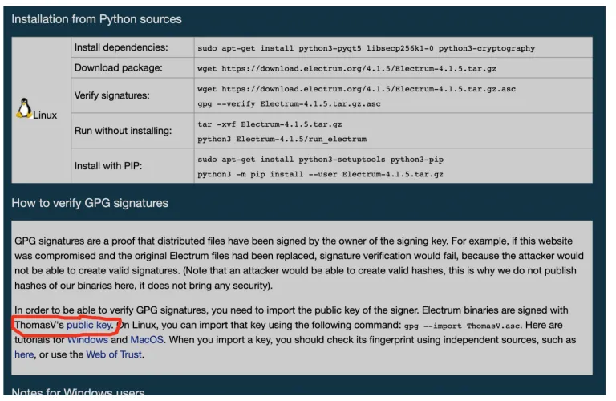

您现在有了 3 个新文件，可能都在下载文件夹中。它们在哪里并不重要，但如果您将它们全部放在同一个文件夹中，会使过程更加容易。

三个文件包括：

1. Electrum 下载
2. 签名文件（通常与 Electrum 下载的文件名相同，附加 “.asc”）
3. ThomasV 的公钥。

在 Mac 或 Linux 上打开终端，或在 Windows 上打开命令提示符（CMD）。

前往到 Downloads 目录（或您放置这三个文件的任何位置）。如果您不知道这意味着什么，请从 Linux/Mac 的这个短视频（https://www.youtube.com/watch?v=AO0jzD1hpXc）和 Windows 的这个视频（https://www.youtube.com/watch?v=9zMWXD-xoxc）中学习。记住，在 Linux 计算机上，目录名称区分大小写。
在终端中，输入以下命令将 ThomasV 的公钥导入到您计算机的 “keyring1” 中（keyring 是一个抽象概念——实际上它只是您计算机上的一个文件）：
```bash
gpg --import ThomasV.asc
```

请确保文件名与您下载的文件名匹配。同时注意，这里使用的是双破折号而不是单破折号。还要注意“--import” 前后都有空格。然后按 <enter> 键。

文件应该会被导入。如果出现错误，请检查您是否在该文件实际存在的目录中。要检查您所在的目录（在 Mac 或 Linux 上），输入 pwd。为了查看您所在目录中的文件（在 Mac 或 Linux 上），输入 ls。您应该会看到列出的 “ThomasV.asc” 文本文件，可能还有其他文件。

然后我们运行命令以验证签名。

```bash
gpg --verify Electrum-4.1.5.tar.gz.asc Electrum-4.1.5.tar.gz
```

注意这里有 4 个 “元素”，每个元素之间由一个空格分隔。我交替加粗了文本以帮助您看清楚。这四个元素包括：

1. gpg 程序
2. --verify 选项
3. 签名的文件名
4. 程序的文件名

值得注意的是，有时您可以省略第 4 个元素，计算机会猜测您的意思。我不确定，但我相信这只在文件名仅由末尾的 “asc” 不同的情况下才有效。

不要仅仅复制我这里显示的文件名——确保它们与您系统上的文件名匹配。

按 <enter> 键运行命令。您应该会看到 “good signature from ThomasV” 以表示成功。会有一些错误，因为我们没有签名文件中包含的其他人的公钥（在后续版本中，这种将签名合并在一个文件中的系统可能会改变）。此外，底部还有一个我们可以忽略的警告（这是在提醒我们，我们没有明确告诉计算机我们信任 ThomasV 的公钥）。

现在我们有了一个经过验证的 Electrum 副本，可以安全使用了。

## 运行 Electrum

### 如果使用 Python 运行 Electrum

如果您下载了 Python 版本，这是使其工作的方法。您会在下载页面上看到这个：

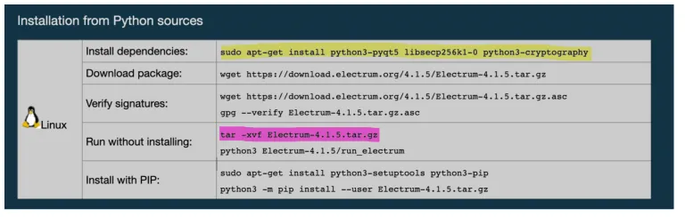

对于 Linux，首先，您要更新您的系统：

```bash
sudo apt-get update
sudo apt-get upgrade
```

复制黄色高亮的文本，粘贴到终端中，然后按 <enter> 键。您可能会被要求输入密码，可能还需要确认继续，然后它将安装那些文件（“dependencies”，即依赖项）。

您还需要将压缩文件解压到您选择的目录中。您可以使用图形用户界面来做这件事，或者从命令行中做（粉红色高亮的命令）——记住您的文件名可能会有所不同。（注意，当我们在前一节中验证下载时，我们验证的是 zip 文件，而不是解压后的目录。）

虽然可以选择使用 PIP 程序进行“安装”，但这没有必要，而且会增加额外的步骤和文件安装。只需通过终端运行程序即可绕过所有这些步骤。

步骤（Linux）如下：

1. 前往到提取文件的目录
2. 输入：./run_electrum

在 Mac 上，步骤相同，但您可能需要首先安装 Python3，并使用此命令运行：

```bash
python3 ./run_electrum
```

一旦 Electrum 运行起来，终端窗口将保持打开状态。如果您关闭它，Electrum 程序将会终止。使用Electrum 时，只需最小化它即可。

### 使用 Appimage 运行 Electrum

这个方法稍微简单一些，但不如 Windows 可执行文件那样简单。根据您使用的 Linux 版本，默认情况下，Appimage 文件可能会被系统设置为禁止执行的属性。我们必须更改这一设置。如果您的 Appimage 可以正常工作，您可以跳过这一步。使用终端前往到文件所在位置，然后运行以下命令：

```bash
sudo chmod ug+x Electrum-4.1.5-x86_64.AppImage
```

“sudo” 提供超级用户权限；“chmod” 是一个用于更改模式的命令，改变每个人的权限、写入或执行；“ug+x” 意味着我们正在修改用户和组以允许执行。

根据您的版本调整文件名。

然后，通过双击 Appimage 图标即可运行 Electrum。

### 在 Mac 上运行 Electrum

只需双击下载的文件（它是一个“驱动器”）。一个窗口会出现。将 Electrum 图标从窗口拖到您的桌面上，或者您想要保存程序的任何地方。然后，您可以 “eject（弹出）” 驱动器，并删除驱动器（下载的文件）。

为了运行该程序，只需双击即可。您可能会遇到一些 Mac 特有的 “安全提示” 错误，需要绕过这些错误。

### 在 Windows 上运行 Electrum

尽管我最不喜欢 Windows，但这是最简单的方法。只需双击可执行文件即可运行。

## 先从一个模拟钱包开始

当您第一次加载 Electrum 时，一个窗口会出现，如下所示：

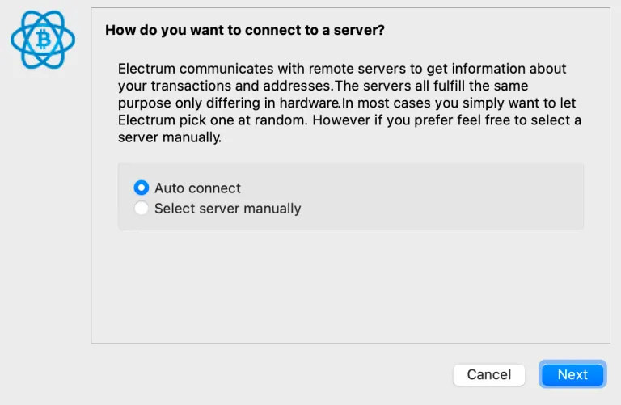

我们稍后会手动选择您的服务器，但现在，保留默认设置并自动连接。

接下来，创建一个虚拟钱包 - 不要将资金放入这个钱包。这个虚拟钱包的目的是在您加载真实钱包之前，通过软件进行操作，确保一切正常运行。我们试图避免在使用真实钱包时意外泄露隐私。如果您只是在练习，您创建的钱包可以被视为一个虚拟钱包。

您可以将名称保留为 “default_wallet” 或更改为您喜欢的名称，然后点击下一步。稍后，如果您有多个钱包，您可以在这个阶段通过首先点击“Choose...” 来找到它们并打开。

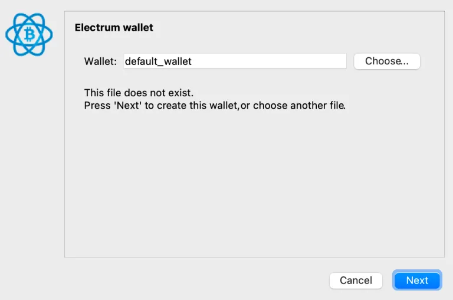

选择 “Standard wallet” 并点击 <Next>：

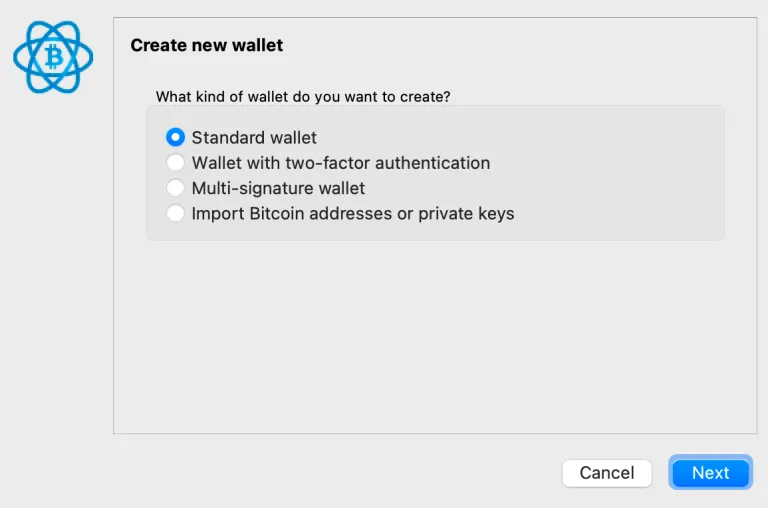

然后，选择 “I already have a seed”。我不希望您养成创建 Electrum 助记词的习惯，因为它使用自己的协议，与其他钱包不兼容——这就是为什么我们不点击 “new seed” 的原因。

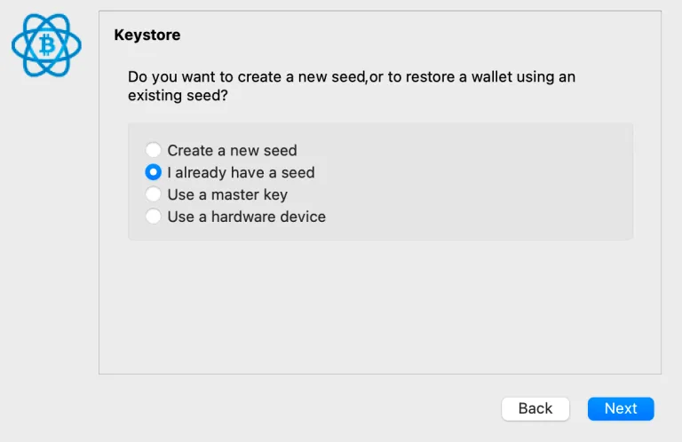

访问 https://iancoleman.io/bip39/ 并创建一个虚拟种子。首先，将单词数量更改为 12（这是常见的做法），然后点击 “generate” 并将框中的单词复制到您的剪贴板。

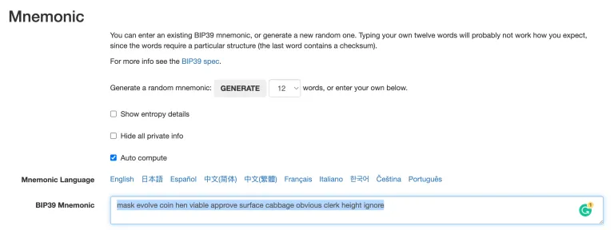

然后将这些单词粘贴到 Electrum 中。这里有一个例子：

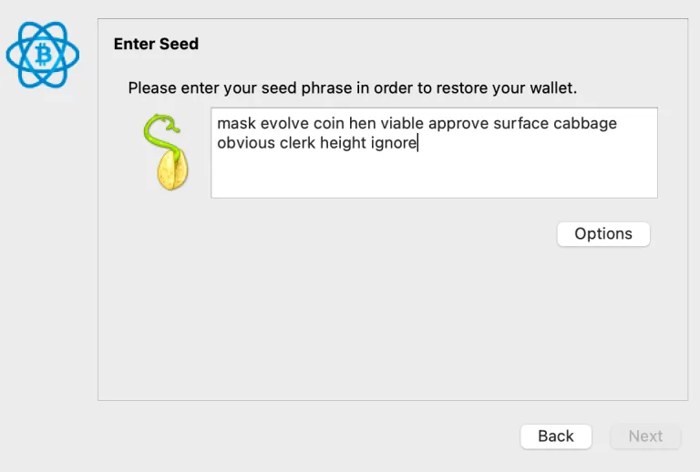

Electrum 将寻找与其协议匹配的单词。我们必须绕过这一点。点击选项，并选择 BIP39 Seed：

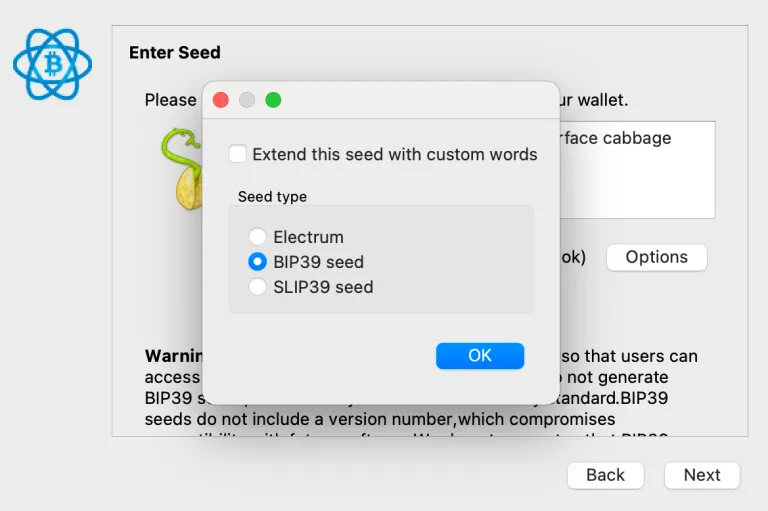
种子随后生效。（在此之前，Electrum 期望的是一个 Electrum 的种子，因此该种子被视为无效。）在点击 “Next” 之前，请注意 “Checksum OK” 的提示。这一点很重要（对于您之后可能使用的实际钱包而言），因为该提示确认了您输入的种子的有效性。底部附近的警告可以忽略，那是 Electrum 开发者对 BIP39 的抱怨，以及他们声称自己的版本（与其他钱包不兼容）更优越的 “FUD” 言论。

> **此处插入一条重要警告：**校验和的作用是确保您输入的种子没有错误。校验和是种子的最后一部分（第 12 个单词是校验和单词），它由种子的第一部分（11 个单词）的数学值计算得出。如果您在开头输入错误，校验和单词将无法匹配，钱包软件会发出警告提醒您。这并不意味着助记词不能用于创建功能正常的比特币钱包。想象一下，您创建了一个钱包，但输入错误，然后向钱包充值了比特币。之后有一天，您可能需要恢复钱包，但恢复时您不会重现输入错误——您会恢复错误的钱包！Electrum 允许您在校验和无效的情况下继续创建钱包，这非常危险，所以请注意，确保校验和是您的责任。其他钱包会阻止您继续操作，这要安全得多。这就是我所说的，一旦您学会正确使用 Electrum，它就可以安全使用的原因之一（Electrum 的开发者应该修复这个问题）。

请注意，如果您想添加 passphrase（密语），可以在选项窗口的顶部找到选择。

点击 “OK” 后，您会回到输入助记词的位置。如果您选择了密语选项，请不要将其与助记词一起输入（提示信息会在后面出现）。

如果您没有请求密语，接下来您将看到此屏幕——更多关于钱包脚本类型和派生路径的选项，您可以在这里了解（https://armantheparman.com/public-and-private-keys/），但只需保留默认值并继续即可。

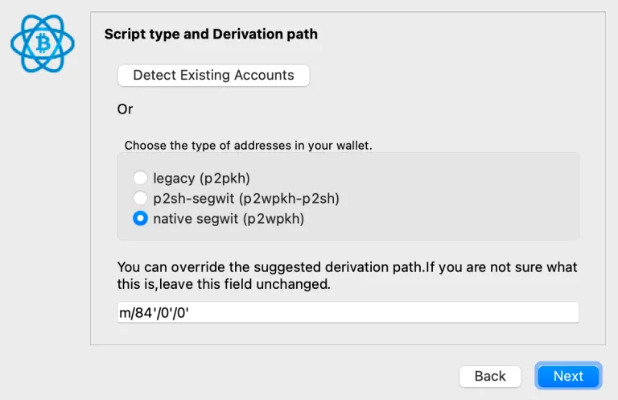

> **更多信息**：第一个选项允许您在以下选项中选择：
- 传统模式（地址以 “1” 为开头），
- 支付到脚本哈希模式（地址以 “3” 为开头），
- bech32/原生隔离见证模式（地址以 “bc1q” 为开头）。

截至撰写本文时，Electrum 尚不支持 taproot（地址以 “bc1p” 为开头）。此窗口中的第二个选项允许您修改推导路径。我建议您永远不要修改此路径，尤其是在您不了解其含义的情况下。人们会强调记下派生路径的重要性，以便在需要时恢复您的钱包，但如果您保留默认设置，通常不会出现问题，所以不必惊慌——但记下派生路径仍然是一个好习惯。

接下来，您可以选择添加密码。请勿将其与 “密语” 混淆。密码用于锁定您计算机上的文件。密语是私钥的组成部分。由于这是一个虚拟钱包，您可以将密码留空并继续。

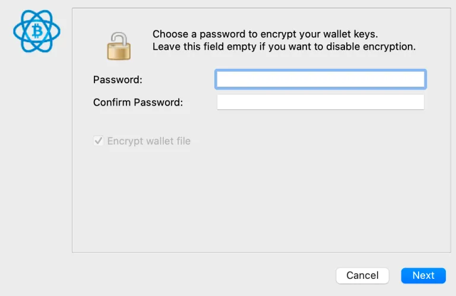
您将收到有关新版本通知的弹窗（我建议您选择不接收）。然后钱包将自动生成并准备好使用（但请记住，这个钱包是要被删除的，它只是一个虚拟钱包）。
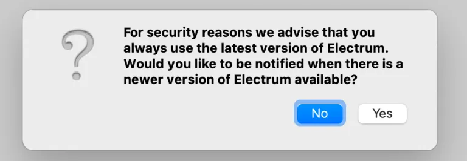

有一些事情我建议您做以设置软件环境（只需一次）：

### 将单位更改为 BTC

转到顶部选单，tools –> electrum preferences，在那里的通用标签下，您会找到将 “base unit” 更改为BTC的选项。请启用 Addresses and Coins 标签

前往顶部选单，查看，然后选择 “show addresses”。然后返回查看并选择 “show coins”。

### 启用 Oneserver

默认情况下，Electrum 将连接到一个随机节点。它还连接到许多其他次要节点。我不确定与这些次要节点交换了什么数据，但我们不希望这样做，出于隐私考虑。即使您指定了一个节点，例如您自己的节点，这些多个其他节点也会同时连接，我不确定正在共享什么信息。无论如何，防止这种情况很容易。在我向您展示如何指定您自己的节点之前，我们将强制 Electrum 一次只连接到一个服务器。

> 有一种方法可以通过从命令行指定 “oneserver” 来做到这一点，但我不推荐这种方式。我将展示一个我认为从长远来看更简单的替代方法，而且更不容易让您意外地连接到其他节点。

我们使用虚拟钱包的原因是，如果我们加载了我们的真实钱包，带有我们真实的比特币，我们现在已经无意中连接到了一个随机节点（即使我们在开始时选择了“手动设置服务器”，它仍然会出于某种原因连接到这些其他辅助节点（嘿，Electrum 开发者，您们应该解决这个问题）。如果我们的钱包是私有的，这将是一场灾难。

此外，如果不先加载某种类型的钱包，我们就无法执行我下面要展示的步骤。（我们将编辑一个配置文件，该文件只有在加载钱包后才会生成并可供编辑）。

现在关闭 Electrum **（重要提示：如果您不这样做，您接下来所做的更改将被清除）**。

### LINUX/MAC 配置文件

在 Linux 或 Mac 中打开终端（稍后提供 Windows 指令）：

您应该自动位于 home 文件夹中。从那里，前往到隐藏的 electrum 设置文件夹（这与应用程序所在的位置不同）。

```bash
cd .electrum
```

注意 “electrum” 前的点表示它是一个隐藏文件夹。

另一种方式是输入以下命令：

```bash
cd ~/.electrum
```

其中 “~” 代表您的主目录的路径。您可以使用 “pwd” 命令来查看当前目录的完整路径。

一旦进入 “.electrum” 目录，输入 “nano config” 并按 <enter> 键。

一个文本编辑器将打开（称为 nano）并打开配置文件。这里鼠标不怎么管用。使用箭头键移动到以下行：

```json
"oneserver": false,
```

将 “false” 更改为 “true”；并且不要破坏语法（不要删除逗号或分号）。

按 <ctrl> x 以退出，然后按 “y” 以保存，然后按 <enter> 确认更改而不编辑文件名。
现在再次运行 Electrum。然后点击右下角的圆圈，这将打开网络设置。然后，在概览标签页的顶部附近，您会看到 “connected to 1 node（已连接到 1 个节点）”——这表示成功。

就在下面，您会看到一个文本字段，服务器的地址就在那里。您目前连接到了那个随机节点。关于连接到节点的更多信息，请看下一节。

### Windows 配置文件

Windows 配置文件有点难找。目录为：`C:/Users/Parman/AppData/Roaming/Electrum`

显然，您需要将 “Parman” 更改为您自己的计算机用户名。

在那个文件夹中，您会找到配置文件。用文本编辑器打开它，并编辑以下行：

```json
"oneserver": false,
```

将 “false” 改为 “true”；不要打乱语法（不要删除逗号或分号）。

然后保存文件并退出。

## 将 Electrum 连接到节点

接下来，我们想将我们的虚拟钱包连接到我们选择的节点。如果您还没准备好运行一个节点，您可以做以下几件事之一：

1. 连接到朋友的个人节点（需要 Tor）
2. 连接到一个受信任公司的节点
3. 连接到一个随机节点（不推荐）。

顺便说一下，这里有运行您自己节点的说明，以及为什么您应该这么做的理由。（所有教程在节点部分或我们的免费课程中）

### 通过 Tor 连接到朋友的节点（指南即将推出。）

### 连接到一个受信任公司的节点

这样做的唯一理由是，如果您必须访问区块链，但您自己（或朋友）没有可用的节点。

让我们连接到 Bitaroo 的节点——据称他们不会收集数据。他们是一个仅支持比特币的交易所，由一位充满热情的比特币爱好者运营。连接到他们需要一些信任，但这比连接到随机节点要好得多，因为随机节点可能是监控公司。

点击钱包窗口右下角的圆圈图标，即可进入 Network Settings（红色表示未连接，绿色表示已连接，蓝色表示通过 Tor 连接）。

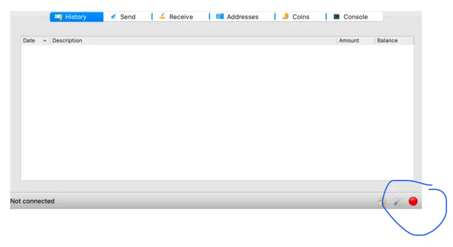

一旦您点击了圆圈图标，一个弹出窗口将出现：您的钱包将显示 “connected to 1 node”，因为我们之前强制执行了这一点。

取消选中 “select server automatically” 框，然后在服务器字段中，输入 Bitaroo 的详细信息，如下所示：

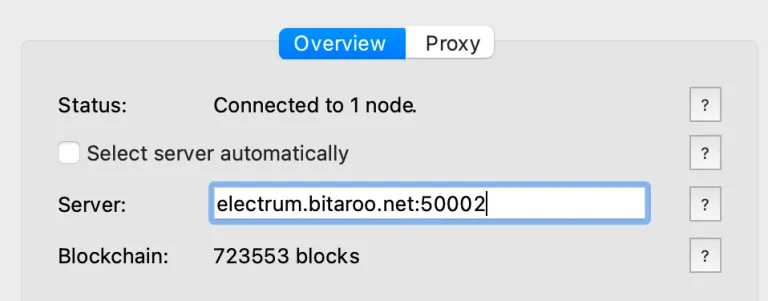

关闭窗口，现在我们应该已经连接到 Bitaroo 的节点了。为了确认，圆圈应该是绿色的。再次点击它并检查服务器详情是否没有变回随机节点。

### 连接到您自己的节点

如果您有自己的节点，那就太好了。如果您只有 Bitcoin Core，而没有 Electrum 服务器，您还不能将Electrum钱包连接到您的节点。

> 注意：Electrum 服务器和 Electrum 钱包是不同的事物。服务器是 Electrum 钱包能够与比特币区块链通信所需的软件——我不知道为什么要这样设计——可能是为了提高速度，但我可能错了。
如果您运行像 MyNode（我推荐初学者从这个开始）、Raspiblitz（随着您变得更加高级，我推荐这个）或Umbrel（我个人还不推荐它，因为我遇到了太多问题）这样的节点软件包，那么您只需输入运行节点的计算机（树莓派）的 IP 地址，加上冒号和 50002，如上一节中的图片所示，就可以简单地连接您的钱包了。（稍后我会告诉您如何找到您节点的 IP 地址。）
打开网络设置（点击右下角的绿色或红色圆圈）。取消选中 “select server automatically” 框，然后输入您的 IP 地址，就像我输入的一样，您的会有所不同，但冒号和 “50002” 应该是相同的。

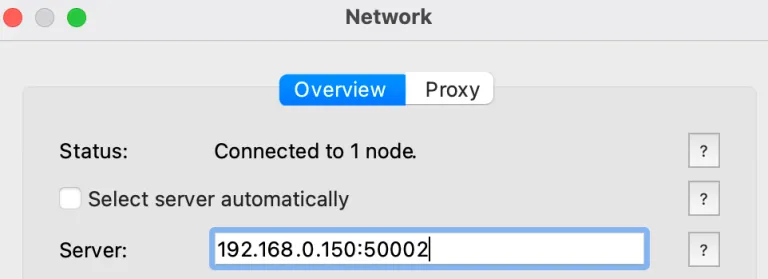

关闭窗口，现在我们应该已经连接到您的节点了。为了确认，再次点击圆圈并检查服务器详情是否没有变回一个随机节点。

有时，尽管做了一切正确的事情，看似它拒绝连接。这里有一些尝试的方法...

- 升级到 Electrum 的新版本，以及您的节点软件
- 尝试删除 “.electrum” 目录中的缓存文件夹
- 尝试在网络设置中将端口从 50002 更改为 50001
- 使用这个指南通过 Tor 作为替代方法连接（https://armantheparman.com/tor/）
- 在节点上重新安装 Electrum 服务器

## 查找您节点的 IP 地址

IP 地址不是普通用户通常知道如何查找和使用的事物。我帮助过许多人运行节点，然后将他们的钱包连接到节点——一个常见的障碍似乎是找到它的 IP 地址。

对于 MyNode，您可以在浏览器窗口中输入：`mynode.local`

有时，“mynode.local” 不起作用（确保您不是在 Google 搜索栏中输入它。要强制导航栏将您的文本识别为地址而不是搜索，可以在文本前加上`http://`，像这样：`http://mynode.local`。如果那不起作用，尝试加上 “s”，像这样：`https://mynode.local`。

这将访问设备，您可以点击设置链接（见下面我的蓝色“圆圈”）来显示此屏幕，其中位于 IP 地址：

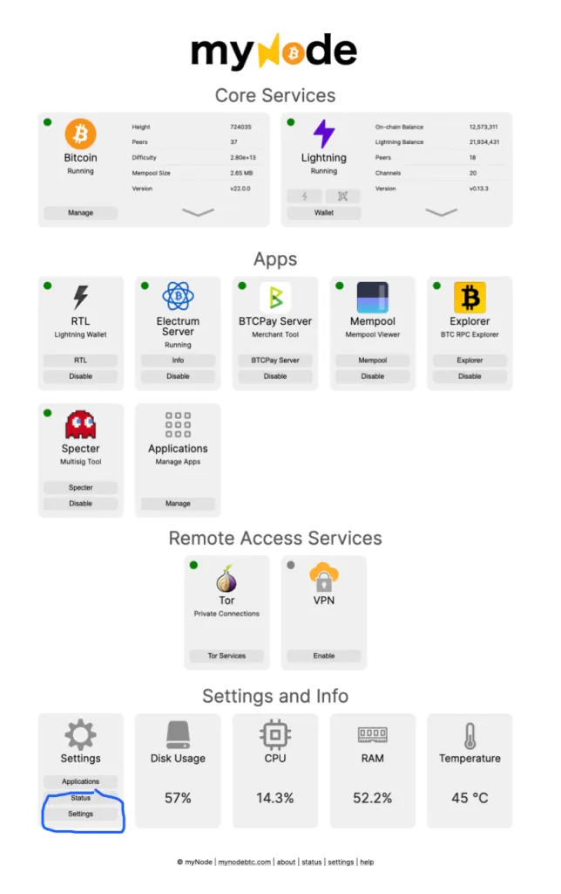

这个页面将加载，您将看到节点的 IP（蓝色“圆圈”）

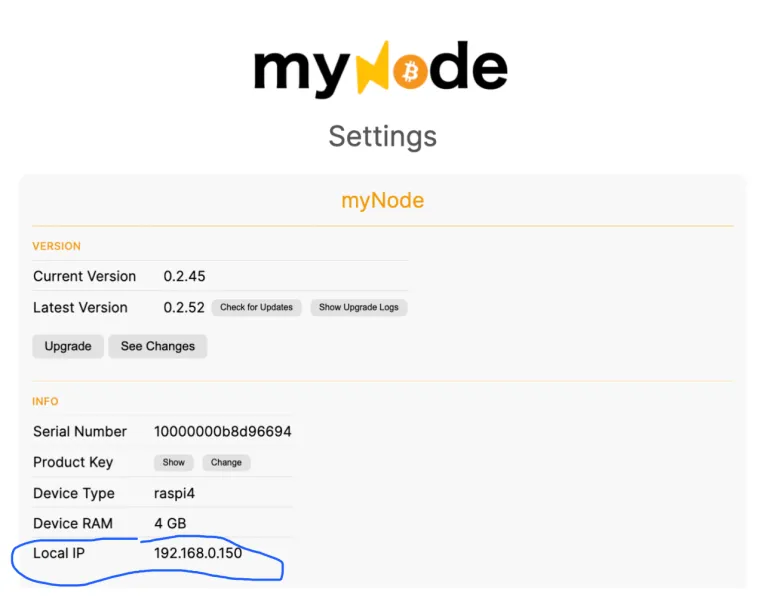

然后，在将来，您可以在浏览器中输入 192.168.0.150，或 http://192.168.0.150。

对于 Raspiblitz（当不连接屏幕时），您需要一个不同的方法（这也适用于MyNode）：

登录到您的路由器的网页——在这里我们将找到您所有连接设备的 IP 地址。路由器的网页将是您输入到网络浏览器中的 IP 地址。我的看起来是：

    http://192.168.0.1

要获取登录路由器的凭据，您可以在用户手册中查找，有时甚至在路由器本身的贴纸上。寻找用户名和密码。如果找不到，请尝试使用用户名：“admin” 密码：“password”

如果能够登录，您将看到已连接的设备，从它们的名称中，您应该可以清楚地看到哪个节点是您的路由器。IP 地址也会显示在那里。

### 如果前两种方法都失败了，最后一种方法也有效，但比较繁琐：

首先，选择您网络上任何一个设备的 IP 地址（当前使用的电脑就可以）。

在 Mac 上，您可以在网络偏好设置中找到它：

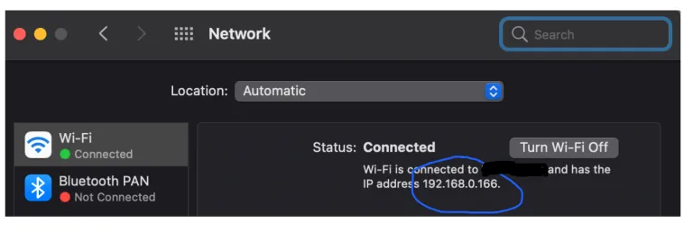

我们关注前 4 个元素（192.168.0），而不是您在图片中看到的第 4 个元素，“166”（您的数字会有所不同）。

对于 Linux 用户，请使用命令行：

```bash
ifconfig | grep inet
```

那个竖线是 “管道” 符号，您可以在 <delete> 键下面找到它。您会看到一些输出和一个 IP 地址。（忽略127.0.0.1，它不是那个，也忽略子网掩码）

对于 Windows，打开命令提示符（cmd）并输入：

```bash
ipconfig/all
```

然后按 Enter 键。IP 地址可以在输出中找到。

这是简单的部分。难点现在在于找到您节点的 IP 地址 - 我们需要暴力猜测。比如说您的电脑 IP 地址以192.168.0.xxx 为开头，那么对于您的节点，在浏览器中尝试：`https://192.168.0.2`

最小的数字是 2（0 代表任何设备，1 代表路由器），最大的数字我认为是 255（二进制表示为 11111111，是 1 字节所能表示的最大数字）。

依次尝试，直到接近 255。最终，您会找到能够加载 MyNode 页面（或 RaspiBlitz 页面）的正确数字。然后您就知道在 Electrum 网络设置中应该输入哪个数字才能连接到您的节点了。

它看起来会像这样（请确保后面包含冒号和数字）：

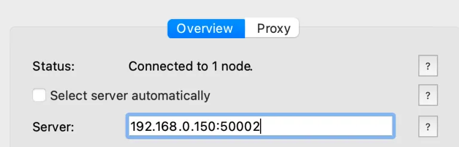

> **注意**：这些 IP 地址是您家庭网络内部的地址。外部人员无法看到它们，它们也不涉及敏感信息。它们就像大型机构中的电话分机号，可以将您转接到不同的电话。

## 删除虚拟钱包

现在我们已经成功连接到一个节点。从现在开始，Electrum 将默认以这种方式加载。您现在应该删除虚拟钱包（选单：文件 -> 删除），以防您不小心将资金发送到这个不安全的钱包（它不安全是因为我们创建它的方式不安全）。

## 创建一个练习钱包

删除虚拟钱包后，重新开始，以同样的方式创建一个新的钱包。这次，请记下助记词并妥善保管。

使用这个练习钱包来学习 Electrum 的工作原理是个好主意，这样可以避免使用笨重的硬件钱包（高安全性需要硬件钱包）。在这个钱包里只存入少量比特币——假设您会丢失这笔钱。熟练之后，再学习如何使用硬件钱包操作 Electrum。

在您创建的新钱包中，您会看到一个地址列表。绿色的地址称为“接收地址”。它们由以下三部分组成：

- 助记词
- 密语
- 派生路径

您的新钱包里有一组接收地址，任何拥有助记词、密码短语和推导路径的软件钱包都可以通过数学运算生成这些地址。总共有 43 亿个这样的地址！远远超过您的需求。Electrum 只显示前 20 个地址，用完后才会显示更多。

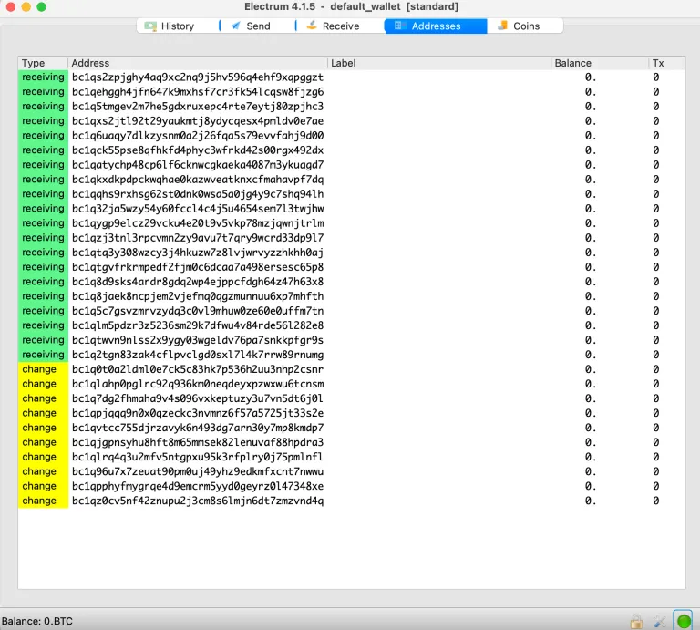

这与其他一些一次只显示一个地址的钱包截然不同。

由于您在创建此钱包时输入了助记词，Electrum 拥有每个地址的私钥，因此可以从这些地址进行消费。

另请注意，还有一种称为 “change addresses（找零地址）” 的黄色地址——它们只是来自不同数学分支的另一组地址（总共有 43 亿个这样的地址）。钱包使用它们自动将多余的资金作为找零返还到钱包中。例如，如果您使用 1.5 个比特币消费了 0.5 个，剩余的 1.0 个比特币需要去哪里。您的钱包会将其发送到下一个空的黄色找零地址——否则，它将被支付给矿工！有关 UTXO 的更多信息，请参阅此指南：(https://armantheparman.com/utxo/)

接下来，返回 Ian Colman 私钥网站并输入种子（而不是生成种子）。您将在下方看到私钥和公钥信息的变化；以下所有内容都取决于页面上方的内容。

**切记：**您 “永远” 不应该输入您真实比特币钱包或电脑的种子，恶意软件可能会窃取它。我们目前只是使用一个练习钱包进行学习，所以暂时没问题。

向下滚动并点击 BIP84 选项卡，将派生路径更改为 BIP84（隔离见证），以匹配您的 Electrum 钱包。

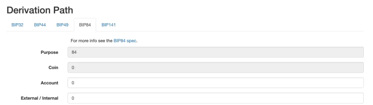

下方您会看到账户扩展私钥和账户扩展公钥：

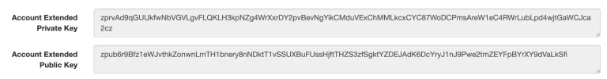

前往 Electrum，比较它们是否匹配。顶部有一个选单，wallet –> information：


弹出如下窗口：

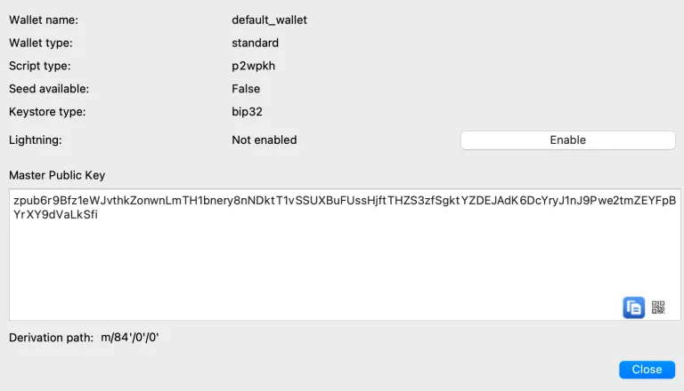

注意两个公钥是否匹配。

接下来，比较地址。返回到 Ian Coleman 的网站，滚动到底部：

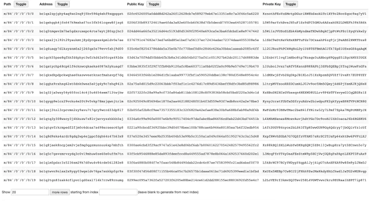

注意它们与 Electrum 中的地址是否匹配。

现在我们将检查找零地址。稍微向上滚动到派生路径，并将最后的 0 改为 1：

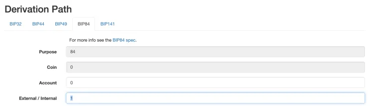

现在向下滚动并比较地址是否与 Electrum 中的黄色地址匹配

我们为什么要这样做？

我们使用两个不同的独立软件程序对助记词进行验证，以确保它们提供的信息一致。这大大降低了恶意代码潜藏在钱包内部并生成错误私钥、公钥或地址的风险。

下一步是接收一个小额测试资金，并将其在钱包内从一个地址转移到另一个地址。

## 测试钱包（学习使用它）

在这里，我将向您展示如何接收一个 UTXO 到您的钱包，然后将其转移到（花费）到钱包内的另一个地址。金额非常小，即使丢失也无妨。

这样做有几个目的：

- 证明您有权在新钱包中花费加密货币。
- 演示如何使用 Electrum 软件进行消费（以及一些其他功能），之后我们会增加额外的安全操作（例如使用硬件钱包或与互联网隔离的计算机）。
- 强调您可以在同一个钱包中选择多个地址来接收和花费加密货币。

打开您的测试版 Electrum 钱包并点击 “Addresses” 标签页，然后右键点击第一个地址并选择Copy –> Address：
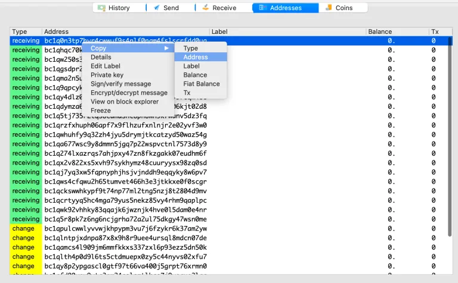

地址现在已经在您的电脑内存中了。

现在，前往您持有比特币的交易所，我们来提取少量比特币到这个地址，比如 50,000 聪。我将以 Coinbase 为例，因为它是最常用的交易所，尽管他们与比特币存在冲突，而且我也不想为了这个目的登录一个废弃的旧账户。

登录，然后点击 Send/Receive 按钮，截至今日，它位于网页的右上角。


显然，我的 Coinbase 账户里没有资金，但假设账户里有资金，请按照以下步骤操作：像我一样，将 Electrum 中的地址粘贴到 “To” 栏。您还需要选择一个金额（我建议 50,000 聪左右）。不要填写 “可选留言” ——Coinbase 已经收集了足够多的您的数据（并出售），您没必要帮他们。最后，点击 “Continue”。之后我不知道您还会看到哪些弹窗，您得自己摸索，但所有交易所的操作方法都差不多。

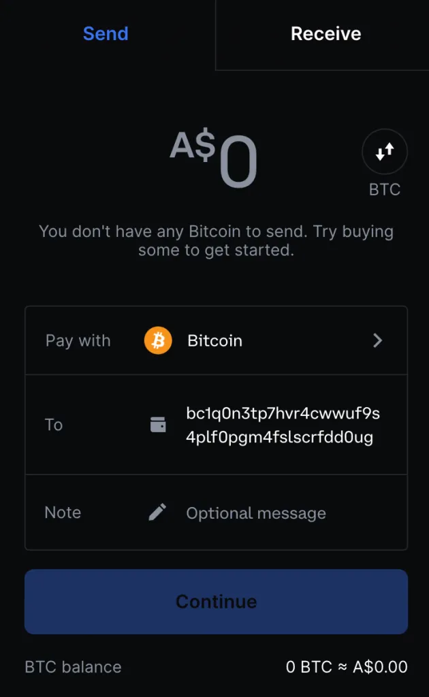

根据交易所的不同，您可能立即在钱包里看到聪，也可能需要几个小时/几天。

请注意，即使区块链上尚未确认，Electrum 也会显示您已收到的代币。您收到的代币是从比特币节点的等待列表（或称“内存池”）中读取的。当它被添加到区块时，您就会看到这些资金被确认。

现在我们的钱包里已经有了一个 UTXO，我们应该给它贴上标签。只有我们自己才能看到这个标签，它与公共账本无关。我们所有的 Electrum 标签都只在我们当前使用的电脑上可见。我们可以保存一个文件，然后用它将所有标签恢复到运行相同钱包的另一台电脑上。

### 添加 UTXO 标签

我需要向这个测试钱包捐赠，感谢 @Sathoarder 提供了一个有效的 UTXO（10,000 聪），另一位匿名用户也向同一个地址捐赠了 5,000 聪。请注意，第一个地址的余额为 15,000 聪，总共有 2 笔交易（最右侧一列）。底部显示，已确认余额为 10,000 聪，另有 5,000 聪未确认（仍在内存池中）。

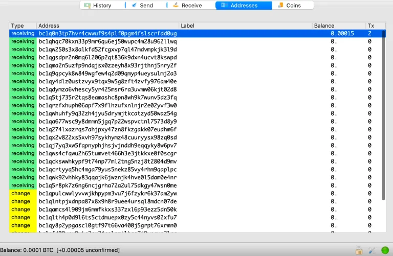

现在，如果我们切换到 “Coins” 标签页，可以看到两个 “received coins” 或 UTXO。它们都在同一个地址中。

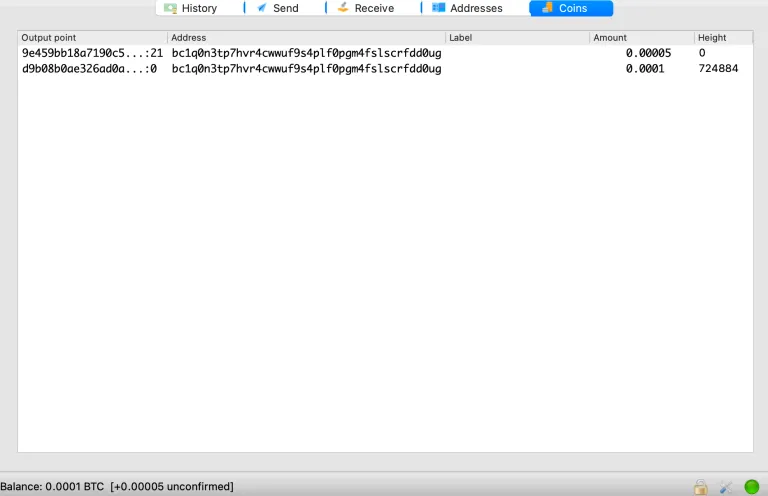

回到 “Addresses” 标签页，双击地址旁边的 “labels” 区域，即可输入一些文本，然后按回车键保存：

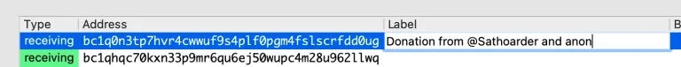

这样做的好处是，您可以追踪币种的来源、是否无需 KYC 验证，以及每个 UTXO 的成本（以防您需要出售币种并计算政府可能征收的税款）。

理想情况下，您应该避免在同一个地址中积累多个币种。如果您确实决定这样做（不建议这样做），可以使用地址方法为每个币种单独添加标签，而不是使用相同的标签。实际上，您无法直接进入 “Coins” 标签页编辑标签（不，那样就太直观了！）。您需要前往 “History” 标签页，找到相应的交易，为其添加标签，然后才能在币种部分看到这些标签。您在币种部分看到的任何标签都来自地址标签或历史记录标签，但历史记录标签会覆盖地址标签。为了将标签备份到文件，您可以从顶部选单导出标签：wallet–>lables–>export.。

接下来，我们将把币种从第一个地址转移到第二个地址。右键单击第一个地址，然后选择 “spend from”（实际上，在本例中并非必须，但假设我们有很多币种分布在多个地址中；使用此功能，我们可以强制钱包只花费我们想要的币种。如果我们想选择多个地址中的多种币种，可以按住 Command 键并单击鼠标左键选择地址，然后右键单击并选择 “spend from”:

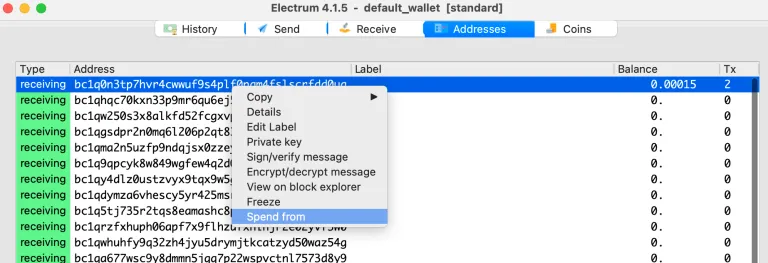

完成此操作后，钱包窗口底部会出现一个绿色条，显示您已选择的币种数量和可用于花费的币种总数。

您也可以花费地址中的个别 UTXO，并排除同一地址中的其他 UTXO，但不建议这样做，因为您花费了其中一种币种后，地址中的其他币种的加密强度会降低（除了隐私原因外，不将多种币种放在同一个地址的另一个原因是，如果您花费了一种 UTXO，则应该花费所有 UTXO，这将造成不必要的成本）。以下是如何选择单个币种的方法。从共享地址发送，但不要这样做：

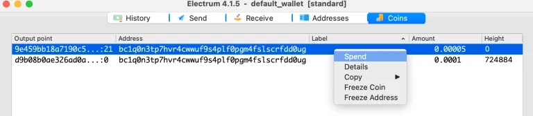

现在，我们已经选择了要花费的两个 UTXO。接下来，我们决定将它们花费到哪里。让我们将它们发送到第二个地址。我们需要这样复制地址：

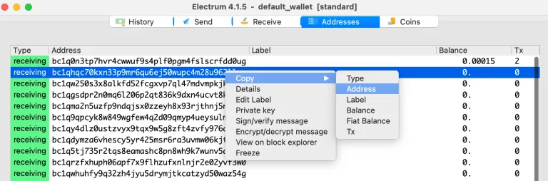

然后前往 “Send” 标签，并在 “Pay to” 字段中粘贴第二个地址。无需添加描述；您可以这样做，但您可以稍后通过编辑标签来做。对于金额，选择 “Max” 以花费我们选择的所有 UTXO。然后点击 “Pay”，然后点击出现的弹出窗口中的 “Advanced” 按钮。

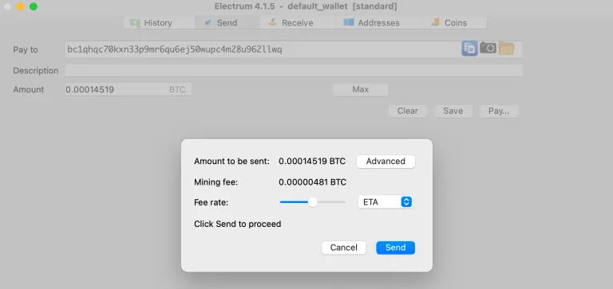

在这个阶段您要点击“高级”，这样我们可以获得精细控制并准确检查交易中的内容。以下是交易内容：

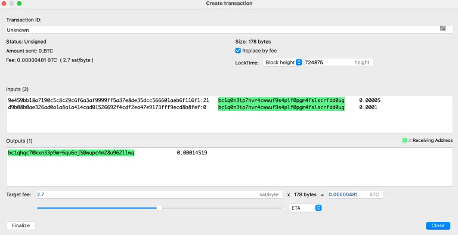

我们看到两个内部白色这些框/窗口。上面的窗口是输入窗口（显示正在花费的 UTXO），下面的窗口是输出窗口（显示 UTXO 的接收者地址）。

注意，目前状态（左上角）显示为 “unsigned”。“Amount sent” 为 0，因为 UTXO 是在钱包内部转账。手续费为 481 聪。请注意，如果手续费是 480 聪，末尾的零会被省略，显示为 0.0000048，这在视觉上可能看起来像 48 聪——请务必小心（Electrum 的开发者应该修复这个问题）。

交易大小指的是数据大小（以字节为单位），而不是比特币的数量。“replace by fee（手续费替换）” 默认开启，允许您在需要时使用更高的手续费重新发送交易。“LockTime” 允许您调整交易的有效时间。我还没有尝试过这个功能，但建议您除非完全理解其作用并有过小额交易的经验，否则不要使用它。

底部还有一些便捷的挖矿手续费调整工具。对于内部转账，您只需将其设置为最低手续费 1 sat/byte 即可。只需在 “Target fee” 字段中手动输入该数值。为了查看外部支付的合适手续费，您可以访问 https://mempool.space 查看矿池的繁忙程度，并获取一些建议的手续费。

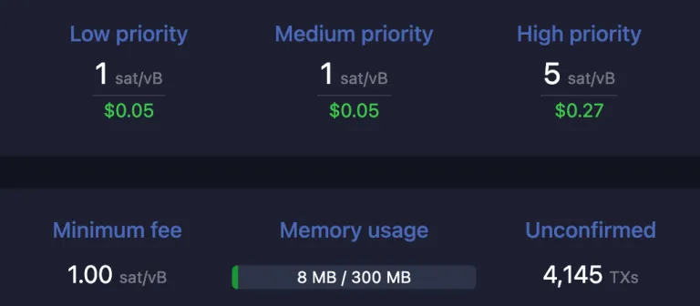

我选择了 1 sat/byte。

在输入窗口中，我们看到两条记录。第一条是 5000 聪的捐赠。左侧是它的交易哈希值（我们可以在区块链上查找）。旁边是 “21” ——这表示它是该交易中标记为 21 的输出（实际上是第 22 个输出，因为第一个输出标记为 0）。

这里需要注意一点：UTXO 仅存在于交易内部。要花费一个 UTXO，我们需要引用它，并将该引用作为新交易的输入。这样，输出就变成了新的 UTXO，而旧的 UTXO 则变成了 STXO（已花费交易输出）。

第二行是 10,000 聪的捐赠。它对应的交易哈希旁边有一个 “0”，因为它是该交易的第一个（也可能是唯一的）输出。

在底部窗口中，我们可以看到我们的地址。请注意，输入的比特币总数与输出的比特币总数并不完全匹配。差额将支付给矿工。矿工会查看它正在挖矿的区块中所有交易的差额，并将该差额添加到它的奖励中。（这种挖矿费用与交易链完全脱钩，并开始新的生命周期。）

如果我们调整挖矿费用，输出值将自动更改。

**这里需要特别注意：** 请注意交易窗口中地址的颜色。请记住，绿色的地址会列在您的地址标签页中。如果某个地址在交易窗口中以绿色（或黄色）高亮显示，则表示 Electrum 已将该地址识别为自己的地址。如果地址没有高亮显示，则表示它是外部地址（当前打开的钱包之外的地址），您应该格外仔细地检查它。

检查完交易中的所有内容，确认您对所花费的币种及其去向都满意后，即可点击“Finalise”。

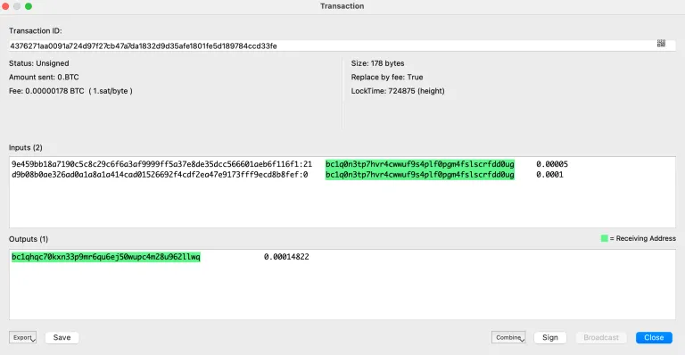

点击 “finalise” 后，您将无法再进行任何编辑——如果需要修改，您必须关闭此窗口并重新开始。请注意，“finalise” 按钮已更改为 “export”，并且出现了新的按钮：“save”、“combine”、“sign” 和 “broadcast”。“broadcast” 按钮呈灰色，因为交易尚未签名，因此在此阶段无效。

一旦您点击签名，如果您的钱包已设置了密码，系统会提示您输入密码，然后状态（右上角）会从 “Unsigned” 变为 “Signed”。然后 “Broadcast” 按钮将可用。

在您广播交易后，可以关闭交易窗口。如果您转到地址标签页，现在会看到第一个地址为空，而第二个地址有 1 个 UTXO。

注意：即使交易尚未被挖出到区块或 “confirmed”，您也会看到所有这些变化。这是因为 Electrum 不仅基于区块链数据更新余额/交易，还基于内存池数据。并非所有钱包都支持此功能。

需要指出的是，我们可以将交易保存起来以供稍后使用，而不是广播。交易可以保存为未签名状态或已签名状态。

点击 “export” 按钮（注意，不要点击 “save” 按钮），您将看到多个选项。交易以文本形式编码，因此可以通过多种方式保存。

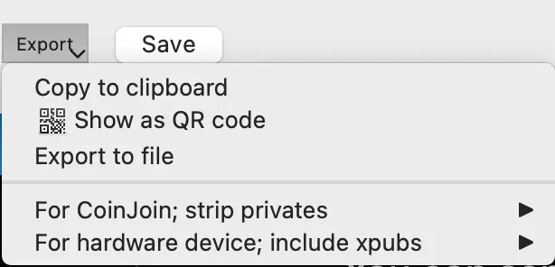

保存为二维码非常有趣。如果您选择此选项，将会弹出一个二维码：


然后您可以拍摄二维码的照片。您可以用这个功能做很多事情，但现在，我们先假设您稍后会将交易重新加载到钱包里。您可以关闭 Electrum，重新打开钱包，然后进入 “Tools” 选单：

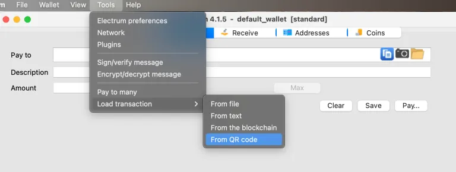

这将启动您电脑的摄像头。然后，您只需将手机中二维码的照片对准摄像头，即可恢复您上次离开时​​的交易记录。

恢复已保存交易的操作并不直观，因此请务必注意。恢复交易并非一个 “Tool”（工具），而是隐藏在工具选单中（这是 Electrum 开发者应该修复的另一个问题）。

对于保存为文件的交易，也可以进行类似的操作。请在同一个钱包内尝试使用这两种方法。这里我就不赘述了，但您可以使用此功能在不同电脑上的同一个钱包之间、在多重签名钱包之间以及与硬件钱包之间传递交易。以下是一些操作说明。

现在，回到 “Save” 按钮——这不是保存交易文本的方式。这实际上是告诉 Electrum 钱包在本地电脑上识别这笔交易作为已提交的支付。如果您不小心这样做了，您会看到交易旁边有一个小电脑图标。您可以右键点击并删除交易——不用担心，这样做不会删除比特币。Electrum将会忘记这笔交易曾经发生，并会“退还”sats，然后在它们实际存在的正确位置显示sats。

### 找零地址

找零地址很有意思。您需要了解 UTXO 才能理解以下说明。如果您要花费到某个地址的金额小于 UTXO，那么剩余的比特币将归矿工所有，除非您指定了找零输出。

假设您有一个 6.15 比特币的 UTXO，您想花费 0.15 比特币捐赠给世界上某个地方被暴政“民主”政府压迫的抗议者。这时，您可以使用 Electrum 的 “spend from” 功能，将这 6.15 比特币放入一个交易中。

您需要将抗议者的地址粘贴到 “Pay to” 字段中，或许可以在 “description” 字段中填写“EndTheFed & WEF”，然后在金额栏中填写 0.15 比特币，点击 “pay”，然后点击 “advanced”。

在交易界面的输入窗口中，您会看到 6.15 比特币的 UTXO。在输出窗口中，您会看到一个未高亮显示的地址（这是抗议者的地址），旁边显示 0.15 个比特币。您还会看到一个黄色地址，显示略少于 6.0 个比特币。这是钱包从其自身的黄色找零地址中自动选择的找零地址。找零地址的作用是让钱包可以存放找零，而不会影响您可能计划使用或已发送发票的收款地址的可用性。例如，如果这些地址稍后将由客户使用，您肯定不希望钱包自动使用并填充它们。这样做既混乱又不利于隐私。

请注意，当您调整挖矿费用时，找零输出金额会自动调整，但支付金额不会。

### 手动找零或向多人付款

这是 Electrum 的一个非常有趣的功能。您可以按如下方式访问：

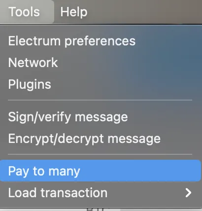

然后，您可以为要使用的 UTXO 余额输入多个收款地址，如下所示：

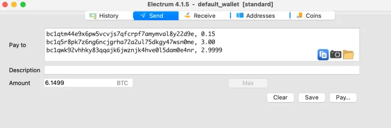

粘贴地址，输入逗号，然后输入空格，然后输入金额，然后按 <enter>，再重复此操作。请勿在 “AMOUNT” 窗口中输入金额——当您在 “Pay to” 窗口中输入各个金额时，Electrum 会自动在此处填充总金额。

这允许您手动确定找零的去向（例如您钱包中的特定地址，或另一个钱包），或者您可以一次支付给多人。如果您的总额不足以匹配 UTXO 的大小，Electrum 仍将为您创建一个额外的找零输出。

支付给多人功能还允许创建您自己的 “PayJoin” 或 “CoinJoin”（混币交易）- 超出了本文的范围，但我在这里有一个指南。(https://armantheparman.com/cj/)

## 钱包

我想用 Electrum 演示一个只读钱包。为此，我首先需要定义“钱包”。在比特币中，“钱包”有两种用法：

- A 类 “钱包”——指的是显示您的地址和余额的软件，例如 Electrum、Blue Wallet、Sparrow Wallet 等。

- B 类 “钱包”——指的是与我们的助记词/密语/派生路径组合关联的唯一地址集合。任何钱包中都包含 86 亿个地址（43 亿个接收地址和 43 亿个找零地址）。如果您更改助记词、密码或派生路径中的任何内容，您将获得一个全新的、包含 86 亿个唯一地址的全新钱包。

在上下文中，人们使用“钱包”一词时指的是哪种类型显而易见。

## 仅观察钱包：练习

仅观察钱包的用途并不完全明显，但我将首先解释它是什么，如何创建一个练习钱包，之后在讲解硬件钱包时，我们会再回到它的用途。（如需深入了解如何使用硬件钱包以及各种特定品牌，请点击此处。）

我们将创建一个模拟的普通钱包（这次会添加一个密语，使其更复杂一些），然后再创建一个与其对应的监控钱包。您可以完全复制我创建的钱包，也可以创建自己的钱包——这个钱包最终会被丢弃；请勿实际使用它。首先，使用 Ian Coleman 网站生成一个 12 个单词的助记词。

请注意下面截图中的 12 个随机单词，以及我在密码短语字段中输入的密语：

密语：“Craig Wright is a liar and a fraud and belongs in jail. Also, Ross Ulbricht should be released from prison immediately.”

密码短语最多可包含 100 个字符，理想情况下应该清晰明确且不要太短——我使用的这个只是为了好玩——我通常建议避免使用大写字母和符号，这样可以减少您在尝试各种组合时可能遇到的记忆问题。

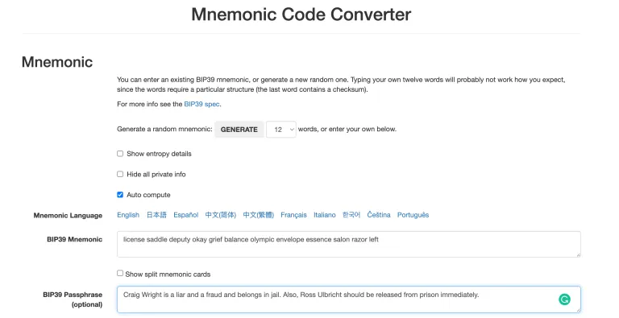

接下来，在 Electrum 中，前往 file –> new/restore 选单。输入一个唯一的名称以创建一个新钱包，然后单击 “next”。

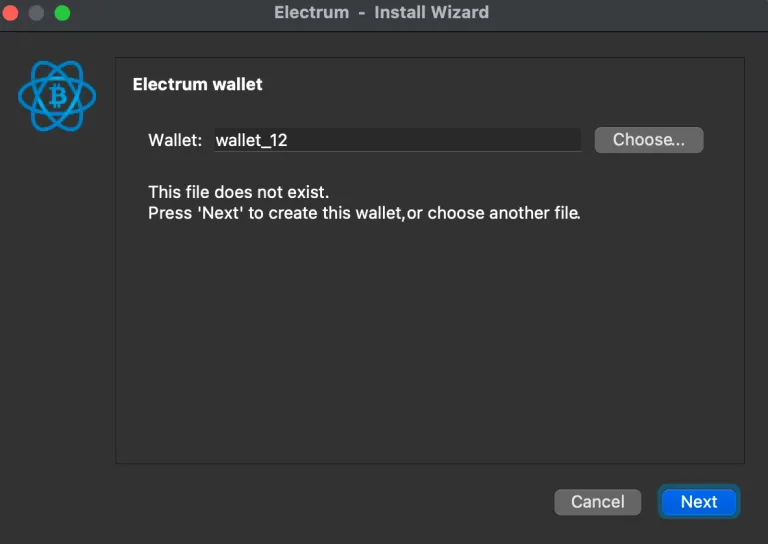

接下来的步骤您现在应该已经熟悉了，所以我将不附图片列出：

- Standard wallet（标准钱包）
- I already have a seed（我已经有了种子）
- 将 12 个单词复制粘贴到框中，或手动输入。
- 点击选项并选择 BIP39，同时点击密语复选框（“extend this seed with custom words”）
- 准确输入您在 Ian Coleman 页面上输入的密语
- 保留默认的脚本语义和派生路径
- 无需添加密码（锁定钱包）

现在返回 Ian Coleman 网站，下滑到 “derivation path” 部分，点击 “BIP 84” 标签，以选择与Electrum 中的默认脚本语义相同的选项（原生 Segwit）。

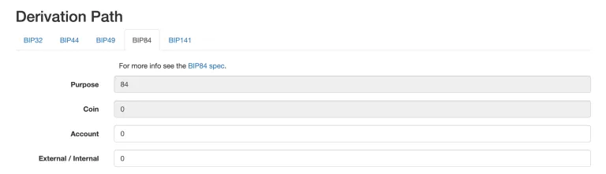

扩展的私钥和公钥就在下面，当您对派生路径（或页面上方的任何其他内容）进行更改时，它们会发生变化。

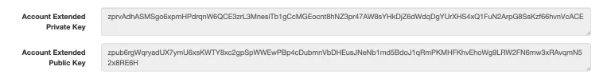

您还会看到 “BIP32 extended private/public”——现在先忽略这些。

账户扩展私钥可以用来完全重新生成您的钱包。然而，账户扩展公钥只能生成同一个钱包的有限版本（观察钱包）——如果您将这个密钥放入 Electrum，它仍然会产生种子或扩展私钥会有的全部 86 亿个地址，但 Electrum将没有可用的私钥，所以无法进行消费。现在让我们来演示一下：

复制 “account extended public key” 到剪贴板。

然后转到 Electrum，保持我们创建的当前钱包打开，然后转到文件-->新建/恢复。创建钱包的过程与之前有些不同：

- 标准钱包
- 使用主密钥
- 将扩展公钥粘贴到框中并继续
- 无需输入密语；它已经是扩展公钥的一部分
- 无需输入脚本语义和派生路径
- 无需添加密码（锁定钱包）

钱包加载后，您应该会注意到加载的地址与之前输入助记词时完全相同。您还会注意到标题栏顶部显示 “watching wallet”。此钱包可以显示您的地址和余额（通过节点检查余额），但您无法签署交易（因为监控钱包没有私钥）。

那么它的意义何在呢？

其中一个原因（并非主要原因）是，您可以在电脑上查看您的钱包及其余额，而无需将私钥暴露给电脑上的任何恶意软件。

另一个原因是，如果您选择将私钥保存在电脑之外，则必须使用硬件钱包才能进行支付；我来解释一下：

> 硬件钱包 (HWW)** 的设计初衷是让设备能够安全地存储您的私钥（使用 PIN 码锁定），永远不会将密钥暴露给电脑（即使通过数据线连接到电脑），并且设备本身也无法连接到互联网。这样的设备无法自行进行交易，因为所有比特币交易都始于引用区块链（位于节点上）上的 UTXO。钱包必须指定 UTXO 所在的交易 ID，以及要花费的交易输出。只有在指定输入之后，才能创建新的交易，更不用说签名了。硬件钱包无法创建交易，因为它们无法访问任何UTXO——它们没有连接到任何东西！
通常会从硬件钱包（HWW）中提取扩展公钥，然后将地址显示在计算机上——许多人都熟悉 Ledger 软件或Trezor Suite，它们会在计算机上显示地址和余额——这就是监视钱包。这些程序可以创建交易，但它们无法签名。它们只能让连接到它们的硬件钱包对交易进行签名。硬件钱包从监视钱包获取新生成的交易，对其进行签名，然后将其发送回计算机，以便广播到节点。**硬件钱包本身无法广播交易**，广播是由其关联的监视钱包完成的。这样，两个钱包（计算机上的公钥钱包和硬件上的私钥钱包）就能协同工作，生成、签名并广播交易，同时确保私钥始终处于隔离状态，远离联网设备。

## 部分签名的比特币交易（PSBT）

交易可以先被创建并保存到文件中，之后重新加载、签名、保存，再次重新加载，最后广播出去——我并不是说每个人都需要这样做；这只是理论上可行的方法。

现在考虑一个 3/5 多签名钱包——钱包由 5 个私钥组成，需要其中 3 个私钥才能完成交易签名（点击此处了解更多关于多重签名钱包密钥的信息）。假设有 5 台不同的计算机，每台计算机都拥有这 5 个私钥中的一个。

计算机 1 可以生成并签名一笔交易。然后，它可以将交易保存到文件中，并通过电子邮件发送给计算机 2。计算机 2 可以签名，并可能将文件保存为二维码，然后通过 Zoom 会议将二维码发送给位于世界另一端的计算机 3。计算机 3 可以捕获二维码，将交易加载到 Electrum 中，并签名这笔交易。经过前两次签名后，该交易为 PSBT（部分签名的比特币交易）。经过第三次签名后，该交易即完成签名并生效，可以广播。

为了了解更多关于 PSBT 的信息，请参阅此指南。(https://armantheparman.com/psbt/)

## 将硬件钱包与 Electrum 配合使用

我写了一篇关于如何使用硬件钱包的指南，我认为对于硬件钱包新手来说非常重要。(https://armantheparman.com/using-hwws/)

这里还有关于如何将各种品牌的硬件钱包连接到 Sparrow 比特币钱包的指南。(https://armantheparman.com/hwws/)

这将是我第一篇关于如何将硬件钱包与 Electrum 配合使用的指南——我将使用 ColdCard 硬件钱包进行演示。本文并非 ColdCard 的详细指南，相关指南请见此处。本文仅介绍 Electrum 的相关要点。(https://armantheparman.com/cc/)

### 通过 micro SD 卡连接（物理隔离）

在通过 ColdCard 连接您的真实钱包之前，我希望您已经完成了之前的步骤，例如加载 Electrum 虚拟钱包并设置网络参数。

然后，将 SD 卡插入 ColdCard。我假设您已经创建了助记词。如果您使用密码短语访问钱包，请立即应用。向下滚动并选择 “Advanced/Tools –>Export Wallet –> Electrum Wallet” 选单。

您可以向下滚动并阅读消息。它总是会提示您选择 “1” 来输入一个非零账号（这是派生路径的一部分），但如果您按照我的建议操作，您还没有修改默认的派生路径，因此您不需要输入非零账号；只需点击勾选标记即可继续。

然后选择脚本语义。大多数人会选择 “Native Segwit”。

它会显示“Electrum钱包文件已写入”，并显示文件名。请记下文件名。

然后取出 micro SD 卡，并将其插入装有 Electrum 的电脑。

有些操作系统会在插入 microSD 卡时自动打开文件资源管理器。很多人会看到新出现的钱包文件并双击打开，然后疑惑为什么无法使用。这种设计并不理想。实际上，您必须忽略文件资源管理器（将其关闭），并使用Electrum 打开钱包文件：

打开 Electrum。如果它已经打开了其他钱包，请选择 “File”->“New”。我们要找的是这样的窗口：

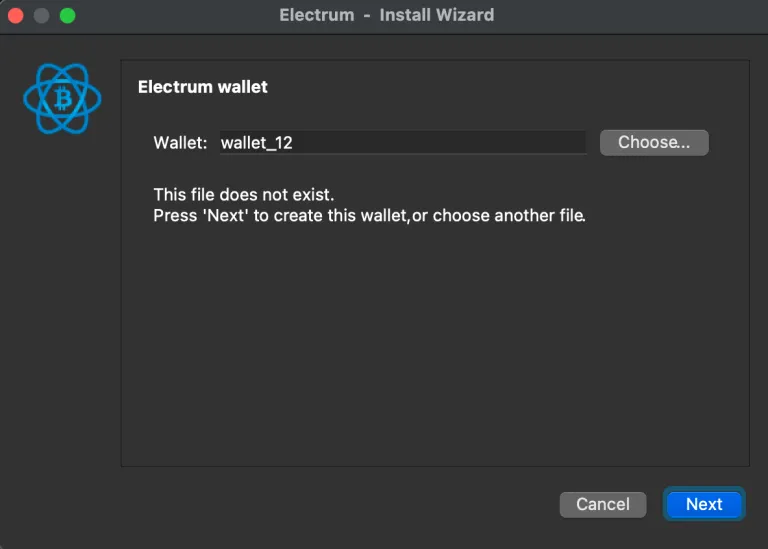

这里有个技巧，它不直观。点击“choose”。然后前往到 microSD 卡上的文件系统，找到钱包文件并打开它。

现在您已经打开了您的硬件钱包对应的观察钱包。

### 通过 USB 线缆连接。

这种方法应该更简单，但对于 Linux 计算机来说却要复杂得多。需要更新名为“Udev 规则”的设置。以下是具体操作方法（详细指南：https://armantheparman.com/gpg-articles/），简而言之：

建议先确保系统已更新。然后：

```bash
sudo apt-get install libusb-1.0-0-dev libudev-dev
```

然后...

```bash
python3 -m pip install ckcc-protocol
```

如果出现错误，请确保已安装 pip。您可以使用 `pip --version` 命令检查 Python 版本，也可以使用 `sudo apt install pythron3-pip` 命令安装 Python 3。

创建或修改现有文件 `/etc/udev/rules.d/`。

例如：

```bash
sudo nano /etc/udev/rules.d
```

文本编辑器将会打开。复制此处的文本并粘贴到 rules.d 文件中，保存并退出。

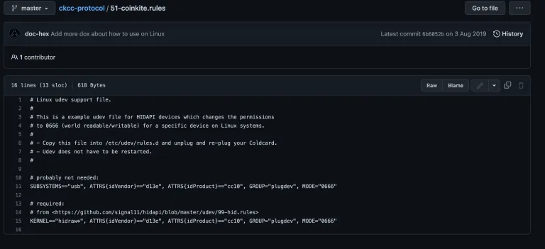

然后依次运行以下命令：

```bash
sudo groupadd plugdev
sudo usermod -aG plugdev $(whoami)
sudo udevadm control –reload-rules && sudo udevadm trigger
```

如果您收到 “group plugdev” 已存在的消息，请继续执行。执行第二个命令后，您将不会收到任何反馈/回复，只需继续执行第三个命令即可。

您可能需要断开 ColdCard 与电脑的连接，然后再重新连接。

如果经过以上步骤后仍然无法连接 ColdCard，建议您尝试更新固件（更新指南即将发布，但目前您可以在制造商网站上找到相关说明）。

接下来，创建一个新钱包：

- Standard wallet（标准钱包）
- Use a hardware device（使用硬件设备）
- 设备将扫描并检测您的 ColdCard。继续操作。
- 选择脚本和派生路径
- 决定是否应该加密钱包文件（推荐）

### 使用ColdCard进行交易

连接数据线后，交易非常便捷。签名过程也将无缝衔接。

如果以物理隔离的方式使用设备，则需要手动使用 microSD 卡在设备间传输已保存的交易记录。这里有一些技巧。

创建并完成交易后，您需要点击左下角的导出按钮。您会看到 “save to file” 选项，但请注意，这并非我们想要的操作。实际上，您需要先进入最后一个选单选项 “for hardware wallets”，然后在该选项中找到另一个 “save to file” 并选中它。之后，将文件保存到 microSD 卡，取出卡片并将其插入 ColdCard。请记住，您可能需要设置密码短语才能选择正确的钱包。屏幕将显示 “ready to sign”。点击勾选标记，检查交易，然后点击勾选标记确认。完成后，取出卡片并将其放回电脑。

接下来，我们需要使用 Electrum 打开交易记录。该功能隐藏在 “tools” -> “load transaction” 选单中。浏览文件系统并找到该文件。每次签名后都会生成三个文件：仅观察钱包创建的原始保存文件，以及 ColdCard 创建的两个文件（我不知道它为什么会这样做）。其中一个文件会显示 “signed”，另一个会显示 “final”。虽然不太直观，但 “signed” 文件没有用，我们需要打开 “final” 交易记录。

加载完成后，您可以点击 “broadcast”，即可完成支付。

## 更新 Electrum 和隐藏的 “.electrum” 目录

Electrum 在您的计算机上有两个位置。一个是应用程序本身，另一个是一个隐藏的配置文件夹。该文件夹的位置因操作系统而异：

Windows:

```bash
 C:/Users/your_user_name_goes_here/AppData/Roaming/Electrum
```

Mac:

```bash
/Users/your_user_name_goes_here/.electrum
```

Linux:

```bash
/home/your_user_name_goes_here/.electrum
```

请注意，在 Linux 和 Mac 系统中，“electrum”前面的 “.” 表示该目录是隐藏的。此外，请注意，此目录仅在您首次运行 Electrum 时（自动）创建。该目录包含 Electrum 配置文件以及您保存的所有钱包。

如果您从电脑中删除 Electrum 程序，除非您主动删除，否则隐藏目录仍会保留。

为了升级 Electrum，请按照我开头描述的步骤进行下载和验证。之后，您的电脑上将有两个程序副本，您可以运行其中任何一个——每个程序都会访问同一个隐藏的 Electrum 文件夹来进行配置和钱包访问。我们保存的所有内容，例如基本单元、要连接的默认节点、其他首选项以及钱包访问权限，都将保留，因为所有这些信息都保存在该文件夹中。

### 将您的 Electrum 和钱包移动到另一台计算机

为了完成此操作，您可以将程序文件复制到 U 盘，并复制 .electrum 目录。然后将它们复制或移动到新电脑。您无需再次验证程序。请务必将 .electrum 目录复制到默认位置（请记住在首次在该电脑上运行 Electrum 之前复制它，否则默认的 .electrum 文件夹将为空，您可能会感到困惑）。

## 标签

如前所述，在地址选项卡中有一个标签列。您可以双击该列并输入备注（这些备注仅存在于您的电脑上，不会公开，也不会上传到区块链）。

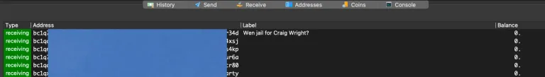

将 Electrum 钱包迁移到另一台电脑时，您可能不想丢失所有这些备注。您可以使用 wallet > labels > export 选单将它们备份到一个文件中，然后在新电脑上使用 wallet > labels > import 来恢复标签。

## 小贴士：

如果您觉得此资源有用，并且想支持我为比特币所做的工作，您可以捐赠一些聪（sats）：

静态闪电网络地址：dandysack84@walletofsatoshi.com
https://armantheparman.com/electrum/
