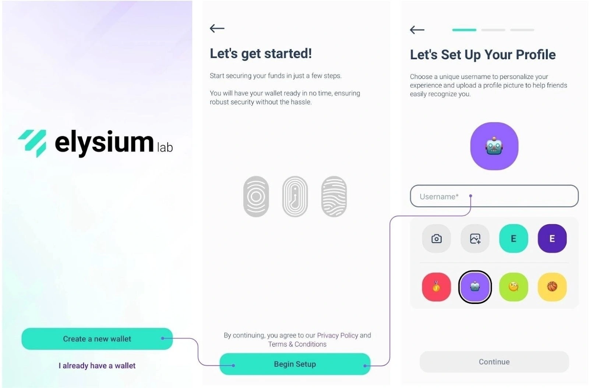

Elysium Wallet is the first non-custodial software wallet from Swiss startup Elysium Labs.

Thanks to the innovative key management system, you can access your digital assets using elements that are part of everyday life: your username, passkey, password or passcode.
That's right: it is no longer strictly necessary to use a Seed Phrase to regain access to your digital assets.
This simplification could accelerate the spread of Bitcoin around the world.

## How to Open an Account?
Download the Elysium Wallet App from the Apple Store or Google Play.
Open the Elysium Wallet app that you downloaded on your device.
Tap on "Create a new wallet".
A screen with the terms and conditions of use will appear.
To accept and proceed with the creation of your account, tap on "Begin Setup".
Enter your username.
The profile image is customizable: choose one from the options provided, by taking a photo or uploading an image from your device.
When you have chosen, tap "Continue".

Elysium stands out for its innovative multi-factor algorithm, which combines Passkey, PassCode and PassWord.
PassKeys are mandatory.
They allow you to authenticate quickly and securely using your device's built-in security features, such as Face ID or fingerprint scanning.
They are your main layer of protection, ensuring fast and secure access.

[Passkey](assets/passkey.webp)

Choose your second level: PassCode or PassWord
Next, you will need to choose a second level of security:

- PassCode: 6-digit code that is easy to remember. Perfect for adding an extra layer of protection.
- Password: Create a strong password of at least 8 characters, adding even more security.

You must use Passkeys in conjunction with a PassCode or PassWord.

[secondfactor](assets/secondfactor.webp)
Note: To set up your account, you need at least 2 factors, one of which must be the Passkey.

To further increase security, you can add a third layer of protection (Passkey + PassCode + PassWord).

Combination of layers for maximum security
You will always use Passkey as the primary factor. For the second layer, choose PassCode or PassWord.
If you have chosen PassCode as the second factor, you can add PassWord as the third layer or vice versa. This flexible approach ensures that your assets are protected according to your preferences.
You can add the third security factor during the setup phase (see images) or later by going to Settings > Improve security.

[thirdfactor](assets/thirdfactor.webp)

However, if you forget one of the factors, please note that:

If you have set up all three factors, you can always change or reset them from the settings.
Unfortunately, if you have only set up two factors and forget one, there is no recovery option.

We strongly recommend setting up all three factors from the beginning for maximum security and flexibility.

## How to receive a transaction?
Step 1: Open the Elysium app and go to the main menu. Tap 'Receive'.

[receive1](assets/receive1.webp)

Now, select the chain you want to receive payment on (Bitcoin or Polygon) and you can simply share the QR code of your Elysium wallet with the person who needs to pay you, they will take care of the rest.

## How to Receive a Transaction in Lightning Network?
STEP 1: By tapping “Request Payment” you request a Bitcoin payment via Lightning Network.

[requestpayment1](asset/requestpayment1)

Step 2: Enter the amount you want to request, select the currency you want to receive, and add a description if necessary.

[requestpayment2](asset/requestpayment2)

Note: There is a small fee for the first Lightning Network (LN) payment to open the LN channel. After that, all subsequent payments are free.

## How to send a transaction?
STEP 1: Go to the main menu and tap "Send".
[send1](assets/send1.webp)

STEP 2: Scan the recipient's QR code from their Elysium Wallet to automatically save their contact to your address book.
Alternatively, manually copy their address and paste it into the recipient field.
After selecting the recipient or adding them to your address book, tap "Send Payment".

[payment1](assets/payment1.webp)

Already have the contact? Choose it directly from the address book.

[addressbook1](assets/addressbook1.webp)

STEP 3: Enter the amount you want to send and select the asset you want to transfer.
For BTC transactions, you can select your preferred network speed and fees (as shown in the third image)

[payment2](assets/payment2.webp)

Your transaction has been submitted! You can easily check your Elysium Wallet's updated balance and transaction status.

## How to send a transaction in Lightning Network (LN)?
STEP 1: Tap "Scan" to open the scanner.
STEP 2: Scan the LN QR code for payment.
STEP3: Review the payment details and confirm everything is correct.
STEP4: Tap "Confirm" to complete the transaction.

[paymentLN1](assets/paymentLN1.webp)

## How to see the Seed Phrase?
Go to the main menu and tap "Hub". Select Settings and tap "Extract private key".

[extract1](assets/extract1.webp)

Log in with your passkey and enter your password and/or passcode.
The seed phrase will be displayed in 24-word format.

[seed1](assets/seed1.webp)

Don't share it with anyone!

## How to contact support?
Need help with Elysium Wallet? We're here to help!

Download the App.
Here's how you can contact our customer support team directly from the app:

1. Go to Hub
2. Tap Settings
3. Select Help

[help1](assets/help1.webp)

A form will appear where you can describe the issue you are experiencing.

Once submitted, our team will respond as soon as possible with a solution!

To report a bug or provide us with feedback, click on the widget on the home page:

[help2](assets/help2.webp)