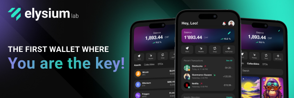

Elysium Wallet adalah dompet perangkat lunak non-kustodian pertama dari perusahaan rintisan Swiss, Elysium Labs.

Berkat sistem manajemen kunci yang inovatif, kamu bisa mengakses aset digitalmu lewat elemen yang sudah jadi bagian dari kehidupan sehari-hari: nama pengguna, kunci sandi, kata sandi, atau kode sandi. Benar, kamu nggak perlu lagi pakai seedphrase untuk mendapatkan kembali akses ke aset digitalmu. Penyederhanaan ini bisa mempercepat adopsi Bitcoin ke seluruh dunia.

## Bagaimana cara membuka akun?

Unduh aplikasi Elysium Wallet dari Apple Store atau Google Play, lalu buka aplikasi Elysium Wallet yang sudah kamu pasang di perangkatmu. Ketuk “Buat dompet baru”. Setelah itu akan muncul layar berisi syarat dan ketentuan penggunaan. Untuk menyetujui dan melanjutkan pembuatan akunmu, ketuk “Mulai Pengaturan”, lalu masukkan nama pengguna. Perlu dicatat, gambar profil bisa disesuaikan: kamu bisa pilih dari opsi yang tersedia, ambil foto baru, atau unggah gambar dari perangkatmu. Setelah memilih, ketuk “Lanjutkan”.

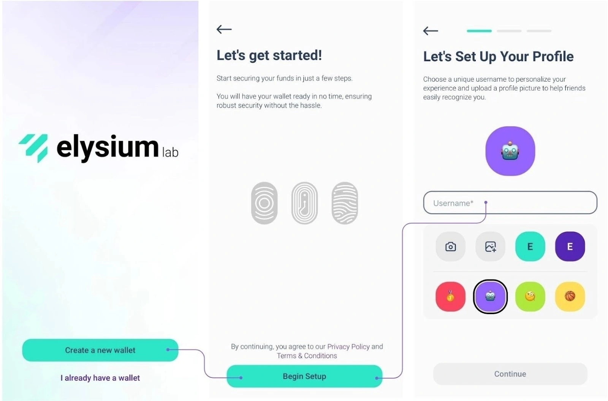

Elysium menonjol berkat algoritma multi-faktornya yang inovatif, yang menggabungkan Passkey, Passcode, dan Password. Passkey bersifat wajib. Kunci ini memungkinkan kamu melakukan autentikasi dengan cepat dan aman lewat fitur keamanan bawaan perangkatmu, seperti Face ID atau pemindai sidik jari. Ini adalah lapisan perlindungan utamamu, yang memastikan akses tetap cepat dan aman.

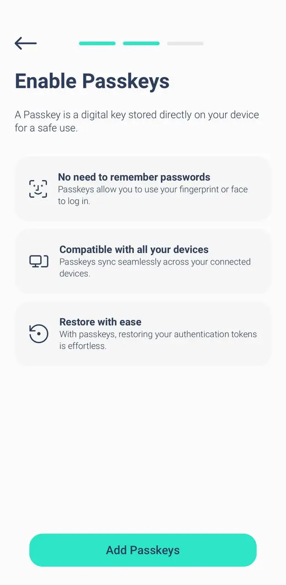

Pilih tingkat kedua: PassCode atau PassWord; selanjutnya, kamu harus memilih tingkat keamanan kedua:

- PassCode: kode 6 digit yang mudah diingat. Sempurna untuk menambahkan lapisan perlindungan ekstra.
- Kata Sandi: Buat kata sandi yang kuat, minimal 8 karakter, untuk menambah keamanan.

Kamu harus menggunakan Passkey bersama dengan PassCode atau PassWord.

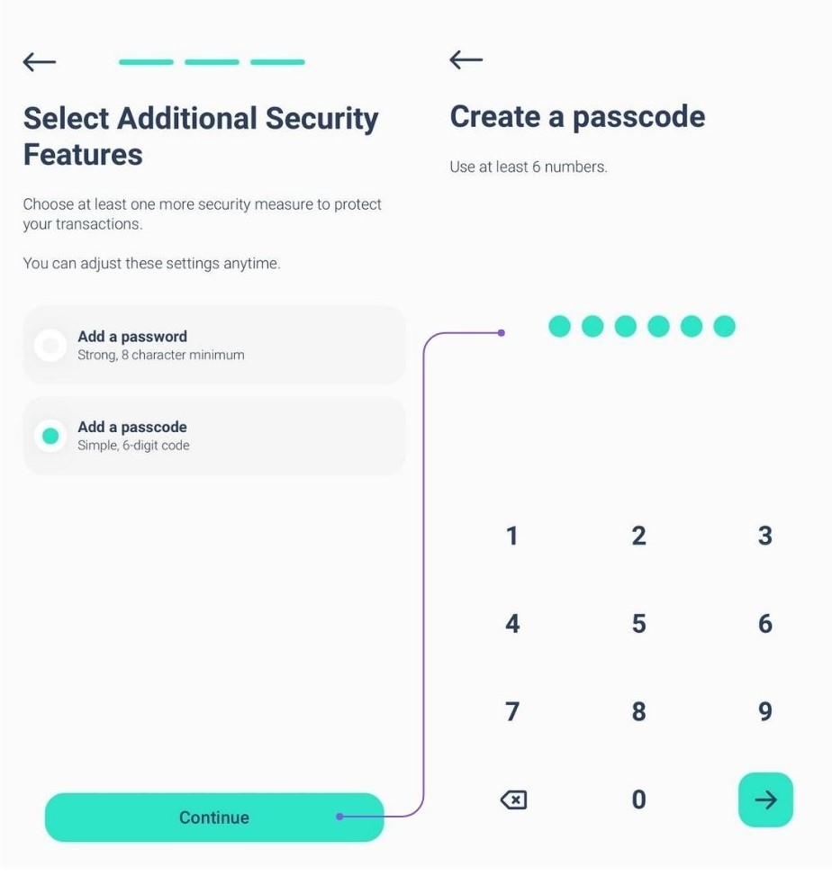

**Catatan:** Untuk mengatur akun kamu, Anda memerlukan setidaknya 2 faktor, salah satunya harus berupa Passkey.

Untuk lebih meningkatkan keamanan, kamu dapat menambahkan lapisan perlindungan ketiga (Passkey + PassCode + PassWord).

Kombinasi lapisan untuk keamanan maksimum

Kamu akan selalu menggunakan Passkey sebagai faktor utama. Untuk lapisan kedua, pilih PassCode atau PassWord.

Jika kamu telah memilih PassCode sebagai faktor kedua, kamu bisa menambahkan PassWord sebagai lapisan ketiga atau sebaliknya. Pendekatan yang fleksibel ini memastikan bahwa aset kamu terlindungi sesuai dengan preferensimu.

Kamu dapat menambahkan faktor keamanan ketiga selama tahap penyiapan (lihat gambar) atau setelahnya dengan membuka Pengaturan > Tingkatkan keamanan.

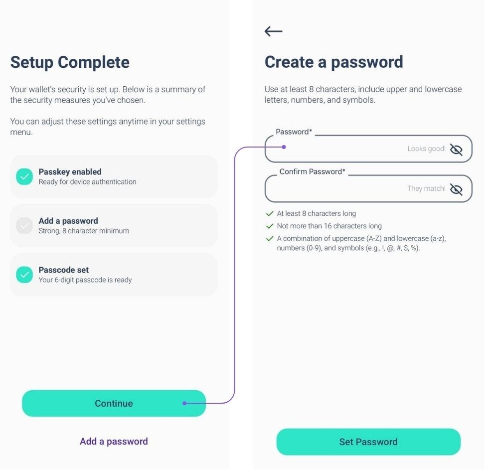

Namun demikian, jika kamu melupakan salah satu faktor, harap diperhatikan:

Kalau kamu sudah menyiapkan ketiga faktor tersebut, kamu selalu dapat mengubah atau mengatur ulang dari pengaturan.

Sayangnya, kalau kamu hanya menyiapkan dua faktor dan lupa satu faktor, tidak ada opsi pemulihan.

Kami sangat menyarankan untuk menyiapkan ketiga faktor tersebut dari awal untuk keamanan dan fleksibilitas maksimum.

## Bagaimana cara menerima transaksi?

Buka aplikasi Elysium dan masuk ke menu utama, lalu Ketuk 'Terima'.

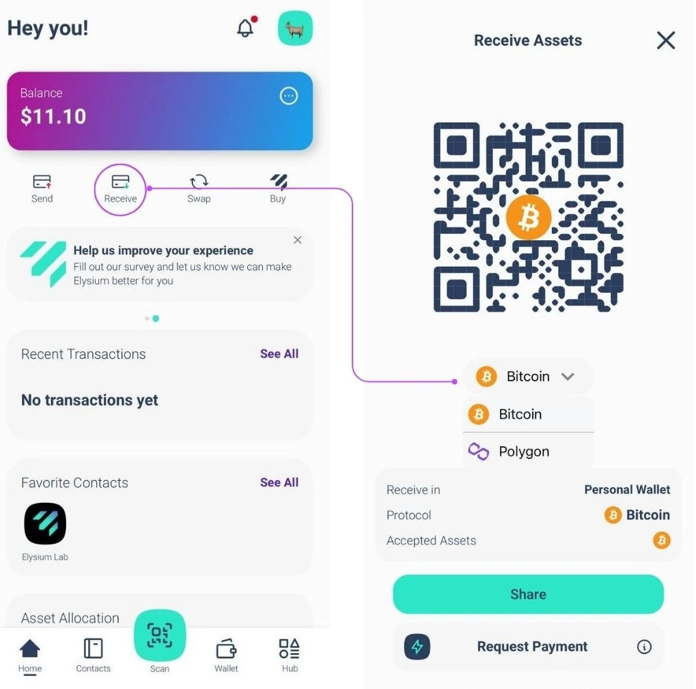

Sekarang, pilih rantai yang kamu inginkan untuk menerima pembayaran (Bitcoin atau Polygon) dan kamu cukup membagikan kode QR dompet Elysium kamu kepada orang yang perlu membayar, mereka akan mengurus sisanya.

## Bagaimana Cara Menerima Transaksi di Jaringan Lightning?

**Langkah 1:** Dengan mengetuk "Minta Pembayaran", kamu meminta pembayaran Bitcoin melalui Lightning Network.

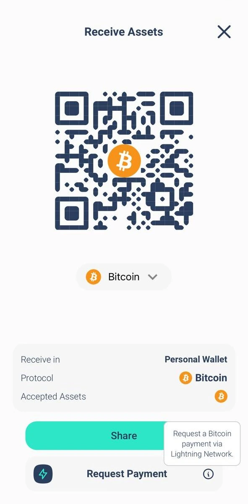

**Langkah 2:** Masukkan jumlah yang ingin kamu minta, pilih mata uang yang ingin kamu terima, dan tambahkan deskripsi jika perlu.

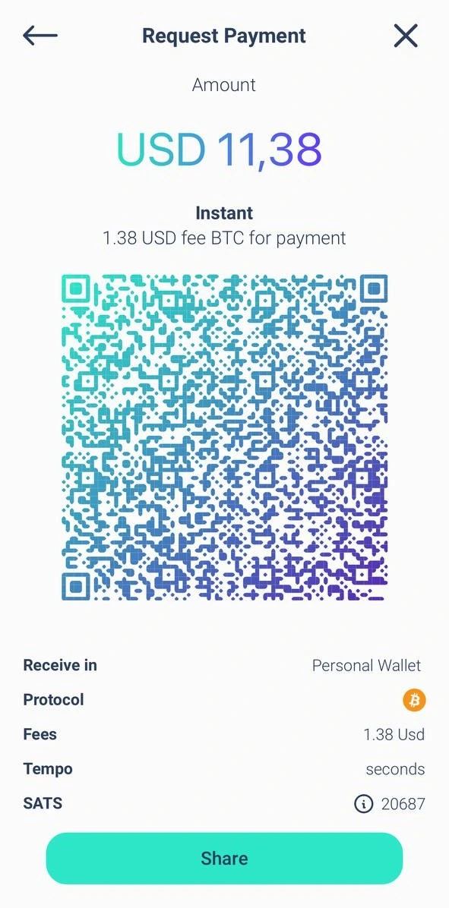

**Catatan:** Ada sedikit biaya untuk pembayaran Lightning Network (LN) pertama untuk membuka saluran LN. Setelah itu, semua pembayaran berikutnya gratis.

## Bagaimana cara mengirim transaksi?

**Langkah 1:** Buka menu utama dan ketuk "Kirim".

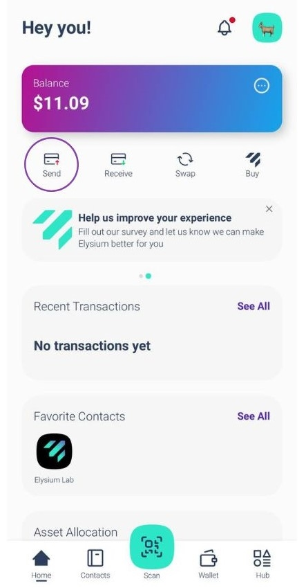

**Langkah 2:** Pindai kode QR penerima dari Dompet Elysium mereka untuk secara otomatis menyimpan kontak mereka ke buku alamat Anda. Atau, salin alamat mereka secara manual dan tempelkan ke kolom penerima. Setelah memilih penerima atau menambahkannya ke buku alamat kamu, ketuk "Kirim Pembayaran".

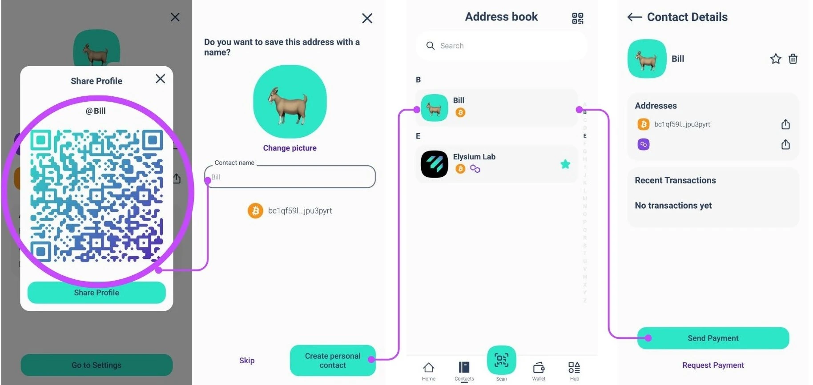

Sudah memiliki kontak? Pilih langsung dari buku alamat.

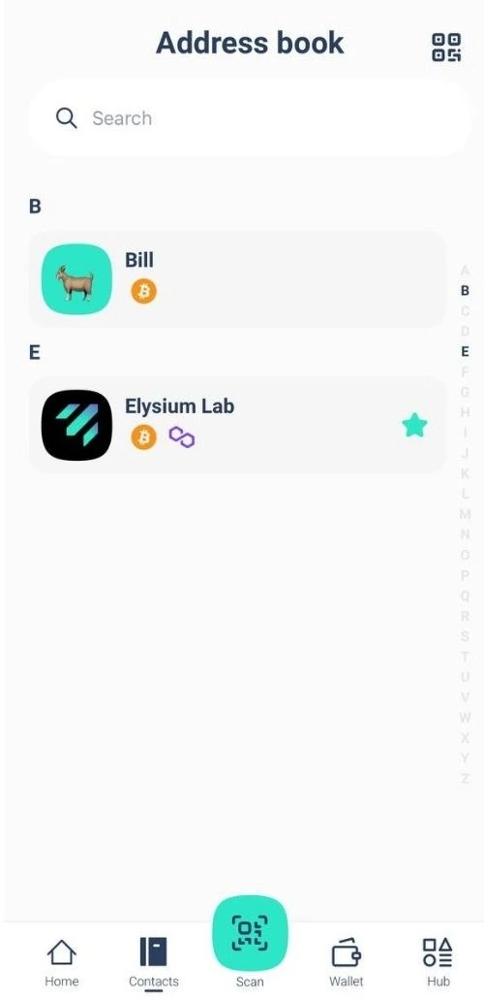

**Langkah 3:** Masukkan jumlah yang ingin kamu kirim dan pilih aset yang ingin kamu transfer.

Untuk transaksi BTC, kamu bisa memilih kecepatan jaringan dan biaya yang kamu inginkan (seperti yang ditunjukkan pada gambar ketiga)

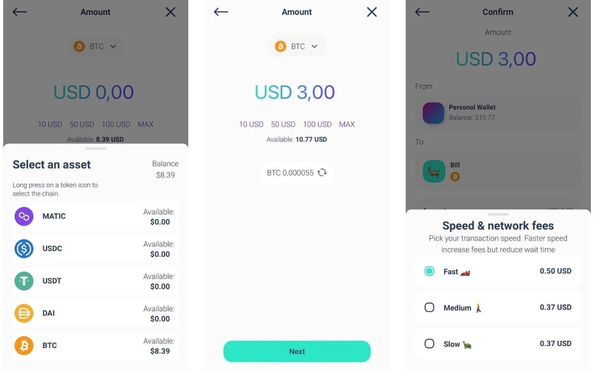

Transaksi kamu telah dikirimkan! Kamu dapat dengan mudah memeriksa saldo dan status transaksi Elysium Wallet kamu yang telah diperbarui.

## Bagaimana cara mengirim transaksi di Lightning Network?

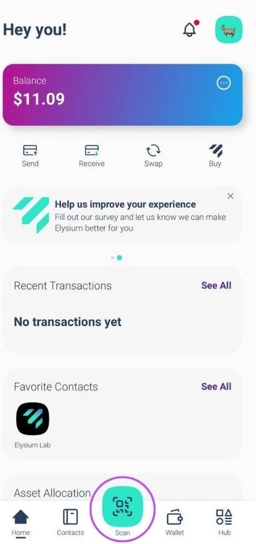

**Langkah 1:** Ketuk "Pindai" untuk membuka pemindai.

**Langkah 2:** Pindai kode QR LN untuk pembayaran.

**Langkah 3:** Tinjau kembali detail pembayaran dan pastikan semuanya sudah benar.

**Langkah 4:** Ketuk "Konfirmasi" untuk menyelesaikan transaksi.

## Bagaimana cara melihat Frasa Benih?

Buka menu utama dan ketuk "Hub". Pilih Pengaturan dan ketuk "Ekstrak kunci pribadi".

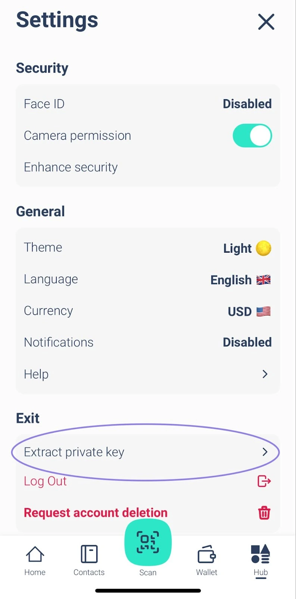

Masuk dengan kunci sandi dan masukkan kata sandi dan/atau kode sandi kamu. Seedphrase akan ditampilkan dalam format 24 kata.

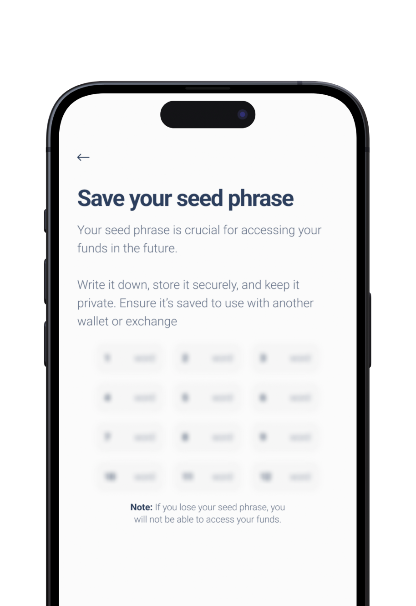

Jangan bagikan dengan siapa pun!

## Bagaimana cara menghubungi dukungan?

Butuh bantuan dengan Elysium Wallet? Kami siap membantu!

Unduh Aplikasi, dan berikut ini cara kamu dapat menghubungi tim dukungan pelanggan kami secara langsung dari aplikasi:

1. Pergi ke Hub

2. Ketuk Pengaturan

3. Pilih Bantuan

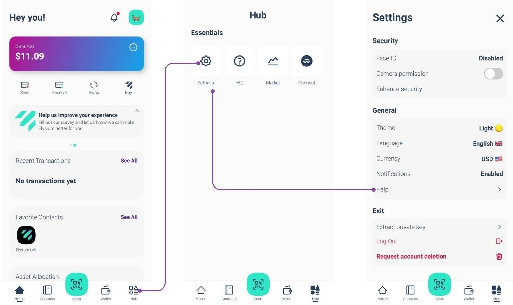

Sebuah formulir akan muncul di mana Anda dapat menjelaskan masalah yang Anda alami.

Setelah diajukan, tim kami akan merespons sesegera mungkin dengan solusi!

Untuk melaporkan bug atau memberikan umpan balik kepada kami, klik widget di halaman beranda:

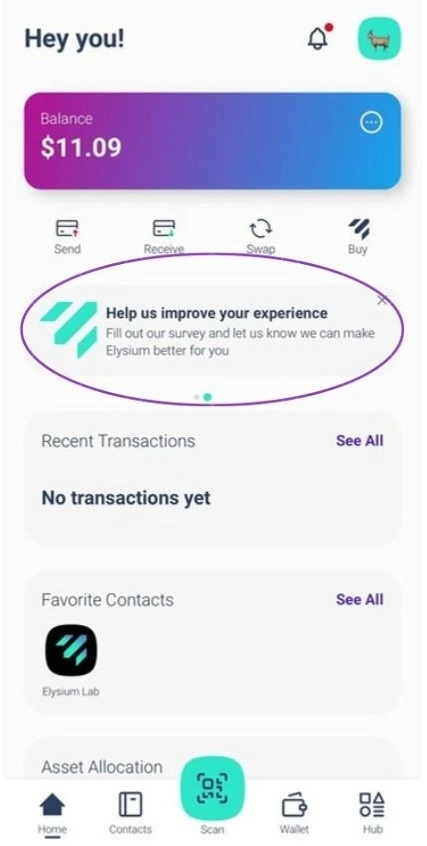
