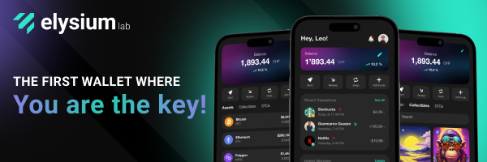

Elysium Wallet è il primo software wallet non-custodial della startup svizzera Elysium Labs.

Grazie all'innovativo sistema di gestione delle chiavi, è possibile accedere ai propri asset digitali utilizzando elementi che fanno parte della vita di tutti i giorni: il nome utente, la passkey, la password o il passcode.
Esatto: non è più strettamente necessario utilizzare una Seed Phrase per riaccedere ai propri asset digitali.
Questa semplificazione potrebbe accellerare la diffusione di Bitcoin nel mondo.

## Come Aprire un Account?
Scarica l'App Elysium Wallet dall'Apple Store o da Google Play.
Apri l'Elysium Wallet app che hai scaricato sul tuo dispositivo.
Premi su "Create a new wallet".
Apparirà una schermata con i termini e le condizioni d'uso.
Per accettare e procedere con la creazione del tuo account, clicca su "Begin Setup".
Inserisci il tuo nome utente.
L'immagine profilo è personalizzabile: scegline una tra le opzioni fornite, scattando una fotografia o caricando una immagine dal dispositivo.
Quando hai scelto, premi "Continue".

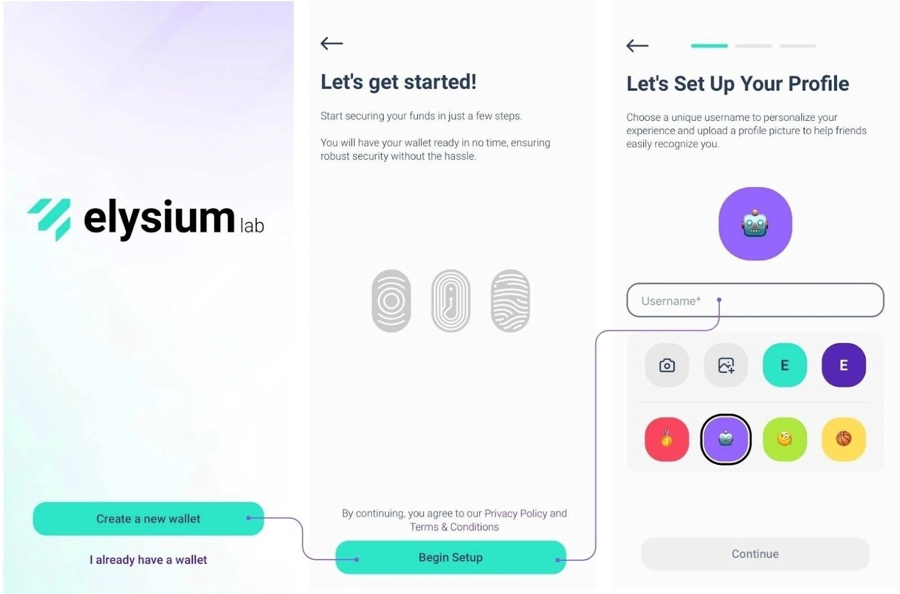

Elysium si distingue per il suo innovativo algoritmo multifattoriale, che combina Passkey, PassCode e PassWord.
Le PassKey sono obbligatorie.
Ti consentono di autenticarti in modo rapido e sicuro utilizzando le funzionalità di sicurezza integrate del tuo dispositivo, come Face ID o la scansione delle impronte digitali.
Sono il tuo principale livello di protezione, garantendo un accesso rapido e sicuro.

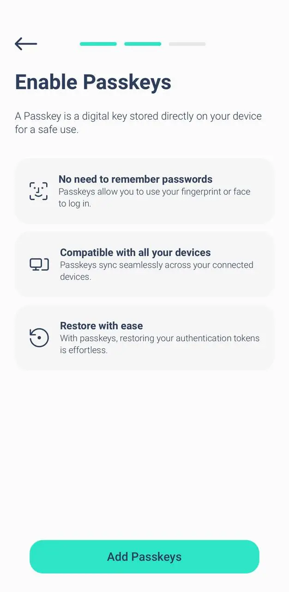

Scegli il tuo secondo livello: PassCode o PassWord
Successivamente, dovrai scegliere un secondo livello di sicurezza:

- PassCode: codice di 6 cifre facile da ricordare. Perfetto per aggiungere un ulteriore livello di protezione.
- Password: crea una password robusta di almeno 8 caratteri, aggiungendo ancora più sicurezza.

Devi usare le Passkey insieme ad un PassCode o ad una PassWord.

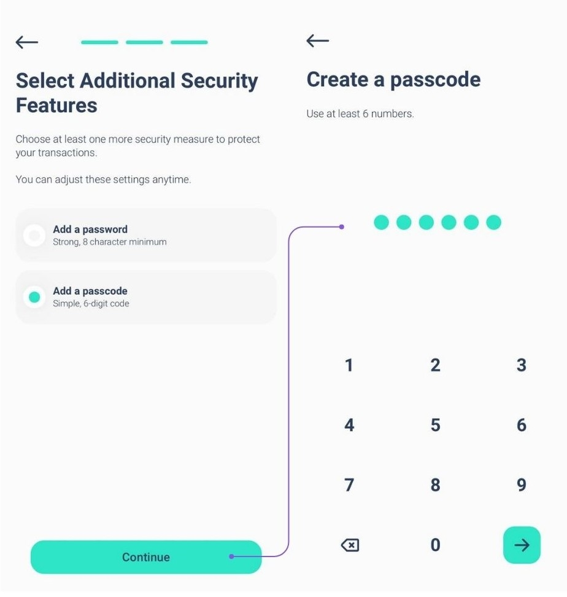
Nota: per configurare il tuo account, hai bisogno di almeno 2 fattori, uno dei quali deve essere la passkey.

Per aumentare ulteriormente la sicurezza, puoi aggiungere un terzo livello di protezione (Passkey + PassCode + PassWord).

Combinazione di livelli per la massima sicurezza
Utilizzerai sempre Passkey come fattore primario. Per il secondo livello, scegli PassCode o PassWord.
Se hai scelto PassCode come secondo fattore, puoi aggiungere PassWord come terzo livello o viceversa. Questo approccio flessibile assicura che i tuoi asset siano protetti in base alle tue preferenze.
Puoi aggiungere il terzo fattore di sicurezza durante la fase di configurazione (vedi immagini) o in un secondo momento andando su Impostazioni > Migliora sicurezza.

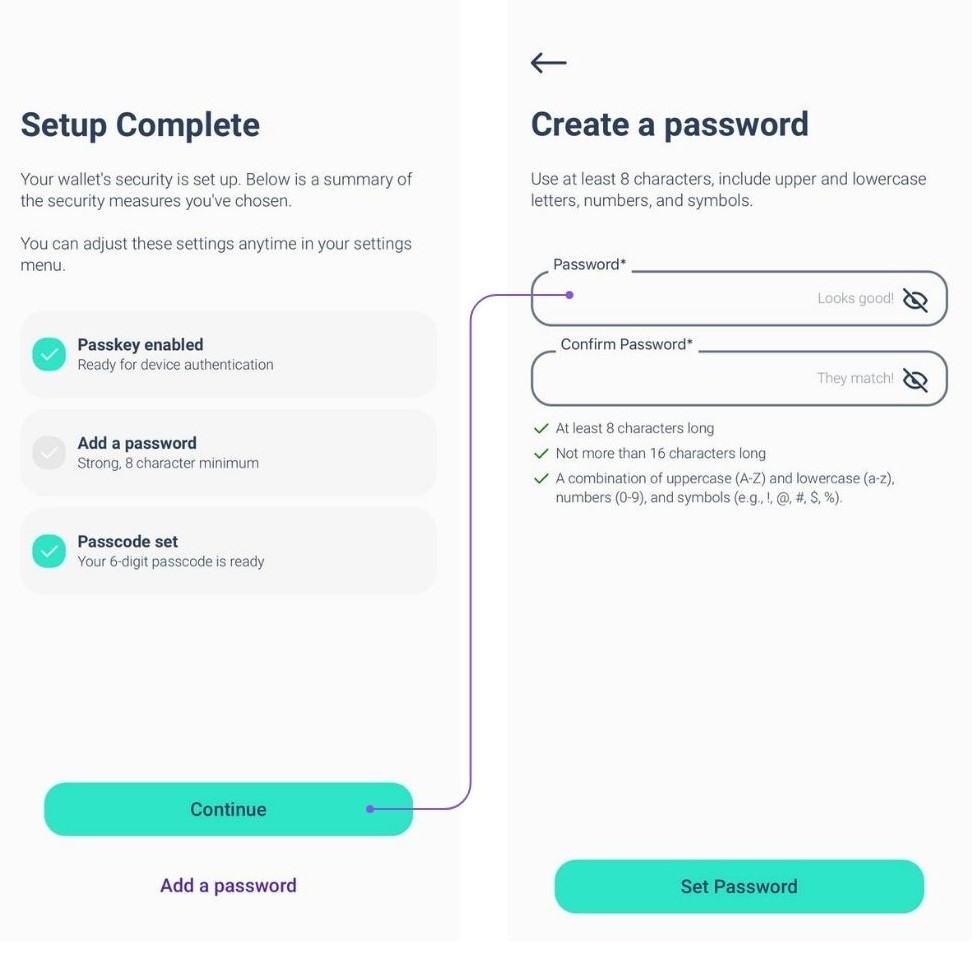

Tuttavia, se dimentichi uno dei fattori, tieni presente che:

Se hai impostato tutti e tre i fattori, puoi sempre modificarli o reimpostarli dalle impostazioni.
Purtroppo, se hai impostato solo due fattori e ne dimentichi uno, non è disponibile alcuna opzione di ripristino.

Consigliamo vivamente di impostare tutti e tre i fattori fin dall'inizio per garantire la massima sicurezza e flessibilità.

## Come ricevere una transazione?
Fase 1: Apri l'app Elysium e vai al menu principale. Tocca 'Ricevi'.

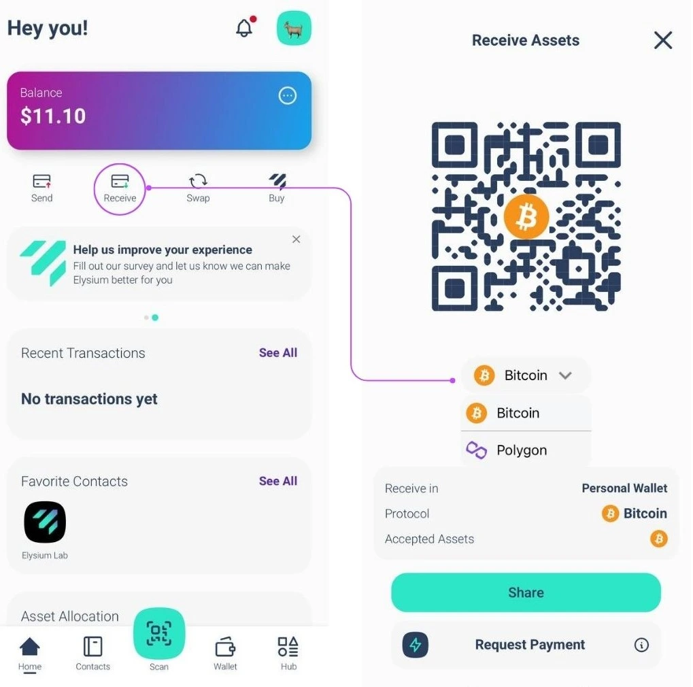

Ora, seleziona la catena su cui vuoi ricevere il pagamento (Bitcoin o Polygon) e puoi semplicemente condividere il codice QR del tuo portafoglio Elysium con la persona che deve pagarti, loro si occuperanno del resto.

## Come ricevere una transazione in Lightning Network?
STEP 1: toccando "Richiedi pagamento" richiedi un pagamento Bitcoin tramite Lightning Network.

Passaggio 2: inserisci l'importo che desideri richiedere, seleziona la valuta che desideri ricevere e aggiungi una descrizione, se necessario.

Nota: è richiesta una piccola commissione per il primo pagamento Lightning Network (LN) per aprire il canale LN. Dopodiché, tutti i pagamenti successivi saranno gratuiti.

## Come inviare una transazione?
STEP 1: Vai al menu principale e tocca "Invia".

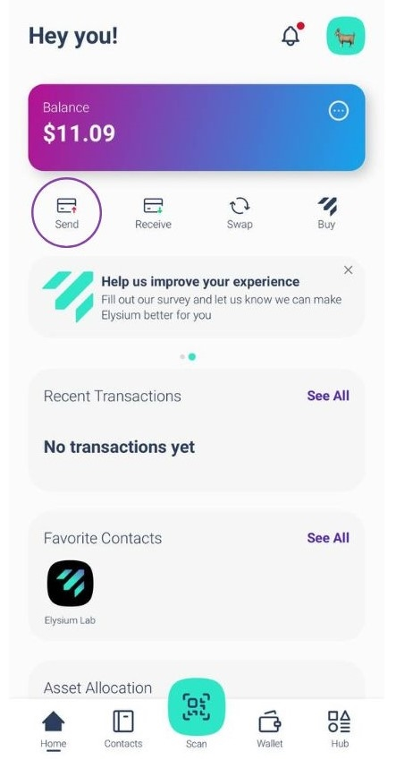

STEP 2: Scansiona il codice QR del destinatario dal suo Elysium Wallet per salvare automaticamente il suo contatto nella tua rubrica.
In alternativa copia manualmente il suo indirizzo e incollarlo nel campo del destinatario.
Dopo aver selezionato il destinatario o averlo aggiunto alla tua rubrica, tocca "Invia pagamento".

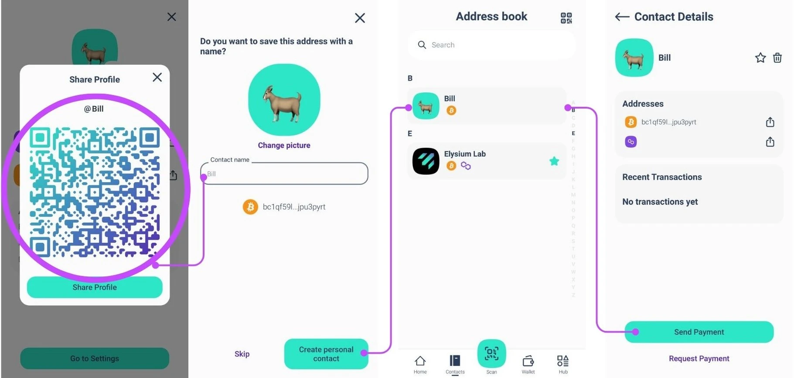

Hai già il contatto? Sceglilo direttamente dalla rubrica.

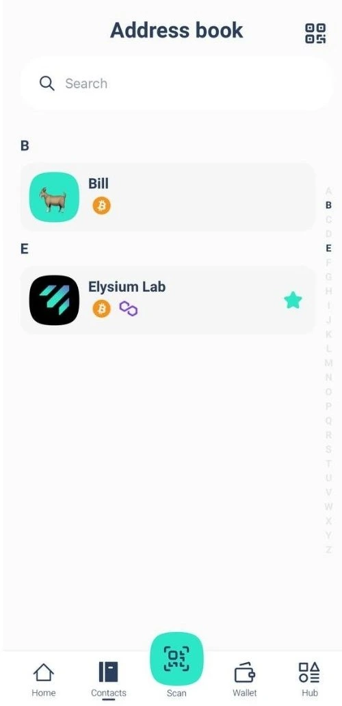

STEP 3: Inserisci l'importo che desideri inviare e seleziona l'asset che desideri trasferire.
Per le transazioni BTC, puoi selezionare la velocità e le commissioni di rete preferite (come mostrato nella terza immagine)

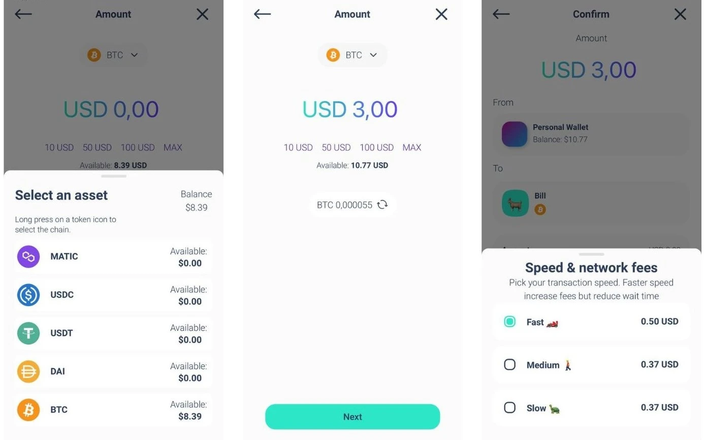

La tua transazione è stata inoltrata! Puoi facilmente controllare il saldo aggiornato e lo stato della transazione del tuo Elysium Wallet.

## Come inviare una transazione in Lightning Network (LN)?
STEP 1: Tocca "Scansiona" per aprire lo scanner.
STEP 2: Scansiona il codice QR LN per il pagamento.
STEP3: Rivedi i dettagli del pagamento e conferma che tutto sia corretto.
STEP4: Tocca "Conferma" per completare la transazione. 

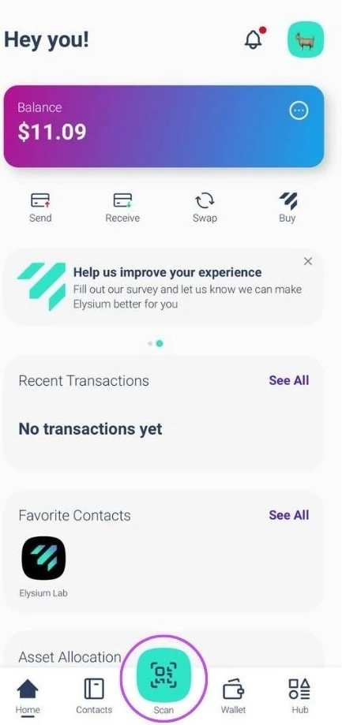

## Come vedere la Seed Phrase?
Vai al menu principale e tocca "Hub". Seleziona Settings e tocca "Extract private key".

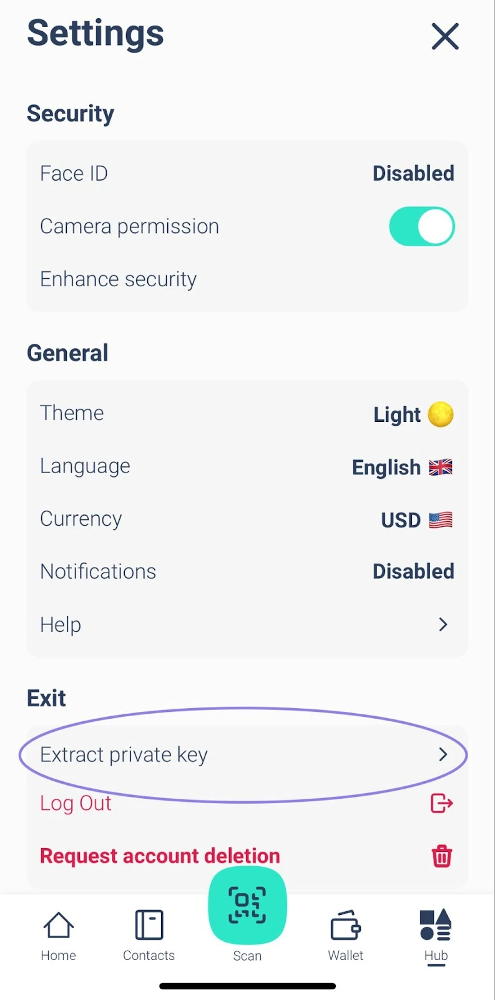

Accedi con la tua passkey e inserisci la tua password e/o il tuo passcode.
Verrà visualizzata la frase seed in formato 24 parole.

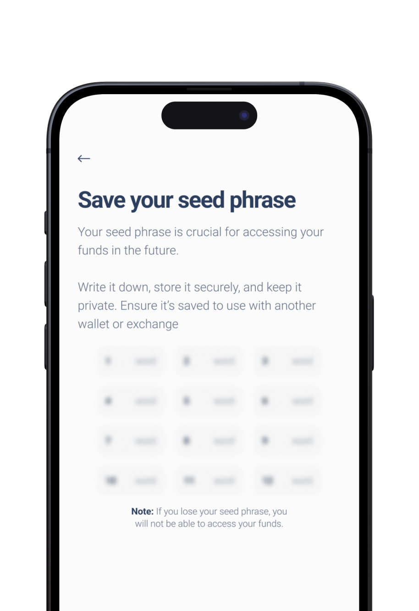

Non condividerla con nessuno!

## Come contattare il supporto tecnico?
Hai bisogno di assistenza con Elysium Wallet? Siamo qui per aiutarti!

Scarica l'App.
Ecco come puoi contattare il nostro team di assistenza clienti direttamente dall'app:

1. Vai su Hub
2. Tocca Impostazioni
3. Seleziona Aiuto

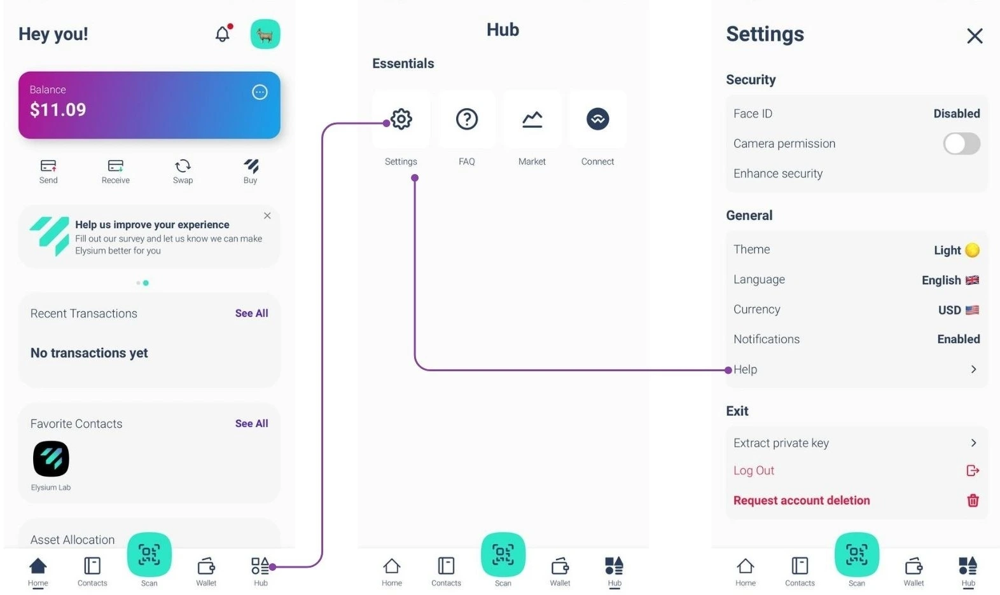

Apparirà un modulo in cui puoi descrivere il problema riscontrato.

Una volta inviato, il nostro team risponderà il prima possibile con una soluzione!

Per segnalare un bug o fornirci un feedback, clicca sul widget nella home page:

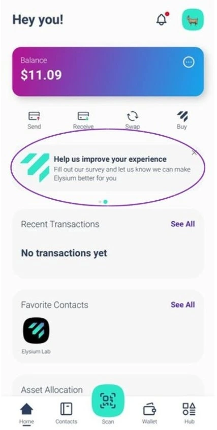