Di seluruh dunia, berbagai inisiatif, komunitas, dan ekonomi sirkular mulai bermunculan di sekitar Bitcoin untuk menjawab masalah spesifik yang dihadapi masyarakat. Dalam tutorial ini, kita akan bahas salah satu inisiatif itu, yaitu Fedi Wallet. Fedi bukan cuma sekadar dompet, tapi juga sebuah ekosistem lengkap yang bisa disesuaikan sesuai kebutuhan komunitas kamu.

## Memulai dengan Fedi Wallet

Fedi Wallet adalah aplikasi seluler yang tersedia di Android (Google Play Store) dan iOS (Apple Store), yang menyatukan seluruh ekosistem fitur yang dapat disesuaikan untuk memenuhi kebutuhan komunitas Anda.

⚠️ Sangat penting untuk mengunduh dan menginstal Fedi Wallet lewat platform resmi supaya aplikasi yang kamu pakai benar-benar terjamin keandalan dan keasliannya.

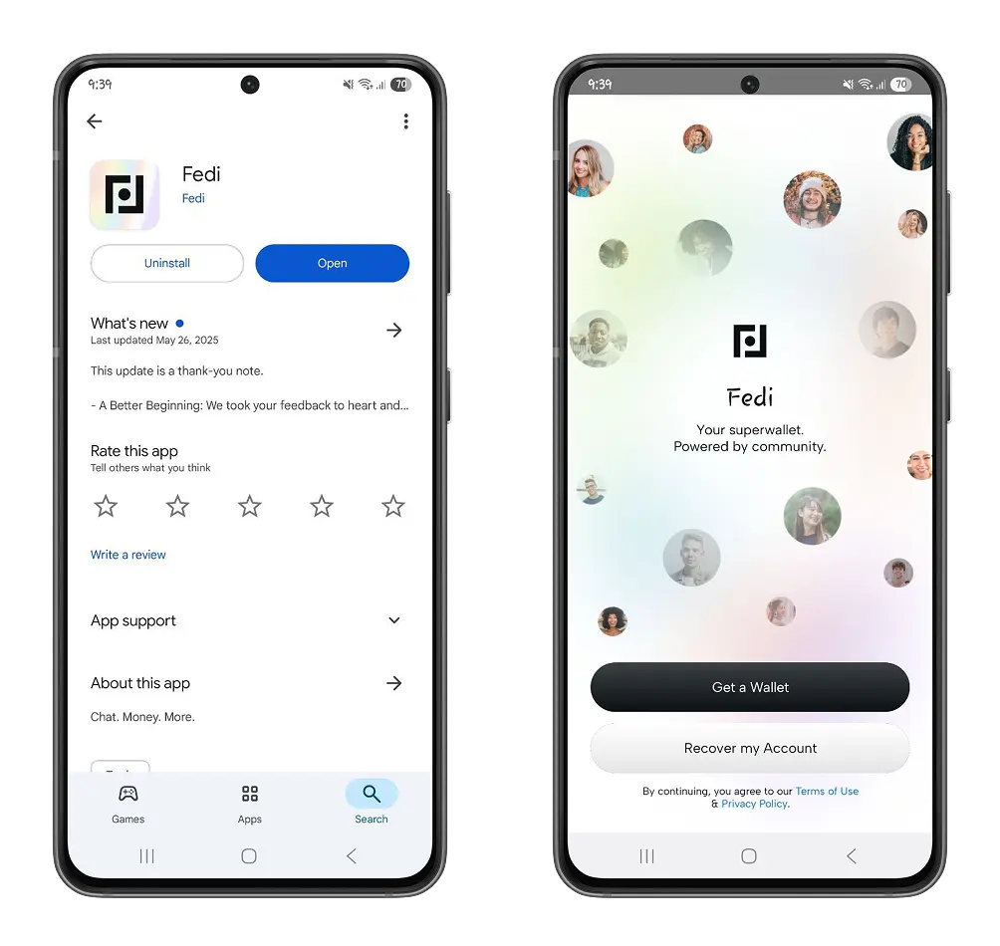

Fedi Wallet adalah dompet Bitcoin yang hadir dengan pendekatan baru dalam menyimpan benih kamu. Biasanya ada dua pilihan yang bisa kamu ambil ketika memilih dompet Bitcoin:

- Kustodian**: Kamu memutuskan untuk menaruh kepercayaan pada entitas eksternal, yaitu pengembang dompet, yang akan menyimpan kata pemulihan untuk dompet Bitcoin kamu. Dalam hal ini, kamu nggak punya akses atau kemampuan untuk mengekspor dompet Bitcoin milikmu sendiri.

https://planb.network/tutorials/wallet/mobile/wallet-of-satoshi-39149d86-e42b-4e8f-ae9f-7e061e7784f7

https://planb.network/tutorials/wallet/mobile/speed-wallet-8715e454-1720-4a7f-8c1d-3da02cf67312

- Kustodian mandiri**: Aplikasi ini langsung ngasih kamu akses ke kata pemulihan begitu kamu membuat dompet. Jadi, kamu bisa dengan bebas mengekspor bitcoin ke dompet yang paling cocok buat kamu.

https://planb.network/tutorials/wallet/mobile/blue-wallet-2f4093da-6d03-4f26-8378-b9351d0dbc90

https://planb.network/tutorials/wallet/desktop/sparrow-c674e2ac-d46f-4c82-92a7-7d1b0e262f5d

Sebagai gantinya, Fedi Wallet menawarkan pendekatan federasi, yang memungkinkan kamu bergabung dengan sekelompok orang yang kamu percaya untuk mengelola kunci dompet kamu. Kamu bisa ikut federasi populer yang direkomendasikan Fedi, atau gabung ke federasi lokal di komunitas kamu dengan cara memindai kode QR atau menempelkan kode undangan federasi.

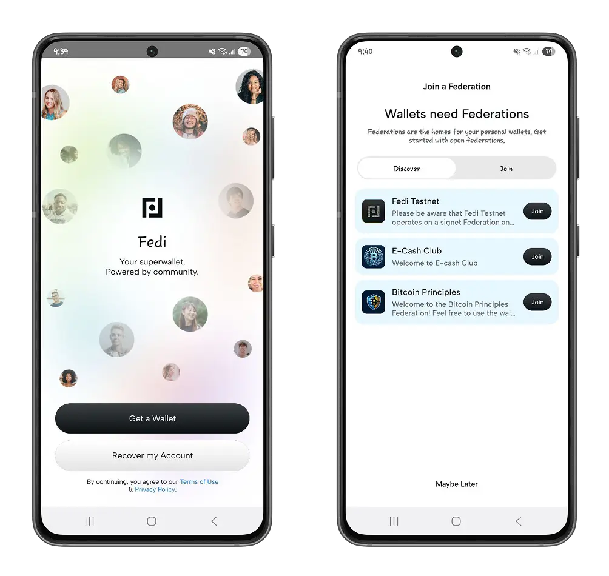

⚠️ Sebaiknya simpan hanya jumlah minimum yang sanggup kamu tanggung, karena ada kemungkinan federasi nggak aktif atau ditutup dengan jeda 30 hari sebelum akhirnya dihapus.

Namun, federasi ini nggak menghalangi kamu untuk tetap punya kunci pribadi dompet kamu.

Setelah kamu membuat dompet dan bergabung dengan federasi, di informasi profil pada bagian **Cadangan Pribadi**, kamu akan menemukan 12 kata benih dari dompet kamu.

Cari tahu lebih lanjut tentang rekomendasi cadangan kata pemulihan dari kami:

https://planb.network/tutorials/wallet/backup/backup-mnemonic-22c0ddfa-fb9f-4e3a-96f9-46e2a7954270

Untuk setiap federasi yang kamu ikuti, Fedi memisahkan bitcoin kamu dengan membuat dompet yang terpisah.

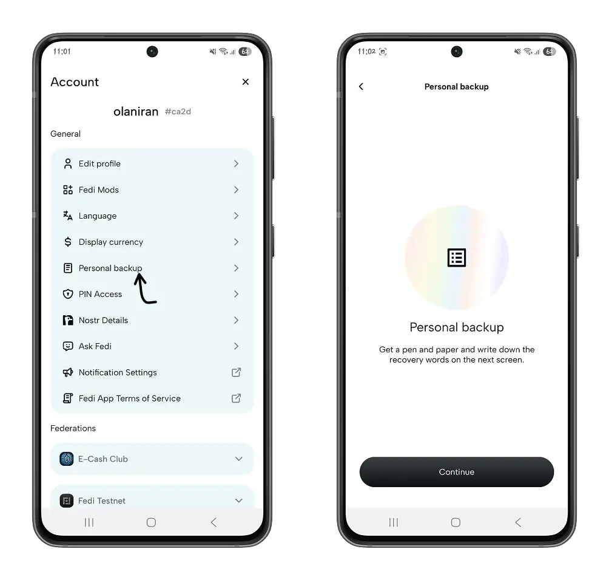

### Berdagang di Fedi

Tergantung pada konfigurasi federasi yang kamu ikuti, mungkin ada batasan pada saldo dan penggunaan bitcoin kamu. Setiap federasi di Fedi memang punya ambang batas saldo dan pengeluaran, dan itu bisa kamu lihat langsung di profil kamu.

Pada menu **Federasi**, gulir ke bawah ke federasi, lalu klik **Detail Federasi** untuk mengetahui ambang batas yang telah ditetapkan.

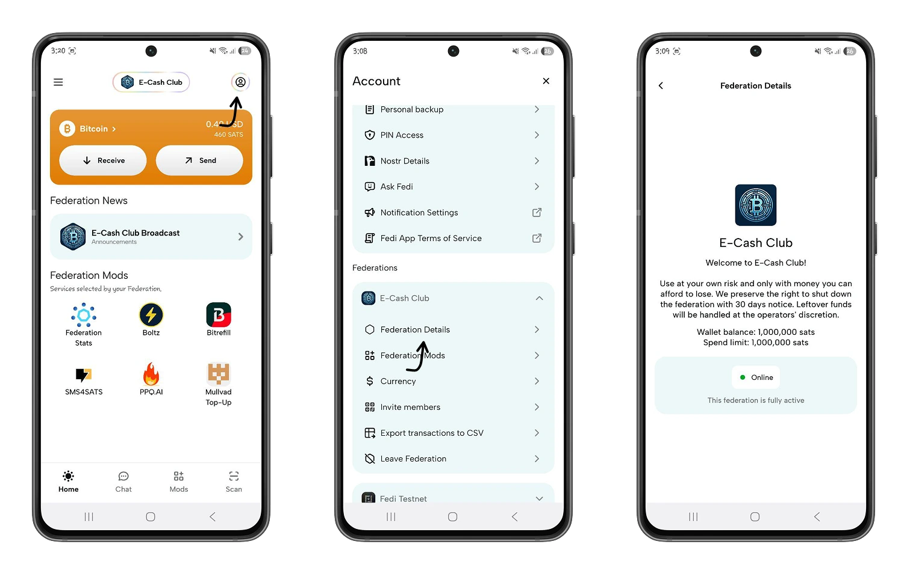

- Menerima bitcoin di Fedi**: Di halaman beranda, pilih federasi yang mau kamu pakai untuk menerima bitcoin, lalu klik tombol Terima untuk membuat Lightning Invoice sesuai jumlah yang akan kamu terima.

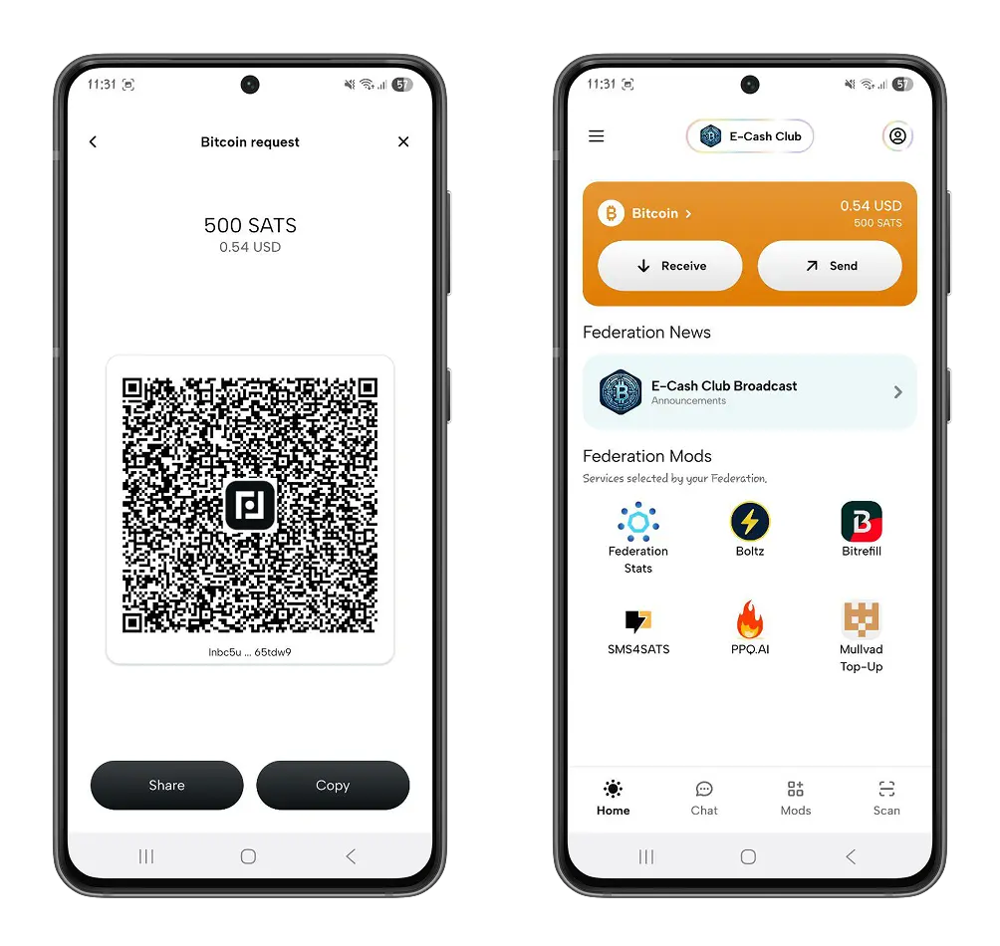

- Kirim bitcoin**: Di halaman beranda, klik tombol **Kirim** untuk mengirim bitcoin ke Lightning Address, membayar Invoice, atau melakukan pembayaran offline.

Salah satu fitur spesial dari Fedi Wallet adalah kemampuannya untuk digunakan secara offline. Kamu nggak lagi butuh Wi-Fi atau koneksi internet yang stabil, karena kamu bisa membelanjakan bitcoin kapan saja dan di mana saja.

Dengan pembayaran offline, kamu bisa membelanjakan bitcoin di dalam federasi kamu, sekaligus meningkatkan privasi dan interaksi keuanganmu.

Klik **Kirim offline** dan tentukan jumlah satoshi yang ingin kamu kirim.

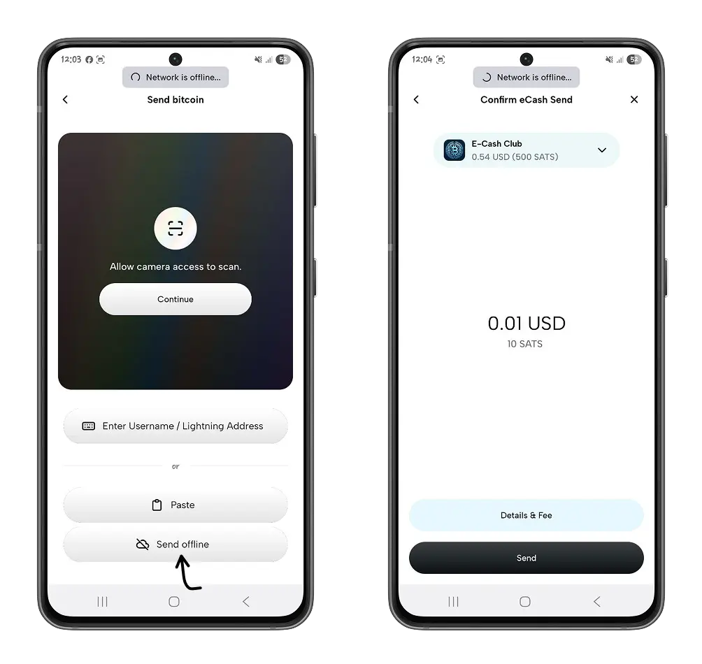

Penerima harus memindai kode QR yang dihasilkan untuk mengklaim satoshi.

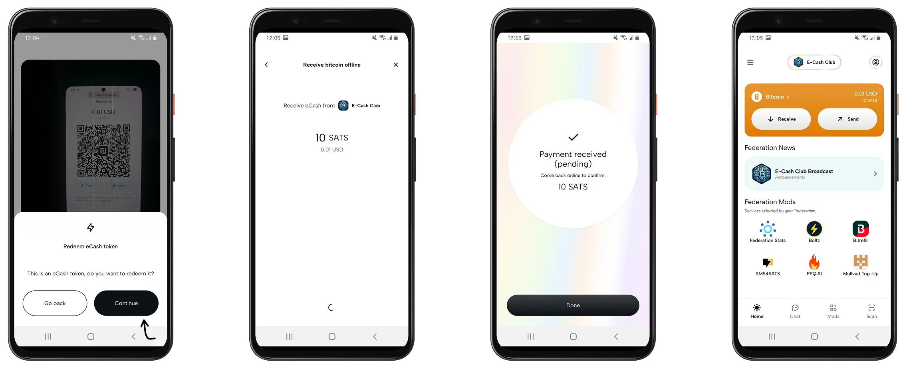

Pembayaran offline biasanya dilakukan dengan menggunakan [e-cash] (https://planb.network/resources/glossary/ecash-david-chaum). Transaksi disimpan di ponselmu, dan segera setelah kamu mengakses Internet, konfirmasi transaksi menjadi otomatis. Kamu juga dapat mengonfirmasi pembayaran secara manual dengan mengklik **Konfirmasi transaksi**.

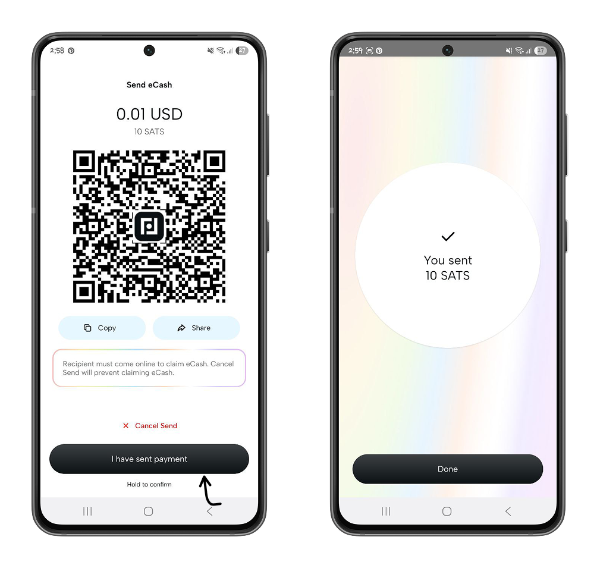

## Exchange pada Fedi

Fedi punya fitur pesan instan di menu **Chat**, yang memungkinkan kamu ngobrol, melakukan pembayaran, dan berbagi media dengan sesama pengguna Fedi, baik di dalam maupun di luar komunitas kamu. Untuk mulai diskusi dengan pengguna Fedi, cukup masukkan login mereka atau pindai kode QR yang ada di profil mereka.

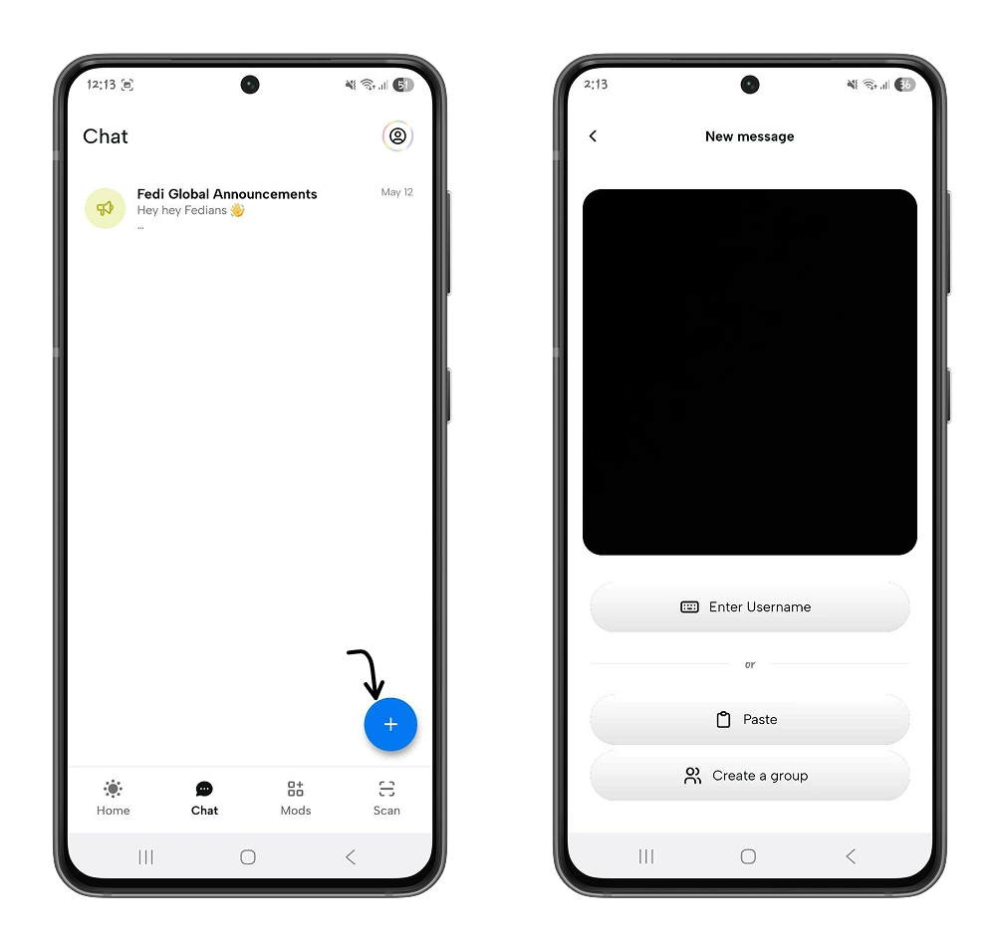

Kamu bisa langsung kirim satoshi ke pengguna ini tanpa harus keluar dari percakapan, cukup klik **ikon Wallet** lalu atur jumlah satoshi yang mau dikirim.

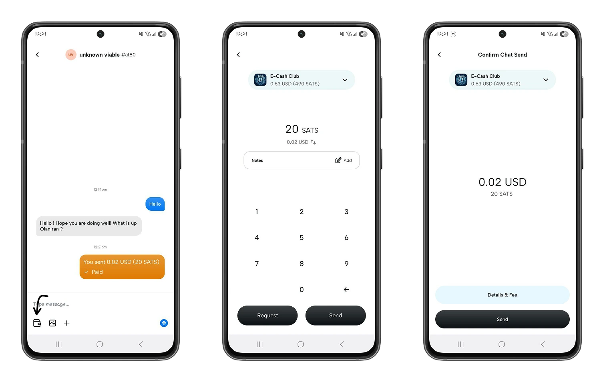

## Modul

Menu modular Fedi memungkinkan kamu menemukan aplikasi terbaik yang digunakan oleh komunitasmu.

Dalam menu **Mods**, Anda akan menemukan aplikasi seperti :

- Isi ulang bit
- 
https://planb.network/tutorials/exchange/centralized/bitrefill-8c588412-1bfc-465b-9bca-e647a647fbc1

- Peta BTC: Temukan bisnis lokal yang menerima bitcoin.

Kamu juga bisa menambahkan aplikasi sendiri dengan klik ikon Plus, lalu memindai atau menyimpan URL situs web yang mau kamu tambahkan secara manual.

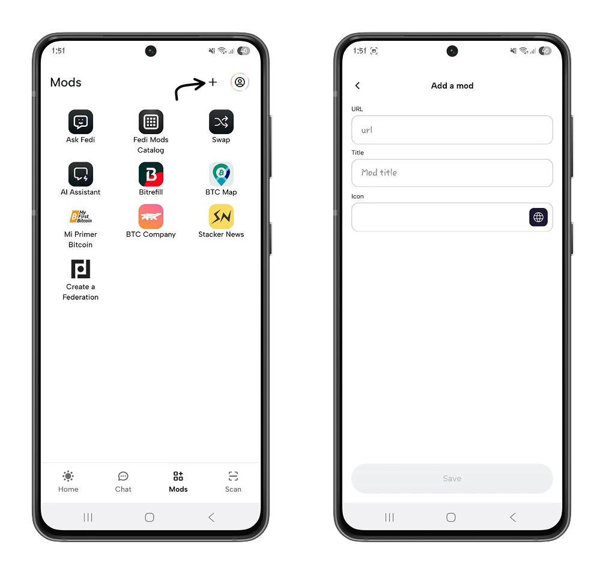

Di halaman beranda, kamu juga bakal menemukan modul-modul terpopuler dalam federasimu.

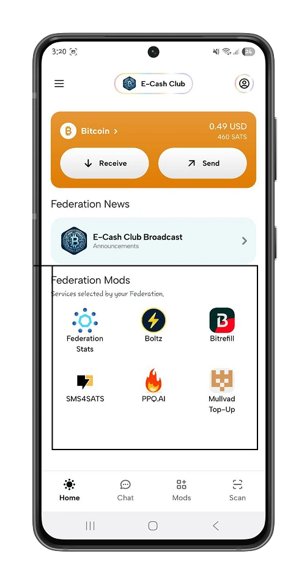

Pada menu **Mods**, Anda dapat meminta pembuatan federasi sendiri untuk komunitas Anda.

Klik modul **Buat Federasi,** lalu mulai proses pembuatan federasi kamu. Pembuatan federasi yang divalidasi oleh Fedi melibatkan sesi pelatihan pendampingan yang dipandu oleh Mentor Bitcoin dan tim Fedi, di mana para inisiator bisa mendiskusikan tujuan komunitas mereka serta detail implementasi federasi. Tujuan utama dari program ini adalah menyaring inisiatif federasi supaya penggunaan Bitcoin di komunitas benar-benar konstruktif.

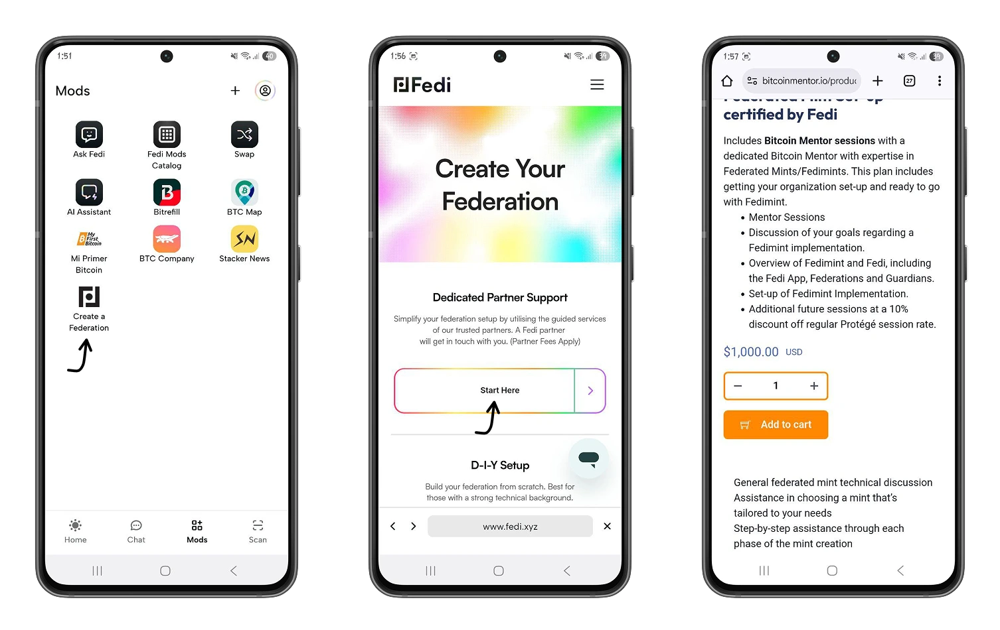

Kamu baru saja menyelesaikan tur Fedi Wallet, dan sekarang kamu sudah siap untuk memanfaatkan potensi penuh dari dompet ini di komunitas kamu. Kalau kamu menikmati tutorial ini, kami yakin kamu juga bakal suka dengan tutorial tentang Blink (sebelumnya Bitcoin Beach), sebuah inisiatif dompet Bitcoin yang awalnya dirancang untuk membangun dan mengembangkan ekonomi sirkular Bitcoin di El Salvador.

https://planb.network/tutorials/wallet/mobile/blink-7ea5f5a4-e728-4ff9-b3f9-cf20aa6fc2bd

