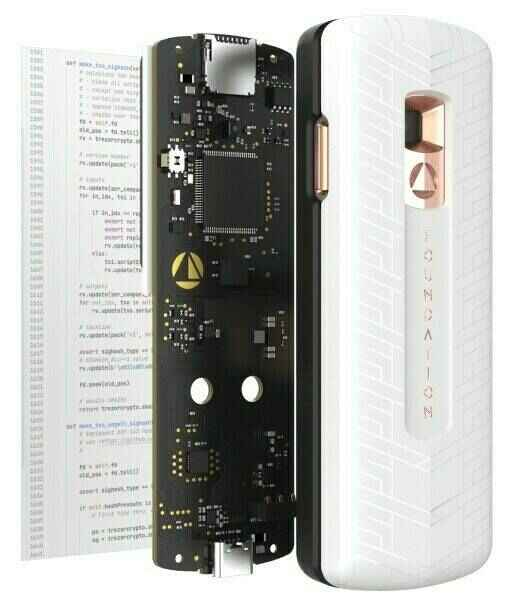

# Fondation

L'auto-garde est enfin accessible avec le portefeuille matériel Passport et le portefeuille mobile Envoy. https://foundationdevices.com/

Caractéristiques clés

- Cryptomonnaies prises en charge : Bitcoin via PSBT (transactions Bitcoin partiellement signées) ; expérience multisig de premier ordre.
- Portefeuilles logiciels pris en charge : Bitcoin Core, BlueWallet, BTCPay, Casa, Electrum, Nunchuk, Simple Bitcoin Wallet, Sparrow, Specter, Wasabi et autres portefeuilles prenant en charge les PSBT via microSD ou codes QR.
- Composants clés : processeur STM, élément sécurisé Microchip, Cameracube Omnivision.
- Communication : caméra et port microSD. Pas de données USB, pas de Bluetooth, pas de communications sans fil d'aucune sorte.
- Batterie lithium-ion 1200 mAh amovible par l'utilisateur dans le format Nokia BL-5C (incluse avec l'achat).
- Fonctionnalités de sécurité : déconnecté du réseau, saisie facile de la phrase de passe, voyants de sécurité, mots anti-hameçonnage, validation de sécurité.

# Tutoriel vidéo

