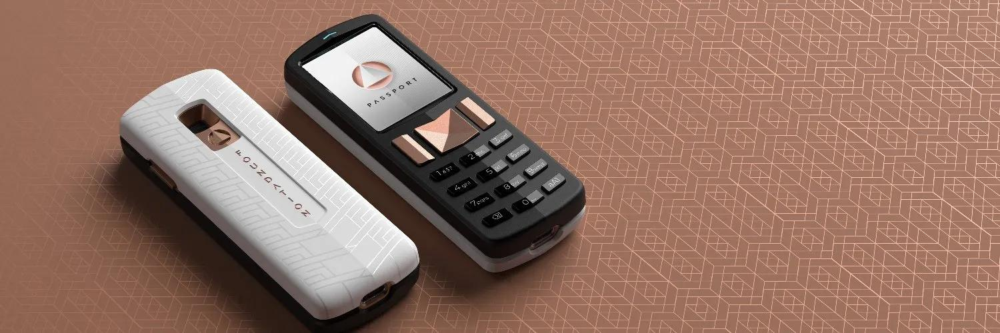

PassportハードウェアウォレットとEnvoyモバイルウォレットにより、ついに自己管理が実現します。https://foundationdevices.com/

主な仕様

- 対応暗号通貨：PSBT（部分的に署名されたBitcoinトランザクション）経由のBitcoin；最高クラスのマルチシグ体験。
- 対応ソフトウェアウォレット：Bitcoin Core、BlueWallet、BTCPay、Casa、Electrum、Nunchuk、Simple Bitcoin Wallet、Sparrow、Specter、Wasabi、およびmicroSDまたはQRコード経由でPSBTをサポートするその他のウォレット。
- 主要コンポーネント：STMプロセッサ、Microchipセキュアエレメント、Omnivision Cameracube。
- 通信：カメラとmicroSDポート。USBデータ、Bluetooth、あらゆる種類の無線通信はありません。
- 電源：ユーザーが取り外し可能な1200mAhリチウムイオンバッテリー、Nokia BL-5C形状（購入時に含まれています）。
- セキュリティ機能：エアギャップ、簡単なパスフレーズ入力、セキュリティライト、フィッシング対策用の単語、セキュリティ検証。

# チュートリアル動画

