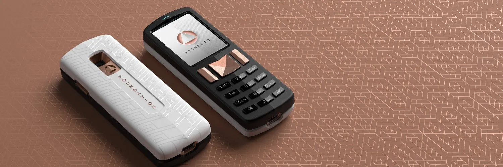

Tự quản lý tài sản đã trở nên dễ dàng với ví cứng Passport và ví di động Envoy. https://foundationdevices.com/

Thông Số Kỹ Thuật Chính

- Cryptocurrencies Được Hỗ Trợ: Bitcoin thông qua PSBTs (giao dịch Bitcoin được ký một phần); trải nghiệm multisig hàng đầu.
- Ví Phần Mềm Được Hỗ Trợ: Bitcoin Core, BlueWallet, BTCPay, Casa, Electrum, Nunchuk, Simple Bitcoin Wallet, Sparrow, Specter, Wasabi, và các ví khác hỗ trợ PSBTs qua microSD hoặc mã QR.
- Các Bộ Phận Chính: Bộ xử lý STM, yếu tố bảo mật Microchip, Omnivision Cameracube.
- Giao Tiếp: Camera và cổng microSD. Không có dữ liệu USB, không Bluetooth, không có giao tiếp không dây nào.
- Nguồn: Pin Lithium ion 1200 mAh có thể tháo rời của người dùng trong hình dạng Nokia BL-5C (được bao gồm khi mua).
- Tính Năng Bảo Mật: Không kết nối, nhập mật khẩu dễ dàng, đèn bảo mật, từ chống phishing, xác thực bảo mật.

# video hướng dẫn

