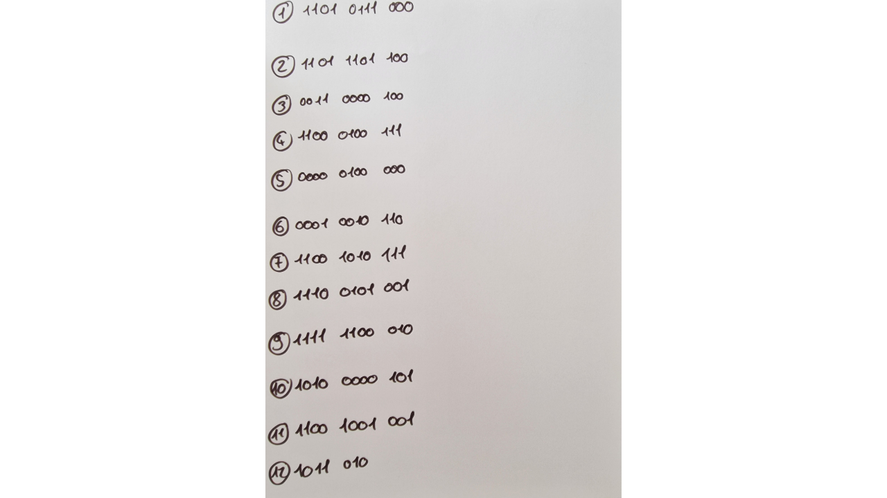
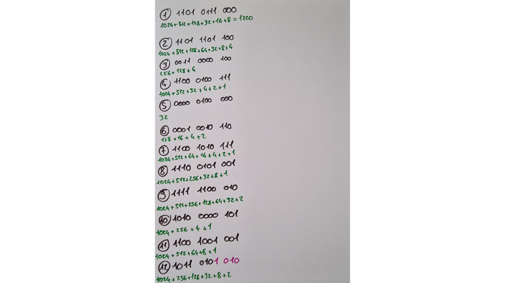
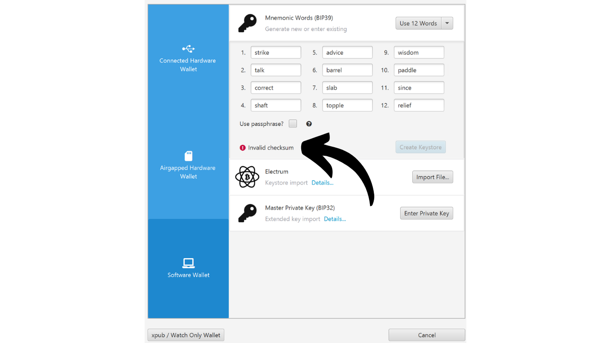

In this tutorial, you will learn how to manually construct a recovery phrase for a Bitcoin wallet using dice rolls.

**WARNING:** Generating a mnemonic phrase in a secure manner requires leaving no digital trace during its creation, which is almost impossible. Otherwise, the wallet would present a much too large attack surface, significantly increasing the risk of your bitcoins being stolen. **It is therefore strongly advised against transferring funds to a wallet that depends on a recovery phrase you have generated yourself.** Even if you follow this tutorial to the letter, there is a risk that the recovery phrase could be compromised. **Therefore, this tutorial should not be applied to the creation of a real wallet.** Using a hardware wallet for this task is much less risky, as it generates the phrase offline, and real cryptographers have considered the use of qualitative entropy sources.

This tutorial can be followed for experimental purposes only for the creation of a fictitious wallet, without the intention of using it with real bitcoins. However, the experience offers two benefits:
- First, it allows you to better understand the mechanisms at the base of your Bitcoin wallet;
- Secondly, it enables you to know how to do it. I'm not saying it will be useful one day, but it might!

## What is a mnemonic phrase?
A recovery phrase, also sometimes called a "mnemonic," "seed phrase," or "secret phrase," is a sequence usually composed of 12 or 24 words, which is generated in a pseudo-random manner from a source of entropy. The pseudo-random sequence is always completed with a checksum.

The mnemonic phrase, together with an optional passphrase, is used to deterministically derive all the keys associated with an HD (Hierarchical Deterministic) wallet. This means that from this phrase, it is possible to deterministically generate and recreate all the private and public keys of the Bitcoin wallet, and consequently, access the funds associated with it.

The purpose of this sentence is to provide an easy-to-use means of backup and recovery of bitcoins. It is imperative to keep the mnemonic phrase in a safe and secure place, as anyone in possession of this phrase would have access to the funds of the corresponding wallet. If it is used in the context of a traditional wallet, and without an optional passphrase, it often constitutes a SPOF (Single Point Of Failure). 
Usually, this phrase is given to you directly when creating your wallet, by the software or hardware wallet used. However, it is also possible to generate this phrase by yourself, and then enter it on the chosen support to derive the wallet keys. This is what we will learn to do in this tutorial.

## Preparation of the necessary materials
For the creation of your recovery phrase by hand, you will need:
- A sheet of paper;
- A pen or pencil, ideally of different colors to facilitate organization;
- Several dice, to minimize the risks of bias related to an unbalanced die;
- [The list of 2048 BIP39 words](https://github.com/PlanB-Network/bitcoin-educational-content/blob/dev/resources/bet/bip39-wordlist/assets/BIP39-WORDLIST.pdf) printed out.

Subsequently, the use of a computer with a terminal will become necessary for the calculation of the checksum. It is precisely for this reason that I advise against the manual generation of the mnemonic phrase. In my opinion, the intervention of a computer, even under the precautions mentioned in this tutorial, significantly increases the vulnerability of a wallet.

For an experimental approach concerning a "fictitious wallet", it is possible to use your usual computer and its terminal. However, for a more rigorous approach aimed at limiting the risks of compromising your phrase, the ideal would be to use a PC disconnected from the internet (preferably without a wifi component or RJ45 wired connection), equipped with the minimum of peripherals (all of which should be connected by cable, to avoid Bluetooth), and above all, running on an amnesic Linux distribution such as [Tails](https://tails.boum.org/index.fr.html), started from a removable medium.


In a real context, it would be crucial to ensure the confidentiality of your workspace by choosing a location away from prying eyes, without people traffic, and free of cameras (webcams, phones...).
It is recommended to use a high number of dice to mitigate the impact of a potentially unbalanced die on entropy. Before their use, checking the dice is recommended: this can be achieved by testing them in a bowl of salt-saturated water, allowing the dice to float. Then proceed to roll each die about twenty times in the salt water, observing the results. If one or two faces appear disproportionately compared to the others, extend the test with more rolls. Uniformly distributed results indicate that the die is reliable. However, if one or two faces regularly dominate, these dice should be set aside, as they could compromise the entropy of your mnemonic phrase and, consequently, the security of your wallet.
In real conditions, after performing these checks, you would be ready to generate the necessary entropy. For an experimental fictional wallet created as part of this tutorial, you could naturally skip these preparations.

## A Few Reminders on the Recovery Phrase
To begin, we will review the fundamentals of creating a mnemonic phrase according to BIP39. As previously explained, the phrase is derived from pseudo-random information of a certain size, to which a checksum is added to ensure its integrity.

The size of this initial information, often referred to as "entropy," is determined by the number of words you want to obtain in the recovery phrase. The most common formats are phrases of 12 and 24 words, deriving respectively from an entropy of 128 bits and 256 bits. Here is a table showing the different sizes of entropy according to BIP39:

| Phrase (words) | Entropy (bits) | Checksum (bits) | Entropy + Checksum (bits) |
| --------------- | --------------- | --------------- | -------------------------- |
| 12              | 128             | 4               | 132                        |
| 15              | 160             | 5               | 165                        |
| 18              | 192             | 6               | 198                        |
| 21              | 224             | 7               | 231                        |
| 24              | 256             | 8               | 264                        |

Entropy is thus a random number between 128 and 256 bits. In this tutorial, we will take the example of a 12-word phrase, in which the entropy is 128 bits, meaning we will generate a random sequence of 128 `0`s or `1`s. This represents a number composed of 128 digits in base 2 (binary).
Based on this entropy, a checksum will be generated. A checksum is a value calculated from a set of data, used to verify the integrity and validity of that data during its transmission or storage. Checksum algorithms are designed to detect accidental errors or alterations in the data.
In the case of our mnemonic phrase, the function of the checksum is to spot any input errors when entering the phrase into a wallet software. An invalid checksum signals the presence of an error in the phrase. Conversely, a valid checksum indicates that the phrase is most likely correct.

To obtain this checksum, the entropy is passed through the SHA256 hash function. This operation produces a 256-bit sequence as output, of which only the first `N` bits will be retained, `N` depending on the desired length of the recovery phrase (see the table above). Thus, for a 12-word phrase, the first 4 bits of the hash will be kept.

These first 4 bits, forming the checksum, will then be added to the original entropy. At this stage, the recovery phrase is practically constituted, but it is still in binary form. To convert this binary sequence into words in accordance with the BIP39 standard, we will first divide the sequence into 11-bit segments.

Each of these packets represents a number in binary which will then be converted into a decimal number (base 10). We will add `1` to each number, because in computing, counting starts from `0`, but the BIP39 list is numbered starting from `1`.


Finally, the number in decimal tells us the position of the corresponding word in [the list of 2048 BIP39 words](https://github.com/PlanB-Network/bitcoin-educational-content/blob/dev/resources/bet/bip39-wordlist/assets/BIP39-WORDLIST.pdf). All that remains is to select these words to compose the recovery phrase for our wallet.


Now, let's move on to practice! We will generate a 12-word recovery phrase. However, this operation remains identical in the case of a 24-word phrase, except that it would require 256 bits of entropy and an 8-bit checksum, as indicated in the equivalence table located at the beginning of this section.

## Step 1: Generating the Entropy
Prepare your sheet of paper, your pen, and your dice. To begin, we will need to generate 128 bits randomly, that is, a sequence of 128 `0`s and `1`s in a row. To do this, we will use dice.


Dice have 6 sides, all with an identical probability of being rolled. However, our goal is to produce a binary result, meaning two possible outcomes. Therefore, we will assign the value `0` to each roll that lands on an even number, and `1` for each odd number. As a result, we will perform 128 rolls to create our 128-bit entropy. If the die shows `2`, `4`, or `6`, we will write down `0`; for `1`, `3`, or `5`, it will be `1`. Each result will be noted sequentially, from left to right and top to bottom.

To facilitate the following steps, we will group the bits into packets of four and three, as shown in the image below. Each line must have 11 bits: 2 packets of 4 bits and one packet of 3 bits.



As you can see in my example, the twelfth word is currently made up of only 7 bits. These will be completed by the 4 bits of the checksum in the next step to form the 11 bits.


## Step 2: Calculating the checksum
This step is the most critical in the manual generation of a mnemonic phrase, as it requires the use of a computer. As mentioned earlier, the checksum corresponds to the beginning of the SHA256 hash generated from the entropy. Although it is theoretically possible to calculate a SHA256 by hand for an input of 128 or 256 bits, this task could take an entire week. Moreover, any error in manual calculations would only be identified at the end of the process, forcing you to start over from the beginning. Therefore, it is unimaginable to do this step with just a sheet of paper and a pen. A computer is almost mandatory. If you still want to learn how to do a SHA256 by hand, we explain how to do it in [the CRYPTO301 course](https://planb.network/en/courses/crypto301).

For this reason, I strongly advise against creating a manual phrase for an actual wallet. In my opinion, using a computer at this stage, even with all necessary precautions, unreasonably increases the attack surface of the wallet.
To calculate the checksum while leaving as few traces as possible, we will use an amnesic Linux distribution from a removable drive named **Tails**. This operating system boots from a USB stick and operates entirely on the computer's RAM, without interacting with the hard drive. Thus, in theory, it leaves no trace on the computer after it is turned off. Please note that Tails is only compatible with x86_64 type processors, and not with ARM type processors.
To start, from your usual computer, [download the Tails image from its official website](https://tails.net/install/index.fr.html). Ensure the authenticity of your download by using the developer's signature or the verification tool offered by the site.

First, proceed to format your USB stick, then install Tails using a tool such as [Balena Etcher](https://etcher.balena.io/).

After confirming that the flashing is successful, turn off your computer. Then proceed to disconnect the power supply and remove the hard drive from your PC's motherboard. In the case where a WiFi card is present, it should be disconnected. Similarly, remove any RJ45 Ethernet cable. To minimize the risk of data leakage, it is recommended to unplug your internet box and turn off your mobile phone. Moreover, ensure to disconnect any superfluous peripherals from your computer, such as the microphone, webcam, speakers, or headset, and check that other peripherals are only connected via wire. All these PC preparation steps are not essential, but they simply help to reduce the attack surface as much as possible in a real context.

Check if your BIOS is configured to allow booting from an external device. If not, change this setting, then restart your machine. Once you have secured the computer environment, restart the computer from the USB stick with Tails OS.

On the Tails welcome screen, select the language of your choice, then launch the system by clicking on `Start Tails`.


From the desktop, click on the `Applications` tab.


Navigate to the `Utilities` menu.


And finally, click on the `Terminal` application.


You will arrive at a new blank command terminal.


Type the `echo` command, followed by your previously generated entropy, making sure to insert a space between `echo` and your binary digit sequence.


Add an additional space, then enter the following command, using a *pipe* (`|`):
```plaintext
| shasum -a 256 -0
```


In the example with my entropy, the total command is as follows:
```plaintext
echo 11010111000110111011000011000010011000100111000001000000001001011011001010111111001010011111110001010100000101110010010011011010 | shasum -a 256 -0
```

In this command:
- `echo` is used to send the bit sequence;
- `|`, the *pipe*, is used to direct the output of the `echo` command to the input of the next command;
- `shasum` initiates a hashing function belonging to the SHA (*Secure Hash Algorithm*) family;
- `-a` specifies the choice of a specific hashing algorithm;
- `256` indicates that the SHA256 algorithm is used;
- `-0` allows the input to be interpreted as a binary number.

After carefully checking that your binary sequence does not contain any typing errors, press the `Enter` key to execute the command. The terminal will then display the SHA256 hash of your entropy.


For now, the hash is expressed in hexadecimal format (base 16). For example, mine is:
```plaintext
a27abf1aff70311917a59a43ce86fa45a62723a00dd2f9d3d059aeac9b4b13d8
```

To finalize our mnemonic phrase, we only need the first 4 bits of the hash, which constitute the checksum. In hexadecimal format, each character represents 4 bits. Thus, we will only retain the first character of the hash. For a 24-word phrase, it would be necessary to take into account the first two characters. In my example, this corresponds to the letter: `a`. Carefully note this character somewhere on your sheet, then turn off your computer.

The next step is to convert this hexadecimal character (base 16) into a binary value (base 2), as our phrase is constructed in this format. To do this, you can use the following conversion table:


| Decimal (base 10) | Hexadecimal (base 16) | Binary (base 2) |
| ----------------- | --------------------- | --------------- |
| 0                 | 0                     | 0000            |
| 1                 | 1                     | 0001            |
| 2                 | 2                     | 0010            |
| 3                 | 3                     | 0011            |
| 4                 | 4                     | 0100            |
| 5                 | 5                     | 0101            |
| 6                 | 6                     | 0110            |
| 7                 | 7                     | 0111            |
| 8                 | 8                     | 1000            |
| 9                 | 9                     | 1001            |
| 10                | a                     | 1010            |
| 11                | b                     | 1011            |
| 12                | c                     | 1100            |
| 13                | d                     | 1101            |
| 14                | e                     | 1110            |
| 15                | f                     | 1111            |


In my example, the letter `a` corresponds to the binary number `1010`. These 4 bits form the checksum of our recovery phrase. You can now add them to the entropy already noted on your sheet of paper, placing them at the end of the last word.


Your mnemonic phrase is now complete, but it is in binary format. The next step will be to convert it into the decimal system so that you can then associate each number with a corresponding word in the BIP39 list.

## Step 3: Converting Words into Decimal
To convert each binary line into a decimal number, we will use a method that facilitates manual calculation. Currently, you have twelve lines on your paper, each composed of 11 binary digits `0` or `1`. To proceed with a conversion to decimal, assign to each first digit the value `1024` if it is `1`, otherwise `0`. For the second digit, the value `512` will be assigned if it is `1`, otherwise `0`, and so on until the eleventh digit. The correspondences are as follows:
- 1st bit: `1024`;
- 2nd bit: `512`;
- 3rd bit: `256`;
- 4th bit: `128`;
- 5th bit: `64`;
- 6th bit: `32`;
- 7th bit: `16`;
- 8th bit: `8`;
- 9th bit: `4`;
- 10th bit: `2`;
- 11th bit: `1`.

For each line, we will add up the values corresponding to the digits `1` to obtain the decimal number equivalent of the binary number. Let's take the example of a binary line equal to:
```plaintext
1010 1101 101
```

The conversion would be as follows:

The result would then be:
```plaintext
1389
```

For each bit equal to `1`, report the associated number below. For each bit equal to `0`, report nothing.


Then, simply add up all the numbers validated by `1`s to get the decimal number representing each binary line. For example, here's what it looks like for my sheet:


## Step 4: Searching for the Words of the Mnemonic Phrase
With the decimal numbers obtained, we can now locate the corresponding words in the list to compose the mnemonic phrase. However, the numbering of the 2048 words in the BIP39 list ranges from `1` to `2048`. But, our calculated binary results range from `0` to `2047`. Therefore, there is a one-unit shift that needs to be corrected. To correct this shift, simply add `1` to the twelve previously calculated decimal numbers.


After this adjustment, you have the rank of each word within the list. All that remains is to identify each word by its number. Obviously, as with all the other steps, you must not use your computer to perform this conversion. Therefore, make sure you have printed the list beforehand.

[**-> Print the BIP39 list in A4 format.**](https://github.com/PlanB-Network/bitcoin-educational-content/blob/dev/resources/bet/bip39-wordlist/assets/BIP39-WORDLIST.pdf)

For example, if the number derived from the first line is 1721, the corresponding word will be the 1721st on the list:
```plaintext
1721. strike
```

In this manner, we proceed successively with the 12 words to construct our mnemonic phrase.


## Step 5: Creating the Bitcoin Wallet
At this point, all that remains is to import our mnemonic phrase into a Bitcoin wallet software. Depending on our preferences, this can be done on a desktop software to obtain a hot wallet, or on a hardware wallet for a cold wallet.


It is only during the importation that you can verify the validity of your checksum. If the software displays a message such as `Invalid Checksum`, it means that an error has crept into your creation process. Generally, this error stems either from a miscalculation during the manual conversions and additions, or from a typo when entering your entropy in the terminal on Tails. It will be necessary to restart the process from the beginning to correct these errors.


After creating your wallet, don't forget to back up your recovery phrase on a physical medium, such as paper or metal, and destroy the spreadsheet used during its generation to prevent any information leaks.

## Specific Case of the Dice Roll Option on Coldcards
The hardware wallets from the Coldcard family offer [a feature named *Dice Roll*](https://youtu.be/Rc29d9m92xg?si=OeFW2iCGRvxexhK7), to generate your wallet's recovery phrase with dice. This method is excellent because it gives you direct control over the creation of entropy, without requiring the use of an external device for calculating the checksum as in our tutorial.

However, incidents of bitcoin theft have been reported recently due to improper use of this feature. Indeed, a too limited number of dice rolls can lead to insufficient entropy, theoretically making it possible to brute force the mnemonic phrase and steal the associated bitcoins. To avoid this risk, it is advised to perform at least 99 dice rolls on the Coldcard, which ensures sufficient entropy.

The method of interpreting the results proposed by Coldcard differs from the one presented in this tutorial. While we recommend 128 rolls to achieve 128 bits of security in the tutorial, Coldcard suggests 99 rolls to reach 256 bits of security. Indeed, in our approach, only two outcomes are possible for each dice roll: even (`0`) or odd (`1`). Therefore, the entropy generated by each roll is equal to `log2(2)`. In the case of Coldcard, which takes into account the six possible faces of the dice (from `1` to `6`), the entropy per roll is equal to `log2(6)`. This is why in our tutorial, we need to perform more rolls to achieve the same level of entropy.

```plaintext
Entropy = number of rolls * log2(number of possible outcomes on the dice)

Coldcard :

Entropy = 99 * log2(6)
Entropy = 255.91

Our tutorial :

Entropy = 128 * log2(2)
Entropy = 128
```