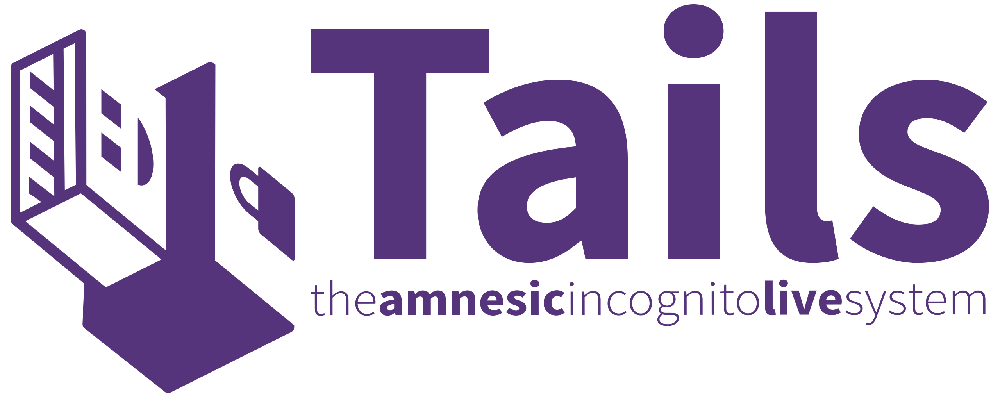
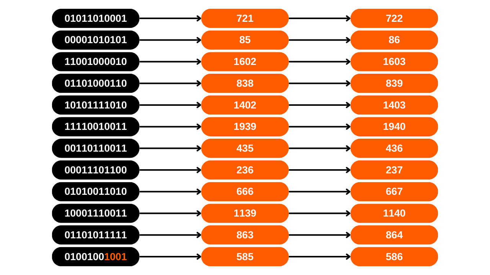
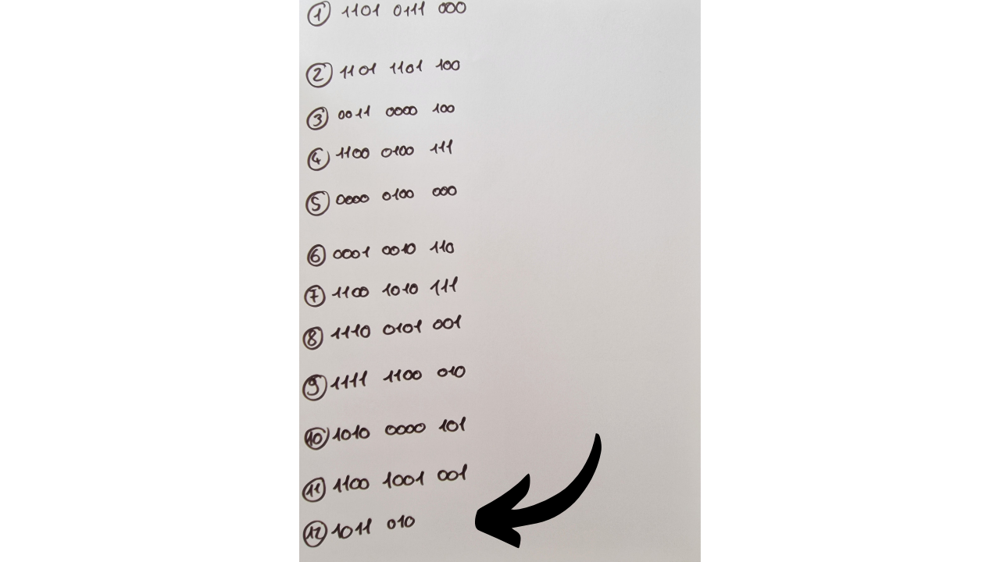
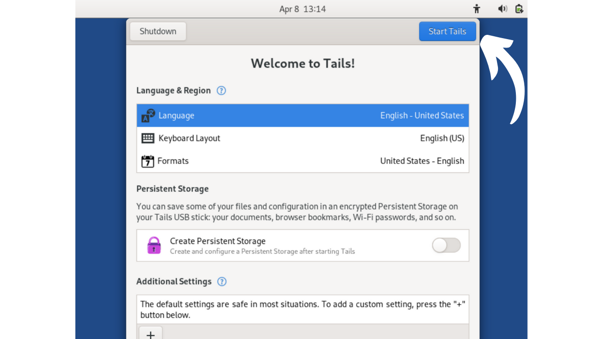
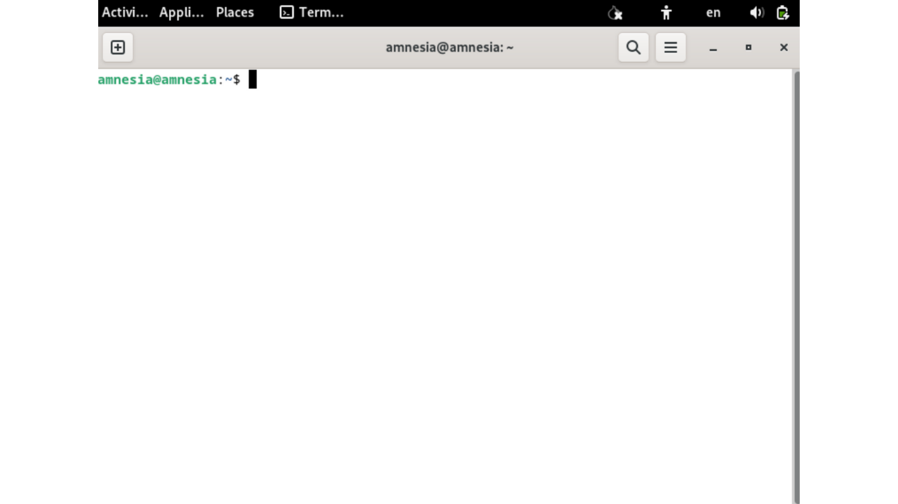
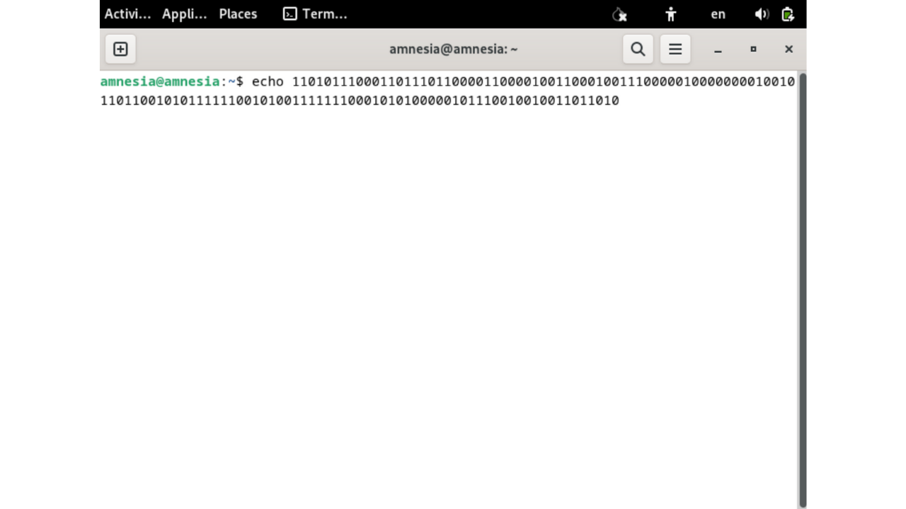
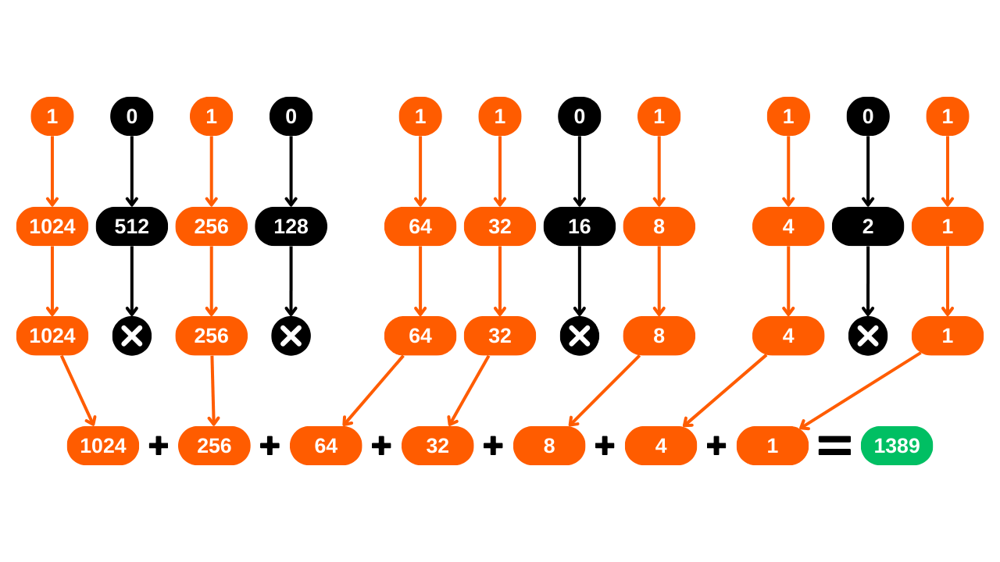

Selles õpetuses saate teada, kuidas käsitsi koostada taastefraasi Bitcoin'i rahakotile, kasutades täringuviskeid.

**HOIATUS:** Mnemonilise fraasi turvalisel viisil genereerimine nõuab, et selle loomise käigus ei jäetaks digitaalset jälge, mis on peaaegu võimatu. Vastasel juhul oleks rahakott liiga suure rünnakupinna all, oluliselt suurendades riski, et teie bitcoinid varastatakse. **Seetõttu on tungivalt soovitatav mitte kanda vahendeid rahakotti, mis sõltub teie enda genereeritud taastefraasist.** Isegi kui järgite seda õpetust täpselt, on olemas risk, et taastefraas võib olla kompromiteeritud. **Seega ei tohiks seda õpetust rakendada päris rahakoti loomiseks.** Selle ülesande jaoks on palju vähem riskantne kasutada riistvaralist rahakotti, kuna see genereerib fraasi võrguühenduseta ja tõelised krüptograafid on kaalunud kvalitatiivsete entroopiaallikate kasutamist.

Seda õpetust võib järgida ainult eksperimentaalsetel eesmärkidel fiktiivse rahakoti loomiseks, ilma kavatsuseta seda päris bitcoinidega kasutada. Siiski pakub kogemus kahte eelist:
- Esiteks võimaldab see teil paremini mõista teie Bitcoin'i rahakoti aluseks olevaid mehhanisme;
- Teiseks võimaldab see teil teada, kuidas seda teha. Ma ei ütle, et see ühel päeval kasulik on, aga võib-olla!

## Mis on mnemoniline fraas?
Taastefraas, mida mõnikord nimetatakse ka "mnemoonikuks", "seemnefraasiks" või "salafraasiks", on tavaliselt 12 või 24 sõnast koosnev jada, mis genereeritakse pseudojuhuslikul viisil entroopiaallikast. Pseudojuhuslikku jada täiendatakse alati kontrollsummaga.

Mnemoniline fraas koos valikulise paroolifraasiga kasutatakse HD (Hierarhiliselt Deterministliku) rahakoti kõigi sellega seotud võtmete deterministlikuks tuletamiseks. See tähendab, et sellest fraasist on võimalik deterministlikult genereerida ja taasluua kõik Bitcoin'i rahakoti privaatsed ja avalikud võtmed ning seeläbi pääseda ligi sellega seotud vahenditele.

Selle lause eesmärk on pakkuda lihtsat viisi bitcoinide varundamiseks ja taastamiseks. On hädavajalik hoida mnemonilist fraasi turvalises ja kindlas kohas, kuna igaüks, kes selle fraasi valdab, omaks juurdepääsu vastava rahakoti vahenditele. Kui seda kasutatakse traditsioonilise rahakoti kontekstis ja ilma valikulise paroolifraasita, moodustab see tihti SPOF-i (Single Point Of Failure - Üksiku Rikkepunkt).
Tavaliselt antakse see fraas teile otse rahakoti loomisel, kasutatava tarkvara või riistvaralise rahakoti poolt. Siiski on võimalik ka see fraas ise genereerida ja seejärel sisestada valitud toele, et tuletada rahakoti võtmed. Just seda me selles õpetuses õpime tegema.

## Vajalike materjalide ettevalmistamine
Oma taastefraasi käsitsi loomiseks vajate:
- Paberilehte;
- Pliiatsit või pastakat, ideaalis erinevates värvides, et hõlbustada organiseerimist;
- Mitut täringut, et minimeerida kallutatuse riske, mis on seotud tasakaalustamata täringuga;
- [2048 BIP39 sõna nimekirja](https://github.com/DecouvreBitcoin/sovereign-university-data/tree/dev/tutorials/others/generate-mnemonic-phrase/assets/BIP39-WORDLIST.pdf) väljaprindituna.

Seejärel muutub vajalikuks arvuti kasutamine koos terminaliga kontrollsumma arvutamiseks. Just sel põhjusel soovitan ma mnemonilise fraasi käsitsi genereerimist vältida. Minu arvates suurendab arvuti sekkumine, isegi selles õpetuses mainitud ettevaatusabinõude all, oluliselt rahakoti haavatavust.
Eksperimentaalse lähenemise puhul, mis puudutab "väljamõeldud rahakotti", on võimalik kasutada teie tavalist arvutit ja selle terminali. Kuid rangema lähenemise jaoks, mille eesmärk on piirata teie fraasi kompromiteerimise riske, oleks ideaalne kasutada internetist lahti ühendatud arvutit (eelistatavalt ilma wifi komponendi või RJ45 juhtmega ühenduseta), mis on varustatud minimaalse arvu lisaseadmetega (kõik peaksid olema ühendatud kaabliga, et vältida Bluetoothi), ja mis kõige tähtsam, töötab amneesilisel Linuxi distributsioonil nagu [Tails](https://tails.boum.org/index.fr.html), käivitatuna eemaldatavalt meediumilt.


Reaalses kontekstis oleks oluline tagada teie tööruumi konfidentsiaalsus, valides asukoha, mis on eemal uudishimulike pilkude eest, ilma inimeste liikluseta ja vabana kaameratest (veebikaamerad, telefonid...).
Soovitatav on kasutada suurt hulka täringuid, et leevendada potentsiaalselt tasakaalustamata täringu mõju entroopiale. Enne nende kasutamist on soovitatav täringuid kontrollida: seda saab teha, testides neid soolaga küllastunud vees, mis võimaldab täringutel hõljuda. Seejärel veeretage iga täringut umbes kakskümmend korda soolases vees, jälgides tulemusi. Kui üks või kaks tahku ilmuvad võrreldes teistega ebaproportsionaalselt, pikendage testi rohkemate veeretustega. Ühtlaselt jaotunud tulemused näitavad, et täring on usaldusväärne. Siiski, kui üks või kaks tahku domineerivad regulaarselt, tuleks need täringud kõrvale jätta, kuna need võivad ohustada teie mnemoonilise fraasi entroopiat ja seeläbi teie rahakoti turvalisust.
Reaalsetes tingimustes, pärast nende kontrollide sooritamist, oleksite valmis genereerima vajaliku entroopia. Eksperimentaalse väljamõeldud rahakoti loomiseks, mis on osa sellest õpetusest, võiksite loomulikult need ettevalmistused vahele jätta.

## Mõned meeldetuletused taastefraasi kohta
Alustuseks vaatame üle mnemoonilise fraasi loomise põhitõed vastavalt BIP39-le. Nagu varem selgitatud, tuletatakse fraas teatud suurusega pseudojuhuslikust informatsioonist, millele lisatakse kontrollsumma, et tagada selle terviklikkus.

Selle algse informatsiooni suurus, mida sageli nimetatakse "entroopiaks", määratakse sõltuvalt sellest, mitu sõna soovite taastefraasis saada. Kõige levinumad formaadid on 12 ja 24 sõnaga fraasid, mis tuletatakse vastavalt 128-bitisest ja 256-bitisest entroopiast. Siin on tabel, mis näitab erinevaid entroopia suurusi vastavalt BIP39-le:

| Fraas (sõnad) | Entroopia (bitid) | Kontrollsumma (bitid) | Entroopia + Kontrollsumma (bitid) |
| --------------- | --------------- | --------------- | -------------------------- |
| 12              | 128             | 4               | 132                        |
| 15              | 160             | 5               | 165                        |
| 18              | 192             | 6               | 198                        |
| 21              | 224             | 7               | 231                        |
| 24              | 256             | 8               | 264                        |

Entroopia on seega juhuslik number vahemikus 128 kuni 256 biti. Selles õpetuses võtame näiteks 12-sõnalise fraasi, milles entroopia on 128 biti, mis tähendab, et genereerime juhusliku jada 128 `0`-st või `1`-st. See esindab numbrit, mis koosneb 128-st numbrist kahendsüsteemis (binaarne).
Selle entroopia põhjal genereeritakse kontrollsumma. Kontrollsumma on väärtus, mis arvutatakse andmekogumi põhjal, mida kasutatakse selle andmekogumi terviklikkuse ja kehtivuse kontrollimiseks selle edastamisel või salvestamisel. Kontrollsumma algoritmid on kavandatud juhuslike vigade või andmetes toimunud muudatuste tuvastamiseks.
Meie mnemoonilise fraasi puhul on kontrollsumma funktsiooniks tuvastada sisestusvead, kui fraas sisestatakse rahakotitarkvarasse. Kehtetu kontrollsumma annab märku veast fraasis. Vastupidi, kehtiv kontrollsumma näitab, et fraas on tõenäoliselt õige.
Kontrollsumma saamiseks lastakse entroopia läbi SHA256 räsifunktsiooni. See toiming toodab väljundina 256-bitise jada, millest säilitatakse ainult esimesed `N` bitti, `N` sõltuvalt taastefraasi soovitud pikkusest (vt ülaltoodud tabelit). Seega 12-sõnalise fraasi puhul hoitakse alles räsi esimesed 4 bitti.

Need esimesed 4 bitti, mis moodustavad kontrollsumma, lisatakse seejärel algsele entroopiale. Selles etapis on taastefraas praktiliselt koostatud, kuid see on endiselt binaarkujul. Selle binaarjada muutmiseks sõnadeks vastavalt BIP39 standardile jagame jada esmalt 11-bitisteks segmentideks.

Iga selline pakett esindab binaarsüsteemis numbrit, mis seejärel teisendatakse kümnendsüsteemi numbrisse (alus 10). Lisame igale numbrile `1`, kuna arvutustehnikas algab lugemine `0`st, kuid BIP39 nimekiri on nummerdatud alates `1`.



Lõpuks ütleb kümnendsüsteemi number meile vastava sõna asukoha [2048 BIP39 sõna nimekirjas](https://github.com/DecouvreBitcoin/sovereign-university-data/tree/dev/tutorials/others/generate-mnemonic-phrase/assets/BIP39-WORDLIST.pdf). Jääb üle vaid need sõnad valida, et koostada meie rahakoti taastefraas.


Nüüd asume praktika juurde! Genereerime 12-sõnalise taastefraasi. Siiski jääb see toiming 24-sõnalise fraasi puhul identseks, välja arvatud see, et see nõuaks 256 biti entroopiat ja 8-bitist kontrollsummat, nagu on näidatud selle jaotise alguses asuvas ekvivalentsustabelis.

## 1. samm: Entroopia genereerimine
Valmistage ette oma paberileht, pliiats ja täringud. Alustuseks peame genereerima juhuslikult 128 bitti, st jada 128 `0`st ja `1`st järjest. Selleks kasutame täringuid.


Täringutel on 6 külge, kõigil võrdne tõenäosus veereda. Siiski on meie eesmärk saada binaarne tulemus, st kaks võimalikku tulemust. Seetõttu määrame väärtuse `0` iga veeretuse jaoks, mis maandub paarisarvul, ja `1` iga paaritu arvu puhul. Selle tulemusena teeme 128 veeretust, et luua meie 128-bitine entroopia. Kui täring näitab `2`, `4` või `6`, kirjutame üles `0`; `1`, `3` või `5` puhul saab see olema `1`. Iga tulemus märgitakse järjestikku, vasakult paremale ja ülevalt alla.

Järgnevate sammude hõlbustamiseks grupeerime bitid nelja ja kolme kaupa, nagu on näidatud allpool olevas pildis. Igal real peab olema 11 bitti: 2 neljabitist paketti ja üks kolmebitine pakett.


Nagu näete minu näites, koosneb kaheteistkümnes sõna praegu ainult 7 bitist. Need täiendatakse järgmises etapis kontrollsumma 4 bitiga, et moodustada 11 bitti.


## 2. samm: Kontrollsumma arvutamine
See samm on mnemoonilise fraasi käsitsi genereerimisel kõige kriitilisem, kuna see nõuab arvuti kasutamist. Nagu varem mainitud, vastab kontrollsumma entroopiast genereeritud SHA256 räsi algusele. Kuigi teoreetiliselt on võimalik SHA256 käsitsi arvutada 128 või 256 biti sisendi jaoks, võib see ülesanne võtta terve nädala. Lisaks tuvastataks käsitsi arvutustes tehtud vead alles protsessi lõpus, sundides teid alustama otsast peale. Seetõttu on ettekujutamatu teha seda sammu ainult paberilehe ja pliiatsiga. Arvuti kasutamine on peaaegu kohustuslik. Kui soovite siiski õppida, kuidas SHA256 käsitsi teha, selgitame, kuidas seda teha [CRYPTO301 kursusel](https://planb.network/en/courses/crypto301).

Seetõttu soovitan tungivalt mitte luua käsitsi fraasi tegeliku rahakoti jaoks. Minu arvates suurendab arvuti kasutamine selles etapis, isegi kõigi vajalike ettevaatusabinõudega, ebamõistlikult rahakoti ründepinda.
Kontrollsumma arvutamiseks, jättes võimalikult vähe jälgi, kasutame eemaldatavalt draivilt käivitatavat amneesilist Linuxi distributsiooni nimega **Tails**. See operatsioonisüsteem käivitub USB-pulgalt ja töötab täielikult arvuti RAM-is, ilma et suhtleks kõvakettaga. Seega teoreetiliselt ei jäta see arvutisse pärast väljalülitamist mingit jälge. Palun pange tähele, et Tails on ühilduv ainult x86_64 tüüpi protsessoritega, mitte ARM tüüpi protsessoritega.
Alustuseks laadige oma tavalisest arvutist [Tailsi pilt alla selle ametlikult veebisaidilt](https://tails.net/install/index.fr.html). Veenduge oma allalaadimise autentsuses, kasutades arendaja allkirja või saidi poolt pakutavat kontrollimisvahendit.

Esmalt vormindage oma USB mälupulk, seejärel installige Tails, kasutades sellist tööriista nagu [Balena Etcher](https://etcher.balena.io/).

Pärast vilkumise õnnestumise kinnitamist lülitage arvuti välja. Seejärel lülitage toide välja ja eemaldage kõvaketas oma arvuti emaplaadilt. Kui WiFi kaart on olemas, tuleks see lahti ühendada. Samuti eemaldage kõik RJ45 Etherneti kaablid. Andmelekkimise riski minimeerimiseks on soovitatav lahti ühendada oma internetiboks ja lülitada välja oma mobiiltelefon. Lisaks veenduge, et arvutist oleks lahti ühendatud kõik üleliigsed perifeeriaseadmed, nagu mikrofon, veebikaamera, kõlarid või peakomplekt, ja kontrollige, et muud perifeeriaseadmed oleksid ühendatud ainult juhtme kaudu. Kõik need arvuti ettevalmistamise sammud ei ole hädavajalikud, kuid need lihtsalt aitavad võimalikult palju vähendada ründepinda tegelikus kontekstis.

Kontrollige, kas teie BIOS on seadistatud lubama käivitamist väliselt seadmelt. Kui mitte, muutke seda seadistust, seejärel taaskäivitage masin. Kui olete arvuti keskkonna turvaliseks muutnud, taaskäivitage arvuti USB-pulgalt Tails OS-iga.

Tailsi tervitusekraanil valige oma eelistatud keel, seejärel käivitage süsteem, klõpsates nupul `Start Tails`.



Töölaualt klõpsake vahekaardil `Applications`.


Liikuge menüüsse `Utilities`.

Ja lõpuks klõpsake rakendusel `Terminal`.


Te jõuate uude tühja käsureale.


Sisestage käsk `echo`, millele järgneb teie varem genereeritud entroopia, veendudes, et `echo` ja teie binaarjada vahel oleks tühik.


Lisage veel üks tühik, seejärel sisestage järgmine käsk, kasutades *toru* (`|`):
```plaintext
| shasum -a 256 -0
```


Minu entroopia näites on kogu käsk järgmine:
```plaintext
echo 11010111000110111011000011000010011000100111000001000000001001011011001010111111001010011111110001010100000101110010010011011010 | shasum -a 256 -0
```

Selles käskluses:
- `echo` kasutatakse bitijada saatmiseks;
- `|`, *toru*, kasutatakse `echo` käsu väljundi suunamiseks järgmise käsu sisendisse;
- `shasum` käivitab räsifunktsiooni, mis kuulub SHA (*Secure Hash Algorithm*) perekonda;
- `-a` määrab kindla räsialgoritmi valiku;
- `256` näitab, et kasutatakse SHA256 algoritmi;
- `-0` võimaldab sisendit tõlgendada binaarnumbrina.

Pärast seda, kui olete hoolikalt kontrollinud, et teie binaarjadas ei oleks ühtegi trükiviga, vajutage käsu täitmiseks `Enter` klahvi. Terminal kuvab seejärel teie entroopia SHA256 räsi.


Praegu väljendatakse räsi kuueteistkümnendsüsteemis (alus 16). Näiteks minu oma on:
```plaintext
a27abf1aff70311917a59a43ce86fa45a62723a00dd2f9d3d059aeac9b4b13d8
```

Meie mnemoonilise fraasi lõpuleviimiseks vajame ainult räsi esimesi 4 bitti, mis moodustavad kontrollsumma. Kuueteistkümnendsüsteemis esindab iga tähemärk 4 bitti. Seega säilitame ainult räsi esimese tähemärgi. 24-sõnalise fraasi puhul oleks vajalik arvesse võtta esimesi kahte tähemärki. Minu näites vastab see täht: `a`. Pange see tähemärk hoolikalt kuskile lehele kirja, seejärel lülitage arvuti välja.

Järgmine samm on muuta see kuueteistkümnendsüsteemi tähemärk (alus 16) binaarväärtuseks (alus 2), kuna meie fraas on koostatud selles formaadis. Selleks võite kasutada järgmist teisendustabelit:


| Kümneline (alus 10) | Kuueteistkümnend (alus 16) | Binaarne (alus 2) |
| ------------------- | -------------------------- | ----------------- |
| 0                   | 0                          | 0000              |
| 1                   | 1                          | 0001              |
| 2                   | 2                          | 0010              |
| 3                   | 3                          | 0011              |
| 4                   | 4                          | 0100              |
| 5                   | 5                          | 0101              |
| 6                   | 6                          | 0110              |
| 7                   | 7                          | 0111              |
| 8                   | 8                          | 1000              |
| 9                 | 9                     | 1001            |
| 10                | a                     | 1010            |
| 11                | b                     | 1011            |
| 12                | c                     | 1100            |
| 13                | d                     | 1101            |
| 14                | e                     | 1110            |
| 15                | f                     | 1111            |

Minu näites vastab täht `a` binaararvule `1010`. Need 4 bitti moodustavad meie taastefraasi kontrollsumma. Nüüd saate need lisada juba paberilehele märgitud entroopiale, asetades need viimase sõna lõppu.


Teie mnemooniline fraas on nüüd valmis, kuid see on binaarvormingus. Järgmine samm on teisendada see kümnendsüsteemi, et saaksite seejärel iga numbri vastavate sõnadega BIP39 nimekirjas seostada.

## 3. samm: Sõnade teisendamine kümnendarvuks
Iga binaarrea teisendamiseks kümnendarvuks kasutame meetodit, mis hõlbustab käsitsi arvutamist. Praegu on teil paberil kaksteist rida, igaüks koosneb 11 binaardigist `0` või `1`. Kümnendarvuks teisendamiseks omistage igale esimesele digile väärtus `1024`, kui see on `1`, vastasel juhul `0`. Teisele digile omistatakse väärtus `512`, kui see on `1`, vastasel juhul `0`, ja nii edasi kuni üheteistkümnenda digini. Vastavused on järgmised:
- 1. bitt: `1024`;
- 2. bitt: `512`;
- 3. bitt: `256`;
- 4. bitt: `128`;
- 5. bitt: `64`;
- 6. bitt: `32`;
- 7. bitt: `16`;
- 8. bitt: `8`;
- 9. bitt: `4`;
- 10. bitt: `2`;
- 11. bitt: `1`.

Iga rea puhul liidame kokku väärtused, mis vastavad digitele `1`, et saada binaararvu kümnendarvuline ekvivalent. Võtame näiteks binaarrea, mis on võrdne:
```plaintext
1010 1101 101
```

Teisendus oleks järgmine:

Tulemus oleks siis:
```plaintext
1389
```

Iga bitti `1` puhul märkige allapoole vastav number. Iga bitti `0` puhul ärge märkige midagi.


Seejärel lihtsalt liidake kõik numbrid, mida `1` kinnitab, et saada kümnendarv, mis esindab iga binaarrea. Näiteks siin on, kuidas see minu lehel välja näeb:


## 4. samm: Mnemoonilise fraasi sõnade otsimine
Saadud kümnendarvudega saame nüüd leida vastavad sõnad nimekirjast, et koostada mnemooniline fraas. Siiski, 2048 sõna nummerdus BIP39 nimekirjas ulatub `1`st `2048`ni. Kuid meie arvutatud binaartulemused jäävad vahemikku `0` kuni `2047`. Seega on vaja parandada üheühikulist nihet. Selle nihke parandamiseks lihtsalt lisage `1` kaheteistkümnele varem arvutatud kümnendarvule.


Pärast seda kohandust on teil iga sõna järjestus nimekirjas. Jääb üle vaid iga sõna identifitseerida selle numbri järgi. Ilmselgelt, nagu kõigi teiste sammude puhul, ei tohi te selleks konversiooniks kasutada oma arvutit. Seega veenduge, et olete nimekirja eelnevalt välja printinud.
[**-> Prindi BIP39 nimekiri A4 formaadis.**](https://github.com/DecouvreBitcoin/sovereign-university-data/tree/dev/tutorials/others/generate-mnemonic-phrase/assets/BIP39-WORDLIST.pdf)

Näiteks, kui esimeselt realt saadud number on 1721, siis vastav sõna nimekirjas on:
```plaintext
1721. strike
```

Sel viisil jätkame järjestikku 12 sõnaga, et konstrueerida meie mnemooniline fraas.


## 5. samm: Bitcoini rahakoti loomine
Sel hetkel jääb üle vaid meie mnemooniline fraas importida Bitcoini rahakoti tarkvarasse. Olenevalt meie eelistustest, saab seda teha lauaarvuti tarkvaras, et saada kuum rahakott, või riistvaralisel rahakotil, et saada külm rahakott.


Ainult importimise käigus saate kontrollida oma kontrollsumma kehtivust. Kui tarkvara kuvab sõnumi nagu `Invalid Checksum`, tähendab see, et teie loomisprotsessi on sisse lipsanud viga. Üldiselt tuleneb see viga kas käsitsi tehtud konversioonide ja liitmiste arvutusveast või trükiveast, kui sisestasite oma entroopia Tailsi terminali. Vigade parandamiseks on vajalik protsess algusest peale uuesti läbi teha.


Pärast rahakoti loomist ärge unustage oma taastefraasi varundada füüsilisel kandjal, nagu paberil või metallil, ja hävitada selle genereerimisel kasutatud tabel, et vältida igasuguse informatsiooni leket.

## Eriline juhtum Coldcardide täringuveeretamise valiku kohta
Coldcardi perekonna riistvaralised rahakotid pakuvad [funktsiooni nimega *Dice Roll*](https://youtu.be/Rc29d9m92xg?si=OeFW2iCGRvxexhK7), et genereerida teie rahakoti taastefraas täringutega. See meetod on suurepärane, kuna annab teile otsese kontrolli entroopia loomise üle, ilma et oleks vaja kasutada välist seadet kontrollsumma arvutamiseks, nagu meie õpetuses.

Siiski on hiljuti teatatud bitcoini vargustest, mis on toimunud selle funktsiooni vale kasutamise tõttu. Tõepoolest, liiga piiratud arv täringuveeretusi võib põhjustada ebapiisava entroopia, teoreetiliselt võimaldades mnemoonilist fraasi jõuga murda ja seotud bitcoinid varastada. Selle riski vältimiseks soovitatakse Coldcardil teha vähemalt 99 täringuveeretust, mis tagab piisava entroopia.

Coldcardi poolt pakutav tulemuste tõlgendamise meetod erineb sellest, mida meie õpetuses esitletakse. Kuigi meie õpetuses soovitame 128 veeretust, et saavutada 128 biti turvalisus, soovitab Coldcard 99 veeretust, et jõuda 256 biti turvalisuseni. Tõepoolest, meie lähenemises on iga täringuveeretuse jaoks võimalikud ainult kaks tulemust: paaris (`0`) või paaritu (`1`). Seega on iga veeretuse poolt genereeritud entroopia võrdne `log2(2)`-ga. Coldcardi puhul, mis arvestab täringu kuut võimalikku tahku (alates `1` kuni `6`), on entroopia veeretuse kohta võrdne `log2(6)`-ga. Seetõttu peame meie õpetuses tegema rohkem veeretusi, et saavutada sama entroopia tase.
Entroopia = veeretuste arv * log2(täringu võimalike tulemuste arv)
Coldcard:

Entroopia = 99 * log2(6)
Entroopia = 255.91

Meie õpetus:

Entroopia = 128 * log2(2)
Entroopia = 128