Dalam tutorial ini, kamu akan belajar bagaimana cara membuat seedphrase untuk dompet Bitcoin secara manual menggunakan lemparan dadu.

**PERINGATAN:** Menghasilkan seedphrase secara aman mengharuskan kamu tidak meninggalkan jejak digital saat pembuatannya, yang nyaris mustahil. Jika tidak, dompet tersebut akan memiliki permukaan serangan yang terlalu besar dan secara signifikan meningkatkan risiko bitcoinmu dicuri. **Oleh karena itu, sangat disarankan agar kamu tidak memindahkan dana ke dompet yang bergantung pada seedphrase yang kamu buat sendiri.** Meskipun kamu mengikuti tutorial ini dengan tepat, tetap ada risiko seedphrase bisa dikompromikan. **Jadi, tutorial ini tidak boleh dipakai untuk pembuatan dompet sungguhan.** Menggunakan dompet perangkat keras untuk tujuan ini jauh lebih aman, karena menghasilkan seedphrase secara offline dan kriptografer memang sudah mempertimbangkan penggunaan sumber entropi berkualitas.

Tutorial ini hanya boleh diikuti untuk tujuan eksperimental, membuat dompet fiktif tanpa niat memakai seedphrase itu dengan bitcoin sungguhan. Namun, pengalaman ini memberikan dua manfaat:

- Pertama, ini memungkinkan kamu lebih memahami mekanisme dasar dompet Bitcoinmu;
- Kedua, ini memungkinkan kamu tahu bagaimana melakukannya. Aku tidak mengatakan ini akan berguna suatu hari, tapi mungkin!

## Apa itu frase mnemonik?

Frase pemulihan, juga kadang disebut "mnemonik", "seedphrase", atau "frase rahasia", adalah urutan yang biasanya terdiri dari 12 atau 24 kata yang dihasilkan secara pseudo-acak dari sumber entropi. Urutan pseudo-acak tersebut selalu dilengkapi checksum.

Seedphrase, bersama passphrase opsional, digunakan untuk menurunkan semua kunci yang terkait dengan dompet HD (Hierarchical Deterministic) secara deterministik. Artinya, dari seedphrase ini dimungkinkan menghasilkan dan merekreasikan semua kunci privat dan publik dompet Bitcoin, dan akibatnya mengakses dana yang terkait.

Tujuan kalimat ini adalah menyediakan sarana cadangan dan pemulihan bitcoin yang mudah digunakan. Sangat penting untuk menjaga seedphrase di tempat yang aman dan terlindungi, karena siapa pun yang memegang seedphrase itu akan punya akses ke dana di dompet terkait. Jika dipakai pada dompet tradisional tanpa passphrase opsional, seringkali menjadi SPOF (Single Point Of Failure). Biasanya seedphrase ini diberikan langsung kepadamu saat membuat dompet, oleh perangkat lunak atau dompet perangkat keras yang kamu gunakan. Namun, kamu juga bisa menghasilkan seedphrase sendiri, lalu mencatatnya pada media yang kamu pilih untuk menurunkan kunci dompet. Inilah yang akan kita pelajari dalam tutorial ini.

## Persiapan bahan yang diperlukan

Untuk membuat seedphrase secara manual, kamu akan memerlukan:

- Selembar kertas;
- Sebuah pena atau pensil, sebaiknya dengan warna berbeda supaya lebih mudah diatur;
- Beberapa dadu, untuk meminimalkan risiko bias akibat dadu yang tidak seimbang;
- [Daftar 2048 kata BIP39](https://github.com/PlanB-Network/bitcoin-educational-content/tree/dev/tutorials/others/generate-mnemonic-phrase/assets/BIP39-WORDLIST.pdf) yang dicetak.

Selanjutnya, penggunaan komputer dengan terminal akan diperlukan untuk perhitungan checksum. Inilah alasan mengapa aku menyarankan agar kamu tidak melakukan generasi seedphrase secara manual. Menurut aku, intervensi komputer, bahkan dengan tindakan pencegahan yang disebutkan dalam tutorial ini, secara signifikan meningkatkan kerentanan dompet.
Untuk pendekatan eksperimental soal "dompet fiktif", kamu bisa menggunakan komputer biasa dan terminalnya. Namun, untuk pendekatan yang lebih ketat yang bertujuan membatasi risiko kompromi seedphrase-mu, idealnya pakai PC yang terputus dari internet (lebih disukai tanpa modul wifi atau koneksi kabel), dilengkapi periferal minimal (semua harus terhubung lewat kabel untuk menghindari Bluetooth), dan yang paling penting, menjalankan distribusi Linux amnesik seperti [Tails](https://tails.boum.org/index.fr.html), yang dimulai dari media yang bisa dilepas.


ChatGPT said:

Dalam konteks nyata, sangat penting memastikan kerahasiaan ruang kerja kamu dengan memilih lokasi yang jauh dari pandangan orang lain, tanpa lalu lintas orang, dan bebas dari kamera (webcam, telepon...). Disarankan pakai banyak dadu untuk mengurangi dampak dadu yang mungkin tidak seimbang terhadap entropi. Sebelum digunakan, periksa dadu: ini bisa dilakukan dengan menguji mereka di mangkuk berisi air garam jenuh sehingga dadu mengapung. Kemudian gulung setiap dadu sekitar dua puluh kali dalam air garam dan amati hasilnya. Jika satu atau dua sisi muncul tidak proporsional dibanding yang lain, perpanjang tes dengan lebih banyak lemparan. Hasil yang terdistribusi merata menunjukkan dadu dapat diandalkan. Namun, jika satu atau dua sisi secara teratur mendominasi, singkirkan dadu itu karena bisa mengompromikan entropi seedphrase kamu dan akibatnya keamanan dompetmu. Dalam kondisi nyata, setelah pemeriksaan ini kamu siap menghasilkan entropi yang dibutuhkan. Untuk dompet fiktif eksperimental dalam tutorial ini, kamu bisa melewatkan persiapan tersebut.

## Beberapa Pengingat tentang Frasa Pemulihan

Untuk memulai, kita akan mengulas dasar-dasar pembuatan seedphrase menurut BIP39. Seperti yang sudah dijelaskan sebelumnya, seedphrase tersebut berasal dari informasi pseudo-acak berukuran tertentu yang kemudian diberi checksum untuk memastikan integritasnya.

Ukuran informasi awal ini, yang sering disebut entropi, ditentukan oleh jumlah kata yang kamu inginkan dalam seedphrase. Format paling umum adalah seedphrase 12 atau 24 kata, yang masing-masing berasal dari entropi 128 bit dan 256 bit. Berikut adalah tabel yang menunjukkan ukuran entropi menurut BIP39:

| Frasa (kata) | Entropi (bit) | Checksum (bit) | Entropi + Checksum (bit) |
| ------------ | ------------- | -------------- | ------------------------ |
| 12           | 128           | 4              | 132                      |
| 15           | 160           | 5              | 165                      |
| 18           | 192           | 6              | 198                      |
| 21           | 224           | 7              | 231                      |
| 24           | 256           | 8              | 264                      |

Entropi adalah angka acak antara 128 dan 256 bit. Dalam tutorial ini, kita akan mengambil contoh seedphrase 12 kata, dengan entropi sebesar 128 bit. Artinya, kita akan menghasilkan urutan acak yang terdiri dari 128 digit `0` dan `1`. Ini merepresentasikan sebuah angka dengan 128 digit dalam basis 2 (biner).

Dari entropi ini, akan dihasilkan checksum. Checksum adalah nilai yang dihitung dari sekumpulan data dan digunakan untuk memverifikasi integritas serta validitas data tersebut selama proses penyimpanan atau transmisi. Algoritma checksum dirancang untuk mendeteksi kesalahan atau perubahan tak disengaja pada data.

Dalam kasus seedphrase, fungsi checksum adalah untuk mendeteksi kesalahan input saat kamu memasukkan seedphrase ke perangkat lunak dompet. Checksum yang tidak valid menunjukkan ada kesalahan dalam frasa tersebut, sedangkan checksum yang valid berarti seedphrase itu kemungkinan besar benar.

Untuk mendapatkan checksum ini, entropi dijalankan melalui fungsi hash SHA256. Proses ini menghasilkan output sepanjang 256 bit, dan hanya `N` bit pertama yang akan dipertahankan. `N` tergantung pada panjang seedphrase yang diinginkan (lihat tabel di atas). Jadi, untuk seedphrase 12 kata, hanya 4 bit pertama dari hash yang digunakan.

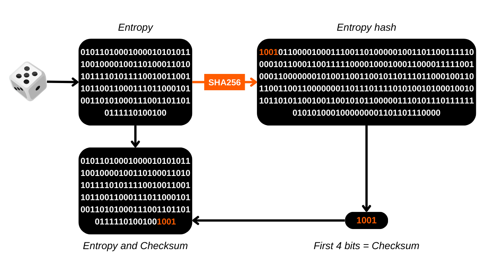

Empat bit pertama ini, yang membentuk checksum, kemudian ditambahkan ke entropi asli. Pada tahap ini, seedphrase sebenarnya sudah terbentuk, tapi masih dalam bentuk biner. Untuk mengonversi urutan biner ini menjadi kata-kata sesuai standar BIP39, kita akan membaginya terlebih dahulu menjadi segmen-segmen 11 bit.

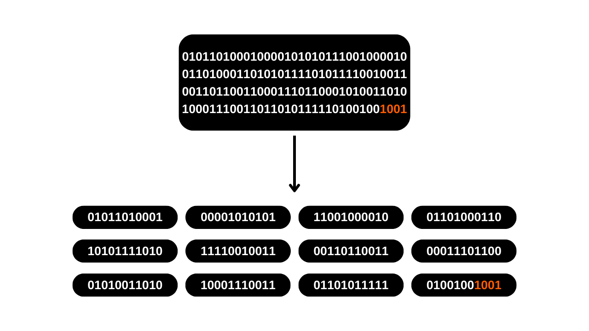

Setiap paket ini mewakili sebuah angka dalam biner yang kemudian akan dikonversi menjadi angka desimal (basis 10). Kita akan menambahkan `1` ke setiap angka, karena dalam komputasi, penghitungan dimulai dari `0`, namun daftar BIP39 dinomori mulai dari `1`.

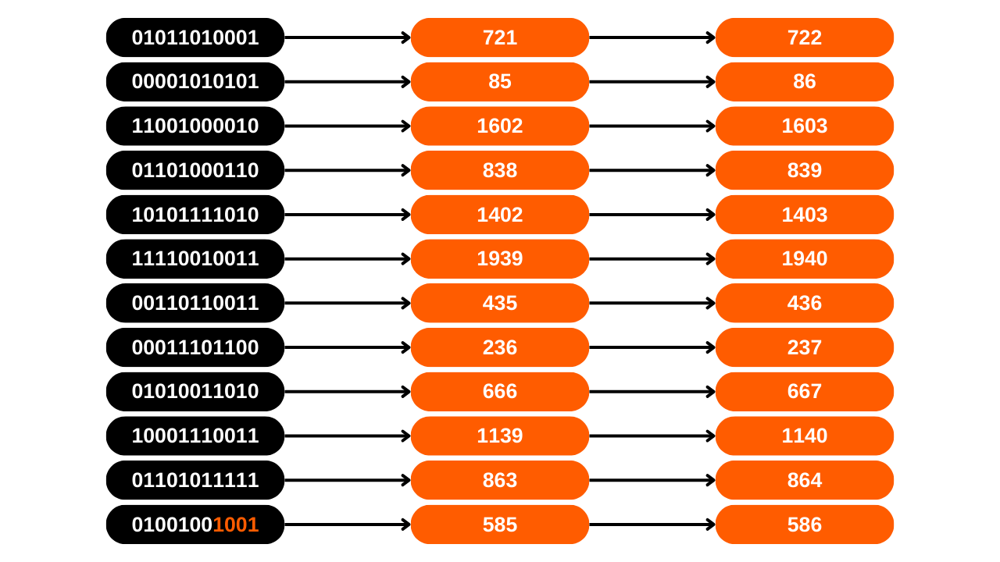

Akhirnya, angka dalam desimal memberitahu kita posisi kata yang sesuai dalam [daftar 2048 kata BIP39](https://github.com/PlanB-Network/bitcoin-educational-content/tree/dev/tutorials/others/generate-mnemonic-phrase/assets/BIP39-WORDLIST.pdf). Yang tersisa hanyalah memilih kata-kata ini untuk menyusun frasa pemulihan untuk dompet kita.

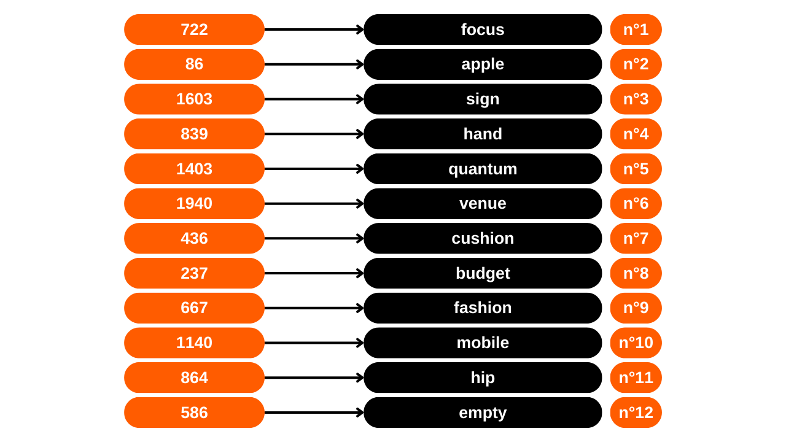

Sekarang, mari kita lanjut ke praktik! Kita akan menghasilkan seedphrase 12 kata. Namun, langkah-langkahnya tetap sama untuk seedphrase 24 kata, hanya saja membutuhkan entropi 256 bit dan checksum 8 bit, seperti yang ditunjukkan pada tabel kesetaraan di awal bagian ini.

## Langkah 1: Menghasilkan Entropi

Siapkan lembaran kertas Anda, pena Anda, dan dadu Anda. Untuk memulai, kita perlu menghasilkan 128 bit secara acak, yaitu, sebuah urutan dari 128 `0` dan `1` berturut-turut. Untuk melakukan ini, kita akan menggunakan dadu.


Dadu memiliki 6 sisi, semuanya dengan kemungkinan yang sama untuk dilempar. Namun, tujuan kita adalah menghasilkan hasil biner, yang berarti dua kemungkinan hasil. Oleh karena itu, kita akan menetapkan nilai `0` untuk setiap lemparan yang mendarat pada angka genap, dan `1` untuk setiap angka ganjil. Sebagai hasilnya, kita akan melakukan 128 lemparan untuk menciptakan entropi 128-bit kita. Jika dadu menunjukkan `2`, `4`, atau `6`, kita akan menuliskan `0`; untuk `1`, `3`, atau `5`, itu akan menjadi `1`. Setiap hasil akan dicatat secara berurutan, dari kiri ke kanan dan dari atas ke bawah.

Untuk memudahkan langkah selanjutnya, kita akan mengelompokkan bit-bit tersebut menjadi paket-paket empat dan tiga, seperti yang ditunjukkan pada gambar di bawah ini. Setiap baris harus memiliki 11 bit: 2 paket dari 4 bit dan satu paket dari 3 bit.

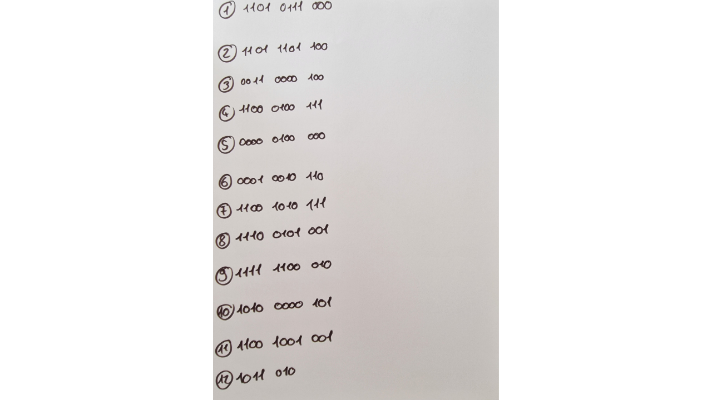
Seperti yang bisa kamu lihat di contohku, kata kedua belas saat ini hanya terdiri dari 7 bit. Nantinya, ini akan dilengkapi dengan 4 bit dari checksum pada langkah berikutnya untuk membentuk 11 bit penuh.
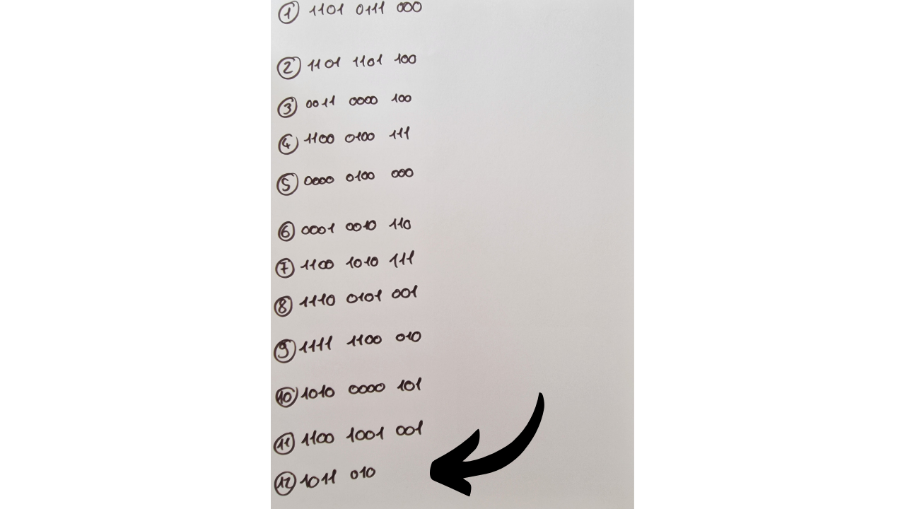

## Langkah 2: Menghitung checksum

Langkah ini adalah bagian paling krusial dalam pembuatan seedphrase secara manual karena membutuhkan penggunaan komputer. Seperti yang sudah disebutkan sebelumnya, checksum diambil dari awal hasil hash SHA256 yang dihasilkan dari entropi. Secara teori, menghitung SHA256 dengan tangan untuk input 128 atau 256 bit memang mungkin, tapi prosesnya bisa memakan waktu berhari-hari. Lebih parah lagi, kesalahan sekecil apa pun dalam perhitungan manual baru akan terlihat di akhir proses, dan kamu harus mengulang semuanya dari awal. Karena itu, jelas tidak realistis melakukan langkah ini hanya dengan kertas dan pena. Komputer hampir pasti diperlukan. Kalau kamu tetap ingin belajar cara menghitung SHA256 secara manual, kami menjelaskan caranya di [kursus CRYPTO301](https://planb.network/courses/46b0ced2-9028-4a61-8fbc-3b005ee8d70f).

Untuk alasan ini, aku sangat menyarankan agar tidak membuat seedphrase secara manual untuk dompet nyata. Aku percaya penggunaan komputer pada tahap ini, bahkan dengan semua tindakan pencegahan, justru meningkatkan permukaan serangan dompet.
Untuk menghitung checksum sambil meninggalkan jejak sekecil mungkin, kita akan menggunakan distribusi Linux amnesik yang dijalankan dari media yang bisa dilepas bernama **Tails.** Sistem operasi ini di-boot dari USB stick dan berjalan sepenuhnya di RAM komputer tanpa berinteraksi dengan hard drive. Dengan demikian, secara teori tidak meninggalkan jejak apa pun pada komputer setelah dimatikan. Perlu dicatat bahwa Tails hanya kompatibel dengan prosesor tipe x86_64, bukan prosesor tipe ARM.
Untuk memulai, dari komputer biasa kamu, [unduh gambar Tails dari situs web resminya](https://tails.net/install/index.fr.html).
Pastikan keaslian unduhanmu dengan memverifikasi tanda tangan digital pengembang atau menggunakan alat verifikasi yang disediakan situs.
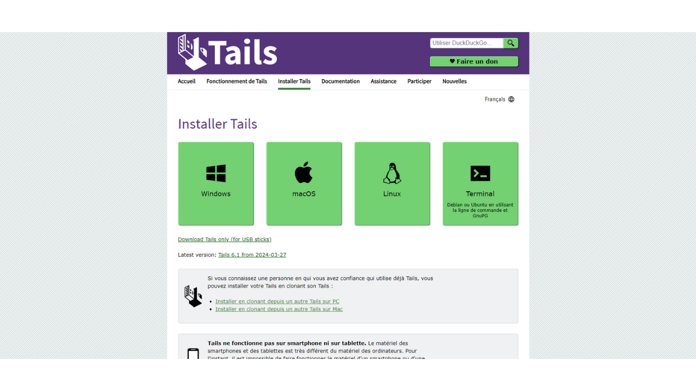
Pertama, lanjutkan dengan memformat USB stick kamu, lalu instal Tails menggunakan alat seperti [Balena Etcher](https://etcher.balena.io/).

Setelah memastikan proses flashing berhasil, matikan komputer kamu. Lalu cabut catu daya dan lepaskan hard drive dari motherboard PC. Jika ada kartu WiFi, sebaiknya juga dilepas. Begitu pula dengan kabel Ethernet RJ45. Untuk meminimalkan risiko kebocoran data, disarankan mencabut modem atau router internet dan mematikan ponselmu. Selain itu, cabut semua periferal yang tidak diperlukan dari komputer, seperti mikrofon, webcam, speaker, atau headset, dan pastikan periferal lain hanya terhubung lewat kabel. Semua langkah persiapan PC ini memang tidak wajib, tapi berguna untuk meminimalkan permukaan serangan sebanyak mungkin dalam konteks nyata.

Periksa apakah BIOS kamu sudah dikonfigurasi untuk mengizinkan boot dari perangkat eksternal. Jika belum, ubah pengaturannya, lalu restart komputer. Setelah lingkungan komputer aman, nyalakan ulang komputer dari USB stick yang berisi OS Tails

Di layar sambutan Tails, pilih bahasa pilihan kamu, kemudian luncurkan sistem dengan mengklik `Start Tails`.

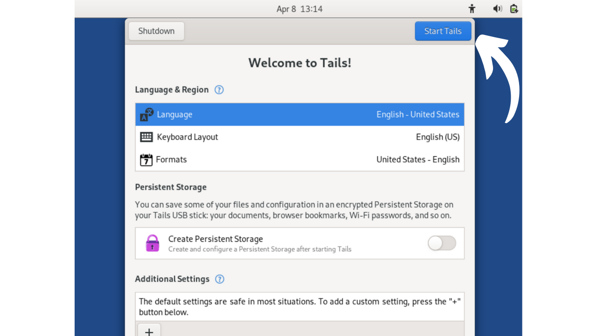

Dari desktop, klik pada tab `Applications`.


Navigasikan ke menu `Utilities`.
Dan akhirnya, klik pada aplikasi `Terminal`.

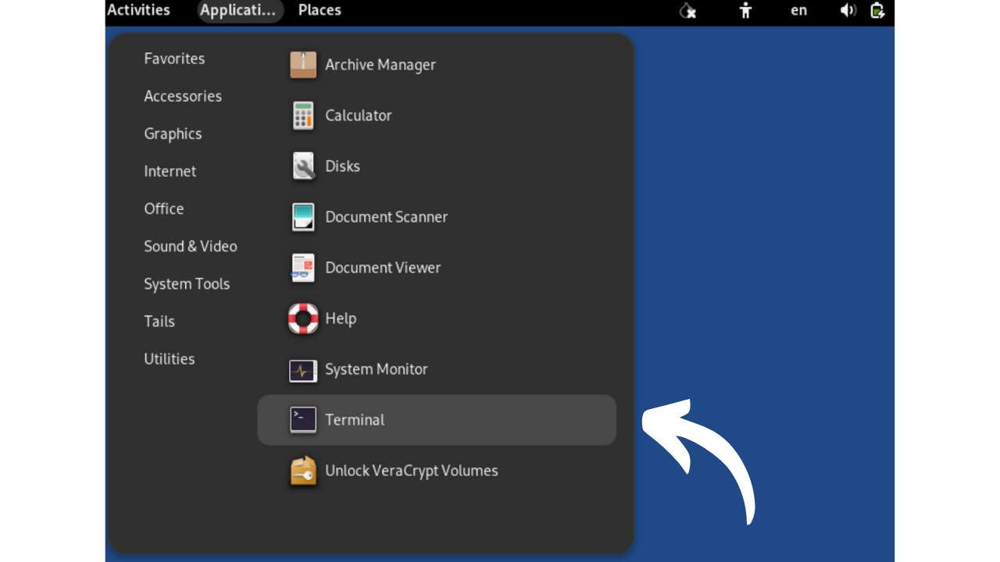

Kamu akan sampai pada terminal perintah baru yang kosong.

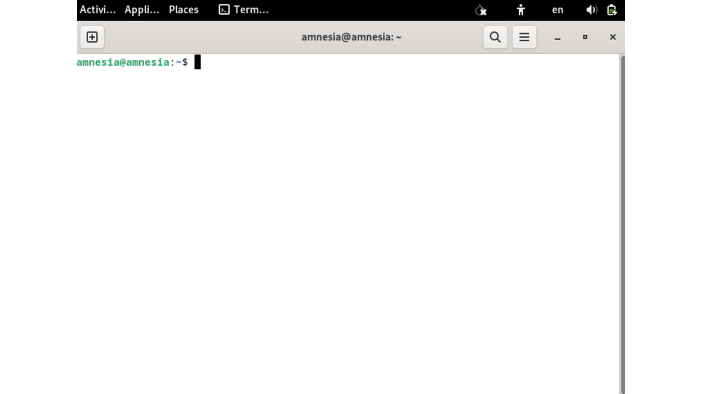
Ketik perintah `echo`, diikuti oleh entropi yang sudah kamu hasilkan sebelumnya. Pastikan ada spasi antara `echo` dan urutan digit biner kamu.
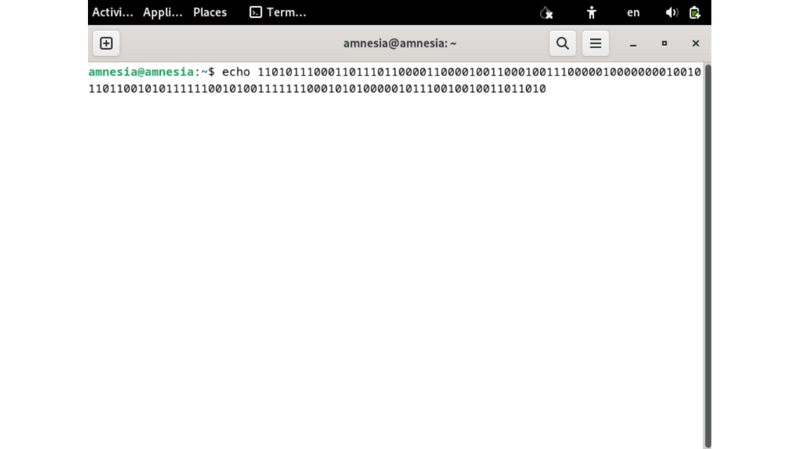

Tambahkan spasi tambahan, lalu masukkan perintah berikut, menggunakan _pipe_ (`|`):

```plaintext
| shasum -a 256 -0
```

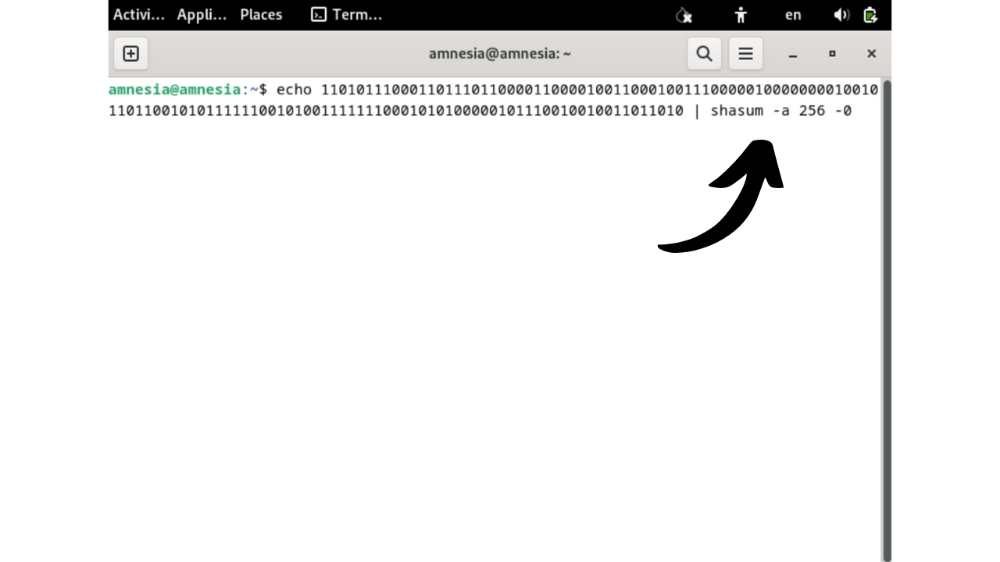

Dalam contoh dengan entropiku, total perintahnya adalah sebagai berikut:

```plaintext
echo 11010111000110111011000011000010011000100111000001000000001001011011001010111111001010011111110001010100000101110010010011011010 | shasum -a 256 -0
```

Dalam perintah ini:

- `echo` digunakan untuk mengirimkan urutan bit;
- `|`, _pipe_, digunakan untuk mengarahkan output dari perintah `echo` ke input dari perintah selanjutnya;
- `shasum` memulai fungsi hashing yang termasuk dalam keluarga SHA (_Secure Hash Algorithm_);
- `-a` menentukan pilihan algoritma hashing tertentu;
- `256` menunjukkan bahwa algoritma SHA256 digunakan;
- `-0` memungkinkan input diinterpretasikan sebagai angka biner.

Setelah memastikan urutan biner kamu tidak mengandung kesalahan ketik, tekan tombol `Enter` untuk menjalankan perintah. Terminal kemudian akan menampilkan hash SHA256 dari entropi kamu.

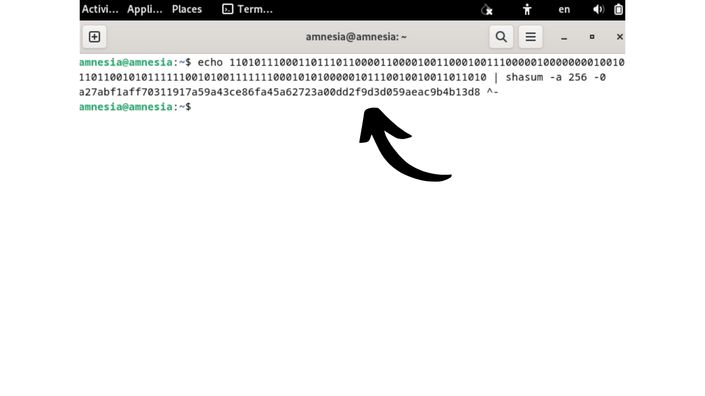

Untuk saat ini, hash dinyatakan dalam format heksadesimal (basis 16). Sebagai contoh, milikku adalah:

```plaintext
a27abf1aff70311917a59a43ce86fa45a62723a00dd2f9d3d059aeac9b4b13d8
```

Untuk menyelesaikan seedphrase kita, kita hanya membutuhkan 4 bit pertama dari hash, yaitu checksum. Dalam format heksadesimal, setiap karakter mewakili 4 bit, jadi kita hanya akan mengambil karakter pertama dari hash. Untuk seedphrase 24 kata, kamu perlu mengambil dua karakter pertama. Dalam contohku, hasilnya adalah huruf `a`. Catat karakter ini dengan hati-hati di lembar kerjamu, lalu matikan komputer.

Langkah berikutnya adalah mengonversi karakter heksadesimal ini (basis 16) menjadi nilai biner (basis 2), karena seedphrase kita dibangun dalam format biner. Untuk melakukannya, kamu bisa menggunakan tabel konversi berikut:

| Desimal (basis 10) | Heksadesimal (basis 16) | Biner (basis 2) |
| ------------------ | ----------------------- | --------------- |
| 0                  | 0                       | 0000            |
| 1                  | 1                       | 0001            |
| 2                  | 2                       | 0010            |
| 3                  | 3                       | 0011            |
| 4                  | 4                       | 0100            |
| 5                  | 5                       | 0101            |
| 6                  | 6                       | 0110            |
| 7                  | 7                       | 0111            |
| 8                  | 8                       | 1000            |

Dalam contohku, huruf `a` setara dengan bilangan biner `1010`. Keempat bit ini membentuk checksum seedphrase kita. Sekarang kamu bisa menambahkannya ke entropi yang sudah kamu catat di lembar kerjamu, letakkan di akhir kata terakhir.

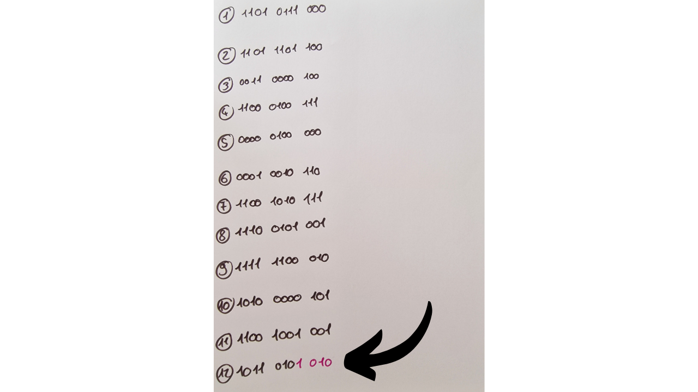

Seedphrase kamu sekarang lengkap, tetapi masih dalam format biner. Langkah selanjutnya adalah mengonversinya ke sistem desimal agar kamu bisa mengaitkan setiap angka dengan kata yang sesuai di daftar BIP39.

## Langkah 3: Mengonversi Kata-kata ke Desimal

Untuk mengonversi setiap baris biner menjadi angka desimal, kita akan pakai metode yang memudahkan perhitungan manual. Saat ini, kamu punya dua belas baris di kertas, masing-masing terdiri dari 11 digit biner `0` atau `1`. Untuk melakukan konversi ke desimal, beri nilai `1024` pada digit pertama jika bernilai `1`, kalau tidak `0`. Untuk digit kedua, nilainya `512` jika 1, kalau tidak 0, dan begitu seterusnya sampai digit kesebelas. Korespondensinya adalah sebagai berikut:

- Bit pertama: `1024`;
- Bit kedua: `512`;
- Bit ketiga: `256`;
- Bit keempat: `128`;
- Bit kelima: `64`;
- Bit keenam: `32`;
- Bit ketujuh: `16`;
- Bit kedelapan: `8`;
- Bit kesembilan: `4`;
- Bit kesepuluh: `2`;
- Bit kesebelas: `1`.

Untuk setiap baris, kita akan menjumlahkan nilai-nilai yang sesuai dengan digit `1` untuk mendapatkan angka desimal yang setara dengan angka biner. Mari kita ambil contoh baris biner yang sama dengan:

```plaintext
1010 1101 101
```

Konversinya akan sebagai berikut:
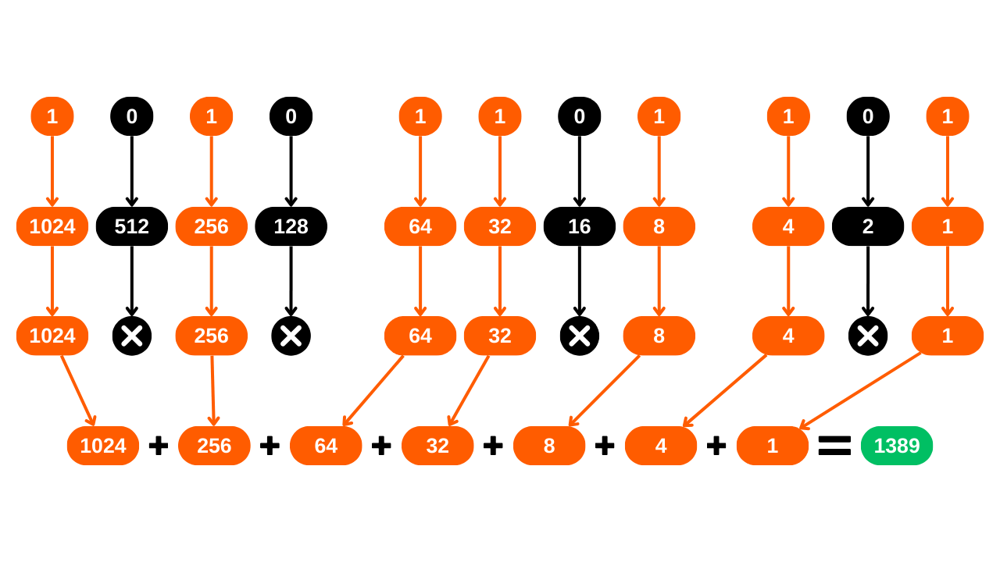
Hasilnya kemudian akan menjadi:

```plaintext
1389
```

Untuk setiap bit yang sama dengan `1`, laporkan angka yang terkait di bawah ini. Untuk setiap bit yang sama dengan `0`, laporkan tidak ada.

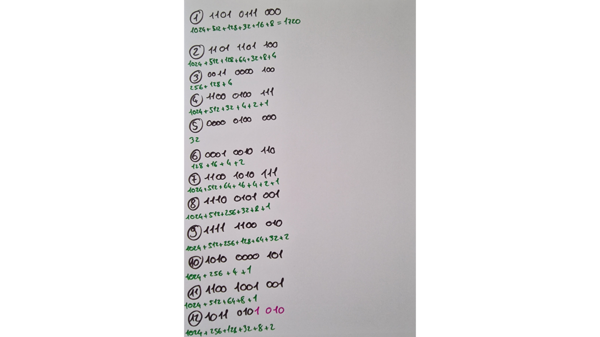
Kemudian, cukup jumlahkan semua angka yang divalidasi oleh `1` untuk mendapatkan angka desimal yang mewakili setiap baris biner. Misalnya, inilah tampilannya untuk lembaran saya:
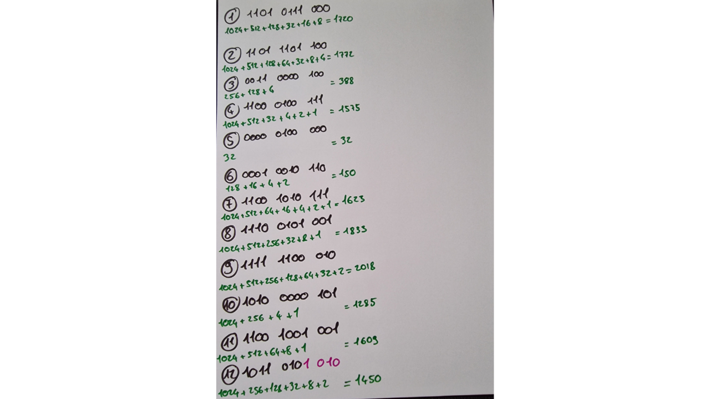

## Langkah 4: Mencari Kata-kata dari Frasa Mnemonik

Dengan angka desimal yang diperoleh, kita sekarang dapat menemukan kata-kata yang sesuai dalam daftar untuk menyusun frasa mnemonik. Namun, penomoran dari 2048 kata dalam daftar BIP39 berkisar dari `1` hingga `2048`. Tetapi, hasil biner yang dihitung berkisar dari `0` hingga `2047`. Oleh karena itu, ada pergeseran satu unit yang perlu diperbaiki. Untuk memperbaiki pergeseran ini, cukup tambahkan `1` ke dua belas angka desimal yang sebelumnya dihitung.

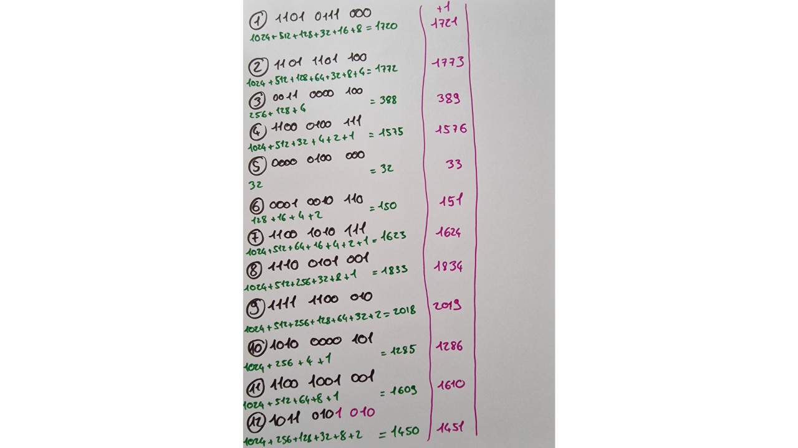
Setelah penyesuaian ini, kamu punya peringkat untuk setiap kata di daftar. Yang tersisa adalah mengidentifikasi setiap kata berdasarkan nomornya. Jelas, seperti semua langkah lain, kamu tidak boleh menggunakan komputermu untuk melakukan konversi ini. Oleh karena itu, pastikan kamu sudah mencetak daftar tersebut sebelumnya.
[**-> Cetak daftar BIP39 dalam format A4.**](https://github.com/PlanB-Network/bitcoin-educational-content/tree/dev/tutorials/others/generate-mnemonic-phrase/assets/BIP39-WORDLIST.pdf)

Sebagai contoh, jika nomor yang diperoleh dari baris pertama adalah 1721, kata yang sesuai akan menjadi kata ke-1721 dalam daftar:

```plaintext
1721. strike
```

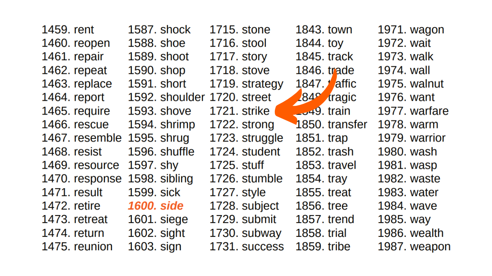
Dengan cara ini, kita melanjutkan secara bertahap dengan 12 kata untuk membentuk frasa mnemonik kita.

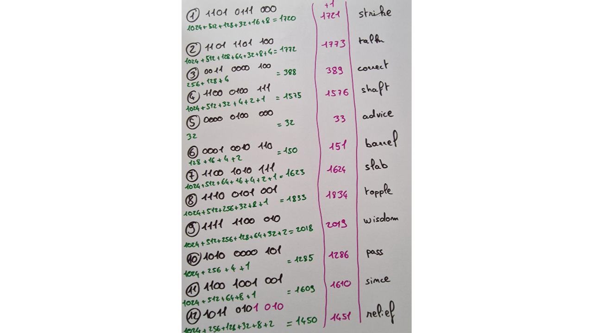

## Langkah 5: Membuat Dompet Bitcoin

Pada titik ini, yang tersisa hanyalah mengimpor seedphrase kita ke dalam perangkat lunak dompet Bitcoin. Tergantung preferensimu, kamu bisa mengimpor seedphrase ini ke perangkat lunak dompet di desktop untuk membuat hot wallet, atau ke dompet perangkat keras untuk membuat cold wallet..

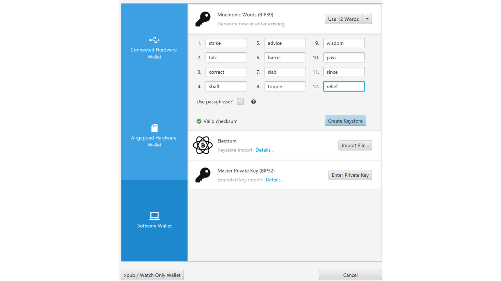

Hanya saat proses impor kamu bisa memverifikasi validitas checksum. Jika perangkat lunak menampilkan pesan seperti `Invalid Checksum`, itu berarti ada kesalahan yang terjadi selama proses pembuatan. Biasanya, kesalahan ini berasal dari perhitungan yang salah saat konversi dan penambahan manual, atau dari kesalahan ketik ketika kamu memasukkan entropi di terminal pada Tails. Untuk memperbaikinya, kamu harus mengulangi proses dari awal.

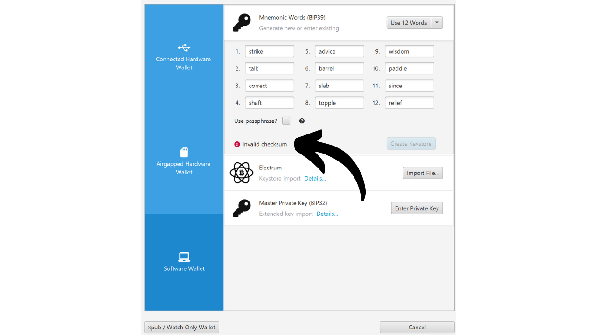
Setelah membuat dompetmu, jangan lupa untuk mencadangkan seedphrase di media fisik seperti kertas atau logam, lalu hancurkan lembar kerja yang kamu gunakan selama proses pembuatannya untuk mencegah kebocoran informasi.

## Kasus Spesifik Opsi Dice Roll pada Coldcards

Dompet hardware dari keluarga Coldcard menawarkan [fitur yang dinamakan _Dice Roll_](https://youtu.be/Rc29d9m92xg?si=OeFW2iCGRvxexhK7), untuk menghasilkan seedphrase dompetmu dengan dadu. Metode ini sangat baik karena memberimu kontrol langsung atas pembuatan entropi, tanpa memerlukan penggunaan perangkat eksternal untuk menghitung checksum seperti dalam tutorial kami.

Namun, insiden pencurian bitcoin baru-baru ini dilaporkan karena penggunaan fitur ini yang tidak tepat. Memang, jumlah lemparan dadu yang terlalu sedikit bisa menyebabkan entropi tidak mencukupi, yang secara teori memungkinkan brute-force terhadap seedphrase dan pencurian bitcoin terkait. Untuk mengurangi risiko ini, disarankan melakukan setidaknya 99 lemparan dadu pada Coldcard agar entropi cukup.

Metode interpretasi hasil yang diusulkan oleh Coldcard berbeda dari yang disajikan dalam tutorial ini. Sementara kami merekomendasikan 128 lemparan untuk mencapai 128 bit keamanan dalam tutorial, Coldcard menyarankan 99 lemparan untuk mencapai 256 bit keamanan. Memang, dalam pendekatan kami, hanya dua hasil yang mungkin untuk setiap lemparan dadu: genap (`0`) atau ganjil (`1`). Oleh karena itu, entropi yang dihasilkan oleh setiap lemparan sama dengan `log2(2)`. Dalam kasus Coldcard, yang memperhitungkan enam sisi dadu yang mungkin (dari `1` sampai `6`), entropi per lemparan sama dengan `log2(6)`. Inilah sebabnya mengapa dalam tutorial kami, kita perlu melakukan lebih banyak lemparan untuk mencapai tingkat entropi yang sama.
Entropi = jumlah lemparan \* log2(jumlah kemungkinan hasil pada dadu)
Coldcard :

Entropi = 99 \* log2(6)
Entropi = 255.91

Tutorial Kami :

Entropi = 128 \* log2(2)
Entropi = 128
