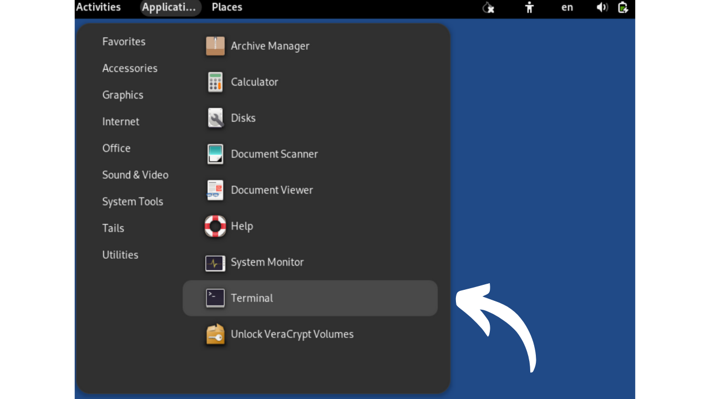
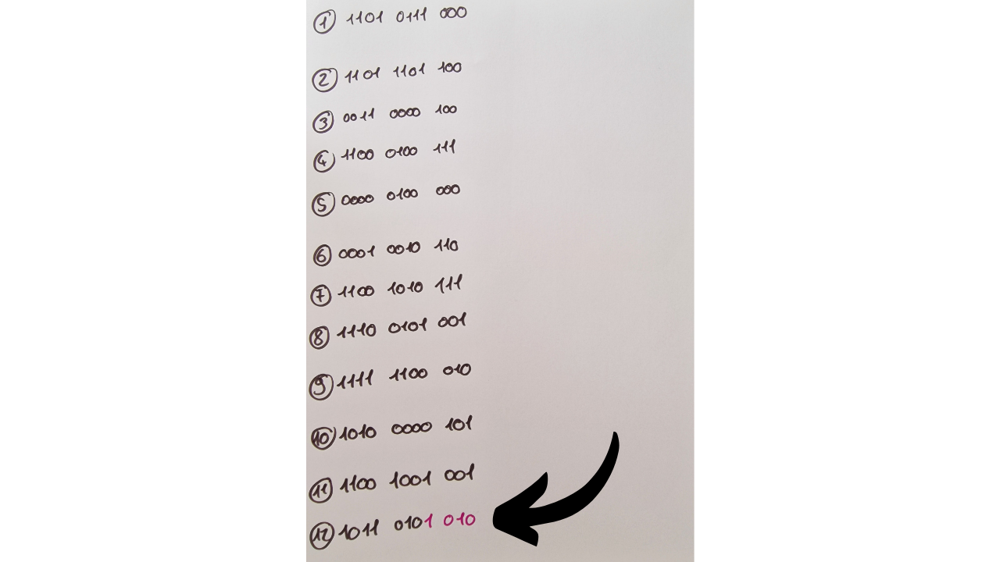

Dalam tutorial ini, Anda akan belajar bagaimana cara membuat frase pemulihan untuk dompet Bitcoin secara manual menggunakan lemparan dadu.

**PERINGATAN:** Menghasilkan frase mnemonik secara aman memerlukan tidak meninggalkan jejak digital selama pembuatannya, yang hampir mustahil. Jika tidak, dompet tersebut akan menampilkan permukaan serangan yang terlalu besar, secara signifikan meningkatkan risiko bitcoin Anda dicuri. **Oleh karena itu, sangat disarankan untuk tidak mentransfer dana ke dompet yang bergantung pada frase pemulihan yang Anda hasilkan sendiri.** Meskipun Anda mengikuti tutorial ini dengan tepat, masih ada risiko bahwa frase pemulihan bisa dikompromikan. **Oleh karena itu, tutorial ini seharusnya tidak diterapkan untuk pembuatan dompet nyata.** Menggunakan dompet perangkat keras untuk tugas ini jauh lebih aman, karena menghasilkan frase secara offline, dan kriptografer sebenarnya telah mempertimbangkan penggunaan sumber entropi kualitatif.

Tutorial ini hanya dapat diikuti untuk tujuan eksperimental saja untuk pembuatan dompet fiktif, tanpa niat menggunakan itu dengan bitcoin nyata. Namun, pengalaman ini menawarkan dua manfaat:
- Pertama, ini memungkinkan Anda untuk lebih memahami mekanisme dasar dompet Bitcoin Anda;
- Kedua, ini memungkinkan Anda untuk tahu bagaimana melakukannya. Saya tidak mengatakan ini akan berguna suatu hari, tapi mungkin!

## Apa itu frase mnemonik?
Frase pemulihan, juga terkadang disebut "mnemonik," "frase benih," atau "frase rahasia," adalah urutan yang biasanya terdiri dari 12 atau 24 kata, yang dihasilkan secara pseudo-acak dari sumber entropi. Urutan pseudo-acak selalu dilengkapi dengan checksum.

Frase mnemonik, bersama dengan passphrase opsional, digunakan untuk menurunkan semua kunci yang terkait dengan dompet HD (Hierarchical Deterministic) secara deterministik. Ini berarti bahwa dari frase ini, dimungkinkan untuk menghasilkan dan merekreasi semua kunci privat dan publik dari dompet Bitcoin, dan akibatnya, mengakses dana yang terkait dengannya.

Tujuan dari kalimat ini adalah untuk menyediakan sarana cadangan dan pemulihan bitcoin yang mudah digunakan. Sangat penting untuk menjaga frase mnemonik di tempat yang aman dan terlindungi, karena siapa pun yang memiliki frase ini akan memiliki akses ke dana dari dompet yang sesuai. Jika digunakan dalam konteks dompet tradisional, dan tanpa passphrase opsional, seringkali merupakan SPOF (Single Point Of Failure).
Biasanya, frase ini diberikan langsung kepada Anda saat membuat dompet, oleh perangkat lunak atau dompet perangkat keras yang digunakan. Namun, juga mungkin untuk menghasilkan frase ini sendiri, dan kemudian memasukkannya pada dukungan yang dipilih untuk menurunkan kunci dompet. Inilah yang akan kita pelajari untuk dilakukan dalam tutorial ini.

## Persiapan bahan yang diperlukan
Untuk pembuatan frase pemulihan Anda secara manual, Anda akan memerlukan:
- Selembar kertas;
- Sebuah pena atau pensil, idealnya dengan warna yang berbeda untuk memudahkan organisasi;
- Beberapa dadu, untuk meminimalkan risiko bias yang terkait dengan dadu yang tidak seimbang;
- [Daftar 2048 kata BIP39](https://github.com/DecouvreBitcoin/sovereign-university-data/tree/dev/tutorials/others/generate-mnemonic-phrase/assets/BIP39-WORDLIST.pdf) yang dicetak.

Selanjutnya, penggunaan komputer dengan terminal akan menjadi perlu untuk perhitungan checksum. Ini adalah alasan tepat mengapa saya menyarankan terhadap generasi manual frase mnemonik. Menurut saya, intervensi komputer, bahkan di bawah tindakan pencegahan yang disebutkan dalam tutorial ini, secara signifikan meningkatkan kerentanan dompet.
Untuk pendekatan eksperimental mengenai "dompet fiktif", Anda dapat menggunakan komputer biasa dan terminalnya. Namun, untuk pendekatan yang lebih ketat yang bertujuan untuk membatasi risiko kompromi frasa Anda, idealnya adalah menggunakan PC yang terputus dari internet (lebih disukai tanpa komponen wifi atau koneksi kabel RJ45), dilengkapi dengan minimum periferal (semua harus terhubung melalui kabel, untuk menghindari Bluetooth), dan yang terpenting, berjalan pada distribusi Linux amnesik seperti [Tails](https://tails.boum.org/index.fr.html), yang dimulai dari media yang dapat dilepas.


Dalam konteks nyata, akan sangat penting untuk memastikan kerahasiaan ruang kerja Anda dengan memilih lokasi yang jauh dari pandangan orang lain, tanpa lalu lintas orang, dan bebas dari kamera (webcam, telepon...).
Disarankan untuk menggunakan jumlah dadu yang banyak untuk mengurangi dampak dadu yang mungkin tidak seimbang terhadap entropi. Sebelum penggunaannya, memeriksa dadu disarankan: ini dapat dicapai dengan menguji mereka dalam mangkuk air garam jenuh, memungkinkan dadu untuk mengapung. Kemudian lanjutkan untuk menggulirkan setiap dadu sekitar dua puluh kali dalam air garam, mengamati hasilnya. Jika satu atau dua sisi muncul secara tidak proporsional dibandingkan dengan yang lain, perluas tes dengan lebih banyak gulungan. Hasil yang terdistribusi secara merata menunjukkan bahwa dadu tersebut dapat diandalkan. Namun, jika satu atau dua sisi secara teratur mendominasi, dadu tersebut harus disisihkan, karena mereka dapat mengkompromikan entropi dari frasa mnemonik Anda dan, akibatnya, keamanan dompet Anda.
Dalam kondisi nyata, setelah melakukan pemeriksaan ini, Anda akan siap untuk menghasilkan entropi yang diperlukan. Untuk dompet fiktif eksperimental yang dibuat sebagai bagian dari tutorial ini, Anda secara alami dapat melewatkan persiapan ini.

## Beberapa Pengingat tentang Frasa Pemulihan
Untuk memulai, kita akan mengulas dasar-dasar pembuatan frasa mnemonik menurut BIP39. Seperti yang telah dijelaskan sebelumnya, frasa tersebut berasal dari informasi pseudo-acak berukuran tertentu, yang kemudian ditambahkan checksum untuk memastikan integritasnya.

Ukuran informasi awal ini, sering disebut sebagai "entropi," ditentukan oleh jumlah kata yang Anda inginkan dalam frasa pemulihan. Format yang paling umum adalah frasa dari 12 dan 24 kata, yang masing-masing berasal dari entropi 128 bit dan 256 bit. Berikut adalah tabel yang menunjukkan ukuran entropi yang berbeda menurut BIP39:

| Frasa (kata) | Entropi (bit) | Checksum (bit) | Entropi + Checksum (bit) |
| --------------- | --------------- | --------------- | -------------------------- |
| 12              | 128             | 4               | 132                        |
| 15              | 160             | 5               | 165                        |
| 18              | 192             | 6               | 198                        |
| 21              | 224             | 7               | 231                        |
| 24              | 256             | 8               | 264                        |

Entropi adalah sebuah angka acak antara 128 dan 256 bit. Dalam tutorial ini, kita akan mengambil contoh frasa 12 kata, di mana entropinya adalah 128 bit, yang berarti kita akan menghasilkan urutan acak dari 128 `0` atau `1`. Ini mewakili sebuah angka yang terdiri dari 128 digit dalam basis 2 (biner).
Berdasarkan entropi ini, checksum akan dihasilkan. Checksum adalah nilai yang dihitung dari sekumpulan data, digunakan untuk memverifikasi integritas dan validitas data tersebut selama transmisi atau penyimpanannya. Algoritma checksum dirancang untuk mendeteksi kesalahan atau perubahan kecelakaan dalam data.
Dalam kasus frasa mnemonik kita, fungsi dari checksum adalah untuk mendeteksi kesalahan input saat memasukkan frasa ke dalam perangkat lunak dompet. Sebuah checksum yang tidak valid menandakan adanya kesalahan dalam frasa tersebut. Sebaliknya, checksum yang valid menunjukkan bahwa frasa tersebut kemungkinan besar benar.

Untuk mendapatkan checksum ini, entropi dijalankan melalui fungsi hash SHA256. Operasi ini menghasilkan sebuah urutan 256-bit sebagai output, di mana hanya `N` bit pertama yang akan dipertahankan, `N` tergantung pada panjang frasa pemulihan yang diinginkan (lihat tabel di atas). Jadi, untuk frasa 12 kata, 4 bit pertama dari hash akan dipertahankan.


4 bit pertama ini, yang membentuk checksum, kemudian akan ditambahkan ke entropi asli. Pada tahap ini, frasa pemulihan praktis telah terbentuk, namun masih dalam bentuk biner. Untuk mengonversi urutan biner ini menjadi kata-kata sesuai dengan standar BIP39, kita akan pertama-tama membagi urutan tersebut menjadi segmen-segmen 11-bit.


Setiap paket ini mewakili sebuah angka dalam biner yang kemudian akan dikonversi menjadi angka desimal (basis 10). Kita akan menambahkan `1` ke setiap angka, karena dalam komputasi, penghitungan dimulai dari `0`, namun daftar BIP39 dinomori mulai dari `1`.


Akhirnya, angka dalam desimal memberitahu kita posisi kata yang sesuai dalam [daftar 2048 kata BIP39](https://github.com/DecouvreBitcoin/sovereign-university-data/tree/dev/tutorials/others/generate-mnemonic-phrase/assets/BIP39-WORDLIST.pdf). Yang tersisa hanyalah memilih kata-kata ini untuk menyusun frasa pemulihan untuk dompet kita.


Sekarang, mari kita lanjutkan ke praktik! Kita akan menghasilkan frasa pemulihan 12 kata. Namun, operasi ini tetap identik dalam kasus frasa 24 kata, kecuali itu akan memerlukan 256 bit entropi dan checksum 8-bit, seperti yang ditunjukkan dalam tabel kesetaraan yang terletak di awal bagian ini.

## Langkah 1: Menghasilkan Entropi
Siapkan lembaran kertas Anda, pena Anda, dan dadu Anda. Untuk memulai, kita perlu menghasilkan 128 bit secara acak, yaitu, sebuah urutan dari 128 `0` dan `1` berturut-turut. Untuk melakukan ini, kita akan menggunakan dadu.


Dadu memiliki 6 sisi, semuanya dengan kemungkinan yang sama untuk dilempar. Namun, tujuan kita adalah menghasilkan hasil biner, yang berarti dua kemungkinan hasil. Oleh karena itu, kita akan menetapkan nilai `0` untuk setiap lemparan yang mendarat pada angka genap, dan `1` untuk setiap angka ganjil. Sebagai hasilnya, kita akan melakukan 128 lemparan untuk menciptakan entropi 128-bit kita. Jika dadu menunjukkan `2`, `4`, atau `6`, kita akan menuliskan `0`; untuk `1`, `3`, atau `5`, itu akan menjadi `1`. Setiap hasil akan dicatat secara berurutan, dari kiri ke kanan dan dari atas ke bawah.

Untuk memudahkan langkah selanjutnya, kita akan mengelompokkan bit-bit tersebut menjadi paket-paket empat dan tiga, seperti yang ditunjukkan pada gambar di bawah ini. Setiap baris harus memiliki 11 bit: 2 paket dari 4 bit dan satu paket dari 3 bit.


Seperti yang Anda lihat dalam contoh saya, kata kedua belas saat ini hanya terdiri dari 7 bit. Ini akan dilengkapi dengan 4 bit dari checksum pada langkah selanjutnya untuk membentuk 11 bit.


## Langkah 2: Menghitung checksum
Langkah ini adalah yang paling kritis dalam pembuatan frasa mnemonic secara manual, karena memerlukan penggunaan komputer. Seperti yang disebutkan sebelumnya, checksum sesuai dengan awal dari hash SHA256 yang dihasilkan dari entropi. Meskipun secara teoritis mungkin untuk menghitung SHA256 dengan tangan untuk input 128 atau 256 bit, tugas ini bisa memakan waktu seluruh minggu. Lebih lagi, kesalahan apa pun dalam perhitungan manual hanya akan teridentifikasi di akhir proses, memaksa Anda untuk memulai dari awal lagi. Oleh karena itu, tidak dapat dibayangkan untuk melakukan langkah ini hanya dengan selembar kertas dan sebuah pena. Komputer hampir wajib digunakan. Jika Anda masih ingin belajar cara melakukan SHA256 dengan tangan, kami menjelaskan cara melakukannya di [kursus CRYPTO301](https://planb.network/en/courses/crypto301).

Untuk alasan ini, saya sangat menyarankan agar tidak membuat frasa manual untuk dompet aktual. Menurut saya, menggunakan komputer pada tahap ini, bahkan dengan semua tindakan pencegahan yang diperlukan, tidak masuk akal meningkatkan permukaan serangan dari dompet.
Untuk menghitung checksum sambil meninggalkan sedikit jejak sebisa mungkin, kami akan menggunakan distribusi Linux amnesik dari drive yang dapat dilepas bernama **Tails**. Sistem operasi ini boot dari USB stick dan beroperasi sepenuhnya pada RAM komputer, tanpa berinteraksi dengan hard drive. Dengan demikian, secara teori, tidak meninggalkan jejak apa pun pada komputer setelah dimatikan. Harap dicatat bahwa Tails hanya kompatibel dengan prosesor tipe x86_64, dan tidak dengan prosesor tipe ARM.
Untuk memulai, dari komputer biasa Anda, [unduh gambar Tails dari situs web resminya](https://tails.net/install/index.fr.html). Pastikan keaslian unduhan Anda dengan menggunakan tanda tangan pengembang atau alat verifikasi yang ditawarkan oleh situs tersebut.

Pertama, lanjutkan untuk memformat USB stick Anda, kemudian instal Tails menggunakan alat seperti [Balena Etcher](https://etcher.balena.io/).

Setelah memastikan bahwa flashing berhasil, matikan komputer Anda. Kemudian lanjutkan untuk memutus sambungan catu daya dan lepaskan hard drive dari motherboard PC Anda. Dalam kasus di mana kartu WiFi ada, sebaiknya dicabut. Demikian pula, lepaskan kabel Ethernet RJ45. Untuk meminimalkan risiko kebocoran data, disarankan untuk mencabut kotak internet Anda dan mematikan ponsel Anda. Selain itu, pastikan untuk mencabut periferal yang tidak perlu dari komputer Anda, seperti mikrofon, webcam, speaker, atau headset, dan periksa bahwa periferal lain hanya terhubung melalui kabel. Semua langkah persiapan PC ini tidak esensial, tetapi mereka hanya membantu untuk mengurangi permukaan serangan sebanyak mungkin dalam konteks nyata.

Periksa apakah BIOS Anda dikonfigurasi untuk mengizinkan booting dari perangkat eksternal. Jika tidak, ubah pengaturan ini, kemudian restart mesin Anda. Setelah Anda mengamankan lingkungan komputer, restart komputer dari USB stick dengan OS Tails.

Di layar sambutan Tails, pilih bahasa pilihan Anda, kemudian luncurkan sistem dengan mengklik `Start Tails`.


Dari desktop, klik pada tab `Applications`.


Navigasikan ke menu `Utilities`.
Dan akhirnya, klik pada aplikasi `Terminal`.



Anda akan sampai pada terminal perintah baru yang kosong.


Ketik perintah `echo`, diikuti oleh entropi yang sebelumnya Anda hasilkan, pastikan untuk memasukkan spasi antara `echo` dan urutan digit biner Anda.


Tambahkan spasi tambahan, lalu masukkan perintah berikut, menggunakan *pipe* (`|`):
```plaintext
| shasum -a 256 -0
```


Dalam contoh dengan entropi saya, total perintahnya adalah sebagai berikut:
```plaintext
echo 11010111000110111011000011000010011000100111000001000000001001011011001010111111001010011111110001010100000101110010010011011010 | shasum -a 256 -0
```

Dalam perintah ini:
- `echo` digunakan untuk mengirimkan urutan bit;
- `|`, *pipe*, digunakan untuk mengarahkan output dari perintah `echo` ke input dari perintah selanjutnya;
- `shasum` memulai fungsi hashing yang termasuk dalam keluarga SHA (*Secure Hash Algorithm*);
- `-a` menentukan pilihan algoritma hashing tertentu;
- `256` menunjukkan bahwa algoritma SHA256 digunakan;
- `-0` memungkinkan input diinterpretasikan sebagai angka biner.

Setelah memeriksa dengan teliti bahwa urutan biner Anda tidak mengandung kesalahan ketik, tekan tombol `Enter` untuk menjalankan perintah. Terminal kemudian akan menampilkan hash SHA256 dari entropi Anda.


Untuk saat ini, hash dinyatakan dalam format heksadesimal (basis 16). Sebagai contoh, milik saya adalah:
```plaintext
a27abf1aff70311917a59a43ce86fa45a62723a00dd2f9d3d059aeac9b4b13d8
```

Untuk menyelesaikan frasa mnemonik kita, kita hanya memerlukan 4 bit pertama dari hash, yang merupakan checksum. Dalam format heksadesimal, setiap karakter mewakili 4 bit. Dengan demikian, kita hanya akan menyimpan karakter pertama dari hash. Untuk frasa 24 kata, akan diperlukan untuk mempertimbangkan dua karakter pertama. Dalam contoh saya, ini sesuai dengan huruf: `a`. Catat karakter ini dengan hati-hati di suatu tempat di lembaran Anda, lalu matikan komputer Anda.

Langkah selanjutnya adalah mengonversi karakter heksadesimal ini (basis 16) menjadi nilai biner (basis 2), karena frasa kita dibangun dalam format ini. Untuk melakukan ini, Anda dapat menggunakan tabel konversi berikut:


| Desimal (basis 10) | Heksadesimal (basis 16) | Biner (basis 2) |
| ----------------- | --------------------- | --------------- |
| 0                 | 0                     | 0000            |
| 1                 | 1                     | 0001            |
| 2                 | 2                     | 0010            |
| 3                 | 3                     | 0011            |
| 4                 | 4                     | 0100            |
| 5                 | 5                     | 0101            |
| 6                 | 6                     | 0110            |
| 7                 | 7                     | 0111            |
| 8                 | 8                     | 1000            |
Dalam contoh saya, huruf `a` sesuai dengan angka biner `1010`. Keempat bit ini membentuk checksum dari frasa pemulihan kita. Anda sekarang dapat menambahkannya ke entropi yang sudah Anda catat di lembaran kertas Anda, menempatkannya di akhir kata terakhir.



Frasa mnemonik Anda sekarang lengkap, tetapi dalam format biner. Langkah selanjutnya adalah mengonversinya ke dalam sistem desimal sehingga Anda kemudian dapat mengaitkan setiap angka dengan kata yang sesuai dalam daftar BIP39.

## Langkah 3: Mengonversi Kata-kata ke Desimal
Untuk mengonversi setiap baris biner menjadi angka desimal, kita akan menggunakan metode yang memudahkan perhitungan manual. Saat ini, Anda memiliki dua belas baris di kertas Anda, masing-masing terdiri dari 11 digit biner `0` atau `1`. Untuk melanjutkan konversi ke desimal, tetapkan pada setiap digit pertama nilai `1024` jika itu adalah `1`, jika tidak `0`. Untuk digit kedua, nilai `512` akan ditetapkan jika itu adalah `1`, jika tidak `0`, dan seterusnya hingga digit kesebelas. Korespondensinya adalah sebagai berikut:
- Bit pertama: `1024`;
- Bit kedua: `512`;
- Bit ketiga: `256`;
- Bit keempat: `128`;
- Bit kelima: `64`;
- Bit keenam: `32`;
- Bit ketujuh: `16`;
- Bit kedelapan: `8`;
- Bit kesembilan: `4`;
- Bit kesepuluh: `2`;
- Bit kesebelas: `1`.

Untuk setiap baris, kita akan menjumlahkan nilai-nilai yang sesuai dengan digit `1` untuk mendapatkan angka desimal yang setara dengan angka biner. Mari kita ambil contoh baris biner yang sama dengan:
```plaintext
1010 1101 101
```

Konversinya akan sebagai berikut:

Hasilnya kemudian akan menjadi:
```plaintext
1389
```

Untuk setiap bit yang sama dengan `1`, laporkan angka yang terkait di bawah ini. Untuk setiap bit yang sama dengan `0`, laporkan tidak ada.


Kemudian, cukup jumlahkan semua angka yang divalidasi oleh `1` untuk mendapatkan angka desimal yang mewakili setiap baris biner. Misalnya, inilah tampilannya untuk lembaran saya:


## Langkah 4: Mencari Kata-kata dari Frasa Mnemonik
Dengan angka desimal yang diperoleh, kita sekarang dapat menemukan kata-kata yang sesuai dalam daftar untuk menyusun frasa mnemonik. Namun, penomoran dari 2048 kata dalam daftar BIP39 berkisar dari `1` hingga `2048`. Tetapi, hasil biner yang dihitung berkisar dari `0` hingga `2047`. Oleh karena itu, ada pergeseran satu unit yang perlu diperbaiki. Untuk memperbaiki pergeseran ini, cukup tambahkan `1` ke dua belas angka desimal yang sebelumnya dihitung.


Setelah penyesuaian ini, Anda memiliki peringkat setiap kata dalam daftar. Yang tersisa hanyalah mengidentifikasi setiap kata berdasarkan nomornya. Jelas, seperti semua langkah lainnya, Anda tidak boleh menggunakan komputer Anda untuk melakukan konversi ini. Oleh karena itu, pastikan Anda telah mencetak daftar tersebut sebelumnya.
[**-> Cetak daftar BIP39 dalam format A4.**](https://github.com/DecouvreBitcoin/sovereign-university-data/tree/dev/tutorials/others/generate-mnemonic-phrase/assets/BIP39-WORDLIST.pdf)

Sebagai contoh, jika nomor yang diperoleh dari baris pertama adalah 1721, kata yang sesuai akan menjadi kata ke-1721 dalam daftar:
```plaintext
1721. strike
```

Dengan cara ini, kita melanjutkan secara bertahap dengan 12 kata untuk membentuk frasa mnemonik kita.


## Langkah 5: Membuat Dompet Bitcoin
Pada titik ini, yang tersisa hanyalah mengimpor frasa mnemonik kita ke dalam perangkat lunak dompet Bitcoin. Tergantung pada preferensi kita, ini dapat dilakukan pada perangkat lunak desktop untuk mendapatkan hot wallet, atau pada hardware wallet untuk cold wallet.


Hanya saat impor, Anda dapat memverifikasi validitas checksum Anda. Jika perangkat lunak menampilkan pesan seperti `Invalid Checksum`, itu berarti kesalahan telah merayap ke dalam proses pembuatan Anda. Umumnya, kesalahan ini berasal baik dari kesalahan perhitungan selama konversi dan penambahan manual, atau dari kesalahan ketik saat memasukkan entropi Anda di terminal pada Tails. Akan diperlukan untuk memulai proses dari awal untuk memperbaiki kesalahan ini.


Setelah membuat dompet Anda, jangan lupa untuk mencadangkan frasa pemulihan Anda pada media fisik, seperti kertas atau logam, dan hancurkan spreadsheet yang digunakan selama generasinya untuk mencegah kebocoran informasi.

## Kasus Spesifik Opsi Dice Roll pada Coldcards
Dompet hardware dari keluarga Coldcard menawarkan [fitur yang dinamakan *Dice Roll*](https://youtu.be/Rc29d9m92xg?si=OeFW2iCGRvxexhK7), untuk menghasilkan frasa pemulihan dompet Anda dengan dadu. Metode ini sangat baik karena memberi Anda kontrol langsung atas pembuatan entropi, tanpa memerlukan penggunaan perangkat eksternal untuk menghitung checksum seperti dalam tutorial kami.

Namun, insiden pencurian bitcoin telah dilaporkan baru-baru ini karena penggunaan fitur ini yang tidak tepat. Memang, jumlah lemparan dadu yang terlalu terbatas dapat menyebabkan entropi yang tidak cukup, secara teoritis memungkinkan untuk brute force frasa mnemonik dan mencuri bitcoin yang terkait. Untuk menghindari risiko ini, disarankan untuk melakukan setidaknya 99 lemparan dadu pada Coldcard, yang memastikan entropi yang cukup.

Metode interpretasi hasil yang diusulkan oleh Coldcard berbeda dari yang disajikan dalam tutorial ini. Sementara kami merekomendasikan 128 lemparan untuk mencapai 128 bit keamanan dalam tutorial, Coldcard menyarankan 99 lemparan untuk mencapai 256 bit keamanan. Memang, dalam pendekatan kami, hanya dua hasil yang mungkin untuk setiap lemparan dadu: genap (`0`) atau ganjil (`1`). Oleh karena itu, entropi yang dihasilkan oleh setiap lemparan sama dengan `log2(2)`. Dalam kasus Coldcard, yang memperhitungkan enam sisi dadu yang mungkin (dari `1` sampai `6`), entropi per lemparan sama dengan `log2(6)`. Inilah sebabnya mengapa dalam tutorial kami, kita perlu melakukan lebih banyak lemparan untuk mencapai tingkat entropi yang sama.
Entropi = jumlah lemparan * log2(jumlah kemungkinan hasil pada dadu)
Coldcard :

Entropi = 99 * log2(6)
Entropi = 255.91

Tutorial Kami :

Entropi = 128 * log2(2)
Entropi = 128