Neste tutorial, você aprenderá como construir manualmente uma frase de recuperação para uma carteira Bitcoin usando rolagens de dados.

**AVISO:** Gerar uma frase mnemônica de maneira segura requer não deixar rastro digital durante sua criação, o que é quase impossível. Caso contrário, a carteira apresentaria uma superfície de ataque muito grande, aumentando significativamente o risco de seus bitcoins serem roubados. **Portanto, é fortemente aconselhado contra a transferência de fundos para uma carteira que dependa de uma frase de recuperação que você gerou por conta própria.** Mesmo que você siga este tutorial à risca, há um risco de que a frase de recuperação possa ser comprometida. **Portanto, este tutorial não deve ser aplicado à criação de uma carteira real.** Usar uma carteira de hardware para esta tarefa é muito menos arriscado, pois ela gera a frase offline, e criptógrafos reais consideraram o uso de fontes de entropia qualitativas.

Este tutorial pode ser seguido apenas para fins experimentais para a criação de uma carteira fictícia, sem a intenção de usá-la com bitcoins reais. No entanto, a experiência oferece dois benefícios:
- Primeiro, permite que você entenda melhor os mecanismos na base da sua carteira Bitcoin;
- Em segundo lugar, permite que você saiba como fazê-lo. Não estou dizendo que será útil um dia, mas pode ser!

## O que é uma frase mnemônica?
Uma frase de recuperação, também chamada às vezes de "mnemônica", "frase-semente" ou "frase secreta", é uma sequência geralmente composta de 12 ou 24 palavras, que é gerada de maneira pseudoaleatória a partir de uma fonte de entropia. A sequência pseudoaleatória é sempre completada com um checksum.

A frase mnemônica, juntamente com uma passphrase opcional, é usada para derivar deterministicamente todas as chaves associadas a uma carteira HD (Hierarchical Deterministic). Isso significa que a partir desta frase, é possível gerar e recriar deterministicamente todas as chaves privadas e públicas da carteira Bitcoin, e consequentemente, acessar os fundos associados a ela.

O propósito desta frase é fornecer um meio fácil de backup e recuperação de bitcoins. É imperativo manter a frase mnemônica em um local seguro e protegido, pois qualquer pessoa em posse desta frase teria acesso aos fundos da carteira correspondente. Se for usada no contexto de uma carteira tradicional, e sem uma passphrase opcional, muitas vezes constitui um SPOF (Single Point Of Failure).
Geralmente, essa frase é fornecida diretamente ao criar sua carteira, pelo software ou carteira de hardware usado. No entanto, também é possível gerar essa frase por conta própria e, em seguida, inseri-la no suporte escolhido para derivar as chaves da carteira. É isso que aprenderemos a fazer neste tutorial.

## Preparação dos materiais necessários
Para a criação da sua frase de recuperação à mão, você precisará de:
- Uma folha de papel;
- Uma caneta ou lápis, idealmente de cores diferentes para facilitar a organização;
- Vários dados, para minimizar os riscos de viés relacionados a um dado desequilibrado;
- [A lista de 2048 palavras BIP39](https://github.com/PlanB-Network/bitcoin-educational-content/blob/dev/resources/bet/bip39-wordlist/assets/BIP39-WORDLIST.pdf) impressa.

Posteriormente, o uso de um computador com um terminal se tornará necessário para o cálculo do checksum. É precisamente por essa razão que aconselho contra a geração manual da frase mnemônica. Na minha opinião, a intervenção de um computador, mesmo sob as precauções mencionadas neste tutorial, aumenta significativamente a vulnerabilidade de uma carteira.
Para uma abordagem experimental envolvendo uma "carteira fictícia", é possível usar seu computador usual e seu terminal. No entanto, para uma abordagem mais rigorosa visando limitar os riscos de comprometimento da sua frase, o ideal seria usar um PC desconectado da internet (preferencialmente sem um componente wifi ou conexão com fio RJ45), equipado com o mínimo de periféricos (todos os quais devem ser conectados por cabo, para evitar Bluetooth), e acima de tudo, rodando em uma distribuição Linux amnésica como [Tails](https://tails.boum.org/index.fr.html), iniciada a partir de um meio removível.


Em um contexto real, seria crucial garantir a confidencialidade do seu espaço de trabalho escolhendo um local longe de olhares curiosos, sem tráfego de pessoas e livre de câmeras (webcams, telefones...).
É recomendado usar um número alto de dados para mitigar o impacto de um dado potencialmente desequilibrado na entropia. Antes de usá-los, é recomendado verificar os dados: isso pode ser alcançado testando-os em uma tigela de água saturada de sal, permitindo que os dados flutuem. Em seguida, proceda rolando cada dado cerca de vinte vezes na água salgada, observando os resultados. Se uma ou duas faces aparecerem desproporcionalmente em comparação com as outras, estenda o teste com mais rolagens. Resultados distribuídos uniformemente indicam que o dado é confiável. No entanto, se uma ou duas faces regularmente dominam, esses dados devem ser deixados de lado, pois poderiam comprometer a entropia da sua frase mnemônica e, consequentemente, a segurança da sua carteira.
Em condições reais, após realizar essas verificações, você estaria pronto para gerar a entropia necessária. Para uma carteira fictícia experimental criada como parte deste tutorial, você poderia naturalmente pular essas preparações.

## Alguns Lembretes sobre a Frase de Recuperação
Para começar, vamos revisar os fundamentos da criação de uma frase mnemônica de acordo com o BIP39. Como explicado anteriormente, a frase é derivada de informações pseudoaleatórias de um certo tamanho, ao qual é adicionado um checksum para garantir sua integridade.

O tamanho dessa informação inicial, frequentemente referido como "entropia", é determinado pelo número de palavras que você deseja obter na frase de recuperação. Os formatos mais comuns são frases de 12 e 24 palavras, derivando respectivamente de uma entropia de 128 bits e 256 bits. Aqui está uma tabela mostrando os diferentes tamanhos de entropia de acordo com o BIP39:

| Frase (palavras) | Entropia (bits) | Checksum (bits) | Entropia + Checksum (bits) |
| ---------------- | --------------- | --------------- | -------------------------- |
| 12               | 128             | 4               | 132                        |
| 15               | 160             | 5               | 165                        |
| 18               | 192             | 6               | 198                        |
| 21               | 224             | 7               | 231                        |
| 24               | 256             | 8               | 264                        |

A entropia é, portanto, um número aleatório entre 128 e 256 bits. Neste tutorial, tomaremos o exemplo de uma frase de 12 palavras, na qual a entropia é de 128 bits, o que significa que geraremos uma sequência aleatória de 128 `0`s ou `1`s. Isso representa um número composto por 128 dígitos na base 2 (binário).
Com base nessa entropia, um checksum será gerado. Um checksum é um valor calculado a partir de um conjunto de dados, usado para verificar a integridade e validade desses dados durante sua transmissão ou armazenamento. Algoritmos de checksum são projetados para detectar erros acidentais ou alterações nos dados.
No caso da nossa frase mnemônica, a função do checksum é identificar quaisquer erros de entrada ao inserir a frase em um software de carteira. Um checksum inválido sinaliza a presença de um erro na frase. Por outro lado, um checksum válido indica que a frase está provavelmente correta.
Para obter esse checksum, a entropia é passada pela função hash SHA256. Esta operação produz uma sequência de 256 bits como saída, da qual apenas os primeiros `N` bits serão retidos, `N` dependendo do comprimento desejado da frase de recuperação (veja a tabela acima). Assim, para uma frase de 12 palavras, os primeiros 4 bits do hash serão mantidos.
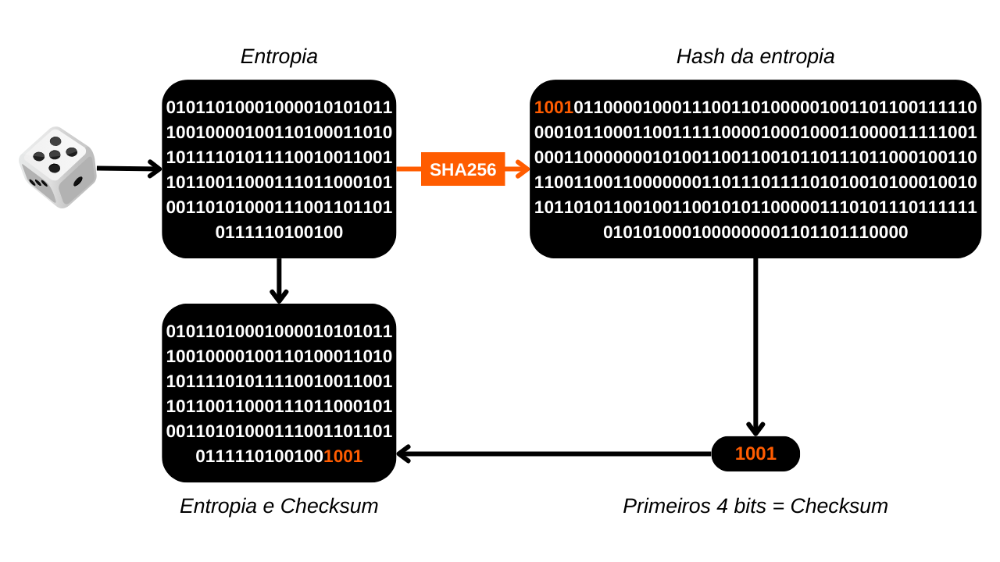
Esses primeiros 4 bits, formando o checksum, serão então adicionados à entropia original. Neste estágio, a frase de recuperação está praticamente constituída, mas ainda está em forma binária. Para converter essa sequência binária em palavras de acordo com o padrão BIP39, primeiro dividiremos a sequência em segmentos de 11 bits.
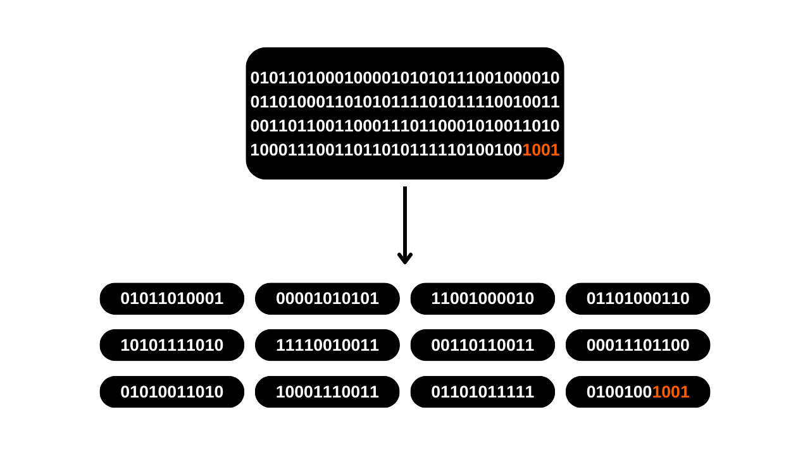
Cada um desses pacotes representa um número em binário que será então convertido em um número decimal (base 10). Adicionaremos `1` a cada número, porque em computação, a contagem começa do `0`, mas a lista BIP39 é numerada começando do `1`.

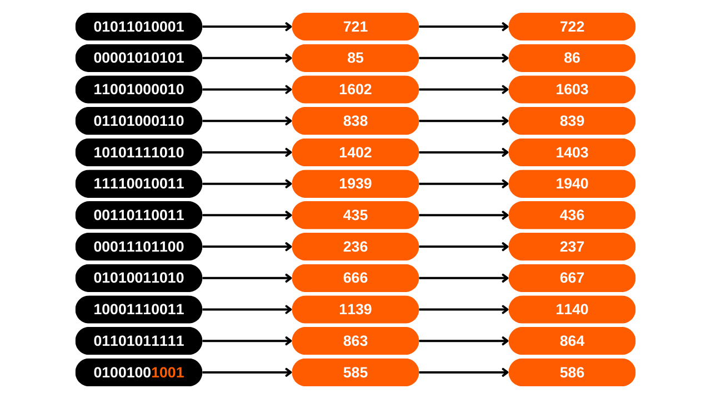

Finalmente, o número em decimal nos diz a posição da palavra correspondente na [lista de 2048 palavras BIP39](https://github.com/PlanB-Network/bitcoin-educational-content/blob/dev/resources/bet/bip39-wordlist/assets/BIP39-WORDLIST.pdf). Resta apenas selecionar essas palavras para compor a frase de recuperação para nossa carteira.

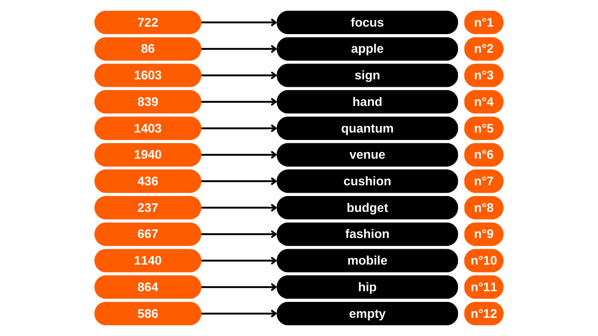

Agora, vamos passar à prática! Vamos gerar uma frase de recuperação de 12 palavras. No entanto, esta operação permanece idêntica no caso de uma frase de 24 palavras, exceto que exigiria 256 bits de entropia e um checksum de 8 bits, conforme indicado na tabela de equivalência localizada no início desta seção.

## Passo 1: Gerando a Entropia
Prepare sua folha de papel, sua caneta e seus dados. Para começar, precisaremos gerar 128 bits aleatoriamente, ou seja, uma sequência de 128 `0`s e `1`s em sequência. Para fazer isso, usaremos dados.


Dados têm 6 lados, todos com uma probabilidade idêntica de serem lançados. No entanto, nosso objetivo é produzir um resultado binário, significando dois resultados possíveis. Portanto, atribuiremos o valor `0` a cada lançamento que cair em um número par, e `1` para cada número ímpar. Como resultado, realizaremos 128 lançamentos para criar nossa entropia de 128 bits. Se o dado mostrar `2`, `4`, ou `6`, anotaremos `0`; para `1`, `3`, ou `5`, será `1`. Cada resultado será anotado sequencialmente, da esquerda para a direita e de cima para baixo.

Para facilitar os passos seguintes, agruparemos os bits em pacotes de quatro e três, conforme mostrado na imagem abaixo. Cada linha deve ter 11 bits: 2 pacotes de 4 bits e um pacote de 3 bits.

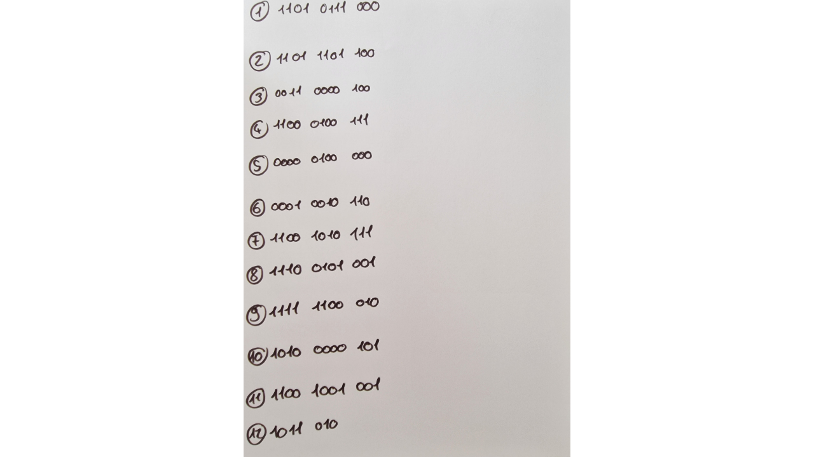
Como você pode ver no meu exemplo, a décima segunda palavra é atualmente composta por apenas 7 bits. Estes serão completados pelos 4 bits do checksum na próxima etapa para formar os 11 bits.
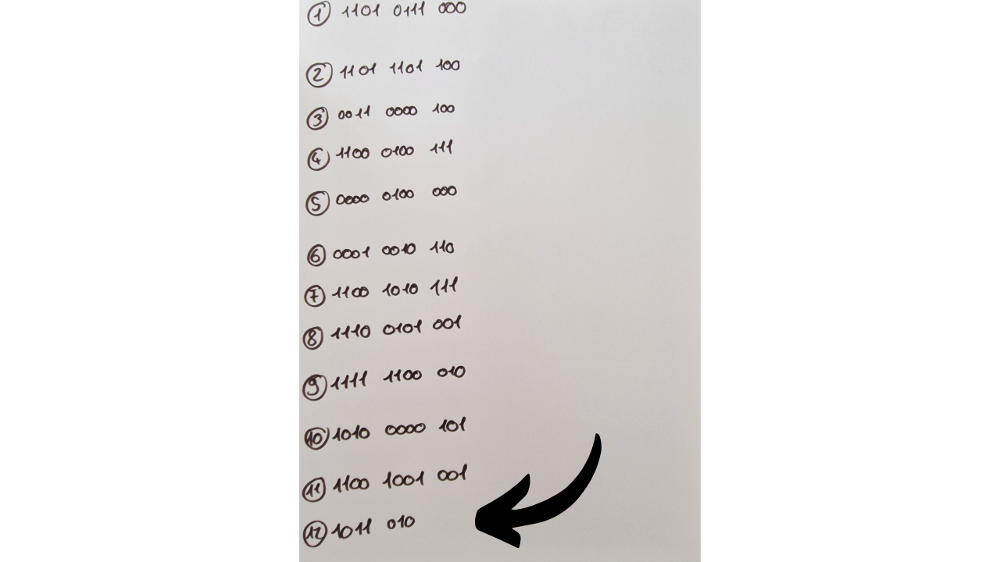

## Passo 2: Calculando o checksum
Este passo é o mais crítico na geração manual de uma frase mnemônica, pois requer o uso de um computador. Como mencionado anteriormente, o checksum corresponde ao início do hash SHA256 gerado a partir da entropia. Embora seja teoricamente possível calcular um SHA256 à mão para uma entrada de 128 ou 256 bits, essa tarefa poderia levar uma semana inteira. Além disso, qualquer erro nos cálculos manuais só seria identificado no final do processo, forçando você a começar tudo de novo desde o início. Portanto, é inimaginável fazer este passo apenas com uma folha de papel e uma caneta. Um computador é quase obrigatório. Se você ainda quiser aprender como fazer um SHA256 à mão, explicamos como fazer isso no [curso CRYPTO301](https://planb.network/en/courses/crypto301).

Por essa razão, eu aconselho fortemente contra a criação de uma frase manual para uma carteira real. Na minha opinião, usar um computador nesta etapa, mesmo com todas as precauções necessárias, aumenta de forma irrazoável a superfície de ataque da carteira.
Para calcular o checksum deixando o mínimo de rastros possível, usaremos uma distribuição Linux amnésica de um drive removível chamada **Tails**. Este sistema operacional inicia a partir de um pendrive e opera inteiramente na RAM do computador, sem interagir com o disco rígido. Assim, em teoria, não deixa nenhum rastro no computador depois que é desligado. Por favor, note que o Tails é compatível apenas com processadores do tipo x86_64, e não com processadores do tipo ARM.
Para começar, do seu computador usual, [baixe a imagem do Tails do seu site oficial](https://tails.net/install/index.fr.html). Garanta a autenticidade do seu download usando a assinatura do desenvolvedor ou a ferramenta de verificação oferecida pelo site.
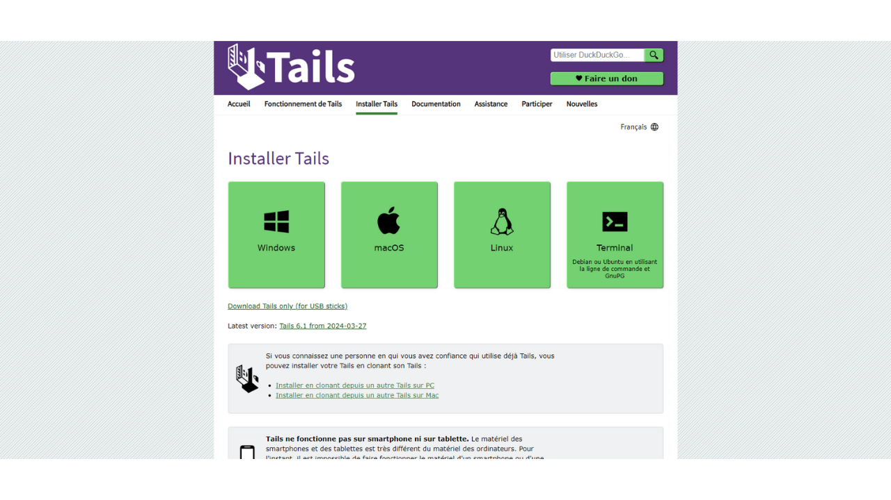
Primeiro, prossiga com a formatação do seu pendrive, depois instale o Tails usando uma ferramenta como o [Balena Etcher](https://etcher.balena.io/).

Após confirmar que a gravação foi bem-sucedida, desligue o seu computador. Em seguida, proceda para desconectar a fonte de alimentação e remover o disco rígido da placa-mãe do seu PC. No caso de uma placa WiFi estar presente, ela deve ser desconectada. Da mesma forma, remova qualquer cabo Ethernet RJ45. Para minimizar o risco de vazamento de dados, é recomendado desligar seu modem de internet e desligar o seu celular. Além disso, certifique-se de desconectar quaisquer periféricos supérfluos do seu computador, como o microfone, webcam, alto-falantes ou headset, e verifique que outros periféricos estejam conectados apenas por fio. Todos esses passos de preparação do PC não são essenciais, mas simplesmente ajudam a reduzir a superfície de ataque tanto quanto possível em um contexto real.

Verifique se o seu BIOS está configurado para permitir a inicialização a partir de um dispositivo externo. Se não, altere essa configuração, então reinicie sua máquina. Uma vez que você tenha assegurado o ambiente do computador, reinicie o computador a partir do pendrive com o Tails OS.

Na tela de boas-vindas do Tails, selecione o idioma de sua escolha, então inicie o sistema clicando em `Iniciar Tails`.

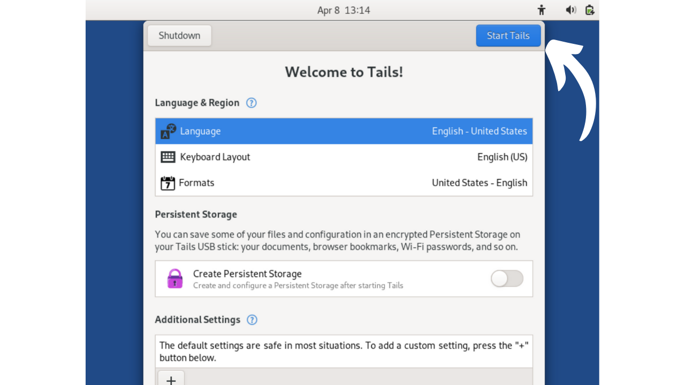

Da área de trabalho, clique na aba `Aplicações`.

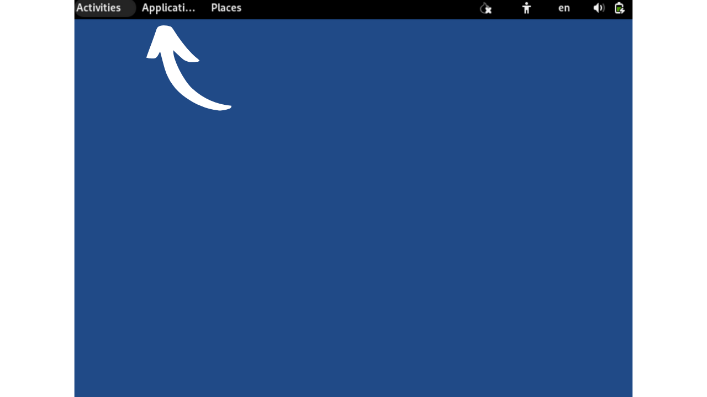

Navegue até o menu `Utilitários`.

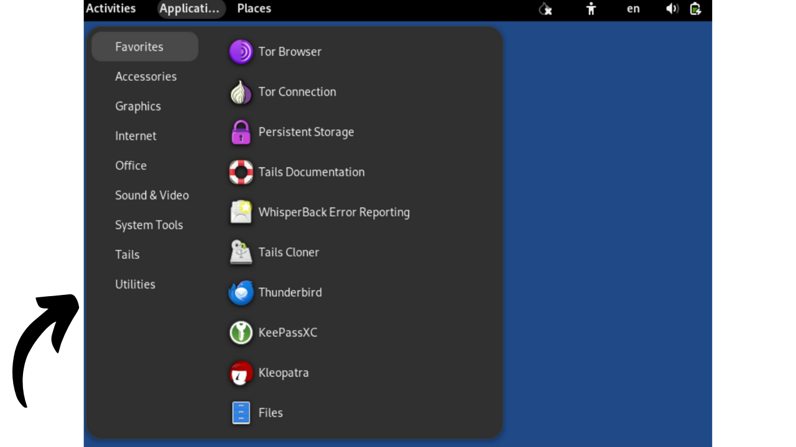
E finalmente, clique na aplicação `Terminal`.
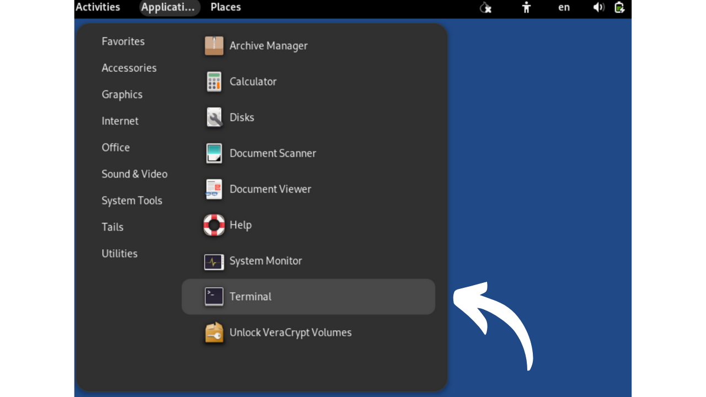

Você chegará a um novo terminal de comando em branco.

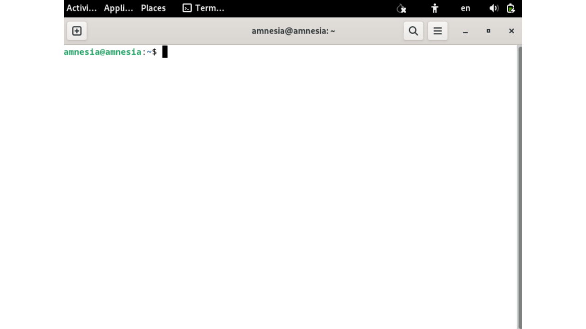
Digite o comando `echo`, seguido pela sua entropia gerada anteriormente, certificando-se de inserir um espaço entre `echo` e sua sequência de dígitos binários.
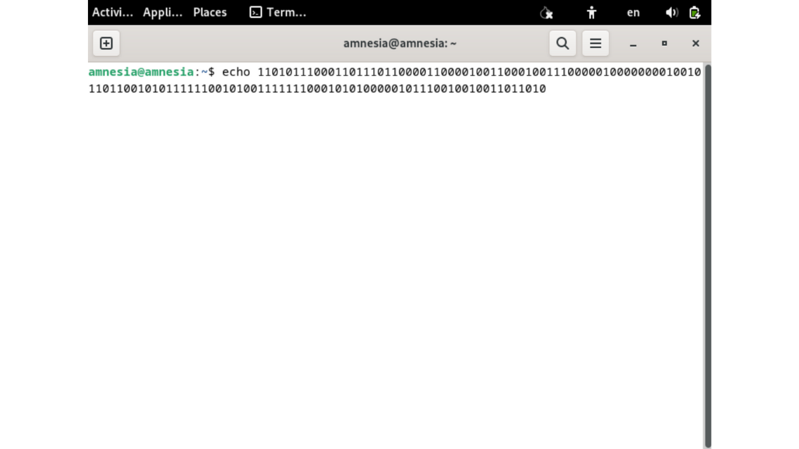

Adicione um espaço adicional, então insira o seguinte comando, usando um *pipe* (`|`):
```plaintext
| shasum -a 256 -0
```

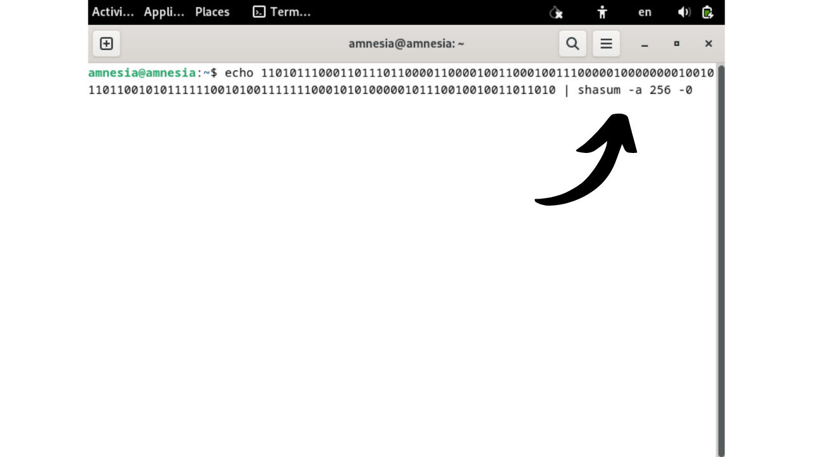

No exemplo com minha entropia, o comando total é o seguinte:
```plaintext
echo 11010111000110111011000011000010011000100111000001000000001001011011001010111111001010011111110001010100000101110010010011011010 | shasum -a 256 -0
```

Neste comando:
- `echo` é usado para enviar a sequência de bits;
- `|`, o *pipe*, é usado para direcionar a saída do comando `echo` para a entrada do próximo comando;
- `shasum` inicia uma função de hashing pertencente à família SHA (*Secure Hash Algorithm*);
- `-a` especifica a escolha de um algoritmo de hashing específico;
- `256` indica que o algoritmo SHA256 é usado;
- `-0` permite que a entrada seja interpretada como um número binário.

Após verificar cuidadosamente que sua sequência binária não contém erros de digitação, pressione a tecla `Enter` para executar o comando. O terminal então exibirá o hash SHA256 da sua entropia.

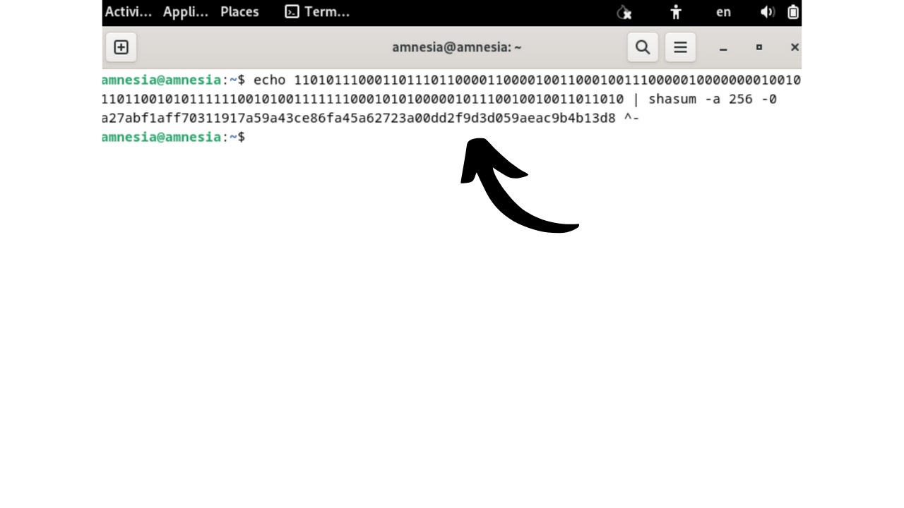

Por enquanto, o hash é expresso em formato hexadecimal (base 16). Por exemplo, o meu é:
```plaintext
a27abf1aff70311917a59a43ce86fa45a62723a00dd2f9d3d059aeac9b4b13d8
```

Para finalizar nossa frase mnemônica, precisamos apenas dos primeiros 4 bits do hash, que constituem o checksum. No formato hexadecimal, cada caractere representa 4 bits. Assim, reteremos apenas o primeiro caractere do hash. Para uma frase de 24 palavras, seria necessário levar em conta os dois primeiros caracteres. No meu exemplo, isso corresponde à letra: `a`. Anote cuidadosamente este caractere em algum lugar da sua folha, e então desligue seu computador.

O próximo passo é converter este caractere hexadecimal (base 16) em um valor binário (base 2), já que nossa frase é construída neste formato. Para fazer isso, você pode usar a seguinte tabela de conversão:

| Decimal (base 10) | Hexadecimal (base 16) | Binário (base 2) |
| ----------------- | --------------------- | ---------------- |
| 0                 | 0                     | 0000             |
| 1                 | 1                     | 0001             |
| 2                 | 2                     | 0010             |
| 3                 | 3                     | 0011             |
| 4                 | 4                     | 0100             |
| 5                 | 5                     | 0101             |
| 6                 | 6                     | 0110             |
| 7                 | 7                     | 0111             |
| 8                 | 8                     | 1000             |
| 9                 | 9                     | 1001             |
| 10                | a                     | 1010             |
| 11                | b                     | 1011             |
| 12                | c                     | 1100             |
| 13                | d                     | 1101             |
| 14                | e                     | 1110             |
| 15                | f                     | 1111             |

No meu exemplo, a letra `a` corresponde ao número binário `1010`. Estes 4 bits formam o checksum da nossa frase de recuperação. Agora você pode adicioná-los à entropia já anotada na sua folha de papel, colocando-os no final da última palavra.

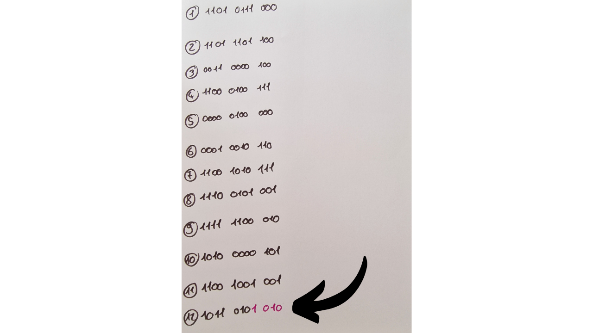

Sua frase mnemônica está agora completa, mas está em formato binário. O próximo passo será convertê-la para o sistema decimal, para que você possa então associar cada número a uma palavra correspondente na lista BIP39.

## Passo 3: Convertendo Palavras em Decimal
Para converter cada linha binária em um número decimal, usaremos um método que facilita o cálculo manual. Atualmente, você tem doze linhas no seu papel, cada uma composta por 11 dígitos binários `0` ou `1`. Para prosseguir com uma conversão para decimal, atribua a cada primeiro dígito o valor `1024` se for `1`, caso contrário `0`. Para o segundo dígito, o valor `512` será atribuído se for `1`, caso contrário `0`, e assim por diante até o décimo primeiro dígito. As correspondências são as seguintes:
- 1º bit: `1024`;
- 2º bit: `512`;
- 3º bit: `256`;
- 4º bit: `128`;
- 5º bit: `64`;
- 6º bit: `32`;
- 7º bit: `16`;
- 8º bit: `8`;
- 9º bit: `4`;
- 10º bit: `2`;
- 11º bit: `1`.

Para cada linha, somaremos os valores correspondentes aos dígitos `1` para obter o número decimal equivalente ao número binário. Vamos tomar o exemplo de uma linha binária igual a:
```plaintext
1010 1101 101
```

A conversão seria a seguinte:
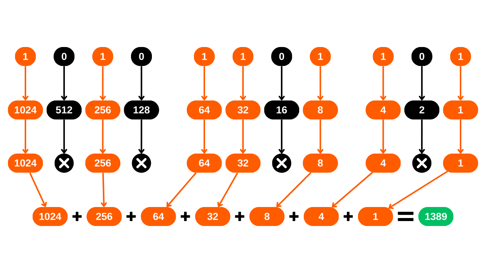
O resultado seria então:
```plaintext
1389
```

Para cada bit igual a `1`, anote o número associado abaixo. Para cada bit igual a `0`, não anote nada.

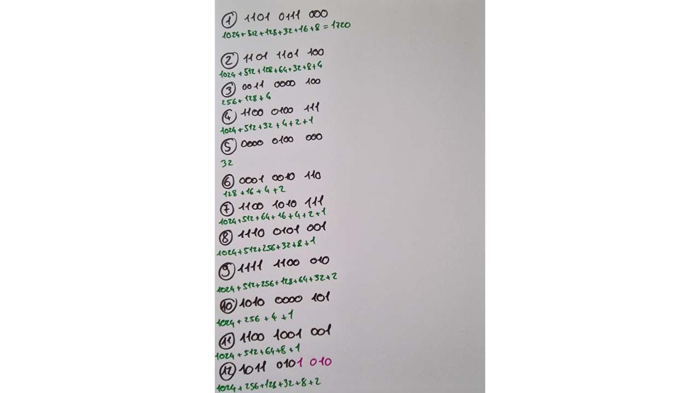
Então, simplesmente some todos os números validados por `1`s para obter o número decimal representando cada linha binária. Por exemplo, aqui está como fica para a minha folha:
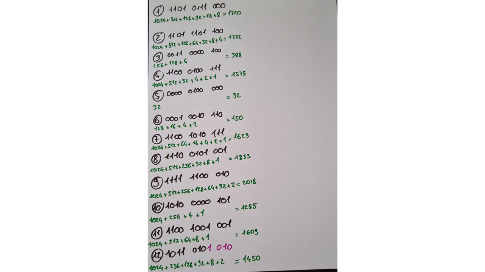

## Passo 4: Procurando pelas Palavras da Frase Mnemônica
Com os números decimais obtidos, agora podemos localizar as palavras correspondentes na lista para compor a frase mnemônica. No entanto, a numeração das 2048 palavras na lista BIP39 varia de `1` a `2048`. Mas, nossos resultados binários calculados variam de `0` a `2047`. Portanto, há um deslocamento de uma unidade que precisa ser corrigido. Para corrigir esse deslocamento, basta adicionar `1` aos doze números decimais previamente calculados.

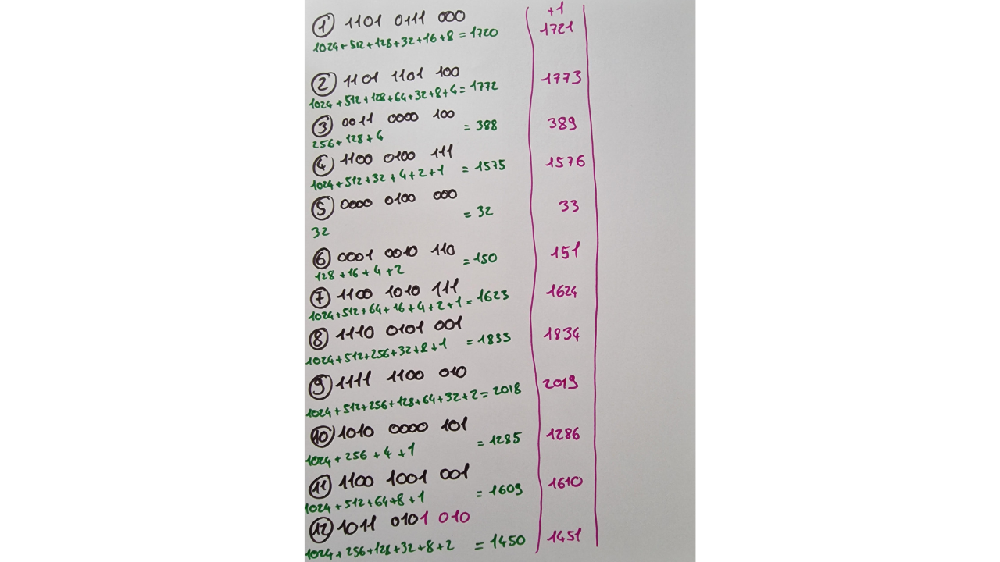
Após este ajuste, você tem o ranking de cada palavra dentro da lista. Tudo o que resta é identificar cada palavra pelo seu número. Obviamente, como em todos os outros passos, você não deve usar seu computador para realizar esta conversão. Portanto, certifique-se de ter impresso a lista previamente.
[**-> Imprima a lista BIP39 em formato A4.**](https://github.com/PlanB-Network/bitcoin-educational-content/blob/dev/resources/bet/bip39-wordlist/assets/BIP39-WORDLIST.pdf)

Por exemplo, se o número derivado da primeira linha for 1721, a palavra correspondente será a 1721ª na lista:
```plaintext
1721. strike
```
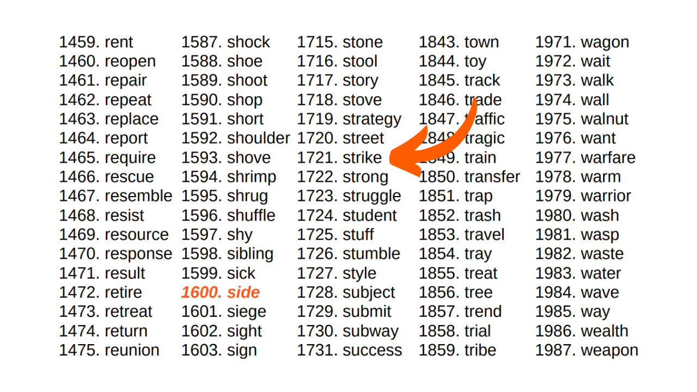
Dessa maneira, procedemos sucessivamente com as 12 palavras para construir nossa frase mnemônica.

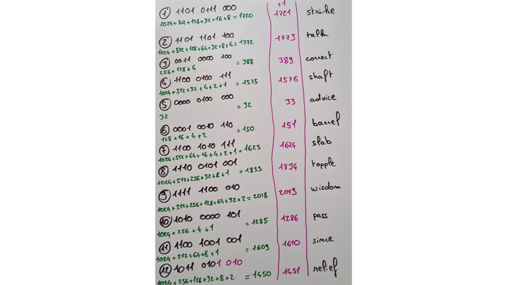

## Passo 5: Criando a Carteira Bitcoin
Neste ponto, tudo o que resta é importar nossa frase mnemônica para um software de carteira Bitcoin. Dependendo de nossas preferências, isso pode ser feito em um software de desktop para obter uma carteira quente, ou em uma carteira de hardware para uma carteira fria.

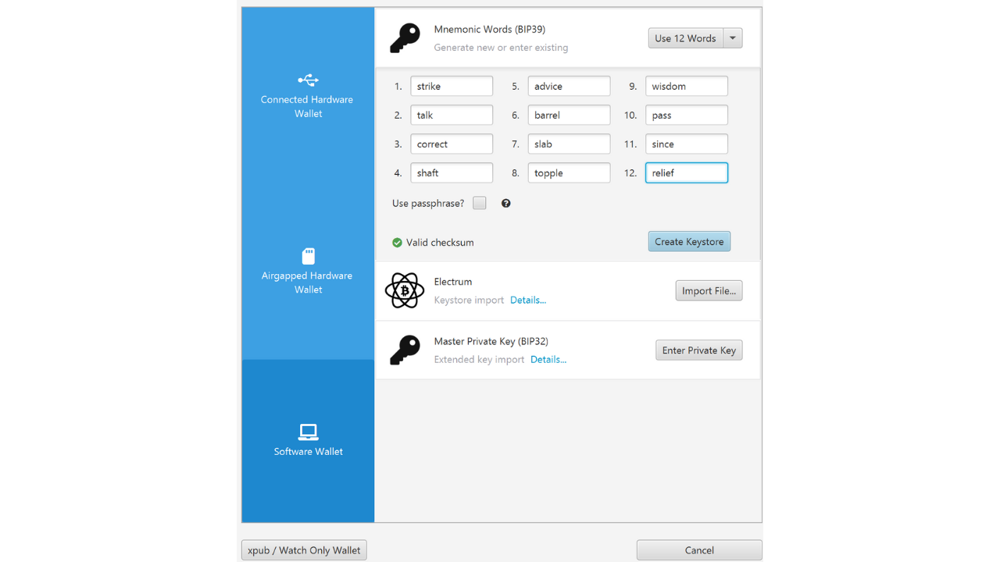

É somente durante a importação que você pode verificar a validade do seu checksum. Se o software exibir uma mensagem como `Checksum Inválido`, significa que um erro se infiltrou no seu processo de criação. Geralmente, este erro decorre ou de um erro de cálculo durante as conversões e adições manuais, ou de um erro de digitação ao inserir sua entropia no terminal no Tails. Será necessário reiniciar o processo desde o início para corrigir esses erros.

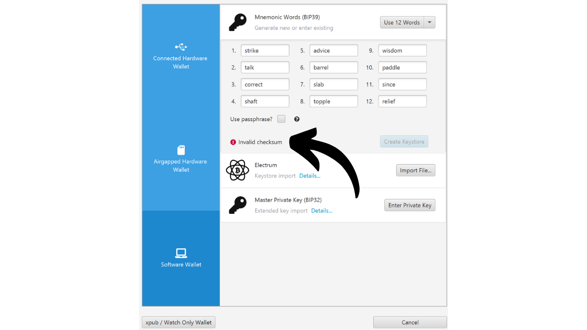
Após criar sua carteira, não esqueça de fazer backup da sua frase de recuperação em um meio físico, como papel ou metal, e destruir a planilha usada durante sua geração para evitar qualquer vazamento de informações.

## Caso Específico da Opção de Rolagem de Dados nas Coldcards
As carteiras de hardware da família Coldcard oferecem [um recurso chamado *Dice Roll*](https://youtu.be/Rc29d9m92xg?si=OeFW2iCGRvxexhK7), para gerar a frase de recuperação da sua carteira com dados. Este método é excelente porque lhe dá controle direto sobre a criação da entropia, sem requerer o uso de um dispositivo externo para calcular o checksum como em nosso tutorial.

No entanto, incidentes de roubo de bitcoins foram relatados recentemente devido ao uso inadequado deste recurso. De fato, um número limitado de rolagens de dados pode levar a entropia insuficiente, teoricamente possibilitando forçar bruscamente a frase mnemônica e roubar os bitcoins associados. Para evitar esse risco, é aconselhado realizar pelo menos 99 rolagens de dados na Coldcard, o que garante entropia suficiente.

O método de interpretação dos resultados proposto pela Coldcard difere do apresentado neste tutorial. Enquanto recomendamos 128 rolagens para alcançar 128 bits de segurança no tutorial, a Coldcard sugere 99 rolagens para atingir 256 bits de segurança. De fato, em nossa abordagem, apenas dois resultados são possíveis para cada rolagem de dados: par (`0`) ou ímpar (`1`). Portanto, a entropia gerada por cada rolagem é igual a `log2(2)`. No caso da Coldcard, que leva em conta as seis faces possíveis do dado (de `1` a `6`), a entropia por rolagem é igual a `log2(6)`. É por isso que em nosso tutorial, precisamos realizar mais rolagens para alcançar o mesmo nível de entropia.

```plaintext
Entropia = número de rolagens * log2(número de resultados possíveis no dado)
Coldcard:

Entropia = 99 * log2(6)
Entropia = 255.91

Nosso tutorial:

Entropia = 128 * log2(2)
Entropia = 128