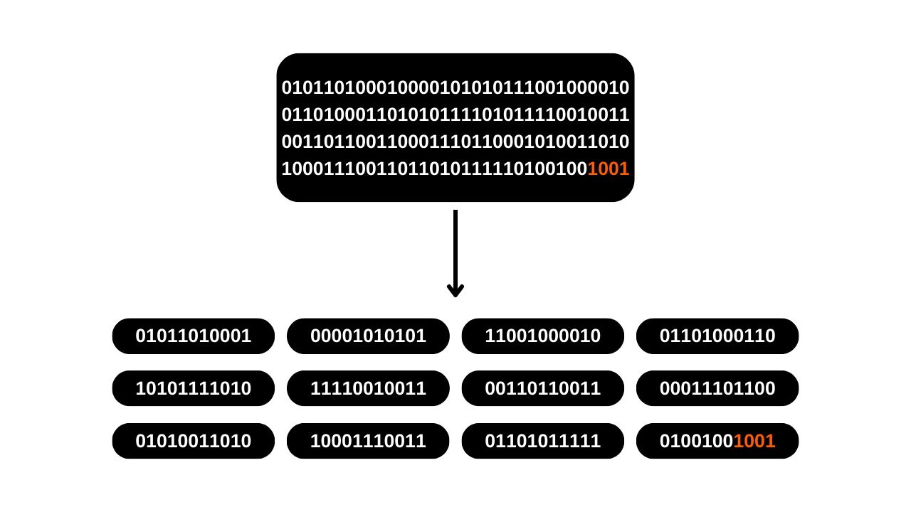
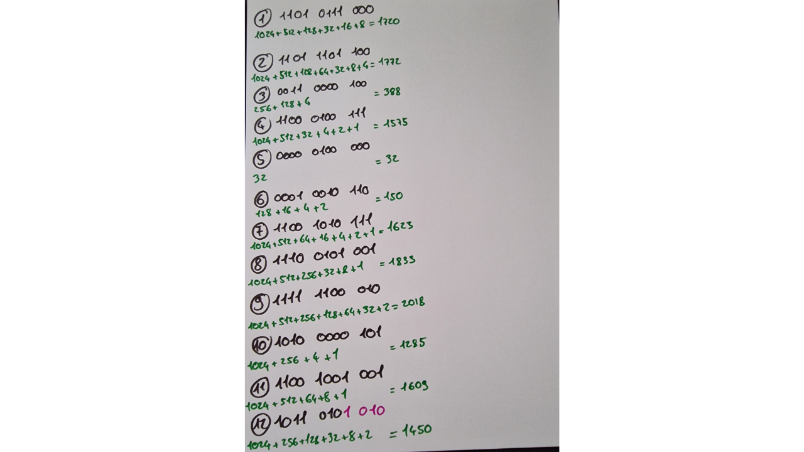

В этом уроке вы узнаете, как вручную создать фразу восстановления для кошелька Bitcoin, используя броски кубиков.

**ВНИМАНИЕ:** Генерация мнемонической фразы безопасным способом требует, чтобы при её создании не оставалось цифровых следов, что практически невозможно. В противном случае, кошелек представлял бы слишком большую атакуемую поверхность, значительно увеличивая риск кражи ваших биткоинов. **Поэтому настоятельно не рекомендуется переводить средства на кошелек, который зависит от фразы восстановления, сгенерированной вами самостоятельно.** Даже если вы следуете этому уроку в точности, существует риск компрометации фразы восстановления. **Таким образом, этот урок не должен применяться для создания реального кошелька.** Использование аппаратного кошелька для этой задачи гораздо менее рискованно, так как он генерирует фразу в автономном режиме, и настоящие криптографы учитывали использование качественных источников энтропии.

Этот урок можно следовать только в экспериментальных целях для создания фиктивного кошелька, без намерения использовать его с реальными биткоинами. Тем не менее, опыт предлагает два преимущества:
- Во-первых, он позволяет вам лучше понять механизмы, лежащие в основе вашего кошелька Bitcoin;
- Во-вторых, он позволяет вам знать, как это сделать. Я не говорю, что это будет полезно однажды, но может быть!

## Что такое мнемоническая фраза?
Фраза восстановления, также иногда называемая "мнемоникой", "сид-фразой" или "секретной фразой", представляет собой последовательность, обычно состоящую из 12 или 24 слов, которая генерируется псевдослучайным образом из источника энтропии. Псевдослучайная последовательность всегда дополняется контрольной суммой.

Мнемоническая фраза вместе с необязательной парольной фразой используется для детерминированного вывода всех ключей, связанных с HD (иерархически детерминированным) кошельком. Это означает, что из этой фразы можно детерминированно генерировать и воссоздавать все приватные и публичные ключи кошелька Bitcoin, и, следовательно, получать доступ к средствам, связанным с ним.

Цель этой фразы - предоставить простой в использовании способ резервного копирования и восстановления биткоинов. Крайне важно хранить мнемоническую фразу в безопасном и надежном месте, так как любой, кто владеет этой фразой, будет иметь доступ к средствам соответствующего кошелька. Если она используется в контексте традиционного кошелька и без необязательной парольной фразы, она часто составляет SPOF (единую точку отказа).
Обычно эта фраза предоставляется вам напрямую при создании вашего кошелька, используемым программным или аппаратным кошельком. Однако также возможно самостоятельно сгенерировать эту фразу, а затем ввести ее на выбранном носителе для вывода ключей кошелька. Это то, что мы научимся делать в этом уроке.

## Подготовка необходимых материалов
Для создания вашей фразы восстановления вручную вам понадобятся:
- Лист бумаги;
- Ручка или карандаш, идеально разных цветов для облегчения организации;
- Несколько кубиков, чтобы минимизировать риски смещения, связанные с несбалансированным кубиком;
- [Список из 2048 слов BIP39](https://github.com/DecouvreBitcoin/sovereign-university-data/tree/dev/tutorials/others/generate-mnemonic-phrase/assets/BIP39-WORDLIST.pdf), распечатанный.

Впоследствии станет необходимым использование компьютера с терминалом для расчета контрольной суммы. Именно по этой причине я не рекомендую ручное создание мнемонической фразы. На мой взгляд, вмешательство компьютера, даже при соблюдении упомянутых в этом уроке мер предосторожности, значительно увеличивает уязвимость кошелька.
Для экспериментального подхода, касающегося "фиктивного кошелька", можно использовать обычный компьютер и его терминал. Однако для более строгого подхода, направленного на минимизацию рисков компрометации вашей фразы, идеальным вариантом было бы использование ПК, отключенного от интернета (желательно без компонента wifi или проводного соединения RJ45), оснащенного минимумом периферийных устройств (все из которых должны быть подключены кабелем, чтобы избежать использования Bluetooth), и прежде всего, работающего на амнезическом дистрибутиве Linux, таком как [Tails](https://tails.boum.org/index.fr.html), запущенном с съемного носителя.


В реальных условиях было бы критически важно обеспечить конфиденциальность вашего рабочего пространства, выбрав место, защищенное от посторонних глаз, без прохода людей и свободное от камер (веб-камер, телефонов...).
Рекомендуется использовать большое количество кубиков, чтобы снизить влияние потенциально несбалансированного кубика на энтропию. Перед их использованием рекомендуется проверить кубики: это можно сделать, испытав их в миске с насыщенной солью водой, позволяя кубикам плавать. Затем прокатите каждый кубик около двадцати раз в соленой воде, наблюдая за результатами. Если одна или две грани появляются несоразмерно по сравнению с другими, продлите тест с большим количеством бросков. Равномерно распределенные результаты указывают на то, что кубик надежен. Однако, если одна или две грани регулярно доминируют, такие кубики следует отложить в сторону, так как они могут нарушить энтропию вашей мнемонической фразы и, следовательно, безопасность вашего кошелька.
В реальных условиях, после выполнения этих проверок, вы были бы готовы генерировать необходимую энтропию. Для экспериментального фиктивного кошелька, созданного в рамках этого учебника, вы могли бы естественно пропустить эти подготовительные мероприятия.

## Несколько напоминаний о фразе восстановления
Для начала мы рассмотрим основы создания мнемонической фразы в соответствии с BIP39. Как было объяснено ранее, фраза производится из псевдослучайной информации определенного размера, к которой добавляется контрольная сумма для обеспечения ее целостности.

Размер этой исходной информации, часто называемой "энтропией", определяется количеством слов, которые вы хотите получить в фразе восстановления. Наиболее распространенные форматы - фразы из 12 и 24 слов, производные соответственно от энтропии 128 бит и 256 бит. Вот таблица, показывающая различные размеры энтропии в соответствии с BIP39:

| Фраза (слова) | Энтропия (биты) | Контрольная сумма (биты) | Энтропия + Контрольная сумма (биты) |
| --------------- | --------------- | --------------- | -------------------------- |
| 12              | 128             | 4               | 132                        |
| 15              | 160             | 5               | 165                        |
| 18              | 192             | 6               | 198                        |
| 21              | 224             | 7               | 231                        |
| 24              | 256             | 8               | 264                        |

Таким образом, энтропия представляет собой случайное число от 128 до 256 бит. В этом учебнике мы возьмем пример 12-словной фразы, в которой энтропия составляет 128 бит, что означает, что мы сгенерируем случайную последовательность из 128 `0` или `1`. Это представляет собой число, состоящее из 128 цифр в двоичной системе (бинарном виде).
На основе этой энтропии будет сгенерирована контрольная сумма. Контрольная сумма - это значение, рассчитанное из набора данных, используемое для проверки целостности и валидности этих данных во время их передачи или хранения. Алгоритмы контрольной суммы разработаны для обнаружения случайных ошибок или изменений в данных.
В случае нашей мнемонической фразы функция контрольной суммы заключается в обнаружении любых ошибок ввода при вводе фразы в программное обеспечение кошелька. Недействительная контрольная сумма сигнализирует о наличии ошибки в фразе. Напротив, действительная контрольная сумма указывает на то, что фраза скорее всего верна.
Для получения этой контрольной суммы, энтропия пропускается через функцию хеширования SHA256. Эта операция производит на выходе последовательность из 256 бит, из которых будет сохранено только первые `N` бит, где `N` зависит от желаемой длины восстанавливающей фразы (см. таблицу выше). Таким образом, для 12-словной фразы будут сохранены первые 4 бита хеша.

Эти первые 4 бита, формирующие контрольную сумму, затем будут добавлены к исходной энтропии. На этом этапе восстанавливающая фраза практически сформирована, но она все еще находится в бинарной форме. Для преобразования этой бинарной последовательности в слова в соответствии со стандартом BIP39, мы сначала разделим последовательность на сегменты по 11 бит.

Каждый из этих пакетов представляет собой число в двоичной системе, которое затем будет преобразовано в десятичное число (основание 10). Мы добавим `1` к каждому числу, потому что в вычислениях счет начинается с `0`, но список BIP39 нумеруется начиная с `1`.


Наконец, число в десятичной системе указывает нам позицию соответствующего слова в [списке из 2048 слов BIP39](https://github.com/DecouvreBitcoin/sovereign-university-data/tree/dev/tutorials/others/generate-mnemonic-phrase/assets/BIP39-WORDLIST.pdf). Остается только выбрать эти слова для составления восстанавливающей фразы для нашего кошелька.


Теперь перейдем к практике! Мы сгенерируем 12-словную восстанавливающую фразу. Однако эта операция остается идентичной в случае 24-словной фразы, за исключением того, что потребуется 256 бит энтропии и 8-битная контрольная сумма, как указано в таблице эквивалентности в начале этого раздела.

## Шаг 1: Генерация энтропии
Подготовьте ваш лист бумаги, вашу ручку и ваши кости. Для начала нам нужно будет случайным образом сгенерировать 128 бит, то есть последовательность из 128 `0` и `1` подряд. Для этого мы будем использовать кости.


У костей 6 сторон, каждая с одинаковой вероятностью выпадения. Однако наша цель - получить двоичный результат, то есть два возможных исхода. Поэтому мы присвоим значение `0` каждому броску, который выпадет на четное число, и `1` для каждого нечетного числа. В результате мы выполним 128 бросков, чтобы создать нашу 128-битную энтропию. Если кость покажет `2`, `4` или `6`, мы запишем `0`; для `1`, `3` или `5` будет `1`. Каждый результат будет записан последовательно, слева направо и сверху вниз.

Для облегчения последующих шагов мы сгруппируем биты в пакеты по четыре и три, как показано на изображении ниже. Каждая строка должна иметь 11 бит: 2 пакета по 4 бита и один пакет из 3 бит.


Как вы можете видеть в моем примере, двенадцатое слово в настоящее время состоит только из 7 битов. Они будут дополнены 4 битами контрольной суммы на следующем этапе, чтобы сформировать 11 битов.


## Шаг 2: Расчет контрольной суммы
Этот шаг является наиболее критическим при ручном создании мнемонической фразы, так как требует использования компьютера. Как было упомянуто ранее, контрольная сумма соответствует началу хеша SHA256, сгенерированного из энтропии. Хотя теоретически возможно вручную рассчитать SHA256 для входных данных размером 128 или 256 бит, эта задача может занять целую неделю. Более того, любая ошибка в ручных расчетах будет обнаружена только в конце процесса, заставляя вас начать все сначала. Поэтому, представить себе выполнение этого шага только с листом бумаги и ручкой невозможно. Использование компьютера почти обязательно. Если вы все же хотите узнать, как выполнить SHA256 вручную, мы объясняем, как это сделать, в [курсе CRYPTO301](https://planb.network/en/courses/crypto301).

По этой причине я настоятельно не рекомендую создавать мнемоническую фразу вручную для реального кошелька. На мой взгляд, использование компьютера на этом этапе, даже со всеми необходимыми мерами предосторожности, неоправданно увеличивает поверхность атаки кошелька.
Для расчета контрольной суммы, оставляя как можно меньше следов, мы будем использовать амнезическое Linux-распределение с съемного диска под названием **Tails**. Эта операционная система загружается с USB-накопителя и работает полностью в оперативной памяти компьютера, не взаимодействуя с жестким диском. Таким образом, теоретически, она не оставляет следов на компьютере после его выключения. Обратите внимание, что Tails совместим только с процессорами типа x86_64, а не с процессорами типа ARM.
Для начала, с вашего обычного компьютера, [скачайте образ Tails с его официального сайта](https://tails.net/install/index.fr.html). Убедитесь в подлинности вашей загрузки, используя подпись разработчика или инструмент проверки, предлагаемый сайтом.

Сначала отформатируйте ваш USB-накопитель, затем установите Tails с помощью такого инструмента, как [Balena Etcher](https://etcher.balena.io/).

После подтверждения успешной записи выключите компьютер. Затем отключите блок питания и извлеките жесткий диск с материнской платы вашего ПК. В случае наличия WiFi-карты, ее следует отключить. Аналогично, извлеките любой кабель RJ45 Ethernet. Для минимизации риска утечки данных рекомендуется отключить ваш интернет-модем и выключить мобильный телефон. Кроме того, убедитесь, что от компьютера отключены все лишние периферийные устройства, такие как микрофон, веб-камера, колонки или гарнитура, и проверьте, что другие периферийные устройства подключены только через провод. Все эти шаги по подготовке ПК не являются обязательными, но они просто помогают максимально сократить поверхность атаки в реальном контексте.

Проверьте, настроен ли ваш BIOS на загрузку с внешнего устройства. Если нет, измените эту настройку, затем перезагрузите машину. После того, как вы обеспечили безопасность компьютерной среды, перезагрузите компьютер с USB-накопителя с ОС Tails.

На приветственном экране Tails выберите язык по вашему выбору, затем запустите систему, нажав на `Start Tails`.


С рабочего стола нажмите на вкладку `Applications`.


Перейдите в меню `Utilities`.
И наконец, откройте приложение `Terminal`.


Вы увидите новое пустое командное окно.


Введите команду `echo`, за которой следует ваша ранее сгенерированная энтропия, убедившись, что между `echo` и последовательностью двоичных цифр вставлен пробел.


Добавьте еще один пробел, затем введите следующую команду, используя *канал* (`|`):
```plaintext
| shasum -a 256 -0
```


В примере с моей энтропией полная команда выглядит следующим образом:
```plaintext
echo 11010111000110111011000011000010011000100111000001000000001001011011001010111111001010011111110001010100000101110010010011011010 | shasum -a 256 -0
```

В этой команде:
- `echo` используется для отправки последовательности битов;
- `|`, канал, используется для перенаправления вывода команды `echo` на вход следующей команды;
- `shasum` запускает функцию хеширования, принадлежащую семейству SHA (*Secure Hash Algorithm*);
- `-a` указывает на выбор конкретного алгоритма хеширования;
- `256` указывает, что используется алгоритм SHA256;
- `-0` позволяет интерпретировать ввод как двоичное число.

После тщательной проверки на отсутствие опечаток в вашей последовательности битов нажмите клавишу `Enter`, чтобы выполнить команду. Терминал затем отобразит хеш SHA256 вашей энтропии.


На данный момент хеш выражен в шестнадцатеричном формате (основание 16). Например, мой таков:
```plaintext
a27abf1aff70311917a59a43ce86fa45a62723a00dd2f9d3d059aeac9b4b13d8
```

Чтобы завершить нашу мнемоническую фразу, нам нужны только первые 4 бита хеша, которые составляют контрольную сумму. В шестнадцатеричном формате каждый символ представляет 4 бита. Таким образом, мы сохраним только первый символ хеша. Для фразы из 24 слов необходимо учитывать первые два символа. В моем примере это соответствует букве: `a`. Внимательно запишите этот символ где-нибудь на вашем листе, а затем выключите компьютер.

Следующий шаг - преобразование этого шестнадцатеричного символа (основание 16) в двоичное значение (основание 2), так как наша фраза построена в этом формате. Для этого вы можете использовать следующую таблицу преобразования:

| Десятичное (основание 10) | Шестнадцатеричное (основание 16) | Двоичное (основание 2) |
| ----------------- | --------------------- | --------------- |
| 0                 | 0                     | 0000            |
| 1                 | 1                     | 0001            |
| 2                 | 2                     | 0010            |
| 3                 | 3                     | 0011            |
| 4                 | 4                     | 0100            |
| 5                 | 5                     | 0101            |
| 6                 | 6                     | 0110            |
| 7                 | 7                     | 0111            |
| 8                 | 8                     | 1000            |
| 9                 | 9                     | 1001            |
| 10                | a                     | 1010            |
| 11                | b                     | 1011            |
| 12                | c                     | 1100            |
| 13                | d                     | 1101            |
| 14                | e                     | 1110            |
| 15                | f                     | 1111            |

В моем примере, буква `a` соответствует двоичному числу `1010`. Эти 4 бита формируют контрольную сумму нашей фразы восстановления. Теперь вы можете добавить их к уже отмеченной на вашем листе бумаги энтропии, разместив их в конце последнего слова.


Теперь ваша мнемоническая фраза полностью сформирована, но она в двоичном формате. Следующим шагом будет преобразование ее в десятичную систему, чтобы вы могли затем ассоциировать каждое число с соответствующим словом из списка BIP39.

## Шаг 3: Преобразование слов в десятичные числа
Чтобы преобразовать каждую двоичную строку в десятичное число, мы будем использовать метод, который облегчает ручной расчет. В настоящее время у вас на бумаге двенадцать строк, каждая из которых состоит из 11 двоичных цифр `0` или `1`. Для преобразования в десятичные числа присвойте каждой первой цифре значение `1024`, если это `1`, иначе `0`. Для второй цифры значение `512` будет присвоено, если это `1`, иначе `0`, и так далее до одиннадцатой цифры. Соответствия следующие:
- 1-й бит: `1024`;
- 2-й бит: `512`;
- 3-й бит: `256`;
- 4-й бит: `128`;
- 5-й бит: `64`;
- 6-й бит: `32`;
- 7-й бит: `16`;
- 8-й бит: `8`;
- 9-й бит: `4`;
- 10-й бит: `2`;
- 11-й бит: `1`.

Для каждой строки мы будем складывать значения, соответствующие цифрам `1`, чтобы получить десятичное число, эквивалентное двоичному числу. Возьмем в качестве примера двоичную строку, равную:
```plaintext
1010 1101 101
```

Преобразование будет следующим:

Результат будет следующим:
```plaintext
1389
```

Для каждого бита, равного `1`, укажите ниже соответствующее число. Для каждого бита, равного `0`, ничего не указывайте.


Затем просто сложите все числа, подтвержденные `1`, чтобы получить десятичное число, представляющее каждую двоичную строку. Например, вот как это выглядит для моего листа:


## Шаг 4: Поиск слов мнемонической фразы
Имея полученные десятичные числа, мы теперь можем найти соответствующие слова в списке, чтобы составить мнемоническую фразу. Однако, нумерация 2048 слов в списке BIP39 варьируется от `1` до `2048`. Но наши рассчитанные двоичные результаты находятся в диапазоне от `0` до `2047`. Следовательно, необходимо исправить сдвиг на одну единицу. Чтобы исправить этот сдвиг, просто добавьте `1` к двенадцати ранее рассчитанным десятичным числам.


После этой корректировки у вас есть ранг каждого слова в списке. Остается только идентифицировать каждое слово по его номеру. Очевидно, как и на всех других этапах, вы не должны использовать ваш компьютер для выполнения этого преобразования. Поэтому убедитесь, что вы заранее распечатали список.
[**-> Распечатайте список BIP39 в формате A4.**](https://github.com/DecouvreBitcoin/sovereign-university-data/tree/dev/tutorials/others/generate-mnemonic-phrase/assets/BIP39-WORDLIST.pdf)

Например, если число, полученное из первой строки, равно 1721, соответствующее слово будет 1721-м в списке:
```plaintext
1721. strike
```

Таким образом, мы последовательно продвигаемся с 12 словами для создания нашей мнемонической фразы.


## Шаг 5: Создание Bitcoin кошелька
На этом этапе остается только импортировать нашу мнемоническую фразу в программное обеспечение Bitcoin кошелька. В зависимости от наших предпочтений, это может быть сделано на программном обеспечении для настольных компьютеров для получения горячего кошелька, или на аппаратном кошельке для холодного кошелька.


Только во время импорта вы можете проверить валидность вашей контрольной суммы. Если программное обеспечение показывает сообщение вроде `Invalid Checksum`, это означает, что в процесс создания закралась ошибка. Обычно, эта ошибка происходит либо из-за ошибки в ручных преобразованиях и сложениях, либо из-за опечатки при вводе вашей энтропии в терминале на Tails. Необходимо начать процесс сначала, чтобы исправить эти ошибки.


После создания вашего кошелька не забудьте сделать резервную копию вашей фразы восстановления на физическом носителе, таком как бумага или металл, и уничтожить таблицу, использованную во время ее генерации, чтобы предотвратить утечку информации.

## Специфический случай опции броска костей на Coldcards
Аппаратные кошельки семейства Coldcard предлагают [функцию под названием *Dice Roll*](https://youtu.be/Rc29d9m92xg?si=OeFW2iCGRvxexhK7), чтобы генерировать фразу восстановления вашего кошелька с помощью костей. Этот метод отличный, потому что он дает вам прямой контроль над созданием энтропии, без необходимости использования внешнего устройства для расчета контрольной суммы, как в нашем учебнике.

Однако недавно были сообщения о кражах биткоинов из-за неправильного использования этой функции. Действительно, слишком ограниченное количество бросков костей может привести к недостаточной энтропии, теоретически позволяя подобрать мнемоническую фразу и украсть связанные с ней биткоины. Чтобы избежать этого риска, рекомендуется выполнить как минимум 99 бросков костей на Coldcard, что обеспечивает достаточную энтропию.

Метод интерпретации результатов, предложенный Coldcard, отличается от представленного в этом учебнике. Хотя мы рекомендуем 128 бросков для достижения 128 бит безопасности в учебнике, Coldcard предлагает 99 бросков для достижения 256 бит безопасности. Действительно, в нашем подходе возможны только два исхода для каждого броска костей: четный (`0`) или нечетный (`1`). Следовательно, энтропия, генерируемая каждым броском, равна `log2(2)`. В случае с Coldcard, который учитывает шесть возможных граней кости (от `1` до `6`), энтропия за бросок равна `log2(6)`. Вот почему в нашем учебнике нам нужно выполнить больше бросков, чтобы достичь того же уровня энтропии.
Энтропия = количество бросков * log2(количество возможных исходов на кубике)
Coldcard:

Энтропия = 99 * log2(6)
Энтропия = 255.91

Наш учебник:

Энтропия = 128 * log2(2)
Энтропия = 128