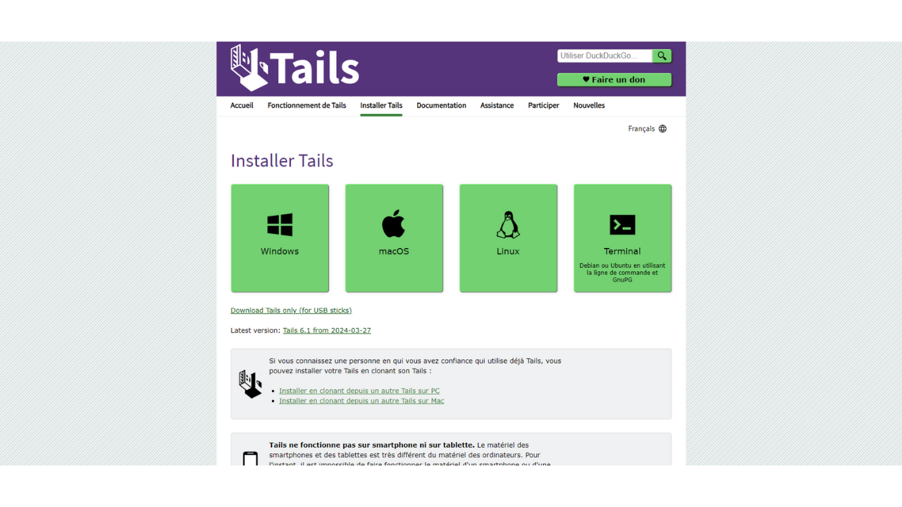
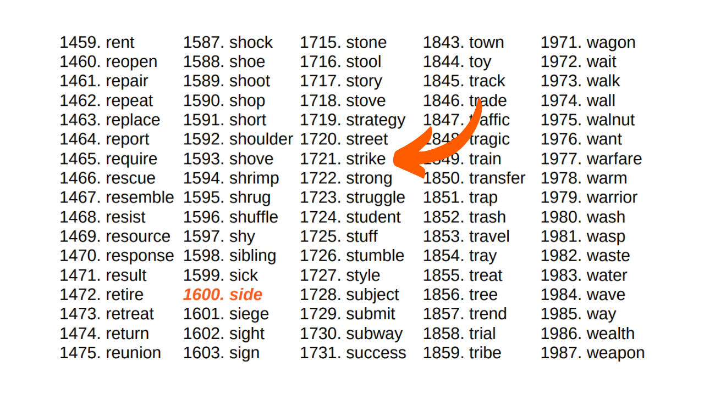
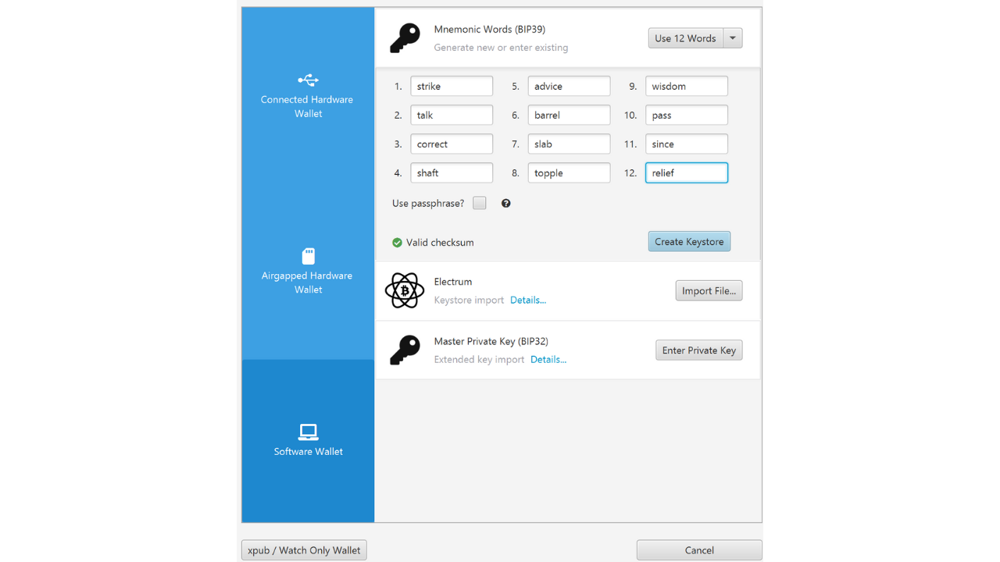

Trong hướng dẫn này, bạn sẽ học cách tự tay xây dựng một cụm từ khôi phục cho ví Bitcoin của mình sử dụng lắc xúc xắc.

**CẢNH BÁO:** Việc tạo ra một cụm từ ghi nhớ một cách an toàn đòi hỏi không để lại dấu vết số nào trong quá trình tạo ra nó, điều này gần như là không thể. Nếu không, ví sẽ trở nên quá dễ bị tấn công, làm tăng đáng kể nguy cơ bitcoin của bạn bị đánh cắp. **Do đó, việc chuyển tiền vào một ví phụ thuộc vào cụm từ khôi phục bạn tự tạo ra được khuyến cáo mạnh mẽ là không nên.** Ngay cả khi bạn tuân theo hướng dẫn này đến từng chữ, vẫn có rủi ro cụm từ khôi phục có thể bị xâm phạm. **Vì vậy, hướng dẫn này không nên được áp dụng để tạo ví thực.** Sử dụng ví cứng cho nhiệm vụ này ít rủi ro hơn nhiều, vì nó tạo ra cụm từ ngoại tuyến, và các nhà mật mã học thực sự đã xem xét việc sử dụng các nguồn entropy chất lượng.

Hướng dẫn này chỉ có thể được theo dõi cho mục đích thử nghiệm để tạo một ví giả, mà không có ý định sử dụng nó với bitcoin thực. Tuy nhiên, trải nghiệm này mang lại hai lợi ích:
- Đầu tiên, nó cho phép bạn hiểu rõ hơn về cơ chế cơ bản của ví Bitcoin của mình;
- Thứ hai, nó cho phép bạn biết cách làm điều đó. Tôi không nói nó sẽ hữu ích một ngày nào đó, nhưng có thể!

## Cụm từ ghi nhớ là gì?
Cụm từ khôi phục, còn được gọi đôi khi là "mnemonic", "cụm từ hạt giống", hoặc "cụm từ bí mật", là một chuỗi thường gồm 12 hoặc 24 từ, được tạo ra một cách giả ngẫu nhiên từ một nguồn entropy. Chuỗi giả ngẫu nhiên luôn được hoàn thiện với một mã kiểm tra.

Cụm từ ghi nhớ, cùng với một cụm từ bổ sung tùy chọn, được sử dụng để suy ra một cách xác định tất cả các khóa liên quan đến một ví HD (Hierarchical Deterministic). Điều này có nghĩa là từ cụm từ này, có thể tạo ra và tái tạo tất cả các khóa riêng tư và công khai của ví Bitcoin một cách xác định, và do đó, truy cập vào các quỹ liên quan đến nó.

Mục đích của câu này là cung cấp một phương tiện dễ sử dụng để sao lưu và khôi phục bitcoin. Rất quan trọng phải giữ cụm từ ghi nhớ ở một nơi an toàn và bảo mật, vì bất kỳ ai sở hữu cụm từ này đều có quyền truy cập vào quỹ của ví tương ứng. Nếu nó được sử dụng trong bối cảnh của một ví truyền thống, và không có cụm từ bổ sung tùy chọn, nó thường tạo thành một SPOF (Single Point Of Failure).
Thông thường, cụm từ này được cung cấp trực tiếp cho bạn khi tạo ví của mình, bởi phần mềm hoặc ví cứng được sử dụng. Tuy nhiên, cũng có thể tự tạo cụm từ này, và sau đó nhập nó vào hỗ trợ đã chọn để suy ra các khóa ví. Đây là điều chúng ta sẽ học cách làm trong hướng dẫn này.

## Chuẩn bị các vật liệu cần thiết
Để tạo cụm từ khôi phục của bạn bằng tay, bạn sẽ cần:
- Một tờ giấy;
- Một cây bút hoặc bút chì, lý tưởng là có màu sắc khác nhau để dễ dàng tổ chức;
- Một số xúc xắc, để giảm thiểu rủi ro về sự thiên vị liên quan đến một xúc xắc không cân bằng;
- [Danh sách 2048 từ BIP39](https://github.com/PlanB-Network/bitcoin-educational-content/blob/dev/resources/bet/bip39-wordlist/assets/BIP39-WORDLIST.pdf) được in ra.

Sau đó, việc sử dụng một máy tính với terminal sẽ trở nên cần thiết để tính toán mã kiểm tra. Chính vì lý do này mà tôi khuyên bạn không nên tự tạo cụm từ ghi nhớ. Theo ý kiến của tôi, sự can thiệp của một máy tính, ngay cả dưới các biện pháp phòng ngừa được đề cập trong hướng dẫn này, làm tăng đáng kể khả năng bị tấn công của một ví.
Đối với một phương pháp thử nghiệm liên quan đến "ví giả tưởng", bạn có thể sử dụng máy tính thường ngày và terminal của nó. Tuy nhiên, để tiếp cận một cách nghiêm ngặt hơn nhằm giảm thiểu rủi ro làm lộ cụm từ bí mật của bạn, lý tưởng nhất là sử dụng một PC không kết nối internet (ưu tiên không có thành phần wifi hoặc kết nối dây RJ45), trang bị tối thiểu các thiết bị ngoại vi (tất cả phải được kết nối bằng cáp, để tránh Bluetooth), và quan trọng nhất, chạy trên một bản phân phối Linux không lưu trữ dữ liệu như [Tails](https://tails.boum.org/index.fr.html), khởi động từ một thiết bị gắn ngoài.


Trong một bối cảnh thực tế, việc đảm bảo tính bảo mật của không gian làm việc bằng cách chọn một địa điểm xa lánh ánh mắt tò mò, không có người qua lại, và không có camera (webcams, điện thoại...) là rất quan trọng.
Đề xuất sử dụng một số lượng lớn xúc xắc để giảm thiểu ảnh hưởng của một xúc xắc không cân bằng đối với entropy. Trước khi sử dụng, việc kiểm tra xúc xắc được khuyến khích: điều này có thể được thực hiện bằng cách thử chúng trong một bát nước muối bão hòa, cho phép xúc xắc nổi lên. Sau đó, tiến hành lăn mỗi xúc xắc khoảng hai mươi lần trong nước muối, quan sát kết quả. Nếu một hoặc hai mặt xuất hiện không cân xứng so với các mặt khác, mở rộng thử nghiệm với nhiều lần lăn hơn. Kết quả phân phối đều cho thấy xúc xắc đáng tin cậy. Tuy nhiên, nếu một hoặc hai mặt thường xuyên chiếm ưu thế, những xúc xắc này nên được loại bỏ, vì chúng có thể làm giảm entropy của cụm từ mnemonic và do đó, làm giảm an ninh của ví của bạn.
Trong điều kiện thực tế, sau khi thực hiện những kiểm tra này, bạn sẽ sẵn sàng để tạo ra entropy cần thiết. Đối với một ví giả tưởng thử nghiệm được tạo ra như một phần của hướng dẫn này, bạn có thể tự nhiên bỏ qua những chuẩn bị này.

## Một Số Lưu Ý về Cụm Từ Khôi Phục
Đầu tiên, chúng ta sẽ xem xét cơ bản về việc tạo một cụm từ mnemonic theo BIP39. Như đã giải thích trước đây, cụm từ được tạo ra từ thông tin giả ngẫu nhiên có kích thước nhất định, mà sau đó một checksum được thêm vào để đảm bảo tính toàn vẹn của nó.

Kích thước của thông tin ban đầu này, thường được gọi là "entropy," được xác định bởi số lượng từ bạn muốn có trong cụm từ khôi phục. Các định dạng phổ biến nhất là cụm từ gồm 12 và 24 từ, tương ứng với entropy 128 bits và 256 bits. Dưới đây là một bảng cho thấy các kích thước entropy khác nhau theo BIP39:

| Cụm từ (từ) | Entropy (bits) | Checksum (bits) | Entropy + Checksum (bits) |
| --------------- | --------------- | --------------- | -------------------------- |
| 12              | 128             | 4               | 132                        |
| 15              | 160             | 5               | 165                        |
| 18              | 192             | 6               | 198                        |
| 21              | 224             | 7               | 231                        |
| 24              | 256             | 8               | 264                        |

Entropy do đó là một số ngẫu nhiên từ 128 đến 256 bits. Trong hướng dẫn này, chúng ta sẽ lấy ví dụ về một cụm từ 12 từ, trong đó entropy là 128 bits, nghĩa là chúng ta sẽ tạo ra một chuỗi ngẫu nhiên gồm 128 `0` hoặc `1`. Điều này đại diện cho một số gồm 128 chữ số trong cơ số 2 (nhị phân).
Dựa trên entropy này, một checksum sẽ được tạo ra. Checksum là một giá trị được tính toán từ một tập hợp dữ liệu, được sử dụng để xác minh tính toàn vẹn và hợp lệ của dữ liệu đó trong quá trình truyền dẫn hoặc lưu trữ. Các thuật toán checksum được thiết kế để phát hiện lỗi ngẫu nhiên hoặc thay đổi trong dữ liệu.
Trong trường hợp của cụm từ ghi nhớ của chúng ta, chức năng của checksum là để phát hiện bất kỳ lỗi nhập nào khi nhập cụm từ vào phần mềm ví. Một checksum không hợp lệ báo hiệu sự có mặt của lỗi trong cụm từ. Ngược lại, một checksum hợp lệ chỉ ra rằng cụm từ có khả năng cao là chính xác.

Để có được checksum này, entropy được đưa qua hàm băm SHA256. Thao tác này tạo ra một chuỗi 256-bit làm đầu ra, trong đó chỉ có `N` bit đầu tiên được giữ lại, `N` tùy thuộc vào độ dài mong muốn của cụm từ khôi phục (xem bảng ở trên). Do đó, đối với cụm từ 12 từ, 4 bit đầu tiên của băm sẽ được giữ lại.

4 bit đầu tiên này, tạo thành checksum, sau đó sẽ được thêm vào entropy gốc. Tại giai đoạn này, cụm từ khôi phục thực tế đã được hình thành, nhưng nó vẫn ở dạng nhị phân. Để chuyển đổi chuỗi nhị phân này thành từ theo tiêu chuẩn BIP39, chúng ta sẽ chia chuỗi thành các phân đoạn 11-bit.

Mỗi gói này đại diện cho một số trong hệ nhị phân sẽ sau đó được chuyển đổi thành số thập phân (cơ sở 10). Chúng ta sẽ thêm `1` vào mỗi số, bởi vì trong lập trình, đếm bắt đầu từ `0`, nhưng danh sách BIP39 được đánh số bắt đầu từ `1`.


Cuối cùng, số thập phân cho chúng ta biết vị trí của từ tương ứng trong [danh sách 2048 từ BIP39](https://github.com/PlanB-Network/bitcoin-educational-content/blob/dev/resources/bet/bip39-wordlist/assets/BIP39-WORDLIST.pdf). Tất cả những gì còn lại là chọn những từ này để tạo thành cụm từ khôi phục cho ví của chúng ta.


Bây giờ, chúng ta hãy chuyển sang thực hành! Chúng ta sẽ tạo một cụm từ khôi phục 12 từ. Tuy nhiên, thao tác này giữ nguyên trong trường hợp của cụm từ 24 từ, ngoại trừ việc nó sẽ yêu cầu 256 bit entropy và một checksum 8-bit, như được chỉ ra trong bảng tương đương nằm ở đầu phần này.

## Bước 1: Tạo Entropy
Chuẩn bị tờ giấy, bút của bạn, và xúc xắc. Để bắt đầu, chúng ta sẽ cần tạo ra ngẫu nhiên 128 bit, tức là, một chuỗi 128 `0` và `1` liên tiếp. Để làm điều này, chúng ta sẽ sử dụng xúc xắc.


Xúc xắc có 6 mặt, tất cả đều có khả năng xuất hiện như nhau. Tuy nhiên, mục tiêu của chúng ta là tạo ra kết quả nhị phân, nghĩa là hai kết quả có thể xảy ra. Do đó, chúng ta sẽ gán giá trị `0` cho mỗi lần lắc mà kết quả là số chẵn, và `1` cho mỗi số lẻ. Kết quả là, chúng ta sẽ thực hiện 128 lần lắc để tạo ra entropy 128-bit của mình. Nếu xúc xắc chỉ `2`, `4`, hoặc `6`, chúng ta sẽ ghi `0`; đối với `1`, `3`, hoặc `5`, nó sẽ là `1`. Mỗi kết quả sẽ được ghi lại theo thứ tự, từ trái sang phải và từ trên xuống dưới.

Để thuận tiện cho các bước tiếp theo, chúng ta sẽ nhóm các bit thành các gói 4 và 3, như hình dưới đây. Mỗi dòng phải có 11 bit: 2 gói 4 bit và một gói 3 bit.


Như bạn có thể thấy trong ví dụ của tôi, từ thứ mười hai hiện chỉ được tạo thành từ 7 bit. Những bit này sẽ được hoàn thiện bởi 4 bit của checksum ở bước tiếp theo để tạo thành 11 bit.


## Bước 2: Tính toán checksum
Bước này là quan trọng nhất trong quá trình tạo cụm từ ghi nhớ (mnemonic phrase) một cách thủ công, vì nó đòi hỏi sự sử dụng của máy tính. Như đã đề cập trước đó, checksum tương ứng với phần đầu của mã hash SHA256 được tạo ra từ entropy. Mặc dù lý thuyết có thể tính toán SHA256 bằng tay cho một đầu vào 128 hoặc 256 bit, công việc này có thể mất cả tuần. Hơn nữa, bất kỳ lỗi nào trong việc tính toán thủ công chỉ được phát hiện ở cuối quá trình, buộc bạn phải bắt đầu lại từ đầu. Do đó, việc thực hiện bước này chỉ với tờ giấy và bút là không thể tưởng tượng được. Một máy tính gần như là bắt buộc. Nếu bạn vẫn muốn học cách thực hiện SHA256 bằng tay, chúng tôi giải thích cách làm trong [khóa học CRYPTO301](https://planb.network/en/courses/crypto301).

Vì lý do này, tôi khuyên bạn không nên tạo cụm từ thủ công cho một ví thực sự. Theo ý kiến của tôi, việc sử dụng máy tính ở giai đoạn này, ngay cả với tất cả các biện pháp phòng ngừa cần thiết, làm tăng không hợp lý mặt bằng tấn công của ví.
Để tính toán checksum mà để lại ít dấu vết nhất có thể, chúng ta sẽ sử dụng một bản phân phối Linux quên lãng từ một ổ đĩa di động có tên là **Tails**. Hệ điều hành này khởi động từ một ổ USB và hoạt động hoàn toàn trên RAM của máy tính, không tương tác với ổ cứng. Do đó, theo lý thuyết, nó không để lại dấu vết nào trên máy tính sau khi được tắt. Xin lưu ý rằng Tails chỉ tương thích với các loại bộ xử lý x86_64, và không tương thích với các loại bộ xử lý ARM.
Để bắt đầu, từ máy tính thông thường của bạn, [tải xuống hình ảnh Tails từ trang web chính thức của nó](https://tails.net/install/index.fr.html). Đảm bảo tính xác thực của việc tải xuống của bạn bằng cách sử dụng chữ ký của nhà phát triển hoặc công cụ xác minh do trang web cung cấp.

Đầu tiên, tiến hành định dạng ổ USB của bạn, sau đó cài đặt Tails bằng một công cụ như [Balena Etcher](https://etcher.balena.io/).

Sau khi xác nhận việc ghi là thành công, tắt máy tính của bạn. Sau đó tiến hành ngắt nguồn và tháo ổ cứng khỏi bo mạch chủ của PC. Trong trường hợp có thẻ WiFi, nó nên được ngắt kết nối. Tương tự, tháo bất kỳ cáp Ethernet RJ45 nào. Để giảm thiểu nguy cơ rò rỉ dữ liệu, nên khuyến nghị rút phích cắm của hộp internet và tắt điện thoại di động. Hơn nữa, đảm bảo ngắt kết nối bất kỳ thiết bị ngoại vi không cần thiết nào khỏi máy tính của bạn, như micro, webcam, loa hoặc tai nghe, và kiểm tra rằng các thiết bị ngoại vi khác chỉ được kết nối qua dây. Tất cả các bước chuẩn bị PC này không phải là cần thiết, nhưng chúng chỉ giúp giảm thiểu mặt bằng tấn công càng nhiều càng tốt trong một bối cảnh thực tế.

Kiểm tra xem BIOS của bạn có được cấu hình để cho phép khởi động từ một thiết bị ngoại vi hay không. Nếu không, thay đổi cài đặt này, sau đó khởi động lại máy tính của bạn. Sau khi đã bảo đảm môi trường máy tính an toàn, khởi động lại máy tính từ ổ USB với Tails OS.

Trên màn hình chào mừng của Tails, chọn ngôn ngữ bạn muốn, sau đó khởi động hệ thống bằng cách nhấp vào `Start Tails`.


Từ màn hình desktop, nhấp vào tab `Applications`.


Di chuyển đến menu `Utilities`.
Và cuối cùng, nhấp vào ứng dụng `Terminal`.

Bạn sẽ đến một cửa sổ lệnh mới trống.

Gõ lệnh `echo`, theo sau là entropy bạn đã tạo trước đó, đảm bảo chèn một khoảng trắng giữa `echo` và chuỗi số nhị phân của bạn.

Thêm một khoảng trắng nữa, sau đó nhập lệnh sau, sử dụng một *ống* (`|`):
```plaintext
| shasum -a 256 -0
```

Trong ví dụ với entropy của tôi, lệnh tổng cộng như sau:
```plaintext
echo 11010111000110111011000011000010011000100111000001000000001001011011001010111111001010011111110001010100000101110010010011011010 | shasum -a 256 -0
```

Trong lệnh này:
- `echo` được sử dụng để gửi chuỗi bit;
- `|`, *ống*, được sử dụng để hướng đầu ra của lệnh `echo` vào đầu vào của lệnh tiếp theo;
- `shasum` khởi động một hàm băm thuộc gia đình SHA (*Secure Hash Algorithm*);
- `-a` chỉ định lựa chọn một thuật toán băm cụ thể;
- `256` chỉ ra rằng thuật toán SHA256 được sử dụng;
- `-0` cho phép đầu vào được hiểu là một số nhị phân.

Sau khi kiểm tra cẩn thận rằng chuỗi nhị phân của bạn không chứa bất kỳ lỗi đánh máy nào, nhấn phím `Enter` để thực thi lệnh. Cửa sổ lệnh sau đó sẽ hiển thị băm SHA256 của entropy bạn.

Bây giờ, băm được biểu diễn ở định dạng thập lục phân (cơ số 16). Ví dụ, của tôi là:
```plaintext
a27abf1aff70311917a59a43ce86fa45a62723a00dd2f9d3d059aeac9b4b13d8
```

Để hoàn thiện cụm từ ghi nhớ của chúng ta, chúng ta chỉ cần 4 bit đầu tiên của băm, tạo thành checksum. Trong định dạng thập lục phân, mỗi ký tự đại diện cho 4 bit. Do đó, chúng ta chỉ giữ lại ký tự đầu tiên của băm. Đối với một cụm từ 24 từ, sẽ cần phải tính đến hai ký tự đầu tiên. Trong ví dụ của tôi, điều này tương ứng với chữ cái: `a`. Hãy cẩn thận ghi chú ký tự này ở đâu đó trên tờ giấy của bạn, sau đó tắt máy tính của bạn.

Bước tiếp theo là chuyển đổi ký tự thập lục phân này (cơ số 16) thành giá trị nhị phân (cơ số 2), vì cụm từ của chúng ta được xây dựng trong định dạng này. Để làm điều này, bạn có thể sử dụng bảng chuyển đổi sau:


| Thập phân (cơ số 10) | Thập lục phân (cơ số 16) | Nhị phân (cơ số 2) |
| ----------------- | --------------------- | --------------- |
| 0                 | 0                     | 0000            |
| 1                 | 1                     | 0001            |
| 2                 | 2                     | 0010            |
| 3                 | 3                     | 0011            |
| 4                 | 4                     | 0100            |
| 5                 | 5                     | 0101            |
| 6                 | 6                     | 0110            |
| 7                 | 7                     | 0111            |
| 8                 | 8                     | 1000            |
Trong ví dụ của tôi, chữ cái `a` tương ứng với số nhị phân `1010`. 4 bit này tạo thành checksum của cụm từ khôi phục của chúng ta. Bây giờ bạn có thể thêm chúng vào entropy đã ghi chú trên tờ giấy của bạn, đặt chúng ở cuối từ cuối cùng.


Cụm từ ghi nhớ của bạn giờ đây đã hoàn chỉnh, nhưng nó ở định dạng nhị phân. Bước tiếp theo sẽ là chuyển đổi nó thành hệ thập phân để bạn có thể sau đó liên kết mỗi số với một từ tương ứng trong danh sách BIP39.

## Bước 3: Chuyển Đổi Từ sang Số Thập Phân
Để chuyển đổi mỗi dòng nhị phân thành một số thập phân, chúng ta sẽ sử dụng một phương pháp giúp việc tính toán thủ công dễ dàng hơn. Hiện tại, bạn có mười hai dòng trên tờ giấy của mình, mỗi dòng gồm 11 chữ số nhị phân `0` hoặc `1`. Để tiến hành chuyển đổi sang thập phân, gán cho mỗi chữ số đầu tiên giá trị `1024` nếu nó là `1`, ngược lại là `0`. Đối với chữ số thứ hai, giá trị `512` sẽ được gán nếu nó là `1`, ngược lại là `0`, và cứ thế cho đến chữ số thứ mười một. Các tương ứng như sau:
- Bit thứ 1: `1024`;
- Bit thứ 2: `512`;
- Bit thứ 3: `256`;
- Bit thứ 4: `128`;
- Bit thứ 5: `64`;
- Bit thứ 6: `32`;
- Bit thứ 7: `16`;
- Bit thứ 8: `8`;
- Bit thứ 9: `4`;
- Bit thứ 10: `2`;
- Bit thứ 11: `1`.

Đối với mỗi dòng, chúng ta sẽ cộng dồn các giá trị tương ứng với các chữ số `1` để thu được số thập phân tương đương với số nhị phân. Hãy lấy ví dụ về một dòng nhị phân bằng:
```plaintext
1010 1101 101
```

Việc chuyển đổi sẽ như sau:

Kết quả sẽ là:
```plaintext
1389
```

Đối với mỗi bit bằng `1`, ghi lại số tương ứng bên dưới. Đối với mỗi bit bằng `0`, không ghi gì.


Sau đó, chỉ cần cộng dồn tất cả các số được xác nhận bởi `1` để nhận được số thập phân đại diện cho mỗi dòng nhị phân. Ví dụ, đây là cách nó trông như thế nào cho tờ giấy của tôi:


## Bước 4: Tìm Kiếm Các Từ của Cụm Từ Ghi Nhớ
Với các số thập phân đã thu được, giờ đây chúng ta có thể xác định các từ tương ứng trong danh sách để tạo thành cụm từ ghi nhớ. Tuy nhiên, việc đánh số 2048 từ trong danh sách BIP39 dao động từ `1` đến `2048`. Nhưng, kết quả nhị phân đã tính của chúng ta dao động từ `0` đến `2047`. Do đó, có một sự chênh lệch một đơn vị cần được điều chỉnh. Để điều chỉnh sự chênh lệch này, chỉ cần thêm `1` vào mười hai số thập phân đã tính trước đó.


Sau khi điều chỉnh này, bạn sẽ có thứ hạng của từng từ trong danh sách. Tất cả những gì còn lại là xác định mỗi từ bằng số của nó. Rõ ràng, như với tất cả các bước khác, bạn không được sử dụng máy tính để thực hiện việc chuyển đổi này. Do đó, hãy chắc chắn bạn đã in danh sách trước đó.
[**-> In danh sách BIP39 ở định dạng A4.**](https://github.com/PlanB-Network/bitcoin-educational-content/blob/dev/resources/bet/bip39-wordlist/assets/BIP39-WORDLIST.pdf)

Ví dụ, nếu số thu được từ dòng đầu tiên là 1721, từ tương ứng sẽ là từ thứ 1721 trong danh sách:
```plaintext
1721. strike
```

Theo cách này, chúng ta tiếp tục lần lượt với 12 từ để xây dựng cụm từ ghi nhớ của mình.


## Bước 5: Tạo Ví Bitcoin
Tại thời điểm này, tất cả những gì còn lại là nhập cụm từ ghi nhớ của chúng ta vào phần mềm ví Bitcoin. Tùy thuộc vào sở thích của chúng ta, việc này có thể được thực hiện trên phần mềm máy tính để có được một ví nóng, hoặc trên một ví cứng để có được một ví lạnh.



Chỉ trong quá trình nhập khẩu, bạn mới có thể xác minh tính hợp lệ của checksum của mình. Nếu phần mềm hiển thị thông báo như `Invalid Checksum`, điều đó có nghĩa là một lỗi đã xuất hiện trong quá trình tạo của bạn. Nói chung, lỗi này xuất phát từ việc tính toán sai trong quá trình chuyển đổi và cộng thủ công, hoặc từ một lỗi đánh máy khi nhập entropy của bạn vào terminal trên Tails. Sẽ cần phải bắt đầu lại quá trình từ đầu để sửa chữa những lỗi này.


Sau khi tạo ví của bạn, đừng quên sao lưu cụm từ khôi phục của bạn trên một phương tiện vật lý, như giấy hoặc kim loại, và hủy bảng tính được sử dụng trong quá trình tạo của nó để ngăn chặn bất kỳ rò rỉ thông tin nào.

## Trường Hợp Cụ Thể của Tùy Chọn Lăn Xúc Xắc trên Coldcards
Các ví cứng từ gia đình Coldcard cung cấp [một tính năng được gọi là *Dice Roll*](https://youtu.be/Rc29d9m92xg?si=OeFW2iCGRvxexhK7), để tạo cụm từ khôi phục ví của bạn bằng cách lăn xúc xắc. Phương pháp này rất tốt vì nó cho bạn quyền kiểm soát trực tiếp việc tạo entropy, mà không cần sử dụng thiết bị bên ngoài để tính checksum như trong hướng dẫn của chúng tôi.

Tuy nhiên, gần đây đã có báo cáo về các vụ trộm bitcoin do sử dụng không đúng cách tính năng này. Thực tế, một số lượng lăn xúc xắc quá hạn chế có thể dẫn đến entropy không đủ, lý thuyết làm cho việc brute force cụm từ ghi nhớ và ăn cắp bitcoin liên quan trở nên khả thi. Để tránh rủi ro này, được khuyến nghị thực hiện ít nhất 99 lần lăn xúc xắc trên Coldcard, đảm bảo đủ entropy.

Phương pháp giải thích kết quả được Coldcard đề xuất khác với phương pháp được trình bày trong hướng dẫn này. Trong khi chúng tôi khuyến nghị 128 lần lăn để đạt được 128 bit an ninh trong hướng dẫn, Coldcard đề xuất 99 lần lăn để đạt được 256 bit an ninh. Thực tế, trong cách tiếp cận của chúng tôi, chỉ có hai kết quả có thể xảy ra cho mỗi lần lăn xúc xắc: chẵn (`0`) hoặc lẻ (`1`). Do đó, entropy được tạo ra bởi mỗi lần lăn là bằng `log2(2)`. Trong trường hợp của Coldcard, tính đến sáu mặt có thể của xúc xắc (từ `1` đến `6`), entropy mỗi lần lăn là bằng `log2(6)`. Đó là lý do tại sao trong hướng dẫn của chúng tôi, chúng tôi cần thực hiện nhiều lần lăn hơn để đạt được cùng một mức độ entropy.
Entropy = số lần lắc * log2(số kết quả có thể có trên xúc xắc)
Coldcard:

Entropy = 99 * log2(6)
Entropy = 255.91

Hướng dẫn của chúng tôi:

Entropy = 128 * log2(2)
Entropy = 128