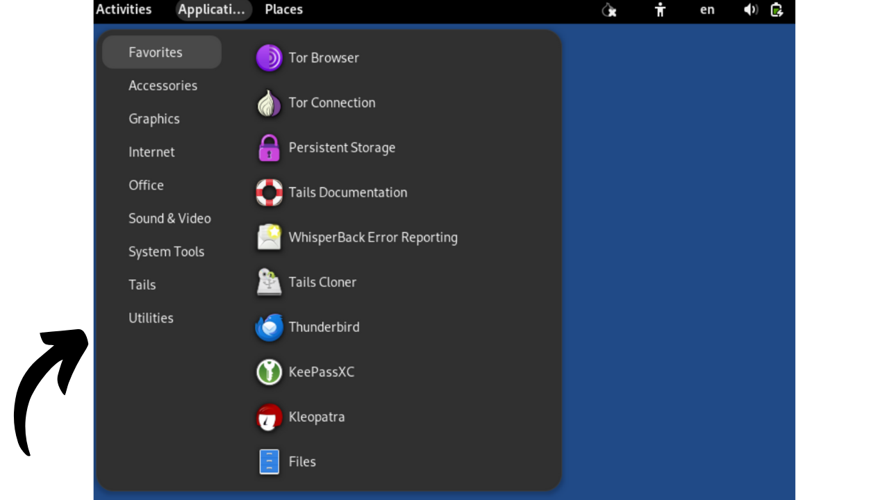

在本教程中，您将学习如何使用掷骰子的方式手动构建比特币钱包的恢复助记词。

**警告：** 以安全的方式生成助记词短语需要在其创建过程中不留下任何数字痕迹，这几乎是不可能的。否则，钱包将呈现出过大的攻击面，显著增加您的比特币被盗的风险。**因此，强烈建议不要将资金转移到依赖于您自己生成的恢复短语的钱包中。** 即使您按照本教程的指示操作，助记词也有可能被泄露。**因此，本教程不应用于创建真实钱包。** 使用硬件钱包进行此任务风险要小得多，因为它离线生成短语，并且真正的密码学家已经考虑了使用质量熵源。

本教程仅可用于创建虚构钱包的实验目的，而无意用于真实比特币。然而，这种经验提供了两个好处：

- 首先，它让您更好地理解比特币钱包基础机制；
- 其次，它使您知道如何操作。我不是说有一天它会有用，但可能会！

## 何为助记词？

恢复助记词，有时也称为“助记词”（mnemonic phrase、seed phrase），通常由 12 个或 24 个单词组成的序列，以伪随机方式从熵源生成。伪随机序列始终以校验和结尾。

助记词短语，连同一个可选的助记词，用于确定性地派生与 HD（分层确定性）钱包相关联的所有密钥。这意味着，通过该助记词，可以确定性地生成和重建比特币钱包的所有私钥和公钥，从而访问与其关联的资金。

这个助记词的目的是提供一种易于使用的比特币备份和恢复手段。将助记词保存在一个安全的地方至关重要，因为任何拥有此短语的人都将能够访问相应钱包的资金。如果它用在传统钱包的上下文中，并且没有可选的密语，它通常构成一个 SPOF（单点故障）。
通常，创建钱包时，软件或硬件钱包会直接给您这个短语。然而，您也可以自己生成这个助记词，然后在选定的支持上输入它以派生钱包密钥。这就是我们将在本教程中学习的内容。

## 准备所需材料

为了手动创建您的恢复助记词，您将需要：

- 一张纸；
- 一支笔，最好是不同颜色的，以便于整理；
- 几个骰子，以尽量减少因骰子不平衡而造成的偏差风险；
- 打印出来的[2048 个 BIP39 单词列表](https://github.com/PlanB-Network/bitcoin-educational-content/tree/dev/tutorials/wallet/generate-mnemonic-phrase/assets/BIP39-WORDLIST.pdf)。

随后，计算校验和就需要使用带有终端的计算机。正因如此，我不建议手动生成助记词。在我看来，即使采取了本教程中提到的预防措施，计算机的介入也会显著增加钱包的脆弱性。
对于“虚拟钱包”的实验性尝试，您可以使用常用的电脑及其终端。然而，为了更严谨地降低助记词泄露的风险，理想的做法是使用一台断开网络连接的电脑（最好没有无线网卡或RJ45网线连接），尽可能减少外设（所有外设都应通过网线连接，避免使用蓝牙），并且运行类似 [Tails](https://tails.boum.org/index.fr.html) 这样的“记忆缺失型 ”Linux 发行版，从可移动存储介质启动。


在真实环境中，选择一个远离窥视眼睛、没有人流、没有摄像头（网络摄像头、手机等）的地点以确保工作空间的保密性是至关重要的。
建议使用大量骰子来减轻潜在不平衡骰子对熵的影响。在使用它们之前，建议检查骰子：可以通过在饱和盐水的碗中测试它们来实现，让骰子漂浮。然后在盐水中滚动每个骰子大约二十次，观察结果。如果有一两个面与其他面相比出现的次数过多，就用更多的滚动来延长测试。均匀分布的结果表明骰子是可靠的。然而，如果有一两个面经常占主导地位，应该把这些骰子放在一边，因为它们可能会破坏您的助记词熵，从而危及您钱包的安全。
在实际应用中，完成这些检查后，即可生成所需的熵值。对于本教程中创建的实验性虚拟钱包，您当然可以跳过这些准备工作。

## 关于助记词的一些提醒

首先，我们将回顾根据 BIP39 创建助记词短语的基础知识。如前所述，该助记词是从一定大小的伪随机信息中派生出来的，然后添加一个校验和以确保其完整性。

这个初始信息的大小，通常被称为 “熵”，由您想在恢复短语中获得的单词数量决定。最常见的格式是 12 个和 24 个单词的助记词，分别来自 128 位和 256 位的熵。这里是一个根据 BIP39 显示不同熵大小的表格：

| 助记词单词数量 | 熵（位） | 校验和（位） | 熵 + 校验和（位） |
| ------------ | -------- | ------------ | ----------------- |
| 12           | 128      | 4            | 132               |
| 15           | 160      | 5            | 165               |
| 18           | 192      | 6            | 198               |
| 21           | 224      | 7            | 231               |
| 24           | 256      | 8            | 264               |

因此，熵是一个介于 128 位和 256 位之间的随机数。在本教程中，我们将以 12 个单词的助记词为例，其中熵是 128 位，意味着我们将生成一个由 128 个 `0` 或 `1` 组成的随机序列。这代表一个由 128 位二进制数字组成的数。
基于这个熵值，将生成一个校验和。校验和是从一组数据中计算出来的值，用于在数据传输或存储期间验证该数据的真实性和有效性。校验和算法旨在检测数据中的意外错误或更改。
在我们的助记词案例中，校验和的功能是在将助记词输入钱包软件时发现任何输入错误。无效的校验和表示助记词中存在错误。相反，有效的校验和表明该助记词很可能是正确的。
为了算出这个校验和，熵值会通过 SHA256 哈希函数进行处理。此操作会生成一个 256 位序列作为输出，其中仅保留前 `N` 位，`N` 的值取决于所需的恢复短语长度（参见上表）。因此，对于一个 12 单词的助记词，将保留哈希值的前 4 位。

前 4 位构成校验和，随后将添加到原始熵中。至此，助记词实际上已形成好，但它仍然是二进制形式。为了按照 BIP39 标准将此二进制序列转换为字，我们首先需要将该序列分割成 11 位段。

每个数据包代表一个二进制数，然后该二进制数将被转换为十进制数（以 10 为基数）。我们将每个数字加 `1`，因为在计算机科学中，计数从 `0` 开始，而 BIP39 列表的编号从 `1` 开始。


最后，十进制数字代表我们该单词在[包含 2048 个 BIP39 单词的列表](https://github.com/PlanB-Network/bitcoin-educational-content/blob/dev/resources/bet/bip39-wordlist/assets/BIP39-WORDLIST.pdf)中的位置。剩下的就是选择这些单词来组成我们钱包的助记词。


现在，让我们开始练习！我们将生成一个 12 单词的恢复助记词。但是，对于 24 单词的助记词，此操作仍然相同，只是需要 256 位熵和 8 位校验和，如本节开头的等效表中所示。

## 第 1 步：生成熵值

准备好一张纸、笔和骰子。首先，我们需要随机生成 128 位，即一连串的 128 个`0`和`1`。为此，我们将使用骰子。


骰子有 6 个面，每个面被掷出的概率相同。然而，我们的目标是产生一个二进制结果，意味着两种可能的结果。因此，我们将为每次掷出偶数的结果赋值 `0`，对于奇数则为 `1`。结果，我们将进行 128 次掷骰来创建我们的 128 位熵。如果骰子显示 `2`、`4` 或 `6`，我们将记下`0`；对于 `1`、`3` 或 `5`，它将是`1`。每个结果将从左到右、从上到下顺序记录。

为了便于后续步骤，我们将比特位分组，每组包含 4 位和 3 位，如下图所示。每行必须包含 11 位：2 个 4 位一组和 1 个 3 位一组。


正如我的示例中所示，第十二个字目前仅由 7 位组成。下一步将加上校验和的 4 位，从而形成 11 位。


## 步骤 2：计算校验和

手动生成助记词时，这一步最为关键，因为它需要使用计算机。如前所述，校验和对应于由熵生成的 SHA256 哈希值的开头部分。虽然理论上可以手动计算 128 位或 256 位输入的 SHA256 哈希值，但这项任务可能需要整整一周的时间。此外，手动计算中的任何错误都只能在过程结束时才能发现，迫使您从头开始。因此，仅凭一张纸和一支笔来完成这一步是不可想象的。计算机几乎是必需的。如果您仍然想学习如何手动计算 SHA256，我们将在[CRYPTO301 课程](https://planb.academy/courses/46b0ced2-9028-4a61-8fbc-3b005ee8d70f)中讲解具体方法。

因此，我强烈建议不要为实际钱包创建手动助记词。在我看
来，即使采取所有必要的预防措施，在这个阶段使用计算机也会不合理地增加钱包的攻击面。
为了在尽可能少地留下痕迹的情况下计算校验和，我们将使用一个名为 “Tails” 的可移动驱动器上的失忆 Linux 发行版。该操作系统从 U 盘启动，完全在计算机的内存（RAM）上运行，无需与硬盘交互。因此，理论上，它在计算机关机后不会留下任何痕迹。请注意，Tails 仅兼容 x86_64 架构的处理器，不兼容 ARM 架构的处理器。

首先，从您常用的计算机上[从其官方网站下载 Tails 镜像](https://tails.net/install/index.fr.html)。通过使用开发者的签名或网站提供的验证工具来确保您下载的真实性。

首先，对您的 USB 棒进行格式化，然后使用[Balena Etcher](https://etcher.balena.io/)之类的工具安装 Tails。

确认成功后，关闭您的计算机。然后断开电源，并从电脑主板上拆下硬盘。如果电脑有无线网卡，也应将其断开。同样，移除所有RJ45以太网线。为最大限度降低数据泄露风险，建议拔掉路由器并关闭手机。此外，请确保断开电脑上所有不必要的外部设备，例如麦克风、摄像头、扬声器或耳机，并检查其他外部设备是否仅通过网线连接。所有这些电脑准备步骤并非绝对必要，但它们有助于在实际环境中尽可能减少攻击面。

检查您的 BIOS 是否配置为允许从外部设备启动。如果没有，更改此设置，然后重启您的机器。一旦您确保了计算机环境的安全，就从带有 Tails OS 的 USB 棒重启计算机。

在 Tails 欢迎屏幕上，选择您选择的语言，然后点击 `Start Tails` 启动系统。


在桌面上，点击 `Applications` 标签。


前往到 `Utilities` 选单。

最后，点击 `Terminal` 应用程序。


您将进入一个新的空白命令终端。


输入 `echo` 命令，后跟您之前生成的熵值，确保在 `echo` 和您的二进制数字序列之间插入一个空格。


添加一个额外的空格，然后输入以下命令，使用 _管道_ (`|`)：

```plaintext
| shasum -a 256 -0
```


以我的熵值为例，完整命令如下：

```plaintext
echo 11010111000110111011000011000010011000100111000001000000001001011011001010111111001010011111110001010100000101110010010011011010 | shasum -a 256 -0
```

在这个命令中：

- `echo` 用于发送比特序列；
- `|`，即 _管道_，用于将 `echo` 命令的输出定向到下一个命令的输入；
- `shasum` 启动属于 SHA（_安全哈希算法_）系列的哈希函数；
- `-a` 指定选择特定的哈希算法；
- `256` 表示使用 SHA256 算法；
- `-0` 允许将输入解释为二进制数。

在仔细检查你的二进制序列没有任何输入错误后，按下 `Enter` 键执行命令。终端将显示您的熵值的 SHA256 哈希。


目前，哈希值以十六进制格式（基数 16）表示。例如，我的哈希值是：

```plaintext
a27abf1aff70311917a59a43ce86fa45a62723a00dd2f9d3d059aeac9b4b13d8
```

为了最终确定助记词，我们只需要哈希值的前 4 位，它们构成校验和。在十六进制格式中，每个字符代表 4 位。因此，我们只需保留哈希值的第一个字符。对于一个 24 个单词的短语，则需要考虑前两个字符。在我的示例中，这对应于字母 `a`。请仔细地将这个字符记在纸上的某个位置，然后关闭计算机。

下一步是将这个十六进制字符（以 16 为基数）转换为二进制值（以 2 为基数），因为我们的短语是以这种格式构建的。为此，您可以使用以下转换表：

| 十进制（基数为 10） | 十六进制（基数为 16） | 二进制（基数为 2） |
| ----------------- | ------------------- | ---------------- |
| 0                 | 0                   | 0000             |
| 1                 | 1                   | 0001             |
| 2                 | 2                   | 0010             |
| 3                 | 3                   | 0011             |
| 4                 | 4                   | 0100             |
| 5                 | 5                   | 0101             |
| 6                 | 6                   | 0110             |
| 7                 | 7                   | 0111             |
| 8                 | 8                   | 1000             |
| 9                 | 9                   | 1001             |
| 10                | a                   | 1010             |
| 11                | b                   | 1011             |
| 12                | c                   | 1100             |
| 13                | d                   | 1101             |
| 14                | e                   | 1110             |
| 15                | f                   | 1111             |

在我的例子中，`a` 对应于二进制数 `1010`。这 4 位构成了我们恢复短语的校验和。您现在可以将它们添加到你已经在纸上记录的熵值中，在最后一个单词的末尾放置它们。


你的助记词现在已经完成，但它是以二进制格式存在的。下一步将是将其转换为十进制系统，这样你就可以将每个数字与 BIP39 列表中的相应单词关联起来。

## 第 3 步：将单词转换为十进制数字

为了将每一行二进制数转换为十进制数，我们将使用一种便于手动计算的方法。目前，纸上有十二行，每一行由 11 个二进制数字 `0` 或 `1` 组成。要进行十进制转换，首先，如果第一个数字是 `1`，则赋值为 `1024`，否则赋值为 `0`。其次，如果第二个数字是 `1`，则赋值为 `512`，否则赋值为 `0`，依此类推，直到第十一个数字。对应关系如下：

- 第 1 位：`1024`;
- 第 2 位：`512`;
- 第 3 位：`256`;
- 第 4 位：`128`;
- 第 5 位：`64`;
- 第 6 位：`32`;
- 第 7 位：`16`;
- 第 8 位：`8`;
- 第 9 位：`4`;
- 第 10 位：`2`;
- 第 11 位：`1`。

对于每一行，我们将对应于数字 `1` 的值相加，以获得与该二进制数等效的十进制数。例如，假设有一行二进制数为：

```plaintext
1010 1101 101
```

转换过程如下：

结果为：

```plaintext
1389
```

对于每个等于 `1` 的位，报告下面的关联数字。对于每个等于 `0` 的位，不报告任何内容。


对于每个等于 `1` 的位，请在下方写下其对应的数字。对于每个等于 `0` 的位，无需报告任何内容。


## 第 4 步：查找助记词

有了得到的十进制数字，我们现在就可以在列表中找到对应的单词来组成助记词。但是，BIP39 列表中 2048 个单词的编号范围是 `1` 到 `2048`。而我们计算出的二进制结果范围是 `0` 到 `2047`。因此，存在一个单位的偏移需要修正。要修正这个偏移，只需将之前计算出的十二个十进制数字加上 `1` 即可。


经过此调整后，您就得到了每个单词在列表中的排名。剩下的就是根据编号来识别每个单词。显然，与其他所有步骤一样，您不能使用计算机进行此转换。因此，请确保您事先已打印出列表。
[**-> 以 A4 格式打印 BIP39 列表。**](https://github.com/PlanB-Network/bitcoin-educational-content/tree/dev/tutorials/wallet/generate-mnemonic-phrase/assets/BIP39-WORDLIST.pdf)

例如，如果从第一行得出的数字为 1721，则对应的单词将是列表中的第 1721 个单词：

```plaintext
1721. strike
```


以此方式，我们依次使用这 12 个单词来构建助记词


## 第 5 步：创建比特币钱包

至此，只需将助记词导入比特币钱包软件即可。根据个人喜好，您可以使用桌面软件创建热钱包，也可以使用硬件钱包创建冷钱包。


只有在导入过程中才能验证校验和的有效性。如果软件显示 “校验和无效” 之类的消息，则表示创建过程中出现了错误。通常，此错误源于手动转换和加法过程中的计算错误，或者在 Tails 终端中输入熵值时出现的拼写错误。您需要从头开始重新创建钱包才能纠正这些错误。


创建钱包后，请务必将助记词备份到纸质或金属等物理介质上，并销毁生成助记词时使用的电子表格，以防止信息泄露。

## Coldcard 掷骰子选项的特殊情况

Coldcard 系列硬件钱包提供名为[_Dice Roll（掷骰子）_](https://youtu.be/Rc29d9m92xg?si=OeFW2iCGRvxexhK7)的功能，用于通过掷骰子生成钱包的助记词。这种方法非常出色，因为它让您可以直接控制熵的生成，而无需像我们的教程中那样使用外部设备来计算校验和。

然而，最近有报道称，由于不当使用此功能，比特币被盗事件时有发生。事实上，掷骰子次数过少会导致熵不足，理论上，这可能导致助记词被暴力破解，从而窃取相关的比特币。为了避免这种风险，建议在 Coldcard 上至少掷 99 次骰子，以确保足够的熵。

## 步骤 4：查找助记词

有了得到的十进制数字，我们现在就可以在列表中找到对应的单词来组成助记词。但是，BIP39 列表中 2048 个单词的编号范围是 `1` 到 `2048`。而我们计算出的二进制结果范围是 `0` 到 `2047`。因此，存在一个单位的偏移需要修正。要修正这个偏移，只需将之前计算出的十二个十进制数字加上 `1` 即可。


经过此调整后，您就得到了每个单词在列表中的排名。剩下的就是根据编号来识别每个单词。显然，与其他所有步骤一样，您不能使用计算机进行此转换。因此，请确保您事先已打印出列表。

[**-> 以 A4 纸张格式打印 BIP39 列表。**](https://github.com/PlanB-Network/bitcoin-educational-content/blob/dev/resources/bet/bip39-wordlist/assets/BIP39-WORDLIST.pdf)

例如，如果从第一行得出的数字是 1721，则对应的单词将是列表中的第 1721 个单词：

```plaintext

1721. strike

```


以此方式，我们依次使用这 12 个单词来构建助记词。


## 步骤 5：创建比特币钱包

至此，只需将助记词导入比特币钱包软件即可。根据个人喜好，您可以使用桌面软件创建热钱包，也可以使用硬件钱包创建冷钱包。


只有在导入过程中才能验证校验和的有效性。如果软件显示“校验和无效”之类的消息，则表示创建过程中出现了错误。通常，此错误源于手动转换和加法过程中的计算错误，或者在 Tails 终端中输入熵值时出现的拼写错误。您需要从头开始重新创建钱包才能纠正这些错误。


创建钱包后，请务必将助记词备份到纸质或金属等物理介质上，并销毁生成助记词时使用的电子表格，以防止信息泄露。

## Coldcard 掷骰子选项的特殊情况

Coldcard 系列硬件钱包提供名为“掷骰子”的功能（https://youtu.be/Rc29d9m92xg?si=OeFW2iCGRvxexhK7），用于通过掷骰子生成钱包的助记词。这种方法非常出色，因为它让您可以直接控制熵的生成，而无需像我们的教程中那样使用外部设备来计算校验和。

然而，最近有报道称，由于不当使用此功能，比特币被盗事件时有发生。事实上，掷骰子次数过少会导致熵不足，理论上，这可能导致助记词被暴力破解，从而窃取相关的比特币。为了避免这种风险，建议在 Coldcard 上至少掷 99 次骰子，以确保足够的熵。

Coldcard 提出的结果解读方法与本教程中介绍的方法有所不同。本教程建议掷骰子 128 次以达到 128 位安全性，而 Coldcard 建议掷骰子 99 次以达到 256 位安全性。实际上，在我们的方法中，每次掷骰子只有两种可能的结果：偶数 (`0`) 或奇数 (`1`)。因此，每次掷骰子产生的熵等于 `log2(2)`。而 Coldcard 考虑了骰子的六个可能点数（从 `1` 到 `6`），因此每次掷骰子产生的熵等于 `log2(6)`。这就是为什么在我们的教程中，我们需要进行更多次掷骰子才能达到相同的熵值。

```plaintext
熵（Entropy） = 骰子掷出的次数 × log2（骰子可能的结果数）

Coldcard：

熵 = 99 × log2(6)
熵 = 255.91

本教程：

熵 = 128 × log2(2)
熵 = 128
```
