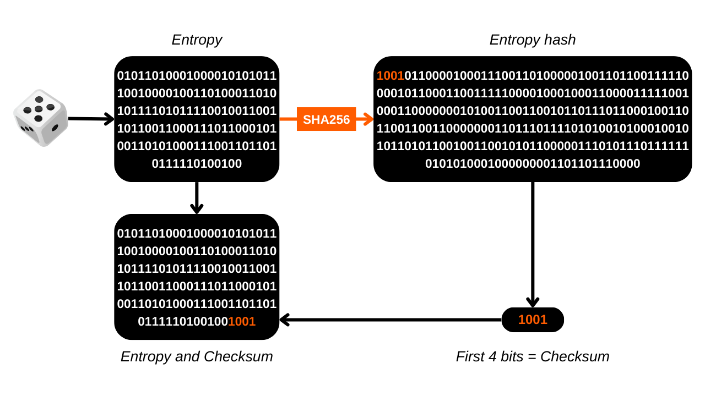

在本教程中，您将学习如何使用骰子滚动手动构建比特币钱包的恢复短语。

**警告：** 以安全的方式生成助记词短语需要在其创建过程中不留下任何数字痕迹，这几乎是不可能的。否则，钱包将呈现出过大的攻击面，显著增加您的比特币被盗的风险。**因此，强烈建议不要将资金转移到依赖于您自己生成的恢复短语的钱包中。** 即使您按照本教程的指示操作，恢复短语也有可能被泄露。**因此，本教程不应用于创建真实钱包。** 使用硬件钱包进行此任务风险要小得多，因为它离线生成短语，并且真正的密码学家已经考虑了使用质量熵源。

本教程仅可用于创建虚构钱包的实验目的，而无意用于真实比特币。然而，这种经验提供了两个好处：
- 首先，它让您更好地理解比特币钱包基础机制；
- 其次，它使您知道如何操作。我不是说有一天它会有用，但可能会！

## 什么是助记词短语？
恢复短语，有时也称为“助记词”、“种子短语”或“秘密短语”，通常由12个或24个单词组成的序列，以伪随机方式从熵源生成。伪随机序列总是完成一个校验和。

助记词短语，连同一个可选的密码短语，用于确定性地派生与HD（分层确定性）钱包相关联的所有密钥。这意味着从这个短语出发，可以确定性地生成和重建比特币钱包的所有私钥和公钥，因此，访问与之相关的资金。

这个句子的目的是提供一种易于使用的比特币备份和恢复手段。将助记词短语保存在一个安全的地方至关重要，因为任何拥有此短语的人都将能够访问相应钱包的资金。如果它用在传统钱包的上下文中，并且没有可选的密码短语，它通常构成一个SPOF（单点故障）。 
通常，创建钱包时，软件或硬件钱包会直接给您这个短语。然而，也可以自己生成这个短语，然后在选定的支持上输入它以派生钱包密钥。这就是我们将在本教程中学习的内容。

## 准备所需材料
为了手动创建您的恢复短语，您将需要：
- 一张纸；
- 一支笔或铅笔，理想情况下使用不同颜色以便组织；
- 几个骰子，以最小化由不平衡的骰子引起的偏差风险；
- 打印出来的[2048个BIP39单词列表](https://github.com/DecouvreBitcoin/sovereign-university-data/tree/dev/tutorials/others/generate-mnemonic-phrase/assets/BIP39-WORDLIST.pdf)。

随后，将需要使用带有终端的计算机来计算校验和。正是出于这个原因，我不建议手动生成助记词短语。我认为，即使在本教程中提到的预防措施下，计算机的介入显著增加了钱包的脆弱性。
在关于“虚构钱包”的实验方法中，您可以使用常规电脑及其终端。然而，为了更严格地限制泄露您的短语的风险，理想的做法是使用一台与互联网断开连接的电脑（最好没有wifi组件或RJ45有线连接），配备最少的外设（所有外设都应通过电缆连接，以避免使用蓝牙），最重要的是，运行一个如[Tails](https://tails.boum.org/index.fr.html)这样的失忆型Linux发行版，从一个可移动介质启动。


在真实环境中，选择一个远离窥视眼睛、没有人流、没有摄像头（网络摄像头、手机等）的地点以确保工作空间的保密性是至关重要的。
建议使用大量骰子来减轻潜在不平衡骰子对熵的影响。在使用它们之前，建议检查骰子：可以通过在饱和盐水的碗中测试它们来实现，让骰子漂浮。然后在盐水中滚动每个骰子大约二十次，观察结果。如果有一两个面与其他面相比出现的次数过多，就用更多的滚动来延长测试。均匀分布的结果表明骰子是可靠的。然而，如果有一两个面经常占主导地位，应该把这些骰子放在一边，因为它们可能会破坏您的助记词熵，从而危及您钱包的安全。
在真实条件下，进行这些检查后，您将准备好生成所需的熵。对于作为本教程一部分创建的实验性虚构钱包，您自然可以跳过这些准备工作。

## 关于恢复短语的一些提醒
首先，我们将回顾根据BIP39创建助记词短语的基础知识。如前所述，该短语是从一定大小的伪随机信息中派生出来的，然后添加一个校验和以确保其完整性。

这个初始信息的大小，通常被称为“熵”，由您想在恢复短语中获得的单词数量决定。最常见的格式是12个和24个单词的短语，分别来自128位和256位的熵。这里是一个根据BIP39显示不同熵大小的表格：

| 短语（单词） | 熵（位） | 校验和（位） | 熵 + 校验和（位） |
| --------------- | --------------- | --------------- | -------------------------- |
| 12              | 128             | 4               | 132                        |
| 15              | 160             | 5               | 165                        |
| 18              | 192             | 6               | 198                        |
| 21              | 224             | 7               | 231                        |
| 24              | 256             | 8               | 264                        |

因此，熵是一个介于128位和256位之间的随机数。在本教程中，我们将以12个单词的短语为例，其中熵是128位，意味着我们将生成一个由128个`0`或`1`组成的随机序列。这代表一个由128位二进制数字组成的数。
基于这个熵，将生成一个校验和。校验和是从一组数据中计算出来的值，用于在数据传输或存储期间验证该数据的完整性和有效性。校验和算法旨在检测数据中的意外错误或更改。
在我们的助记词案例中，校验和的功能是在将短语输入钱包软件时发现任何输入错误。无效的校验和表示短语中存在错误。相反，有效的校验和表明该短语很可能是正确的。
为了获得这个校验和，熵将通过SHA256哈希函数。这个操作产生一个256位的序列作为输出，其中只有前`N`位将被保留，`N`取决于恢复短语的期望长度（见上表）。因此，对于一个12个词的短语，将保留哈希的前4位。

这前4位，形成校验和，然后会被添加到原始熵中。在这个阶段，恢复短语实际上已经构成，但它仍然是二进制形式。为了按照BIP39标准将这个二进制序列转换成词，我们首先将序列分成11位的段。

这些包中的每一个代表一个二进制数，然后将被转换成十进制数（基数10）。我们将在每个数字上加`1`，因为在计算中，计数从`0`开始，但BIP39列表是从`1`开始编号的。


最后，十进制数告诉我们对应词在[2048个BIP39词的列表](https://github.com/DecouvreBitcoin/sovereign-university-data/tree/dev/tutorials/others/generate-mnemonic-phrase/assets/BIP39-WORDLIST.pdf)中的位置。剩下的就是选择这些词来组成我们钱包的恢复短语。


现在，让我们开始实践吧！我们将生成一个12词的恢复短语。然而，这个操作在24词短语的情况下是相同的，只是它需要256位的熵和一个8位的校验和，如本节开始的等价表中所示。

## 第1步：生成熵
准备好你的纸张、笔和骰子。首先，我们需要随机生成128位，即一连串的128个`0`和`1`。为此，我们将使用骰子。


骰子有6个面，每个面被掷出的概率相同。然而，我们的目标是产生一个二进制结果，意味着两种可能的结果。因此，我们将为每次掷出偶数的结果赋值`0`，对于奇数则为`1`。结果，我们将进行128次掷骰来创建我们的128位熵。如果骰子显示`2`、`4`或`6`，我们将记下`0`；对于`1`、`3`或`5`，它将是`1`。每个结果将从左到右、从上到下顺序记录。

为了方便后续步骤，我们将按照下图所示，将位分成四个和三个的包。每行必须有11位：2个4位的包和一个3位的包。


正如您在我的示例中看到的，第十二个词目前只由7个比特组成。这些将在下一步中通过校验和的4个比特来完成，以形成11个比特。


## 步骤2：计算校验和
这一步是手动生成助记词短语中最关键的一步，因为它需要使用计算机。如前所述，校验和对应于从熵生成的SHA256哈希的开始部分。尽管理论上可能手工计算128或256比特输入的SHA256，但这项任务可能需要整整一周的时间。此外，手工计算中的任何错误只能在过程结束时被发现，迫使您从头开始。因此，仅用一张纸和一支笔来完成这一步是难以想象的。使用计算机几乎是必须的。如果您仍然想学习如何手工做SHA256，我们在[CRYPTO301课程](https://planb.network/en/courses/crypto301)中解释了如何做。

因此，我强烈建议不要为实际的钱包创建手工短语。我认为，在这个阶段使用计算机，即使采取了所有必要的预防措施，也不合理地增加了钱包的攻击面。
为了在尽可能少留痕迹的情况下计算校验和，我们将使用一个名为**Tails**的可遗忘Linux发行版，它通过可移动驱动器启动。这个操作系统从USB棒启动，并完全在计算机的RAM上运行，不与硬盘交互。因此，理论上，它在计算机关闭后不会在计算机上留下任何痕迹。请注意，Tails只与x86_64类型的处理器兼容，不适用于ARM类型的处理器。
首先，从您常用的计算机上[从其官方网站下载Tails镜像](https://tails.net/install/index.fr.html)。通过使用开发者的签名或网站提供的验证工具来确保您下载的真实性。

首先，对您的USB棒进行格式化，然后使用[Balena Etcher](https://etcher.balena.io/)之类的工具安装Tails。

确认闪存成功后，关闭您的计算机。然后继续断开电源并从您的PC主板上取下硬盘。在存在WiFi卡的情况下，应将其断开。同样，拔掉任何RJ45以太网线。为了最小化数据泄露的风险，建议拔掉您的互联网盒子并关闭您的手机。此外，确保断开计算机上的任何不必要的外围设备，如麦克风、网络摄像头、扬声器或耳机，并检查其他外围设备仅通过线缆连接。所有这些PC准备步骤不是必须的，但它们仅仅是为了在实际情况下尽可能减少攻击面。

检查您的BIOS是否配置为允许从外部设备启动。如果没有，更改此设置，然后重启您的机器。一旦您确保了计算机环境的安全，就从带有Tails OS的USB棒重启计算机。

在Tails欢迎屏幕上，选择您选择的语言，然后点击`Start Tails`启动系统。


从桌面上，点击`Applications`标签。


导航到`Utilities`菜单。

最后，点击 `Terminal` 应用程序。


你将进入一个新的空白命令终端。


输入 `echo` 命令，后跟你之前生成的熵值，确保在 `echo` 和你的二进制数字序列之间插入一个空格。


添加一个额外的空格，然后输入以下命令，使用 *管道* (`|`)：
```plaintext
| shasum -a 256 -0
```


以我的熵值为例，完整命令如下：
```plaintext
echo 11010111000110111011000011000010011000100111000001000000001001011011001010111111001010011111110001010100000101110010010011011010 | shasum -a 256 -0
```

在这个命令中：
- `echo` 用于发送比特序列；
- `|`，即 *管道*，用于将 `echo` 命令的输出定向到下一个命令的输入；
- `shasum` 启动属于 SHA（*安全哈希算法*）家族的哈希函数；
- `-a` 指定选择特定的哈希算法；
- `256` 表示使用 SHA256 算法；
- `-0` 允许将输入解释为二进制数。

在仔细检查你的二进制序列没有任何输入错误后，按下 `Enter` 键执行命令。终端将显示你的熵值的 SHA256 哈希。


目前，哈希值以十六进制格式（基数 16）表示。例如，我的是：
```plaintext
a27abf1aff70311917a59a43ce86fa45a62723a00dd2f9d3d059aeac9b4b13d8
```

为了完成我们的助记词短语，我们只需要哈希的前4位，这构成了校验和。在十六进制格式中，每个字符代表4位。因此，我们只保留哈希的第一个字符。对于一个24词的短语，需要考虑前两个字符。在我的例子中，这对应于字母：`a`。仔细在你的纸上记下这个字符，然后关闭你的电脑。

下一步是将这个十六进制字符（基数 16）转换为二进制值（基数 2），因为我们的短语是以这种格式构建的。为此，你可以使用以下转换表：


| 十进制（基数 10） | 十六进制（基数 16） | 二进制（基数 2） |
| ----------------- | ------------------- | --------------- |
| 0                 | 0                   | 0000            |
| 1                 | 1                   | 0001            |
| 2                 | 2                   | 0010            |
| 3                 | 3                   | 0011            |
| 4                 | 4                   | 0100            |
| 5                 | 5                   | 0101            |
| 6                 | 6                   | 0110            |
| 7                 | 7                   | 0111            |
| 8                 | 8                   | 1000            |
| 9                 | 9                     | 1001            |
| 10                | a                     | 1010            |
| 11                | b                     | 1011            |
| 12                | c                     | 1100            |
| 13                | d                     | 1101            |
| 14                | e                     | 1110            |
| 15                | f                     | 1111            |

在我的例子中，字母 `a` 对应于二进制数 `1010`。这4位构成了我们恢复短语的校验和。你现在可以将它们添加到你已经在纸上记录的熵中，在最后一个单词的末尾放置它们。


你的助记词现在已经完成，但它是以二进制格式存在的。下一步将是将其转换为十进制系统，这样你就可以将每个数字与 BIP39 列表中的相应单词关联起来。

## 第3步：将单词转换为十进制
为了将每行二进制转换为十进制数，我们将使用一种便于手工计算的方法。目前，你的纸上有十二行，每行由11个二进制数字 `0` 或 `1` 组成。为了进行转换为十进制，如果第一位数字是 `1`，则分配值 `1024`，否则为 `0`。对于第二位数字，如果是 `1`，则分配值 `512`，否则为 `0`，依此类推，直到第十一位数字。对应关系如下：
- 第1位：`1024`;
- 第2位：`512`;
- 第3位：`256`;
- 第4位：`128`;
- 第5位：`64`;
- 第6位：`32`;
- 第7位：`16`;
- 第8位：`8`;
- 第9位：`4`;
- 第10位：`2`;
- 第11位：`1`。

对于每行，我们将加上对应于数字 `1` 的值，以获得二进制数的十进制数等价物。以二进制行等于：
```plaintext
1010 1101 101
```

转换如下：

结果将是：
```plaintext
1389
```

对于每个等于 `1` 的位，报告下面的关联数字。对于每个等于 `0` 的位，不报告任何内容。


然后，简单地将所有由 `1` 验证的数字加起来，得到代表每个二进制行的十进制数。例如，这是我的纸张上的样子：


## 第4步：寻找助记词短语的单词
有了获得的十进制数字，我们现在可以在列表中找到相应的单词来组成助记词短语。然而，BIP39 列表中的2048个单词的编号范围是从 `1` 到 `2048`。但是，我们计算出的二进制结果范围是从 `0` 到 `2047`。因此，需要纠正一单位的偏移。为了纠正这个偏移，只需将之前计算的十二个十进制数字各加 `1`。


在此调整之后，你将得到列表中每个单词的排名。剩下的就是通过它们的编号来识别每个单词。显然，与所有其他步骤一样，你不能使用计算机来执行这一转换。因此，请确保你事先已经打印出了列表。
[**-> 以A4格式打印BIP39列表。**](https://github.com/DecouvreBitcoin/sovereign-university-data/tree/dev/tutorials/others/generate-mnemonic-phrase/assets/BIP39-WORDLIST.pdf)

例如，如果从第一行得到的数字是1721，对应的单词将是列表中的第1721个：
```plaintext
1721. strike
```

通过这种方式，我们依次构建我们的助记词短语，共12个单词。


## 第5步：创建比特币钱包
此时，剩下的就是将我们的助记词短语导入比特币钱包软件。根据我们的偏好，这可以在桌面软件上完成以获得热钱包，或在硬件钱包上完成以获得冷钱包。


只有在导入时，你才能验证你的校验和的有效性。如果软件显示如`Invalid Checksum`之类的消息，这意味着你的创建过程中出现了错误。通常，这种错误要么源于手动转换和加法过程中的计算错误，要么源于在Tails终端输入你的熵时的打字错误。必须从头开始重新进行过程以纠正这些错误。


创建钱包后，不要忘记在物理介质上备份你的恢复短语，如纸张或金属，并销毁在其生成过程中使用的电子表格，以防止任何信息泄露。

## Coldcards上的骰子滚动选项的特殊情况
Coldcard系列的硬件钱包提供了一个名为[*Dice Roll*](https://youtu.be/Rc29d9m92xg?si=OeFW2iCGRvxexhK7)的功能，以骰子生成你的钱包恢复短语。这种方法非常好，因为它让你直接控制熵的创建，无需使用外部设备来计算校验和，就像我们的教程中那样。

然而，最近由于这一功能的不当使用，已经报告了比特币盗窃事件。实际上，骰子滚动次数过少可能导致熵不足，理论上使得通过暴力破解助记词短语并窃取相关比特币成为可能。为了避免这种风险，建议在Coldcard上至少滚动99次骰子，这样可以确保足够的熵。

Coldcard提出的结果解释方法与本教程中介绍的不同。虽然我们在教程中推荐滚动128次以达到128位的安全性，但Coldcard建议滚动99次以达到256位的安全性。实际上，在我们的方法中，每次骰子滚动只有两种可能的结果：偶数（`0`）或奇数（`1`）。因此，每次滚动产生的熵等于`log2(2)`。在Coldcard的案例中，考虑到骰子的六个可能面（从`1`到`6`），每次滚动的熵等于`log2(6)`。这就是为什么在我们的教程中，需要进行更多次滚动以达到相同的熵水平。
熵 = 投掷次数 * log2(骰子可能出现的结果数)
Coldcard：

熵 = 99 * log2(6)
熵 = 255.91

我们的教程：

熵 = 128 * log2(2)
熵 = 128