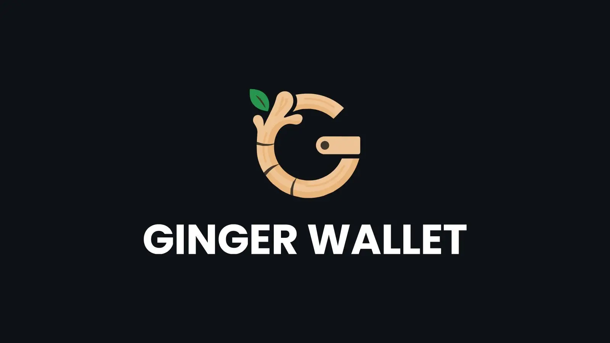

Ginger Wallet est un portefeuille Bitcoin open source, non custodial, axé sur la confidentialité et la vie privée. Il a démarré comme fork de Wasabi Wallet (après la version 2.0.7.2).
En réalité, plusieurs anciens développeurs de Wasabi Wallet ont rejoint l'équipe de Ginger dans le but de travailler sur ce nouveau portefeuille qui est un fork direct du code source de Wasabi autorisé par la licence MIT de Wasabi. 
Ginger Wallet conserve l'architecture technique de Wasabi tout en y ajoutant quelques spécificités. Selon la [documentation de Ginger Wallet](https://docs.gingerwallet.io/why-ginger/difference.html#gingerwallet), Wasabi privilégie **l’autonomie et le contrôle**, tandis que Ginger mise sur la **commodité, la sécurité et une expérience simplifiée** rendant l'utilisation accessible à ceux qui sont moins familiers avec les aspects techniques.

Ginger Wallet est conçu pour les ordinateurs. En effet, certaines de ces fonctionnalités telles que le **Coinjoin** nécessitent une certaine puissance de calcul qui n'est pas disponible sur les smartphones. 

## Qu’est-ce que le Coinjoin ? 

**Coinjoin** est une opération cryptographique qui réunit plusieurs participants au sein d'une même transaction collaborative. Typiquement, cette opération mixe les entrées et les sorties des participants dans une même transaction afin de rendre difficile l'identification des personnes qui ont effectué tels ou tels paiements. Par conséquent, il est quasi impossible pour un observateur extérieur d'identifier l'origine et la destination précises des fonds (contrairement aux transactions Bitcoin traditionnelles qui révèlent clairement le pseudonyme de l'émetteur et du récepteur). 

Cette technique garantit une sécurité maximale puisque les fonds restent en permanence sous le contrôle exclusif de l'utilisateur, à l'abri de toute appropriation frauduleuse. Même les concepteurs de la solution ne disposent d'aucun pouvoir de modification ou de détournement des transactions. Le principe du **Coinjoin** se résume ainsi : **Trouvez d'autres personnes souhaitant effectuer une transaction au même moment et regroupez vos opérations**.

L'architecture du système Ginger Coinjoin repose sur un modèle **trustless** (sans nécessité de confiance). Ni les participants entre eux, ni le coordinateur ne nécessitent une relation de confiance mutuelle. L'utilisateur demeure l'unique détenteur de ses clés privées et le seul habilité à valider les transactions (validation qui n'intervient qu'après vérification rigoureuse de leur conformité). Aucun tiers ne peut s'approprier vos bitcoins ni établir de lien entre vos entrées et sorties de fonds.

Pour approfondir la notion, veuillez consulter le cours BTC 204 de Plan ₿ Network intitulé **la Confidentialité sur Bitcoin**.

https://planb.network/courses/65c138b0-4161-4958-bbe3-c12916bc959c

## Installer Ginger Wallet 

Pour installer Ginger wallet, rendez-vous sur le site web [Ginger Wallet](https://gingerwallet.io).
Appuyez sur **Télécharger** pour télécharger la version adaptée à votre ordinateur (Windows / MacOs / Linux).

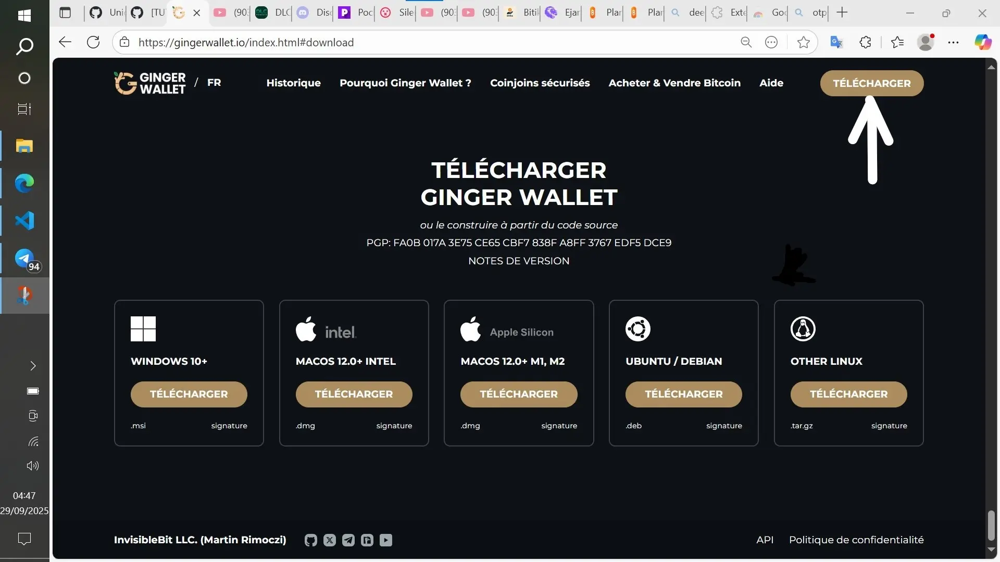

Une autre possibilité : celle de se rendre sur le [GitHub du projet](https://github.com/GingerPrivacy/GingerWallet/releases/tag/v2.0.22) afin de le télécharger. 

Ensuite, lancez le programme d'installation.

## Configuration des paramètres

### Configurations préliminaires

Ouvrez Ginger Wallet, choisissez votre langue préférée.

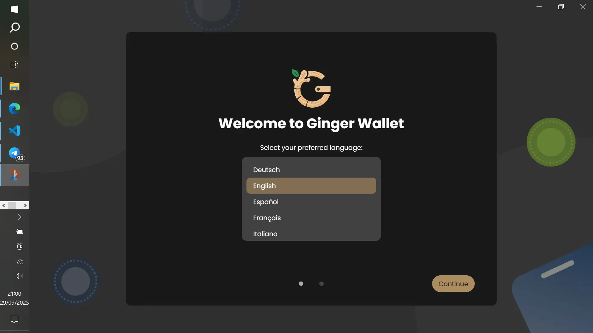

Ginger vous rappelle dès le début les frais de conjoin, bien avant même de créer ou de restaurer un portefeuille.

Appuyez ensuite sur **Pour commencer**, puis sur **Nouveau** pour créer un nouveau portefeuille.

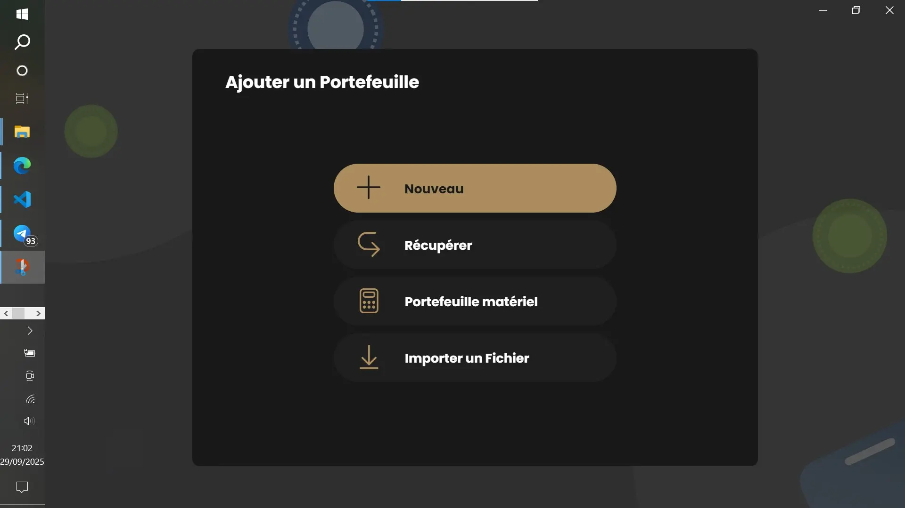

Passez ensuite à la sauvegarde et à la confirmation de votre seedphrase.

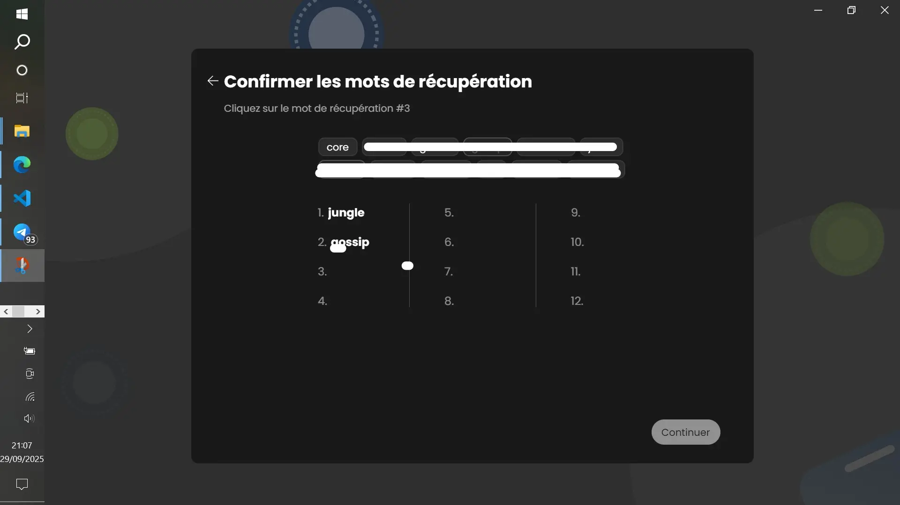

Pour plus de sécurité, Ginger Wallet vous donne la possibilité d'ajouter une passphrase.

Cette passphrase une fois ajoutée, vous sera demandée à chaque fois que vous tenterez d'accéder à votre application.

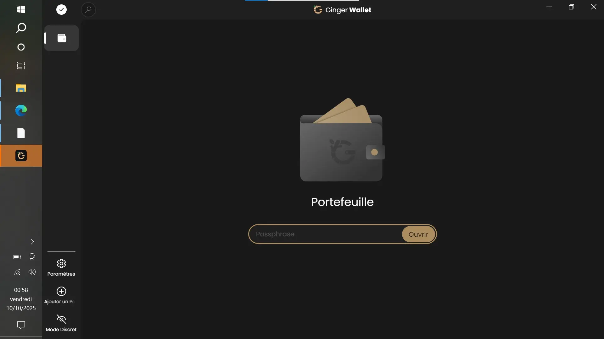

Ginger active automatiquement le **Coinjoin** par défaut lors de la création de votre compte. Vous êtes informés et vous pourrez personnaliser ce paramètre à votre guise.

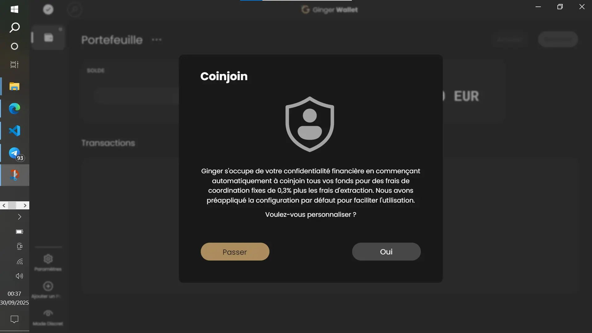

### Configuration des paramètres généraux

Une fois votre premier portefeuille créé, vous accédez à l'interface de Ginger Wallet.

Activez le **Mode discret**, si vous souhaitez cacher les soldes de vos portefeuilles.

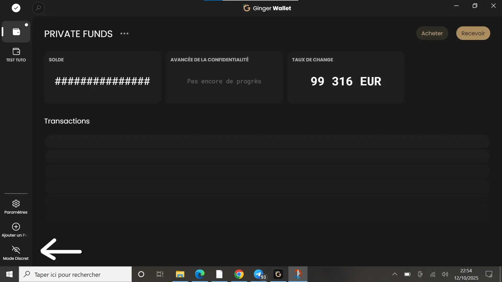

Vous pouvez créer plusieurs portefeuilles sur Ginger Wallet. Il suffit de cliquer sur **Ajouter un portefeuille**.

Ginger prend en charge l'utilisation de portefeuilles matériels via l'interface matérielle standard Bitcoin Core, bien que l'intégration directe depuis ou vers un portefeuille matériel ne soit pas encore possible. 
Au nombre de ces portefeuilles matériels, nous pouvons citer :

- Blockstream Jade
- ColdCard MK4
- ColdCard Q
- Ledger Nano S Plus
- Ledger Nano X
- Trezor Modèle T
- Coffre-fort Trezor 3

Maintenant, cliquez sur **Paramètres**.

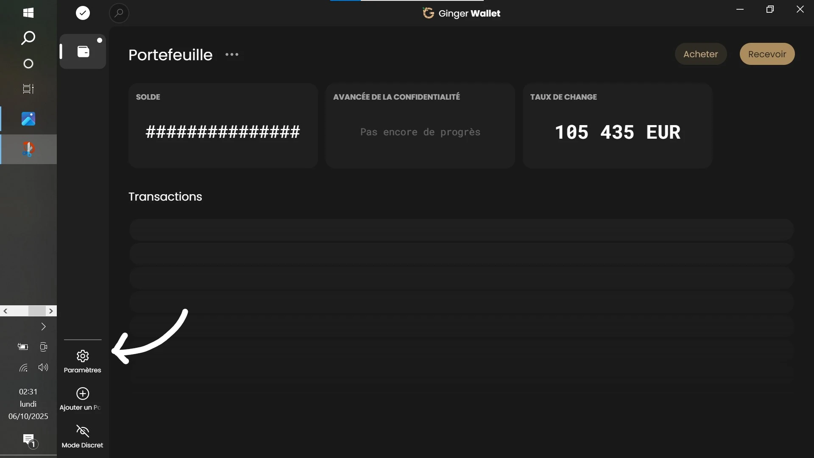

Ces paramètres sont ceux de l'application en général et les configurations que vous y ferez s'appliqueront à tous les portefeuilles. 
Dans **Paramètres**, vous avez les onglets :

1. **Général**

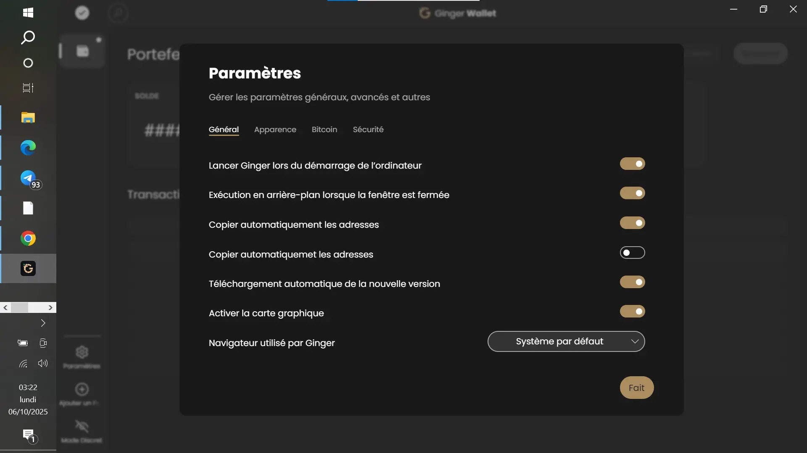

2. **Apparence**
Dans cet onglet, vous pouvez changer entre autres la langue, la devise ou encore l'unité d'affichage des frais (BTC/Satoshi).

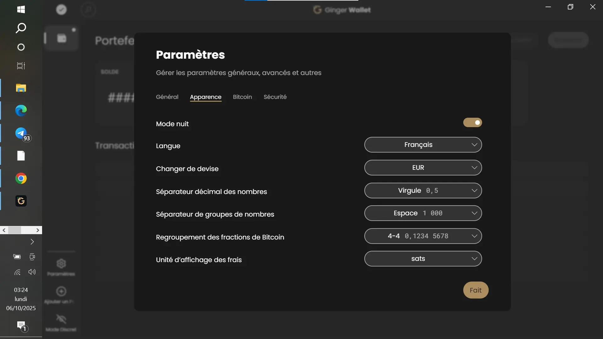

3. **Bitcoin**
Cet onglet vous offre la possibilité d'activer l'exécution de Bitcoin Knots au démarrage de l'application, de choisir votre réseau (Main/RegTest), et votre fournisseur de taux de frais (Mempool Space/Blockstream info/Full Node), etc.

4. **Sécurité**
Dans l'onglet Sécurité, vous pouvez activer l'authentification à double facteurs, activer ou désactiver Tor et même le désactiver une fois l'application Ginger fermée. 

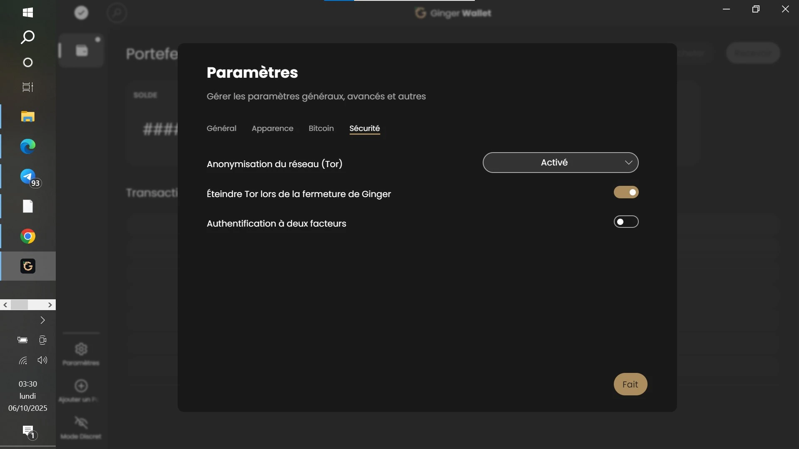

**NB** :
1. Relativement à l'authentification à double facteurs, veuillez vous assurer que votre application d'authentification prend en charge l'authentification SHA256 et à huit (8) chiffres. En effet, Ginger Wallet requiert un code 2FA à huit chiffres afin de renforcer la sécurité. Ce format plus long rend le code beaucoup plus difficile à deviner ou à pirater, offrant ainsi une protection accrue contre tout accès non autorisé.

2. Par défaut, tout le trafic réseau de Ginger passe par Tor, vous n'êtes donc pas obligé de le configurer manuellement. Ginger utilisera donc automatiquement, Tor en priorité, s'il est déjà actif sur votre système. 
Mais, une fois que vous désactivez Tor dans les paramètres, votre vie privée reste globalement préservée, sauf dans deux situations :
- pendant un Coinjoin, le coordinateur pourrait relier vos entrées et sorties à votre adresse IP ;
- lors de la diffusion d’une transaction, un nœud malveillant auquel vous vous connectez pourrait associer votre transaction à votre IP.

3. N'oubliez pas d'appuyer à chaque fois sur **Fait** (dans le coin inférieur droit), pour sauvegarder vos paramétrages. Certains paramétrages nécessitent que Ginger Wallet soit redémarré pour prendre effet.

Par ailleurs, la barre de recherche situé en haut des portefeuilles vous permet de rechercher et d'accéder à n'importe quel paramètre, etc...

### Configuration d'un portefeuille

Plusieurs portefeuilles peuvent être créés dans l'application, par conséquent, chaque portefeuille peut donc être configuré selon votre convenance. Pour le faire, cliquez sur les **trois points** devant le nom du portefeuille, ensuite sur **Paramètres du portefeuille**. 

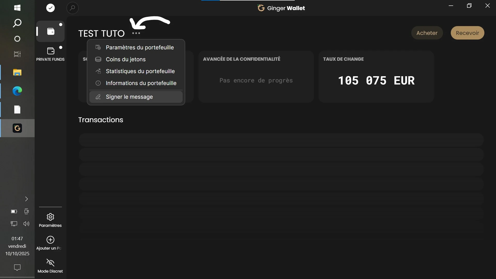

Comme vous pouvez le constater, mis à part le paramètre du portefeuille, vous pourrez vérifier les coins de jetons (liste des jetons que vous possédez), les statistiques et les informations du portefeuille (la clé publique étendue par exemple).

Pour revenir à la configuration de notre portefeuille, une fois que vous cliquez sur les paramètres du portefeuille, vous accèderez aux onglets suivants :
- **Général** (où vous pourrez modifier le nom du portefeuille) ;

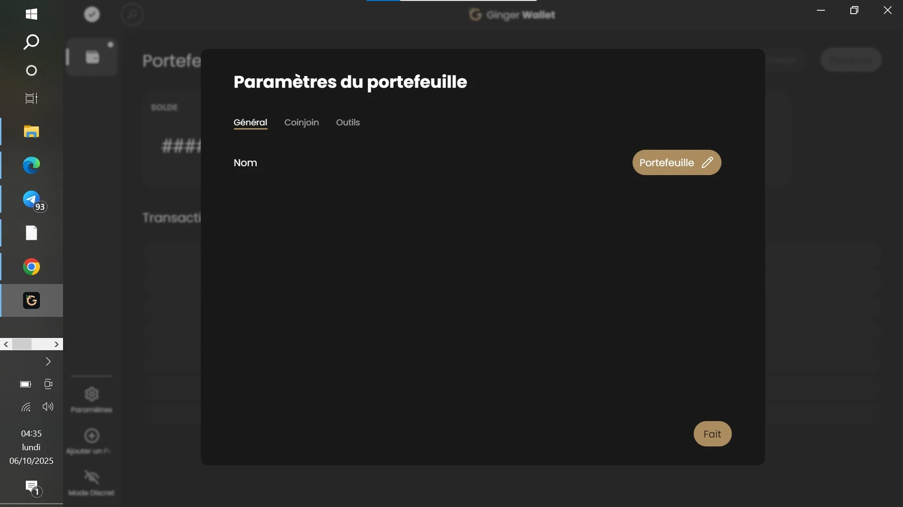

- **Conjoin** (où vous pourrez personnaliser les paramètres du conjoin de ce portefeuille) ;

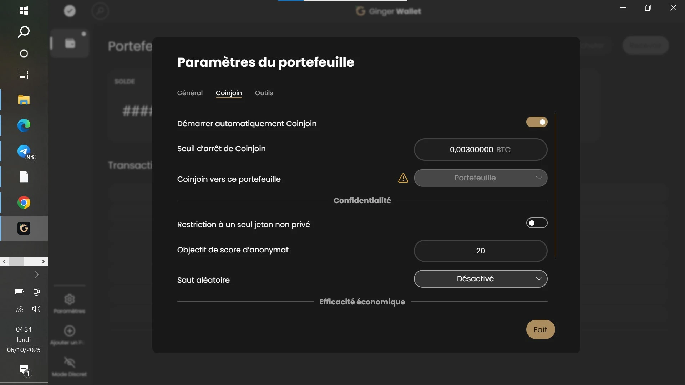

- **Outils** (où vous avez la possibilité de vérifier votre seedphrase, ou de synchroniser votre portefeuille à nouveau, ou encore de supprimer ce portefeuille). 

## Recevoir des bitcoins

Pour recevoir des bitcoins dans votre portefeuille sur Ginger Wallet:
- appuyez sur **Recevoir**;

- entrez le nom de votre à qui vous voulez envoyer l'adresse (cela permet de personnaliser votre adresse en fonction de l'expéditeur) ;

- cliquez sur la petite flèche à gauche de **Générer** pour choisir votre format d'adresse (**SegWit** /**Taproot**) , puis cliquez sur **Générer**, pour générer un adresse et un code QR.

Cette adresse ou ce code QR, sera utilisé par votre expéditeur pour vous envoyer des bitcoins.

## Envoyer des bitcoins

Vidéo tutoriel sur comment envoyer via Ginger Wallet.

[Vidéo](https://youtu.be/2nf5aAimfhg?si=pn9Rc05AjvpWWGGh)

Pour le faire :
- Appuyez sur le bouton **Envoyer** ;
- entrez l'adresse du récepteur, le montant à envoyer et le nom du récepteur ;
- vérifier l'aperçu de la transaction et confirmer pour valider l'envoi.  

## Dépenser des bitcoins

C'est très simple d'acheter et de vendre du Bitcoin avec Ginger Wallet. En seulement quelques étapes, vous pouvez dépenser vos bitcoins.
### Acheter des bitcoins

Les utilisateurs de Ginger Wallet peuvent acheter des bitcoins. 
1. Appuyez sur le bouton **Acheter**. Ce bouton reste visible même si le portefeuille est vide.

2. Sélectionnez votre pays, voire votre État (dans certaines régions comme le Canada) avant de procéder à un achat de bitcoins. En fait, lorsque vous cliquez sur la fonction **Acheter** pour la première fois, vous devrez également préciser votre région.

Appuyez sur **Continuer** pour progresser dans le processus d'achat.

3. Saisissez ensuite le montant de bitcoins que vous souhaitez acheter dans le champ dédié. Vous pouvez également choisir la devise de la transaction.

Chaque devise a une limite d'achat minimale et maximale. Par exemple, en USD, la limite maximale est de 30 000 $.

Si vous avez déjà effectué des achats, vous pouvez consulter l'historique de vos transactions en cliquant sur le bouton **Commandes précédentes**. La liste des transactions passées ainsi que leur statut s'afficheront.

4. Choisissez l'offre qui vous convient.
À ce stade, vous verrez une liste de toutes les offres disponibles.
 Pour chaque offre, vous avez :
 - le nom du fournisseur (1) ;
 - le nombre de bitcoins équivalent au montant précédemment saisi, le mode de paiement et les frais d'achat (2) ;
 - le bouton **Accepter** (3).

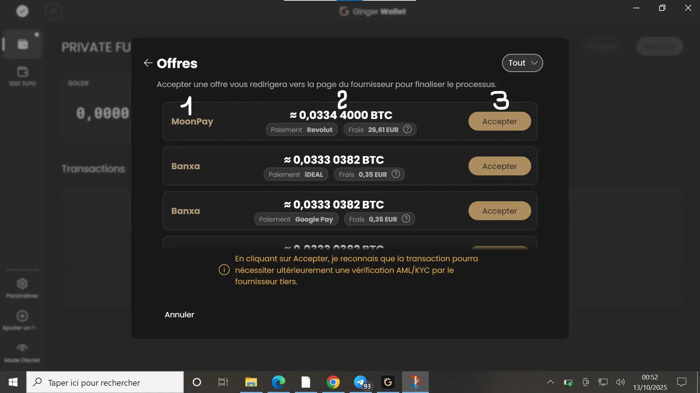

Les frais indiqués dans l'offre ne constituent pas un coût supplémentaire. Ils sont déjà inclus dans le montant total de l'offre.

Le coin supérieur droit de l'écran avec l'intitulé **Tout** vous permet de filtrer les offres par mode de paiement. Votre mode de paiement sélectionné sera défini par défaut, mais peut être modifié à tout moment.

Si vous trouvez une offre qui vous convient, cliquez sur le bouton **Accepter** pour procéder à l'achat. Vous serez ensuite redirigé vers la page du vendeur, où vous pourrez finaliser la transaction.

### Vendre des bitcoins

Les utilisateurs de Ginger Wallet peuvent vendre du Bitcoin. Le bouton **Vendre** n'est visible que lorsqu'il y a des fonds disponibles dans le portefeuille.

1. Cliquez sur **Vendre** (Sell en anglais).

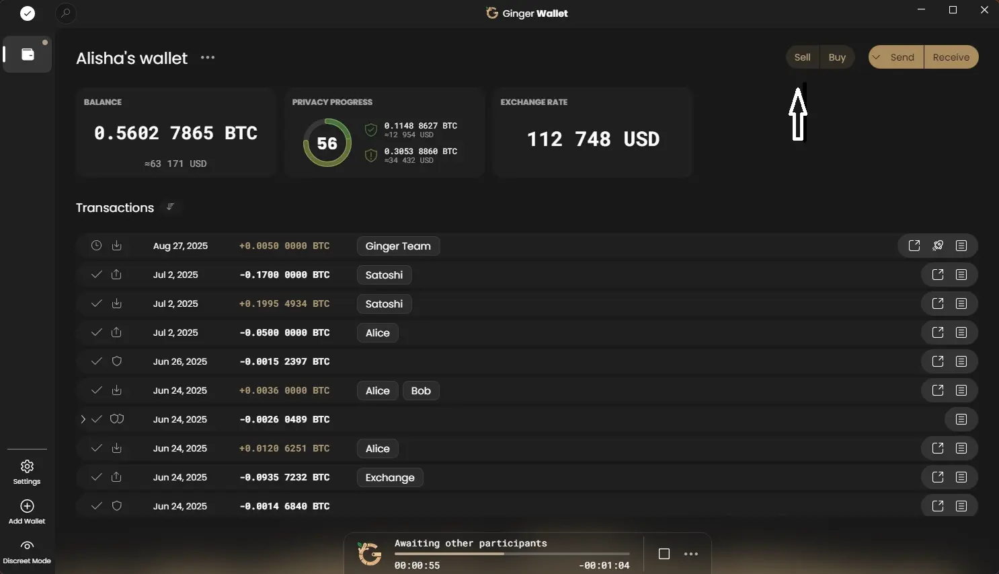

2. Tout comme avec l'option **Acheter**, lorsque vous utilisez la fonction Vendre pour la première fois, vous devez sélectionner votre pays avant de procéder à une vente de bitcoins.

3. Ensuite, vous devez saisir le montant de Bitcoins que vous souhaitez vendre. Vous pouvez saisir ce montant en BTC ou dans une monnaie fiduciaire comme le dollar américain (USD).

4. Une fois que vous aurez procédé, vous verrez une liste des offres disponibles. Choisissez donc une offre de vente qui vous convient, puis cliquez sur **Accepter** pour continuer.

5. Maintenant, vous devez finaliser la transaction.

- Après avoir accepté une offre, vous serez redirigé sur la page du fournisseur ;
- Suivez les instructions sur la page du fournisseur ;
- À un moment donné, vous recevrez une adresse de destinataire et le montant exact à envoyer ;
- Retournez ensuite dans Ginger Wallet pour continuer le processus ;
- Une fois de retour dans Ginger Wallet, une boîte de dialogue apparaîtra, vous permettant de continuer en cliquant sur **Envoyer**.

Cela ouvrira l'écran **Envoyer** avec l'adresse du destinataire et le montant préremplis.
Vous pouvez également utiliser le bouton **Envoyer** sur l'écran d'accueil. Bien que vous puissiez envoyer la transaction manuellement, nous vous recommandons de la terminer via la boîte de dialogue pour un processus optimisé.

## Faire un coinjoin sur Ginger Wallet

Vidéo tutoriel

[Vidéo](https://youtu.be/AJe67RDfB1A?si=urjdj894qWW3_-_K)

Protégez la confidentialité de vos bitcoins avec la fonctionnalité **Coinjoin**, intégrée directement dans Ginger Wallet. Le portefeuille utilise **WabiSabi**, un protocole de coinjoins chaumiens conçu pour faciliter des coinjoins plus accessibles et efficaces. 

Il vous revient de choisir la stratégie de coinjoin (automatique ou manuelle) qui vous convient. 

Ginger Coinjoin est prêt à l'emploi dès le téléchargement (aucune étape supplémentaire n'est nécessaire). En automatique, le coinjoin de Ginger s'exécute en arrière-plan pour protéger votre vie privée à chaque transaction. En réalité, le lecteur coinjoin apparaîtra chaque fois que vous aviez un solde pouvant être anonymisé.

Quant au démarrage du coinjoin en manuel, il se fait facilement (en un clic). Lancez la ronde et attendez que la transaction coinjoin soit construite et confirmée. Vous verrez le score d'anonymisation dans l’interface.
Plusieurs mélanges peuvent être effectués jusqu'à atteindre le niveau d'anonymat voulu. Vous avez aussi la possibilité d'exclure certaines pièces du mélange.

Par défaut, Ginger utilise son propre coordinateur avec tous les paramètres préconfigurés et des frais garantis. Les coinjoins de jetons d'une valeur supérieure à 0,03 BTC entraînent des frais de 0,3 % pour le coordinateur en plus des frais de minage. Les entrées de 0,03 BTC ou moins, ainsi que les remixes, sont exemptées de frais de coordinateur, même après une seule transaction. Par conséquent, un paiement effectué avec des fonds Coinjoin permet à la fois à l'expéditeur et au destinataire de remixer leurs coins sans encourir de frais de coordinateur.

 Ginger privilégie les coinjoins avec plus de participants plutôt que des tours plus petits et plus rapides. Les coinjoins plus grands offrent plus d'anonymat, des coûts plus bas et une meilleure efficacité de l'espace de bloc.

## Sécurité et bonnes pratiques 

Le désir de la décentralisation et celui de préserver de la confidentialité de sa vie privée nécessite l'application de plusieurs bonnes pratiques :

- Gardez toujours votre seedphrase dans un endroit sûr et hors ligne ;
- Si vous perdez votre téléphone ou soupçonnez un accès non autorisé, créez immédiatement un nouveau portefeuille ;
- Transférez vos actifs vers le nouveau portefeuille et supprimez l'ancien portefeuille ;
- Utilisez une adresse unique par réception pour éviter le ré-usage d’adresse ;
- Ne lancez que des téléchargements d'applications de portefeuilles… qu'à partir du compte GitHub officiel ou du site officiel ;
- Utilisez ces outils pour la confidentialité légitime, pas pour dissimuler des activités illicites. 

Maintenant, vous êtes familier avec l'utilisation de l'application Ginger Wallet pour envoyer, recevoir et dépenser vos bitcoins.

Si ce tutoriel vous a été utile, merci de me laisser un pouce vert ci-dessous. N'hésitez pas à diffuser cet article via vos plateformes de médias sociaux. Merci infiniment!

Je vous suggère également de consulter ce tutoriel sur comment utiliser l'application Liana sur ordinateur pour envoyer et recevoir des bitcoins, ainsi que de mettre en œuvre un plan de succession automatisé.

https://planb.network/tutorials/wallet/desktop/liana-306ef457-700c-4fdd-b07a-8fb7a8a29f04