Ginger Wallet är en Bitcoin-portfölj med öppen källkod som inte är frihetsberövande och som fokuserar på sekretess och integritet. Den började som Fork från Wasabi Wallet (efter version 2.0.7.2 - MIT-licens).

Ginger Wallet behåller Wasabis tekniska arkitektur och lägger till några specifika funktioner. Enligt [Ginger Wallet documentation] (https://docs.gingerwallet.io/why-ginger/difference.html#gingerwallet) betonar Wasabi **autonomi och kontroll**, medan Ginger fokuserar på **användarvänlighet, säkerhet och en förenklad upplevelse**, vilket gör den tillgänglig för dem som är mindre bekanta med tekniska aspekter.

Ginger Wallet är Wallet-programvara endast för datorer (ingen mobilapplikation).

## Vad är CoinJoin?

CoinJoin** är en särskild typ av Bitcoin-transaktionsstruktur som sammanför flera deltagare i en enda gemensam transaktion. Denna mekanism blandar olika användares poster i en gemensam transaktion, vilket gör det extremt svårt - för att inte säga ofta omöjligt om det görs på rätt sätt - att spåra medel. Som ett resultat blir det nästan omöjligt för en utomstående observatör att med säkerhet identifiera ursprunget och destinationen för de inblandade bitcoins, till skillnad från konventionella Bitcoin-transaktioner.

För dig som användare hjälper CoinJoin till att bevara din konfidentialitet. Om du till exempel får en donation på 10 000 Sats på en Bitcoin Address kan avsändaren spåra dessa medel och i vissa fall dra slutsatsen att du innehar en större mängd bitcoins eller observera dina aktiviteter. Genom att göra en CoinJoin efter denna donation på 10 000 Sats bryter du spårbarheten: avsändaren kommer inte längre att kunna härleda någon information om dig från denna betalning.

Chaumian CoinJoin erbjuder en hög säkerhetsnivå, eftersom pengarna alltid är under användarens exklusiva kontroll. Inte ens operatörerna av de samordnande servrarna kan under några omständigheter avleda deltagarnas bitcoins. Varken användare eller koordinatorer behöver lita på varandra: var och en behåller kontrollen över sina privata nycklar och är ensam behörig att validera transaktioner. Ingen tredje part kan därför tillägna sig dina bitcoins under en CoinJoin eller upprätta en direkt länk mellan dina inmatningar och utmatningar.

Om du vill lära dig mer om CoinJoin kan du kolla in Plan ₿ Academys BTC 204-kurs :

https://planb.network/courses/65c138b0-4161-4958-bbe3-c12916bc959c

## Installera ingefära Wallet

För att installera Ginger Wallet, besök webbplatsen [Ginger Wallet] (https://gingerwallet.io).

Tryck på **Download** för att ladda ner rätt version för din dator (Windows / MacOs / Linux).

Ett annat alternativ är att gå till projektets [GitHub] (https://github.com/GingerPrivacy/GingerWallet/releases) för att ladda ner den.

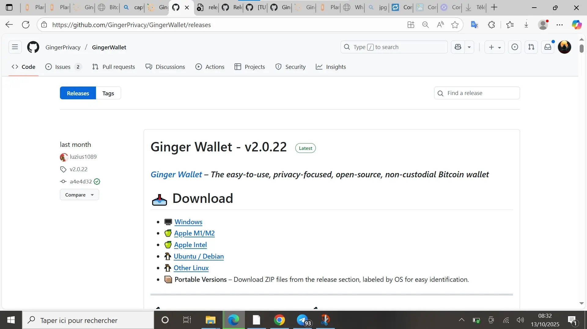

Kör sedan installationsprogrammet.

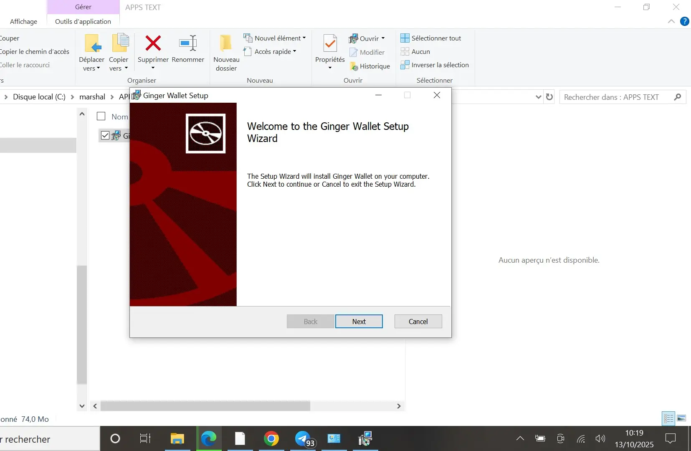

## Parameterinställningar

### Preliminära konfigurationer

Öppna Ginger Wallet och välj det språk du vill använda.

Redan från början påminner Ginger dig om de kostnader som är involverade i CoinJoin-processen.

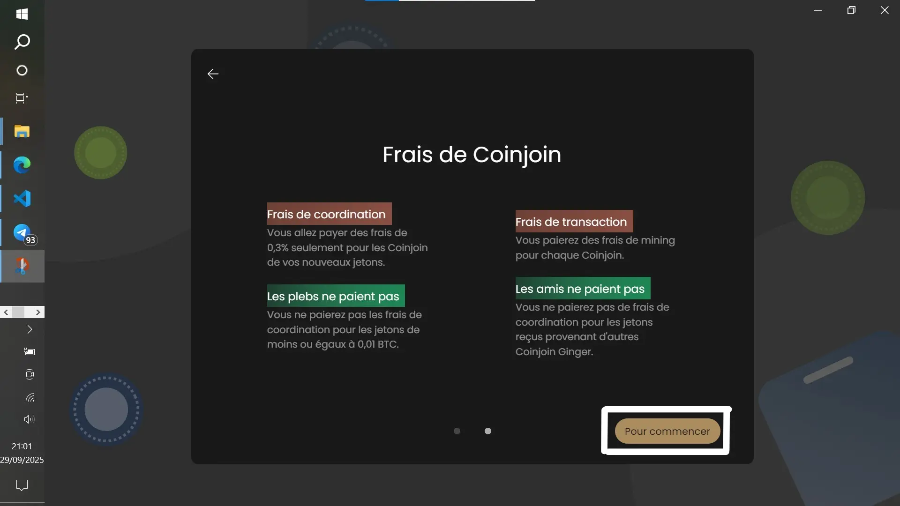

Tryck sedan på **Start** och sedan på **Ny** för att skapa en ny portfölj.

Spara och bekräfta sedan din seedphrase.

https://planb.network/tutorials/wallet/backup/backup-mnemonic-22c0ddfa-fb9f-4e3a-96f9-46e2a7954270

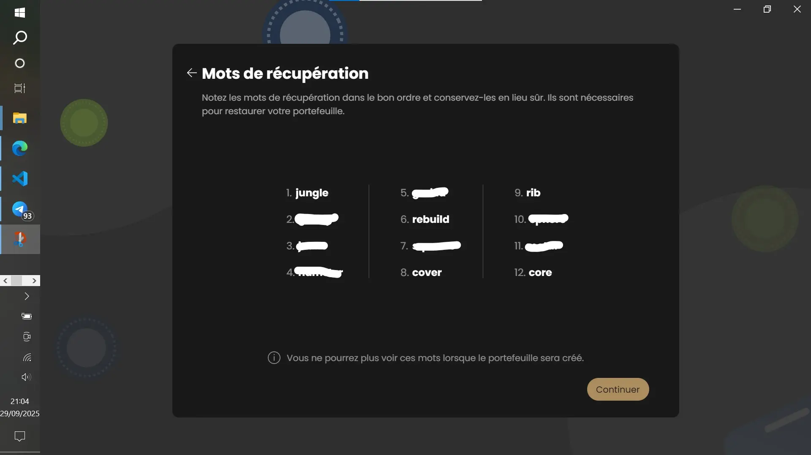

För ökad säkerhet ger Ginger Wallet dig möjlighet att lägga till en passphrase.

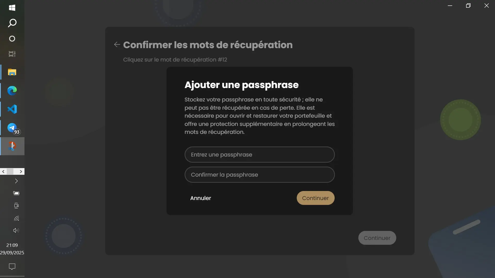

https://planb.network/tutorials/wallet/backup/passphrase-a26a0220-806c-44b4-af14-bafdeb1adce7

När denna passphrase har lagts till kommer den att begäras varje gång du försöker komma åt din portfölj.

Ginger aktiverar automatiskt standardinställningen **CoinJoin** när du skapar din portfölj. Du informeras om detta och kan sedan anpassa inställningen så att den passar dina behov.

### Allmänna inställningar

När du har skapat din första portfölj kommer du att tas till Gingers Interface Wallet.

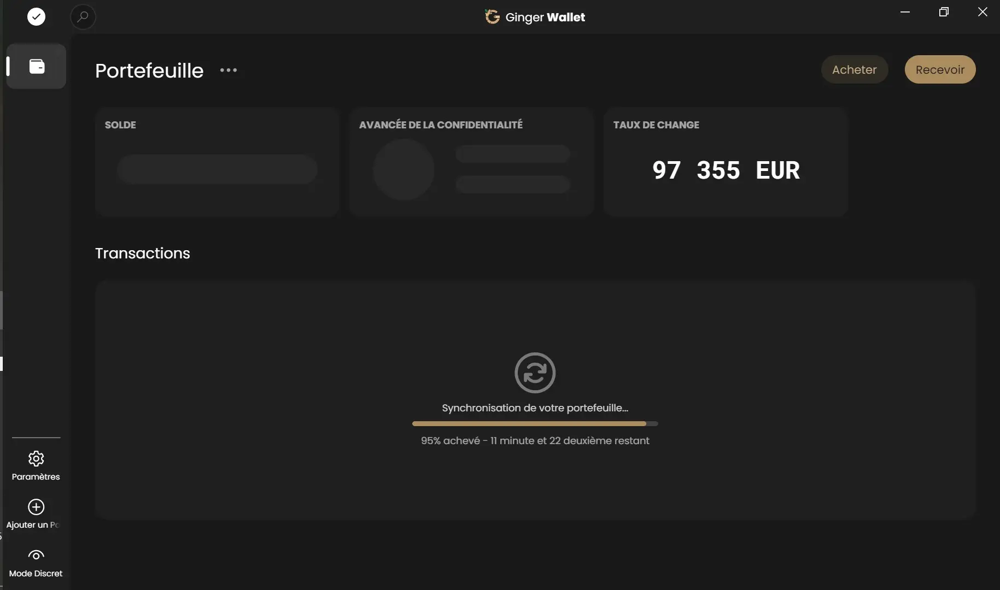

Aktivera **Diskret läge** om du vill dölja saldot i dina plånböcker.

Du kan skapa flera portföljer på Ginger Wallet. Klicka bara på **Lägg till en portfölj**.

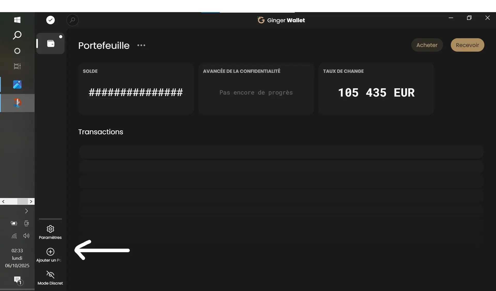

Ginger stöder användning av hårdvaruportföljer via Bitcoin core-standarden Interface, även om direkt integration från eller till en hårdvaruportfölj ännu inte är tillgänglig.

Kompatibla hårdvaruportföljer inkluderar (men är inte begränsade till) :

- BLOCKSTREAM Jade
- Kallkort MK4
- Coldcard Q
- Ledger Nano S Plus
- Ledger Nano X
- Trezor modell T
- Trezor Safe 3
- etc.

Klicka nu på **Inställningar**.

Dessa inställningar gäller för programmet i allmänhet och de konfigurationer du gör där kommer att gälla för alla portföljer.

I **Inställningar** har du flikarna :

- Allmänt**

- Utseende

På den här fliken kan du bland annat ändra språk, valuta och avgiftsvisningsenhet (BTC/Satoshi).

- Bitcoin**

På den här fliken kan du aktivera Bitcoin Knots så att den körs när programmet startar, välja nätverk (Main/RegTest) och leverantör av laddningshastighet (Mempool Space/BLOCKSTREAM info/Full node), etc.

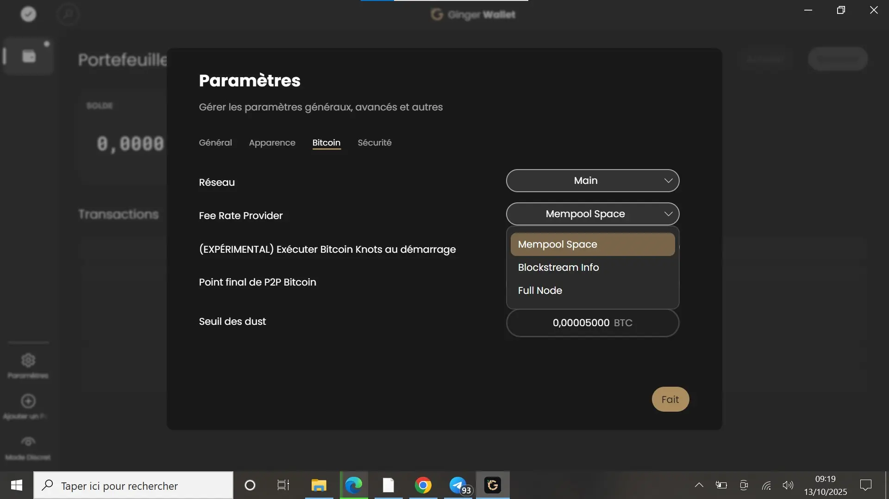

- Säkerhetsdetaljer**

På fliken Säkerhet kan du aktivera tvåfaktorsautentisering, aktivera eller avaktivera Tor och till och med inaktivera det när Ginger-programmet stängs.

**NB** :

- För tvåfaktorsautentisering, se till att din autentiseringsapplikation stöder SHA256-protokollet och 8-siffriga koder. Ginger Wallet kräver en 8-siffrig 2FA-kod för ökad säkerhet. Detta längre format gör koden mycket svårare att gissa eller kompromissa med, vilket ger ett bättre skydd mot obehörig åtkomst.
- Som standard passerar all Ginger-nätverkstrafik genom Tor, vilket eliminerar behovet av manuell konfiguration. Om Tor redan är aktivt på ditt system kommer Ginger automatiskt att prioritera det.

Men när du har avaktiverat Tor i inställningarna förblir din integritet i allmänhet bevarad, utom i två situationer:

- under en CoinJoin kan koordinatorn länka dina in- och utgångar till din IP Address;
- när du sänder en transaktion kan en illasinnad nod som du ansluter till associera din transaktion med din IP.

Glöm inte att trycka på **Done** (i nedre högra hörnet Coin) varje gång för att spara dina inställningar. Vissa inställningar kräver att Ginger Wallet startas om för att träda i kraft.

Dessutom kan du via sökfältet högst upp i portföljerna söka efter och få tillgång till alla parametrar etc.

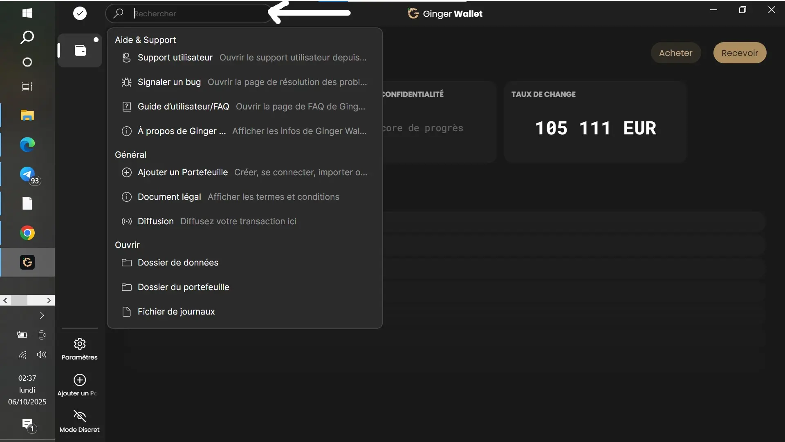

### Konfiguration av portföljen

Det går att skapa flera portföljer i programmet, så att varje portfölj kan konfigureras efter dina behov. Klicka på **tre prickar** framför portföljnamnet och sedan på **Portföljinställningar**.

Som du kan se kommer du, förutom Wallet-parametern, att kunna se dina UTXO:er (lista över tokens du äger), statistik och Wallet-information (den utökade offentliga nyckeln, till exempel).

För att återgå till vår portföljkonfiguration, när du klickar på portföljparametrar, kommer du till följande flikar:

- Allmänt** (där du kan ändra portföljens namn) ;

- CoinJoin** (där du kan anpassa den här portföljens CoinJoin-inställningar) ;

- Verktyg** (där du kan kontrollera din seedphrase, synkronisera din portfölj igen eller ta bort den).

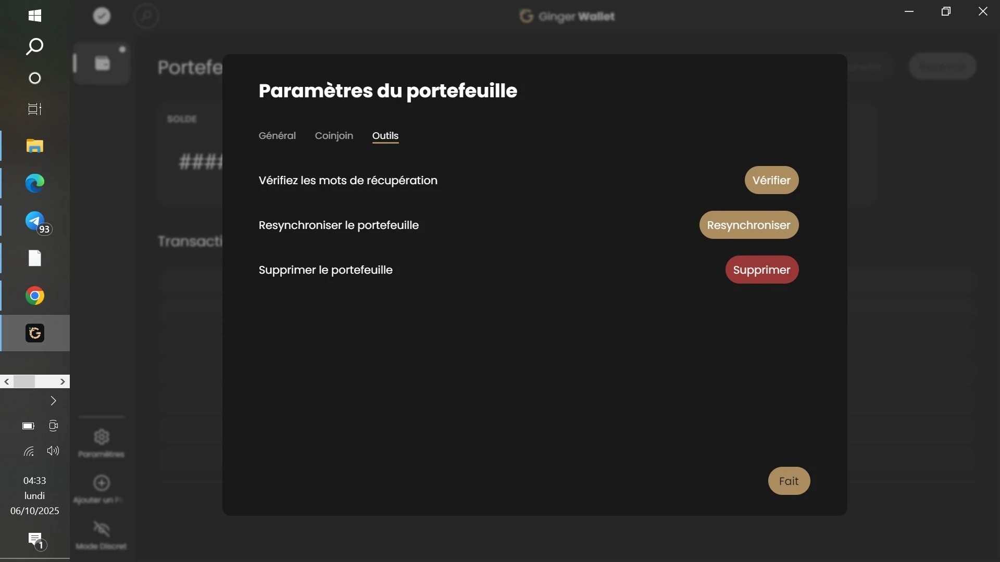

## Ta emot bitcoins

För att ta emot bitcoins i din Wallet på Ginger Wallet :

- tryck på **Mottagning** ;

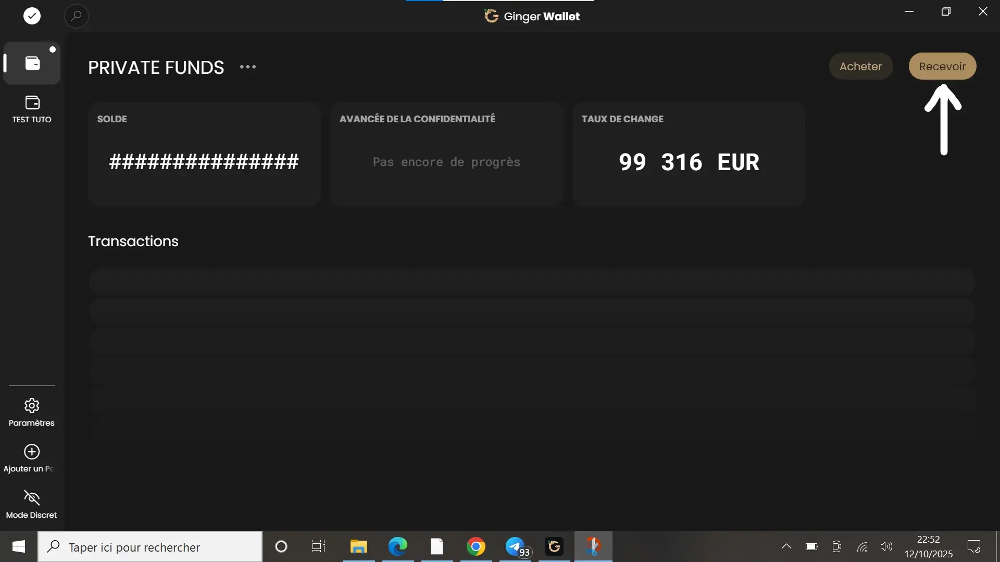

- Ange namnet på den källa som du vill koppla Address till. Detta är en märkning för att hålla reda på dina betalningar. Detta har inga On-Chain-implikationer; det är helt enkelt spårbarhetsinformation som lagras lokalt i din applikation;

https://planb.network/tutorials/privacy/on-chain/utxo-labelling-d997f80f-8a96-45b5-8a4e-a3e1b7788c52

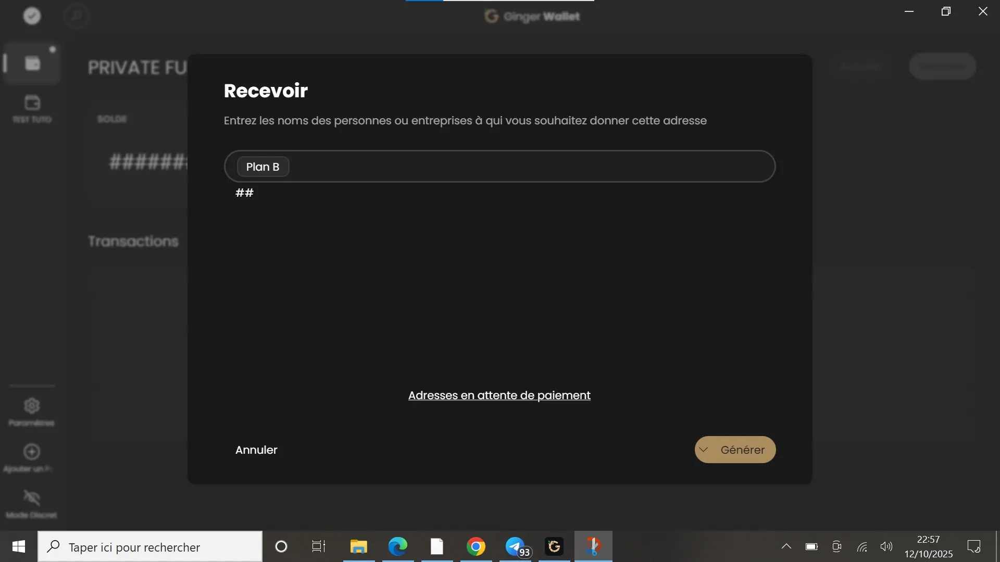

- klicka på den lilla pilen till vänster om **generate** för att välja ditt Address-format (**SegWit** /**Taproot**), klicka sedan på **generate**, till generate en Address och QR-kod.

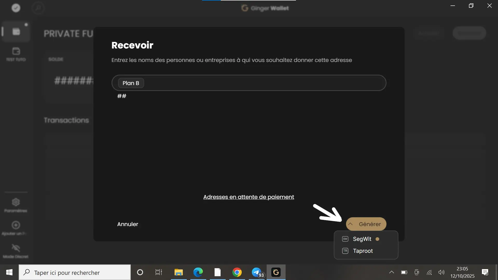

Denna Address eller QR-kod kommer att användas av din avsändare för att skicka bitcoins till dig.

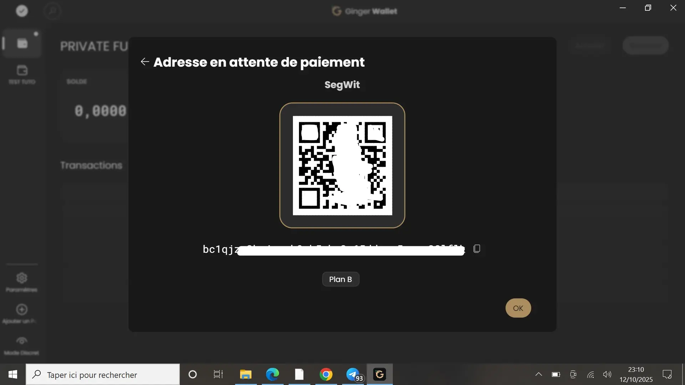

## Skicka bitcoins

Videohandledning om hur man skickar via Ginger Wallet.

För att göra detta :

- Tryck på knappen **Sänd**;
- ange mottagarens Address, det belopp som ska skickas och en etikett;
- kontrollera transaktionsöversikten och bekräfta att du vill skicka.

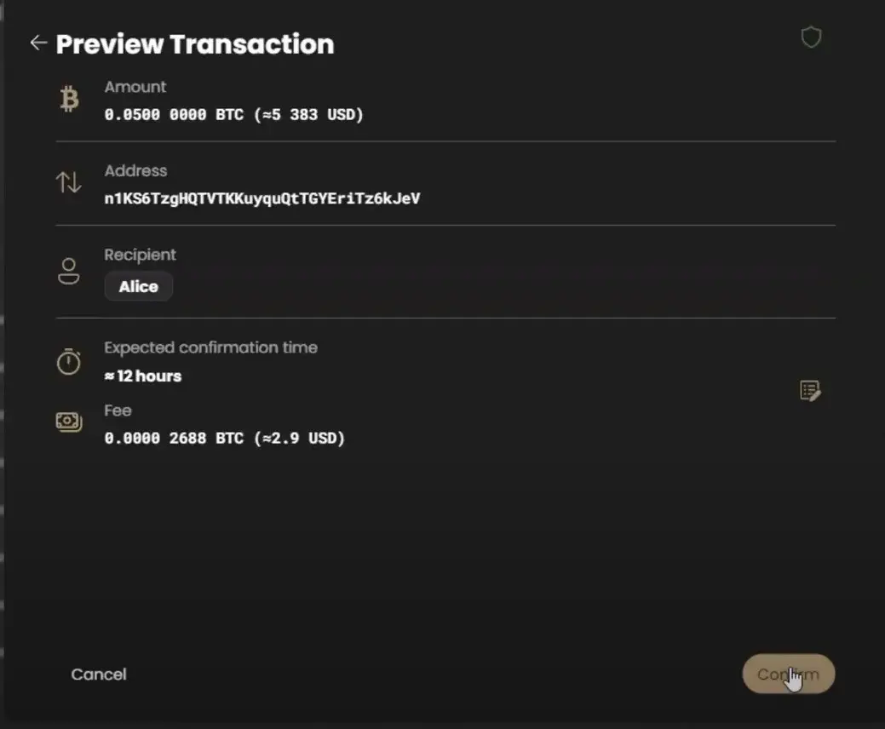

## Spendera bitcoins

Det är enkelt att köpa och sälja Bitcoin med Ginger Wallet. I bara några steg kan du spendera dina bitcoins.

### Köpa bitcoins

Ginger Wallet-användare kan köpa bitcoins.

- Tryck på knappen **Köp**. Denna knapp förblir synlig även om Wallet är tom.

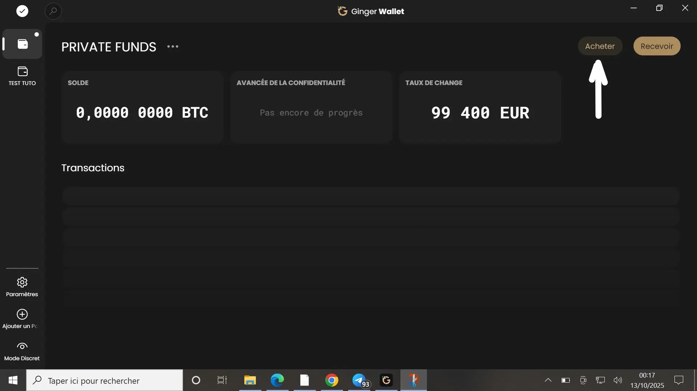

- Välj ditt land eller till och med din stat (i vissa regioner, till exempel Kanada) innan du fortsätter med ett Bitcoin-köp. När du klickar på funktionen **Köp** för första gången måste du faktiskt också ange din region.

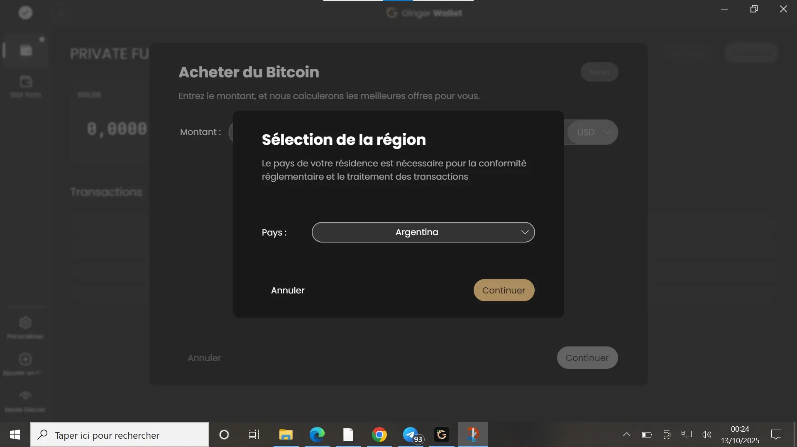

Tryck på **Continue** för att gå vidare i inköpsprocessen.

- Ange sedan det antal bitcoins du vill köpa i det dedikerade fältet. Du kan också välja transaktionsvaluta.

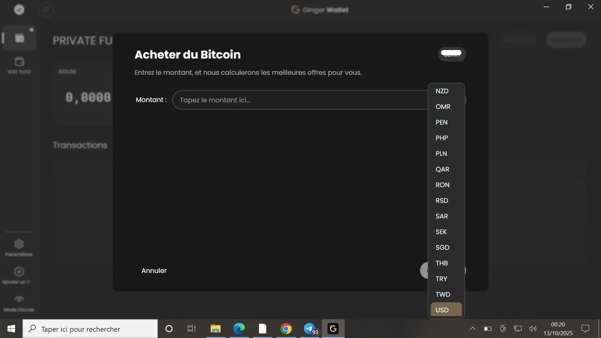

Varje valuta har en lägsta och högsta köpgräns. I USD är t.ex. den högsta gränsen 30 000 USD.

Om du redan har gjort ett köp kan du se din transaktionshistorik genom att klicka på knappen **Tidigare beställningar**. En lista över tidigare transaktioner och deras status visas.

- Välj det erbjudande som passar dig bäst.

Nu ser du en lista över alla tillgängliga erbjudanden. För varje erbjudande har du :

 - leverantörens namn (1) ;
 - antalet bitcoins som motsvarar det belopp som tidigare angetts, betalningsmetod och inköpsavgift (2) ;
 - knappen **Accept** (3).

De avgifter som anges i erbjudandet utgör inte en extra kostnad. De ingår redan i det totala beloppet för erbjudandet.

I Coin längst upp till höger på skärmen med etiketten **All** kan du filtrera erbjudanden efter betalningsmetod. Din valda betalningsmetod kommer att anges som standard, men kan ändras när som helst.

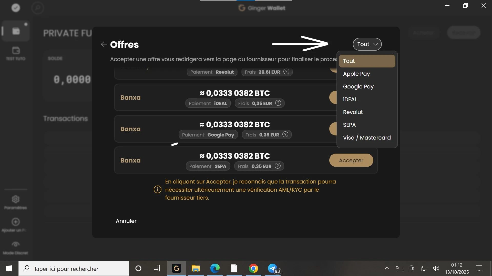

Om du hittar ett lämpligt erbjudande klickar du på knappen **Accept** för att gå vidare med köpet. Du kommer då att omdirigeras till säljarens sida, där du kan slutföra transaktionen.

### Sälja bitcoins

Ginger Wallet-användare kan sälja Bitcoin. Knappen **Sälj** är endast synlig när det finns tillgängliga medel i portföljen.

- Klicka på **Sälj**.

- Precis som med alternativet **Buy** måste du, när du använder säljfunktionen för första gången, välja ditt land innan du fortsätter med en Bitcoin-försäljning.

- Därefter måste du ange hur många Bitcoins du vill sälja. Du kan ange beloppet i BTC eller i en fiatvaluta som t.ex. US-dollar (USD).

- När du har gjort detta ser du en lista över tillgängliga erbjudanden. Välj ett erbjudande som passar dig och klicka sedan på **Acceptera** för att fortsätta.

- Nu måste du slutföra transaktionen:
 - När du har accepterat ett erbjudande kommer du att omdirigeras till leverantörens sida;
 - Följ anvisningarna på leverantörssidan ;
 - Vid något tillfälle kommer du att få en mottagare Address och det exakta beloppet att skicka;
 - Återgå sedan till Ginger Wallet för att fortsätta processen;
 - När du är tillbaka i Ginger Wallet visas en dialogruta där du kan fortsätta genom att klicka på **Send**.

Detta öppnar skärmen **Sänd** med mottagarens Address och belopp förifyllda. Du kan också använda knappen **Sänd** på startskärmen. Även om du kan skicka transaktionen manuellt, rekommenderar vi att du slutför den via dialogrutan för en optimerad process.

## Gör en CoinJoin på Ginger Wallet

Skydda sekretessen för dina bitcoins med **CoinJoin**, som är integrerat direkt i Ginger Wallet. Wallet använder **WABISABI**, ett Chaumian CoinJoin-protokoll som är utformat för att underlätta mer tillgängliga och effektiva coinjoins.

Det är upp till dig att välja den CoinJoin-strategi (automatisk eller manuell) som passar dig bäst.

Ginger CoinJoin är redo att användas så snart du laddar ner den (inga ytterligare steg krävs). Ginger CoinJoin körs automatiskt i bakgrunden för att skydda din integritet vid varje transaktion. I praktiken kommer CoinJoin-läsaren att visas när du har ett saldo som kan anonymiseras.

När det gäller manuell uppstart av CoinJoin är det en operation med ett klick. Starta rundan och vänta på att CoinJoin-transaktionen ska byggas och bekräftas. Du kommer att se anonymiseringspoängen i Interface.

Flera mixar kan utföras tills önskad nivå av anonymitet har uppnåtts. Du kan också utesluta vissa delar från mixen.

Som standard använder Ginger sin egen koordinator med alla förkonfigurerade parametrar och garanterade avgifter. Coinjoins av tokens värda mer än 0,03 BTC medför en koordinatoravgift på 0,3% utöver Mining-avgiften. Registreringar på 0,03 BTC eller mindre, liksom remixer, är undantagna från koordinatoravgifter, även efter en enda transaktion. En betalning som görs med CoinJoin-medel gör det därför möjligt för både avsändare och mottagare att remixa sina mynt utan att ådra sig koordinatoravgifter.

Ginger föredrar coinjoins med fler deltagare framför mindre, snabbare rundor. Större coinjoins erbjuder mer anonymitet, lägre kostnader och större effektivitet i BLOCK-utrymmet.

## Säkerhet och bästa praxis

Önskemålet om decentralisering och bevarandet av den personliga integriteten kräver att flera bästa metoder används:

- Förvara alltid din seedphrase på en säker plats utanför nätet;
- Om du förlorar din dator eller misstänker obehörig åtkomst, skapa en ny Wallet omedelbart. Överför dina medel till den nya portföljen och radera den gamla;
- Använd en annan Address för varje mottagning för att undvika återanvändning av adresser;
- Ladda alltid ner dina portföljapplikationer uteslutande från det officiella GitHub-kontot eller den officiella webbplatsen.

Nu är du bekant med att använda Ginger Wallet-applikationen för att skicka, ta emot och spendera dina bitcoins.

Om du tyckte att den här handledningen var användbar, vänligen lämna mig en Green tumme nedan. Du är välkommen att dela den här artikeln via dina sociala medieplattformar. Tack så mycket!

Jag föreslår också att du kollar in den här handledningen om hur du använder datorprogrammet Liana för att skicka och ta emot bitcoins samt implementera en automatiserad fastighetsplan.

https://planb.network/tutorials/wallet/desktop/liana-306ef457-700c-4fdd-b07a-8fb7a8a29f04