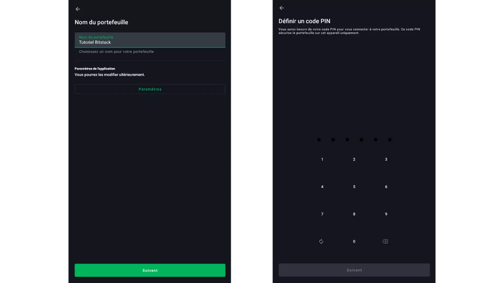
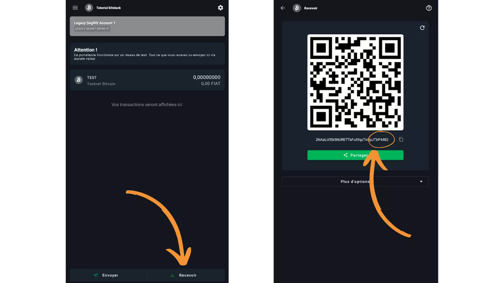
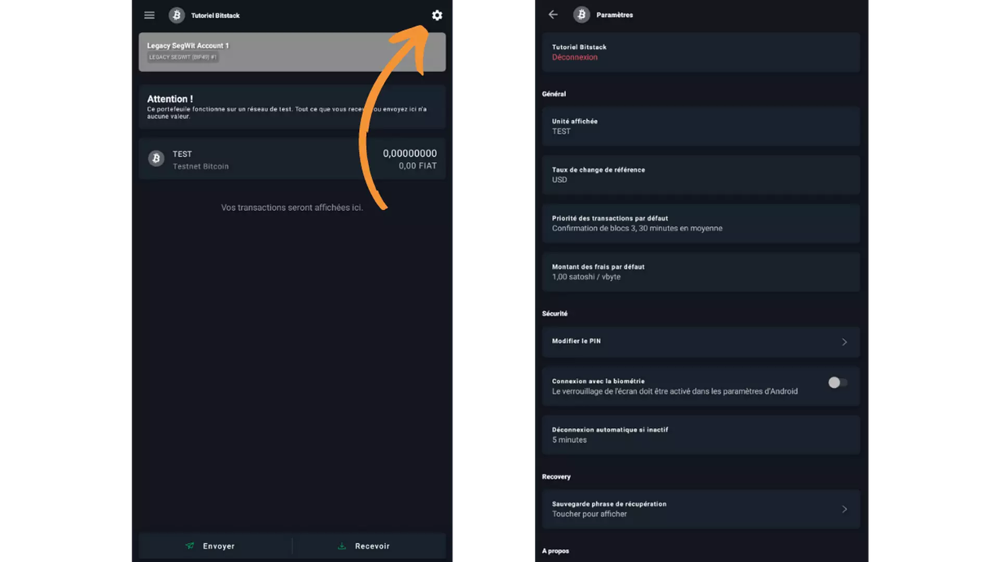

Portafoglio mobile caldo - Principiante - Gratuito - Per proteggere da 0 a 1.000 €

Per proteggere importi inferiori a 1.000 €, un portafoglio caldo (connesso a Internet) gratuito è perfetto per iniziare. La configurazione è facile e l'interfaccia è progettata per i principianti.

Se vuoi dare un'occhiata al loro sito, è proprio qui (https://blockstream.com/green/)!

## Tutorial video

## Tutorial scritto

> Questa guida è stata prodotta e appartiene a Bitstack. Bitstack è una banca bitcoin neo basata a Parigi che consente di DCA su bitcoin. Guida scritta da Loic Morel il 15/02/2023. Questo appartiene a loro. https://www.bitstack-app.com/blog/installer-portefeuille-bitcoin-green-wallet

Come installare il tuo primo portafoglio Bitcoin? Tutorial Green Wallet

Se desideri beneficiare dei numerosi vantaggi del sistema Bitcoin, tra cui l'incensurabilità e l'inalienabilità dei tuoi fondi, devi conservare tu stesso le chiavi che danno accesso ai tuoi bitcoin.

In questo tutorial, ti spiegherò come configurare il tuo primo portafoglio con Green Wallet. Questo software è particolarmente adatto per gli utenti principianti. È molto semplice da usare, anche se non hai conoscenze avanzate su Bitcoin.

Green Wallet è disponibile su tutti i tipi di dispositivi. In questo tutorial, vedremo come usarlo su un dispositivo mobile, ma puoi anche scaricarlo su un computer.

Il primo passo è ovviamente scaricare il software o l'app Green Wallet. Se sei su un dispositivo mobile, puoi semplicemente scaricarlo dal tuo store. Assicurati di essere sulla pagina di download dell'app ufficiale. Ecco le pagine in base al tuo sistema:

> - Google Play Store
>
> - Apple App Store

Se stai scaricando il software su un computer, ti consiglio vivamente di verificare l'autenticità e l'integrità del binario prima di installarlo sulla tua macchina. Ti spiegherò come fare questa operazione in un prossimo tutorial.

## Scelta delle impostazioni dell'applicazione

All'avvio dell'applicazione, arrivi alla schermata iniziale. Al momento, non hai ancora un portafoglio. In seguito, se hai creato più portafogli, potrai trovarli qui.

La prima azione da compiere, prima di creare il tuo portafoglio, è aprire le impostazioni dell'applicazione per scegliere quelle che ti si addicono meglio.

- "Enhanced Privacy" ti consente di disabilitare la possibilità di fare screenshot nell'applicazione. Questa opzione nasconderà anche le anteprime e proteggerà automaticamente l'applicazione quando blocchi il tuo telefono. È disponibile solo su Android;
- Successivamente, puoi scegliere di instradare il tuo traffico tramite Tor in modo che tutte le tue connessioni siano crittografate. Questo rallenta leggermente il funzionamento dell'applicazione, ma ti consiglio di attivarlo per preservare la tua privacy;

- L'opzione "Testnet" ti consente di creare portafogli su Testnet. È una rete che funziona esattamente come il sistema Bitcoin, con la differenza che i bitcoin scambiati non hanno alcun valore. Questa rete Testnet separata è utilizzata da utenti o sviluppatori che desiderano testare applicazioni senza rischi finanziari. Se desideri utilizzare Green Wallet sul vero sistema Bitcoin, puoi lasciare questa opzione deselezionata;

- L'opzione "Aiuta Green" ti consente di inviare informazioni riservate a Blockstream per migliorare la loro applicazione;

- L'opzione "Server Electrum personale" ti consente di connettere il tuo nodo Bitcoin remoto per ottenere informazioni sulla rete e diffondere le tue transazioni;

- L'opzione "Verifica SPV" ti consente di scaricare e verificare autonomamente alcune informazioni sulla Blockchain. Questo riduce la necessità di fidarsi del nodo di Blockstream. Attenzione, questa opzione non offre tutte le garanzie di un vero nodo Bitcoin, ma se non ne hai uno, può essere una buona opzione da attivare.

Una volta scelti i tuoi parametri, puoi fare clic sul pulsante "Salva" e riavviare l'applicazione.

## Creazione di un portafoglio Bitcoin

Il prossimo passo è creare il tuo portafoglio Bitcoin. Per farlo, fai clic su:

> - Aggiungi un portafoglio;
> - Nuovo portafoglio;
> - Bitcoin.

L'opzione "Ripristina un portafoglio" ti consente di recuperare l'accesso a un portafoglio già esistente utilizzando la sua frase mnemonica. L'opzione "Portafoglio solo visualizzazione" ti consente di importare una chiave pubblica estesa (xpub) per visualizzare i movimenti di un portafoglio senza poter spendere i fondi.

> "Il portafoglio solo visualizzazione è particolarmente utile se possiedi un hardware wallet. Puoi importare l'xpub sul tuo telefono per creare indirizzi di ricezione e monitorare il saldo del portafoglio ospitato sull'hardware wallet."
> Le opzioni di rete ti consentono di connettere il tuo portafoglio a diversi sistemi. La rete "Liquid" è una sidechain di Bitcoin. La rete "Testnet" è una copia della rete Bitcoin, ma con bitcoin che non hanno alcun valore. Infine, la rete "Testnet Liquid" è l'equivalente del Testnet per la sidechain Liquid. In questo tutorial, vogliamo semplicemente creare un portafoglio Bitcoin, quindi selezioniamo la rete "Bitcoin".

Successivamente, ti verrà chiesto che tipo di portafoglio desideri creare. Il più semplice è creare un portafoglio "Single Sig". In questo caso, ogni UTXO (pezzo di bitcoin) di nostra proprietà sarà bloccato solo da una singola coppia di chiavi.

Seleziona "Firma singola".

Successivamente, puoi scegliere se avere una frase mnemonica di 12 o 24 parole. È questa frase che ti permetterà di recuperare l'accesso al tuo portafoglio da qualsiasi software compatibile in caso di smarrimento, furto o rottura del tuo telefono.

Una frase di 24 parole è più sicura di una frase di 12 parole contro gli attacchi di forza bruta. Tuttavia, al momento, una frase di 12 parole è ancora sufficientemente sicura. Concretamente, se scegli una frase di 12 parole, sarai appena sopra il limite minimo consigliato dal NIST. Ciò significa che la tua frase è sicura oggi, ma potrebbe non esserlo più negli anni a venire a causa dell'evoluzione dell'informatica (a meno che tu non utilizzi anche una passphrase BIP39). Di default, ti consiglio di scegliere una frase di 24 parole, ma spetta a te fare la tua scelta.

Successivamente, il software ti fornirà la tua frase di recupero. Devi salvarla adeguatamente annotandola su un supporto fisico adatto. È fortemente sconsigliato conservare questa frase su qualsiasi supporto digitale, anche crittografato. Devi annotarla su carta o su metallo a seconda del valore conservato.

Questa frase è di importanza capitale, poiché permette di accedere alle chiavi del tuo portafoglio senza alcuna restrizione. In caso di smarrimento, non potrai più accedere ai tuoi bitcoin se il tuo telefono non funziona più. In caso di furto di questa frase mnemonica, un attaccante potrà irrevocabilmente rubarti tutti i tuoi fondi.

Le parole di questa frase devono assolutamente essere annotate insieme. Non dividere la tua frase! Inoltre, è anche essenziale annotare ogni parola nell'ordine definito, con il suo numero. Una frase fuori ordine è inutile.

Per saperne di più sulle metodologie di sicurezza della frase di recupero, ti consiglio vivamente di leggere il mio articolo dedicato a questo argomento.

Green Wallet ti chiede quindi di confermare alcune parole della tua frase per assicurarsi che le hai annotate correttamente.

Successivamente, puoi scegliere un nome per il tuo portafoglio in modo da distinguerlo dagli altri se in seguito ne crei più di uno. In questa fase, il nome ha poco importanza poiché elimineremo questo portafoglio per verificare la validità della frase mnemonica nel passaggio successivo.

Ti verrà anche chiesto di impostare un PIN. Serve a bloccare l'accesso al tuo portafoglio. È consigliabile impostare una password complessa e casuale, soprattutto per proteggere il tuo portafoglio nel caso in cui il tuo telefono venga rubato.

Questo PIN non ha nulla a che fare con il portafoglio Bitcoin stesso. Infatti, solo con la frase di recupero potrai recuperare l'accesso a tutti i tuoi bitcoin. Il PIN serve solo a bloccare l'accesso al tuo portafoglio sul tuo telefono. Il backup della frase è quindi molto più importante del backup di questo PIN.

Successivamente, potrai aggiungere un'opzione di blocco tramite biometria per evitare di inserire il PIN ad ogni utilizzo. In generale, la biometria è molto meno sicura del PIN stesso. Pertanto, di default, ti sconsiglio di attivare questa opzione di sblocco.

Dovrai inserire il PIN scelto una seconda volta nell'applicazione Green per confermarlo.

Congratulazioni! Hai completato la creazione del tuo portafoglio Bitcoin.

Se desideri aggiungere una passphrase BIP39 a questo portafoglio Bitcoin, devi fare clic sui tre punti in alto a destra dello schermo quando inserisci il tuo PIN per sbloccare il portafoglio. Attenzione, ti sconsiglio vivamente di utilizzare una passphrase se non comprendi i meccanismi di derivazione coinvolti. Potresti perdere l'accesso ai tuoi bitcoin.

## Simulazione del recupero del tuo portafoglio Bitcoin

Prima di inviare bitcoin al tuo nuovo portafoglio, è essenziale effettuare un test di recupero per assicurarti che il backup della frase mnemonica funzioni correttamente. Concretamente, elimineremo il portafoglio mentre è ancora vuoto e cercheremo di recuperarlo solo utilizzando la frase di recupero, come se avessimo perso l'accesso al nostro telefono.

Oltre a verificare la validità della frase, questa pratica ti permette anche di esercitarti nel recupero di un portafoglio Bitcoin. Pertanto, se un giorno ti trovi di fronte a una situazione di emergenza, saprai esattamente quali sono i passaggi da seguire per recuperare l'accesso ai tuoi fondi.

Per fare ciò, prima di eliminare il tuo portafoglio, devi recuperare un'informazione di riferimento che ti permetta di riconoscerlo successivamente. Quindi, dovrai copiare gli ultimi 8 caratteri del primo indirizzo proposto.
Per accedere a queste informazioni, clicca sul pulsante "Ricevi". Il portafoglio ti mostrerà un indirizzo. Annota gli ultimi 8 caratteri su un altro pezzo di carta. Questo corrisponde al checksum dell'indirizzo.
Ad esempio, nel mio portafoglio, gli ultimi 8 caratteri da annotare sarebbero: JTbP4482.

Una volta che hai annotato queste informazioni, puoi eliminare il tuo portafoglio. Dalla schermata principale del portafoglio, clicca sull'icona delle impostazioni, poi su "Disconnetti".

> "Ricordo ancora una volta che questa operazione deve essere effettuata con un portafoglio ancora vuoto, prima di aver inviato bitcoin. Altrimenti, rischi di perderli."

Verrai quindi reindirizzato alla schermata di sblocco del tuo portafoglio. Clicca sui tre puntini in alto a destra dello schermo, poi su "Elimina portafoglio" e conferma.

Ora ti trovi nella schermata principale dell'app Green Wallet e non ci sono più portafogli disponibili. Attualmente ti trovi nella stessa situazione in cui ti troveresti se avessi perso o rotto il tuo telefono e stessi cercando di recuperare il tuo portafoglio solo dalla frase mnemonica.

Ora devi cliccare su "Aggiungi portafoglio", poi su "Ripristina portafoglio" e infine su "Bitcoin".

Il software ci chiederà se vogliamo recuperare tramite un codice QR o tramite una frase mnemonica. Nel nostro caso, è una frase.

Successivamente, ci viene chiesto di inserire la frase di ripristino. È quella che abbiamo annotato durante la creazione del portafoglio. Se stai usando una frase di 24 parole, assicurati di cliccare sulla casella "24".

Una volta inserite tutte le parole, se il software ti segnala un errore, significa che il checksum della tua frase non è corretto. In questo caso, significa che il backup cartaceo della tua frase mnemonica non è valido. Devi quindi ripetere questo tutorial dall'inizio e assicurarti di scrivere correttamente la frase quando ti viene fornita.

Altrimenti, puoi cliccare su "Continua".

Il software ti indicherà "Portafoglio non trovato". Questo è del tutto normale poiché, al momento, non abbiamo ancora inviato bitcoin. Pertanto, non può rilevare alcuna transazione sulla blockchain associata a questo portafoglio.

Clicca in basso sullo schermo su "Ripristino manuale", poi su "Firma unica".

Infine, ti verrà chiesto di dare un nome a questo portafoglio e di assegnargli un PIN. Puoi dargli lo stesso nome e lo stesso PIN del portafoglio iniziale.
Per ricordare, questo PIN ha solo la funzione di sbloccare il portafoglio su questa applicazione e su questo telefono specifico. A differenza della frase di recupero, non consente di rigenerare il tuo portafoglio su un altro software o hardware.

Una volta confermato il PIN, torni alla schermata principale del tuo portafoglio. È ora di verificare se la tua frase di recupero funziona correttamente osservando il primo indirizzo derivato. Per farlo, ancora una volta, clicca su "Ricevi" per accedere al primo indirizzo.

Se gli ultimi 8 caratteri sono esattamente gli stessi che hai annotato come testimoni sulla tua carta prima di eliminare il portafoglio, allora la tua frase è valida. Nel mio caso, si può vedere che il checksum del mio primo indirizzo corrisponde al valore annotato in precedenza: JTbP4482.

So che questa pratica di verifica è noiosa, ma è assolutamente essenziale per garantire la sicurezza del tuo portafoglio Bitcoin. Ti consiglio vivamente di adottare questa abitudine quando crei un portafoglio, sia su un software che su un hardware.

Con Green Wallet, ho utilizzato il primo indirizzo per completare questo processo. Tuttavia, puoi anche prendere come riferimento una chiave pubblica estesa (xpub/zpub) o l'impronta digitale della chiave privata principale (master fingerprint).

## Utilizzo del portafoglio Bitcoin Green Wallet

Una volta che il tuo portafoglio è stato configurato e verificato, puoi iniziare a usarlo.

Per iniziare nel modo giusto, ti consiglio di personalizzare le impostazioni del tuo portafoglio. Per farlo, clicca sull'icona delle impostazioni in alto a destra dello schermo.

- L'opzione "Unità visualizzata" ti permette di personalizzare l'unità utilizzata nel tuo portafoglio. Se hai pochi fondi, potrebbe essere utile visualizzare il tuo portafoglio in satoshi invece che in bitcoin. Il satoshi (sat) corrisponde a cento milionesimi di un bitcoin: 1 BTC = 100.000.000 sat.

- L'opzione "Importo predefinito delle commissioni" ti permette di personalizzare le commissioni assegnate alle tue transazioni per impostazione predefinita. Più alte sono le commissioni per vbyte (byte virtuale), più rapide saranno le tue transazioni confermate. Successivamente, potrai modificare questo tasso di commissioni per ogni transazione in base alla congestione della rete Bitcoin.

- L'opzione "Connessione con la biometria" ti permette di sbloccare il tuo portafoglio con l'impronta digitale anziché con il PIN. In generale, sconsiglio di attivare questa opzione. La biometria è molto meno sicura rispetto al codice PIN.

Di default, Green Wallet ti assegna un account BIP49 "Nested SegWit" con indirizzi P2SH (Pay to Script Hash). Alcuni anni fa, l'uso di questo tipo di account era pertinente poiché non tutti supportavano ancora gli indirizzi SegWit nativi. Oggi, la grande maggioranza dei servizi legati a Bitcoin supporta SegWit, quindi non c'è più alcuna ragione per utilizzare un account "Nested SegWit".

Creeremo quindi un nuovo account BIP84 "Native SegWit" per beneficiare di tutti i suoi vantaggi e anche per avere indirizzi P2WPKH (Pay to Witness Public Key Hash). Per farlo, clicca sul tuo account "Legacy SegWit Account", poi su "Aggiungi un nuovo account" e infine su "Account SegWit". Puoi poi dare un nome a questo account se lo desideri.

In seguito, se hai bisogno di creare nuovi account su questo portafoglio, ti consiglio di scegliere per default account SegWit V0 BIP84 o SegWit V1 BIP86 (quando saranno disponibili).

Nella pagina principale del tuo portafoglio, puoi vedere i tuoi diversi account, inclusi il tuo nuovo account SegWit.

Successivamente, il funzionamento dell'applicazione Green Wallet è molto semplice. Per ricevere bitcoin sul tuo portafoglio, clicca sul pulsante "Ricevi". Il portafoglio ti mostrerà un indirizzo di ricezione. Un indirizzo permette di ricevere bitcoin sul tuo portafoglio. Puoi copiarlo come testo per inviarlo al pagante o scansionare il codice QR con un altro portafoglio Bitcoin per pagare l'indirizzo.

Questo tipo di indirizzo non indica al pagante l'importo che deve inviarti. Puoi anche creare un indirizzo che richiederà automaticamente un importo scelto al pagante. Per farlo, clicca su "Più opzioni" e inserisci l'importo desiderato.

Poiché stai utilizzando un account SegWit V0 BIP84, il tuo indirizzo dovrebbe iniziare con il prefisso "bc1q". Nell'esempio che sto usando, sto utilizzando un portafoglio Testnet, quindi il prefisso è leggermente diverso dal tuo.

Un indirizzo di ricezione non dovrebbe essere utilizzato più volte. È una pratica scorretta che comporta rischi per la tua privacy. Di default, il portafoglio Green genererà un nuovo indirizzo quando clicchi su "Ricevi" e l'indirizzo precedente è già stato utilizzato. Puoi anche cliccare sull'icona della freccia che ruota per richiedere un nuovo indirizzo vuoto collegato al tuo portafoglio.

> "Suggerimento: Quando si copia e incolla un indirizzo di ricezione, non è necessario verificare che ogni carattere dell'indirizzo sia corretto. Infatti, gli indirizzi includono un checksum che consente di rilevare un piccolo errore di battitura. È sufficiente verificare i primi e gli ultimi caratteri dell'indirizzo per assicurarsi della sua validità."
> Nelle schermate seguenti, puoi vedere che ho inviato 0,02 btc al mio indirizzo. La transazione appare su Green, prima come "non confermata" in attesa che venga inclusa nella blockchain da un minatore. Una volta che la transazione ha ricevuto diverse conferme, hai ricevuto i tuoi bitcoin sul tuo portafoglio personale.

Se desideri inviare bitcoin, devi ottenere l'indirizzo di ricezione a cui desideri inviare i fondi e fare clic sul pulsante "Invia". Nella pagina successiva, devi inserire l'indirizzo di destinazione. Puoi inserirlo manualmente o scansionare un codice QR facendo clic sull'icona corrispondente. Quindi scegli l'importo della transazione. Puoi inserire un importo in bitcoin o un importo in dollari americani facendo clic sulla doppia freccia bianca.

Al centro dello schermo, puoi scegliere la tariffa da allocare a questa transazione. Puoi seguire le raccomandazioni dell'applicazione o personalizzare le tue commissioni. Più alte sono le commissioni rispetto alle altre transazioni in attesa di conferma, più velocemente la tua transazione verrà inclusa e viceversa.

Fai clic su "Avanti". Arriverai quindi a uno schermo che ti mostra i dettagli della tua transazione. Puoi verificare che l'indirizzo inserito sia corretto, che l'importo corrisponda a quello che desideri inviare e che le commissioni siano corrette.

Per firmare la transazione e diffonderla sulla rete Bitcoin, trascina il pulsante verde in basso a destra dello schermo.

La tua transazione ora appare nella dashboard del tuo portafoglio Bitcoin.

## Conclusioni

Congratulazioni! Ora hai il tuo portafoglio Bitcoin in self-custody. I tuoi bitcoin ti appartengono veramente.

Questo portafoglio Green Wallet di Blockstream è una soluzione eccellente per i principianti che hanno pochi bitcoin. Come hai potuto vedere, è molto facile da usare. Tuttavia, rimane un portafoglio caldo. Se hai una quantità significativa di bitcoin, ti consiglio di considerare l'uso di un hardware wallet.

Una volta che hai imparato a padroneggiare bene Green Wallet e hai compreso i meccanismi coinvolti, puoi rivolgerti a soluzioni più complete come Samourai Wallet o Sparrow Wallet.
Per concludere, vi ricordo ancora una volta che è assolutamente necessario curare il backup della vostra frase di recupero. Essa fornisce un accesso diretto e senza restrizioni ai vostri bitcoin. Se la perdete, non sarete più in grado di recuperare i vostri bitcoin se il vostro telefono viene smarrito, rotto o rubato. Chiunque abbia accesso a questa frase potrà rubarvi i vostri bitcoin e non ci sarà alcun modo per recuperarli.

> Questa guida è stata prodotta ed è di proprietà di Bitstack. Bitstack è una banca bitcoin neo-basata a Parigi che consente di DCA su bitcoin. Guida scritta da Loic Morel il 15/02/2023. Questo appartiene a loro. [Link](https://www.bitstack-app.com/blog/installer-portefeuille-bitcoin-green-wallet)
