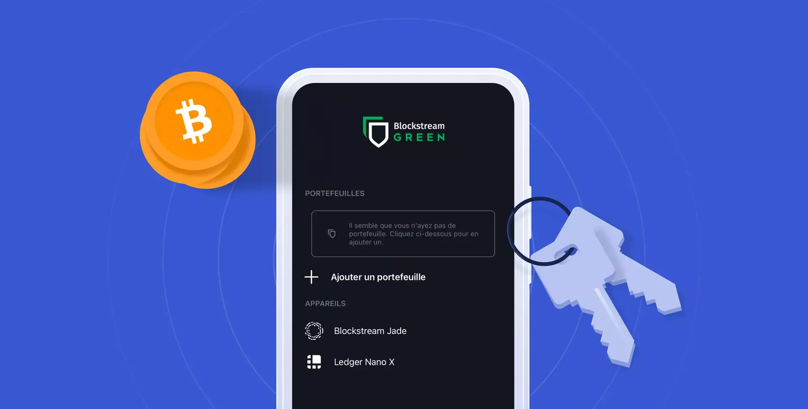
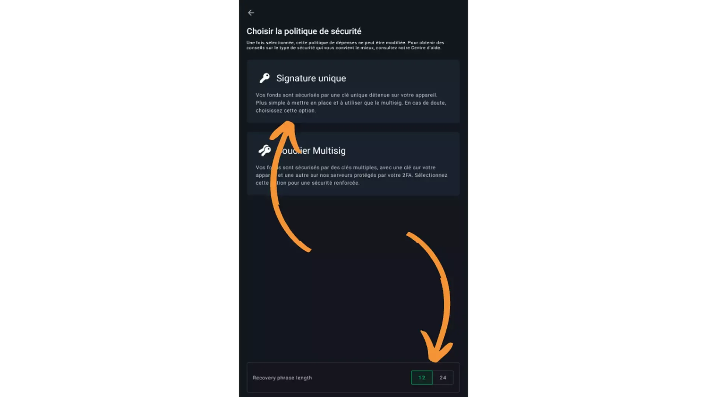
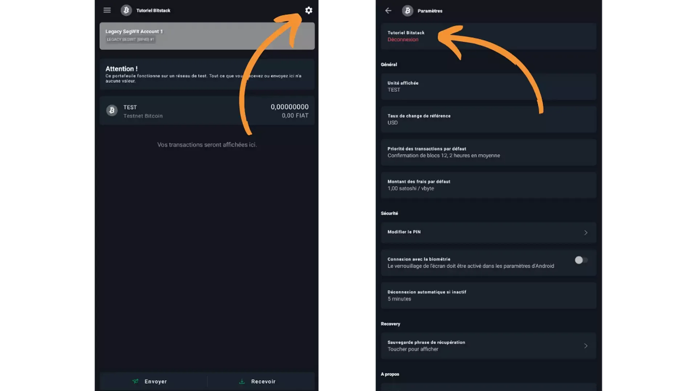
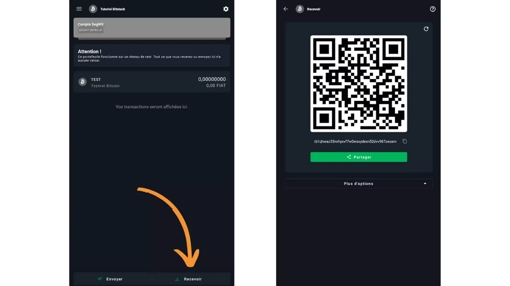

ホットモバイルウォレット - 初心者向け - 無料 - 0から1,000ユーロを安全に保管

1,000ユーロ以下の金額を安全に保管するためには、インターネットに接続された無料のホットウォレットが初心者には最適です。その設定は簡単で、インターフェースは初心者向けに設計されています。

彼らのウェブサイトを訪れたい場合は、こちらをクリックしてください (https://blockstream.com/green/)！

## ビデオチュートリアル

## 書面によるチュートリアル

> このガイドはBitstackによって制作され、所有されています。Bitstackはパリに拠点を置くビットコインのネオバンクで、ビットコインに対するDCAを可能にします。このガイドは2023年2月15日にLoic Morelによって書かれました。これは彼らのものです。https://www.bitstack-app.com/blog/installer-portefeuille-bitcoin-green-wallet

初めてのビットコインウォレットをどうやってインストールするか？Green Walletチュートリアル

ビットコインシステムの多くの利点、特に資金の検閲不可能性と押収不可能性を利用したい場合、ビットコインへのアクセスを可能にするキーを個人的に保持する必要があります。

このチュートリアルでは、Green Walletで初めてのウォレットを設定する方法を説明します。このソフトウェアは特に初心者ユーザーに適しています。ビットコインに関する高度な知識がなくても、非常に使いやすいです。

Green Walletはあらゆるタイプのデバイスで利用可能です。このチュートリアルでは、モバイルでの使用方法を見ていきますが、コンピューターにもダウンロードできます。

最初のステップは、明らかにGreen Walletソフトウェアまたはアプリケーションをダウンロードすることです。モバイルを使用している場合は、ストアから簡単にダウンロードできます。公式のアプリケーションダウンロードページにいることを確認してください。こちらがあなたのシステムに応じたページです：

> - Google Play Store
>
> - Apple App Store

コンピューターにソフトウェアをダウンロードする場合は、マシンにインストールする前にバイナリの真正性と完全性を確認することを強くお勧めします。この操作の実行方法については、将来のチュートリアルで説明します。

## アプリケーション設定の選択

アプリケーションを起動すると、ホーム画面に到着します。現時点では、ウォレットはありません。後で、複数のウォレットを作成した場合、ここでそれらを見つけることができます。

ウォレットを作成する前に最初に行うべきアクションは、アプリケーション設定を開いて、最適なものを選択することです。

- 「Enhanced Privacy」は、アプリケーションでスクリーンショットを撮る機能を無効にすることができます。このオプションはプレビューを隠し、電話をロックすると自動的にアプリケーションを保護する機能もあります。これはAndroidでのみ利用可能です；
- その後、すべての接続が暗号化されるようにトラフィックをTor経由でルーティングすることを選択できます。これによりアプリケーションの動作がわずかに遅くなりますが、プライバシーを保護するためにこれを有効にすることをお勧めします；

- 「Testnet」オプションでは、Testnet上にウォレットを作成できます。これはビットコインシステムと全く同じように機能するネットワークですが、それに交換されるビットコインには全く価値がありません。この別のTestnetネットワークは、金銭的なリスクを負うことなくアプリケーションをテストしたいユーザーや開発者によって好まれます。実際のビットコインシステムでGreen Walletを使用したい場合は、このオプションのチェックを外しておけばよいです；

- 「Help Green」オプションでは、Blockstreamがアプリケーションを改善できるように機密情報を送信することができます；

- 「Personal Electrum Server」オプションでは、ネットワーク情報にアクセスし、トランザクションをブロードキャストするために、自分のリモートビットコインノードを接続できます；
- 「SPV検証」オプションを使用すると、ブロックチェーンから特定の情報を自分でダウンロードして検証することができます。これにより、Blockstreamノードを信頼する必要が減ります。ただし、このオプションは本物のBitcoinノードのすべての保証を提供するわけではないことに注意してください。しかし、ノードを持っていない場合は、有効にする良い選択肢となるでしょう。
設定を選択したら、「保存」ボタンをクリックしてからアプリケーションを再起動します。

## Bitcoinウォレットの作成

次のステップは、Bitcoinウォレットを作成することです。これを行うには、以下をクリックしてください：

> - ウォレットを追加する；
> - 新しいウォレット；
> - Bitcoin。

「ウォレットを復元」オプションを使用すると、ニーモニックフレーズを使用して既存のウォレットへのアクセスを回復することができます。「ウォッチオンリーウォレット」オプションを使用すると、資金を使うことなくウォレットの動きを表示するために拡張公開キー（xpub）をインポートできます。

> 「ウォッチオンリーウォレットは、ハードウェアウォレットを持っている場合に特に便利です。xpubを携帯電話にインポートして受信アドレスを作成し、ハードウェアウォレットにホストされているウォレットの残高を追跡できます。」
> ネットワークオプションを使用すると、ウォレットを異なるシステムに接続できます。「Liquid」ネットワークはBitcoinのサイドチェーンです。「Testnet」ネットワークはBitcoinネットワークのコピーですが、価値のないビットコインを使用します。最後に、「Testnet Liquid」ネットワークはLiquidサイドチェーンのTestnetに相当します。このチュートリアルでは、単にBitcoinウォレットを作成したいので、「Bitcoin」ネットワークを選択します。

次に、作成したいウォレットのタイプを尋ねられます。「シングルシグ」ウォレットを作成するのが最も簡単なオプションです。この場合、私たちに属する各UTXO（ビットコインの一部）は、単一のキーペアによってのみロックされます。

「シングルシグネチャ」を選択します。

次に、12語または24語のニーモニックフレーズを選択できます。このフレーズにより、損失、盗難、または携帯電話の損傷の場合に、互換性のあるソフトウェアからウォレットへのアクセスを回復できます。

24語のフレーズは、ブルートフォース攻撃に対して12語のフレーズよりも安全です。しかし、現在、12語のフレーズは十分に安全です。実際には、12語のフレーズを選択すると、NISTによって推奨される最小限の限界をわずかに超えることになります。これは、あなたのフレーズが今日安全であることを意味しますが、計算の進歩により将来的にはそうでなくなる可能性があります（BIP39パスフレーズも使用しない限り）。デフォルトでは、24語のフレーズを選択することをお勧めしますが、最終的な選択はあなた次第です。

その後、ソフトウェアは回復フレーズを提供します。適切な物理媒体に書き留めることによって、正しく保存する必要があります。暗号化されていても、このフレーズをデジタル媒体に保管することは強く勧められません。紙や金属に書き留めるべきです。

このフレーズは、制限なしにウォレットのキーへのアクセスを可能にするため、非常に重要です。これを失うと、携帯電話が動作しなくなった場合にビットコインにアクセスできなくなります。このニーモニックフレーズが盗まれた場合、攻撃者はあなたの資金を取り返しのつかない方法で盗むことができます。

このフレーズの中の単語は一緒に書かれる必要があります。フレーズを分割しないでください！さらに、定義された順序で、それぞれの番号と共に各単語を書き留めることも重要です。順序が乱れたフレーズは役に立ちません。

回復フレーズのセキュリティについてもっと学ぶために、このトピックに関する私の専用記事を読むことを強くお勧めします。

Green Walletでは、フレーズを正しく書き留めたことを確認するために、特定の単語の確認を求められます。

その後、複数のウォレットを作成する場合に他と区別するために、ウォレットの名前を選択できます。この段階では、次のステップでこのウォレットを削除してニーモニックフレーズの有効性を検証するため、名前は重要ではありません。

また、PINの設定を求められます。これは、ウォレットへのアクセスをロックするために使用されます。特に携帯電話が盗まれた場合にウォレットを保護するために、複雑でランダムなパスワードを設定することが推奨されます。

このPINは、Bitcoinウォレット自体とは何の関係もありません。実際、リカバリーフレーズだけが、あなたのビットコインへのアクセスを再び取得するための鍵となります。PINは、あなたの携帯電話上のウォレットへのアクセスをブロックするだけです。したがって、このPINをバックアップするよりも、フレーズをバックアップすることの方がはるかに重要です。

後で、PINを毎回入力するのを避けるために、生体認証ロックオプションを追加することができます。一般的に、生体認証はPIN自体よりもはるかに安全性が低いです。したがって、デフォルトでは、このロック解除オプションの実装に反対します。

選択したPINをGreenアプリケーションで2回入力して、それを確認する必要があります。

おめでとうございます！Bitcoinウォレットの作成を完了しました。

このBitcoinウォレットにBIP39パスフレーズを追加したい場合は、ウォレットのロックを解除するためにPINを入力する際、画面の右上にある三つの点をクリックする必要があります。注意してください、私は導出メカニズムを理解していない場合、パスフレーズの使用に強く反対します。そうすると、ビットコインへのアクセスを失う可能性があります。

## Bitcoinウォレットの回復シミュレーション

新しいウォレットにビットコインを送る前に、ニーモニックフレーズのバックアップが機能していることを確認するために、回復テストを実行することが不可欠です。実際には、ウォレットがまだ空の状態で削除し、携帯電話へのアクセスを失ったかのように、リカバリーフレーズのみを使用して回復を試みます。

フレーズの有効性を検証するだけでなく、この実践はまた、Bitcoinウォレットを回復する方法を練習する機会も提供します。したがって、もし緊急事態に遭遇した場合、資金へのアクセスを取り戻すために必要な手順を正確に知っているでしょう。

これを行うには、ウォレットを削除する前に、後でそれを認識するために必要な参照情報を取得する必要があります。そのために、「受け取る」ボタンをクリックします。ウォレットはアドレスを表示します。そのアドレスの最後の8文字を別の紙に書き留めてください。これはアドレスのチェックサムに相当します。

例えば、私のウォレットでは、メモするべき8文字は次のとおりです：JTbP4482。

この情報をメモしたら、ウォレットを削除できます。ウォレットのホーム画面から設定アイコンをクリックし、「Disconnect」をクリックします。

> 「この操作は、ビットコインを送る前に空のウォレットで行う必要があることをもう一度強調します。そうしないと、それらを失うリスクがあります。」

その後、ウォレットのロック解除画面に移動します。画面の右上隅にある三つの点をクリックし、「Delete Wallet」をクリックして、確認します。

Green Walletアプリケーションのホーム画面にいる状態で、利用可能なウォレットがありません。まるで携帯電話を紛失したり壊れたりした場合と同じ状況にあり、ニーモニックフレーズのみからウォレットを回復しようとしています。

まず「Add Wallet」をクリックし、「Restore Wallet」、そして最後に「Bitcoin」と進んでください。

その後、ソフトウェアはQRコードから回復するか、ニーモニックフレーズから回復するかを尋ねます。この場合、フレーズです。

次に、回復フレーズを入力するように求められます。これは、ウォレットを作成する際に書き留めたフレーズです。24語のフレーズを使用している場合は、「24」という小さなボックスをクリックすることを忘れないでください。

すべての単語を入力した後、ソフトウェアがエラーであると告げる場合、フレーズのチェックサムが正しくないことを意味します。この場合、ニーモニックフレーズの紙のバックアップが無効であることを意味します。このチュートリアルを最初からやり直し、与えられたときにフレーズを正しく書き留めるようにしてください。

そうでなければ、「Continue」をクリックできます。

ソフトウェアは「Wallet not found」と表示します。これは完全に正常です。なぜなら、現時点ではまだビットコインを送金していないため、このウォレットに関連するブロックチェーン上のトランザクションを検出できないからです。

画面の下部にある「Manual Restore」をクリックし、次に「Single Signature」をクリックします。

最後に、このウォレットに名前を付け、PINを割り当てるよう求められます。初期ウォレットと同じ名前とPINを付けることができます。
リマインダーとして、このPINはこのアプリケーションおよびこの特定の電話でウォレットのロックを解除するためにのみ役立ちます。回復フレーズとは異なり、他のソフトウェアやハードウェアでウォレットを再生成することはできません。

PINが確認されると、ウォレットのホームページに戻ります。回復フレーズが機能しているかどうかを確認する時が来ました。これを行うには、もう一度「Receive」をクリックして最初のアドレスにアクセスします。

ウォレットを削除する前に紙に目撃者として記録したものと最後の8文字が完全に同じであれば、フレーズは有効です。私の場合、最初のアドレスのチェックサムが以前に記録した値と確かに等しいことがわかります：JTbP4482。

この検証練習は面倒ですが、ビットコインウォレットの適切なセキュリティを確保するためには絶対に必要です。ウォレットを作成する際、ソフトウェアでもハードウェアでも、この習慣を身につけることを強くお勧めします。

Green Walletでは、このプロセスを実行するために最初のアドレスを使用しました。しかし、拡張公開キー（xpub/zpub）やプライベートキーのマスターフィンガープリントも目撃情報として取ることができます。

## Green Wallet Bitcoin Walletの使用

ウォレットが設定され、検証されたら、使用を開始できます。

始めるにあたり、ウォレットの設定をカスタマイズすることをお勧めします。これを行うには、画面右上隅にある設定アイコンをクリックします。

- 「Displayed Unit」オプションでは、ウォレットで使用される単位をカスタマイズできます。資金が少ない場合は、ビットコインではなくsats（サトシ）でウォレットを表示することが適切かもしれません。サトシ（sat）はビットコインの1億分の1に相当します：1 BTC = 100,000,000 sats。
- 「デフォルト手数料額」オプションでは、トランザクションにデフォルトで割り当てられる手数料をカスタマイズできます。vbyte（仮想バイト）あたりの手数料が高いほど、トランザクションの確認が速くなります。後で、ビットコインネットワークの混雑状況に基づいて、発行する各トランザクションの手数料率を変更することができます。
- 「生体認証接続」オプションでは、PINコードの代わりに指紋でウォレットのロックを解除できます。一般的に、このオプションを有効にすることはお勧めしません。生体認証はPINコードよりもはるかに安全性が低いです。

デフォルトでは、Green WalletはBIP49「ネストされたSegWit」アカウントを割り当て、P2SH（Pay to Script Hash）アドレスを使用します。数年前、このタイプのアカウントを使用することは、まだすべての人がネイティブSegWitアドレスをサポートしていなかったため、関連性がありました。今日では、ビットコイン関連サービスの大多数がSegWitをサポートしているため、「ネストされたSegWit」アカウントを使用する理由はもうありません。

これから、すべての利点を享受するために、新しいBIP84「ネイティブSegWit」アカウントを作成し、P2WPKH（Pay to Witness Public Key Hash）アドレスも持つことにします。これを行うには、「レガシーSegWitアカウント」をクリックし、「新しいアカウントを追加」を選択し、最後に「SegWitアカウント」をクリックします。希望があれば、このアカウントに名前を付けることができます。

将来、このウォレットで新しいアカウントを作成する必要がある場合は、デフォルトでSegWit V0 BIP84アカウントを選択することをお勧めします。または、利用可能な場合はSegWit V1 BIP86を選択してください。

ウォレットのホームページでは、新しいSegWitアカウントを含む、さまざまなアカウントを確認できます。

次に、Green Walletアプリケーションの操作は非常にシンプルです。ウォレットにビットコインを受け取るには、「受け取る」ボタンをクリックします。ウォレットは受信アドレスを表示します。アドレスを使用すると、ウォレットにビットコインを受け取ることができます。テキスト形式でコピーして支払い人に送るか、別のビットコインウォレットでQRコードをスキャンしてアドレスに支払うことができます。

このタイプのアドレスは、支払い人に送るべき金額を示しません。支払い人に選択した金額を自動的に要求するアドレスも作成できます。これを行うには、「その他のオプション」をクリックし、希望の金額を入力します。

SegWit V0 BIP84アカウントを使用している場合、アドレスはプレフィックス「bc1q」で始まるはずです。私の例では、テストネットウォレットを使用しているため、プレフィックスはあなたのものとは少し異なります。

受信アドレスは複数回使用すべきではありません。これはプライバシーにリスクをもたらす悪い習慣です。「受け取る」をクリックすると、Greenウォレットはデフォルトで新しいアドレスを生成します。前のアドレスが既に使用されている場合、ウォレットにリンクされた新しい空白のアドレスを要求するために、回転矢印アイコンをクリックすることもできます。

> 「ヒント：受信アドレスをコピーして貼り付けるとき、アドレスの各文字が正しいかを確認する必要はありません。実際、アドレスには小さな入力ミスを検出するためのチェックサムが含まれています。アドレスの有効性を確認するためには、アドレスの最初と最後の文字をチェックするだけで十分です。」
> 下のスクリーンショットでは、私がアドレスに0.02 btcを送ったことがわかります。トランザクションはGreenに「未確認」として表示され、マイナーによってブロックチェーンに含まれるのを待っています。トランザクションが複数の確認を受け取ると、ビットコインを自分のウォレットで正常に受け取ったことになります。

ビットコインを送金したい場合、送金先の受取アドレスを取得し、「送信」ボタンをクリックする必要があります。次のページでは、宛先アドレスを入力する必要があります。手動で入力するか、対応するアイコンをクリックしてQRコードをスキャンすることができます。次に、取引額を選択します。ビットコインでの金額、または白い矢印をクリックして米ドルでの金額を入力することができます。

画面の中央で、この取引に割り当てられる手数料率を選択できます。アプリケーションの推奨に従うか、手数料をカスタマイズすることができます。設定した手数料が他の確認待ちの取引と比較して高いほど、取引が含まれる速度が速くなり、その逆も同様です。

「次へ」をクリックします。すると、取引の詳細が表示される画面に到着します。入力したアドレスが正しいこと、金額が送りたい額に合致していること、手数料が正しいことを確認できます。

取引を署名し、ビットコインネットワークにブロードキャストするには、画面下部の緑のボタンを右にスライドします。

あなたの取引は、ビットコインウォレットのダッシュボードに表示されるようになりました。

## 結論

おめでとうございます！これであなたは自己管理型のビットコインウォレットを持つことになりました。あなたのビットコインは本当にあなたのものです。

BlockstreamのこのGreen Walletは、ビットコインを少量持つ初心者にとって優れたソリューションです。ご覧の通り、非常に使いやすいです。しかし、それでもホットウォレットです。ビットコインを大量に持っている場合は、ハードウェアウォレットの使用をお勧めします。

Green Walletをマスターし、そのメカニズムを理解したら、Samourai WalletやSparrow Walletのようなより包括的なソリューションを探求できます。
最後に、リカバリーフレーズのバックアップを絶対に大切にすることを再度お伝えします。これはビットコインへの直接かつ制限のないアクセスを提供します。これを失うと、携帯電話が紛失、破損、盗難にあった場合、ビットコインを回復することはできなくなります。このフレーズにアクセスできる人は誰でもあなたのビットコインを盗むことができ、回復する方法はありません。

> このガイドはBitstackによって制作され、所有されています。Bitstackはパリに拠点を置くビットコインのネオバンクで、ビットコインに対するDCAを可能にします。ガイドは2023年2月15日にLoic Morelによって書かれました。これは彼らのものです。[元の記事へのリンク](https://www.bitstack-app.com/blog/installer-portefeuille-bitcoin-green-wallet)