## 比特币硬件钱包 - 入门级打造

**受众：** 对打造硬件充满好奇心但几乎没有开发经验的爱好者。

**时长：** 2 小时（时间灵活）

**学习成果：** 课程结束时，学员将：

* 了解自我手动硬件钱包与商用设备的安全模型差异。
* 组装基于微控制器的签名设备。
* 刷写开源固件并验证编译校验和。
* 使用新设备对主网交易进行签名和广播。

---

## 课程简介

本 2 小时工作坊旨在指导初学者将开源 Jade 固件刷写到售价 15 美元的 LilyGO T-Display 开发板上，从而搭建一个功能齐全的比特币硬件钱包。学员将通用开发硬件改造为可与售价 150 美元的商用钱包媲美的签名设备，并通过实践而非单纯的理论学习安全基础知识。

### 理念

构建自己的签名设备不仅仅是为了省钱——更重要的是理解保护比特币的技术。本次研讨会倡导以理解带来安全，而非依赖盲目信任。通过自行采购组件、刷写开源固件以及生成熵值，学员们在降低供应链风险的同时，学会批判性地评估安全声明。最终目标是实现知情自主：学员们应该了解其自制设备与成熟的商业设备相比的优势和局限性。

---

## 入门概念（15 分钟）

### 什么是自我保管以及它为何如此重要？

比特币的诞生是为了消除货币体系中对银行和公司等受信任第三方机构的依赖。比特币不依赖信任，而是运用数学、物理学和密码学，让任何人都能拥有和控制自己的资金，而无需任何人的许可。

其运作方式是，比特币存在于一个名为区块链（又称比特币时间链）的全球数字账本上。区块链是一个由计算机运行的公开透明的账本，而非像银行账户那样的中心化账本。

需要理解的关键是，要将比特币从一个地方转移到另一个地方，您必须使用所谓的私钥对交易进行签名。您可以将其想象成用密码打开金库，并将比特币转移到另一个人的金库。比特币赋予您掌控金库密钥的权力，而不是依赖银行来转移您的资金。

能力越大，责任越大。丢失私钥，您的资金将永远消失。这样，您可以把金库的密钥想象成金钱本身。虽然密钥和比特币并非同一概念，但它们是转移资金的机制，因此保护起来至关重要。这就是我们常说的 “不是您的密钥，不是您的比特币”。

自我保管这个词听起来可能有点复杂，但它的意思很简单：持有自己的私钥，掌控自己的比特币。如果您不持有私钥，就等于委托他人代为保管。如果您的比特币存放在ETF或交易所（例如 Mt. Gox、FTX、Coinbase、Binance 等）中，您并不拥有比特币，而只是拥有比特币的所有权。这会带来各种风险，例如交易所被黑客攻击导致您的比特币丢失，或者公司借出您的资金却只给您一部分作为储备金。此外，受信任的第三方机构将完全控制您的资金，并可能限制或冻结您的提款。

通过自我托管，您就不再需要信任。没有人可以冻结您的资金或拒绝交易，您可以跨越国界，随时随地向任何人汇款，您不需要银行账户、身份证或任何人的批准。没有人可以阻止您、审查您或窃取您的资金，这就释放了比特币作为自由货币的全部力量。这就是为什么我们说，有了比特币，您就可以成为自己的银行。

比特币的诞生是为了解决信任和货币被操纵的问题，为人们提供了一种退出现有体系的选择，但这种退出只有在您掌握密钥的情况下才有效。这就是自保如此重要的原因。

### 何为钱包？

“钱包” 这个词其实有点名不副实，因此容易让人困惑。没错，比特币钱包和实体钱包一样，确实可以存储价值。但主要区别在于，比特币钱包实际上并不存储任何比特币。

比特币只存在于公共区块链的账本条目中，或者说存在于网络空间的虚拟金库中。记住，要转移比特币，您必须使用私钥来解锁金库，并将比特币转移到其他地方。私钥才是用来花费比特币的。当您使用钱包进行交易时，您实际上只是用私钥来签署交易。这证明了您拥有这些资金，并且有权使用这些比特币。

比特币钱包实际上只是存储您的私钥，所以更准确的说法应该是“密钥链”。

### 热钱包与冷钱包

热钱包是安装在您的手机或电脑上的软件应用程序。它连接到互联网，因此使用起来更方便快捷，交易签名也更快，但这同时也意味着它更容易受到黑客、恶意软件和网络钓鱼的攻击。之所以称之为“热钱包”，是因为它连接到互联网，并且已插电开机。例如手机钱包或浏览器钱包。

另一方面，冷钱包，也称为硬件钱包，是一种离线创建和存储密钥的设备。这可以防止他人窃取您的资金，对于长期储蓄来说更加安全，但它需要用于签署每笔交易，因此可能不太方便。

### 硬件钱包威胁模型

硬件钱包的存在是为了解决一个根本性问题：如何在不将私钥暴露给可能被恶意软件或远程攻击者入侵的联网计算机的情况下签名比特币交易？其核心威胁模型假设您日常使用的笔记本电脑或手机都可能存在恶意行为。硬件钱包创建了一个隔离环境，私钥永远不会离开设备，交易签名在安全元件或微控制器中进行，该元件或微控制器只将签名传回主机，而不会将密钥本身传回主机。即使您的计算机完全被攻破，攻击者也无法在没有物理接触设备和您的 PIN 码的情况下窃取您的比特币。

然而，硬件钱包也存在自身的安全隐患。您必须确保制造商没有植入后门，供应链没有被篡改，并且随机数生成器确实具有真正的随机性。物理攻击者可能通过侧信道攻击或芯片篡改来窃取密钥，而拥有临时访问权限的人也可能修改您的设备。构建自己的硬件钱包有助于您了解这些权衡取舍——您需要决定是使用安全元件还是通用微控制器，如何在显示屏上验证交易，以及如何防范远程和物理威胁。我们的目标并非追求绝对安全，而是了解您正在防范哪些威胁，以及哪些威胁仍然存在。

### 关键概念

- **熵和助记词：** 您的钱包的安全性取决于生成它的随机性。我们将结合设备的随机数生成器和一些便于理解的方法（例如掷骰子），将生成的随机数转换为 12 或 24 个单词的 [BIP39 助记词](https://github.com/bitcoin/bips/blob/master/bip-0039.mediawiki)，然后带着一份您信任的书面或金属备份离开房间。

- **助记词安全须知：** 将助记词视为您储蓄的万能密钥。切勿在手机或电脑上输入助记词——键盘记录器、屏幕截图和云备份都可能永久泄露助记词。将助记词离线保存，存放在只有您能访问的地方，并在离开前练习大声朗读。

- **安全元件 + 微控制器：** 将安全元件视为保险库，将微控制器视为大脑。安全元件负责保护私钥，防止篡改，而微控制器则负责屏幕、按钮和固件逻辑。请注意，我们目前构建的硬件钱包不包含安全元件。这并不意味着它不安全，只是少了一层保护。

- **信任固件：**固件是钱包的隐形操作系统。务必从已标记的版本下载，检查已发布的哈希值，并理解可复现的构建版本允许多人编译相同的代码并得到完全相同的二进制文件。如果校验和不匹配，则不要签名。
---

## 我们正在构建什么？

我们采用通用硬件 LilyGo T-Display，并在其上烧录 Jade SDK 固件。[Jade Plus](https://blockstream.com/jade/jade-plus/) 是一个开源钱包，通常售价为 150 美元：

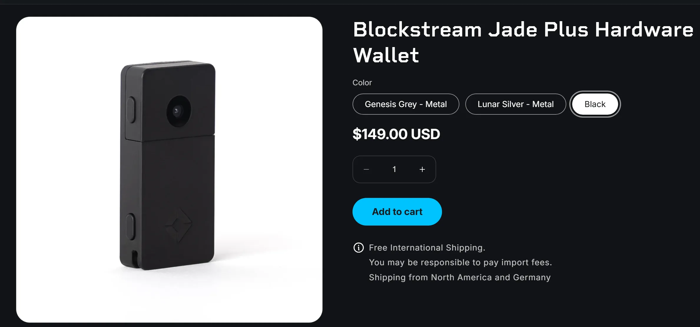

今天，我们将把他们的固件闪存到 15 美元的硬件上。

### 需要购买的物品

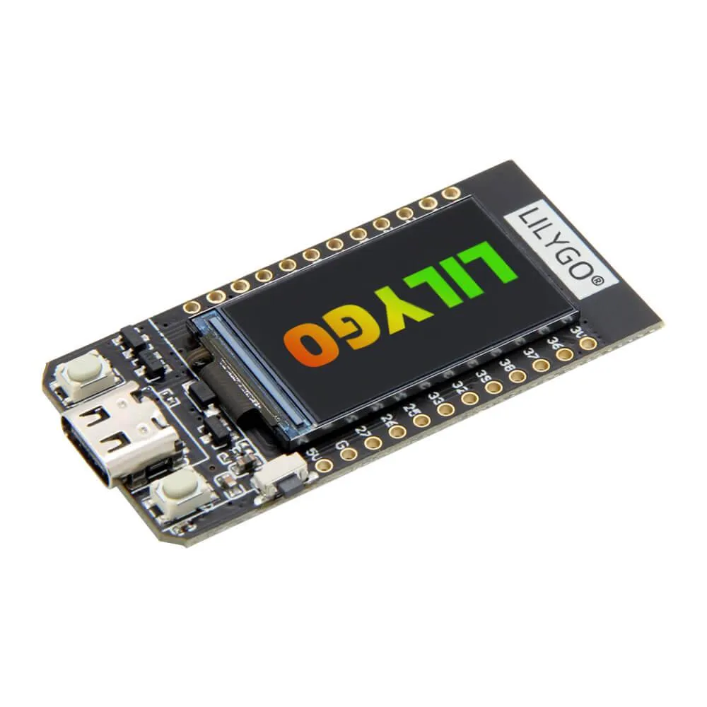

- **LilyGO T-Display（16MB 带外壳，型号 K164）** — [直接从 LilyGO 订购](https://lilygo.cc/products/t-display?srsltid=AfmBOornob5U3FzZifuSwBBOdeXKcdPDqkYEnAVYKBLdzl0BPyNglGBR) 价格约为 15 美元。该 ESP32 板提供了与 Blockstream 的 Jade Plus 相似的显示屏、按钮和 USB 接口。板载 ESP32 还包括 Wi-Fi 和蓝牙无线电；我们将发布使它们保持禁用状态的固件，但它们会塑造您的威胁模型，因为恶意代码可以将它们重新打开。
- **USB-C 电缆** — 带上一根具有数据功能的电缆，以便您可以直接从笔记本电脑刷新固件并为开发板供电（完全适合课堂使用）。

### 为什么要打造自己的硬件钱包？

- 与购买商用设备相比，可节省约 135 美元。
- 通过固件烧录、安全元件和钱包卫生营造舒适感。
- 启动额外的签名设备，将节省的费用分散到多个钱包中。
- 通过自行采购和组装每个组件来降低供应链风险。
- 牢记洛普的口头禅：主权和便利总是矛盾的。

## 物理设置

### 准备您的外壳

您有两种方式来安装 LilyGO T-Display 板：3D 打印外壳或 LilyGO 官方外壳。打印外壳可从 [此型号](https://www.printables.com/model/119144-lilygo-ttgo-t-display-enclosure) 找到并打印。它为您的设备提供了一个轻便且可定制的外壳。

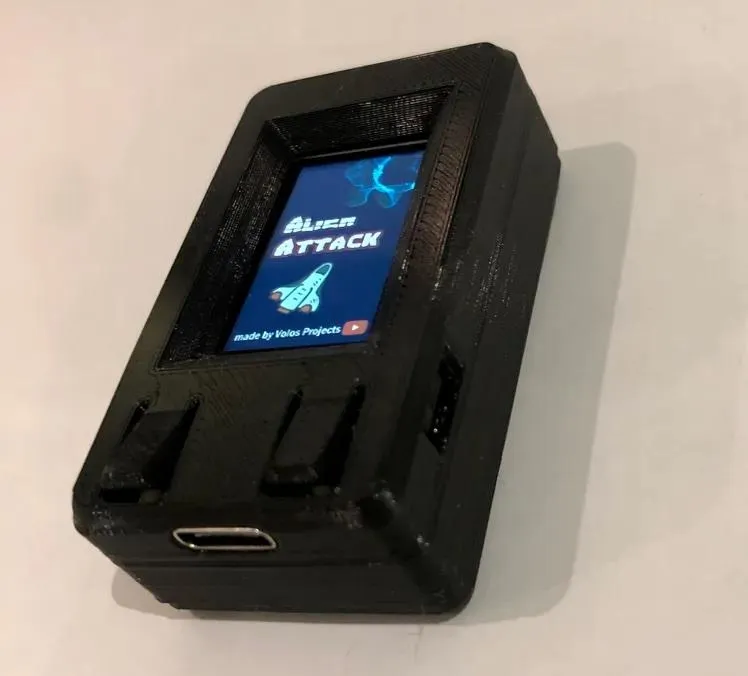

或者，您也可以使用 LilyGO 官方提供的保护套，它的外形和质感略有不同，能提供更坚固的保护和光洁的外观。

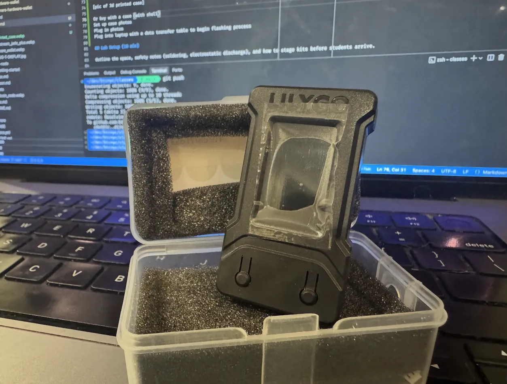

请注意，印刷盒和官方盒在设计和组装方面略有不同。无论您选择哪种选项，请确保电路板正确安装在机箱内，以避免连接松动或损坏。

### 检查电路板

继续之前，请仔细检查您的 LilyGO T-Display 板是否有任何可见的缺陷或碎片。检查显示屏、按钮和 USB-C 端口是否干净，没有灰尘或焊料飞溅。小心处理电路板，并通过将自己接地或使用 ESD 腕带来遵守静电放电 (ESD) 安全，以防止损坏敏感组件。

### 连接到您的笔记本电脑

使用具有数据功能的 USB-C 电缆，将 LilyGO 板连接到您的笔记本电脑。此连接将提供电源并允许您刷新固件。

启动时，您将看到以下页面：

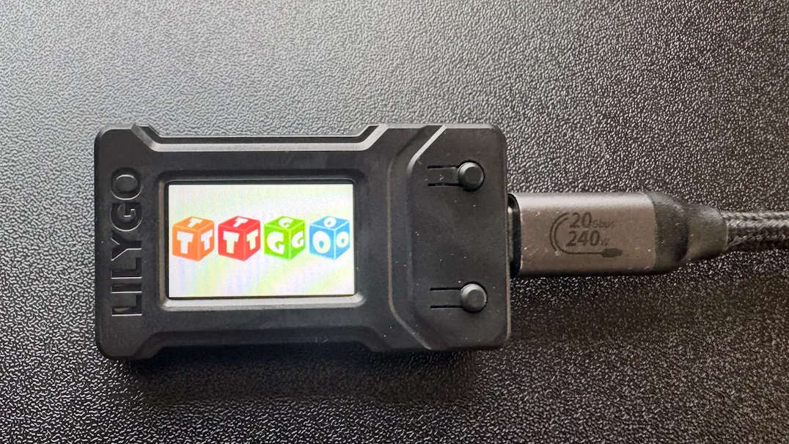

开机后，LilyGO 将显示循环显示纯色的颜色测试屏幕。这可以在刷新固件之前确认显示器和电路板正常工作。

颜色测试完成后，屏幕将处于默认状态，表明电路板已准备好进行构建过程中的后续步骤。

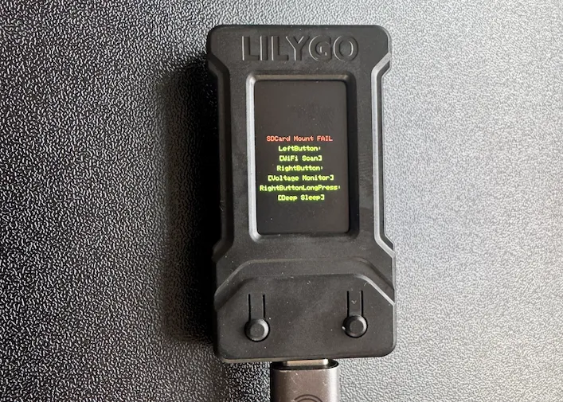

## 简单的方法还是困难的方法？

烧录硬件钱包固件有两种主要方法：简单方法和困难方法。最简单的方法是利用预先配置的工具或基于网络的闪存程序，以最少的输入自动将固件加载到您的设备上。对于想要快速获胜或希望避免调试和命令行交互复杂性的初学者来说，此方法是理想的选择。它简化了流程，让您更快地启动和运行，让那些刚接触嵌入式开发或硬件钱包的人也可以使用它。

另一方面，困难的方法涉及手动使用命令行工具来刷新固件。这种方法需要验证固件签名和校验和以确保真实性和完整性，让您更深入地了解刷新过程以及固件如何与硬件交互。虽然它需要更多的努力和熟悉终端命令，但它提供了更好的控制、透明度和对设备安全性的信心。

每种方法都有其权衡：简单的方法会为了速度和便利而牺牲一定程度的信任和理解，而困难的方法需要更多的时间和技术技能，但会为您带来灵活性和对底层技术的更强掌握。教师应鼓励学生选择最适合他们的舒适度和好奇心的道路，从而培养信心和探索精神。

## 简单方法

烧录 ESP32 的最简单方法

- 访问 Blockstream 官方 Github：[https://github.com/Blockstream/jadediyflasher](https://github.com/Blockstream/jadediyflasher)

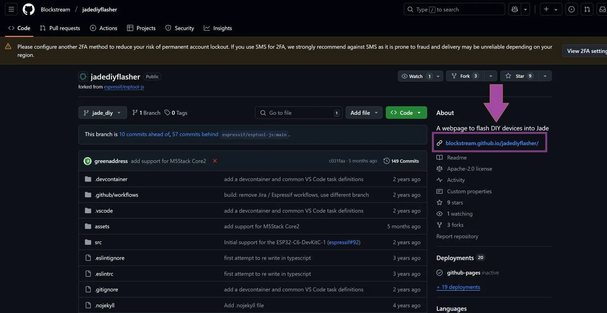

- 您可以下载源文件并在本地运行网站，但 GitHub 已将其托管在 [https://blockstream.github.io/jadediyflasher/](https://blockstream.github.io/jadediyflasher/)。GitHub 会直接将 HTML、CSS、JavaScript 等内容发送到浏览器，因此无需安装开发工具，就能闪存设备。

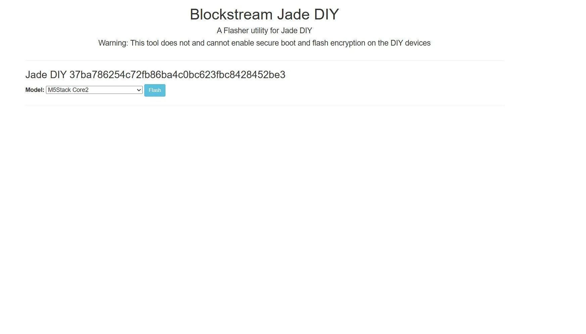

- 打开下拉选单（默认为 "M5Stack Core2"），选择您的开发板--本类选择 "LILYGO T-Display"。

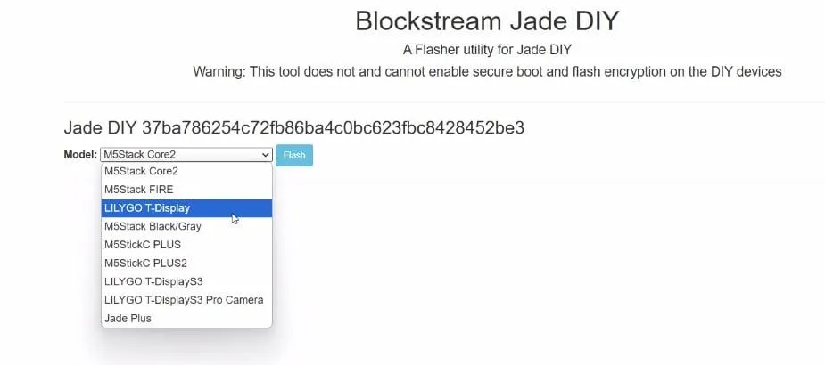

- 点击 "Flash" 后，将会出现此信息。为了知道 LILYGO 是哪个设备，请拔下 lilygo 并重新插入。lilygo 的 com 端口会出现和消失。点击 Jade 插入的 COM 端口

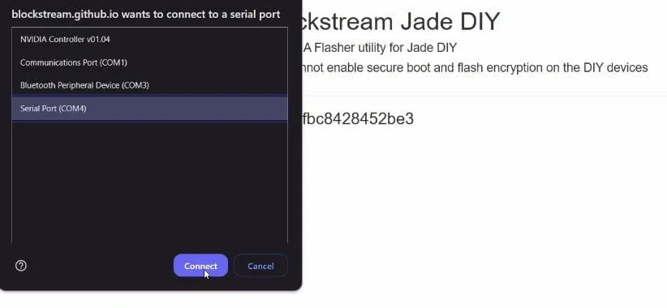

- 进度条会显示出来，完成后就可以进行设置了。

## 设置 Jade Wallet

成功烧录固件后，您的 LilyGO T-Display 现在就是一个功能齐全的 Jade 硬件钱包。本部分将引导您完成初始设置过程，从生成种子短语到将设备与 Sparrow 或 Blockstream Green 移动应用程序等钱包软件连接。

### 初始启动和设备设置

- **打开设备电源：** 当 LilyGO 仍然通过 USB-C 连接到您的笔记本电脑时，Jade 固件应该会自动启动。您将看到显示屏上出现 Jade 徽标。

- **进入设置模式：** 设备将向您显示初始选单。使用板上的两个物理按钮进行导航：
 - **左按钮：** 向上/返回
 - **右键：** 向下/继续
 - **同时按住两个按钮：** 选择/确认

- **选择 “Setup”：** 前往 “Setup” 选项，然后按两个按钮进行确认。该设备将指导您完成初始配置过程。

### 创建您的钱包

- 选择 "Begin Setup"：** 设备将提示您开始钱包创建过程。确认您的选择。

- **Create New Wallet:**：** 您将看到两个选项：
 - **Create New Wallet:**：** 生成一个新的助记词（为该教程选择这个选项）。
 - **Restore Wallet:**：** 从助记词中恢复现有钱包（适用于高级用户）

- 选择 "Create New Wallet" 并确认。

- **生成熵：** 设备将使用随机数生成器生成加密熵。这个过程需要几秒钟，因为设备会从多个来源收集随机数。

### 记录您的助记词

- 写下您的助记词：** 设备现在将显示 12 个单词符的 BIP39 助记词，每次显示一个单词。这是整个过程中最关键的一步。

**重要的安全实践：**
- 在纸上清楚地写下每个单词（如果有的话，使用提供的助记词卡）
- 写下每个单词时要仔细检查
- 切勿用手机拍摄助记词
- 切勿将单词输入任何计算机或手机
- 将您的助记词保密——不要共享您的屏幕或向其他人展示

- **验证您的助记词：** 记下所有 12 个单词后，设备会要求您确认短语中的几个单词，以确保您正确记录它们。使用按钮为每个提示选择正确的单词。

**提示：** 继续之前，练习大声朗读助记词给自己听（小声地，这样其他人就听不到）。这有助于发现任何手写错误或歧义。

### 连接方法

- **选择连接类型：** Jade 固件支持两种连接方式：
 - **USB：** 通过 USB-C 电缆进行有线连接（为该教程，推荐使用这个选项）
 - **Bluetooth（蓝牙）：** 无线连接到移动设备

- 为这个教程，选择 **USB**，因为它是桌面钱包软件最直接的选项，并且不会引入无线攻击媒介。

- **设备命名：** Jade 将显示独特标识符，例如 “Connect Jade A7D924”。如果您最终构建了多个硬件钱包，此标识符可以帮助您区分多个硬件钱包。如果需要，请记下此标识符。

### 连接钱包软件

现在，您有两个主要选项可用于与新创建的硬件钱包进行交互：Blockstream Green 移动应用程序（用于移动使用）或 Sparrow Wallet（用于具有更高级功能的桌面使用）。在本次研讨会中，我们将重点关注 Sparrow Wallet，因为它可以更好地了解比特币交易的技术细节。

#### 选项 1：Blockstream Green 移动应用程序（快速启动）

如果您想使用移动设备快速测试您的设备：

- 从 App Store (iOS) 或 Google Play (Android) 下载 **Blockstream Green** 应用程序
- 打开应用程序并选择 “Connect Hardware Wallet”
- 从支持的设备列表中选择 “Jade”
- 使用 USB-C 转 USB-C 线缆（或适用于 iPhone 15+ 的 USB-C 转 Lightning 适配器）将 Jade 插入手机
- 按照屏幕上的提示连接并创建您的第一个钱包

**关于 Liquid 的注意事项：** Blockstream Green 应用程序支持比特币和 Liquid（比特币侧链）。如果您使用 Liquid 功能，系统可能会提示您“导出主盲密钥”——这允许应用程序查看 Liquid 网络上的交易金额，否则这些交易金额是保密的。在本次研讨会中，您可以跳过 Liquid 功能并专注于标准比特币交易。

#### 选项 2：Sparrow Wallet（推荐用于该教程）

Sparrow Wallet 是一款功能强大的桌面应用程序，可让您精细控制比特币交易，并与 Jade 硬件钱包无缝连接。

**安装：**

- 从官方网站下载 Sparrow Wallet：[sparrowwallet.com](https://sparrowwallet.com)
- 验证下载签名（详细信息请参阅 Sparrow 文档）
- 安装并启动应用程序

**将 Jade 连接到 Sparrow：**

- 在 Sparrow 中，前往 **File → New Wallet**
- 为您的钱包命名（例如“我的 Jade 钱包”）
- 点击 **Connected Hardware Wallet**
- Sparrow 应该自动检测您插入的 Jade 设备
- 如果出现提示，请按两个按钮确认 Jade 显示上的连接
- 选择您想要的脚本类型：
 - **Native Segwit (P2WPKH)：** 推荐给初学者 — 费用最低，与现代钱包最广泛的兼容性
 - **Nested Segwit (P2SH-P2WPKH)：** 为了与旧服务兼容
 - **Taproot (P2TR)：** 最先进，提供最好的隐私和最低的费用，但需要尖端的钱包支持
- 点击 **Import Keystore** 来完成连接

**配置 Sparrow 的服务器连接：**

在您可以查看余额或广播交易之前，Sparrow 需要连接到比特币节点以获取区块链数据。您有多种选择，每种选择在便利性、隐私和信任之间都有不同的权衡：

- **公共电子服务器（最简单，最不私密）：** 连接到第三方运营的公共服务器。设置很快，但服务器可以看到您的钱包地址，并可能将它们链接到您的 IP 地址。适合在测试网上进行测试。 
- 在 Sparrow 中，前往 **Tools → Preferences → Server**
 - 选择 **Public Server** 并从列表中选择一个服务器
 - 点击 **Test Connection** 以进行验证

- **Bitcoin Core 或 Knots 节点（最私密、最有效）：** 运行您自己的比特币全节点。这是隐私和验证的黄金标准，因为您自己验证每笔交易而不信任任何其他人的服务器。但是，它需要下载整个区块链（~600GB）并保持节点同步。 
- 安装并同步 Bitcoin Core 或 Knots
 - 在 Sparrow Wallet 上，前往 **Tools → Preferences → Server**
 - 选择 **Bitcoin Core 或 Knots** 并输入您节点的连接详细信息

- **私人 Electrum 服务器（良好平衡）：** 托管连接到您的 Bitcoin Core 或 Knots 节点的您自己的 Electrum 服务器（如 Fulcrum 或 Electrs）。提供完全的隐私性，无需在与节点相同的计算机上运行 Sparrow。 
- 设置指向您的 Bitcoin Core 或 Knots 节点的 Electrum 服务器
 - 在 Sparrow 中，前往 **Tools → Preferences → Server**
 - 选择 **Private Electrum** 并输入您的服务器的 URL

对于本教程，使用 **Public Electrium Server** 非常适合测试网交易。在拥有真实资金的生产环境中，您需要考虑运行自己的节点或使用受信任的私有服务器以获得最大程度的隐私。

#### 选项 3：Blockstream Green 桌面应用程序（快速启动）

Blockstream Green 是完成自我动手 Jade 设置的软件，必须使用桌面版

- 获取官方 Blockstream 应用程序 - 这是其网站上的链接。当您到达那里时，点击 [Download Now](https://blockstream.com/app/)。

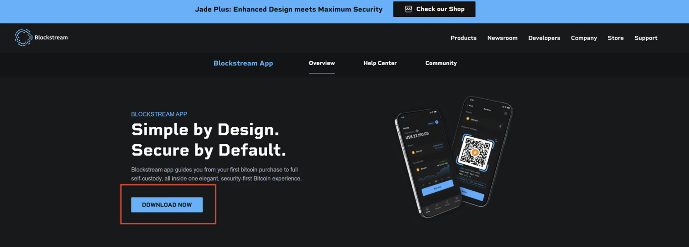

- 根据您的下载位置，该文件很可能被保存到您的 “下载” 文件夹中。检查那里并双击可执行文件来安装软件。
  
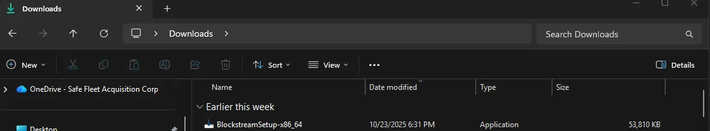

- 您可能必须授予管理员权限才能运行安装程序。完成后，将弹出一个窗口，如下图所示 - 单击 “**Next**”。

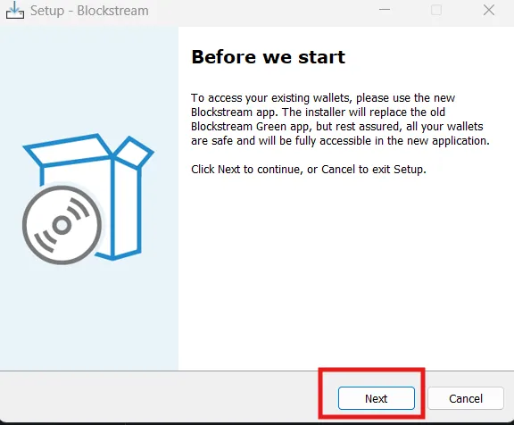

- 选择您希望安装的应用程序的位置（包含其他程序的位置或易于找到的位置），然后点击 “**Next**”。

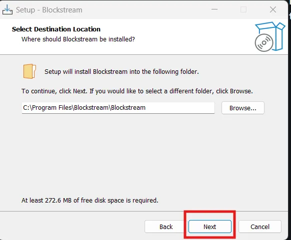

- 安装程序将要求输入快捷方式名称。输入一个或保留默认值，然后点击 **Next**。

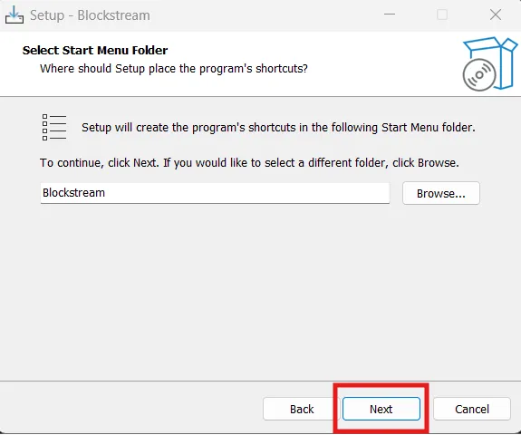

- 如果您想要桌面快捷方式，请选中该框；否则点击 **Next**。

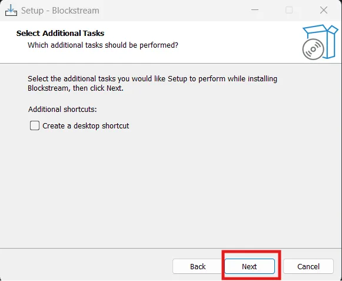

- 最后，点击 **Install**，等待几分钟等待安装完成。

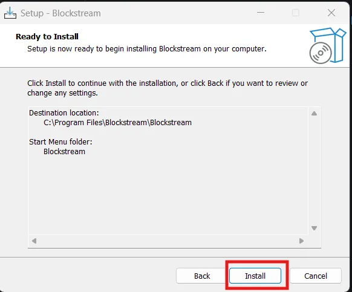

- 进度条应该填满。

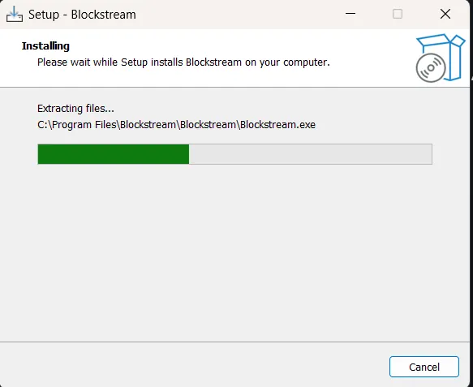

- 完成后，会出现一个新页面，点击 **Finish**。

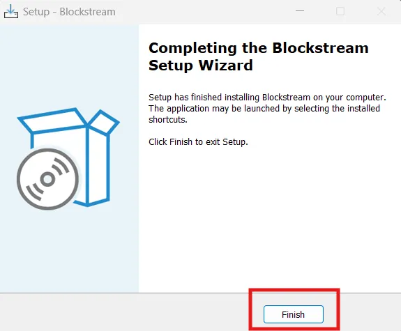

- 查找新安装的 Blockstream 应用程序（示例显示在 Windows 11 开始选单中）。

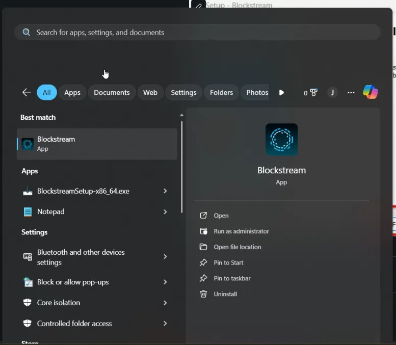

- 找到它后，点击 “Launch” - 应该会出现一个启动屏幕。

### 验证您的设置

连接到 Sparrow（或其他钱包应用程序）后：

- **检查您的地址：** Sparrow 将显示从您的助记词派生的接收地址。您可以通过转到 Sparrow 中的 “Receive” 选项卡并单击 “Display Address” 来验证 Jade 设备上的地址 - 该地址应同时显示在您的计算机屏幕和 Jade 显示屏上。

- **生成接收地址：** 点击 Sparrow 中的 **Receive** 选项卡并复制您的第一个比特币接收地址。

- **准备进行交易：** 您的硬件钱包现已完全配置并准备好接收和签名比特币交易。继续下一部分练习签名测试网交易。

---

### 快速设置清单

- Jade 固件启动成功
- 使用 12 个单词的助记词创建的新钱包
- 清晰写下并被验证的助记词
- 选择 USB 连接模式
- 安装并连接钱包软件（Sparrow）
- 配置服务器连接（主网的公共 Electrum）
- 在设备上生成并验证的第一个接收地址

---
**MIT License**

**Copyright (c) 2025 The Bitcoin Network NYC**

Permission is hereby granted, free of charge, to any person obtaining a copy of this software and associated documentation files (the "Software"), to deal in the Software without restriction, including without limitation the rights to use, copy, modify, merge, publish, distribute, sublicense, and/or sell copies of the Software, and to permit persons to whom the Software is furnished to do so, subject to the following conditions:

The above copyright notice and this permission notice shall be included in all copies or substantial portions of the Software.

THE SOFTWARE IS PROVIDED "AS IS", WITHOUT WARRANTY OF ANY KIND, EXPRESS OR IMPLIED, INCLUDING BUT NOT LIMITED TO THE WARRANTIES OF MERCHANTABILITY, FITNESS FOR A PARTICULAR PURPOSE AND NONINFRINGEMENT. IN NO EVENT SHALL THE AUTHORS OR COPYRIGHT HOLDERS BE LIABLE FOR ANY CLAIM, DAMAGES OR OTHER LIABILITY, WHETHER IN AN ACTION OF CONTRACT, TORT OR OTHERWISE, ARISING FROM, OUT OF OR IN CONNECTION WITH THE SOFTWARE OR THE USE OR OTHER DEALINGS IN THE SOFTWARE.

---
翻译版：

**麻省理工学院许可证**

**版权所有 (c) 2025 年纽约比特币网络**

特此免费授予获得本软件及相关文档文件（“软件”）副本的任何人无限制地处理本软件，包括但不限于使用、复制、修改、合并、发布、分发、再许可和/或出售本软件副本的权利，并允许向其提供本软件的人员这样做，但须满足以下条件：

上述版权声明和本许可声明应包含在本软件的所有副本或主要部分中。

本软件按“原样”提供，不提供任何明示或暗示的保证，包括但不限于适销性、特定用途的适用性和不侵权的保证。在任何情况下，作者或版权所有者均不对因本软件或本软件的使用或其他交易而引起、引起或与之相关的任何索赔、损害或其他责任负责，无论是合同行为、侵权行为还是其他行为。
